# Compose performance

Latest: `2d03ca1f097bc99efacefa5da74c51fea3ab78e7` on 2026-10-31T064416Z, measured on the CI Ubuntu runner by the paired performance shards.
Each value is the median of the candidate arm's samples; p95 is shown beside it. Change compares the previous main commit.

| Benchmark | Median | p95 | Change |
| --- | --- | --- | --- |
| animate-many/compose | 7.55 ms | 8.14 ms | -0.4% |
| animate-many/memory/mounted | 2279 KiB | 2279 KiB | -0.4% |
| animate-many/memory/teardown | 0 KiB | 0 KiB | — |
| animate-many/plain | 1.65 ms | 2.02 ms | +0.4% |
| animated-navigation.extreme/compose/burst | 9.69 ms | 11.23 ms | +6.0% |
| animated-navigation.extreme/compose/cold | 12.54 ms | 14.74 ms | +23.0% |
| animated-navigation.extreme/compose/counts | 98.23 ms | 98.23 ms | +9.1% |
| animated-navigation.extreme/compose/settle | 1.2 µs | 1.6 µs | +81.8% |
| animated-navigation.extreme/compose/steady | 35.82 ms | 37.91 ms | +2.0% |
| animated-navigation.extreme/compose/teardown | 6.07 ms | 8.05 ms | +18.5% |
| animated-navigation.extreme/memory/mounted | 7366 KiB | 7366 KiB | +0.0% |
| animated-navigation.extreme/memory/teardown | 0 KiB | 0 KiB | — |
| animated-navigation.extreme/plain/burst | 1.42 ms | 1.51 ms | +3.0% |
| animated-navigation.extreme/plain/cold | 4.88 ms | 9.05 ms | +0.8% |
| animated-navigation.extreme/plain/settle | 0.9 µs | 1.1 µs | +64.3% |
| animated-navigation.extreme/plain/steady | 19.05 ms | 19.22 ms | +0.6% |
| animated-navigation.extreme/plain/teardown | 3.73 ms | 4.32 ms | +15.3% |
| animated-navigation.large/compose/burst | 4.51 ms | 4.77 ms | +108.4% |
| animated-navigation.large/compose/cold | 5.88 ms | 9.99 ms | +141.6% |
| animated-navigation.large/compose/counts | 66.71 ms | 66.71 ms | +112.8% |
| animated-navigation.large/compose/settle | 1.0 µs | 2.4 µs | +161.1% |
| animated-navigation.large/compose/steady | 29.00 ms | 30.20 ms | +122.3% |
| animated-navigation.large/compose/teardown | 2.26 ms | 2.36 ms | +143.5% |
| animated-navigation.large/memory/mounted | 3696 KiB | 3696 KiB | -0.2% |
| animated-navigation.large/memory/teardown | 0 KiB | 0 KiB | — |
| animated-navigation.large/plain/burst | 684.4 µs | 716.9 µs | +117.7% |
| animated-navigation.large/plain/cold | 1.71 ms | 4.85 ms | +70.2% |
| animated-navigation.large/plain/settle | 0.6 µs | 0.8 µs | +96.1% |
| animated-navigation.large/plain/steady | 8.92 ms | 9.08 ms | +105.1% |
| animated-navigation.large/plain/teardown | 1.03 ms | 1.20 ms | +65.8% |
| animated-navigation.medium/compose/burst | 1.55 ms | 1.69 ms | -0.0% |
| animated-navigation.medium/compose/cold | 1.68 ms | 4.16 ms | +2.3% |
| animated-navigation.medium/compose/counts | 27.06 ms | 27.06 ms | -1.4% |
| animated-navigation.medium/compose/settle | 0.6 µs | 1.2 µs | -8.5% |
| animated-navigation.medium/compose/steady | 11.56 ms | 12.00 ms | +0.7% |
| animated-navigation.medium/compose/teardown | 442.7 µs | 509.9 µs | -4.1% |
| animated-navigation.medium/memory/mounted | 1253 KiB | 1253 KiB | +0.0% |
| animated-navigation.medium/memory/teardown | 0 KiB | 0 KiB | — |
| animated-navigation.medium/plain/burst | 233.4 µs | 281.6 µs | +0.9% |
| animated-navigation.medium/plain/cold | 1.03 ms | 1.49 ms | -2.8% |
| animated-navigation.medium/plain/settle | 0.5 µs | 0.7 µs | +6.8% |
| animated-navigation.medium/plain/steady | 2.61 ms | 2.71 ms | -27.0% |
| animated-navigation.medium/plain/teardown | 205.2 µs | 281.8 µs | +5.8% |
| branch-swap/compose | 4.03 ms | 5.89 ms | +9.2% |
| branch-swap/memory/mounted | 35 KiB | 35 KiB | +34.6% |
| branch-swap/memory/teardown | 1 KiB | 1 KiB | -87.5% |
| branch-swap/plain | 2.94 ms | 4.49 ms | +3.0% |
| cold-mount-100/compose | 814.1 µs | 1.10 ms | +66.8% |
| cold-mount-100/memory/mounted | 2231 KiB | 2231 KiB | +0.3% |
| cold-mount-100/memory/teardown | 0 KiB | 0 KiB | — |
| cold-mount-100/plain | 674.8 µs | 1.22 ms | -8.7% |
| cold-mount-1000/compose | 6.79 ms | 10.12 ms | +40.7% |
| cold-mount-1000/memory/mounted | 21850 KiB | 21850 KiB | +0.0% |
| cold-mount-1000/memory/teardown | 1 KiB | 1 KiB | — |
| cold-mount-1000/plain | 7.10 ms | 11.95 ms | +68.6% |
| cold-mount-10000/compose | 98.05 ms | 98.67 ms | +14.5% |
| cold-mount-10000/memory/mounted | 218941 KiB | 218941 KiB | -0.0% |
| cold-mount-10000/memory/teardown | 0 KiB | 0 KiB | — |
| cold-mount-10000/plain | 73.46 ms | 85.78 ms | +38.5% |
| data-grid.extreme/compose/burst | 838.25 ms | 862.45 ms | -3.5% |
| data-grid.extreme/compose/cold | 517.66 ms | 532.91 ms | -3.2% |
| data-grid.extreme/compose/counts | 1355.78 ms | 1355.78 ms | -7.9% |
| data-grid.extreme/compose/settle | 2.1 µs | 2.4 µs | -3.2% |
| data-grid.extreme/compose/steady | 19.69 ms | 20.60 ms | +1.7% |
| data-grid.extreme/compose/teardown | 1.09 ms | 1.85 ms | -10.1% |
| data-grid.extreme/memory/mounted | 33142 KiB | 33142 KiB | -0.0% |
| data-grid.extreme/memory/teardown | 1 KiB | 1 KiB | -87.5% |
| data-grid.extreme/plain/burst | 800.52 ms | 830.03 ms | +1.2% |
| data-grid.extreme/plain/cold | 508.69 ms | 525.30 ms | +0.1% |
| data-grid.extreme/plain/settle | 2.6 µs | 3.4 µs | +6.5% |
| data-grid.extreme/plain/steady | 18.94 ms | 25.99 ms | +0.7% |
| data-grid.extreme/plain/teardown | 489.6 µs | 718.3 µs | -0.5% |
| data-grid.large/compose/burst | 140.49 ms | 147.55 ms | +97.7% |
| data-grid.large/compose/cold | 79.68 ms | 87.24 ms | +92.5% |
| data-grid.large/compose/counts | 249.16 ms | 249.16 ms | +102.8% |
| data-grid.large/compose/settle | 1.9 µs | 2.8 µs | +137.3% |
| data-grid.large/compose/steady | 14.09 ms | 19.62 ms | +121.2% |
| data-grid.large/compose/teardown | 520.7 µs | 956.0 µs | +105.5% |
| data-grid.large/memory/mounted | 7517 KiB | 7517 KiB | +0.0% |
| data-grid.large/memory/teardown | 0 KiB | 0 KiB | — |
| data-grid.large/plain/burst | 118.62 ms | 123.24 ms | +92.7% |
| data-grid.large/plain/cold | 74.90 ms | 78.60 ms | +96.6% |
| data-grid.large/plain/settle | 2.2 µs | 3.2 µs | +251.7% |
| data-grid.large/plain/steady | 11.34 ms | 16.20 ms | +113.8% |
| data-grid.large/plain/teardown | 204.7 µs | 267.2 µs | +97.0% |
| data-grid.medium/compose/burst | 63.81 ms | 72.28 ms | +1.4% |
| data-grid.medium/compose/cold | 36.73 ms | 39.10 ms | +0.7% |
| data-grid.medium/compose/counts | 125.48 ms | 125.48 ms | +1.1% |
| data-grid.medium/compose/settle | 2.0 µs | 2.1 µs | +47.3% |
| data-grid.medium/compose/steady | 13.55 ms | 17.17 ms | +16.9% |
| data-grid.medium/compose/teardown | 282.0 µs | 448.6 µs | +2.1% |
| data-grid.medium/memory/mounted | 3969 KiB | 3969 KiB | +0.4% |
| data-grid.medium/memory/teardown | 0 KiB | 0 KiB | — |
| data-grid.medium/plain/burst | 54.54 ms | 56.73 ms | +0.9% |
| data-grid.medium/plain/cold | 33.94 ms | 39.35 ms | -1.9% |
| data-grid.medium/plain/settle | 2.1 µs | 3.3 µs | +18.8% |
| data-grid.medium/plain/steady | 7.05 ms | 9.80 ms | +7.8% |
| data-grid.medium/plain/teardown | 103.0 µs | 123.3 µs | -0.9% |
| dense-dashboard.extreme/compose/burst | 14.95 ms | 18.91 ms | -11.9% |
| dense-dashboard.extreme/compose/cold | 501.2 µs | 1.68 ms | -4.9% |
| dense-dashboard.extreme/compose/counts | 24.74 ms | 24.74 ms | +6.7% |
| dense-dashboard.extreme/compose/settle | 1.3 µs | 1.8 µs | -17.5% |
| dense-dashboard.extreme/compose/steady | 886.8 µs | 912.8 µs | -3.9% |
| dense-dashboard.extreme/compose/teardown | 544.9 µs | 748.0 µs | -8.7% |
| dense-dashboard.extreme/memory/mounted | 1261 KiB | 1261 KiB | -0.6% |
| dense-dashboard.extreme/memory/teardown | 0 KiB | 0 KiB | -100.0% |
| dense-dashboard.extreme/plain/burst | 6.95 ms | 11.12 ms | -6.3% |
| dense-dashboard.extreme/plain/cold | 235.0 µs | 909.9 µs | -5.6% |
| dense-dashboard.extreme/plain/settle | 0.9 µs | 1.2 µs | -18.6% |
| dense-dashboard.extreme/plain/steady | 132.1 µs | 145.6 µs | -6.0% |
| dense-dashboard.extreme/plain/teardown | 219.1 µs | 390.5 µs | -13.3% |
| dense-dashboard.large/compose/burst | 7.00 ms | 10.79 ms | +124.3% |
| dense-dashboard.large/compose/cold | 407.0 µs | 922.5 µs | +194.5% |
| dense-dashboard.large/compose/counts | 15.23 ms | 15.23 ms | +115.1% |
| dense-dashboard.large/compose/settle | 0.9 µs | 1.0 µs | +87.4% |
| dense-dashboard.large/compose/steady | 875.6 µs | 917.4 µs | +104.3% |
| dense-dashboard.large/compose/teardown | 257.1 µs | 424.5 µs | +110.2% |
| dense-dashboard.large/memory/mounted | 675 KiB | 675 KiB | +0.0% |
| dense-dashboard.large/memory/teardown | 0 KiB | 0 KiB | — |
| dense-dashboard.large/plain/burst | 3.56 ms | 4.64 ms | +141.2% |
| dense-dashboard.large/plain/cold | 132.8 µs | 279.6 µs | +120.6% |
| dense-dashboard.large/plain/settle | 0.7 µs | 0.8 µs | +70.1% |
| dense-dashboard.large/plain/steady | 131.4 µs | 146.4 µs | +84.7% |
| dense-dashboard.large/plain/teardown | 109.7 µs | 133.7 µs | +103.3% |
| dense-dashboard.medium/compose/burst | 2.98 ms | 4.50 ms | -10.5% |
| dense-dashboard.medium/compose/cold | 216.3 µs | 672.2 µs | +5.7% |
| dense-dashboard.medium/compose/counts | 5.63 ms | 5.63 ms | -0.8% |
| dense-dashboard.medium/compose/settle | 0.7 µs | 1.0 µs | +9.0% |
| dense-dashboard.medium/compose/steady | 854.8 µs | 905.5 µs | -1.0% |
| dense-dashboard.medium/compose/teardown | 110.4 µs | 183.2 µs | +4.2% |
| dense-dashboard.medium/memory/mounted | 334 KiB | 334 KiB | -2.1% |
| dense-dashboard.medium/memory/teardown | 0 KiB | 0 KiB | — |
| dense-dashboard.medium/plain/burst | 1.26 ms | 2.23 ms | +12.2% |
| dense-dashboard.medium/plain/cold | 89.2 µs | 488.7 µs | -47.5% |
| dense-dashboard.medium/plain/settle | 0.7 µs | 1.7 µs | +8.2% |
| dense-dashboard.medium/plain/steady | 128.7 µs | 148.4 µs | +0.5% |
| dense-dashboard.medium/plain/teardown | 52.0 µs | 73.2 µs | -2.9% |
| entities-identity-churn-10.extreme/compose/burst | 42.96 ms | 53.15 ms | -9.5% |
| entities-identity-churn-10.extreme/compose/cold | 25.60 ms | 38.79 ms | +0.2% |
| entities-identity-churn-10.extreme/compose/counts | 203.87 ms | 203.87 ms | -2.5% |
| entities-identity-churn-10.extreme/compose/settle | 1.9 µs | 2.9 µs | -17.3% |
| entities-identity-churn-10.extreme/compose/steady | 45.80 ms | 51.55 ms | -12.3% |
| entities-identity-churn-10.extreme/compose/teardown | 965.3 µs | 1.92 ms | -15.1% |
| entities-identity-churn-10.extreme/memory/mounted | 4416 KiB | 4416 KiB | -0.2% |
| entities-identity-churn-10.extreme/memory/teardown | 0 KiB | 0 KiB | — |
| entities-identity-churn-10.extreme/plain/burst | 14.71 ms | 21.93 ms | -9.2% |
| entities-identity-churn-10.extreme/plain/cold | 10.42 ms | 13.90 ms | +4.6% |
| entities-identity-churn-10.extreme/plain/settle | 1.5 µs | 2.1 µs | -24.4% |
| entities-identity-churn-10.extreme/plain/steady | 29.12 ms | 31.98 ms | -0.6% |
| entities-identity-churn-10.extreme/plain/teardown | 350.7 µs | 466.3 µs | -9.9% |
| entities-identity-churn-10.large/compose/burst | 13.07 ms | 15.90 ms | -0.0% |
| entities-identity-churn-10.large/compose/cold | 12.62 ms | 18.04 ms | +19.5% |
| entities-identity-churn-10.large/compose/counts | 59.60 ms | 59.60 ms | -1.2% |
| entities-identity-churn-10.large/compose/settle | 1.3 µs | 1.8 µs | +13.1% |
| entities-identity-churn-10.large/compose/steady | 16.45 ms | 23.30 ms | +4.5% |
| entities-identity-churn-10.large/compose/teardown | 361.9 µs | 539.2 µs | +5.8% |
| entities-identity-churn-10.large/memory/mounted | 1721 KiB | 1721 KiB | -0.7% |
| entities-identity-churn-10.large/memory/teardown | 0 KiB | 0 KiB | — |
| entities-identity-churn-10.large/plain/burst | 4.73 ms | 6.32 ms | +3.6% |
| entities-identity-churn-10.large/plain/cold | 3.43 ms | 7.38 ms | +27.8% |
| entities-identity-churn-10.large/plain/settle | 0.9 µs | 1.3 µs | -1.0% |
| entities-identity-churn-10.large/plain/steady | 11.41 ms | 13.25 ms | +6.5% |
| entities-identity-churn-10.large/plain/teardown | 113.0 µs | 148.7 µs | -9.5% |
| entities-identity-churn-10.medium/compose/burst | 8.75 ms | 10.90 ms | +31.2% |
| entities-identity-churn-10.medium/compose/cold | 4.87 ms | 7.55 ms | -9.9% |
| entities-identity-churn-10.medium/compose/counts | 33.58 ms | 33.58 ms | -1.6% |
| entities-identity-churn-10.medium/compose/settle | 1.2 µs | 1.4 µs | +14.5% |
| entities-identity-churn-10.medium/compose/steady | 8.13 ms | 9.72 ms | +5.5% |
| entities-identity-churn-10.medium/compose/teardown | 198.4 µs | 355.3 µs | +5.6% |
| entities-identity-churn-10.medium/memory/mounted | 910 KiB | 910 KiB | -0.7% |
| entities-identity-churn-10.medium/memory/teardown | 0 KiB | 0 KiB | -100.0% |
| entities-identity-churn-10.medium/plain/burst | 3.14 ms | 4.46 ms | +46.0% |
| entities-identity-churn-10.medium/plain/cold | 1.95 ms | 2.54 ms | +10.5% |
| entities-identity-churn-10.medium/plain/settle | 0.8 µs | 1.1 µs | +8.6% |
| entities-identity-churn-10.medium/plain/steady | 5.34 ms | 7.20 ms | -4.7% |
| entities-identity-churn-10.medium/plain/teardown | 65.5 µs | 145.3 µs | +18.6% |
| entities-identity-churn-50.extreme/compose/burst | 43.74 ms | 72.30 ms | +16.4% |
| entities-identity-churn-50.extreme/compose/cold | 28.12 ms | 53.70 ms | +5.5% |
| entities-identity-churn-50.extreme/compose/counts | 318.55 ms | 318.55 ms | +8.7% |
| entities-identity-churn-50.extreme/compose/settle | 2.4 µs | 3.1 µs | +25.6% |
| entities-identity-churn-50.extreme/compose/steady | 149.41 ms | 171.53 ms | +7.1% |
| entities-identity-churn-50.extreme/compose/teardown | 1.22 ms | 2.56 ms | +23.6% |
| entities-identity-churn-50.extreme/memory/mounted | 4380 KiB | 4380 KiB | +0.2% |
| entities-identity-churn-50.extreme/memory/teardown | 1 KiB | 1 KiB | — |
| entities-identity-churn-50.extreme/plain/burst | 16.33 ms | 31.90 ms | +11.3% |
| entities-identity-churn-50.extreme/plain/cold | 8.28 ms | 23.14 ms | +11.8% |
| entities-identity-churn-50.extreme/plain/settle | 2.1 µs | 14.3 µs | +14.8% |
| entities-identity-churn-50.extreme/plain/steady | 64.68 ms | 72.73 ms | +6.6% |
| entities-identity-churn-50.extreme/plain/teardown | 378.8 µs | 517.1 µs | +4.6% |
| entities-identity-churn-50.large/compose/burst | 14.47 ms | 17.81 ms | +7.9% |
| entities-identity-churn-50.large/compose/cold | 12.68 ms | 21.07 ms | +16.2% |
| entities-identity-churn-50.large/compose/counts | 103.16 ms | 103.16 ms | -11.5% |
| entities-identity-churn-50.large/compose/settle | 1.7 µs | 2.3 µs | +5.6% |
| entities-identity-churn-50.large/compose/steady | 47.42 ms | 59.74 ms | +3.4% |
| entities-identity-churn-50.large/compose/teardown | 382.1 µs | 509.3 µs | +2.6% |
| entities-identity-churn-50.large/memory/mounted | 1826 KiB | 1826 KiB | +2.0% |
| entities-identity-churn-50.large/memory/teardown | 9 KiB | 9 KiB | — |
| entities-identity-churn-50.large/plain/burst | 6.00 ms | 7.74 ms | +7.8% |
| entities-identity-churn-50.large/plain/cold | 2.90 ms | 10.19 ms | +0.1% |
| entities-identity-churn-50.large/plain/settle | 1.5 µs | 2.0 µs | +30.0% |
| entities-identity-churn-50.large/plain/steady | 21.77 ms | 24.47 ms | +3.9% |
| entities-identity-churn-50.large/plain/teardown | 137.8 µs | 188.8 µs | +11.2% |
| entities-identity-churn-50.medium/compose/burst | 8.27 ms | 13.73 ms | +86.5% |
| entities-identity-churn-50.medium/compose/cold | 4.73 ms | 8.56 ms | +102.2% |
| entities-identity-churn-50.medium/compose/counts | 60.95 ms | 60.95 ms | +98.9% |
| entities-identity-churn-50.medium/compose/settle | 1.2 µs | 2.0 µs | +80.3% |
| entities-identity-churn-50.medium/compose/steady | 23.95 ms | 26.93 ms | +104.8% |
| entities-identity-churn-50.medium/compose/teardown | 231.5 µs | 259.2 µs | +114.9% |
| entities-identity-churn-50.medium/memory/mounted | 1005 KiB | 1005 KiB | +0.1% |
| entities-identity-churn-50.medium/memory/teardown | 1 KiB | 1 KiB | — |
| entities-identity-churn-50.medium/plain/burst | 2.86 ms | 6.64 ms | +25.9% |
| entities-identity-churn-50.medium/plain/cold | 1.37 ms | 3.70 ms | +91.7% |
| entities-identity-churn-50.medium/plain/settle | 0.9 µs | 1.2 µs | +62.8% |
| entities-identity-churn-50.medium/plain/steady | 11.26 ms | 12.99 ms | +108.6% |
| entities-identity-churn-50.medium/plain/teardown | 69.6 µs | 85.1 µs | +42.6% |
| entities-identity-churn.extreme/compose/burst | 47.71 ms | 59.53 ms | +94.8% |
| entities-identity-churn.extreme/compose/cold | 34.78 ms | 50.05 ms | +98.1% |
| entities-identity-churn.extreme/compose/counts | 249.50 ms | 249.50 ms | +96.2% |
| entities-identity-churn.extreme/compose/settle | 2.3 µs | 2.9 µs | +41.0% |
| entities-identity-churn.extreme/compose/steady | 92.33 ms | 105.30 ms | +96.3% |
| entities-identity-churn.extreme/compose/teardown | 1.23 ms | 3.12 ms | +81.0% |
| entities-identity-churn.extreme/memory/mounted | 4824 KiB | 4824 KiB | +2.2% |
| entities-identity-churn.extreme/memory/teardown | 96 KiB | 96 KiB | — |
| entities-identity-churn.extreme/plain/burst | 21.93 ms | 30.97 ms | +107.2% |
| entities-identity-churn.extreme/plain/cold | 9.52 ms | 24.44 ms | +36.8% |
| entities-identity-churn.extreme/plain/settle | 2.0 µs | 2.7 µs | +97.1% |
| entities-identity-churn.extreme/plain/steady | 45.28 ms | 58.93 ms | +68.5% |
| entities-identity-churn.extreme/plain/teardown | 512.7 µs | 858.8 µs | +88.4% |
| entities-identity-churn.large/compose/burst | 14.85 ms | 25.28 ms | +15.1% |
| entities-identity-churn.large/compose/cold | 12.98 ms | 20.75 ms | +20.4% |
| entities-identity-churn.large/compose/counts | 99.82 ms | 99.82 ms | +8.0% |
| entities-identity-churn.large/compose/settle | 2.0 µs | 3.9 µs | +12.0% |
| entities-identity-churn.large/compose/steady | 28.74 ms | 37.62 ms | -4.3% |
| entities-identity-churn.large/compose/teardown | 393.1 µs | 470.2 µs | +7.5% |
| entities-identity-churn.large/memory/mounted | 1722 KiB | 1722 KiB | +0.0% |
| entities-identity-churn.large/memory/teardown | 0 KiB | 0 KiB | — |
| entities-identity-churn.large/plain/burst | 6.01 ms | 9.31 ms | -5.8% |
| entities-identity-churn.large/plain/cold | 2.86 ms | 5.43 ms | -1.3% |
| entities-identity-churn.large/plain/settle | 1.6 µs | 2.3 µs | -0.6% |
| entities-identity-churn.large/plain/steady | 15.55 ms | 20.35 ms | +4.3% |
| entities-identity-churn.large/plain/teardown | 127.5 µs | 160.2 µs | -3.2% |
| entities-identity-churn.medium/compose/burst | 7.90 ms | 13.02 ms | +6.2% |
| entities-identity-churn.medium/compose/cold | 4.48 ms | 6.88 ms | +3.9% |
| entities-identity-churn.medium/compose/counts | 35.01 ms | 35.01 ms | +0.8% |
| entities-identity-churn.medium/compose/settle | 1.3 µs | 2.6 µs | +59.9% |
| entities-identity-churn.medium/compose/steady | 13.11 ms | 19.33 ms | +4.0% |
| entities-identity-churn.medium/compose/teardown | 206.7 µs | 230.2 µs | +3.5% |
| entities-identity-churn.medium/memory/mounted | 967 KiB | 967 KiB | -0.5% |
| entities-identity-churn.medium/memory/teardown | 0 KiB | 0 KiB | -100.0% |
| entities-identity-churn.medium/plain/burst | 2.44 ms | 3.52 ms | -16.0% |
| entities-identity-churn.medium/plain/cold | 1.32 ms | 3.45 ms | +7.2% |
| entities-identity-churn.medium/plain/settle | 0.7 µs | 0.9 µs | -5.1% |
| entities-identity-churn.medium/plain/steady | 7.82 ms | 8.93 ms | +14.8% |
| entities-identity-churn.medium/plain/teardown | 58.8 µs | 74.1 µs | -3.9% |
| entities-integrated.extreme/compose/burst | 20.03 ms | 29.26 ms | +41.6% |
| entities-integrated.extreme/compose/cold | 107.35 ms | 146.45 ms | +33.2% |
| entities-integrated.extreme/compose/counts | 346.07 ms | 346.07 ms | +40.4% |
| entities-integrated.extreme/compose/settle | 2.0 µs | 2.8 µs | +20.5% |
| entities-integrated.extreme/compose/steady | 106.36 ms | 123.20 ms | +39.3% |
| entities-integrated.extreme/compose/teardown | 40.85 ms | 43.21 ms | +30.5% |
| entities-integrated.extreme/memory/mounted | 39905 KiB | 39905 KiB | -0.0% |
| entities-integrated.extreme/memory/teardown | 9 KiB | 9 KiB | +12.5% |
| entities-integrated.extreme/plain/burst | 5.92 ms | 8.57 ms | +23.5% |
| entities-integrated.extreme/plain/cold | 34.53 ms | 63.57 ms | +17.7% |
| entities-integrated.extreme/plain/settle | 2.1 µs | 3.1 µs | +38.9% |
| entities-integrated.extreme/plain/steady | 26.36 ms | 54.84 ms | +27.4% |
| entities-integrated.extreme/plain/teardown | 26.72 ms | 31.02 ms | +13.7% |
| entities-integrated.large/compose/burst | 9.89 ms | 11.97 ms | +100.3% |
| entities-integrated.large/compose/cold | 40.37 ms | 54.31 ms | +79.1% |
| entities-integrated.large/compose/counts | 143.39 ms | 143.39 ms | +111.0% |
| entities-integrated.large/compose/settle | 1.7 µs | 2.3 µs | +84.7% |
| entities-integrated.large/compose/steady | 54.40 ms | 77.15 ms | +115.7% |
| entities-integrated.large/compose/teardown | 12.29 ms | 14.38 ms | +113.5% |
| entities-integrated.large/memory/mounted | 16590 KiB | 16590 KiB | -0.0% |
| entities-integrated.large/memory/teardown | 0 KiB | 0 KiB | -100.0% |
| entities-integrated.large/plain/burst | 3.25 ms | 4.43 ms | +108.5% |
| entities-integrated.large/plain/cold | 11.45 ms | 24.34 ms | +49.5% |
| entities-integrated.large/plain/settle | 1.2 µs | 3.4 µs | +88.9% |
| entities-integrated.large/plain/steady | 13.59 ms | 17.21 ms | +85.0% |
| entities-integrated.large/plain/teardown | 5.72 ms | 7.28 ms | +93.6% |
| entities-integrated.medium/compose/burst | 7.27 ms | 11.96 ms | -6.7% |
| entities-integrated.medium/compose/cold | 19.28 ms | 26.51 ms | +6.7% |
| entities-integrated.medium/compose/counts | 90.37 ms | 90.37 ms | -2.1% |
| entities-integrated.medium/compose/settle | 1.6 µs | 2.2 µs | +5.8% |
| entities-integrated.medium/compose/steady | 37.85 ms | 46.16 ms | -3.3% |
| entities-integrated.medium/compose/teardown | 5.40 ms | 6.08 ms | -6.0% |
| entities-integrated.medium/memory/mounted | 9007 KiB | 9007 KiB | +0.0% |
| entities-integrated.medium/memory/teardown | 0 KiB | 0 KiB | — |
| entities-integrated.medium/plain/burst | 2.32 ms | 4.47 ms | +2.0% |
| entities-integrated.medium/plain/cold | 6.27 ms | 13.25 ms | +3.3% |
| entities-integrated.medium/plain/settle | 1.1 µs | 1.5 µs | -4.3% |
| entities-integrated.medium/plain/steady | 9.87 ms | 13.04 ms | +1.2% |
| entities-integrated.medium/plain/teardown | 2.51 ms | 3.55 ms | +4.4% |
| entities-relevance-saturated.extreme/compose/burst | 78.39 ms | 89.10 ms | +4.1% |
| entities-relevance-saturated.extreme/compose/cold | 32.96 ms | 56.03 ms | +20.5% |
| entities-relevance-saturated.extreme/compose/counts | 223.04 ms | 223.04 ms | +3.7% |
| entities-relevance-saturated.extreme/compose/settle | 2.2 µs | 15.3 µs | +12.4% |
| entities-relevance-saturated.extreme/compose/steady | 53.44 ms | 80.18 ms | +3.7% |
| entities-relevance-saturated.extreme/compose/teardown | 14.15 ms | 16.31 ms | +8.3% |
| entities-relevance-saturated.extreme/memory/mounted | 12758 KiB | 12758 KiB | +0.0% |
| entities-relevance-saturated.extreme/memory/teardown | 0 KiB | 0 KiB | — |
| entities-relevance-saturated.extreme/plain/burst | 19.87 ms | 29.96 ms | +2.4% |
| entities-relevance-saturated.extreme/plain/cold | 9.18 ms | 24.60 ms | +6.2% |
| entities-relevance-saturated.extreme/plain/settle | 2.5 µs | 2.9 µs | +15.0% |
| entities-relevance-saturated.extreme/plain/steady | 94.64 ms | 122.01 ms | +0.5% |
| entities-relevance-saturated.extreme/plain/teardown | 3.65 ms | 4.60 ms | +12.8% |
| entities-relevance-saturated.large/compose/burst | 23.45 ms | 27.08 ms | -9.0% |
| entities-relevance-saturated.large/compose/cold | 12.51 ms | 17.67 ms | +12.9% |
| entities-relevance-saturated.large/compose/counts | 74.55 ms | 74.55 ms | -6.6% |
| entities-relevance-saturated.large/compose/settle | 1.3 µs | 1.7 µs | -32.1% |
| entities-relevance-saturated.large/compose/steady | 23.99 ms | 28.13 ms | +40.2% |
| entities-relevance-saturated.large/compose/teardown | 3.01 ms | 3.43 ms | -5.3% |
| entities-relevance-saturated.large/memory/mounted | 5121 KiB | 5121 KiB | -0.1% |
| entities-relevance-saturated.large/memory/teardown | 0 KiB | 0 KiB | — |
| entities-relevance-saturated.large/plain/burst | 6.95 ms | 11.61 ms | -5.3% |
| entities-relevance-saturated.large/plain/cold | 4.29 ms | 9.30 ms | +9.7% |
| entities-relevance-saturated.large/plain/settle | 2.0 µs | 3.7 µs | +66.7% |
| entities-relevance-saturated.large/plain/steady | 35.75 ms | 43.58 ms | -4.8% |
| entities-relevance-saturated.large/plain/teardown | 1.34 ms | 1.53 ms | +32.8% |
| entities-relevance-saturated.medium/compose/burst | 12.99 ms | 18.18 ms | +0.4% |
| entities-relevance-saturated.medium/compose/cold | 5.30 ms | 10.30 ms | +0.3% |
| entities-relevance-saturated.medium/compose/counts | 36.57 ms | 36.57 ms | -7.8% |
| entities-relevance-saturated.medium/compose/settle | 1.0 µs | 1.6 µs | -35.8% |
| entities-relevance-saturated.medium/compose/steady | 8.09 ms | 12.27 ms | +4.9% |
| entities-relevance-saturated.medium/compose/teardown | 1.15 ms | 1.35 ms | -8.8% |
| entities-relevance-saturated.medium/memory/mounted | 2582 KiB | 2582 KiB | +0.3% |
| entities-relevance-saturated.medium/memory/teardown | 1 KiB | 1 KiB | — |
| entities-relevance-saturated.medium/plain/burst | 3.45 ms | 3.96 ms | -5.9% |
| entities-relevance-saturated.medium/plain/cold | 1.63 ms | 3.25 ms | -6.0% |
| entities-relevance-saturated.medium/plain/settle | 0.8 µs | 1.3 µs | -28.3% |
| entities-relevance-saturated.medium/plain/steady | 16.52 ms | 21.87 ms | -2.0% |
| entities-relevance-saturated.medium/plain/teardown | 384.6 µs | 522.8 µs | -13.2% |
| entities-relevance-sweep.extreme/compose/burst | 108.81 ms | 141.02 ms | +1.0% |
| entities-relevance-sweep.extreme/compose/cold | 30.55 ms | 53.79 ms | -8.6% |
| entities-relevance-sweep.extreme/compose/counts | 342.81 ms | 342.81 ms | +2.2% |
| entities-relevance-sweep.extreme/compose/settle | 2.1 µs | 2.7 µs | -5.4% |
| entities-relevance-sweep.extreme/compose/steady | 114.10 ms | 130.36 ms | -10.4% |
| entities-relevance-sweep.extreme/compose/teardown | 13.06 ms | 15.36 ms | +2.8% |
| entities-relevance-sweep.extreme/memory/mounted | 12742 KiB | 12742 KiB | -0.1% |
| entities-relevance-sweep.extreme/memory/teardown | 0 KiB | 0 KiB | -100.0% |
| entities-relevance-sweep.extreme/plain/burst | 25.48 ms | 63.05 ms | +1.9% |
| entities-relevance-sweep.extreme/plain/cold | 10.65 ms | 28.90 ms | +3.9% |
| entities-relevance-sweep.extreme/plain/settle | 2.3 µs | 3.3 µs | +26.4% |
| entities-relevance-sweep.extreme/plain/steady | 31.60 ms | 43.66 ms | +11.1% |
| entities-relevance-sweep.extreme/plain/teardown | 3.43 ms | 4.17 ms | -10.1% |
| entities-relevance-sweep.large/compose/burst | 41.98 ms | 55.48 ms | +13.1% |
| entities-relevance-sweep.large/compose/cold | 10.58 ms | 18.40 ms | +3.7% |
| entities-relevance-sweep.large/compose/counts | 140.89 ms | 140.89 ms | +7.4% |
| entities-relevance-sweep.large/compose/settle | 1.8 µs | 2.1 µs | +20.7% |
| entities-relevance-sweep.large/compose/steady | 45.77 ms | 57.76 ms | +8.8% |
| entities-relevance-sweep.large/compose/teardown | 3.51 ms | 3.76 ms | +3.9% |
| entities-relevance-sweep.large/memory/mounted | 5129 KiB | 5129 KiB | +0.0% |
| entities-relevance-sweep.large/memory/teardown | 9 KiB | 9 KiB | +800.0% |
| entities-relevance-sweep.large/plain/burst | 11.97 ms | 21.53 ms | +19.2% |
| entities-relevance-sweep.large/plain/cold | 3.89 ms | 15.32 ms | +6.2% |
| entities-relevance-sweep.large/plain/settle | 1.8 µs | 3.1 µs | +67.2% |
| entities-relevance-sweep.large/plain/steady | 10.02 ms | 16.42 ms | -1.4% |
| entities-relevance-sweep.large/plain/teardown | 1.32 ms | 2.23 ms | +19.9% |
| entities-relevance-sweep.medium/compose/burst | 21.54 ms | 30.96 ms | +57.1% |
| entities-relevance-sweep.medium/compose/cold | 5.73 ms | 12.44 ms | +10.8% |
| entities-relevance-sweep.medium/compose/counts | 72.05 ms | 72.05 ms | +31.0% |
| entities-relevance-sweep.medium/compose/settle | 2.0 µs | 2.7 µs | +64.4% |
| entities-relevance-sweep.medium/compose/steady | 22.17 ms | 30.52 ms | +49.2% |
| entities-relevance-sweep.medium/compose/teardown | 1.48 ms | 1.67 ms | +48.9% |
| entities-relevance-sweep.medium/memory/mounted | 2573 KiB | 2573 KiB | -0.3% |
| entities-relevance-sweep.medium/memory/teardown | 0 KiB | 0 KiB | -100.0% |
| entities-relevance-sweep.medium/plain/burst | 4.60 ms | 10.28 ms | +23.9% |
| entities-relevance-sweep.medium/plain/cold | 1.97 ms | 4.77 ms | +37.0% |
| entities-relevance-sweep.medium/plain/settle | 1.3 µs | 2.2 µs | +72.5% |
| entities-relevance-sweep.medium/plain/steady | 6.53 ms | 13.71 ms | +87.8% |
| entities-relevance-sweep.medium/plain/teardown | 618.8 µs | 904.3 µs | +95.6% |
| entity-labels-sparse.extreme/compose/burst | 39.41 ms | 50.13 ms | +172.7% |
| entity-labels-sparse.extreme/compose/cold | 24.89 ms | 41.02 ms | +74.6% |
| entity-labels-sparse.extreme/compose/counts | 129.14 ms | 129.14 ms | +134.1% |
| entity-labels-sparse.extreme/compose/settle | 2.5 µs | 3.2 µs | +156.4% |
| entity-labels-sparse.extreme/compose/steady | 4.83 ms | 7.54 ms | +136.1% |
| entity-labels-sparse.extreme/compose/teardown | 13.34 ms | 15.48 ms | +112.1% |
| entity-labels-sparse.extreme/memory/mounted | 12180 KiB | 12180 KiB | +0.1% |
| entity-labels-sparse.extreme/memory/teardown | 0 KiB | 0 KiB | — |
| entity-labels-sparse.extreme/plain/burst | 9.68 ms | 13.05 ms | +69.6% |
| entity-labels-sparse.extreme/plain/cold | 11.16 ms | 19.31 ms | +91.1% |
| entity-labels-sparse.extreme/plain/settle | 1.9 µs | 2.4 µs | +209.8% |
| entity-labels-sparse.extreme/plain/steady | 1.15 ms | 1.38 ms | +144.3% |
| entity-labels-sparse.extreme/plain/teardown | 6.71 ms | 7.86 ms | +79.7% |
| entity-labels-sparse.large/compose/burst | 14.65 ms | 18.90 ms | +127.5% |
| entity-labels-sparse.large/compose/cold | 11.30 ms | 15.39 ms | +90.8% |
| entity-labels-sparse.large/compose/counts | 43.04 ms | 43.04 ms | +104.1% |
| entity-labels-sparse.large/compose/settle | 1.1 µs | 2.0 µs | +88.3% |
| entity-labels-sparse.large/compose/steady | 1.85 ms | 2.64 ms | +89.3% |
| entity-labels-sparse.large/compose/teardown | 3.69 ms | 4.53 ms | +79.3% |
| entity-labels-sparse.large/memory/mounted | 6336 KiB | 6336 KiB | +0.0% |
| entity-labels-sparse.large/memory/teardown | 0 KiB | 0 KiB | — |
| entity-labels-sparse.large/plain/burst | 4.36 ms | 5.39 ms | +57.7% |
| entity-labels-sparse.large/plain/cold | 5.22 ms | 10.67 ms | +156.2% |
| entity-labels-sparse.large/plain/settle | 0.7 µs | 1.5 µs | +62.4% |
| entity-labels-sparse.large/plain/steady | 461.8 µs | 628.6 µs | +91.8% |
| entity-labels-sparse.large/plain/teardown | 1.89 ms | 2.26 ms | +65.5% |
| entity-labels-sparse.medium/compose/burst | 5.91 ms | 8.20 ms | -3.6% |
| entity-labels-sparse.medium/compose/cold | 5.31 ms | 8.21 ms | +26.6% |
| entity-labels-sparse.medium/compose/counts | 23.37 ms | 23.37 ms | -0.6% |
| entity-labels-sparse.medium/compose/settle | 1.1 µs | 1.8 µs | -22.0% |
| entity-labels-sparse.medium/compose/steady | 872.5 µs | 1.23 ms | -3.1% |
| entity-labels-sparse.medium/compose/teardown | 1.25 ms | 1.67 ms | -13.3% |
| entity-labels-sparse.medium/memory/mounted | 2835 KiB | 2835 KiB | -0.5% |
| entity-labels-sparse.medium/memory/teardown | 0 KiB | 0 KiB | — |
| entity-labels-sparse.medium/plain/burst | 1.96 ms | 3.70 ms | +29.2% |
| entity-labels-sparse.medium/plain/cold | 1.59 ms | 5.02 ms | -5.6% |
| entity-labels-sparse.medium/plain/settle | 0.6 µs | 0.9 µs | -14.1% |
| entity-labels-sparse.medium/plain/steady | 216.9 µs | 259.4 µs | +5.9% |
| entity-labels-sparse.medium/plain/teardown | 535.7 µs | 720.8 µs | -4.8% |
| entity-labels.extreme/compose/burst | 41.56 ms | 52.78 ms | +57.6% |
| entity-labels.extreme/compose/cold | 26.76 ms | 35.12 ms | +23.5% |
| entity-labels.extreme/compose/counts | 151.18 ms | 151.18 ms | +46.8% |
| entity-labels.extreme/compose/settle | 2.5 µs | 2.9 µs | +61.6% |
| entity-labels.extreme/compose/steady | 36.02 ms | 47.03 ms | +60.8% |
| entity-labels.extreme/compose/teardown | 14.13 ms | 15.37 ms | +41.0% |
| entity-labels.extreme/memory/mounted | 12482 KiB | 12482 KiB | +0.0% |
| entity-labels.extreme/memory/teardown | 0 KiB | 0 KiB | — |
| entity-labels.extreme/plain/burst | 11.92 ms | 14.99 ms | +37.1% |
| entity-labels.extreme/plain/cold | 9.87 ms | 20.73 ms | +30.9% |
| entity-labels.extreme/plain/settle | 2.4 µs | 2.7 µs | +111.5% |
| entity-labels.extreme/plain/steady | 1.18 ms | 1.40 ms | +80.6% |
| entity-labels.extreme/plain/teardown | 7.36 ms | 9.83 ms | +37.9% |
| entity-labels.large/compose/burst | 14.36 ms | 17.31 ms | +119.9% |
| entity-labels.large/compose/cold | 13.31 ms | 20.75 ms | +101.9% |
| entity-labels.large/compose/counts | 65.81 ms | 65.81 ms | +123.0% |
| entity-labels.large/compose/settle | 1.5 µs | 2.0 µs | +146.3% |
| entity-labels.large/compose/steady | 15.04 ms | 16.44 ms | +165.1% |
| entity-labels.large/compose/teardown | 4.01 ms | 4.32 ms | +89.8% |
| entity-labels.large/memory/mounted | 6494 KiB | 6494 KiB | -0.1% |
| entity-labels.large/memory/teardown | 0 KiB | 0 KiB | — |
| entity-labels.large/plain/burst | 4.80 ms | 7.63 ms | +127.3% |
| entity-labels.large/plain/cold | 4.57 ms | 7.85 ms | +101.9% |
| entity-labels.large/plain/settle | 0.8 µs | 1.3 µs | +78.7% |
| entity-labels.large/plain/steady | 473.6 µs | 536.0 µs | +93.9% |
| entity-labels.large/plain/teardown | 1.89 ms | 2.56 ms | +67.1% |
| entity-labels.medium/compose/burst | 6.10 ms | 9.05 ms | +39.6% |
| entity-labels.medium/compose/cold | 5.10 ms | 8.96 ms | +34.8% |
| entity-labels.medium/compose/counts | 26.64 ms | 26.64 ms | +58.1% |
| entity-labels.medium/compose/settle | 1.3 µs | 2.3 µs | +69.4% |
| entity-labels.medium/compose/steady | 6.30 ms | 7.51 ms | +54.4% |
| entity-labels.medium/compose/teardown | 1.44 ms | 1.73 ms | +46.0% |
| entity-labels.medium/memory/mounted | 2922 KiB | 2922 KiB | -0.3% |
| entity-labels.medium/memory/teardown | 0 KiB | 0 KiB | -100.0% |
| entity-labels.medium/plain/burst | 1.56 ms | 2.58 ms | +37.3% |
| entity-labels.medium/plain/cold | 1.85 ms | 5.08 ms | +68.3% |
| entity-labels.medium/plain/settle | 0.7 µs | 0.9 µs | +30.3% |
| entity-labels.medium/plain/steady | 207.3 µs | 259.7 µs | +35.2% |
| entity-labels.medium/plain/teardown | 519.4 µs | 679.6 µs | +28.0% |
| events/compose | 10.54 ms | 17.60 ms | -11.6% |
| events/memory/mounted | 260 KiB | 260 KiB | +0.0% |
| events/memory/teardown | 256 KiB | 256 KiB | -0.4% |
| events/plain | 10.65 ms | 11.60 ms | -0.1% |
| inspector.extreme/compose/burst | 8.96 ms | 10.33 ms | +6.0% |
| inspector.extreme/compose/cold | 20.89 ms | 29.02 ms | +5.3% |
| inspector.extreme/compose/counts | 36.65 ms | 36.65 ms | -1.9% |
| inspector.extreme/compose/settle | 1.3 µs | 6.8 µs | +28.8% |
| inspector.extreme/compose/steady | 234.3 µs | 309.3 µs | -0.2% |
| inspector.extreme/compose/teardown | 2.46 ms | 3.02 ms | +14.3% |
| inspector.extreme/memory/mounted | 21956 KiB | 21956 KiB | +0.0% |
| inspector.extreme/memory/teardown | 0 KiB | 0 KiB | -100.0% |
| inspector.extreme/plain/burst | 1.78 ms | 2.19 ms | -3.2% |
| inspector.extreme/plain/cold | 7.90 ms | 10.45 ms | +8.0% |
| inspector.extreme/plain/settle | 0.7 µs | 0.9 µs | +13.8% |
| inspector.extreme/plain/steady | 71.4 µs | 96.8 µs | +2.0% |
| inspector.extreme/plain/teardown | 5.29 ms | 5.76 ms | +2.8% |
| inspector.large/compose/burst | 4.01 ms | 4.95 ms | -7.2% |
| inspector.large/compose/cold | 7.98 ms | 9.70 ms | +7.4% |
| inspector.large/compose/counts | 20.95 ms | 20.95 ms | -11.0% |
| inspector.large/compose/settle | 0.7 µs | 1.1 µs | -21.4% |
| inspector.large/compose/steady | 208.0 µs | 270.6 µs | -11.5% |
| inspector.large/compose/teardown | 1.03 ms | 1.64 ms | -9.1% |
| inspector.large/memory/mounted | 7242 KiB | 7242 KiB | +0.0% |
| inspector.large/memory/teardown | 1 KiB | 1 KiB | — |
| inspector.large/plain/burst | 820.1 µs | 1.14 ms | -1.1% |
| inspector.large/plain/cold | 2.97 ms | 7.11 ms | +3.1% |
| inspector.large/plain/settle | 0.6 µs | 1.0 µs | -1.6% |
| inspector.large/plain/steady | 64.0 µs | 95.3 µs | -1.3% |
| inspector.large/plain/teardown | 1.61 ms | 2.17 ms | -3.2% |
| inspector.medium/compose/burst | 1.50 ms | 1.63 ms | -1.8% |
| inspector.medium/compose/cold | 2.32 ms | 3.70 ms | -34.9% |
| inspector.medium/compose/counts | 5.47 ms | 5.47 ms | -28.4% |
| inspector.medium/compose/settle | 0.6 µs | 0.8 µs | -27.6% |
| inspector.medium/compose/steady | 211.7 µs | 235.2 µs | -15.7% |
| inspector.medium/compose/teardown | 367.5 µs | 424.7 µs | -19.8% |
| inspector.medium/memory/mounted | 1897 KiB | 1897 KiB | -0.5% |
| inspector.medium/memory/teardown | 0 KiB | 0 KiB | -100.0% |
| inspector.medium/plain/burst | 268.2 µs | 359.6 µs | +2.2% |
| inspector.medium/plain/cold | 1.01 ms | 2.43 ms | -29.3% |
| inspector.medium/plain/settle | 0.5 µs | 1.3 µs | +34.9% |
| inspector.medium/plain/steady | 60.5 µs | 83.9 µs | -2.5% |
| inspector.medium/plain/teardown | 322.8 µs | 500.8 µs | -16.8% |
| keyed-append/compose | 1.14 ms | 1.90 ms | +127.2% |
| keyed-append/memory/mounted | 2229 KiB | 2229 KiB | -0.4% |
| keyed-append/memory/teardown | 0 KiB | 0 KiB | -100.0% |
| keyed-append/plain | 1.56 ms | 2.03 ms | +136.9% |
| keyed-insert/compose | 2.51 ms | 2.98 ms | -1.4% |
| keyed-insert/memory/mounted | 2233 KiB | 2233 KiB | +0.0% |
| keyed-insert/memory/teardown | 0 KiB | 0 KiB | -100.0% |
| keyed-insert/plain | 1.77 ms | 2.13 ms | +12.5% |
| keyed-prepend/compose | 3.88 ms | 4.07 ms | +1.3% |
| keyed-prepend/memory/mounted | 2245 KiB | 2245 KiB | +0.3% |
| keyed-prepend/memory/teardown | 0 KiB | 0 KiB | -100.0% |
| keyed-prepend/plain | 1.93 ms | 2.42 ms | +12.4% |
| keyed-remove/compose | 2.32 ms | 2.74 ms | -0.3% |
| keyed-remove/memory/mounted | 2229 KiB | 2229 KiB | -0.7% |
| keyed-remove/memory/teardown | 0 KiB | 0 KiB | -100.0% |
| keyed-remove/plain | 1.42 ms | 1.63 ms | -2.6% |
| keyed-replace/compose | 53.28 ms | 58.26 ms | +95.3% |
| keyed-replace/memory/mounted | 2256 KiB | 2256 KiB | +0.4% |
| keyed-replace/memory/teardown | 0 KiB | 0 KiB | — |
| keyed-replace/plain | 31.05 ms | 34.28 ms | +83.4% |
| keyed-reverse/compose | 3.43 ms | 3.68 ms | +22.0% |
| keyed-reverse/memory/mounted | 2241 KiB | 2241 KiB | +0.0% |
| keyed-reverse/memory/teardown | 1 KiB | 1 KiB | +0.0% |
| keyed-reverse/plain | 1.23 ms | 1.36 ms | +2.0% |
| keyed-rotate/compose | 2.99 ms | 3.17 ms | +131.2% |
| keyed-rotate/memory/mounted | 2241 KiB | 2241 KiB | +0.4% |
| keyed-rotate/memory/teardown | 0 KiB | 0 KiB | — |
| keyed-rotate/plain | 1.23 ms | 1.33 ms | +114.2% |
| keyed-shuffle/compose | 3.20 ms | 3.48 ms | +10.9% |
| keyed-shuffle/memory/mounted | 2249 KiB | 2249 KiB | +0.7% |
| keyed-shuffle/memory/teardown | 0 KiB | 0 KiB | -100.0% |
| keyed-shuffle/plain | 1.49 ms | 1.69 ms | +16.5% |
| mount-cycles/compose | 21.29 ms | 30.66 ms | +90.9% |
| mount-cycles/memory/mounted | 4 KiB | 4 KiB | -66.7% |
| mount-cycles/memory/teardown | 1 KiB | 1 KiB | +0.0% |
| mount-cycles/plain | 18.76 ms | 21.52 ms | +77.2% |
| mount-dispose/compose | 8.93 ms | 13.50 ms | +1.5% |
| mount-dispose/memory/mounted | 4 KiB | 4 KiB | +0.0% |
| mount-dispose/memory/teardown | 0 KiB | 0 KiB | -100.0% |
| mount-dispose/plain | 8.23 ms | 10.67 ms | -1.1% |
| ordered-window-scroll/compose | 441.9 µs | 457.4 µs | -1.2% |
| ordered-window-scroll/memory/mounted | 1136 KiB | 1136 KiB | +0.0% |
| ordered-window-scroll/memory/teardown | 0 KiB | 0 KiB | -100.0% |
| projection-keyed-append-500/compose | 14.61 ms | 15.43 ms | +25.6% |
| projection-keyed-append-500/memory/mounted | 3213 KiB | 3213 KiB | +0.3% |
| projection-keyed-append-500/memory/teardown | 0 KiB | 0 KiB | — |
| projection-keyed-append-500/plain | 2.31 ms | 4.12 ms | -18.9% |
| projection-observe-100/compose | 1.49 ms | 1.78 ms | -1.5% |
| projection-observe-100/memory/mounted | 74 KiB | 74 KiB | +0.0% |
| projection-observe-100/memory/teardown | 0 KiB | 0 KiB | — |
| projection-selection-500/compose | 1.33 ms | 1.42 ms | +28.2% |
| projection-selection-500/memory/mounted | 4039 KiB | 4039 KiB | +0.0% |
| projection-selection-500/memory/teardown | 0 KiB | 0 KiB | -100.0% |
| projection-selection-500/plain | 185.3 µs | 213.5 µs | +33.8% |
| scene-2d.extreme/compose/burst | 28.09 ms | 35.31 ms | +36.4% |
| scene-2d.extreme/compose/cold | 11.16 ms | 28.44 ms | -15.3% |
| scene-2d.extreme/compose/counts | 193.60 ms | 193.60 ms | +19.9% |
| scene-2d.extreme/compose/settle | 2.5 µs | 3.2 µs | +63.0% |
| scene-2d.extreme/compose/steady | 85.05 ms | 92.86 ms | +32.6% |
| scene-2d.extreme/compose/teardown | 1.22 ms | 1.73 ms | +31.2% |
| scene-2d.extreme/memory/mounted | 13299 KiB | 13299 KiB | +0.0% |
| scene-2d.extreme/memory/teardown | 1 KiB | 1 KiB | -87.5% |
| scene-2d.extreme/plain/burst | 8.29 ms | 18.70 ms | -9.2% |
| scene-2d.extreme/plain/cold | 1.64 ms | 6.02 ms | +22.4% |
| scene-2d.extreme/plain/settle | 2.9 µs | 3.3 µs | +99.4% |
| scene-2d.extreme/plain/steady | 47.13 ms | 51.80 ms | +28.9% |
| scene-2d.extreme/plain/teardown | 628.4 µs | 1.40 ms | +28.9% |
| scene-2d.large/compose/burst | 22.86 ms | 27.17 ms | -8.8% |
| scene-2d.large/compose/cold | 7.01 ms | 11.61 ms | +21.7% |
| scene-2d.large/compose/counts | 178.88 ms | 178.88 ms | -2.2% |
| scene-2d.large/compose/settle | 1.5 µs | 2.0 µs | +7.3% |
| scene-2d.large/compose/steady | 84.41 ms | 95.26 ms | +0.9% |
| scene-2d.large/compose/teardown | 1.09 ms | 1.27 ms | +5.3% |
| scene-2d.large/memory/mounted | 4853 KiB | 4853 KiB | -0.2% |
| scene-2d.large/memory/teardown | 0 KiB | 0 KiB | -100.0% |
| scene-2d.large/plain/burst | 9.01 ms | 16.08 ms | +12.8% |
| scene-2d.large/plain/cold | 1.67 ms | 3.89 ms | +7.0% |
| scene-2d.large/plain/settle | 1.4 µs | 2.5 µs | +19.0% |
| scene-2d.large/plain/steady | 49.68 ms | 51.98 ms | +5.8% |
| scene-2d.large/plain/teardown | 628.8 µs | 774.3 µs | +17.3% |
| scene-2d.medium/compose/burst | 20.57 ms | 24.29 ms | +41.1% |
| scene-2d.medium/compose/cold | 4.22 ms | 6.42 ms | +27.0% |
| scene-2d.medium/compose/counts | 147.05 ms | 147.05 ms | +32.4% |
| scene-2d.medium/compose/settle | 2.5 µs | 3.0 µs | +128.7% |
| scene-2d.medium/compose/steady | 64.27 ms | 67.01 ms | +34.9% |
| scene-2d.medium/compose/teardown | 1.05 ms | 1.16 ms | +62.9% |
| scene-2d.medium/memory/mounted | 2360 KiB | 2360 KiB | +0.0% |
| scene-2d.medium/memory/teardown | 0 KiB | 0 KiB | — |
| scene-2d.medium/plain/burst | 8.22 ms | 11.34 ms | +23.9% |
| scene-2d.medium/plain/cold | 1.52 ms | 2.80 ms | +24.7% |
| scene-2d.medium/plain/settle | 2.1 µs | 3.5 µs | +66.2% |
| scene-2d.medium/plain/steady | 36.56 ms | 41.19 ms | +28.3% |
| scene-2d.medium/plain/teardown | 536.4 µs | 684.0 µs | +42.7% |
| scene-3d/compose | 10.39 ms | 12.17 ms | +64.8% |
| scene-3d/memory/mounted | 1277 KiB | 1277 KiB | +0.6% |
| scene-3d/memory/teardown | 0 KiB | 0 KiB | — |
| scene-3d/plain | 4.29 ms | 5.84 ms | +66.2% |
| session-cycle.extreme/compose/burst | 130.11 ms | 217.19 ms | +9.8% |
| session-cycle.extreme/compose/cold | 4.8 µs | 6.1 µs | -3.2% |
| session-cycle.extreme/compose/counts | 380.89 ms | 380.89 ms | +17.7% |
| session-cycle.extreme/compose/settle | 2.3 µs | 4.3 µs | +1.8% |
| session-cycle.extreme/compose/steady | 211.16 ms | 275.67 ms | +15.2% |
| session-cycle.extreme/compose/teardown | 2.8 µs | 3.2 µs | +9.2% |
| session-cycle.extreme/memory/mounted | 11 KiB | 11 KiB | +0.0% |
| session-cycle.extreme/memory/teardown | 0 KiB | 0 KiB | — |
| session-cycle.extreme/plain/burst | 105.14 ms | 170.52 ms | -20.1% |
| session-cycle.extreme/plain/cold | 5.1 µs | 6.8 µs | +13.8% |
| session-cycle.extreme/plain/settle | 2.7 µs | 3.4 µs | +11.4% |
| session-cycle.extreme/plain/steady | 242.80 ms | 288.32 ms | +41.8% |
| session-cycle.extreme/plain/teardown | 2.8 µs | 3.2 µs | +21.2% |
| session-cycle.large/compose/burst | 55.03 ms | 73.07 ms | +30.4% |
| session-cycle.large/compose/cold | 4.0 µs | 9.9 µs | +1.1% |
| session-cycle.large/compose/counts | 134.11 ms | 134.11 ms | +9.7% |
| session-cycle.large/compose/settle | 2.2 µs | 2.5 µs | +19.6% |
| session-cycle.large/compose/steady | 76.04 ms | 101.79 ms | +34.9% |
| session-cycle.large/compose/teardown | 2.4 µs | 2.7 µs | +32.0% |
| session-cycle.large/memory/mounted | 4 KiB | 4 KiB | -66.7% |
| session-cycle.large/memory/teardown | 0 KiB | 0 KiB | -100.0% |
| session-cycle.large/plain/burst | 39.73 ms | 78.64 ms | -15.6% |
| session-cycle.large/plain/cold | 4.2 µs | 7.4 µs | -4.9% |
| session-cycle.large/plain/settle | 2.7 µs | 15.1 µs | +59.8% |
| session-cycle.large/plain/steady | 75.13 ms | 94.59 ms | +51.5% |
| session-cycle.large/plain/teardown | 2.6 µs | 3.3 µs | +34.4% |
| session-cycle.medium/compose/burst | 12.64 ms | 20.03 ms | -0.8% |
| session-cycle.medium/compose/cold | 3.2 µs | 5.0 µs | -6.4% |
| session-cycle.medium/compose/counts | 40.75 ms | 40.75 ms | -7.2% |
| session-cycle.medium/compose/settle | 1.3 µs | 2.5 µs | -3.1% |
| session-cycle.medium/compose/steady | 20.83 ms | 31.16 ms | -4.9% |
| session-cycle.medium/compose/teardown | 1.3 µs | 1.8 µs | -18.0% |
| session-cycle.medium/memory/mounted | 11 KiB | 11 KiB | — |
| session-cycle.medium/memory/teardown | 0 KiB | 0 KiB | — |
| session-cycle.medium/plain/burst | 11.17 ms | 18.69 ms | -11.4% |
| session-cycle.medium/plain/cold | 3.1 µs | 5.5 µs | +4.4% |
| session-cycle.medium/plain/settle | 1.1 µs | 2.1 µs | -15.6% |
| session-cycle.medium/plain/steady | 16.37 ms | 22.72 ms | +9.9% |
| session-cycle.medium/plain/teardown | 1.0 µs | 1.6 µs | -18.2% |
| spatial-scene.extreme/compose/burst | 126.87 ms | 148.93 ms | +77.8% |
| spatial-scene.extreme/compose/cold | 10.94 ms | 20.60 ms | +2.2% |
| spatial-scene.extreme/compose/counts | 245.94 ms | 245.94 ms | +75.9% |
| spatial-scene.extreme/compose/settle | 1.8 µs | 16.4 µs | +27.6% |
| spatial-scene.extreme/compose/steady | 50.92 ms | 57.90 ms | +81.6% |
| spatial-scene.extreme/compose/teardown | 3.61 ms | 4.65 ms | +70.8% |
| spatial-scene.extreme/memory/mounted | 5451 KiB | 5451 KiB | +0.4% |
| spatial-scene.extreme/memory/teardown | 9 KiB | 9 KiB | — |
| spatial-scene.extreme/plain/burst | 51.67 ms | 64.36 ms | +76.8% |
| spatial-scene.extreme/plain/cold | 3.50 ms | 12.35 ms | +6.9% |
| spatial-scene.extreme/plain/settle | 2.1 µs | 2.9 µs | +33.2% |
| spatial-scene.extreme/plain/steady | 78.58 ms | 88.15 ms | +84.4% |
| spatial-scene.extreme/plain/teardown | 1.29 ms | 2.36 ms | +43.9% |
| spatial-scene.large/compose/burst | 33.07 ms | 39.50 ms | +7.0% |
| spatial-scene.large/compose/cold | 4.58 ms | 5.11 ms | +47.9% |
| spatial-scene.large/compose/counts | 73.81 ms | 73.81 ms | +10.1% |
| spatial-scene.large/compose/settle | 1.2 µs | 1.8 µs | +22.0% |
| spatial-scene.large/compose/steady | 18.49 ms | 19.70 ms | +5.5% |
| spatial-scene.large/compose/teardown | 819.3 µs | 1.05 ms | +13.9% |
| spatial-scene.large/memory/mounted | 1800 KiB | 1800 KiB | -1.1% |
| spatial-scene.large/memory/teardown | 1 KiB | 1 KiB | +0.0% |
| spatial-scene.large/plain/burst | 12.24 ms | 18.35 ms | -4.1% |
| spatial-scene.large/plain/cold | 1.19 ms | 2.58 ms | +16.8% |
| spatial-scene.large/plain/settle | 1.6 µs | 2.4 µs | +54.7% |
| spatial-scene.large/plain/steady | 23.23 ms | 26.12 ms | +3.2% |
| spatial-scene.large/plain/teardown | 338.6 µs | 442.1 µs | +14.5% |
| spatial-scene.medium/compose/burst | 13.20 ms | 16.33 ms | +4.8% |
| spatial-scene.medium/compose/cold | 1.27 ms | 2.10 ms | -6.6% |
| spatial-scene.medium/compose/counts | 32.00 ms | 32.00 ms | +7.9% |
| spatial-scene.medium/compose/settle | 1.3 µs | 2.1 µs | +17.7% |
| spatial-scene.medium/compose/steady | 9.74 ms | 11.54 ms | +6.6% |
| spatial-scene.medium/compose/teardown | 293.8 µs | 325.6 µs | +4.2% |
| spatial-scene.medium/memory/mounted | 722 KiB | 722 KiB | +0.0% |
| spatial-scene.medium/memory/teardown | 0 KiB | 0 KiB | — |
| spatial-scene.medium/plain/burst | 5.11 ms | 5.97 ms | +42.4% |
| spatial-scene.medium/plain/cold | 441.6 µs | 869.6 µs | +9.9% |
| spatial-scene.medium/plain/settle | 1.0 µs | 14.4 µs | +23.4% |
| spatial-scene.medium/plain/steady | 8.21 ms | 10.66 ms | -0.9% |
| spatial-scene.medium/plain/teardown | 102.2 µs | 147.9 µs | -7.3% |
| status-panel/compose | 583.8 µs | 702.6 µs | +115.9% |
| status-panel/memory/mounted | 54 KiB | 54 KiB | +0.0% |
| status-panel/memory/teardown | 0 KiB | 0 KiB | — |
| status-panel/plain | 99.0 µs | 136.3 µs | +31.6% |
| unwind/compose | 4.71 ms | 8.29 ms | +69.0% |
| unwind/memory/mounted | 3 KiB | 3 KiB | -72.7% |
| unwind/memory/teardown | 0 KiB | 0 KiB | — |
| unwind/plain | 4.38 ms | 6.43 ms | +57.2% |
| update-batched/compose | 2.84 ms | 3.02 ms | +42.1% |
| update-batched/memory/mounted | 1879 KiB | 1879 KiB | +0.0% |
| update-batched/memory/teardown | 0 KiB | 0 KiB | — |
| update-batched/plain | 1.04 ms | 1.08 ms | +57.8% |
| update-fanout/compose | 1.80 ms | 2.03 ms | +13.3% |
| update-fanout/memory/mounted | 1823 KiB | 1823 KiB | +0.4% |
| update-fanout/memory/teardown | 0 KiB | 0 KiB | — |
| update-fanout/plain | 1.02 ms | 1.08 ms | +13.4% |
| update-leaf/compose | 38.1 µs | 40.1 µs | +2.1% |
| update-leaf/memory/mounted | 2766 KiB | 2766 KiB | +0.3% |
| update-leaf/memory/teardown | 0 KiB | 0 KiB | — |
| update-leaf/plain | 16.1 µs | 17.9 µs | +3.3% |
| update-repeated/compose | 254.3 µs | 269.2 µs | +9.5% |
| update-repeated/memory/mounted | 20 KiB | 20 KiB | +0.0% |
| update-repeated/memory/teardown | 0 KiB | 0 KiB | — |
| update-repeated/plain | 42.4 µs | 67.2 µs | +35.5% |
| virtual-filtered-list.extreme/compose/burst | 860.57 ms | 892.21 ms | -5.8% |
| virtual-filtered-list.extreme/compose/cold | 547.43 ms | 567.89 ms | -2.1% |
| virtual-filtered-list.extreme/compose/counts | 1396.68 ms | 1396.68 ms | -9.1% |
| virtual-filtered-list.extreme/compose/settle | 2.4 µs | 3.3 µs | -19.6% |
| virtual-filtered-list.extreme/compose/steady | 13.82 ms | 19.77 ms | -0.6% |
| virtual-filtered-list.extreme/compose/teardown | 508.8 µs | 669.4 µs | -2.5% |
| virtual-filtered-list.extreme/memory/mounted | 31878 KiB | 31878 KiB | +0.0% |
| virtual-filtered-list.extreme/memory/teardown | 0 KiB | 0 KiB | — |
| virtual-filtered-list.extreme/plain/burst | 851.39 ms | 880.33 ms | -1.7% |
| virtual-filtered-list.extreme/plain/cold | 537.85 ms | 551.61 ms | -1.9% |
| virtual-filtered-list.extreme/plain/settle | 2.9 µs | 3.2 µs | -8.9% |
| virtual-filtered-list.extreme/plain/steady | 10.02 ms | 11.77 ms | -0.7% |
| virtual-filtered-list.extreme/plain/teardown | 207.1 µs | 261.4 µs | +3.0% |
| virtual-filtered-list.large/compose/burst | 134.63 ms | 143.07 ms | +5.4% |
| virtual-filtered-list.large/compose/cold | 82.38 ms | 87.54 ms | +7.5% |
| virtual-filtered-list.large/compose/counts | 235.91 ms | 235.91 ms | +1.7% |
| virtual-filtered-list.large/compose/settle | 2.2 µs | 2.5 µs | +25.9% |
| virtual-filtered-list.large/compose/steady | 12.62 ms | 19.16 ms | +1.2% |
| virtual-filtered-list.large/compose/teardown | 402.8 µs | 433.0 µs | +44.2% |
| virtual-filtered-list.large/memory/mounted | 7016 KiB | 7016 KiB | +0.2% |
| virtual-filtered-list.large/memory/teardown | 0 KiB | 0 KiB | — |
| virtual-filtered-list.large/plain/burst | 115.76 ms | 130.37 ms | +1.3% |
| virtual-filtered-list.large/plain/cold | 74.90 ms | 79.95 ms | +3.0% |
| virtual-filtered-list.large/plain/settle | 2.2 µs | 3.3 µs | +6.9% |
| virtual-filtered-list.large/plain/steady | 6.97 ms | 11.48 ms | +3.0% |
| virtual-filtered-list.large/plain/teardown | 104.1 µs | 174.7 µs | +2.8% |
| virtual-filtered-list.medium/compose/burst | 25.53 ms | 26.46 ms | +2.1% |
| virtual-filtered-list.medium/compose/cold | 12.90 ms | 15.68 ms | -1.0% |
| virtual-filtered-list.medium/compose/counts | 57.89 ms | 57.89 ms | -1.0% |
| virtual-filtered-list.medium/compose/settle | 1.5 µs | 3.2 µs | +10.1% |
| virtual-filtered-list.medium/compose/steady | 10.86 ms | 15.71 ms | +3.8% |
| virtual-filtered-list.medium/compose/teardown | 202.3 µs | 270.8 µs | +7.2% |
| virtual-filtered-list.medium/memory/mounted | 1769 KiB | 1769 KiB | +3.8% |
| virtual-filtered-list.medium/memory/teardown | 64 KiB | 64 KiB | — |
| virtual-filtered-list.medium/plain/burst | 18.58 ms | 20.88 ms | -4.5% |
| virtual-filtered-list.medium/plain/cold | 11.55 ms | 12.28 ms | -0.6% |
| virtual-filtered-list.medium/plain/settle | 0.8 µs | 1.4 µs | -38.3% |
| virtual-filtered-list.medium/plain/steady | 4.89 ms | 7.51 ms | -2.8% |
| virtual-filtered-list.medium/plain/teardown | 60.7 µs | 101.8 µs | -1.9% |

## Trends over the last 30 main commits

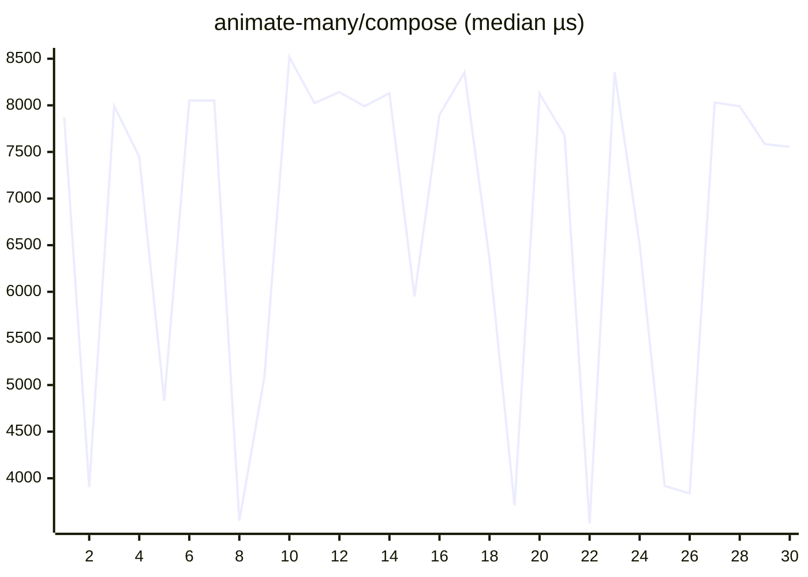
```mermaid
xychart-beta
    title "animate-many/compose (median µs)"
    x-axis 1 --> 30
    line [7871.3, 3905.5, 7991.3, 7448.7, 4830.1, 8052.7, 8051.7, 3544.0, 5080.3, 8517.9, 8024.1, 8142.0, 7989.4, 8130.4, 5949.5, 7899.9, 8352.9, 6351.3, 3705.7, 8123.9, 7678.7, 3513.4, 8358.0, 6506.7, 3917.8, 3836.8, 8029.4, 7990.2, 7585.0, 7554.6]
```

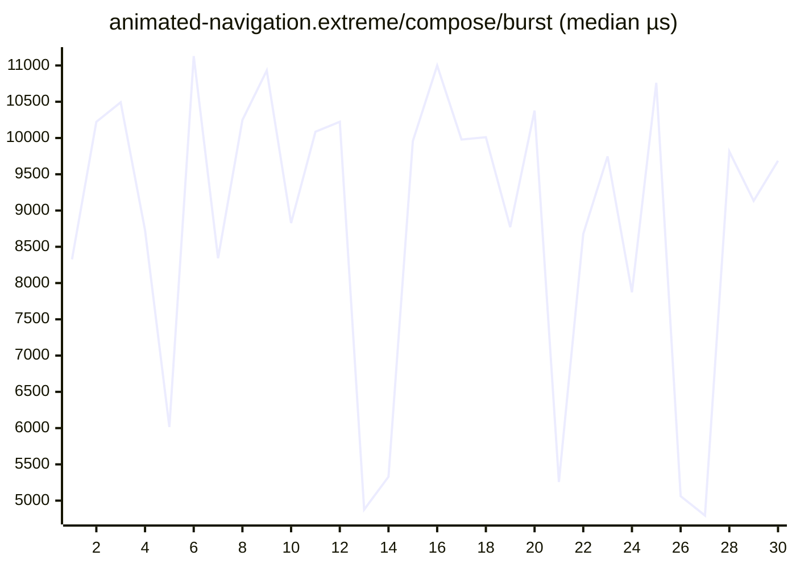
```mermaid
xychart-beta
    title "animated-navigation.extreme/compose/burst (median µs)"
    x-axis 1 --> 30
    line [8326.5, 10222.6, 10491.4, 8730.0, 6015.0, 11128.6, 8341.6, 10247.8, 10930.6, 8827.2, 10085.6, 10224.2, 4875.8, 5329.1, 9957.3, 10999.1, 9978.4, 10011.0, 8770.5, 10377.8, 5257.5, 8676.8, 9747.0, 7873.1, 10761.3, 5061.0, 4795.5, 9813.3, 9133.9, 9686.2]
```

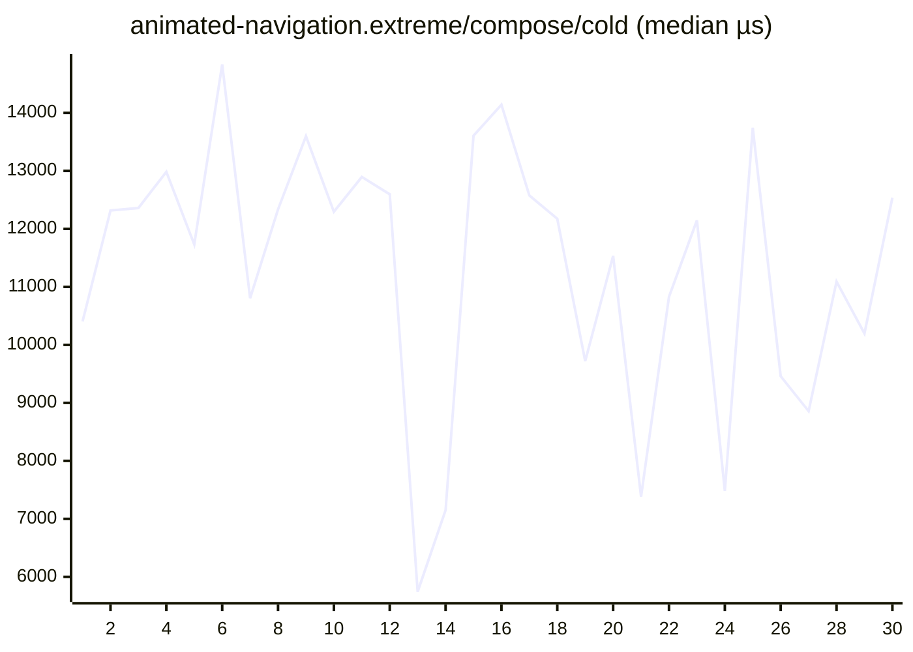
```mermaid
xychart-beta
    title "animated-navigation.extreme/compose/cold (median µs)"
    x-axis 1 --> 30
    line [10404.1, 12317.7, 12360.1, 12983.5, 11732.2, 14835.2, 10804.5, 12336.1, 13597.5, 12294.8, 12895.5, 12596.9, 5744.2, 7150.1, 13607.5, 14140.0, 12576.7, 12173.8, 9720.2, 11534.1, 7382.1, 10829.0, 12147.1, 7482.8, 13743.3, 9458.9, 8857.0, 11091.8, 10196.1, 12537.4]
```

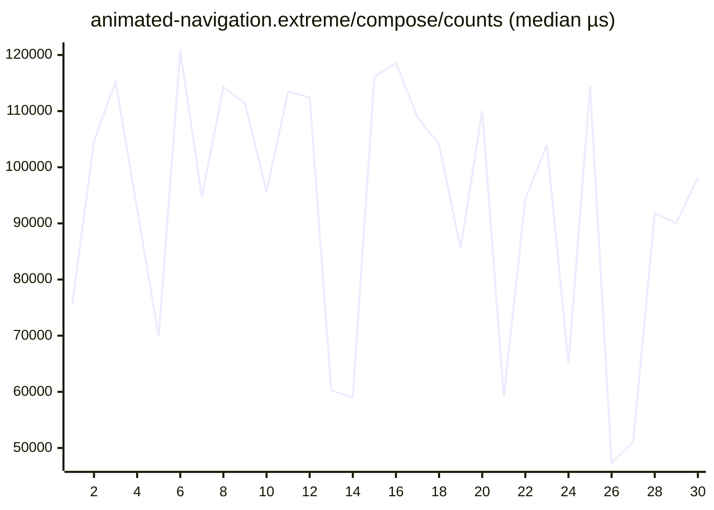
```mermaid
xychart-beta
    title "animated-navigation.extreme/compose/counts (median µs)"
    x-axis 1 --> 30
    line [75778.5, 104684.2, 115275.0, 92599.6, 69909.5, 120812.9, 94718.1, 114280.3, 111413.0, 95643.5, 113439.9, 112446.5, 60265.7, 59005.6, 116057.2, 118620.5, 108909.5, 104100.9, 85517.8, 110076.9, 59152.5, 94317.9, 104008.2, 64987.5, 114477.4, 47356.5, 51033.0, 91805.6, 90032.2, 98233.2]
```

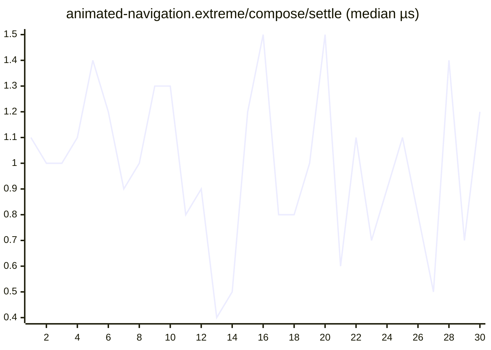
```mermaid
xychart-beta
    title "animated-navigation.extreme/compose/settle (median µs)"
    x-axis 1 --> 30
    line [1.1, 1.0, 1.0, 1.1, 1.4, 1.2, 0.9, 1.0, 1.3, 1.3, 0.8, 0.9, 0.4, 0.5, 1.2, 1.5, 0.8, 0.8, 1.0, 1.5, 0.6, 1.1, 0.7, 0.9, 1.1, 0.8, 0.5, 1.4, 0.7, 1.2]
```

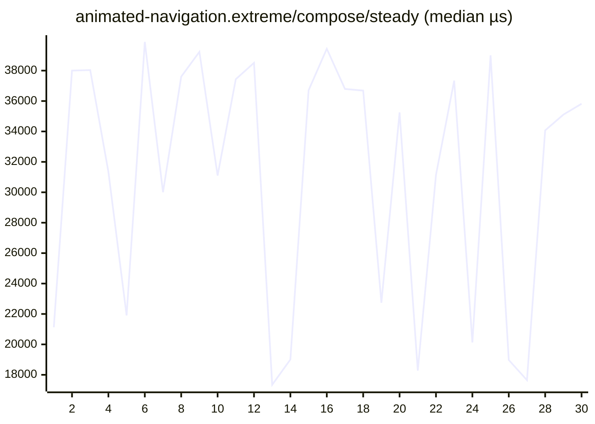
```mermaid
xychart-beta
    title "animated-navigation.extreme/compose/steady (median µs)"
    x-axis 1 --> 30
    line [21123.9, 38003.0, 38037.8, 31341.2, 21905.8, 39887.1, 30005.5, 37602.2, 39235.6, 31100.1, 37439.1, 38508.9, 17344.6, 19008.6, 36706.3, 39436.2, 36794.0, 36686.5, 22734.6, 35250.8, 18274.3, 31136.7, 37344.0, 20126.5, 39003.9, 18975.3, 17649.6, 34072.6, 35105.4, 35821.7]
```

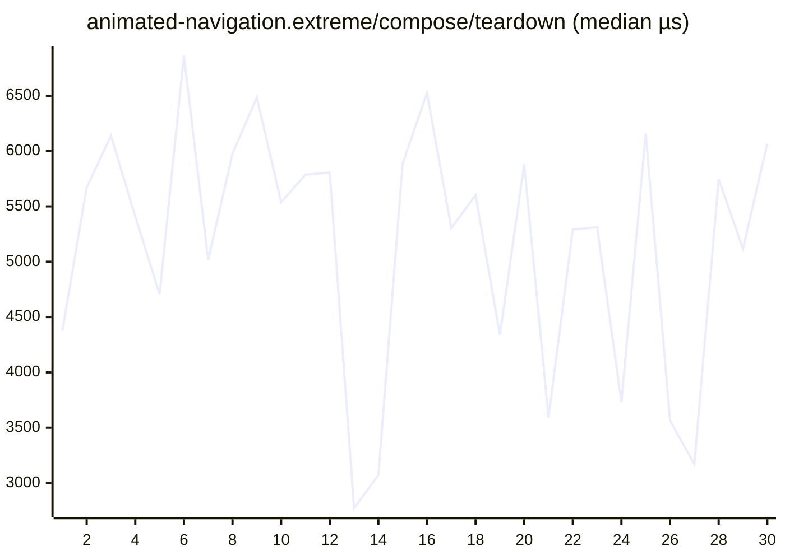
```mermaid
xychart-beta
    title "animated-navigation.extreme/compose/teardown (median µs)"
    x-axis 1 --> 30
    line [4376.4, 5670.1, 6138.4, 5409.4, 4705.5, 6865.1, 5015.4, 5977.5, 6485.2, 5538.6, 5787.0, 5805.5, 2772.4, 3070.6, 5888.1, 6524.7, 5304.0, 5602.6, 4338.7, 5880.5, 3591.1, 5289.9, 5312.2, 3731.3, 6159.1, 3564.6, 3170.1, 5746.6, 5118.0, 6065.4]
```

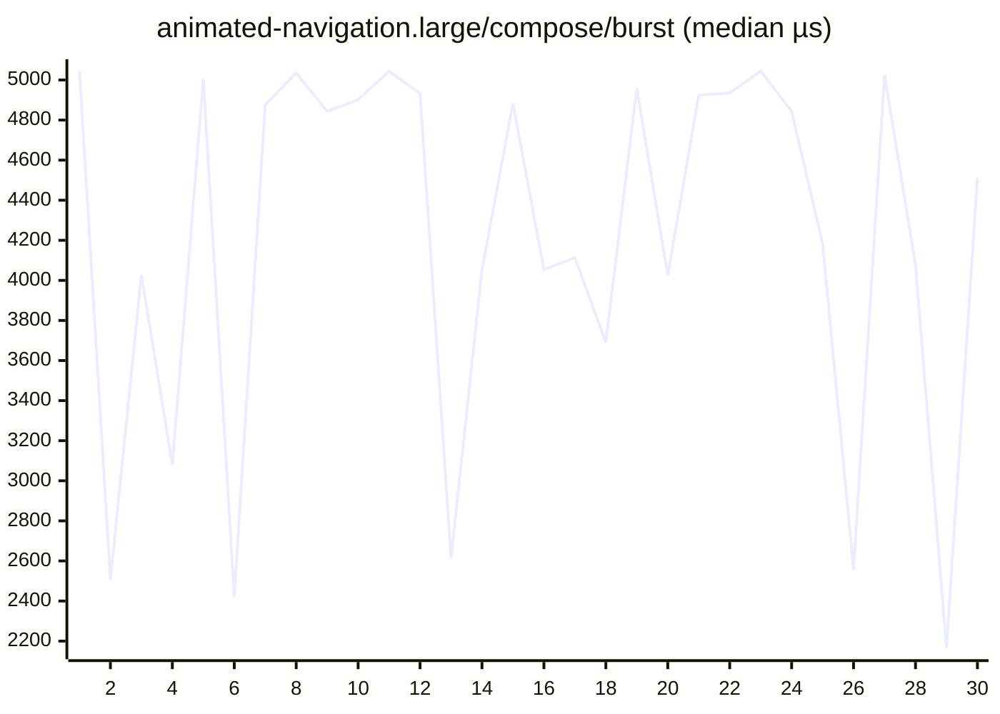
```mermaid
xychart-beta
    title "animated-navigation.large/compose/burst (median µs)"
    x-axis 1 --> 30
    line [5047.0, 2506.7, 4027.9, 3078.6, 5005.2, 2421.4, 4875.7, 5035.0, 4843.4, 4902.2, 5043.4, 4933.4, 2611.7, 4052.9, 4883.0, 4054.2, 4113.6, 3690.6, 4958.8, 4024.5, 4924.0, 4935.3, 5044.3, 4843.6, 4184.1, 2557.4, 5025.8, 4078.3, 2165.7, 4512.2]
```

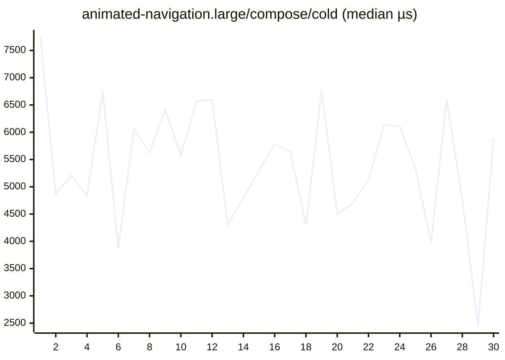
```mermaid
xychart-beta
    title "animated-navigation.large/compose/cold (median µs)"
    x-axis 1 --> 30
    line [7772.8, 4871.7, 5209.7, 4834.5, 6751.5, 3868.6, 6060.8, 5629.1, 6414.7, 5584.9, 6562.1, 6600.4, 4313.0, 4795.4, 5301.9, 5785.6, 5640.1, 4298.6, 6767.6, 4505.4, 4691.4, 5133.5, 6137.8, 6109.3, 5338.0, 3969.9, 6602.6, 4765.2, 2434.6, 5882.1]
```

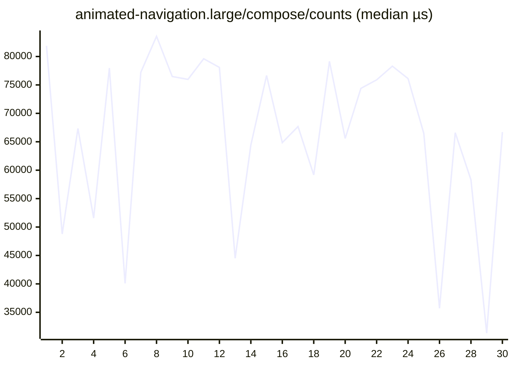
```mermaid
xychart-beta
    title "animated-navigation.large/compose/counts (median µs)"
    x-axis 1 --> 30
    line [81887.6, 48776.5, 67346.9, 51586.7, 77963.3, 40090.5, 77229.5, 83557.6, 76478.4, 75980.7, 79609.1, 78071.6, 44514.1, 64427.8, 76665.0, 64851.1, 67679.8, 59172.8, 79151.1, 65583.8, 74396.1, 75889.4, 78298.5, 76109.5, 66482.5, 35701.4, 66599.9, 58309.6, 31350.6, 66705.5]
```

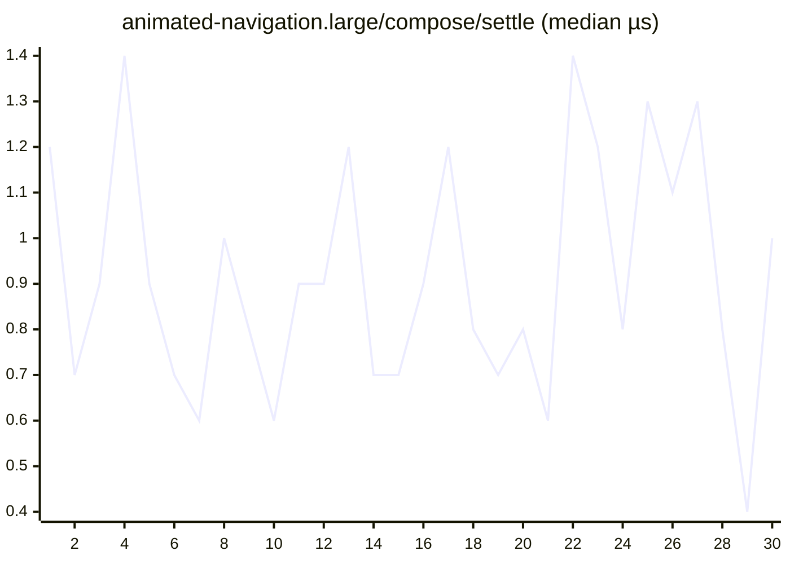
```mermaid
xychart-beta
    title "animated-navigation.large/compose/settle (median µs)"
    x-axis 1 --> 30
    line [1.2, 0.7, 0.9, 1.4, 0.9, 0.7, 0.6, 1.0, 0.8, 0.6, 0.9, 0.9, 1.2, 0.7, 0.7, 0.9, 1.2, 0.8, 0.7, 0.8, 0.6, 1.4, 1.2, 0.8, 1.3, 1.1, 1.3, 0.8, 0.4, 1.0]
```

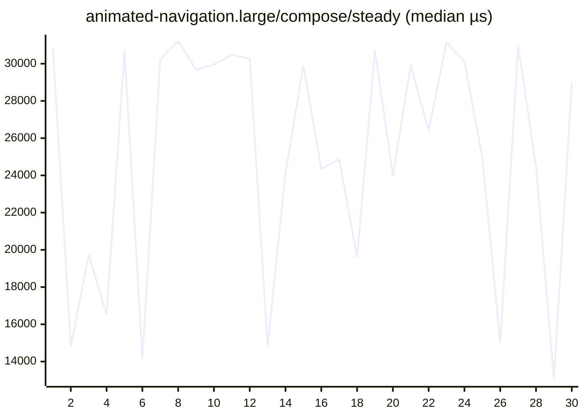
```mermaid
xychart-beta
    title "animated-navigation.large/compose/steady (median µs)"
    x-axis 1 --> 30
    line [30803.7, 14816.2, 19716.8, 16533.1, 30696.2, 14153.7, 30250.8, 31201.8, 29685.5, 29957.2, 30475.8, 30269.5, 14805.7, 24144.6, 29911.9, 24350.8, 24863.9, 19597.0, 30716.9, 23970.8, 29933.6, 26396.4, 31142.6, 30121.5, 24954.3, 15003.3, 30975.5, 24483.9, 13043.9, 28996.1]
```

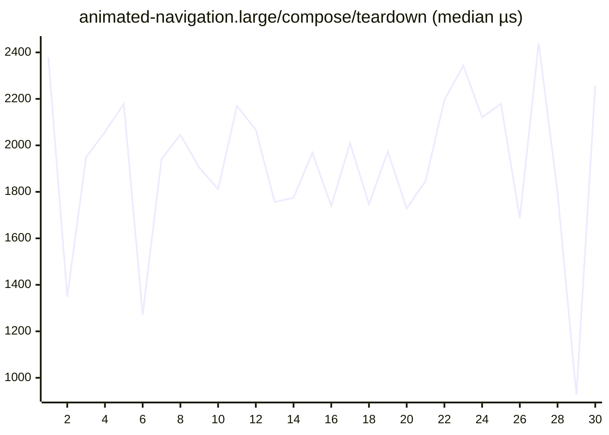
```mermaid
xychart-beta
    title "animated-navigation.large/compose/teardown (median µs)"
    x-axis 1 --> 30
    line [2377.9, 1348.5, 1948.9, 2058.2, 2178.6, 1271.3, 1941.3, 2045.7, 1904.4, 1811.7, 2169.1, 2067.0, 1756.4, 1774.4, 1968.1, 1739.8, 2009.7, 1746.8, 1973.0, 1729.3, 1846.2, 2195.2, 2342.6, 2120.8, 2178.6, 1686.8, 2440.4, 1797.8, 927.0, 2256.9]
```

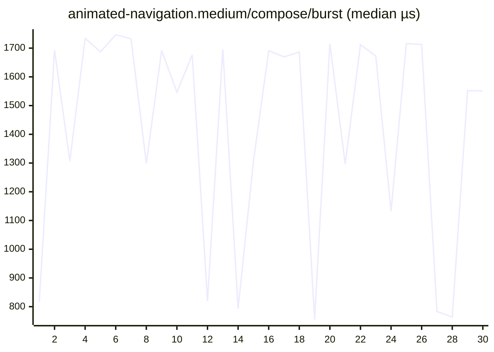
```mermaid
xychart-beta
    title "animated-navigation.medium/compose/burst (median µs)"
    x-axis 1 --> 30
    line [816.2, 1692.5, 1306.3, 1734.2, 1687.1, 1746.4, 1732.7, 1299.1, 1691.4, 1546.9, 1676.1, 819.9, 1695.8, 793.0, 1305.0, 1690.8, 1669.4, 1686.3, 755.6, 1715.7, 1296.8, 1712.0, 1672.7, 1132.0, 1716.1, 1712.4, 783.4, 763.8, 1552.0, 1551.3]
```

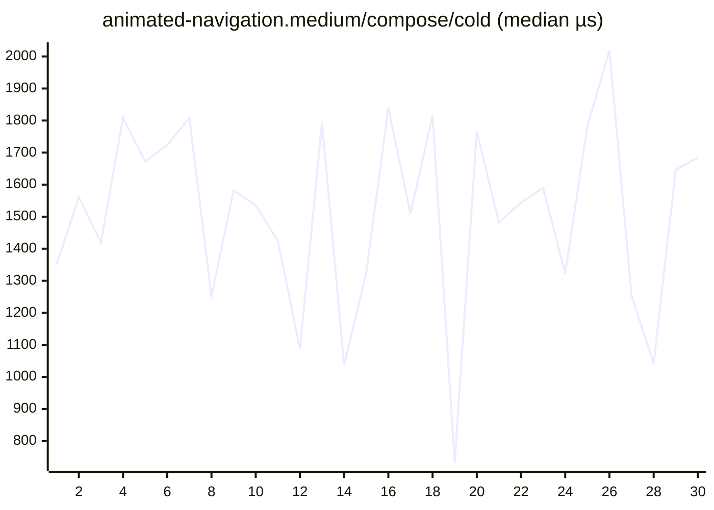
```mermaid
xychart-beta
    title "animated-navigation.medium/compose/cold (median µs)"
    x-axis 1 --> 30
    line [1351.3, 1561.0, 1418.9, 1809.2, 1672.2, 1723.4, 1808.8, 1250.5, 1582.2, 1535.6, 1425.1, 1089.0, 1794.0, 1036.0, 1325.3, 1839.9, 1508.6, 1815.3, 732.0, 1766.8, 1481.7, 1544.1, 1589.5, 1323.0, 1780.7, 2018.8, 1253.8, 1042.5, 1646.3, 1684.9]
```

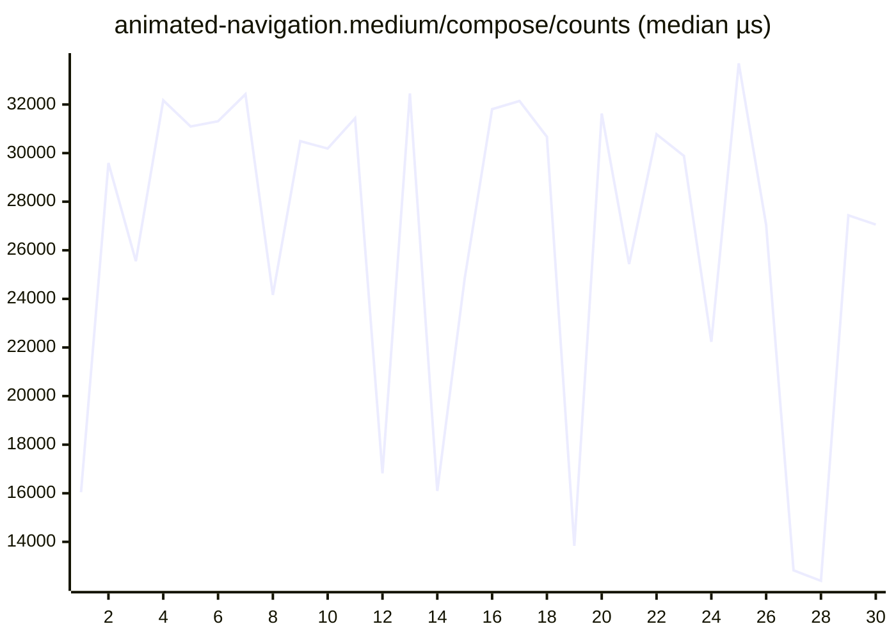
```mermaid
xychart-beta
    title "animated-navigation.medium/compose/counts (median µs)"
    x-axis 1 --> 30
    line [16043.3, 29594.8, 25552.2, 32169.2, 31092.9, 31310.6, 32421.7, 24162.8, 30491.0, 30188.0, 31435.5, 16820.4, 32459.7, 16093.7, 24842.8, 31808.4, 32146.2, 30668.2, 13834.1, 31629.1, 25433.2, 30774.6, 29883.2, 22231.2, 33697.1, 27039.4, 12827.4, 12396.8, 27439.9, 27059.6]
```

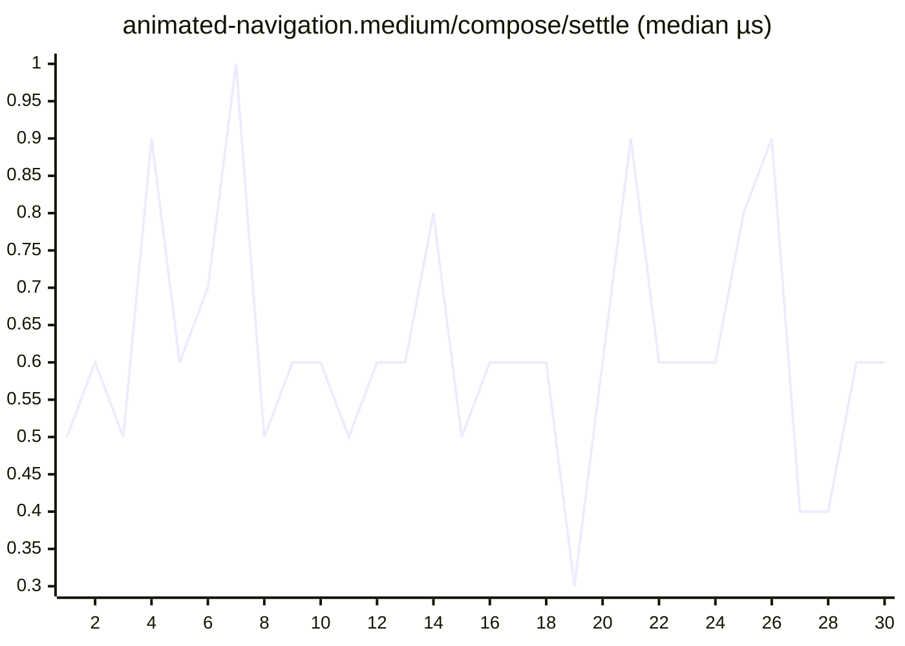
```mermaid
xychart-beta
    title "animated-navigation.medium/compose/settle (median µs)"
    x-axis 1 --> 30
    line [0.5, 0.6, 0.5, 0.9, 0.6, 0.7, 1.0, 0.5, 0.6, 0.6, 0.5, 0.6, 0.6, 0.8, 0.5, 0.6, 0.6, 0.6, 0.3, 0.6, 0.9, 0.6, 0.6, 0.6, 0.8, 0.9, 0.4, 0.4, 0.6, 0.6]
```

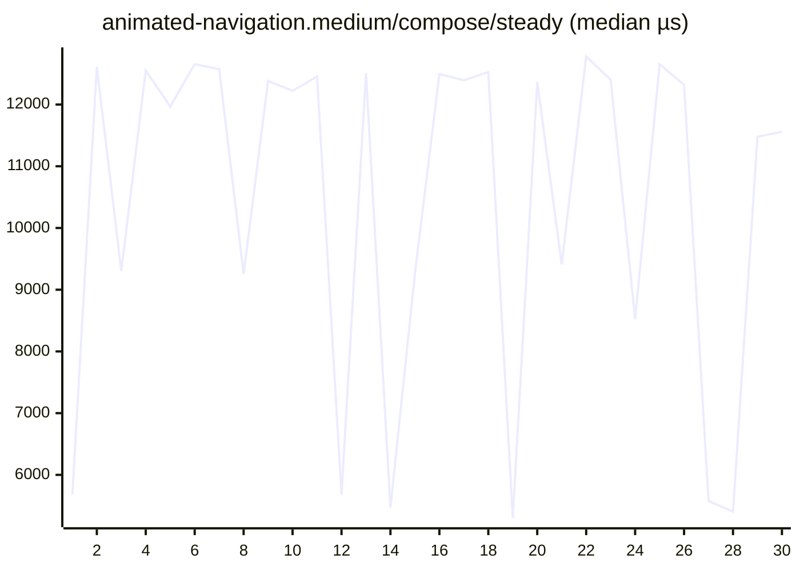
```mermaid
xychart-beta
    title "animated-navigation.medium/compose/steady (median µs)"
    x-axis 1 --> 30
    line [5681.7, 12610.6, 9304.5, 12550.6, 11968.6, 12653.6, 12572.6, 9260.6, 12383.3, 12221.9, 12453.1, 5674.7, 12506.1, 5468.2, 9258.8, 12495.8, 12392.6, 12526.1, 5298.2, 12367.4, 9408.6, 12779.2, 12400.8, 8520.0, 12652.2, 12319.2, 5577.4, 5405.1, 11478.3, 11557.4]
```

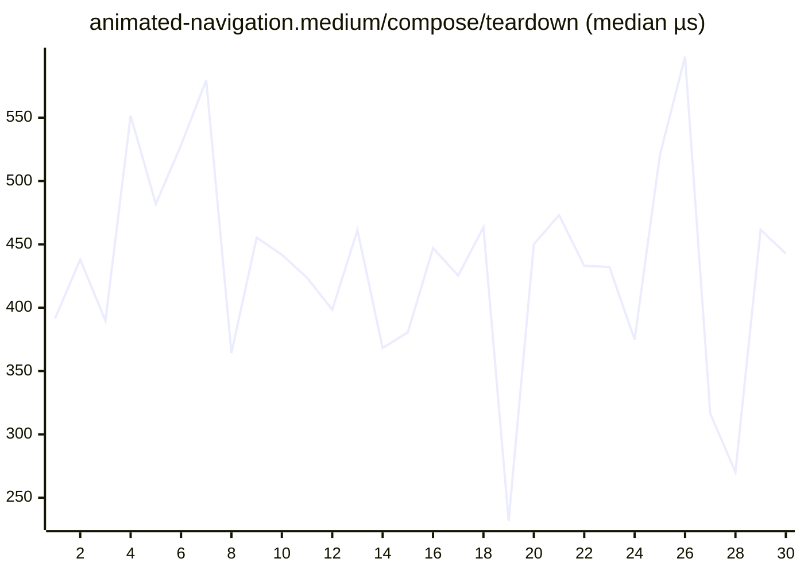
```mermaid
xychart-beta
    title "animated-navigation.medium/compose/teardown (median µs)"
    x-axis 1 --> 30
    line [391.4, 438.0, 389.7, 551.6, 481.9, 528.3, 579.6, 364.2, 455.4, 441.8, 423.7, 398.4, 461.2, 368.2, 380.6, 447.0, 425.4, 463.5, 231.7, 450.1, 473.1, 433.1, 432.1, 374.8, 520.2, 598.1, 316.5, 270.2, 461.5, 442.7]
```

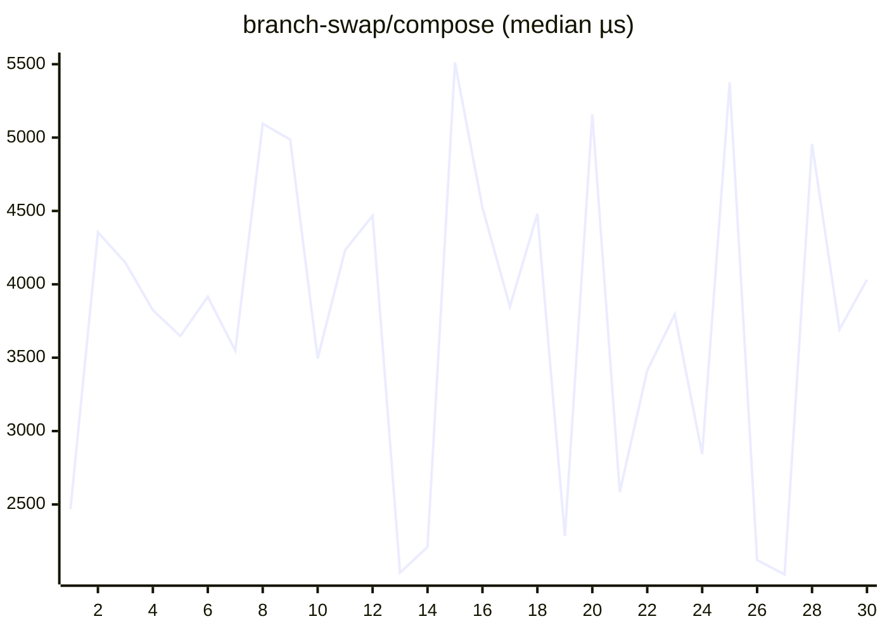
```mermaid
xychart-beta
    title "branch-swap/compose (median µs)"
    x-axis 1 --> 30
    line [2468.6, 4354.5, 4147.3, 3824.0, 3647.8, 3914.8, 3549.0, 5094.5, 4986.6, 3495.0, 4233.5, 4468.1, 2035.2, 2210.5, 5511.1, 4522.1, 3848.6, 4480.8, 2284.4, 5158.1, 2584.6, 3412.9, 3795.1, 2842.9, 5376.5, 2121.4, 2023.0, 4957.2, 3693.1, 4031.5]
```

```mermaid
xychart-beta
    title "cold-mount-100/compose (median µs)"
    x-axis 1 --> 30
    line [371.7, 536.9, 517.5, 408.5, 650.9, 546.0, 389.3, 892.7, 535.8, 460.7, 571.4, 724.1, 255.5, 319.1, 504.8, 578.6, 535.8, 922.7, 676.4, 840.9, 337.3, 649.2, 634.8, 645.2, 519.2, 645.7, 474.0, 830.0, 488.1, 814.1]
```

```mermaid
xychart-beta
    title "cold-mount-1000/compose (median µs)"
    x-axis 1 --> 30
    line [5919.6, 3302.6, 3617.9, 9809.3, 6560.8, 6510.1, 6336.3, 8381.9, 6448.6, 7934.9, 4846.2, 8892.6, 6255.4, 6313.0, 3334.3, 6509.5, 5299.2, 8292.2, 6014.2, 3409.1, 6353.4, 4903.8, 10834.3, 8525.2, 6295.7, 5585.1, 8413.8, 6124.1, 4825.5, 6791.8]
```

```mermaid
xychart-beta
    title "cold-mount-10000/compose (median µs)"
    x-axis 1 --> 30
    line [67702.7, 104388.2, 95890.4, 111967.6, 89707.9, 81881.6, 78395.2, 74829.6, 106286.7, 99070.3, 63175.3, 77193.9, 70830.8, 96805.3, 58104.7, 72413.0, 81450.9, 83272.9, 66156.2, 109137.6, 101395.9, 75590.6, 89206.2, 89759.3, 118635.8, 103942.8, 88367.7, 96321.3, 85624.6, 98047.3]
```

```mermaid
xychart-beta
    title "data-grid.extreme/compose/burst (median µs)"
    x-axis 1 --> 30
    line [676076.6, 793178.6, 636347.5, 826621.2, 822831.6, 814532.5, 952940.6, 665289.3, 783317.0, 778653.4, 794511.6, 757833.2, 863574.7, 583083.7, 628102.3, 844660.4, 803296.9, 795929.3, 455152.2, 832534.6, 834215.9, 778392.4, 834955.3, 681841.3, 952071.9, 895677.2, 619621.3, 518502.5, 869063.8, 838253.5]
```

```mermaid
xychart-beta
    title "data-grid.extreme/compose/cold (median µs)"
    x-axis 1 --> 30
    line [404071.9, 486286.3, 389062.7, 494954.6, 493782.7, 503763.7, 579274.3, 399551.6, 484415.9, 472865.5, 495737.4, 459865.5, 531118.0, 350100.7, 390888.4, 532403.1, 469857.7, 483692.6, 282308.3, 512296.0, 522074.5, 477477.2, 497669.0, 419099.0, 570495.1, 552259.4, 370193.4, 307937.5, 534945.2, 517655.2]
```

```mermaid
xychart-beta
    title "data-grid.extreme/compose/counts (median µs)"
    x-axis 1 --> 30
    line [1205615.5, 1378751.9, 1099291.7, 1442248.6, 1418710.6, 1426435.1, 1619647.7, 1149474.0, 1391557.5, 1316213.1, 1386580.9, 1282123.2, 1597390.8, 965842.1, 1210333.9, 1538190.9, 1436951.7, 1323030.8, 889133.1, 1374221.7, 1391578.9, 1365869.7, 1456710.3, 1161602.9, 1598128.2, 1454896.8, 1002905.5, 867924.6, 1472117.9, 1355775.1]
```

```mermaid
xychart-beta
    title "data-grid.extreme/compose/settle (median µs)"
    x-axis 1 --> 30
    line [2.8, 2.2, 2.4, 2.1, 2.7, 2.1, 2.6, 1.7, 2.0, 2.1, 2.0, 3.1, 2.3, 2.5, 2.5, 2.5, 2.0, 1.8, 2.2, 2.1, 2.3, 2.1, 2.1, 2.6, 2.2, 2.5, 2.9, 2.4, 2.2, 2.1]
```

```mermaid
xychart-beta
    title "data-grid.extreme/compose/steady (median µs)"
    x-axis 1 --> 30
    line [15296.2, 24530.0, 18385.9, 24886.9, 24241.6, 24030.1, 24957.0, 18918.2, 24760.2, 23105.6, 23878.8, 15251.4, 24309.0, 14034.1, 19053.5, 25422.8, 24914.4, 23689.8, 11161.0, 22004.6, 17743.2, 20241.7, 20520.4, 17517.1, 21198.5, 21958.4, 12901.7, 12477.3, 19361.2, 19694.7]
```

```mermaid
xychart-beta
    title "data-grid.extreme/compose/teardown (median µs)"
    x-axis 1 --> 30
    line [1612.8, 1156.4, 985.3, 1144.1, 1336.2, 1126.0, 1372.7, 1080.1, 1117.6, 1105.4, 1140.9, 1443.0, 1266.7, 1006.2, 992.8, 1222.4, 1362.2, 1120.3, 849.4, 1145.5, 1244.3, 1192.7, 1219.3, 1266.7, 1403.0, 1385.3, 1067.4, 1240.3, 1216.0, 1093.2]
```

```mermaid
xychart-beta
    title "data-grid.large/compose/burst (median µs)"
    x-axis 1 --> 30
    line [139575.3, 82866.3, 117220.3, 93456.3, 138005.1, 91593.5, 133369.7, 145660.8, 132292.1, 131621.8, 134099.6, 133228.9, 86555.4, 105137.8, 129655.9, 104774.4, 110538.9, 111890.9, 136160.2, 109609.7, 133728.3, 128043.6, 144011.4, 136173.1, 109501.9, 79942.4, 159797.7, 107954.0, 71050.0, 140485.5]
```

```mermaid
xychart-beta
    title "data-grid.large/compose/cold (median µs)"
    x-axis 1 --> 30
    line [80097.4, 47326.0, 69754.2, 52751.2, 81053.5, 49503.5, 76821.3, 83285.7, 75512.6, 76930.5, 77890.2, 80461.5, 49687.4, 57803.8, 77416.5, 59643.1, 59827.9, 65637.4, 82374.5, 60637.0, 76696.3, 74335.7, 80963.4, 78330.7, 62564.4, 46706.7, 96103.4, 57751.1, 41390.6, 79679.1]
```

```mermaid
xychart-beta
    title "data-grid.large/compose/counts (median µs)"
    x-axis 1 --> 30
    line [252868.0, 153440.2, 219925.5, 166799.8, 255561.6, 156582.3, 246140.3, 264312.1, 239355.1, 259127.9, 247856.7, 258002.0, 154969.1, 193339.9, 246767.5, 198546.4, 202545.5, 213753.9, 248017.5, 191071.6, 242040.7, 236415.1, 258533.8, 242808.2, 231581.6, 147698.0, 274303.5, 189389.2, 122863.6, 249158.0]
```

```mermaid
xychart-beta
    title "data-grid.large/compose/settle (median µs)"
    x-axis 1 --> 30
    line [2.2, 2.1, 2.7, 2.2, 1.7, 2.4, 1.7, 2.7, 1.2, 1.3, 1.8, 1.9, 2.6, 1.8, 1.6, 1.8, 2.2, 2.0, 1.8, 2.3, 1.3, 2.1, 2.1, 1.8, 2.0, 2.0, 2.6, 1.5, 0.8, 1.9]
```

```mermaid
xychart-beta
    title "data-grid.large/compose/steady (median µs)"
    x-axis 1 --> 30
    line [18142.9, 9085.4, 14131.5, 11823.7, 16652.0, 9788.7, 17498.0, 19611.4, 16393.7, 16461.5, 16718.0, 18623.4, 10276.1, 13347.1, 18594.1, 15212.2, 15045.3, 13118.4, 14467.5, 12883.6, 15546.6, 12866.1, 15375.7, 16342.9, 12166.2, 9804.3, 16548.3, 11362.1, 6371.3, 14091.3]
```

```mermaid
xychart-beta
    title "data-grid.large/compose/teardown (median µs)"
    x-axis 1 --> 30
    line [517.1, 316.1, 576.9, 394.7, 514.5, 453.7, 526.9, 543.6, 504.2, 515.5, 519.2, 533.7, 396.3, 429.0, 516.2, 427.2, 426.4, 489.0, 530.3, 456.7, 500.8, 529.7, 556.5, 521.0, 454.7, 319.9, 839.0, 415.4, 253.4, 520.7]
```

```mermaid
xychart-beta
    title "data-grid.medium/compose/burst (median µs)"
    x-axis 1 --> 30
    line [40565.8, 62643.1, 64655.2, 50174.4, 38453.3, 64343.5, 47809.3, 63392.9, 64886.3, 51287.4, 64930.7, 61422.6, 33998.9, 38590.5, 63540.8, 65112.1, 60636.0, 61684.2, 38869.4, 59433.4, 34754.5, 49725.1, 64990.1, 39846.0, 64876.0, 37021.7, 35839.3, 61822.8, 62946.4, 63807.8]
```

```mermaid
xychart-beta
    title "data-grid.medium/compose/cold (median µs)"
    x-axis 1 --> 30
    line [22310.4, 35914.3, 36205.8, 28753.8, 21938.0, 35951.2, 27912.7, 36502.1, 35030.3, 27718.5, 36388.2, 36237.2, 19782.7, 22365.5, 37548.2, 37828.5, 35621.9, 36331.3, 23111.2, 33610.9, 20413.3, 26855.8, 35709.9, 21594.2, 38357.9, 21481.1, 20494.7, 35371.7, 36461.3, 36730.9]
```

```mermaid
xychart-beta
    title "data-grid.medium/compose/counts (median µs)"
    x-axis 1 --> 30
    line [86628.2, 134077.9, 138130.7, 106019.0, 82812.4, 135626.8, 103432.5, 144370.6, 135879.3, 111982.0, 135389.8, 130745.1, 68927.0, 84025.1, 134753.1, 140776.6, 132096.3, 134851.5, 88491.9, 126072.8, 73520.2, 102022.5, 129502.8, 84544.6, 136385.1, 72685.5, 75778.6, 117185.4, 124070.3, 125475.0]
```

```mermaid
xychart-beta
    title "data-grid.medium/compose/settle (median µs)"
    x-axis 1 --> 30
    line [1.4, 1.2, 2.0, 2.0, 2.2, 2.3, 1.6, 1.8, 1.8, 2.2, 1.7, 1.2, 0.7, 2.0, 2.2, 2.2, 1.0, 1.9, 1.2, 1.9, 0.9, 1.5, 1.0, 1.1, 1.7, 1.5, 1.1, 2.1, 1.3, 2.0]
```

```mermaid
xychart-beta
    title "data-grid.medium/compose/steady (median µs)"
    x-axis 1 --> 30
    line [10448.3, 16344.1, 15906.7, 10671.5, 8254.0, 15469.9, 10525.9, 16487.7, 13266.5, 11009.4, 14255.7, 14961.8, 7824.3, 8515.9, 14565.4, 17090.1, 14305.8, 14865.6, 9330.5, 11636.3, 7594.1, 10730.5, 14420.7, 7393.5, 13015.7, 7765.5, 7130.7, 11107.8, 11591.5, 13552.6]
```

```mermaid
xychart-beta
    title "data-grid.medium/compose/teardown (median µs)"
    x-axis 1 --> 30
    line [182.1, 309.9, 304.2, 260.1, 188.8, 311.0, 240.7, 310.4, 335.2, 259.8, 294.5, 281.2, 160.0, 203.1, 315.3, 325.2, 284.1, 308.2, 200.6, 287.6, 174.8, 239.8, 285.9, 198.7, 309.4, 178.7, 177.1, 299.9, 276.1, 282.0]
```

```mermaid
xychart-beta
    title "dense-dashboard.extreme/compose/burst (median µs)"
    x-axis 1 --> 30
    line [17239.5, 9913.9, 15039.1, 18051.2, 13176.8, 17727.6, 15282.4, 8785.6, 16160.2, 19850.9, 14976.8, 16218.1, 15982.2, 15742.3, 15591.1, 15470.8, 17455.7, 12618.6, 11205.0, 17425.6, 16010.4, 9307.5, 17290.3, 16906.4, 12585.3, 8668.9, 16674.7, 15557.2, 16984.0, 14954.7]
```

```mermaid
xychart-beta
    title "dense-dashboard.extreme/compose/cold (median µs)"
    x-axis 1 --> 30
    line [547.0, 300.3, 466.7, 547.2, 440.7, 566.5, 475.5, 279.2, 554.1, 583.9, 561.9, 562.5, 519.3, 522.2, 525.3, 483.2, 564.0, 415.9, 391.6, 584.4, 513.7, 338.5, 539.0, 511.2, 400.2, 266.3, 554.2, 473.4, 527.2, 501.2]
```

```mermaid
xychart-beta
    title "dense-dashboard.extreme/compose/counts (median µs)"
    x-axis 1 --> 30
    line [25831.5, 15243.1, 22473.9, 26871.6, 20232.5, 23972.3, 23530.6, 12883.1, 24367.3, 27198.9, 22582.9, 25659.1, 22605.5, 23930.6, 23610.2, 22523.6, 23929.4, 19348.0, 18257.5, 28135.3, 24631.5, 14938.1, 24217.0, 26061.1, 17611.7, 12185.7, 23462.4, 22716.2, 23192.1, 24740.1]
```

```mermaid
xychart-beta
    title "dense-dashboard.extreme/compose/settle (median µs)"
    x-axis 1 --> 30
    line [1.1, 0.6, 0.8, 1.0, 1.1, 1.4, 0.8, 0.7, 1.9, 1.7, 0.9, 1.2, 0.9, 0.8, 1.7, 0.9, 1.2, 0.9, 0.9, 1.4, 0.8, 0.8, 1.2, 1.9, 1.8, 0.6, 1.0, 0.8, 1.6, 1.3]
```

```mermaid
xychart-beta
    title "dense-dashboard.extreme/compose/steady (median µs)"
    x-axis 1 --> 30
    line [912.2, 460.0, 870.0, 885.7, 654.3, 896.8, 888.8, 479.3, 729.2, 913.6, 918.6, 903.9, 906.1, 896.7, 757.0, 887.0, 903.6, 736.2, 477.9, 928.8, 873.9, 457.9, 922.6, 782.9, 511.5, 473.5, 909.7, 896.3, 922.9, 886.8]
```

```mermaid
xychart-beta
    title "dense-dashboard.extreme/compose/teardown (median µs)"
    x-axis 1 --> 30
    line [584.4, 343.9, 500.6, 632.1, 446.2, 575.1, 523.6, 299.0, 595.2, 718.0, 558.8, 608.7, 528.6, 511.7, 554.4, 501.4, 559.2, 429.5, 450.3, 634.5, 510.3, 329.7, 575.6, 695.9, 452.4, 296.0, 559.3, 497.6, 596.6, 544.9]
```

```mermaid
xychart-beta
    title "dense-dashboard.large/compose/burst (median µs)"
    x-axis 1 --> 30
    line [9131.7, 4286.2, 6940.4, 6276.4, 8401.9, 5037.3, 7301.2, 8151.4, 7307.7, 7462.6, 8749.1, 7314.2, 5769.1, 6326.8, 7457.0, 5897.4, 7260.2, 7296.2, 8023.4, 5928.1, 8157.1, 8614.5, 8874.6, 8208.3, 7977.5, 6156.2, 9843.4, 6107.7, 3119.8, 6997.2]
```

```mermaid
xychart-beta
    title "dense-dashboard.large/compose/cold (median µs)"
    x-axis 1 --> 30
    line [385.4, 191.9, 304.7, 271.2, 415.9, 200.4, 322.4, 319.6, 311.9, 294.7, 399.4, 324.8, 251.9, 273.8, 298.8, 238.4, 296.9, 286.8, 329.2, 267.3, 295.2, 343.5, 341.3, 318.9, 300.9, 282.9, 397.1, 233.1, 138.2, 407.0]
```

```mermaid
xychart-beta
    title "dense-dashboard.large/compose/counts (median µs)"
    x-axis 1 --> 30
    line [16624.3, 10802.9, 14977.6, 11944.0, 17463.9, 10249.2, 17418.0, 18985.1, 17307.2, 15628.8, 17687.5, 16874.3, 11218.8, 12840.5, 16165.0, 13173.1, 15255.5, 14029.8, 17821.6, 11377.3, 14642.7, 15629.1, 17185.5, 16818.8, 14242.3, 9937.8, 17665.7, 12759.2, 7081.5, 15232.5]
```

```mermaid
xychart-beta
    title "dense-dashboard.large/compose/settle (median µs)"
    x-axis 1 --> 30
    line [1.0, 0.6, 1.3, 1.0, 0.8, 0.6, 0.8, 1.1, 0.8, 0.8, 0.8, 0.8, 1.7, 0.6, 0.8, 0.6, 1.0, 1.1, 0.8, 0.7, 0.7, 1.4, 1.2, 0.8, 1.0, 0.6, 1.0, 0.7, 0.5, 0.9]
```

```mermaid
xychart-beta
    title "dense-dashboard.large/compose/steady (median µs)"
    x-axis 1 --> 30
    line [871.3, 447.3, 662.6, 476.5, 896.1, 462.6, 892.7, 881.9, 878.8, 887.0, 913.4, 894.6, 485.1, 733.0, 886.6, 744.9, 733.6, 672.4, 886.0, 731.7, 846.4, 767.0, 912.5, 904.4, 761.9, 483.9, 915.5, 729.9, 428.6, 875.6]
```

```mermaid
xychart-beta
    title "dense-dashboard.large/compose/teardown (median µs)"
    x-axis 1 --> 30
    line [295.6, 145.7, 223.4, 230.7, 306.8, 158.5, 265.6, 273.8, 260.7, 257.3, 309.1, 263.2, 229.7, 208.4, 240.8, 211.0, 241.3, 227.2, 272.1, 217.4, 240.5, 262.5, 292.0, 251.0, 235.8, 177.4, 304.9, 199.9, 122.3, 257.1]
```

```mermaid
xychart-beta
    title "dense-dashboard.medium/compose/burst (median µs)"
    x-axis 1 --> 30
    line [1783.0, 2888.8, 2071.5, 3513.4, 2950.3, 2847.8, 4046.3, 2225.1, 2876.8, 2798.9, 2738.0, 1868.7, 3491.6, 1484.7, 2477.7, 3549.1, 2661.7, 2710.7, 1501.0, 2734.5, 2879.6, 3220.9, 2982.7, 2425.3, 3549.4, 3397.0, 1530.9, 1690.1, 3328.8, 2977.8]
```

```mermaid
xychart-beta
    title "dense-dashboard.medium/compose/cold (median µs)"
    x-axis 1 --> 30
    line [176.0, 190.9, 151.0, 234.9, 211.3, 198.0, 257.8, 168.0, 190.6, 223.6, 210.0, 162.5, 249.3, 108.6, 161.3, 229.4, 209.5, 240.8, 102.3, 217.5, 207.9, 205.1, 189.1, 197.7, 263.7, 254.8, 123.3, 119.9, 204.7, 216.3]
```

```mermaid
xychart-beta
    title "dense-dashboard.medium/compose/counts (median µs)"
    x-axis 1 --> 30
    line [3930.7, 6435.8, 4930.8, 6408.9, 6303.1, 6117.0, 6223.1, 4790.4, 6096.5, 6206.2, 6259.4, 3551.4, 5897.1, 3468.5, 4763.3, 6640.1, 5488.4, 6374.5, 3002.9, 5409.2, 5849.7, 6158.7, 5508.6, 5747.4, 5913.5, 5757.9, 3057.7, 2989.0, 5680.3, 5633.1]
```

```mermaid
xychart-beta
    title "dense-dashboard.medium/compose/settle (median µs)"
    x-axis 1 --> 30
    line [0.6, 0.8, 0.5, 0.7, 0.7, 0.7, 1.0, 0.6, 0.7, 0.7, 0.7, 0.7, 0.7, 0.5, 0.6, 0.8, 0.7, 0.7, 0.5, 0.7, 1.0, 0.7, 0.7, 1.1, 0.9, 0.8, 0.4, 0.5, 0.7, 0.7]
```

```mermaid
xychart-beta
    title "dense-dashboard.medium/compose/steady (median µs)"
    x-axis 1 --> 30
    line [461.2, 868.1, 714.5, 864.6, 918.3, 874.3, 903.5, 724.6, 878.4, 880.3, 883.4, 468.2, 892.3, 432.7, 725.0, 885.9, 879.8, 885.9, 449.8, 875.8, 714.6, 907.5, 885.3, 679.8, 907.0, 890.0, 463.6, 463.0, 863.2, 854.8]
```

```mermaid
xychart-beta
    title "dense-dashboard.medium/compose/teardown (median µs)"
    x-axis 1 --> 30
    line [77.4, 113.2, 97.3, 129.9, 126.1, 124.3, 155.5, 91.7, 115.4, 120.6, 121.5, 97.9, 121.4, 68.2, 95.5, 132.2, 114.3, 121.6, 58.5, 109.8, 115.2, 115.2, 112.4, 101.3, 131.5, 132.5, 64.5, 63.7, 106.0, 110.4]
```

```mermaid
xychart-beta
    title "entities-identity-churn-10.extreme/compose/burst (median µs)"
    x-axis 1 --> 30
    line [32150.9, 51127.2, 60586.9, 50132.0, 49541.7, 40427.4, 39763.7, 40783.6, 47183.0, 55435.6, 36105.3, 45276.4, 31367.3, 45120.1, 31452.4, 47767.3, 46146.9, 46013.3, 39603.1, 48098.9, 47174.7, 56411.3, 49159.1, 41322.9, 62384.4, 52708.0, 40247.0, 51871.1, 47460.3, 42956.9]
```

```mermaid
xychart-beta
    title "entities-identity-churn-10.extreme/compose/cold (median µs)"
    x-axis 1 --> 30
    line [19334.8, 32107.6, 30731.2, 39019.4, 27726.3, 27455.6, 21124.2, 25320.6, 27015.9, 28157.3, 34774.6, 22447.7, 21195.1, 35348.3, 21337.0, 36161.4, 32718.2, 36281.2, 23444.4, 34919.6, 36510.3, 29192.1, 29743.9, 37285.0, 32632.9, 25892.8, 27987.3, 30097.8, 25544.9, 25599.3]
```

```mermaid
xychart-beta
    title "entities-identity-churn-10.extreme/compose/counts (median µs)"
    x-axis 1 --> 30
    line [167043.3, 237946.3, 298276.6, 242426.5, 216761.6, 207187.4, 206898.9, 200993.6, 231785.6, 256034.4, 195132.8, 214370.8, 126172.6, 215700.5, 138480.1, 209166.0, 211703.1, 201153.3, 183264.1, 206843.9, 254194.8, 223255.2, 206242.6, 210846.1, 267631.3, 178573.2, 173673.9, 193293.2, 209173.0, 203868.8]
```

```mermaid
xychart-beta
    title "entities-identity-churn-10.extreme/compose/settle (median µs)"
    x-axis 1 --> 30
    line [1.7, 1.9, 2.6, 2.1, 1.7, 1.4, 2.3, 1.8, 2.4, 2.3, 1.7, 2.5, 1.9, 1.5, 1.6, 1.8, 1.9, 1.8, 1.7, 1.7, 2.5, 2.3, 1.6, 1.7, 2.5, 2.5, 2.3, 1.8, 2.3, 1.9]
```

```mermaid
xychart-beta
    title "entities-identity-churn-10.extreme/compose/steady (median µs)"
    x-axis 1 --> 30
    line [28343.1, 54519.4, 73367.0, 54710.5, 48975.4, 44612.2, 40604.2, 42422.1, 61835.0, 58932.2, 41341.0, 41744.2, 32536.4, 46619.9, 27886.1, 47967.4, 46887.8, 46809.2, 42423.3, 50052.7, 52853.3, 57147.6, 48264.9, 47777.0, 63104.0, 56498.3, 52777.6, 51981.0, 52249.4, 45800.2]
```

```mermaid
xychart-beta
    title "entities-identity-churn-10.extreme/compose/teardown (median µs)"
    x-axis 1 --> 30
    line [721.0, 1412.4, 1735.7, 1242.4, 1092.7, 1026.8, 1075.6, 954.7, 1248.5, 1334.5, 992.4, 1201.8, 801.8, 1122.8, 756.6, 1155.0, 1161.8, 1176.0, 949.2, 1267.5, 1379.9, 1377.4, 1049.6, 1118.4, 1371.8, 1372.6, 1091.7, 1199.7, 1136.8, 965.3]
```

```mermaid
xychart-beta
    title "entities-identity-churn-10.large/compose/burst (median µs)"
    x-axis 1 --> 30
    line [12700.0, 14875.4, 13752.4, 11977.2, 12643.0, 15253.7, 12001.0, 13807.8, 14941.6, 14855.6, 14757.4, 13186.5, 7905.0, 8259.5, 15511.2, 16357.2, 14428.5, 13172.2, 11911.6, 13107.7, 10119.5, 12419.8, 14488.0, 10060.5, 15025.7, 9852.4, 9473.2, 13935.5, 13073.5, 13068.1]
```

```mermaid
xychart-beta
    title "entities-identity-churn-10.large/compose/cold (median µs)"
    x-axis 1 --> 30
    line [6356.7, 11574.3, 10654.0, 9466.6, 8895.9, 13125.2, 8398.4, 12037.7, 12560.4, 9259.3, 13122.0, 10724.2, 5612.8, 7316.4, 12563.3, 10753.2, 10949.5, 11943.5, 8005.9, 10895.8, 7115.3, 9158.4, 11636.3, 6822.6, 13081.3, 8610.7, 8305.6, 12370.4, 10566.2, 12621.8]
```

```mermaid
xychart-beta
    title "entities-identity-churn-10.large/compose/counts (median µs)"
    x-axis 1 --> 30
    line [49015.7, 64191.1, 72562.2, 58025.0, 47214.6, 75775.6, 59707.9, 70659.8, 67199.4, 65923.3, 65705.8, 62211.2, 45356.5, 36273.7, 70882.3, 80538.6, 61040.1, 66409.7, 52346.6, 65262.9, 40341.8, 55559.5, 62188.9, 51003.6, 72714.0, 37300.8, 34774.2, 62812.9, 60338.5, 59598.0]
```

```mermaid
xychart-beta
    title "entities-identity-churn-10.large/compose/settle (median µs)"
    x-axis 1 --> 30
    line [1.2, 1.1, 1.5, 1.7, 2.1, 2.0, 1.3, 1.4, 1.2, 1.8, 1.2, 1.0, 0.7, 0.7, 1.7, 1.9, 1.1, 1.0, 1.2, 1.7, 1.3, 1.2, 1.0, 1.1, 1.7, 1.1, 0.9, 1.9, 1.2, 1.3]
```

```mermaid
xychart-beta
    title "entities-identity-churn-10.large/compose/steady (median µs)"
    x-axis 1 --> 30
    line [13436.4, 17268.6, 17919.0, 15044.9, 13777.4, 19064.6, 14045.1, 18710.3, 18360.0, 16061.5, 17183.2, 17537.8, 8961.6, 9464.2, 17828.1, 18527.4, 17527.8, 17662.3, 13389.5, 18746.2, 9753.4, 13539.9, 16212.6, 11322.4, 18243.8, 10195.3, 9450.7, 18156.1, 15749.6, 16450.5]
```

```mermaid
xychart-beta
    title "entities-identity-churn-10.large/compose/teardown (median µs)"
    x-axis 1 --> 30
    line [283.9, 379.7, 401.6, 337.3, 295.7, 436.1, 314.7, 403.8, 392.0, 373.5, 366.2, 378.5, 205.0, 228.1, 395.0, 453.3, 388.6, 382.7, 258.5, 377.3, 261.1, 324.1, 352.3, 246.4, 426.7, 261.7, 213.6, 372.4, 342.2, 361.9]
```

```mermaid
xychart-beta
    title "entities-identity-churn-10.medium/compose/burst (median µs)"
    x-axis 1 --> 30
    line [5723.3, 6313.3, 5210.8, 7111.4, 7245.9, 7403.7, 7944.4, 5693.0, 6580.6, 7027.4, 7330.9, 5744.6, 7569.9, 4397.8, 5963.1, 7111.0, 6826.6, 6194.8, 3321.5, 7264.9, 6390.1, 8210.9, 8696.8, 5734.5, 8734.0, 7876.7, 7559.8, 4138.3, 6671.9, 8754.0]
```

```mermaid
xychart-beta
    title "entities-identity-churn-10.medium/compose/cold (median µs)"
    x-axis 1 --> 30
    line [3993.4, 4663.1, 4969.8, 6793.9, 5545.3, 4981.3, 5864.8, 4176.8, 5104.2, 5587.8, 5640.7, 4461.2, 5555.1, 4032.6, 4233.6, 6396.4, 5757.4, 5271.7, 2849.9, 5892.4, 5296.9, 5393.0, 5783.5, 3738.8, 5787.8, 6661.1, 4566.0, 3339.3, 5404.2, 4869.2]
```

```mermaid
xychart-beta
    title "entities-identity-churn-10.medium/compose/counts (median µs)"
    x-axis 1 --> 30
    line [21368.4, 31895.4, 26225.7, 33690.6, 32378.1, 31317.8, 32212.1, 25782.1, 32251.2, 34642.7, 30235.5, 25424.8, 33969.8, 20615.3, 25604.8, 36894.1, 34411.1, 30855.9, 14661.0, 31867.3, 29346.3, 30720.2, 31720.9, 24620.3, 34151.4, 37311.5, 28121.6, 18038.7, 34126.6, 33581.8]
```

```mermaid
xychart-beta
    title "entities-identity-churn-10.medium/compose/settle (median µs)"
    x-axis 1 --> 30
    line [1.4, 0.8, 0.8, 1.1, 1.0, 1.0, 1.7, 0.8, 0.8, 0.9, 0.9, 1.7, 1.1, 0.6, 0.7, 1.3, 0.8, 0.9, 0.5, 1.0, 1.5, 0.8, 1.0, 1.1, 1.7, 1.5, 2.2, 0.7, 1.0, 1.2]
```

```mermaid
xychart-beta
    title "entities-identity-churn-10.medium/compose/steady (median µs)"
    x-axis 1 --> 30
    line [5139.0, 8195.1, 6342.3, 8712.5, 8088.3, 8502.4, 8912.6, 6343.9, 8310.0, 8628.6, 7870.5, 5973.3, 8360.5, 4421.0, 6428.8, 8846.1, 7921.6, 7554.4, 3697.6, 8814.3, 7876.2, 8630.1, 7993.6, 5998.8, 8587.8, 8612.9, 6108.9, 4558.9, 7701.2, 8128.5]
```

```mermaid
xychart-beta
    title "entities-identity-churn-10.medium/compose/teardown (median µs)"
    x-axis 1 --> 30
    line [155.6, 188.9, 158.0, 207.6, 194.3, 193.9, 230.9, 154.3, 178.1, 202.1, 179.9, 180.0, 202.0, 114.4, 153.7, 203.4, 202.7, 188.7, 97.6, 196.5, 210.5, 192.0, 217.8, 161.1, 234.0, 241.9, 213.9, 120.7, 188.0, 198.4]
```

```mermaid
xychart-beta
    title "entities-identity-churn-50.extreme/compose/burst (median µs)"
    x-axis 1 --> 30
    line [38710.8, 45081.9, 40309.1, 45302.8, 40665.7, 54357.2, 39551.6, 43875.0, 50324.7, 43173.2, 46973.0, 45912.7, 24648.7, 46727.8, 43568.4, 52648.9, 53831.4, 46048.3, 43126.0, 52172.5, 28869.5, 46922.2, 38600.9, 39215.7, 44975.0, 38313.2, 34667.7, 39721.2, 37573.8, 43739.9]
```

```mermaid
xychart-beta
    title "entities-identity-churn-50.extreme/compose/cold (median µs)"
    x-axis 1 --> 30
    line [28509.3, 35375.1, 30791.9, 38744.4, 18119.1, 39000.2, 27348.3, 32935.1, 33383.9, 24833.7, 36413.2, 26356.4, 17843.0, 20288.5, 26685.6, 33998.9, 27409.7, 28777.3, 30749.7, 22720.5, 18554.6, 23516.8, 26991.1, 27650.9, 31417.1, 19692.1, 21015.1, 25555.8, 26646.0, 28116.9]
```

```mermaid
xychart-beta
    title "entities-identity-churn-50.extreme/compose/counts (median µs)"
    x-axis 1 --> 30
    line [249090.4, 333873.0, 342988.1, 346635.5, 332879.3, 402413.3, 282775.2, 351393.7, 429431.9, 338830.0, 354989.3, 333000.2, 240650.9, 303769.5, 345429.1, 383710.9, 371968.7, 375688.1, 288526.5, 369213.8, 208584.9, 295844.2, 315133.8, 241826.3, 342788.8, 193127.9, 241003.1, 335449.0, 293111.4, 318546.9]
```

```mermaid
xychart-beta
    title "entities-identity-churn-50.extreme/compose/settle (median µs)"
    x-axis 1 --> 30
    line [2.1, 1.8, 2.1, 2.4, 2.8, 2.3, 2.2, 2.2, 2.3, 2.2, 2.2, 1.8, 1.8, 2.6, 2.0, 2.2, 2.2, 1.9, 2.5, 2.3, 2.0, 2.0, 1.8, 1.6, 2.1, 2.4, 2.1, 1.9, 1.9, 2.4]
```

```mermaid
xychart-beta
    title "entities-identity-churn-50.extreme/compose/steady (median µs)"
    x-axis 1 --> 30
    line [126564.7, 145631.6, 158778.9, 150630.6, 127601.0, 169169.9, 125017.3, 156335.7, 157512.8, 153504.7, 151967.4, 143438.6, 93468.4, 140527.8, 157948.2, 191872.8, 170815.9, 151101.8, 131036.6, 181153.4, 88410.3, 131680.7, 150969.8, 119470.9, 162385.6, 97478.2, 117475.9, 169812.7, 139507.1, 149413.1]
```

```mermaid
xychart-beta
    title "entities-identity-churn-50.extreme/compose/teardown (median µs)"
    x-axis 1 --> 30
    line [958.8, 1379.9, 1112.8, 1119.2, 986.0, 1273.0, 933.7, 1235.0, 1248.3, 1090.4, 1156.9, 1105.7, 643.6, 1194.4, 1114.9, 1427.2, 1182.0, 1267.2, 1009.3, 1202.9, 739.6, 933.9, 1051.0, 866.6, 1123.8, 870.0, 921.8, 1190.3, 984.6, 1217.3]
```

```mermaid
xychart-beta
    title "entities-identity-churn-50.large/compose/burst (median µs)"
    x-axis 1 --> 30
    line [12195.5, 17367.6, 20841.4, 20221.6, 15323.7, 13669.2, 12342.7, 12310.9, 15883.7, 18243.1, 15290.4, 13618.2, 11675.3, 17807.6, 9991.6, 15817.0, 14153.7, 19476.8, 12201.4, 14112.4, 16230.0, 16647.5, 16673.5, 14672.0, 18432.1, 18411.7, 14331.7, 14654.0, 13415.1, 14470.6]
```

```mermaid
xychart-beta
    title "entities-identity-churn-50.large/compose/cold (median µs)"
    x-axis 1 --> 30
    line [7884.9, 10199.0, 10293.4, 11570.3, 12001.2, 10280.8, 7415.7, 10512.7, 12265.1, 13275.4, 9243.8, 7692.2, 6695.5, 9936.2, 6496.6, 9994.8, 10732.8, 10306.2, 11752.8, 11018.1, 9773.4, 12000.9, 14089.5, 11493.1, 13234.3, 9761.6, 11722.4, 13269.8, 10909.5, 12677.9]
```

```mermaid
xychart-beta
    title "entities-identity-churn-50.large/compose/counts (median µs)"
    x-axis 1 --> 30
    line [70086.9, 124064.8, 141146.8, 131328.8, 114678.6, 109376.4, 102854.2, 99089.5, 130905.6, 147035.1, 126097.8, 90749.5, 75370.6, 109601.4, 65174.8, 113699.9, 112863.2, 126387.2, 96606.7, 111499.4, 139299.6, 122502.1, 116878.9, 113458.7, 138991.6, 109267.6, 108551.2, 111867.6, 116580.8, 103160.7]
```

```mermaid
xychart-beta
    title "entities-identity-churn-50.large/compose/settle (median µs)"
    x-axis 1 --> 30
    line [2.3, 1.9, 1.9, 2.1, 1.8, 1.1, 2.4, 1.5, 2.2, 2.4, 1.4, 2.8, 1.9, 1.0, 1.4, 1.5, 1.4, 1.6, 1.7, 1.3, 2.1, 2.0, 1.6, 1.5, 2.3, 2.4, 2.0, 1.7, 1.6, 1.7]
```

```mermaid
xychart-beta
    title "entities-identity-churn-50.large/compose/steady (median µs)"
    x-axis 1 --> 30
    line [39355.5, 54926.1, 58559.3, 65083.3, 55072.3, 48730.8, 44260.0, 43209.8, 59714.0, 62823.4, 46800.6, 40261.4, 32005.3, 50958.3, 30111.7, 52395.4, 49204.4, 53978.0, 41959.7, 47904.9, 54389.2, 54323.9, 50159.1, 50181.4, 60994.2, 56501.7, 52381.2, 53586.8, 45844.9, 47418.7]
```

```mermaid
xychart-beta
    title "entities-identity-churn-50.large/compose/teardown (median µs)"
    x-axis 1 --> 30
    line [319.8, 414.7, 476.3, 539.0, 425.6, 377.6, 335.4, 326.6, 426.1, 499.1, 381.9, 356.4, 272.5, 396.4, 240.5, 393.4, 386.9, 451.1, 330.4, 375.7, 394.2, 471.1, 418.6, 420.2, 499.2, 421.8, 391.0, 411.8, 372.4, 382.1]
```

```mermaid
xychart-beta
    title "entities-identity-churn-50.medium/compose/burst (median µs)"
    x-axis 1 --> 30
    line [9704.3, 5460.3, 8569.8, 6564.5, 9104.0, 6330.7, 8166.6, 9540.4, 8121.1, 9168.9, 8774.3, 8482.2, 7512.8, 6389.9, 8777.1, 7639.2, 7524.8, 7336.3, 9898.6, 6614.9, 7829.0, 10060.8, 11815.0, 10203.7, 7835.4, 7416.7, 10268.3, 7789.5, 4433.7, 8268.3]
```

```mermaid
xychart-beta
    title "entities-identity-churn-50.medium/compose/cold (median µs)"
    x-axis 1 --> 30
    line [5145.7, 4086.2, 5244.6, 3861.3, 5108.4, 4629.3, 4979.0, 5792.8, 5006.7, 5246.2, 5837.8, 5079.6, 3625.5, 4684.1, 5121.1, 4452.0, 5588.0, 3813.9, 5386.0, 5549.7, 5335.8, 4650.7, 7930.8, 5325.4, 4733.9, 3547.2, 7022.5, 4064.9, 2340.7, 4732.9]
```

```mermaid
xychart-beta
    title "entities-identity-churn-50.medium/compose/counts (median µs)"
    x-axis 1 --> 30
    line [71870.1, 41572.7, 66083.3, 56412.6, 68597.6, 40932.1, 70252.0, 70533.7, 72728.6, 61853.1, 73864.7, 73032.0, 44109.8, 52572.4, 63971.5, 55201.4, 57782.5, 55823.8, 71041.9, 53512.7, 64518.4, 68018.3, 67965.6, 66692.1, 61319.4, 37497.8, 75020.1, 51659.5, 30643.9, 60946.3]
```

```mermaid
xychart-beta
    title "entities-identity-churn-50.medium/compose/settle (median µs)"
    x-axis 1 --> 30
    line [1.5, 1.2, 1.4, 2.2, 1.2, 1.8, 1.5, 1.8, 1.4, 1.0, 1.4, 1.5, 2.2, 1.0, 1.0, 1.4, 1.5, 1.2, 1.6, 1.1, 0.9, 2.0, 1.7, 1.5, 1.7, 1.2, 2.1, 0.9, 0.7, 1.2]
```

```mermaid
xychart-beta
    title "entities-identity-churn-50.medium/compose/steady (median µs)"
    x-axis 1 --> 30
    line [23516.0, 15729.9, 23316.5, 17916.7, 26519.2, 16052.1, 25056.5, 25676.1, 27776.5, 23907.4, 26377.3, 23338.9, 16987.0, 20143.0, 25677.6, 21340.6, 19278.6, 18827.6, 28268.9, 20157.5, 24269.1, 25917.6, 31322.5, 25647.2, 22540.0, 17477.8, 30727.9, 18720.5, 11695.2, 23953.2]
```

```mermaid
xychart-beta
    title "entities-identity-churn-50.medium/compose/teardown (median µs)"
    x-axis 1 --> 30
    line [262.1, 155.0, 233.0, 212.6, 243.0, 174.3, 240.0, 266.4, 238.2, 223.2, 252.9, 250.0, 213.6, 187.5, 234.5, 206.3, 217.7, 197.1, 285.7, 195.2, 220.0, 253.9, 291.8, 259.8, 212.1, 169.3, 314.6, 186.6, 107.7, 231.5]
```

```mermaid
xychart-beta
    title "entities-identity-churn.extreme/compose/burst (median µs)"
    x-axis 1 --> 30
    line [52545.0, 47512.5, 53106.2, 53347.7, 55778.5, 45768.9, 54556.3, 59961.0, 52210.9, 51082.6, 56428.2, 46828.7, 36821.4, 47570.3, 55995.4, 41613.0, 56958.6, 50430.0, 58051.5, 53836.5, 50418.2, 56191.1, 62222.2, 62452.8, 54907.0, 37288.6, 60299.1, 48158.8, 24493.0, 47714.2]
```

```mermaid
xychart-beta
    title "entities-identity-churn.extreme/compose/cold (median µs)"
    x-axis 1 --> 30
    line [25969.1, 24094.8, 34862.9, 27486.3, 26951.8, 18545.6, 30949.4, 33676.9, 26005.3, 35251.0, 31656.2, 28070.0, 22330.6, 21588.0, 25707.2, 26934.7, 29935.8, 21810.7, 29667.0, 26777.0, 29378.6, 36208.1, 29332.3, 27668.1, 25516.2, 21351.6, 35716.4, 21898.8, 17552.3, 34778.4]
```

```mermaid
xychart-beta
    title "entities-identity-churn.extreme/compose/counts (median µs)"
    x-axis 1 --> 30
    line [276623.6, 173443.9, 246006.2, 243906.4, 271009.3, 191476.6, 279869.7, 322124.5, 246130.9, 258571.7, 270293.1, 280585.3, 187863.3, 214377.3, 253648.6, 225551.8, 237918.1, 223674.7, 260063.5, 240221.4, 245087.2, 283314.5, 326369.6, 266095.8, 267893.1, 168202.5, 277669.3, 197881.8, 127198.3, 249500.7]
```

```mermaid
xychart-beta
    title "entities-identity-churn.extreme/compose/settle (median µs)"
    x-axis 1 --> 30
    line [2.2, 2.4, 2.2, 2.7, 1.9, 2.5, 1.9, 2.4, 1.8, 1.6, 2.2, 1.8, 2.0, 1.6, 1.8, 1.7, 2.2, 1.9, 1.8, 2.2, 1.6, 2.6, 2.4, 2.0, 2.0, 2.3, 2.2, 1.8, 1.7, 2.3]
```

```mermaid
xychart-beta
    title "entities-identity-churn.extreme/compose/steady (median µs)"
    x-axis 1 --> 30
    line [95560.9, 70814.1, 97127.2, 86353.8, 92009.6, 68023.2, 91366.0, 108381.6, 84313.3, 86165.8, 104409.0, 92285.5, 69966.2, 76480.7, 87916.4, 72383.5, 87331.1, 85236.0, 96240.8, 86914.3, 85373.9, 113120.3, 132348.9, 98354.9, 90854.3, 69610.9, 118135.1, 76678.2, 47033.9, 92327.2]
```

```mermaid
xychart-beta
    title "entities-identity-churn.extreme/compose/teardown (median µs)"
    x-axis 1 --> 30
    line [1278.7, 1123.5, 1249.1, 1543.7, 1387.8, 1146.8, 1221.9, 1538.0, 1183.0, 1219.0, 1327.3, 1217.3, 915.5, 1100.1, 1206.0, 1085.3, 1188.3, 1194.6, 1600.8, 1266.0, 1218.0, 1508.4, 1812.4, 1547.1, 1258.6, 955.4, 2042.4, 1040.6, 678.7, 1228.6]
```

```mermaid
xychart-beta
    title "entities-identity-churn.large/compose/burst (median µs)"
    x-axis 1 --> 30
    line [12191.6, 13257.9, 11816.7, 15622.8, 13817.5, 13430.9, 16891.7, 10763.2, 12752.8, 13129.9, 13815.2, 13157.9, 16201.1, 8971.4, 10684.7, 15475.9, 14493.5, 13709.2, 7608.7, 13690.9, 14471.3, 15046.5, 13595.1, 11854.6, 16892.2, 17456.3, 11985.7, 10112.0, 12901.1, 14845.3]
```

```mermaid
xychart-beta
    title "entities-identity-churn.large/compose/cold (median µs)"
    x-axis 1 --> 30
    line [8815.7, 10653.7, 8798.5, 10465.1, 13616.0, 13311.6, 11453.3, 10441.8, 10503.0, 10120.9, 12765.9, 11500.9, 13911.2, 7602.5, 10903.1, 12612.7, 10273.6, 11374.0, 6813.0, 11808.2, 11454.6, 14891.1, 13539.7, 10432.0, 15823.4, 15942.5, 12249.8, 9430.4, 10782.1, 12980.3]
```

```mermaid
xychart-beta
    title "entities-identity-churn.large/compose/counts (median µs)"
    x-axis 1 --> 30
    line [78349.5, 98931.6, 85552.7, 106688.3, 106587.3, 105318.7, 113494.6, 86068.7, 99186.8, 101645.0, 97948.5, 90708.2, 107114.3, 69398.5, 86871.8, 102766.3, 94527.1, 94177.5, 54365.7, 102253.3, 102009.4, 111430.0, 96272.2, 85935.7, 111023.7, 116416.9, 81243.4, 63328.5, 92418.8, 99819.7]
```

```mermaid
xychart-beta
    title "entities-identity-churn.large/compose/settle (median µs)"
    x-axis 1 --> 30
    line [2.1, 1.3, 1.3, 1.6, 1.5, 1.4, 2.2, 1.2, 1.2, 1.2, 1.3, 2.4, 1.8, 1.2, 1.2, 1.6, 1.5, 1.1, 0.9, 1.6, 2.2, 1.8, 1.4, 1.4, 1.9, 2.1, 2.2, 1.1, 1.8, 2.0]
```

```mermaid
xychart-beta
    title "entities-identity-churn.large/compose/steady (median µs)"
    x-axis 1 --> 30
    line [22446.4, 29311.6, 24708.0, 31327.4, 30154.2, 30062.3, 33426.6, 24516.4, 28780.0, 30698.4, 29565.0, 27219.3, 31579.2, 17669.5, 24657.5, 31253.0, 29949.3, 29363.8, 17308.7, 30779.8, 33097.5, 33586.2, 31766.0, 26995.8, 32393.1, 36131.4, 24582.6, 17082.5, 30041.6, 28738.1]
```

```mermaid
xychart-beta
    title "entities-identity-churn.large/compose/teardown (median µs)"
    x-axis 1 --> 30
    line [302.7, 364.8, 311.6, 383.5, 385.6, 380.6, 457.4, 304.8, 354.2, 364.7, 366.7, 365.2, 465.5, 226.9, 281.2, 393.1, 373.6, 361.0, 209.7, 378.7, 365.7, 411.4, 375.2, 314.5, 432.9, 480.8, 318.3, 265.7, 365.7, 393.1]
```

```mermaid
xychart-beta
    title "entities-identity-churn.medium/compose/burst (median µs)"
    x-axis 1 --> 30
    line [4910.2, 7536.5, 8385.8, 6522.2, 6183.5, 7965.7, 6520.2, 7810.4, 8267.7, 6982.6, 8229.2, 7690.0, 4624.6, 5367.2, 9774.5, 10191.1, 7510.0, 8323.2, 6336.3, 8342.2, 5342.2, 6784.4, 7165.2, 5013.0, 11913.1, 6593.8, 4621.0, 9327.4, 7431.4, 7895.2]
```

```mermaid
xychart-beta
    title "entities-identity-churn.medium/compose/cold (median µs)"
    x-axis 1 --> 30
    line [2806.5, 4466.1, 6146.4, 5050.0, 3481.7, 5341.0, 3694.6, 4967.6, 5001.0, 4388.2, 5563.4, 5375.8, 3057.1, 2950.2, 5334.1, 5719.3, 4658.6, 5387.2, 4474.9, 4524.4, 3002.5, 3967.4, 4954.6, 2760.6, 7223.2, 3734.7, 3522.7, 4563.2, 4315.3, 4481.5]
```

```mermaid
xychart-beta
    title "entities-identity-churn.medium/compose/counts (median µs)"
    x-axis 1 --> 30
    line [28744.7, 41272.1, 43363.8, 41449.8, 34615.9, 45065.4, 35857.5, 43607.0, 43216.4, 42130.5, 45440.3, 44635.5, 22099.1, 23336.9, 49003.1, 53783.9, 40385.2, 46306.1, 32729.3, 46353.4, 24699.8, 34530.8, 41164.1, 27103.3, 49563.3, 27350.6, 20788.0, 40579.8, 34715.2, 35006.2]
```

```mermaid
xychart-beta
    title "entities-identity-churn.medium/compose/settle (median µs)"
    x-axis 1 --> 30
    line [1.1, 1.0, 1.2, 1.2, 1.9, 1.2, 0.9, 1.1, 1.1, 1.6, 1.2, 0.8, 1.0, 0.7, 1.2, 2.3, 0.9, 1.2, 1.2, 1.9, 0.8, 0.9, 0.8, 1.1, 1.9, 1.4, 0.8, 1.3, 0.8, 1.3]
```

```mermaid
xychart-beta
    title "entities-identity-churn.medium/compose/steady (median µs)"
    x-axis 1 --> 30
    line [9392.5, 13828.2, 14083.0, 12441.0, 9719.8, 15622.9, 10977.3, 14589.8, 14436.9, 12016.2, 16260.3, 13835.0, 8896.6, 8309.8, 15981.7, 16526.1, 13349.0, 13584.3, 12201.5, 15213.2, 8139.0, 12256.7, 13602.9, 8540.8, 17806.2, 8429.3, 9902.3, 13659.1, 12602.7, 13105.6]
```

```mermaid
xychart-beta
    title "entities-identity-churn.medium/compose/teardown (median µs)"
    x-axis 1 --> 30
    line [142.5, 200.1, 218.9, 184.1, 186.4, 230.7, 169.7, 237.7, 220.2, 205.8, 218.4, 200.3, 137.0, 120.3, 236.8, 292.3, 203.3, 216.5, 172.9, 237.9, 139.7, 181.3, 195.0, 138.4, 274.9, 163.5, 130.1, 217.7, 199.6, 206.7]
```

```mermaid
xychart-beta
    title "entities-integrated.extreme/compose/burst (median µs)"
    x-axis 1 --> 30
    line [21069.3, 9886.6, 10377.8, 21258.9, 15889.3, 16509.2, 17995.8, 18219.8, 16774.9, 27347.5, 16478.8, 28849.5, 19593.9, 18437.0, 10499.0, 18436.6, 18504.0, 33911.2, 18807.5, 10800.7, 20500.3, 15430.5, 18740.4, 18873.9, 17971.3, 16709.8, 22240.3, 18402.9, 14140.2, 20029.6]
```

```mermaid
xychart-beta
    title "entities-integrated.extreme/compose/cold (median µs)"
    x-axis 1 --> 30
    line [95993.8, 76115.4, 73426.2, 115287.3, 85157.3, 105491.6, 100728.0, 102676.4, 96360.7, 117860.9, 70808.2, 114763.8, 109635.0, 100415.2, 77144.9, 106084.3, 83857.7, 120873.6, 100957.9, 84307.3, 98692.3, 93892.2, 123607.8, 113792.6, 116870.1, 112847.0, 121441.9, 107289.7, 80581.8, 107348.5]
```

```mermaid
xychart-beta
    title "entities-integrated.extreme/compose/counts (median µs)"
    x-axis 1 --> 30
    line [347993.0, 233710.4, 224756.5, 331898.4, 319988.1, 343779.4, 343474.7, 348411.7, 321838.6, 364610.3, 206545.4, 372730.4, 338334.4, 356916.1, 232286.1, 367970.4, 264223.4, 474562.2, 326392.4, 234743.2, 323621.0, 325193.7, 381820.8, 369255.2, 377890.2, 299482.9, 384668.6, 303835.5, 246471.0, 346067.2]
```

```mermaid
xychart-beta
    title "entities-integrated.extreme/compose/settle (median µs)"
    x-axis 1 --> 30
    line [3.1, 1.5, 1.8, 2.0, 2.4, 2.0, 1.8, 1.8, 1.6, 2.3, 1.2, 2.2, 1.9, 2.0, 1.8, 1.8, 1.8, 2.4, 1.7, 1.9, 2.6, 1.8, 1.8, 1.9, 1.6, 1.6, 2.1, 1.9, 1.7, 2.0]
```

```mermaid
xychart-beta
    title "entities-integrated.extreme/compose/steady (median µs)"
    x-axis 1 --> 30
    line [95877.0, 52425.7, 56130.9, 110701.5, 93165.6, 86714.7, 83434.5, 94559.7, 80526.6, 119509.7, 58367.4, 117869.9, 98534.2, 94105.1, 66722.4, 98378.1, 76153.9, 130440.6, 97131.9, 62325.4, 90806.1, 83290.0, 97215.5, 100018.9, 96807.6, 82178.3, 112087.2, 95575.7, 76337.3, 106365.0]
```

```mermaid
xychart-beta
    title "entities-integrated.extreme/compose/teardown (median µs)"
    x-axis 1 --> 30
    line [40553.2, 26215.6, 29489.6, 40280.4, 42338.9, 38710.7, 32675.6, 31846.4, 28817.9, 40564.8, 16752.0, 39887.3, 36359.8, 35612.1, 33381.5, 37272.9, 27629.3, 45225.8, 33165.1, 31184.4, 34703.6, 37699.2, 34741.8, 37857.1, 33336.4, 29688.7, 44474.9, 35272.2, 31310.4, 40849.6]
```

```mermaid
xychart-beta
    title "entities-integrated.large/compose/burst (median µs)"
    x-axis 1 --> 30
    line [9926.7, 6454.5, 10639.7, 7203.4, 9890.2, 5991.2, 9728.0, 11486.3, 9948.1, 9919.5, 11348.8, 10667.5, 6574.9, 7983.8, 9877.6, 8645.8, 8701.6, 9670.7, 10076.1, 9285.5, 9947.8, 11079.1, 11470.9, 10238.7, 8965.7, 5937.0, 11249.7, 7845.6, 4935.5, 9886.4]
```

```mermaid
xychart-beta
    title "entities-integrated.large/compose/cold (median µs)"
    x-axis 1 --> 30
    line [41307.1, 32511.8, 34510.5, 28364.6, 41829.9, 30287.2, 38916.4, 44582.8, 38552.8, 40220.9, 46282.1, 41068.0, 32359.0, 32027.5, 40813.8, 33927.2, 34801.0, 34312.8, 38878.4, 33847.5, 39036.3, 44267.6, 46353.0, 42014.0, 39248.6, 29908.9, 46027.5, 32985.7, 22541.9, 40366.8]
```

```mermaid
xychart-beta
    title "entities-integrated.large/compose/counts (median µs)"
    x-axis 1 --> 30
    line [166876.7, 117198.4, 150475.9, 145326.1, 173911.2, 127054.8, 166987.7, 200653.5, 158131.6, 164260.2, 175612.8, 165998.3, 121290.8, 134265.3, 163734.6, 150392.1, 155413.4, 137251.4, 172423.4, 143759.7, 157290.9, 165132.9, 195613.5, 166127.7, 162894.9, 98528.6, 172268.1, 106525.1, 67964.6, 143392.5]
```

```mermaid
xychart-beta
    title "entities-integrated.large/compose/settle (median µs)"
    x-axis 1 --> 30
    line [1.5, 1.7, 2.2, 2.0, 1.7, 2.0, 1.3, 2.0, 1.2, 1.5, 1.9, 2.0, 2.2, 1.5, 1.3, 1.7, 1.8, 1.6, 1.6, 1.7, 1.2, 2.3, 1.9, 1.6, 2.1, 1.9, 1.9, 1.4, 0.9, 1.7]
```

```mermaid
xychart-beta
    title "entities-integrated.large/compose/steady (median µs)"
    x-axis 1 --> 30
    line [50283.2, 35337.8, 53877.5, 47023.1, 52257.5, 37521.7, 51749.1, 63026.1, 47373.7, 48926.0, 61197.2, 55670.2, 36844.9, 39991.7, 53174.9, 42152.7, 45431.6, 43997.8, 53162.6, 43057.2, 48849.6, 52668.9, 67406.3, 51389.3, 47986.0, 34160.1, 59113.0, 37304.5, 25222.9, 54397.4]
```

```mermaid
xychart-beta
    title "entities-integrated.large/compose/teardown (median µs)"
    x-axis 1 --> 30
    line [11191.9, 10278.8, 11941.2, 15504.2, 11025.2, 12062.3, 9908.4, 15176.2, 8599.8, 9794.0, 14234.0, 13489.1, 12807.0, 8650.3, 10211.9, 10955.8, 12373.0, 8477.5, 10828.2, 11206.7, 8646.3, 12363.4, 15053.3, 10559.9, 14125.9, 12121.9, 12847.8, 8972.7, 5757.7, 12292.3]
```

```mermaid
xychart-beta
    title "entities-integrated.medium/compose/burst (median µs)"
    x-axis 1 --> 30
    line [4629.3, 7478.1, 5845.2, 8679.5, 7762.4, 7626.8, 8824.4, 6058.9, 7231.3, 6915.1, 7317.9, 5997.6, 7450.2, 4475.6, 5906.8, 7947.9, 7432.2, 7278.2, 3779.8, 7671.4, 8291.9, 7435.2, 7532.0, 6694.1, 7859.8, 8288.6, 4701.6, 4283.0, 7784.9, 7265.7]
```

```mermaid
xychart-beta
    title "entities-integrated.medium/compose/cold (median µs)"
    x-axis 1 --> 30
    line [15576.9, 22008.4, 15675.4, 19968.2, 19962.9, 19805.0, 24882.4, 17584.2, 22199.1, 18265.2, 18675.0, 14610.2, 20239.8, 14125.4, 16600.9, 20095.1, 21789.7, 20417.4, 11679.5, 20213.0, 18713.3, 22323.6, 18557.9, 14729.8, 22685.9, 23276.4, 14061.6, 14885.3, 18067.5, 19277.3]
```

```mermaid
xychart-beta
    title "entities-integrated.medium/compose/counts (median µs)"
    x-axis 1 --> 30
    line [66774.2, 96255.5, 77165.2, 112289.4, 100074.4, 97938.0, 118253.9, 74491.7, 97046.6, 94950.3, 93263.4, 93326.7, 106188.4, 64854.4, 78313.8, 119777.2, 91602.7, 102757.9, 49575.7, 106737.8, 101562.1, 100181.2, 100221.6, 79464.9, 112444.9, 97991.9, 62817.7, 45281.9, 92298.7, 90366.8]
```

```mermaid
xychart-beta
    title "entities-integrated.medium/compose/settle (median µs)"
    x-axis 1 --> 30
    line [1.6, 1.2, 1.1, 1.5, 1.4, 1.2, 2.0, 1.2, 1.2, 1.1, 1.3, 2.7, 1.3, 1.7, 1.2, 1.7, 1.5, 1.1, 0.7, 1.3, 1.8, 1.2, 1.4, 1.4, 1.8, 1.7, 1.8, 1.0, 1.5, 1.6]
```

```mermaid
xychart-beta
    title "entities-integrated.medium/compose/steady (median µs)"
    x-axis 1 --> 30
    line [23997.8, 38131.0, 27677.5, 43274.8, 37873.2, 36621.0, 43922.8, 26666.4, 36493.5, 34163.5, 35341.3, 31820.6, 35755.9, 24963.1, 28135.5, 42994.6, 36615.0, 35823.8, 17852.5, 40234.9, 35569.1, 39006.6, 40335.3, 32703.0, 40438.0, 42642.3, 26004.1, 22032.8, 39163.6, 37853.9]
```

```mermaid
xychart-beta
    title "entities-integrated.medium/compose/teardown (median µs)"
    x-axis 1 --> 30
    line [5195.0, 4565.0, 4481.6, 6965.0, 5682.8, 4976.0, 6894.1, 4335.6, 4386.3, 4441.0, 4146.3, 8043.1, 5535.9, 5206.6, 4308.9, 6618.0, 4968.2, 4248.4, 2578.1, 5104.6, 5922.8, 4571.8, 5186.5, 4260.1, 6510.2, 6414.3, 5713.9, 3605.5, 5749.6, 5403.4]
```

```mermaid
xychart-beta
    title "entities-relevance-saturated.extreme/compose/burst (median µs)"
    x-axis 1 --> 30
    line [64527.2, 75029.6, 77636.4, 88324.9, 72381.0, 90821.6, 58940.3, 89505.2, 82128.2, 78991.7, 78930.6, 80230.7, 44675.4, 67507.0, 87834.2, 87765.4, 71205.1, 67669.8, 58269.0, 78134.9, 53756.4, 75295.6, 67208.7, 58147.5, 82263.7, 55587.9, 53853.9, 77813.8, 75324.8, 78391.4]
```

```mermaid
xychart-beta
    title "entities-relevance-saturated.extreme/compose/cold (median µs)"
    x-axis 1 --> 30
    line [25154.3, 33969.6, 31399.0, 26835.1, 20533.5, 36380.4, 23945.8, 30477.7, 29313.3, 31685.1, 34110.9, 29039.4, 19173.6, 25333.4, 32525.7, 34705.5, 31343.2, 33420.0, 25337.5, 30498.3, 18981.1, 25721.3, 32006.4, 19935.4, 34680.6, 19258.7, 22040.9, 30302.4, 27348.4, 32957.2]
```

```mermaid
xychart-beta
    title "entities-relevance-saturated.extreme/compose/counts (median µs)"
    x-axis 1 --> 30
    line [168906.7, 215914.5, 287193.5, 255092.1, 202879.4, 270832.2, 214173.1, 263393.3, 251481.7, 231695.6, 240475.7, 254866.5, 167436.9, 192892.4, 255559.0, 259863.1, 219192.2, 248492.0, 208308.5, 231223.1, 157963.0, 196319.1, 218871.7, 182499.5, 242646.8, 137674.0, 144613.7, 219730.1, 215093.6, 223042.3]
```

```mermaid
xychart-beta
    title "entities-relevance-saturated.extreme/compose/settle (median µs)"
    x-axis 1 --> 30
    line [1.7, 1.7, 2.3, 2.7, 2.8, 2.7, 2.1, 2.4, 2.2, 2.6, 1.9, 2.0, 2.0, 2.8, 2.1, 2.4, 1.9, 1.8, 2.3, 2.6, 2.3, 2.3, 1.9, 1.5, 2.2, 2.0, 2.4, 2.2, 1.9, 2.2]
```

```mermaid
xychart-beta
    title "entities-relevance-saturated.extreme/compose/steady (median µs)"
    x-axis 1 --> 30
    line [46722.0, 43582.9, 57805.6, 54074.7, 40770.5, 54675.4, 41680.2, 51971.4, 51418.2, 52302.1, 48790.5, 44414.6, 28026.1, 37393.1, 52202.2, 55432.9, 41572.0, 43392.5, 42489.1, 55019.7, 31698.4, 46008.5, 52488.2, 42154.2, 50887.6, 31087.4, 39245.4, 52103.5, 51539.8, 53444.0]
```

```mermaid
xychart-beta
    title "entities-relevance-saturated.extreme/compose/teardown (median µs)"
    x-axis 1 --> 30
    line [10424.6, 12585.5, 14157.0, 15453.3, 12459.9, 15989.1, 12269.1, 14780.5, 14652.0, 14736.7, 13023.9, 12798.3, 9113.3, 12586.0, 13720.8, 14624.5, 12240.5, 12834.2, 11384.6, 13240.2, 10315.1, 12671.1, 12060.8, 9842.1, 13354.4, 10105.8, 11613.8, 13196.0, 13066.4, 14150.7]
```

```mermaid
xychart-beta
    title "entities-relevance-saturated.large/compose/burst (median µs)"
    x-axis 1 --> 30
    line [23053.9, 26640.2, 26680.2, 23620.1, 20234.8, 26402.4, 22248.9, 26710.5, 28109.9, 26398.1, 28546.8, 25897.4, 13875.5, 20523.2, 28009.2, 30281.2, 29357.1, 26969.9, 22362.6, 24821.0, 19236.7, 21858.0, 26448.6, 18768.9, 28130.1, 16933.7, 20436.5, 25923.4, 25773.3, 23453.3]
```

```mermaid
xychart-beta
    title "entities-relevance-saturated.large/compose/cold (median µs)"
    x-axis 1 --> 30
    line [7634.6, 10963.7, 11420.3, 9787.7, 9595.6, 14177.5, 10355.3, 13843.0, 12739.9, 9889.0, 14265.1, 12893.0, 7184.2, 9770.9, 12760.5, 13434.8, 13645.3, 13480.7, 7463.1, 11697.5, 7751.8, 10853.4, 12875.8, 8461.4, 13529.4, 8374.2, 8302.7, 12159.4, 11083.7, 12514.4]
```

```mermaid
xychart-beta
    title "entities-relevance-saturated.large/compose/counts (median µs)"
    x-axis 1 --> 30
    line [64517.5, 91975.7, 91777.9, 90668.1, 74686.6, 112826.9, 84397.5, 97934.7, 99000.8, 87258.2, 105204.5, 96887.4, 56497.2, 72879.6, 100441.0, 102886.7, 99934.7, 98652.3, 71780.7, 89578.2, 68627.6, 69721.0, 97652.5, 69354.0, 118956.4, 52508.0, 50681.6, 83192.7, 79816.0, 74548.5]
```

```mermaid
xychart-beta
    title "entities-relevance-saturated.large/compose/settle (median µs)"
    x-axis 1 --> 30
    line [1.3, 1.3, 1.5, 1.6, 2.2, 2.2, 1.3, 1.8, 1.4, 2.0, 1.6, 1.3, 0.9, 2.3, 1.7, 2.1, 1.4, 1.9, 1.4, 2.2, 1.8, 1.5, 1.2, 1.2, 1.6, 1.4, 1.5, 1.9, 1.9, 1.3]
```

```mermaid
xychart-beta
    title "entities-relevance-saturated.large/compose/steady (median µs)"
    x-axis 1 --> 30
    line [12169.4, 16267.8, 17523.8, 14823.1, 13571.2, 16792.2, 12809.2, 18092.2, 17383.6, 16519.3, 18785.0, 15664.8, 8617.2, 13148.6, 17501.2, 19501.2, 17064.4, 16450.7, 11846.9, 16999.6, 11191.9, 14163.8, 16452.5, 10157.0, 17564.6, 11425.0, 12607.2, 15607.9, 17108.4, 23992.7]
```

```mermaid
xychart-beta
    title "entities-relevance-saturated.large/compose/teardown (median µs)"
    x-axis 1 --> 30
    line [2410.3, 2992.9, 3052.3, 3094.0, 3087.6, 3817.6, 2812.1, 3360.1, 3255.1, 3385.1, 3310.2, 2921.0, 2060.8, 2912.9, 3264.1, 3476.8, 3009.3, 3063.9, 2281.5, 2978.7, 2717.5, 2873.2, 2942.9, 2088.9, 3344.4, 2483.6, 2553.5, 3051.8, 3179.6, 3012.0]
```

```mermaid
xychart-beta
    title "entities-relevance-saturated.medium/compose/burst (median µs)"
    x-axis 1 --> 30
    line [7490.7, 12852.9, 14276.9, 12806.2, 11940.4, 12583.1, 9873.3, 9609.8, 13290.3, 14153.0, 11412.7, 9039.9, 7936.8, 10805.4, 6321.8, 11770.0, 12908.5, 12648.6, 9705.2, 11767.5, 11689.8, 14683.0, 12470.4, 12366.5, 13833.9, 13245.6, 11459.4, 11623.8, 12942.5, 12990.6]
```

```mermaid
xychart-beta
    title "entities-relevance-saturated.medium/compose/cold (median µs)"
    x-axis 1 --> 30
    line [3429.1, 5919.4, 6305.2, 5981.3, 6694.8, 5432.6, 3912.1, 4873.3, 5751.0, 6455.4, 5209.6, 4391.9, 3071.0, 6024.6, 3748.6, 6304.9, 5467.3, 5771.8, 5293.3, 5509.7, 4792.2, 6199.6, 7476.7, 5531.7, 7684.8, 5216.6, 5097.0, 6197.9, 5284.0, 5300.8]
```

```mermaid
xychart-beta
    title "entities-relevance-saturated.medium/compose/counts (median µs)"
    x-axis 1 --> 30
    line [20822.0, 42761.6, 44303.3, 45513.3, 40190.5, 36523.1, 27810.2, 31585.6, 41706.8, 46288.6, 35006.6, 28514.4, 24580.4, 36471.8, 21429.0, 38612.1, 39257.2, 39312.9, 33536.0, 38173.3, 37405.5, 40361.8, 40685.1, 41785.7, 49813.2, 34982.2, 34807.5, 37771.8, 39651.4, 36573.1]
```

```mermaid
xychart-beta
    title "entities-relevance-saturated.medium/compose/settle (median µs)"
    x-axis 1 --> 30
    line [0.7, 1.4, 2.1, 2.0, 0.9, 0.8, 2.5, 1.0, 2.1, 2.2, 0.8, 1.9, 0.9, 0.8, 0.6, 1.0, 1.0, 0.9, 1.3, 1.1, 1.6, 1.7, 1.1, 1.3, 1.9, 1.9, 1.5, 1.3, 1.5, 1.0]
```

```mermaid
xychart-beta
    title "entities-relevance-saturated.medium/compose/steady (median µs)"
    x-axis 1 --> 30
    line [5209.9, 9087.2, 9091.8, 9726.4, 8541.1, 8258.6, 6717.1, 6275.1, 7746.5, 9064.0, 7584.2, 6063.7, 4185.3, 8506.8, 4077.8, 8327.6, 8089.5, 7754.9, 7273.0, 7857.1, 6568.9, 8204.2, 8049.9, 7702.9, 8542.2, 8005.5, 7207.9, 9217.8, 7707.4, 8087.8]
```

```mermaid
xychart-beta
    title "entities-relevance-saturated.medium/compose/teardown (median µs)"
    x-axis 1 --> 30
    line [726.1, 1247.3, 1540.5, 1416.2, 1122.5, 1032.2, 1442.3, 947.4, 1175.1, 1502.6, 957.0, 1237.1, 782.1, 1057.6, 682.3, 1080.5, 1129.1, 1108.8, 1154.0, 1077.1, 1313.2, 1376.7, 1120.3, 1228.7, 1578.8, 1189.8, 1210.8, 1220.6, 1259.0, 1148.0]
```

```mermaid
xychart-beta
    title "entities-relevance-sweep.extreme/compose/burst (median µs)"
    x-axis 1 --> 30
    line [136352.9, 126721.3, 162778.5, 123656.8, 121400.2, 110806.4, 140463.0, 115763.4, 146485.7, 163811.0, 107003.7, 113460.5, 95911.2, 103595.4, 81348.5, 114509.4, 100350.6, 128102.3, 89588.6, 117236.2, 130833.2, 127298.3, 133851.5, 124242.2, 152131.1, 149033.4, 139381.7, 106708.6, 107732.7, 108814.3]
```

```mermaid
xychart-beta
    title "entities-relevance-sweep.extreme/compose/cold (median µs)"
    x-axis 1 --> 30
    line [22045.2, 29677.3, 36937.9, 36538.0, 33624.4, 39194.1, 21996.4, 26474.4, 26573.7, 30808.9, 27910.5, 26917.0, 19887.4, 41863.5, 27824.1, 39339.7, 33475.2, 29291.6, 30991.4, 32442.1, 37606.7, 41446.0, 28914.3, 35035.1, 44675.6, 28105.9, 34273.6, 32964.2, 33421.4, 30549.1]
```

```mermaid
xychart-beta
    title "entities-relevance-sweep.extreme/compose/counts (median µs)"
    x-axis 1 --> 30
    line [347884.4, 425752.5, 484027.1, 489208.2, 413476.6, 370891.4, 399303.8, 356579.3, 436754.8, 512076.2, 336769.7, 362485.1, 263277.4, 386791.0, 299600.2, 411225.2, 431910.0, 447258.8, 343617.4, 397943.2, 426487.3, 492865.0, 423716.2, 463643.6, 494317.7, 402433.9, 369149.7, 393859.2, 335502.3, 342811.8]
```

```mermaid
xychart-beta
    title "entities-relevance-sweep.extreme/compose/settle (median µs)"
    x-axis 1 --> 30
    line [2.7, 1.9, 2.7, 2.6, 2.0, 1.8, 3.1, 2.2, 2.6, 2.6, 1.7, 3.3, 2.5, 1.8, 2.1, 2.1, 2.0, 1.9, 2.3, 1.7, 2.4, 1.9, 1.9, 1.8, 3.0, 2.9, 2.9, 2.4, 2.2, 2.1]
```

```mermaid
xychart-beta
    title "entities-relevance-sweep.extreme/compose/steady (median µs)"
    x-axis 1 --> 30
    line [94438.2, 124862.2, 136532.1, 135688.1, 117766.7, 101262.5, 113108.0, 98942.2, 135198.8, 148069.8, 102917.5, 116078.9, 80053.1, 108023.8, 75419.3, 123701.9, 127728.2, 108098.7, 103653.1, 114611.2, 112679.9, 131677.4, 119151.9, 145679.9, 154883.6, 128418.7, 134023.4, 127731.1, 127308.3, 114099.7]
```

```mermaid
xychart-beta
    title "entities-relevance-sweep.extreme/compose/teardown (median µs)"
    x-axis 1 --> 30
    line [14255.7, 13934.7, 15875.1, 14229.0, 13157.4, 12726.3, 15082.7, 13117.4, 14512.8, 16379.3, 11593.4, 14150.1, 11510.5, 12876.2, 11362.2, 13321.7, 13848.9, 13090.5, 12368.8, 12633.1, 14182.6, 13737.7, 13398.2, 14739.9, 16597.4, 16035.9, 15145.2, 14705.8, 12711.4, 13064.5]
```

```mermaid
xychart-beta
    title "entities-relevance-sweep.large/compose/burst (median µs)"
    x-axis 1 --> 30
    line [35065.4, 43711.2, 44701.8, 44087.0, 34348.2, 43452.8, 36835.1, 47737.5, 41895.2, 33525.7, 38579.4, 41590.1, 21018.9, 30776.3, 47772.3, 44935.6, 42094.9, 43489.3, 37677.6, 45655.6, 27874.7, 42581.7, 42793.6, 25538.0, 56206.1, 25316.0, 26705.5, 45808.0, 37109.0, 41977.0]
```

```mermaid
xychart-beta
    title "entities-relevance-sweep.large/compose/cold (median µs)"
    x-axis 1 --> 30
    line [8486.3, 10846.1, 17002.7, 9714.1, 8053.2, 13140.2, 9659.4, 13076.2, 10448.0, 11578.2, 12745.9, 11963.2, 8183.8, 8387.4, 11998.0, 12151.8, 14535.7, 10903.0, 11723.3, 10599.2, 8047.2, 9905.1, 11587.2, 7340.2, 16971.3, 9356.1, 8484.0, 10689.9, 10203.6, 10583.5]
```

```mermaid
xychart-beta
    title "entities-relevance-sweep.large/compose/counts (median µs)"
    x-axis 1 --> 30
    line [93335.4, 143082.4, 145364.4, 127640.5, 106853.3, 147223.0, 113448.8, 145657.7, 129312.9, 134294.2, 136626.2, 138435.3, 92971.7, 104586.4, 148468.0, 161720.3, 129639.2, 130998.9, 113094.4, 140682.2, 85014.3, 117046.5, 138688.1, 87492.2, 190797.7, 90776.0, 85593.0, 137540.3, 131173.5, 140893.3]
```

```mermaid
xychart-beta
    title "entities-relevance-sweep.large/compose/settle (median µs)"
    x-axis 1 --> 30
    line [1.4, 1.4, 1.9, 2.4, 2.4, 2.1, 1.6, 2.0, 1.6, 2.0, 1.3, 1.5, 1.4, 2.2, 1.8, 2.0, 1.6, 1.7, 2.0, 1.9, 1.4, 2.0, 1.5, 1.1, 2.3, 2.3, 1.5, 2.3, 1.5, 1.8]
```

```mermaid
xychart-beta
    title "entities-relevance-sweep.large/compose/steady (median µs)"
    x-axis 1 --> 30
    line [29492.0, 43752.3, 46775.7, 39691.7, 30504.9, 46387.3, 35037.8, 46797.9, 40379.1, 45064.8, 46567.7, 42350.4, 23322.1, 31981.2, 48290.5, 49007.1, 42984.5, 42428.7, 38977.2, 45432.9, 26178.6, 36621.5, 44748.5, 31959.7, 56900.0, 32229.1, 26166.6, 48864.4, 42061.2, 45769.3]
```

```mermaid
xychart-beta
    title "entities-relevance-sweep.large/compose/teardown (median µs)"
    x-axis 1 --> 30
    line [2643.9, 3169.6, 3645.0, 3539.5, 3208.4, 3966.4, 3067.5, 3603.8, 3548.4, 3437.5, 3327.5, 3302.9, 2515.8, 3194.1, 3515.7, 3646.7, 3169.5, 3345.2, 3029.3, 3330.7, 2854.9, 3506.4, 3169.6, 2187.6, 4661.6, 3116.9, 2729.0, 3199.3, 3382.6, 3513.4]
```

```mermaid
xychart-beta
    title "entities-relevance-sweep.medium/compose/burst (median µs)"
    x-axis 1 --> 30
    line [19020.1, 11057.0, 10877.1, 19768.7, 17391.0, 16007.4, 19046.2, 21055.6, 19584.9, 23568.2, 13748.0, 18490.5, 17614.7, 19822.9, 12416.1, 20619.2, 15380.5, 25470.1, 20234.9, 11666.7, 17599.5, 16353.2, 20963.6, 20733.9, 19978.7, 21734.4, 22378.9, 20853.8, 13712.2, 21536.4]
```

```mermaid
xychart-beta
    title "entities-relevance-sweep.medium/compose/cold (median µs)"
    x-axis 1 --> 30
    line [4848.6, 3363.7, 3277.4, 7241.9, 4398.2, 5006.4, 5991.1, 5891.1, 7607.2, 6559.3, 4293.5, 8027.2, 7632.7, 5663.0, 3480.9, 5633.1, 4168.8, 6657.3, 5470.9, 4217.3, 6698.5, 4528.6, 5978.1, 8478.1, 6352.5, 5667.0, 6722.1, 7351.3, 5175.5, 5734.0]
```

```mermaid
xychart-beta
    title "entities-relevance-sweep.medium/compose/counts (median µs)"
    x-axis 1 --> 30
    line [67565.4, 40890.2, 45943.6, 84212.4, 68548.2, 68047.4, 80790.6, 80110.4, 74063.9, 97397.2, 54567.9, 91604.6, 82218.8, 77462.1, 45715.0, 77611.6, 61841.8, 99431.7, 72845.0, 46194.6, 69835.7, 64588.3, 83608.8, 87587.1, 73135.9, 69150.1, 83170.0, 67108.3, 54991.1, 72052.6]
```

```mermaid
xychart-beta
    title "entities-relevance-sweep.medium/compose/settle (median µs)"
    x-axis 1 --> 30
    line [1.9, 0.8, 0.9, 1.5, 2.4, 1.9, 1.5, 1.5, 1.1, 1.9, 1.2, 1.9, 1.5, 1.6, 1.5, 1.4, 1.1, 2.4, 1.0, 0.8, 1.4, 1.2, 1.4, 1.8, 1.7, 1.0, 1.6, 1.1, 1.2, 2.0]
```

```mermaid
xychart-beta
    title "entities-relevance-sweep.medium/compose/steady (median µs)"
    x-axis 1 --> 30
    line [17082.9, 10995.0, 10677.4, 21257.4, 16146.5, 16005.7, 17875.6, 21725.7, 18982.9, 23438.9, 14005.3, 21347.0, 19196.1, 20098.7, 11125.4, 19851.5, 15542.3, 25146.8, 19227.2, 12310.9, 17067.6, 15503.3, 20483.2, 20790.7, 21007.3, 22289.5, 22502.3, 21923.0, 14853.5, 22166.7]
```

```mermaid
xychart-beta
    title "entities-relevance-sweep.medium/compose/teardown (median µs)"
    x-axis 1 --> 30
    line [1275.4, 808.6, 777.7, 1401.3, 1499.2, 1338.6, 1280.4, 1495.7, 1107.7, 1676.2, 916.8, 1458.9, 1314.7, 1361.4, 953.5, 1413.0, 1017.7, 1640.9, 1224.7, 788.1, 1149.5, 1099.6, 1440.7, 1468.6, 1433.0, 1194.4, 1717.8, 1207.9, 995.0, 1481.2]
```

```mermaid
xychart-beta
    title "entity-labels-sparse.extreme/compose/burst (median µs)"
    x-axis 1 --> 30
    line [33211.6, 21436.6, 29727.7, 31503.7, 45496.3, 21141.6, 30600.5, 34568.6, 30088.4, 32264.8, 35486.2, 34391.8, 30081.2, 26186.5, 29533.7, 30548.6, 28521.1, 27388.5, 29460.0, 28635.5, 32236.0, 33325.5, 41123.9, 29294.3, 32407.8, 17813.3, 45269.0, 25089.2, 14451.9, 39407.3]
```

```mermaid
xychart-beta
    title "entity-labels-sparse.extreme/compose/cold (median µs)"
    x-axis 1 --> 30
    line [27824.8, 18438.7, 25071.7, 20212.8, 29443.6, 17867.4, 27980.9, 26771.1, 27380.9, 23556.8, 31080.4, 26120.3, 19844.7, 19435.2, 25392.6, 20366.7, 21498.8, 18434.6, 28434.3, 20931.9, 24104.2, 21528.0, 27165.4, 26186.4, 22161.4, 15719.9, 28086.2, 21562.6, 14257.6, 24892.5]
```

```mermaid
xychart-beta
    title "entity-labels-sparse.extreme/compose/counts (median µs)"
    x-axis 1 --> 30
    line [101181.9, 85441.2, 97792.7, 91658.2, 135132.8, 69963.5, 124571.9, 121891.0, 95780.2, 99357.5, 106545.4, 119251.4, 94449.2, 82955.5, 101755.9, 90643.7, 94660.9, 90692.7, 105207.8, 91553.6, 97004.4, 98207.1, 121009.5, 100879.5, 93074.0, 64300.4, 151554.2, 87282.9, 55159.8, 129135.2]
```

```mermaid
xychart-beta
    title "entity-labels-sparse.extreme/compose/settle (median µs)"
    x-axis 1 --> 30
    line [1.9, 2.2, 2.1, 2.9, 2.2, 1.7, 1.9, 2.2, 1.2, 1.4, 2.3, 2.1, 2.4, 1.3, 1.4, 2.3, 2.2, 1.4, 1.6, 1.6, 1.1, 2.0, 2.3, 1.7, 2.0, 1.0, 2.3, 1.4, 1.0, 2.5]
```

```mermaid
xychart-beta
    title "entity-labels-sparse.extreme/compose/steady (median µs)"
    x-axis 1 --> 30
    line [4597.9, 3260.7, 3934.2, 3932.3, 5018.0, 3003.9, 3883.7, 4245.4, 3775.6, 3744.1, 4134.6, 4813.7, 3747.0, 3263.6, 3663.8, 3747.8, 3903.8, 3213.4, 3800.9, 3458.5, 4029.1, 4395.5, 4865.4, 3905.3, 4061.1, 2254.4, 4783.5, 3037.4, 2045.6, 4830.3]
```

```mermaid
xychart-beta
    title "entity-labels-sparse.extreme/compose/teardown (median µs)"
    x-axis 1 --> 30
    line [12243.9, 9727.7, 11746.2, 12070.1, 13462.4, 9479.8, 11351.6, 12288.3, 10618.4, 10727.1, 13110.1, 11988.7, 11137.5, 9792.6, 10553.0, 11267.3, 11604.9, 10541.2, 10807.5, 10309.1, 10636.0, 10876.8, 13996.7, 10985.9, 10660.1, 7078.2, 14812.4, 9786.9, 6291.5, 13342.1]
```

```mermaid
xychart-beta
    title "entity-labels-sparse.large/compose/burst (median µs)"
    x-axis 1 --> 30
    line [14698.7, 8593.5, 13239.3, 10530.0, 15318.5, 10682.6, 14130.4, 16402.5, 15262.5, 14485.1, 15874.2, 13464.4, 11376.3, 11061.4, 14724.7, 11734.6, 12952.1, 12552.3, 13900.7, 12470.7, 13256.4, 15105.6, 15342.1, 13741.8, 12351.3, 9342.9, 16815.6, 11026.8, 6440.2, 14650.3]
```

```mermaid
xychart-beta
    title "entity-labels-sparse.large/compose/cold (median µs)"
    x-axis 1 --> 30
    line [13145.8, 7941.2, 11747.8, 8655.8, 12556.4, 8688.7, 10256.9, 12789.9, 11859.5, 11478.2, 16601.3, 13348.9, 7384.8, 7762.6, 9912.7, 10048.4, 10823.8, 9100.6, 12027.3, 9622.3, 11310.8, 11620.9, 10940.4, 12327.0, 12011.4, 8747.1, 14295.5, 9723.1, 5922.0, 11299.2]
```

```mermaid
xychart-beta
    title "entity-labels-sparse.large/compose/counts (median µs)"
    x-axis 1 --> 30
    line [56455.5, 27569.9, 41930.8, 37169.9, 48435.9, 31038.0, 47177.1, 55214.6, 42936.8, 45907.8, 53753.1, 51463.8, 44409.1, 38396.7, 44705.3, 38919.3, 43716.9, 39132.2, 46685.4, 41265.6, 47248.1, 45769.8, 54344.9, 46466.3, 42474.8, 30132.0, 55026.7, 33762.3, 21092.6, 43039.7]
```

```mermaid
xychart-beta
    title "entity-labels-sparse.large/compose/settle (median µs)"
    x-axis 1 --> 30
    line [1.8, 1.0, 1.4, 2.2, 1.5, 1.6, 1.2, 1.8, 0.9, 1.1, 2.3, 1.5, 2.3, 1.1, 0.9, 1.3, 2.2, 1.3, 1.0, 1.2, 0.9, 2.2, 1.6, 1.0, 1.3, 1.4, 1.9, 1.0, 0.6, 1.1]
```

```mermaid
xychart-beta
    title "entity-labels-sparse.large/compose/steady (median µs)"
    x-axis 1 --> 30
    line [2232.9, 1267.8, 1936.1, 1503.5, 2052.3, 1526.1, 1940.5, 2060.5, 1908.6, 2112.2, 2364.4, 1958.3, 1894.7, 1542.4, 1893.6, 1570.0, 1925.0, 1611.9, 1966.5, 1641.5, 1845.0, 2428.3, 2341.9, 1936.2, 1697.4, 1252.4, 2383.6, 1531.7, 978.9, 1853.1]
```

```mermaid
xychart-beta
    title "entity-labels-sparse.large/compose/teardown (median µs)"
    x-axis 1 --> 30
    line [4293.5, 2618.9, 3978.1, 3573.3, 4319.4, 3290.2, 4256.7, 4157.2, 3507.5, 3771.6, 4541.3, 4075.5, 3669.8, 3354.2, 3619.7, 3337.9, 3996.6, 3557.5, 3602.0, 3477.8, 3469.1, 4144.6, 4468.1, 3720.2, 3563.8, 3055.2, 4340.8, 3240.3, 2060.9, 3694.7]
```

```mermaid
xychart-beta
    title "entity-labels-sparse.medium/compose/burst (median µs)"
    x-axis 1 --> 30
    line [6071.3, 2696.7, 5439.5, 5961.4, 4852.8, 6232.1, 5200.9, 2725.2, 5683.5, 5753.2, 6641.6, 5665.2, 5713.9, 5236.4, 5385.3, 5283.2, 6975.1, 4077.7, 3307.7, 6172.5, 5727.3, 3206.6, 6438.1, 5322.0, 4361.2, 2745.5, 5896.9, 5213.4, 6130.2, 5912.4]
```

```mermaid
xychart-beta
    title "entity-labels-sparse.medium/compose/cold (median µs)"
    x-axis 1 --> 30
    line [6252.5, 2617.2, 4991.3, 6271.3, 4159.5, 5014.0, 4529.4, 2865.2, 4394.4, 4723.3, 4633.7, 4922.0, 4715.7, 5151.5, 5063.9, 5437.7, 6677.7, 4404.7, 2598.5, 4604.1, 4715.5, 3860.4, 4695.4, 5013.9, 4681.0, 2408.7, 4723.7, 4380.2, 4194.5, 5311.2]
```

```mermaid
xychart-beta
    title "entity-labels-sparse.medium/compose/counts (median µs)"
    x-axis 1 --> 30
    line [26501.5, 12258.7, 22693.6, 25819.9, 21363.3, 23782.5, 22561.4, 12289.8, 22041.0, 23902.6, 24705.9, 23587.3, 24502.5, 23710.9, 21427.1, 24550.4, 25512.3, 19927.3, 15612.0, 24115.1, 24487.8, 15692.8, 24198.2, 23104.6, 20343.2, 10739.8, 21547.1, 19577.6, 23507.9, 23367.9]
```

```mermaid
xychart-beta
    title "entity-labels-sparse.medium/compose/settle (median µs)"
    x-axis 1 --> 30
    line [1.1, 0.5, 0.8, 1.0, 1.2, 1.1, 0.8, 0.5, 1.5, 1.0, 0.8, 1.0, 0.9, 0.8, 1.3, 0.8, 1.3, 0.7, 0.6, 0.9, 0.8, 0.7, 1.0, 1.5, 1.2, 0.5, 0.9, 0.8, 1.4, 1.1]
```

```mermaid
xychart-beta
    title "entity-labels-sparse.medium/compose/steady (median µs)"
    x-axis 1 --> 30
    line [941.4, 479.6, 905.8, 1055.5, 834.3, 962.3, 892.3, 494.5, 921.5, 930.2, 1082.2, 952.2, 940.6, 903.6, 896.5, 914.8, 1017.5, 729.1, 491.5, 935.4, 912.4, 524.1, 938.8, 839.0, 672.8, 476.4, 904.7, 878.2, 900.7, 872.5]
```

```mermaid
xychart-beta
    title "entity-labels-sparse.medium/compose/teardown (median µs)"
    x-axis 1 --> 30
    line [1252.9, 677.6, 1167.9, 1380.3, 1176.0, 1344.4, 1151.9, 670.9, 1272.7, 1211.5, 1325.9, 1221.3, 1212.4, 1128.1, 1189.3, 1147.4, 1342.5, 984.2, 745.2, 1229.7, 1192.3, 776.7, 1292.4, 1367.0, 1106.7, 706.8, 1232.4, 1152.2, 1444.6, 1251.9]
```

```mermaid
xychart-beta
    title "entity-labels.extreme/compose/burst (median µs)"
    x-axis 1 --> 30
    line [33515.3, 17765.3, 17989.3, 38014.4, 32620.1, 33480.2, 33190.7, 32711.9, 31766.8, 43337.9, 26312.5, 37273.7, 33919.3, 40690.7, 19915.6, 38023.7, 28305.6, 50988.7, 31847.0, 19178.3, 32821.3, 32762.9, 35815.7, 38793.0, 32977.9, 31616.2, 47162.3, 35606.5, 26371.5, 41561.6]
```

```mermaid
xychart-beta
    title "entity-labels.extreme/compose/cold (median µs)"
    x-axis 1 --> 30
    line [21196.2, 16198.1, 17509.5, 26467.0, 24074.5, 21948.1, 27428.6, 29979.8, 24329.6, 27676.6, 15609.6, 32318.0, 26236.5, 27104.8, 15356.1, 28374.9, 18951.5, 28073.1, 28557.3, 16689.9, 23011.8, 29244.2, 27406.0, 35792.8, 30090.8, 25677.4, 37463.5, 30310.0, 21660.8, 26757.1]
```

```mermaid
xychart-beta
    title "entity-labels.extreme/compose/counts (median µs)"
    x-axis 1 --> 30
    line [160270.9, 110220.5, 142923.3, 205818.4, 173422.3, 185549.1, 194997.2, 180668.6, 179605.0, 209059.7, 130437.7, 199407.3, 189440.1, 215245.5, 107713.0, 135069.4, 95580.4, 159016.6, 135924.9, 75804.3, 118151.7, 137990.4, 130249.7, 154445.1, 144299.7, 130590.6, 196858.4, 131355.6, 103002.4, 151184.8]
```

```mermaid
xychart-beta
    title "entity-labels.extreme/compose/settle (median µs)"
    x-axis 1 --> 30
    line [3.1, 1.3, 1.2, 1.8, 3.0, 2.3, 2.0, 1.5, 1.2, 2.1, 1.4, 2.3, 1.8, 2.0, 1.1, 2.3, 1.5, 2.6, 1.5, 1.4, 2.1, 2.6, 1.9, 2.1, 1.8, 1.3, 2.4, 1.9, 1.6, 2.5]
```

```mermaid
xychart-beta
    title "entity-labels.extreme/compose/steady (median µs)"
    x-axis 1 --> 30
    line [32267.2, 23581.1, 23212.9, 44981.8, 31059.2, 37809.7, 45558.7, 44034.6, 42444.9, 45250.9, 25878.2, 44921.3, 43859.0, 46241.8, 23067.2, 26227.2, 14976.8, 27590.3, 22074.3, 11882.3, 16657.7, 21011.7, 23160.1, 27178.6, 22970.8, 31502.8, 34878.1, 31914.8, 22407.0, 36023.8]
```

```mermaid
xychart-beta
    title "entity-labels.extreme/compose/teardown (median µs)"
    x-axis 1 --> 30
    line [11644.4, 7791.6, 7234.2, 12542.4, 13380.8, 12212.7, 12509.7, 11472.9, 10656.3, 13458.4, 9135.0, 13954.0, 11867.0, 13802.4, 7171.8, 13966.1, 10081.0, 15507.0, 11248.1, 8071.1, 11695.3, 11905.5, 11767.3, 13624.8, 11164.7, 10745.3, 16383.0, 11631.6, 10015.9, 14126.3]
```

```mermaid
xychart-beta
    title "entity-labels.large/compose/burst (median µs)"
    x-axis 1 --> 30
    line [15327.2, 11899.7, 14899.8, 12185.2, 15708.2, 9329.1, 15153.6, 15434.6, 13579.7, 14821.1, 15636.2, 15782.8, 11415.7, 12116.1, 14381.5, 12558.4, 14013.4, 12523.3, 14648.4, 12331.4, 13767.6, 15667.0, 16398.5, 16129.6, 13179.8, 8053.3, 23040.9, 11917.8, 6529.1, 14356.4]
```

```mermaid
xychart-beta
    title "entity-labels.large/compose/cold (median µs)"
    x-axis 1 --> 30
    line [13920.8, 9530.3, 13188.2, 10720.0, 14746.4, 10573.0, 13733.9, 14831.9, 12062.8, 12541.0, 16575.6, 13564.6, 10463.8, 10260.4, 13199.0, 11365.8, 11239.5, 10465.7, 14664.2, 10833.5, 13954.8, 11552.5, 14532.3, 12837.8, 11634.0, 8958.4, 15632.7, 10096.7, 6593.1, 13312.9]
```

```mermaid
xychart-beta
    title "entity-labels.large/compose/counts (median µs)"
    x-axis 1 --> 30
    line [93829.4, 74491.6, 77549.5, 67071.9, 94540.2, 70166.7, 89929.7, 97717.6, 85193.5, 89965.0, 107172.5, 99763.5, 64273.8, 74059.8, 91454.9, 57441.1, 63678.8, 58454.7, 67410.1, 55221.3, 64014.4, 67907.5, 73390.6, 69063.9, 62887.0, 37206.6, 73547.6, 50657.8, 29517.4, 65811.2]
```

```mermaid
xychart-beta
    title "entity-labels.large/compose/settle (median µs)"
    x-axis 1 --> 30
    line [2.0, 2.4, 1.9, 2.3, 1.6, 1.7, 1.3, 1.6, 0.9, 1.2, 1.8, 1.5, 2.7, 1.1, 1.3, 1.4, 1.9, 1.5, 1.3, 1.1, 0.9, 2.0, 1.6, 1.2, 1.6, 0.8, 2.1, 1.1, 0.6, 1.5]
```

```mermaid
xychart-beta
    title "entity-labels.large/compose/steady (median µs)"
    x-axis 1 --> 30
    line [23041.4, 12344.8, 14937.4, 13513.6, 22203.1, 11299.4, 21660.1, 22934.2, 21167.3, 21851.1, 22420.1, 22465.8, 12621.7, 16605.2, 21666.6, 8620.0, 8979.7, 8243.7, 11614.5, 8475.3, 10273.7, 10955.2, 12623.3, 11339.8, 8830.4, 6088.7, 19340.8, 9806.5, 5672.9, 15040.3]
```

```mermaid
xychart-beta
    title "entity-labels.large/compose/teardown (median µs)"
    x-axis 1 --> 30
    line [4552.1, 3846.9, 4472.2, 4210.6, 4382.6, 3407.6, 3985.8, 4358.7, 3613.3, 3839.8, 4608.9, 4234.9, 4268.6, 3407.7, 3829.0, 3661.6, 4211.7, 3913.0, 4075.3, 3456.8, 3621.4, 4444.5, 4559.1, 3917.3, 3684.6, 2499.0, 5345.7, 3493.4, 2114.1, 4012.5]
```

```mermaid
xychart-beta
    title "entity-labels.medium/compose/burst (median µs)"
    x-axis 1 --> 30
    line [4000.3, 2791.6, 2624.8, 6379.4, 4205.4, 4788.0, 5642.7, 6044.2, 5846.8, 6812.8, 3845.3, 7189.2, 5785.2, 5660.5, 3703.9, 6608.9, 3972.9, 6810.5, 5466.4, 3367.0, 4614.4, 4806.0, 6074.9, 5975.6, 5811.8, 5544.7, 6638.2, 5833.3, 4372.7, 6104.8]
```

```mermaid
xychart-beta
    title "entity-labels.medium/compose/cold (median µs)"
    x-axis 1 --> 30
    line [4154.2, 2769.9, 2440.6, 5208.3, 3534.2, 4337.6, 4898.6, 5901.7, 4419.7, 5777.5, 3502.2, 5453.8, 4927.4, 5597.2, 3458.2, 5876.8, 3427.1, 5812.8, 4986.0, 3238.5, 4288.7, 4519.9, 5518.7, 5733.7, 5069.2, 5064.7, 5731.2, 4804.3, 3781.8, 5096.9]
```

```mermaid
xychart-beta
    title "entity-labels.medium/compose/counts (median µs)"
    x-axis 1 --> 30
    line [29586.0, 18593.7, 17388.1, 39434.9, 28440.0, 30880.1, 35871.7, 37273.7, 34693.4, 42301.4, 25124.6, 44652.5, 37408.7, 37441.9, 21048.0, 27890.4, 20249.8, 30462.3, 24198.7, 16872.4, 20510.2, 20118.0, 30319.3, 27050.6, 24762.5, 22733.8, 27614.6, 23963.0, 16852.0, 26637.3]
```

```mermaid
xychart-beta
    title "entity-labels.medium/compose/settle (median µs)"
    x-axis 1 --> 30
    line [1.2, 0.6, 0.5, 1.1, 1.8, 1.1, 1.1, 1.1, 0.8, 1.6, 1.1, 1.8, 1.1, 1.0, 0.7, 1.3, 1.1, 1.7, 0.9, 0.8, 1.3, 1.2, 1.0, 1.2, 0.9, 0.9, 1.4, 0.9, 0.8, 1.3]
```

```mermaid
xychart-beta
    title "entity-labels.medium/compose/steady (median µs)"
    x-axis 1 --> 30
    line [5536.1, 4387.8, 4055.2, 9303.2, 5244.3, 6846.7, 8577.6, 9317.8, 9132.0, 10432.6, 5389.9, 10334.5, 9344.4, 9248.8, 4577.1, 5465.6, 3451.5, 5308.6, 4713.3, 2949.3, 3589.3, 4047.0, 5241.5, 5215.7, 5117.0, 6157.0, 6285.1, 6133.6, 4080.3, 6301.5]
```

```mermaid
xychart-beta
    title "entity-labels.medium/compose/teardown (median µs)"
    x-axis 1 --> 30
    line [1100.8, 722.1, 670.8, 1420.3, 1366.4, 1196.1, 1378.5, 1302.6, 1209.4, 1773.5, 971.5, 1669.3, 1245.5, 1256.3, 820.6, 1615.9, 1075.4, 1583.0, 1192.8, 892.8, 1166.4, 1136.3, 1344.5, 1346.1, 1255.7, 1211.7, 1627.0, 1311.9, 988.3, 1443.4]
```

```mermaid
xychart-beta
    title "events/compose (median µs)"
    x-axis 1 --> 30
    line [8141.3, 12205.8, 12686.9, 12352.6, 11471.2, 15073.8, 11006.4, 15446.7, 11520.4, 10858.6, 13988.6, 11145.2, 8032.2, 7085.8, 12235.9, 14168.7, 10608.1, 12673.7, 8681.3, 13082.5, 9328.5, 12288.1, 10892.6, 8106.8, 15129.6, 6947.9, 7780.4, 12159.3, 11917.1, 10537.6]
```

```mermaid
xychart-beta
    title "inspector.extreme/compose/burst (median µs)"
    x-axis 1 --> 30
    line [5725.9, 8825.6, 9131.3, 7689.8, 5594.4, 9729.3, 7444.4, 9199.0, 9435.2, 8118.8, 8995.7, 10368.1, 4508.1, 5033.7, 9112.8, 9461.5, 9123.7, 9312.8, 6092.8, 8785.0, 5136.2, 7960.3, 8662.6, 5672.8, 10040.8, 6291.4, 5291.5, 8503.3, 8458.7, 8964.5]
```

```mermaid
xychart-beta
    title "inspector.extreme/compose/cold (median µs)"
    x-axis 1 --> 30
    line [15293.6, 25090.2, 25288.5, 23145.0, 20064.7, 29968.7, 22369.2, 27643.6, 27220.5, 25300.9, 27632.7, 27275.0, 16983.2, 17603.2, 25623.0, 24256.8, 27762.7, 27845.9, 16627.4, 23995.3, 19350.4, 23951.2, 24997.5, 14712.0, 24661.2, 18296.9, 18409.1, 26900.5, 19842.8, 20891.1]
```

```mermaid
xychart-beta
    title "inspector.extreme/compose/counts (median µs)"
    x-axis 1 --> 30
    line [27978.6, 44965.8, 46594.3, 41675.5, 36316.2, 49957.7, 40434.6, 47175.3, 45143.1, 41727.0, 50759.9, 43513.0, 24436.4, 27543.4, 45754.3, 50055.3, 47363.7, 49432.0, 30519.5, 42613.1, 26860.1, 39874.2, 42861.6, 26236.4, 52258.6, 35093.8, 31407.3, 41646.5, 37372.9, 36649.7]
```

```mermaid
xychart-beta
    title "inspector.extreme/compose/settle (median µs)"
    x-axis 1 --> 30
    line [1.1, 0.9, 1.1, 1.2, 2.2, 1.9, 1.3, 1.6, 1.3, 1.6, 1.3, 1.0, 0.7, 0.8, 1.8, 2.0, 1.2, 1.2, 1.3, 1.8, 1.1, 1.5, 1.0, 1.1, 2.2, 1.9, 1.4, 2.0, 1.0, 1.3]
```

```mermaid
xychart-beta
    title "inspector.extreme/compose/steady (median µs)"
    x-axis 1 --> 30
    line [157.1, 240.9, 256.4, 219.8, 230.7, 298.8, 223.5, 279.7, 266.1, 268.3, 254.3, 257.3, 151.1, 171.5, 261.1, 297.5, 251.5, 272.8, 160.2, 265.1, 175.0, 253.2, 228.3, 141.4, 305.6, 229.4, 198.3, 236.6, 234.7, 234.3]
```

```mermaid
xychart-beta
    title "inspector.extreme/compose/teardown (median µs)"
    x-axis 1 --> 30
    line [1678.2, 2350.7, 2442.3, 2219.6, 2482.1, 3240.5, 2319.8, 2755.4, 2638.3, 2900.0, 2571.9, 2410.0, 1454.5, 1653.6, 2900.5, 3225.8, 2483.2, 2709.2, 1894.0, 2591.8, 1666.1, 2607.2, 2147.9, 1730.1, 3230.2, 2708.6, 1931.7, 2704.4, 2154.4, 2461.9]
```

```mermaid
xychart-beta
    title "inspector.large/compose/burst (median µs)"
    x-axis 1 --> 30
    line [2278.7, 4405.2, 4545.7, 4530.6, 4410.4, 4168.0, 2641.6, 3430.9, 3934.7, 4590.3, 3722.1, 2888.4, 2166.1, 4124.4, 2156.3, 4171.0, 4389.7, 4178.4, 3453.3, 4137.4, 4033.5, 4383.3, 4239.2, 4350.2, 4711.0, 3162.2, 3155.6, 4316.1, 4318.0, 4007.1]
```

```mermaid
xychart-beta
    title "inspector.large/compose/cold (median µs)"
    x-axis 1 --> 30
    line [5877.1, 8802.2, 9851.4, 8496.1, 9147.6, 7472.0, 6873.6, 6392.8, 9365.0, 9190.5, 7368.3, 7716.7, 5774.3, 7677.9, 5008.3, 8406.9, 9717.5, 7687.8, 6311.8, 8054.3, 9457.2, 8336.0, 7701.1, 8414.5, 10474.8, 7809.3, 7932.5, 9334.6, 7427.4, 7976.5]
```

```mermaid
xychart-beta
    title "inspector.large/compose/counts (median µs)"
    x-axis 1 --> 30
    line [15149.2, 25300.6, 25238.9, 25028.7, 25188.0, 20806.6, 17106.6, 19778.5, 21690.5, 24933.5, 19416.0, 19884.8, 14463.8, 18606.5, 13496.1, 23796.7, 24583.4, 22681.1, 20123.2, 22651.0, 20388.0, 24429.2, 23192.4, 23981.1, 24557.1, 20424.4, 17948.9, 24014.5, 23535.0, 20945.1]
```

```mermaid
xychart-beta
    title "inspector.large/compose/settle (median µs)"
    x-axis 1 --> 30
    line [0.5, 1.1, 1.5, 1.3, 0.8, 0.7, 1.0, 0.6, 1.4, 1.5, 0.7, 1.8, 0.5, 0.7, 0.5, 0.8, 0.9, 0.8, 0.7, 0.7, 1.3, 1.1, 0.7, 0.9, 1.4, 1.1, 1.3, 0.8, 0.9, 0.7]
```

```mermaid
xychart-beta
    title "inspector.large/compose/steady (median µs)"
    x-axis 1 --> 30
    line [130.1, 233.3, 265.0, 269.3, 222.6, 216.1, 176.5, 184.3, 222.5, 256.6, 200.7, 216.3, 130.2, 219.6, 119.1, 225.3, 246.8, 210.8, 187.0, 207.1, 211.5, 258.1, 217.1, 231.7, 265.9, 200.2, 193.4, 229.8, 235.0, 208.0]
```

```mermaid
xychart-beta
    title "inspector.large/compose/teardown (median µs)"
    x-axis 1 --> 30
    line [665.9, 1193.3, 1281.3, 1371.4, 1105.6, 1045.4, 1020.0, 945.0, 1190.4, 1483.5, 902.2, 1200.6, 634.7, 1037.2, 571.5, 1079.1, 1241.4, 1094.9, 909.9, 995.5, 1211.5, 1312.7, 1061.9, 1176.5, 1398.5, 1071.5, 1076.2, 1126.6, 1137.7, 1033.7]
```

```mermaid
xychart-beta
    title "inspector.medium/compose/burst (median µs)"
    x-axis 1 --> 30
    line [1496.5, 733.9, 1483.5, 1503.7, 1055.2, 1525.7, 1533.9, 696.2, 1121.3, 1481.3, 1581.5, 1583.7, 1488.2, 1488.7, 1161.5, 1481.8, 1642.3, 1112.7, 723.4, 1570.3, 1555.7, 704.2, 1616.0, 1230.8, 822.7, 735.5, 1517.5, 1500.4, 1528.2, 1501.0]
```

```mermaid
xychart-beta
    title "inspector.medium/compose/cold (median µs)"
    x-axis 1 --> 30
    line [2581.1, 1021.9, 2059.1, 1862.8, 1708.7, 2534.5, 1965.1, 1509.6, 1897.5, 2787.4, 2619.4, 2352.6, 1990.4, 1916.5, 1786.2, 2724.9, 3216.8, 1546.1, 1089.6, 2524.9, 2580.8, 1070.5, 2609.4, 2624.8, 2003.8, 1239.6, 2518.0, 2123.4, 3570.3, 2324.4]
```

```mermaid
xychart-beta
    title "inspector.medium/compose/counts (median µs)"
    x-axis 1 --> 30
    line [5956.4, 3286.9, 5414.6, 5842.7, 4504.3, 5822.8, 6254.8, 3155.1, 4922.5, 5788.5, 6701.8, 5306.7, 6085.4, 5762.8, 5406.7, 6004.4, 7512.5, 4109.4, 3383.7, 6692.1, 6612.7, 3134.0, 7359.3, 6286.8, 4950.6, 2640.5, 5191.2, 5897.3, 7645.3, 5471.8]
```

```mermaid
xychart-beta
    title "inspector.medium/compose/settle (median µs)"
    x-axis 1 --> 30
    line [0.6, 0.3, 0.6, 0.6, 0.7, 0.6, 0.6, 0.4, 0.8, 0.6, 0.6, 0.6, 0.6, 0.6, 0.7, 0.6, 0.9, 0.5, 0.4, 0.7, 0.6, 0.4, 0.8, 0.7, 0.8, 0.4, 0.6, 0.6, 0.9, 0.6]
```

```mermaid
xychart-beta
    title "inspector.medium/compose/steady (median µs)"
    x-axis 1 --> 30
    line [203.1, 104.8, 206.5, 203.7, 161.8, 206.3, 210.4, 108.8, 175.2, 203.5, 216.6, 232.9, 207.8, 197.5, 188.1, 218.5, 238.6, 169.1, 111.3, 215.4, 209.4, 109.6, 240.5, 192.5, 162.0, 110.3, 199.0, 191.1, 251.1, 211.7]
```

```mermaid
xychart-beta
    title "inspector.medium/compose/teardown (median µs)"
    x-axis 1 --> 30
    line [365.7, 211.7, 379.9, 371.0, 319.9, 372.5, 394.2, 195.0, 372.8, 386.4, 398.8, 461.3, 387.8, 368.3, 357.1, 389.8, 455.1, 293.5, 221.5, 397.1, 387.7, 194.7, 489.4, 402.8, 358.5, 212.8, 380.0, 393.6, 458.0, 367.5]
```

```mermaid
xychart-beta
    title "keyed-append/compose (median µs)"
    x-axis 1 --> 30
    line [1777.8, 980.1, 1392.1, 1179.6, 1693.0, 975.6, 1669.9, 1708.9, 1699.6, 1643.7, 1664.6, 1784.8, 947.0, 1287.8, 1655.9, 1325.5, 1053.8, 1100.3, 1148.0, 855.2, 1152.5, 1053.7, 1204.7, 1296.3, 962.2, 648.7, 1359.0, 858.3, 502.7, 1142.3]
```

```mermaid
xychart-beta
    title "keyed-insert/compose (median µs)"
    x-axis 1 --> 30
    line [1830.8, 3038.9, 2490.6, 3226.2, 3269.1, 3175.7, 3340.1, 2445.3, 3111.9, 3113.8, 3297.1, 1932.0, 3172.1, 1505.3, 2475.6, 2894.4, 2875.5, 2843.4, 1291.3, 2905.1, 2426.2, 2847.4, 3119.7, 2067.7, 2972.6, 2716.7, 1361.8, 1303.1, 2546.9, 2510.2]
```

```mermaid
xychart-beta
    title "keyed-prepend/compose (median µs)"
    x-axis 1 --> 30
    line [2674.1, 4568.4, 4680.9, 3671.0, 2828.0, 4686.5, 3912.8, 4636.5, 4709.1, 3800.9, 4735.3, 4596.4, 2273.4, 2528.6, 4659.0, 4592.1, 4228.2, 4369.9, 2223.3, 4079.6, 2354.3, 3436.2, 4252.9, 2319.6, 4434.5, 1985.0, 1995.6, 3751.6, 3829.9, 3879.6]
```

```mermaid
xychart-beta
    title "keyed-remove/compose (median µs)"
    x-axis 1 --> 30
    line [1548.3, 3204.0, 3170.6, 3122.7, 2973.1, 2945.6, 1734.4, 2399.2, 2751.6, 3125.0, 2718.2, 1827.9, 1584.4, 2907.5, 1502.1, 2716.6, 2701.7, 2657.2, 1998.7, 2568.0, 2118.9, 2720.9, 2739.4, 2718.6, 2808.3, 1968.5, 1844.1, 2493.7, 2325.2, 2317.2]
```

```mermaid
xychart-beta
    title "keyed-replace/compose (median µs)"
    x-axis 1 --> 30
    line [61318.7, 44859.9, 60505.2, 52037.9, 60866.0, 45499.4, 60499.0, 67548.3, 59571.9, 58452.2, 66839.1, 66203.5, 50016.4, 49144.0, 61035.3, 56683.9, 56685.8, 48883.4, 63517.7, 53792.5, 57420.1, 61837.8, 68446.1, 65623.1, 58414.7, 42796.7, 71567.1, 50884.5, 27282.2, 53276.8]
```

```mermaid
xychart-beta
    title "keyed-reverse/compose (median µs)"
    x-axis 1 --> 30
    line [1752.5, 3334.0, 2677.4, 3451.1, 3531.6, 3415.3, 3467.0, 2752.2, 3379.3, 3415.9, 3418.6, 1825.4, 3400.9, 1711.1, 2754.1, 3346.1, 3328.9, 3314.9, 1557.4, 3566.2, 2768.7, 3380.9, 3352.4, 2169.8, 3421.5, 3098.4, 1425.9, 1385.3, 2812.1, 3430.8]
```

```mermaid
xychart-beta
    title "keyed-rotate/compose (median µs)"
    x-axis 1 --> 30
    line [3471.6, 1760.9, 2311.6, 2098.2, 3498.3, 1693.3, 3376.5, 3714.2, 3411.3, 3510.7, 3417.5, 3439.6, 1851.3, 2748.9, 3493.1, 2756.9, 2760.2, 2348.4, 3566.4, 2705.4, 3558.5, 3089.0, 3485.4, 3393.5, 2943.5, 1447.7, 3078.8, 2388.5, 1291.6, 2986.5]
```

```mermaid
xychart-beta
    title "keyed-shuffle/compose (median µs)"
    x-axis 1 --> 30
    line [3510.2, 1781.0, 3501.4, 3571.1, 2317.2, 3572.1, 3507.4, 1768.3, 2525.6, 3544.0, 3571.4, 3575.1, 3536.8, 3509.4, 3013.4, 3471.6, 3487.7, 2722.6, 1710.8, 3517.0, 3516.8, 1686.8, 3522.5, 2805.6, 1922.3, 1497.0, 3095.3, 3046.7, 2883.5, 3197.5]
```

```mermaid
xychart-beta
    title "mount-cycles/compose (median µs)"
    x-axis 1 --> 30
    line [27266.0, 19106.1, 22957.0, 20673.2, 28945.6, 17426.4, 26651.2, 26619.6, 28638.3, 23188.7, 21067.0, 22394.4, 18882.9, 18028.5, 22446.6, 15966.6, 21146.5, 16694.5, 23725.2, 17850.6, 20776.2, 23834.4, 23166.5, 23857.9, 19662.7, 17181.7, 29310.5, 22062.3, 11153.5, 21288.8]
```

```mermaid
xychart-beta
    title "mount-dispose/compose (median µs)"
    x-axis 1 --> 30
    line [5523.2, 9847.9, 9967.2, 10735.0, 9437.8, 8571.1, 6752.5, 7534.7, 9328.6, 8812.1, 8268.6, 6631.2, 6394.0, 8697.1, 4730.6, 8520.3, 8537.8, 9051.7, 7393.1, 8477.5, 7330.6, 8922.3, 8673.0, 9022.1, 9779.4, 7579.9, 7390.7, 9260.3, 8793.7, 8925.9]
```

```mermaid
xychart-beta
    title "ordered-window-scroll/compose (median µs)"
    x-axis 1 --> 30
    line [307.7, 540.0, 543.0, 531.1, 549.4, 536.6, 303.8, 453.8, 484.8, 533.1, 492.5, 300.2, 300.4, 541.0, 295.4, 421.3, 410.3, 413.9, 353.7, 423.7, 354.9, 432.3, 430.7, 421.9, 415.8, 363.0, 364.3, 474.2, 447.3, 441.9]
```

```mermaid
xychart-beta
    title "projection-keyed-append-500/compose (median µs)"
    x-axis 1 --> 30
    line [29606.2, 14228.2, 29191.9, 29220.0, 19987.9, 29288.1, 29124.0, 13421.9, 20630.9, 29030.3, 30258.0, 30080.4, 28681.0, 29765.4, 21862.8, 11828.5, 12285.5, 9073.5, 6493.8, 12028.0, 12079.8, 6481.7, 12233.8, 9493.3, 7859.2, 5590.9, 14472.9, 14248.7, 11633.8, 14609.0]
```

```mermaid
xychart-beta
    title "projection-observe-100/compose (median µs)"
    x-axis 1 --> 30
    line [815.3, 1393.3, 1481.6, 1445.5, 1411.6, 1368.3, 1157.8, 1172.7, 1352.5, 1514.0, 1259.6, 983.9, 759.1, 1347.8, 806.2, 1401.6, 1412.3, 1468.9, 1170.3, 1449.3, 1178.1, 1493.0, 1456.7, 1487.9, 1412.7, 1395.4, 1309.2, 1557.7, 1514.7, 1491.9]
```

```mermaid
xychart-beta
    title "projection-selection-500/compose (median µs)"
    x-axis 1 --> 30
    line [863.8, 673.4, 649.2, 1388.7, 847.1, 1130.7, 1381.8, 1423.9, 1253.6, 1441.5, 843.9, 1372.1, 1291.1, 1353.6, 661.5, 1327.6, 911.3, 1457.0, 1311.1, 700.5, 981.2, 1071.1, 1306.3, 1337.6, 1441.5, 1232.0, 1428.8, 1262.8, 1033.7, 1325.3]
```

```mermaid
xychart-beta
    title "scene-2d.extreme/compose/burst (median µs)"
    x-axis 1 --> 30
    line [27499.7, 17031.2, 17505.0, 25740.7, 24494.0, 21838.1, 28698.3, 29780.6, 28673.7, 35011.0, 19165.2, 30379.0, 30208.1, 27350.9, 16450.9, 28653.4, 24999.2, 33745.3, 25329.3, 18791.0, 25883.2, 26419.9, 30962.0, 31471.0, 25971.8, 31554.2, 34401.1, 30020.7, 20594.8, 28089.1]
```

```mermaid
xychart-beta
    title "scene-2d.extreme/compose/cold (median µs)"
    x-axis 1 --> 30
    line [12274.4, 12708.5, 9526.9, 16334.8, 11707.4, 13668.0, 18249.1, 16421.1, 15458.1, 17067.7, 12124.7, 17773.1, 17714.7, 17975.9, 11093.6, 16977.6, 12659.8, 19835.6, 17016.0, 12114.4, 12530.3, 14841.2, 15618.9, 15940.8, 17347.0, 16112.2, 17101.9, 14587.1, 13176.1, 11161.2]
```

```mermaid
xychart-beta
    title "scene-2d.extreme/compose/counts (median µs)"
    x-axis 1 --> 30
    line [193323.9, 127436.3, 129834.9, 231689.8, 161534.1, 201468.8, 242547.9, 235002.4, 224177.3, 243440.8, 166503.2, 241578.1, 237621.6, 257905.2, 133997.4, 227869.0, 186390.7, 246671.1, 222054.7, 129710.6, 202062.0, 193065.1, 230763.1, 233957.7, 226070.7, 209017.5, 245389.6, 202455.8, 161410.0, 193598.8]
```

```mermaid
xychart-beta
    title "scene-2d.extreme/compose/settle (median µs)"
    x-axis 1 --> 30
    line [2.5, 1.3, 1.4, 1.8, 3.3, 2.1, 1.9, 1.6, 1.2, 2.3, 1.3, 2.3, 2.0, 2.0, 1.4, 2.0, 1.5, 2.5, 1.6, 1.4, 2.3, 2.0, 1.9, 2.0, 1.6, 1.6, 2.1, 1.7, 1.5, 2.5]
```

```mermaid
xychart-beta
    title "scene-2d.extreme/compose/steady (median µs)"
    x-axis 1 --> 30
    line [65643.2, 50594.6, 49836.8, 91165.6, 57987.3, 73122.0, 91883.3, 91709.4, 89047.4, 96613.5, 60956.6, 92172.2, 93302.3, 89266.6, 50918.2, 92120.1, 67939.8, 95862.2, 88201.2, 50657.3, 76232.3, 72633.2, 93761.0, 90879.5, 91593.8, 88122.2, 97001.6, 84769.9, 64131.9, 85050.4]
```

```mermaid
xychart-beta
    title "scene-2d.extreme/compose/teardown (median µs)"
    x-axis 1 --> 30
    line [1069.3, 729.0, 692.1, 1143.9, 1067.0, 1076.9, 1198.5, 1187.3, 1033.7, 1518.3, 771.8, 1286.4, 1333.5, 1211.0, 689.4, 1178.6, 859.8, 1492.3, 1124.7, 764.3, 1022.4, 1090.4, 1191.0, 1304.4, 1165.0, 1172.9, 1412.4, 1103.6, 928.9, 1218.9]
```

```mermaid
xychart-beta
    title "scene-2d.large/compose/burst (median µs)"
    x-axis 1 --> 30
    line [15090.5, 26803.2, 29129.0, 36980.8, 29231.7, 23064.1, 18995.0, 23594.4, 31976.4, 34618.5, 27455.5, 20794.4, 18855.7, 27209.0, 16491.7, 27697.9, 28837.9, 29516.3, 22265.4, 30730.6, 26280.0, 31000.9, 29219.6, 28175.6, 32042.1, 27876.2, 23297.6, 28105.3, 25073.5, 22861.0]
```

```mermaid
xychart-beta
    title "scene-2d.large/compose/cold (median µs)"
    x-axis 1 --> 30
    line [5270.9, 8290.0, 7894.3, 7050.9, 6719.3, 5795.8, 5575.9, 5501.7, 6340.6, 7050.4, 5791.0, 6242.8, 3993.2, 6014.0, 4186.4, 7708.3, 7567.4, 7324.4, 6473.8, 6308.1, 6047.9, 6976.9, 6402.0, 7611.4, 9348.7, 6296.2, 7947.3, 6490.2, 5762.3, 7013.3]
```

```mermaid
xychart-beta
    title "scene-2d.large/compose/counts (median µs)"
    x-axis 1 --> 30
    line [125153.8, 211617.8, 215161.8, 246150.4, 205668.6, 186293.1, 144165.1, 167446.3, 224449.1, 226516.0, 188402.4, 143345.8, 116105.4, 196676.1, 106673.5, 216244.8, 203010.0, 204374.4, 168035.9, 203212.8, 180414.7, 213476.6, 203511.5, 214568.0, 222294.6, 173814.7, 158689.1, 189337.4, 182964.3, 178879.5]
```

```mermaid
xychart-beta
    title "scene-2d.large/compose/settle (median µs)"
    x-axis 1 --> 30
    line [0.9, 1.7, 2.0, 2.1, 1.5, 0.9, 2.3, 1.3, 2.3, 2.2, 1.0, 2.7, 1.4, 1.0, 1.1, 1.5, 1.6, 1.3, 1.5, 1.3, 2.3, 1.9, 1.2, 1.5, 2.6, 2.4, 2.1, 1.6, 1.4, 1.5]
```

```mermaid
xychart-beta
    title "scene-2d.large/compose/steady (median µs)"
    x-axis 1 --> 30
    line [52152.4, 91316.5, 93725.0, 93074.5, 90627.7, 86192.3, 57603.5, 73602.5, 94411.5, 94805.8, 82481.1, 59470.8, 49580.4, 89830.9, 47519.2, 89945.4, 90183.7, 89921.4, 72423.3, 88838.2, 74578.2, 91939.4, 91395.4, 91838.7, 96331.9, 77747.7, 74485.8, 88198.3, 83667.1, 84415.0]
```

```mermaid
xychart-beta
    title "scene-2d.large/compose/teardown (median µs)"
    x-axis 1 --> 30
    line [610.8, 1153.6, 1287.9, 1354.9, 1098.0, 922.3, 996.0, 939.4, 1236.6, 1309.6, 910.9, 1042.8, 738.6, 988.8, 635.6, 1221.8, 1098.7, 1078.0, 1024.8, 1073.0, 1197.8, 1185.3, 1106.5, 1141.8, 1303.0, 1164.0, 1027.8, 1137.8, 1032.4, 1086.8]
```

```mermaid
xychart-beta
    title "scene-2d.medium/compose/burst (median µs)"
    x-axis 1 --> 30
    line [18936.2, 10594.7, 13005.1, 23670.4, 17898.7, 18856.1, 22786.0, 24978.7, 17642.8, 23137.7, 14429.5, 25245.6, 21224.0, 22889.8, 10732.1, 23837.2, 16803.3, 23257.4, 19791.2, 11586.8, 16796.2, 19669.3, 23264.5, 24419.1, 19768.1, 18503.8, 24809.8, 22670.6, 14581.1, 20574.8]
```

```mermaid
xychart-beta
    title "scene-2d.medium/compose/cold (median µs)"
    x-axis 1 --> 30
    line [3970.4, 2682.9, 2216.9, 4458.7, 3004.1, 3760.6, 3877.4, 4193.2, 4772.1, 4205.6, 2933.4, 4595.2, 4205.1, 4032.5, 2420.2, 4210.0, 3071.9, 5991.0, 3887.9, 3147.1, 4927.0, 3488.8, 5353.8, 4523.5, 5312.1, 5251.8, 4782.1, 5214.7, 3326.0, 4223.1]
```

```mermaid
xychart-beta
    title "scene-2d.medium/compose/counts (median µs)"
    x-axis 1 --> 30
    line [131915.8, 90908.0, 84863.1, 168199.4, 113332.1, 141253.5, 166300.7, 172581.2, 159311.8, 183744.6, 117274.9, 173099.0, 165900.8, 167093.5, 96491.2, 169322.2, 139242.4, 174070.3, 160090.8, 89020.2, 143970.8, 127192.0, 168140.7, 172845.0, 157493.8, 141094.9, 152635.9, 147441.7, 111091.2, 147047.6]
```

```mermaid
xychart-beta
    title "scene-2d.medium/compose/settle (median µs)"
    x-axis 1 --> 30
    line [2.5, 0.7, 0.9, 1.8, 2.5, 1.9, 1.2, 1.6, 0.9, 1.7, 1.2, 2.4, 1.3, 1.5, 0.7, 1.6, 1.4, 2.3, 1.2, 0.7, 1.8, 1.9, 1.8, 1.7, 1.1, 1.0, 1.6, 1.4, 1.1, 2.5]
```

```mermaid
xychart-beta
    title "scene-2d.medium/compose/steady (median µs)"
    x-axis 1 --> 30
    line [45440.7, 35592.8, 35015.4, 70010.3, 40637.3, 54880.3, 66217.1, 69204.9, 67319.5, 68788.3, 43815.2, 71624.8, 68155.0, 68347.7, 35692.9, 67621.0, 46136.2, 71106.9, 66586.6, 37506.7, 52342.2, 52193.9, 70704.5, 69485.8, 67847.5, 65845.3, 72805.7, 67173.6, 47657.3, 64267.4]
```

```mermaid
xychart-beta
    title "scene-2d.medium/compose/teardown (median µs)"
    x-axis 1 --> 30
    line [868.8, 465.1, 491.1, 1097.9, 966.4, 946.1, 938.0, 1113.9, 803.7, 1068.4, 606.4, 1302.2, 874.9, 976.2, 446.5, 1074.7, 675.7, 1136.2, 871.2, 527.6, 778.2, 825.5, 1268.7, 1198.3, 865.2, 852.7, 1020.3, 948.5, 645.4, 1051.2]
```

```mermaid
xychart-beta
    title "scene-3d/compose (median µs)"
    x-axis 1 --> 30
    line [5798.8, 4202.7, 4214.1, 8092.6, 6251.0, 6881.0, 8527.6, 9804.7, 7692.1, 9061.8, 5051.6, 10234.6, 8436.8, 8503.6, 3911.3, 8989.0, 5362.7, 10549.7, 7846.6, 4150.8, 6070.2, 6738.4, 8563.0, 9522.7, 9585.9, 8351.6, 9848.3, 8424.6, 6306.7, 10391.8]
```

```mermaid
xychart-beta
    title "session-cycle.extreme/compose/burst (median µs)"
    x-axis 1 --> 30
    line [150748.6, 98251.8, 79711.7, 122508.4, 103735.1, 148513.8, 161924.2, 149430.0, 121360.5, 131127.1, 97501.4, 137196.3, 126251.6, 130755.1, 111447.7, 132446.1, 108604.0, 152566.7, 131838.7, 122695.2, 115085.7, 100165.5, 105558.5, 123453.8, 131535.4, 122528.8, 140163.2, 121977.3, 118496.7, 130108.6]
```

```mermaid
xychart-beta
    title "session-cycle.extreme/compose/cold (median µs)"
    x-axis 1 --> 30
    line [3.8, 4.1, 3.8, 4.6, 4.6, 4.2, 4.7, 4.2, 3.8, 5.6, 3.5, 4.2, 4.1, 4.1, 4.0, 4.4, 4.5, 5.2, 4.1, 4.0, 4.3, 4.7, 4.6, 4.8, 4.8, 4.1, 5.0, 3.8, 5.0, 4.8]
```

```mermaid
xychart-beta
    title "session-cycle.extreme/compose/counts (median µs)"
    x-axis 1 --> 30
    line [355824.2, 267419.9, 251895.6, 381811.8, 264077.8, 331198.6, 380882.0, 376711.2, 328583.2, 394620.8, 260597.0, 408218.3, 367668.4, 324715.4, 246546.6, 361784.6, 310184.1, 427141.6, 350458.1, 261055.8, 355948.4, 340184.6, 385326.3, 462702.5, 377460.7, 344490.9, 425342.0, 360876.9, 323553.3, 380893.5]
```

```mermaid
xychart-beta
    title "session-cycle.extreme/compose/settle (median µs)"
    x-axis 1 --> 30
    line [2.3, 2.1, 2.2, 1.9, 2.8, 2.5, 2.2, 2.3, 2.0, 2.8, 1.9, 2.3, 2.0, 1.8, 2.3, 2.1, 2.1, 2.9, 2.1, 2.0, 2.4, 2.6, 2.3, 2.3, 2.3, 2.0, 2.4, 2.1, 2.3, 2.3]
```

```mermaid
xychart-beta
    title "session-cycle.extreme/compose/steady (median µs)"
    x-axis 1 --> 30
    line [187257.6, 141001.5, 135140.4, 216254.2, 166180.9, 177314.5, 195520.3, 198495.0, 198333.5, 242376.7, 159769.0, 226041.8, 189017.7, 191801.4, 136283.2, 206226.4, 181763.4, 231332.7, 196289.4, 119657.5, 197776.9, 222063.4, 250334.6, 243473.5, 215946.1, 189643.9, 243690.0, 204515.9, 183292.6, 211156.5]
```

```mermaid
xychart-beta
    title "session-cycle.extreme/compose/teardown (median µs)"
    x-axis 1 --> 30
    line [2.1, 2.4, 2.0, 2.3, 2.9, 2.7, 2.6, 2.3, 1.9, 2.7, 1.8, 2.5, 2.4, 2.2, 2.5, 2.4, 2.2, 2.9, 1.9, 2.5, 2.4, 2.8, 2.7, 2.6, 2.6, 2.2, 2.9, 2.2, 2.5, 2.8]
```

```mermaid
xychart-beta
    title "session-cycle.large/compose/burst (median µs)"
    x-axis 1 --> 30
    line [52878.6, 32497.8, 34135.8, 57778.4, 47455.6, 45360.9, 41835.1, 53724.2, 41532.3, 56075.5, 40088.3, 41267.2, 43997.8, 46797.1, 28407.7, 53663.6, 33858.9, 57055.4, 44312.3, 26932.7, 48619.0, 34854.9, 43980.9, 53497.7, 49357.5, 44546.5, 58128.6, 56294.2, 42186.6, 55026.5]
```

```mermaid
xychart-beta
    title "session-cycle.large/compose/cold (median µs)"
    x-axis 1 --> 30
    line [4.4, 4.1, 3.7, 4.4, 4.3, 4.1, 4.5, 4.0, 3.9, 4.6, 2.4, 4.8, 3.9, 4.1, 4.2, 4.3, 3.0, 5.4, 3.7, 4.4, 4.3, 4.2, 4.5, 5.5, 3.9, 4.2, 4.3, 3.3, 3.9, 4.0]
```

```mermaid
xychart-beta
    title "session-cycle.large/compose/counts (median µs)"
    x-axis 1 --> 30
    line [136035.8, 108238.0, 102801.7, 134010.8, 103445.5, 116273.1, 129453.7, 153386.8, 128405.2, 165469.9, 83631.7, 127169.2, 117587.1, 126806.6, 89077.8, 122923.8, 115015.4, 174634.5, 130733.4, 78263.6, 146962.6, 124490.1, 130658.5, 154323.7, 134077.7, 133340.4, 168198.3, 125434.4, 122204.5, 134107.7]
```

```mermaid
xychart-beta
    title "session-cycle.large/compose/settle (median µs)"
    x-axis 1 --> 30
    line [2.3, 1.6, 1.9, 1.8, 2.3, 2.2, 2.0, 1.8, 1.4, 2.1, 1.2, 2.1, 2.0, 2.1, 2.0, 2.0, 1.5, 2.5, 1.8, 1.8, 2.1, 2.1, 2.0, 2.1, 2.0, 1.4, 2.0, 1.7, 1.8, 2.2]
```

```mermaid
xychart-beta
    title "session-cycle.large/compose/steady (median µs)"
    x-axis 1 --> 30
    line [63506.0, 55922.2, 51201.3, 71884.8, 57456.6, 67489.2, 85923.6, 74902.0, 81183.3, 79513.4, 44904.4, 83435.1, 83936.5, 78305.6, 54384.7, 70333.5, 61569.5, 80614.7, 76137.0, 56754.9, 69922.7, 77072.9, 87135.5, 79886.3, 69651.2, 73963.7, 90731.3, 73252.4, 56345.9, 76036.5]
```

```mermaid
xychart-beta
    title "session-cycle.large/compose/teardown (median µs)"
    x-axis 1 --> 30
    line [2.5, 1.9, 1.9, 2.0, 2.5, 2.3, 2.0, 2.0, 1.8, 2.3, 1.1, 2.0, 1.7, 2.1, 2.3, 2.4, 1.4, 2.9, 1.7, 2.4, 2.3, 1.8, 2.0, 2.3, 2.3, 1.8, 2.3, 1.5, 1.8, 2.4]
```

```mermaid
xychart-beta
    title "session-cycle.medium/compose/burst (median µs)"
    x-axis 1 --> 30
    line [8505.5, 16572.6, 17040.7, 12977.3, 13127.8, 14841.2, 11216.4, 12196.3, 14954.8, 17439.4, 13705.7, 8457.7, 7228.8, 14855.1, 9285.6, 17180.2, 13772.1, 13116.2, 14831.5, 16611.0, 14459.4, 14582.1, 16094.2, 16603.2, 14827.7, 11120.0, 13567.9, 18420.7, 12751.4, 12644.5]
```

```mermaid
xychart-beta
    title "session-cycle.medium/compose/cold (median µs)"
    x-axis 1 --> 30
    line [2.9, 3.4, 3.5, 3.9, 3.4, 3.0, 4.2, 2.8, 4.3, 4.2, 2.7, 4.7, 4.0, 3.2, 3.1, 3.7, 3.4, 3.3, 2.9, 2.8, 3.8, 4.4, 3.0, 3.6, 4.6, 3.9, 4.2, 2.8, 3.4, 3.2]
```

```mermaid
xychart-beta
    title "session-cycle.medium/compose/counts (median µs)"
    x-axis 1 --> 30
    line [25446.8, 40969.8, 42434.1, 44159.1, 38117.6, 36244.9, 37784.4, 34117.4, 32923.6, 44678.6, 34868.0, 35087.3, 28782.3, 36769.0, 24471.5, 39404.1, 40197.3, 42691.3, 35879.6, 39223.7, 37221.7, 43349.8, 39896.1, 44022.7, 46218.2, 47286.4, 45206.4, 42534.2, 43916.6, 40752.1]
```

```mermaid
xychart-beta
    title "session-cycle.medium/compose/settle (median µs)"
    x-axis 1 --> 30
    line [1.0, 1.4, 1.7, 1.9, 1.3, 1.3, 2.1, 1.1, 2.0, 2.0, 1.0, 2.0, 1.6, 1.1, 1.2, 1.3, 1.1, 1.3, 1.2, 1.1, 1.9, 2.1, 1.2, 1.4, 1.8, 1.7, 1.3, 1.2, 1.3, 1.3]
```

```mermaid
xychart-beta
    title "session-cycle.medium/compose/steady (median µs)"
    x-axis 1 --> 30
    line [13184.3, 22033.1, 24366.3, 28260.0, 22728.9, 21301.3, 18290.9, 19578.1, 17790.3, 23576.8, 19565.4, 17952.3, 17326.0, 20458.0, 16484.4, 25714.0, 23135.1, 24300.1, 19493.7, 22320.3, 19168.5, 25867.5, 22062.9, 24907.5, 31652.0, 24071.2, 21690.2, 19971.8, 21898.2, 20828.6]
```

```mermaid
xychart-beta
    title "session-cycle.medium/compose/teardown (median µs)"
    x-axis 1 --> 30
    line [1.6, 1.6, 1.8, 2.0, 1.5, 1.2, 1.8, 1.3, 2.1, 1.7, 1.1, 1.9, 1.5, 1.4, 1.5, 1.5, 1.4, 1.1, 1.5, 1.3, 2.1, 2.1, 1.8, 1.6, 2.3, 2.0, 1.6, 1.3, 1.6, 1.3]
```

```mermaid
xychart-beta
    title "spatial-scene.extreme/compose/burst (median µs)"
    x-axis 1 --> 30
    line [143733.9, 110161.7, 142445.2, 123555.3, 146281.1, 107131.3, 138636.5, 146585.4, 122972.6, 125824.5, 139822.7, 130998.4, 103306.8, 111064.9, 134149.7, 112892.7, 130054.9, 109503.6, 134650.7, 124021.3, 126975.3, 133168.1, 149040.5, 139080.4, 129314.9, 109744.2, 153116.6, 106097.0, 71374.4, 126869.9]
```

```mermaid
xychart-beta
    title "spatial-scene.extreme/compose/cold (median µs)"
    x-axis 1 --> 30
    line [20144.3, 7794.5, 10292.5, 10675.9, 11726.3, 7695.5, 11777.8, 15273.4, 11035.6, 13678.9, 11372.5, 17141.7, 7270.4, 8944.4, 10718.3, 8821.9, 9911.7, 9759.8, 11319.9, 9311.4, 13641.4, 10226.8, 12165.6, 11625.4, 10133.3, 8092.5, 12594.7, 13072.2, 10707.9, 10944.8]
```

```mermaid
xychart-beta
    title "spatial-scene.extreme/compose/counts (median µs)"
    x-axis 1 --> 30
    line [316540.4, 205915.3, 277426.8, 248798.6, 292699.8, 193125.0, 294133.8, 301162.1, 276100.1, 275517.1, 325582.7, 288010.3, 191136.4, 235662.4, 300196.7, 213803.8, 232295.3, 236797.0, 276521.8, 230386.1, 263205.4, 261257.5, 263991.4, 273281.3, 237017.7, 156626.2, 271524.6, 201769.0, 139835.3, 245940.3]
```

```mermaid
xychart-beta
    title "spatial-scene.extreme/compose/settle (median µs)"
    x-axis 1 --> 30
    line [2.2, 2.1, 2.2, 2.6, 1.9, 2.5, 2.0, 1.9, 1.7, 1.7, 2.1, 1.7, 2.4, 1.6, 1.5, 1.7, 2.3, 1.4, 1.5, 2.4, 1.4, 2.2, 2.3, 1.7, 2.2, 2.3, 2.0, 1.4, 1.4, 1.8]
```

```mermaid
xychart-beta
    title "spatial-scene.extreme/compose/steady (median µs)"
    x-axis 1 --> 30
    line [66195.5, 37498.9, 51975.0, 42103.7, 61231.0, 37797.9, 62621.5, 66684.8, 61284.4, 60994.3, 61030.6, 61234.6, 37427.4, 48404.5, 60866.0, 38219.0, 40663.6, 40758.7, 51640.9, 39107.9, 51424.7, 49227.0, 54134.2, 53036.5, 41575.8, 28952.9, 55053.1, 38060.6, 28043.7, 50924.9]
```

```mermaid
xychart-beta
    title "spatial-scene.extreme/compose/teardown (median µs)"
    x-axis 1 --> 30
    line [4350.1, 3268.7, 3973.4, 4608.8, 4408.8, 3638.2, 4121.7, 3835.2, 2957.5, 3048.3, 3443.5, 3499.9, 2775.2, 2691.5, 3026.0, 3042.3, 3701.5, 3312.1, 3151.4, 3373.6, 3812.4, 3663.4, 4505.9, 4224.4, 3733.7, 3123.3, 4269.1, 2814.4, 2115.8, 3613.0]
```

```mermaid
xychart-beta
    title "spatial-scene.large/compose/burst (median µs)"
    x-axis 1 --> 30
    line [21400.4, 40776.5, 41903.5, 46585.4, 37561.3, 33147.8, 29275.8, 27702.6, 37175.4, 40764.8, 29052.1, 26133.1, 21390.0, 32473.3, 18815.4, 37577.7, 34832.5, 35546.4, 29881.3, 33712.7, 32602.5, 43373.9, 36541.8, 37939.4, 44263.3, 35682.0, 33616.3, 35324.9, 30899.6, 33065.9]
```

```mermaid
xychart-beta
    title "spatial-scene.large/compose/cold (median µs)"
    x-axis 1 --> 30
    line [3008.7, 4428.8, 5465.0, 4245.6, 4373.3, 3883.8, 3229.0, 3317.8, 3314.8, 5410.5, 3930.9, 2734.4, 2958.9, 4276.6, 2009.4, 3570.4, 3964.6, 4571.4, 3184.0, 4260.5, 3151.5, 6152.6, 4071.4, 4774.2, 4607.6, 4436.0, 4528.0, 3619.0, 3096.6, 4578.5]
```

```mermaid
xychart-beta
    title "spatial-scene.large/compose/counts (median µs)"
    x-axis 1 --> 30
    line [46041.0, 83378.3, 89345.8, 94279.2, 84127.3, 74904.1, 60780.8, 58699.9, 83947.3, 93470.2, 67308.8, 57963.5, 44425.5, 72207.0, 40612.4, 75384.3, 73184.4, 72129.7, 61867.9, 72897.9, 64290.1, 84762.0, 74934.9, 80312.8, 99647.7, 61453.2, 68759.6, 64511.2, 67064.5, 73814.5]
```

```mermaid
xychart-beta
    title "spatial-scene.large/compose/settle (median µs)"
    x-axis 1 --> 30
    line [0.9, 1.6, 2.0, 2.1, 1.2, 1.0, 2.5, 1.1, 2.7, 1.8, 1.0, 2.3, 1.4, 0.9, 0.7, 1.0, 1.2, 1.1, 1.7, 1.2, 1.3, 1.9, 1.1, 1.6, 2.1, 1.9, 1.8, 1.2, 1.0, 1.2]
```

```mermaid
xychart-beta
    title "spatial-scene.large/compose/steady (median µs)"
    x-axis 1 --> 30
    line [12341.5, 23473.7, 23452.0, 24176.8, 21996.4, 21991.1, 12859.0, 15999.7, 18514.4, 23902.7, 20237.5, 13185.8, 11794.3, 21203.5, 10963.9, 18314.2, 19120.4, 18909.7, 13643.3, 19163.9, 13733.3, 19756.3, 18764.1, 20082.2, 19691.2, 15619.3, 15106.4, 16327.4, 17529.0, 18488.6]
```

```mermaid
xychart-beta
    title "spatial-scene.large/compose/teardown (median µs)"
    x-axis 1 --> 30
    line [507.2, 1052.2, 1171.1, 1290.9, 922.9, 786.2, 640.5, 688.3, 889.1, 960.1, 788.2, 638.2, 500.5, 794.1, 449.8, 884.6, 782.9, 796.1, 692.1, 797.9, 701.3, 1145.0, 891.6, 880.5, 1148.7, 873.1, 840.7, 838.3, 719.5, 819.3]
```

```mermaid
xychart-beta
    title "spatial-scene.medium/compose/burst (median µs)"
    x-axis 1 --> 30
    line [9194.9, 12971.7, 10071.9, 15438.1, 11927.4, 12362.1, 15054.2, 8847.2, 13391.9, 11544.9, 12027.7, 10267.8, 13069.4, 6908.3, 9346.5, 13475.4, 13768.5, 13353.7, 5896.5, 12641.6, 13484.7, 13822.0, 12932.4, 10266.9, 16659.8, 14997.1, 9708.5, 7607.0, 12595.9, 13198.7]
```

```mermaid
xychart-beta
    title "spatial-scene.medium/compose/cold (median µs)"
    x-axis 1 --> 30
    line [888.8, 1221.5, 940.3, 1383.0, 1227.7, 1196.9, 1464.5, 930.8, 1422.9, 1228.1, 1163.8, 1012.7, 1333.3, 744.4, 1019.4, 1326.4, 1309.6, 1276.8, 627.4, 1264.3, 1240.7, 1270.9, 1291.5, 1038.1, 1494.9, 1922.7, 877.6, 789.4, 1358.8, 1268.6]
```

```mermaid
xychart-beta
    title "spatial-scene.medium/compose/counts (median µs)"
    x-axis 1 --> 30
    line [23608.2, 38395.3, 29721.3, 40435.0, 36338.9, 39151.8, 41162.2, 28842.8, 36767.3, 37767.3, 38288.5, 27020.9, 40327.7, 20466.5, 29247.1, 37847.3, 36736.6, 33792.2, 14936.5, 35949.7, 31210.0, 36506.0, 35835.5, 29679.6, 38477.1, 32846.3, 20001.1, 18785.3, 29649.5, 32001.6]
```

```mermaid
xychart-beta
    title "spatial-scene.medium/compose/settle (median µs)"
    x-axis 1 --> 30
    line [1.2, 0.8, 0.8, 1.5, 0.9, 0.9, 1.8, 0.9, 1.0, 0.8, 0.8, 1.7, 1.0, 0.8, 0.7, 1.0, 1.0, 0.9, 0.6, 0.9, 1.6, 0.9, 0.9, 1.3, 1.5, 1.6, 1.6, 0.6, 1.1, 1.3]
```

```mermaid
xychart-beta
    title "spatial-scene.medium/compose/steady (median µs)"
    x-axis 1 --> 30
    line [5913.2, 10345.2, 7301.7, 10908.9, 9392.6, 10644.5, 11043.6, 7290.4, 10728.5, 10319.0, 10454.3, 6251.3, 10866.6, 5322.7, 7302.7, 10090.6, 9386.3, 9730.5, 4821.6, 9542.1, 8231.8, 9418.8, 9277.3, 7368.4, 10126.6, 9733.4, 5002.2, 4762.7, 9138.8, 9741.6]
```

```mermaid
xychart-beta
    title "spatial-scene.medium/compose/teardown (median µs)"
    x-axis 1 --> 30
    line [186.7, 266.8, 220.9, 328.8, 279.1, 298.0, 405.9, 214.9, 272.8, 256.1, 264.3, 279.8, 325.7, 169.2, 219.3, 279.7, 312.7, 262.0, 151.9, 274.8, 258.4, 283.1, 281.2, 238.2, 357.5, 332.2, 199.7, 173.0, 281.9, 293.8]
```

```mermaid
xychart-beta
    title "status-panel/compose (median µs)"
    x-axis 1 --> 30
    line [640.0, 336.1, 538.3, 379.7, 682.8, 337.3, 645.0, 685.0, 655.2, 640.2, 631.2, 655.1, 517.0, 441.6, 619.6, 436.3, 471.7, 472.0, 655.1, 439.1, 616.8, 537.3, 608.8, 615.6, 447.2, 334.9, 740.0, 443.4, 270.4, 583.8]
```

```mermaid
xychart-beta
    title "unwind/compose (median µs)"
    x-axis 1 --> 30
    line [4164.1, 2887.9, 2195.7, 5742.3, 4093.9, 3795.7, 5144.4, 4846.3, 4490.9, 4516.2, 4295.0, 5360.4, 4506.1, 4786.0, 3047.4, 4445.9, 3839.5, 6179.3, 3833.0, 2653.3, 4081.6, 3634.4, 4266.3, 5997.5, 4416.6, 3571.5, 6430.2, 4307.7, 2787.1, 4709.6]
```

```mermaid
xychart-beta
    title "update-batched/compose (median µs)"
    x-axis 1 --> 30
    line [1598.9, 1329.9, 1392.3, 2960.8, 1419.7, 2069.5, 2710.6, 2878.8, 2899.3, 2836.0, 1565.4, 2882.4, 2944.0, 2877.1, 1342.0, 2898.4, 1700.9, 2936.6, 2855.1, 1365.0, 1838.1, 2114.6, 2974.5, 2941.5, 2978.1, 2910.1, 3059.5, 2902.8, 1997.1, 2838.0]
```

```mermaid
xychart-beta
    title "update-fanout/compose (median µs)"
    x-axis 1 --> 30
    line [1842.9, 827.6, 1842.9, 1863.8, 1211.1, 1782.1, 1839.4, 815.8, 1248.7, 1890.9, 1859.6, 1848.4, 1807.0, 1839.0, 1347.8, 1871.0, 1823.6, 1234.8, 797.9, 1810.9, 1861.8, 822.7, 1877.6, 1274.9, 861.6, 832.9, 1816.5, 1845.6, 1590.9, 1801.8]
```

```mermaid
xychart-beta
    title "update-leaf/compose (median µs)"
    x-axis 1 --> 30
    line [28.0, 39.6, 38.7, 33.7, 21.6, 42.9, 32.5, 39.1, 43.4, 33.6, 38.8, 39.4, 20.0, 21.6, 40.0, 41.2, 39.9, 38.7, 27.7, 38.8, 22.8, 32.7, 38.6, 26.8, 41.8, 23.1, 20.0, 37.3, 37.3, 38.1]
```

```mermaid
xychart-beta
    title "update-repeated/compose (median µs)"
    x-axis 1 --> 30
    line [183.5, 144.8, 135.2, 259.9, 144.8, 226.3, 290.6, 263.4, 258.0, 258.7, 184.7, 256.5, 255.8, 260.1, 133.9, 264.0, 183.3, 264.1, 255.1, 142.1, 206.9, 234.6, 261.3, 261.9, 258.4, 258.4, 341.9, 258.2, 232.2, 254.3]
```

```mermaid
xychart-beta
    title "virtual-filtered-list.extreme/compose/burst (median µs)"
    x-axis 1 --> 30
    line [831788.1, 592038.3, 734239.2, 819144.7, 702595.4, 896881.8, 743762.0, 428141.3, 854201.4, 1092404.5, 851677.6, 793474.5, 773705.3, 789468.7, 787384.6, 775985.3, 938503.5, 604648.8, 518111.7, 833596.3, 800919.1, 510735.6, 846319.7, 811235.7, 658616.6, 432964.3, 837295.3, 741482.3, 913358.9, 860571.5]
```

```mermaid
xychart-beta
    title "virtual-filtered-list.extreme/compose/cold (median µs)"
    x-axis 1 --> 30
    line [523294.8, 367189.2, 464788.8, 511723.4, 444432.5, 572646.8, 472455.1, 270409.0, 525227.8, 642135.0, 523399.5, 512549.1, 479029.3, 508522.9, 501403.9, 483458.5, 576630.6, 381930.0, 332782.3, 533488.5, 499015.1, 337573.2, 527033.9, 503667.6, 405291.7, 276169.5, 534729.7, 465326.0, 558998.3, 547427.0]
```

```mermaid
xychart-beta
    title "virtual-filtered-list.extreme/compose/counts (median µs)"
    x-axis 1 --> 30
    line [1394367.2, 994285.6, 1243608.9, 1392555.4, 1210504.3, 1543170.7, 1325219.7, 746424.3, 1371204.1, 1718588.4, 1411463.4, 1341326.3, 1309529.0, 1299544.4, 1342099.4, 1312284.0, 1518226.6, 986873.7, 924850.1, 1397401.8, 1338234.9, 1027981.8, 1401359.2, 1329512.8, 1177330.2, 792479.1, 1394350.1, 1230960.9, 1536068.6, 1396677.1]
```

```mermaid
xychart-beta
    title "virtual-filtered-list.extreme/compose/settle (median µs)"
    x-axis 1 --> 30
    line [2.2, 2.9, 2.0, 2.2, 2.9, 2.4, 1.9, 2.3, 2.9, 2.9, 2.3, 2.0, 2.1, 2.1, 2.3, 2.2, 2.8, 2.2, 2.8, 2.2, 2.2, 2.7, 2.1, 3.1, 3.2, 2.2, 1.9, 1.8, 3.0, 2.4]
```

```mermaid
xychart-beta
    title "virtual-filtered-list.extreme/compose/steady (median µs)"
    x-axis 1 --> 30
    line [17364.3, 10469.0, 16518.9, 17568.7, 13705.8, 17374.8, 17361.8, 8779.1, 14371.0, 19779.8, 19091.2, 16878.0, 16641.7, 16959.9, 14423.1, 16418.5, 18390.2, 12466.8, 8637.1, 16157.8, 15170.3, 8289.6, 15846.5, 12679.6, 9952.2, 8080.2, 15303.5, 15741.1, 13902.9, 13818.2]
```

```mermaid
xychart-beta
    title "virtual-filtered-list.extreme/compose/teardown (median µs)"
    x-axis 1 --> 30
    line [492.6, 447.1, 499.9, 542.3, 545.3, 541.0, 514.2, 337.8, 559.3, 837.1, 557.3, 486.3, 533.3, 520.1, 537.5, 513.9, 574.5, 445.8, 490.3, 526.8, 530.6, 390.1, 550.6, 529.3, 546.3, 325.0, 541.9, 586.7, 521.9, 508.8]
```

```mermaid
xychart-beta
    title "virtual-filtered-list.large/compose/burst (median µs)"
    x-axis 1 --> 30
    line [80047.4, 126827.0, 125428.2, 110761.9, 80873.5, 131018.6, 98996.3, 136291.5, 125543.7, 106131.8, 124314.0, 125497.0, 69576.4, 81868.9, 132006.8, 132900.7, 134159.3, 124598.0, 83699.9, 119303.9, 67973.8, 100255.8, 124954.0, 78318.2, 131301.5, 80002.4, 78825.1, 123442.2, 127720.7, 134628.8]
```

```mermaid
xychart-beta
    title "virtual-filtered-list.large/compose/cold (median µs)"
    x-axis 1 --> 30
    line [48362.5, 78632.9, 77068.9, 64461.1, 47765.5, 76159.2, 57423.0, 80158.6, 73846.5, 61714.9, 76960.8, 77470.8, 42426.4, 47398.8, 80538.9, 80275.1, 80476.8, 77434.1, 50209.7, 73491.0, 41974.9, 60224.3, 77026.2, 46116.9, 80103.8, 47801.0, 47629.3, 74976.3, 76598.9, 82380.3]
```

```mermaid
xychart-beta
    title "virtual-filtered-list.large/compose/counts (median µs)"
    x-axis 1 --> 30
    line [150714.3, 243010.1, 243722.6, 192019.7, 160808.8, 237578.5, 187107.1, 249567.2, 246190.1, 193236.8, 246595.6, 237035.2, 122384.0, 149911.5, 245969.5, 251217.1, 255168.9, 244334.9, 151511.8, 220573.2, 128247.0, 183916.4, 229524.0, 142066.2, 244303.7, 136414.4, 138379.5, 227730.5, 231952.2, 235914.4]
```

```mermaid
xychart-beta
    title "virtual-filtered-list.large/compose/settle (median µs)"
    x-axis 1 --> 30
    line [1.6, 1.5, 1.7, 2.5, 2.3, 2.4, 1.6, 2.0, 1.9, 2.2, 1.7, 1.8, 1.7, 2.4, 2.1, 2.2, 2.1, 2.0, 2.1, 2.3, 0.8, 2.2, 1.6, 1.1, 1.9, 2.1, 2.1, 2.1, 1.7, 2.2]
```

```mermaid
xychart-beta
    title "virtual-filtered-list.large/compose/steady (median µs)"
    x-axis 1 --> 30
    line [10316.8, 13800.5, 15677.4, 12554.0, 8810.0, 13454.9, 10467.9, 15059.5, 14478.1, 10788.8, 14437.5, 16311.4, 7896.9, 8853.0, 14562.0, 14476.8, 14999.7, 15240.6, 9238.1, 11175.8, 6911.9, 9956.2, 13025.1, 9133.9, 13701.4, 8760.4, 9350.8, 11465.4, 12464.9, 12619.1]
```

```mermaid
xychart-beta
    title "virtual-filtered-list.large/compose/teardown (median µs)"
    x-axis 1 --> 30
    line [196.2, 310.6, 289.0, 344.4, 236.0, 335.0, 252.1, 324.9, 315.8, 261.1, 297.1, 298.2, 193.7, 249.2, 307.9, 310.2, 334.5, 298.3, 233.6, 272.7, 167.7, 256.7, 308.5, 205.0, 316.4, 269.6, 228.8, 296.9, 279.3, 402.8]
```

```mermaid
xychart-beta
    title "virtual-filtered-list.medium/compose/burst (median µs)"
    x-axis 1 --> 30
    line [13842.1, 26036.6, 24940.5, 25169.5, 24578.8, 23269.9, 15379.3, 18518.2, 23337.4, 27373.1, 21830.2, 16867.7, 13440.5, 23500.7, 12969.3, 25449.3, 26592.3, 24603.6, 19578.0, 23389.6, 20027.7, 25206.7, 23934.0, 24869.9, 26799.8, 22816.1, 20305.4, 24912.5, 25005.4, 25533.4]
```

```mermaid
xychart-beta
    title "virtual-filtered-list.medium/compose/cold (median µs)"
    x-axis 1 --> 30
    line [7093.6, 13177.3, 13855.2, 13129.5, 12577.5, 12690.4, 8516.1, 9627.8, 11658.5, 14522.8, 11796.0, 7762.6, 7181.0, 12520.4, 7087.6, 12975.6, 13337.6, 13084.7, 9628.1, 12732.1, 10611.0, 13035.9, 13241.6, 13741.3, 13888.7, 11147.9, 11686.5, 12559.0, 13037.2, 12903.5]
```

```mermaid
xychart-beta
    title "virtual-filtered-list.medium/compose/counts (median µs)"
    x-axis 1 --> 30
    line [31893.1, 61427.4, 62958.4, 62470.7, 60098.1, 57975.4, 40001.2, 44442.1, 58355.1, 68242.6, 53838.5, 38351.7, 34866.0, 58210.6, 31471.6, 61351.8, 59980.7, 58898.5, 48300.0, 58362.1, 53926.7, 61281.4, 58681.5, 62940.8, 65140.4, 53865.4, 50418.4, 53828.7, 58496.9, 57888.8]
```

```mermaid
xychart-beta
    title "virtual-filtered-list.medium/compose/settle (median µs)"
    x-axis 1 --> 30
    line [0.6, 1.7, 2.0, 1.8, 1.0, 0.8, 2.2, 0.9, 2.2, 2.2, 0.9, 2.4, 0.8, 0.9, 0.6, 1.4, 1.0, 1.0, 1.2, 0.9, 1.8, 1.7, 1.0, 1.6, 2.2, 2.1, 1.8, 1.3, 1.4, 1.5]
```

```mermaid
xychart-beta
    title "virtual-filtered-list.medium/compose/steady (median µs)"
    x-axis 1 --> 30
    line [5522.4, 13035.2, 12822.8, 11895.3, 11754.9, 12117.9, 9053.6, 8358.6, 11800.4, 15349.7, 10760.6, 7258.0, 6571.2, 11031.9, 6006.9, 12200.1, 12679.1, 13219.2, 8373.5, 11843.9, 9799.2, 12831.0, 11402.6, 13242.0, 14147.8, 12256.0, 11209.1, 11135.6, 10461.9, 10858.4]
```

```mermaid
xychart-beta
    title "virtual-filtered-list.medium/compose/teardown (median µs)"
    x-axis 1 --> 30
    line [100.1, 237.7, 211.6, 188.1, 187.7, 179.5, 121.0, 154.0, 183.4, 286.9, 175.3, 125.2, 104.7, 180.7, 103.7, 221.5, 186.3, 201.2, 150.3, 194.1, 166.6, 199.6, 192.5, 228.2, 203.2, 183.1, 160.8, 190.7, 188.7, 202.3]
```
