# Compose performance

Latest: `5945400d3c5d134d92f778cf8628b821187f254e` on 2026-10-29T052203Z, measured on the CI Ubuntu runner by the paired performance shards.
Each value is the median of the candidate arm's samples; p95 is shown beside it. Change compares the previous main commit.

| Benchmark | Median | p95 | Change |
| --- | --- | --- | --- |
| animate-many/compose | 8.12 ms | 8.51 ms | +119.2% |
| animate-many/memory/mounted | 2267 KiB | 2267 KiB | +0.0% |
| animate-many/memory/teardown | 8 KiB | 8 KiB | — |
| animate-many/plain | 1.65 ms | 1.81 ms | +71.9% |
| animated-navigation.extreme/compose/burst | 10.38 ms | 10.52 ms | +18.3% |
| animated-navigation.extreme/compose/cold | 11.53 ms | 14.88 ms | +18.7% |
| animated-navigation.extreme/compose/counts | 110.08 ms | 110.08 ms | +28.7% |
| animated-navigation.extreme/compose/settle | 1.5 µs | 1.8 µs | +45.1% |
| animated-navigation.extreme/compose/steady | 35.25 ms | 36.21 ms | +55.1% |
| animated-navigation.extreme/compose/teardown | 5.88 ms | 6.02 ms | +35.5% |
| animated-navigation.extreme/memory/mounted | 7287 KiB | 7287 KiB | +0.0% |
| animated-navigation.extreme/memory/teardown | 8 KiB | 8 KiB | — |
| animated-navigation.extreme/plain/burst | 1.09 ms | 1.14 ms | +45.3% |
| animated-navigation.extreme/plain/cold | 5.26 ms | 7.94 ms | +59.9% |
| animated-navigation.extreme/plain/settle | 1.4 µs | 1.6 µs | +169.6% |
| animated-navigation.extreme/plain/steady | 13.81 ms | 14.19 ms | +34.4% |
| animated-navigation.extreme/plain/teardown | 3.50 ms | 4.15 ms | +22.4% |
| animated-navigation.large/compose/burst | 4.02 ms | 4.14 ms | -18.8% |
| animated-navigation.large/compose/cold | 4.51 ms | 6.77 ms | -33.4% |
| animated-navigation.large/compose/counts | 65.58 ms | 65.58 ms | -17.1% |
| animated-navigation.large/compose/settle | 0.8 µs | 1.7 µs | +14.9% |
| animated-navigation.large/compose/steady | 23.97 ms | 25.20 ms | -22.0% |
| animated-navigation.large/compose/teardown | 1.73 ms | 2.03 ms | -12.3% |
| animated-navigation.large/memory/mounted | 3668 KiB | 3668 KiB | +0.2% |
| animated-navigation.large/memory/teardown | 0 KiB | 0 KiB | -100.0% |
| animated-navigation.large/plain/burst | 485.7 µs | 550.5 µs | -31.7% |
| animated-navigation.large/plain/cold | 1.93 ms | 3.94 ms | -18.6% |
| animated-navigation.large/plain/settle | 0.5 µs | 0.7 µs | -7.7% |
| animated-navigation.large/plain/steady | 6.30 ms | 6.38 ms | -32.1% |
| animated-navigation.large/plain/teardown | 932.6 µs | 1.18 ms | -12.5% |
| animated-navigation.medium/compose/burst | 1.72 ms | 2.37 ms | +127.0% |
| animated-navigation.medium/compose/cold | 1.77 ms | 3.89 ms | +141.4% |
| animated-navigation.medium/compose/counts | 31.63 ms | 31.63 ms | +128.6% |
| animated-navigation.medium/compose/settle | 0.6 µs | 1.4 µs | +73.3% |
| animated-navigation.medium/compose/steady | 12.37 ms | 13.72 ms | +133.4% |
| animated-navigation.medium/compose/teardown | 450.1 µs | 531.3 µs | +94.3% |
| animated-navigation.medium/memory/mounted | 1241 KiB | 1241 KiB | +0.6% |
| animated-navigation.medium/memory/teardown | 0 KiB | 0 KiB | — |
| animated-navigation.medium/plain/burst | 223.7 µs | 263.2 µs | +81.8% |
| animated-navigation.medium/plain/cold | 566.4 µs | 1.31 ms | +133.1% |
| animated-navigation.medium/plain/settle | 0.5 µs | 0.7 µs | +104.8% |
| animated-navigation.medium/plain/steady | 2.60 ms | 2.71 ms | +71.3% |
| animated-navigation.medium/plain/teardown | 192.8 µs | 259.4 µs | +56.6% |
| branch-swap/compose | 5.16 ms | 8.33 ms | +125.8% |
| branch-swap/memory/mounted | 43 KiB | 43 KiB | +22.9% |
| branch-swap/memory/teardown | 0 KiB | 0 KiB | — |
| branch-swap/plain | 3.94 ms | 5.29 ms | +81.3% |
| cold-mount-100/compose | 840.9 µs | 1.10 ms | +24.3% |
| cold-mount-100/memory/mounted | 2232 KiB | 2232 KiB | +0.0% |
| cold-mount-100/memory/teardown | 0 KiB | 0 KiB | — |
| cold-mount-100/plain | 539.8 µs | 947.7 µs | +29.3% |
| cold-mount-1000/compose | 3.41 ms | 9.14 ms | -43.3% |
| cold-mount-1000/memory/mounted | 21851 KiB | 21851 KiB | +0.0% |
| cold-mount-1000/memory/teardown | 0 KiB | 0 KiB | — |
| cold-mount-1000/plain | 3.05 ms | 4.26 ms | -32.5% |
| cold-mount-10000/compose | 109.14 ms | 109.16 ms | +65.0% |
| cold-mount-10000/memory/mounted | 218973 KiB | 218973 KiB | +0.0% |
| cold-mount-10000/memory/teardown | 0 KiB | 0 KiB | — |
| cold-mount-10000/plain | 51.95 ms | 91.07 ms | +5.9% |
| data-grid.extreme/compose/burst | 832.53 ms | 869.31 ms | +82.9% |
| data-grid.extreme/compose/cold | 512.30 ms | 535.91 ms | +81.5% |
| data-grid.extreme/compose/counts | 1374.22 ms | 1374.22 ms | +54.6% |
| data-grid.extreme/compose/settle | 2.1 µs | 2.4 µs | -8.0% |
| data-grid.extreme/compose/steady | 22.00 ms | 25.45 ms | +97.2% |
| data-grid.extreme/compose/teardown | 1.15 ms | 1.32 ms | +34.9% |
| data-grid.extreme/memory/mounted | 33068 KiB | 33068 KiB | +0.0% |
| data-grid.extreme/memory/teardown | 1 KiB | 1 KiB | +0.0% |
| data-grid.extreme/plain/burst | 769.59 ms | 795.43 ms | +86.8% |
| data-grid.extreme/plain/cold | 490.41 ms | 510.36 ms | +85.3% |
| data-grid.extreme/plain/settle | 2.2 µs | 2.7 µs | +0.5% |
| data-grid.extreme/plain/steady | 19.25 ms | 20.72 ms | +89.7% |
| data-grid.extreme/plain/teardown | 444.5 µs | 672.1 µs | +48.1% |
| data-grid.large/compose/burst | 109.61 ms | 117.65 ms | -19.5% |
| data-grid.large/compose/cold | 60.64 ms | 66.88 ms | -26.4% |
| data-grid.large/compose/counts | 191.07 ms | 191.07 ms | -23.0% |
| data-grid.large/compose/settle | 2.3 µs | 2.7 µs | +32.3% |
| data-grid.large/compose/steady | 12.88 ms | 17.07 ms | -10.9% |
| data-grid.large/compose/teardown | 456.7 µs | 859.3 µs | -13.9% |
| data-grid.large/memory/mounted | 7481 KiB | 7481 KiB | +0.0% |
| data-grid.large/memory/teardown | 1 KiB | 1 KiB | +0.0% |
| data-grid.large/plain/burst | 91.42 ms | 99.30 ms | -23.1% |
| data-grid.large/plain/cold | 55.28 ms | 61.21 ms | -26.4% |
| data-grid.large/plain/settle | 2.0 µs | 3.2 µs | +17.3% |
| data-grid.large/plain/steady | 7.76 ms | 12.05 ms | -23.4% |
| data-grid.large/plain/teardown | 176.9 µs | 237.3 µs | -15.3% |
| data-grid.medium/compose/burst | 59.43 ms | 62.48 ms | +52.9% |
| data-grid.medium/compose/cold | 33.61 ms | 38.44 ms | +45.4% |
| data-grid.medium/compose/counts | 126.07 ms | 126.07 ms | +42.5% |
| data-grid.medium/compose/settle | 1.9 µs | 2.2 µs | +54.9% |
| data-grid.medium/compose/steady | 11.64 ms | 17.04 ms | +24.7% |
| data-grid.medium/compose/teardown | 287.6 µs | 864.0 µs | +43.4% |
| data-grid.medium/memory/mounted | 3939 KiB | 3939 KiB | +0.0% |
| data-grid.medium/memory/teardown | 0 KiB | 0 KiB | — |
| data-grid.medium/plain/burst | 48.55 ms | 50.77 ms | +41.9% |
| data-grid.medium/plain/cold | 30.82 ms | 31.84 ms | +46.1% |
| data-grid.medium/plain/settle | 2.3 µs | 2.7 µs | +71.5% |
| data-grid.medium/plain/steady | 6.51 ms | 11.27 ms | +12.4% |
| data-grid.medium/plain/teardown | 102.1 µs | 342.1 µs | +46.0% |
| dense-dashboard.extreme/compose/burst | 17.43 ms | 22.39 ms | +55.5% |
| dense-dashboard.extreme/compose/cold | 584.4 µs | 1.35 ms | +49.3% |
| dense-dashboard.extreme/compose/counts | 28.14 ms | 28.14 ms | +54.1% |
| dense-dashboard.extreme/compose/settle | 1.4 µs | 1.9 µs | +50.5% |
| dense-dashboard.extreme/compose/steady | 928.8 µs | 1.02 ms | +94.3% |
| dense-dashboard.extreme/compose/teardown | 634.5 µs | 682.5 µs | +40.9% |
| dense-dashboard.extreme/memory/mounted | 1255 KiB | 1255 KiB | +0.6% |
| dense-dashboard.extreme/memory/teardown | 0 KiB | 0 KiB | — |
| dense-dashboard.extreme/plain/burst | 7.52 ms | 12.38 ms | +68.0% |
| dense-dashboard.extreme/plain/cold | 247.4 µs | 849.9 µs | +52.9% |
| dense-dashboard.extreme/plain/settle | 1.0 µs | 1.8 µs | +35.7% |
| dense-dashboard.extreme/plain/steady | 133.6 µs | 155.8 µs | +78.9% |
| dense-dashboard.extreme/plain/teardown | 223.3 µs | 299.1 µs | +56.1% |
| dense-dashboard.large/compose/burst | 5.93 ms | 9.52 ms | -26.1% |
| dense-dashboard.large/compose/cold | 267.3 µs | 714.6 µs | -18.8% |
| dense-dashboard.large/compose/counts | 11.38 ms | 11.38 ms | -36.2% |
| dense-dashboard.large/compose/settle | 0.7 µs | 1.1 µs | -14.9% |
| dense-dashboard.large/compose/steady | 731.7 µs | 772.5 µs | -17.4% |
| dense-dashboard.large/compose/teardown | 217.4 µs | 254.0 µs | -20.1% |
| dense-dashboard.large/memory/mounted | 660 KiB | 660 KiB | +0.0% |
| dense-dashboard.large/memory/teardown | 0 KiB | 0 KiB | — |
| dense-dashboard.large/plain/burst | 2.17 ms | 4.39 ms | -22.9% |
| dense-dashboard.large/plain/cold | 107.0 µs | 356.5 µs | -20.0% |
| dense-dashboard.large/plain/settle | 0.6 µs | 0.9 µs | -10.9% |
| dense-dashboard.large/plain/steady | 107.0 µs | 137.9 µs | -18.9% |
| dense-dashboard.large/plain/teardown | 88.4 µs | 130.8 µs | -6.9% |
| dense-dashboard.medium/compose/burst | 2.73 ms | 5.34 ms | +82.2% |
| dense-dashboard.medium/compose/cold | 217.5 µs | 384.3 µs | +112.7% |
| dense-dashboard.medium/compose/counts | 5.41 ms | 5.41 ms | +80.1% |
| dense-dashboard.medium/compose/settle | 0.7 µs | 1.3 µs | +58.0% |
| dense-dashboard.medium/compose/steady | 875.8 µs | 961.7 µs | +94.7% |
| dense-dashboard.medium/compose/teardown | 109.8 µs | 129.4 µs | +87.6% |
| dense-dashboard.medium/memory/mounted | 323 KiB | 323 KiB | +0.0% |
| dense-dashboard.medium/memory/teardown | 1 KiB | 1 KiB | +0.0% |
| dense-dashboard.medium/plain/burst | 1.21 ms | 2.29 ms | +76.2% |
| dense-dashboard.medium/plain/cold | 95.5 µs | 220.8 µs | +118.3% |
| dense-dashboard.medium/plain/settle | 0.6 µs | 0.8 µs | +64.5% |
| dense-dashboard.medium/plain/steady | 127.4 µs | 143.8 µs | +75.9% |
| dense-dashboard.medium/plain/teardown | 41.6 µs | 63.8 µs | +66.5% |
| entities-identity-churn-10.extreme/compose/burst | 48.10 ms | 60.67 ms | +21.5% |
| entities-identity-churn-10.extreme/compose/cold | 34.92 ms | 46.14 ms | +48.9% |
| entities-identity-churn-10.extreme/compose/counts | 206.84 ms | 206.84 ms | +12.9% |
| entities-identity-churn-10.extreme/compose/settle | 1.7 µs | 1.9 µs | +0.1% |
| entities-identity-churn-10.extreme/compose/steady | 50.05 ms | 59.97 ms | +18.0% |
| entities-identity-churn-10.extreme/compose/teardown | 1.27 ms | 1.53 ms | +33.5% |
| entities-identity-churn-10.extreme/memory/mounted | 4423 KiB | 4423 KiB | +0.2% |
| entities-identity-churn-10.extreme/memory/teardown | 8 KiB | 8 KiB | — |
| entities-identity-churn-10.extreme/plain/burst | 14.87 ms | 32.04 ms | +12.2% |
| entities-identity-churn-10.extreme/plain/cold | 9.45 ms | 22.25 ms | +5.0% |
| entities-identity-churn-10.extreme/plain/settle | 1.5 µs | 1.9 µs | +9.1% |
| entities-identity-churn-10.extreme/plain/steady | 29.92 ms | 32.01 ms | +22.8% |
| entities-identity-churn-10.extreme/plain/teardown | 366.4 µs | 446.3 µs | +23.8% |
| entities-identity-churn-10.large/compose/burst | 13.11 ms | 19.21 ms | +10.0% |
| entities-identity-churn-10.large/compose/cold | 10.90 ms | 15.08 ms | +36.1% |
| entities-identity-churn-10.large/compose/counts | 65.26 ms | 65.26 ms | +24.7% |
| entities-identity-churn-10.large/compose/settle | 1.7 µs | 2.3 µs | +42.5% |
| entities-identity-churn-10.large/compose/steady | 18.75 ms | 20.92 ms | +40.0% |
| entities-identity-churn-10.large/compose/teardown | 377.3 µs | 646.2 µs | +46.0% |
| entities-identity-churn-10.large/memory/mounted | 1782 KiB | 1782 KiB | +0.9% |
| entities-identity-churn-10.large/memory/teardown | 17 KiB | 17 KiB | +88.9% |
| entities-identity-churn-10.large/plain/burst | 4.75 ms | 9.34 ms | +41.8% |
| entities-identity-churn-10.large/plain/cold | 3.91 ms | 4.69 ms | +53.8% |
| entities-identity-churn-10.large/plain/settle | 1.5 µs | 1.8 µs | +39.6% |
| entities-identity-churn-10.large/plain/steady | 10.64 ms | 13.78 ms | +64.9% |
| entities-identity-churn-10.large/plain/teardown | 113.2 µs | 219.4 µs | +35.5% |
| entities-identity-churn-10.medium/compose/burst | 7.26 ms | 10.34 ms | +118.7% |
| entities-identity-churn-10.medium/compose/cold | 5.89 ms | 9.64 ms | +106.8% |
| entities-identity-churn-10.medium/compose/counts | 31.87 ms | 31.87 ms | +117.4% |
| entities-identity-churn-10.medium/compose/settle | 1.0 µs | 1.5 µs | +93.0% |
| entities-identity-churn-10.medium/compose/steady | 8.81 ms | 11.42 ms | +138.4% |
| entities-identity-churn-10.medium/compose/teardown | 196.5 µs | 317.4 µs | +101.4% |
| entities-identity-churn-10.medium/memory/mounted | 919 KiB | 919 KiB | +1.0% |
| entities-identity-churn-10.medium/memory/teardown | 0 KiB | 0 KiB | — |
| entities-identity-churn-10.medium/plain/burst | 2.50 ms | 5.90 ms | +94.2% |
| entities-identity-churn-10.medium/plain/cold | 2.38 ms | 4.24 ms | +230.9% |
| entities-identity-churn-10.medium/plain/settle | 0.9 µs | 2.0 µs | +54.2% |
| entities-identity-churn-10.medium/plain/steady | 5.43 ms | 6.09 ms | +105.3% |
| entities-identity-churn-10.medium/plain/teardown | 67.6 µs | 163.6 µs | +85.3% |
| entities-identity-churn-50.extreme/compose/burst | 52.17 ms | 59.30 ms | +21.0% |
| entities-identity-churn-50.extreme/compose/cold | 22.72 ms | 34.23 ms | -26.1% |
| entities-identity-churn-50.extreme/compose/counts | 369.21 ms | 369.21 ms | +28.0% |
| entities-identity-churn-50.extreme/compose/settle | 2.3 µs | 2.9 µs | -7.7% |
| entities-identity-churn-50.extreme/compose/steady | 181.15 ms | 193.47 ms | +38.2% |
| entities-identity-churn-50.extreme/compose/teardown | 1.20 ms | 1.98 ms | +19.2% |
| entities-identity-churn-50.extreme/memory/mounted | 4388 KiB | 4388 KiB | +0.0% |
| entities-identity-churn-50.extreme/memory/teardown | 9 KiB | 9 KiB | +800.0% |
| entities-identity-churn-50.extreme/plain/burst | 18.19 ms | 28.06 ms | +14.4% |
| entities-identity-churn-50.extreme/plain/cold | 9.74 ms | 20.70 ms | +20.2% |
| entities-identity-churn-50.extreme/plain/settle | 2.2 µs | 2.7 µs | +16.5% |
| entities-identity-churn-50.extreme/plain/steady | 74.05 ms | 90.93 ms | +24.7% |
| entities-identity-churn-50.extreme/plain/teardown | 463.2 µs | 910.9 µs | +8.6% |
| entities-identity-churn-50.large/compose/burst | 14.11 ms | 22.01 ms | +15.7% |
| entities-identity-churn-50.large/compose/cold | 11.02 ms | 21.28 ms | -6.3% |
| entities-identity-churn-50.large/compose/counts | 111.50 ms | 111.50 ms | +15.4% |
| entities-identity-churn-50.large/compose/settle | 1.3 µs | 1.5 µs | -25.4% |
| entities-identity-churn-50.large/compose/steady | 47.90 ms | 60.94 ms | +14.2% |
| entities-identity-churn-50.large/compose/teardown | 375.7 µs | 435.9 µs | +13.7% |
| entities-identity-churn-50.large/memory/mounted | 1825 KiB | 1825 KiB | +0.0% |
| entities-identity-churn-50.large/memory/teardown | 0 KiB | 0 KiB | — |
| entities-identity-churn-50.large/plain/burst | 4.99 ms | 11.08 ms | -14.2% |
| entities-identity-churn-50.large/plain/cold | 3.25 ms | 7.68 ms | +29.5% |
| entities-identity-churn-50.large/plain/settle | 0.9 µs | 1.8 µs | -41.0% |
| entities-identity-churn-50.large/plain/steady | 19.39 ms | 27.97 ms | +9.9% |
| entities-identity-churn-50.large/plain/teardown | 122.4 µs | 331.4 µs | +12.1% |
| entities-identity-churn-50.medium/compose/burst | 6.61 ms | 8.78 ms | -33.2% |
| entities-identity-churn-50.medium/compose/cold | 5.55 ms | 7.51 ms | +3.0% |
| entities-identity-churn-50.medium/compose/counts | 53.51 ms | 53.51 ms | -24.7% |
| entities-identity-churn-50.medium/compose/settle | 1.1 µs | 1.7 µs | -27.7% |
| entities-identity-churn-50.medium/compose/steady | 20.16 ms | 26.87 ms | -28.7% |
| entities-identity-churn-50.medium/compose/teardown | 195.2 µs | 229.4 µs | -31.7% |
| entities-identity-churn-50.medium/memory/mounted | 998 KiB | 998 KiB | +0.0% |
| entities-identity-churn-50.medium/memory/teardown | 1 KiB | 1 KiB | +0.0% |
| entities-identity-churn-50.medium/plain/burst | 2.33 ms | 6.12 ms | -31.8% |
| entities-identity-churn-50.medium/plain/cold | 1.15 ms | 2.26 ms | -24.9% |
| entities-identity-churn-50.medium/plain/settle | 0.8 µs | 1.2 µs | -15.0% |
| entities-identity-churn-50.medium/plain/steady | 8.89 ms | 13.52 ms | -12.0% |
| entities-identity-churn-50.medium/plain/teardown | 57.7 µs | 141.6 µs | -33.2% |
| entities-identity-churn.extreme/compose/burst | 53.84 ms | 64.88 ms | -7.3% |
| entities-identity-churn.extreme/compose/cold | 26.78 ms | 53.38 ms | -9.7% |
| entities-identity-churn.extreme/compose/counts | 240.22 ms | 240.22 ms | -7.6% |
| entities-identity-churn.extreme/compose/settle | 2.2 µs | 3.4 µs | +20.4% |
| entities-identity-churn.extreme/compose/steady | 86.91 ms | 111.25 ms | -9.7% |
| entities-identity-churn.extreme/compose/teardown | 1.27 ms | 1.69 ms | -20.9% |
| entities-identity-churn.extreme/memory/mounted | 4783 KiB | 4783 KiB | +2.2% |
| entities-identity-churn.extreme/memory/teardown | 89 KiB | 89 KiB | +8800.0% |
| entities-identity-churn.extreme/plain/burst | 16.61 ms | 22.58 ms | +0.7% |
| entities-identity-churn.extreme/plain/cold | 6.72 ms | 15.67 ms | -38.4% |
| entities-identity-churn.extreme/plain/settle | 2.2 µs | 2.7 µs | +33.9% |
| entities-identity-churn.extreme/plain/steady | 40.22 ms | 54.70 ms | -6.0% |
| entities-identity-churn.extreme/plain/teardown | 388.2 µs | 571.9 µs | -8.6% |
| entities-identity-churn.large/compose/burst | 13.69 ms | 21.20 ms | +79.9% |
| entities-identity-churn.large/compose/cold | 11.81 ms | 20.82 ms | +73.3% |
| entities-identity-churn.large/compose/counts | 102.25 ms | 102.25 ms | +88.1% |
| entities-identity-churn.large/compose/settle | 1.6 µs | 2.1 µs | +76.2% |
| entities-identity-churn.large/compose/steady | 30.78 ms | 41.65 ms | +77.8% |
| entities-identity-churn.large/compose/teardown | 378.7 µs | 565.5 µs | +80.6% |
| entities-identity-churn.large/memory/mounted | 1707 KiB | 1707 KiB | +0.9% |
| entities-identity-churn.large/memory/teardown | 0 KiB | 0 KiB | — |
| entities-identity-churn.large/plain/burst | 4.93 ms | 10.88 ms | +82.9% |
| entities-identity-churn.large/plain/cold | 4.19 ms | 6.42 ms | +101.7% |
| entities-identity-churn.large/plain/settle | 1.5 µs | 2.2 µs | +196.1% |
| entities-identity-churn.large/plain/steady | 14.45 ms | 16.96 ms | +88.9% |
| entities-identity-churn.large/plain/teardown | 121.3 µs | 298.1 µs | +90.1% |
| entities-identity-churn.medium/compose/burst | 8.34 ms | 13.62 ms | +31.7% |
| entities-identity-churn.medium/compose/cold | 4.52 ms | 6.90 ms | +1.1% |
| entities-identity-churn.medium/compose/counts | 46.35 ms | 46.35 ms | +41.6% |
| entities-identity-churn.medium/compose/settle | 1.9 µs | 2.7 µs | +55.2% |
| entities-identity-churn.medium/compose/steady | 15.21 ms | 19.96 ms | +24.7% |
| entities-identity-churn.medium/compose/teardown | 237.9 µs | 323.2 µs | +37.6% |
| entities-identity-churn.medium/memory/mounted | 973 KiB | 973 KiB | +1.1% |
| entities-identity-churn.medium/memory/teardown | 4 KiB | 4 KiB | +300.0% |
| entities-identity-churn.medium/plain/burst | 3.66 ms | 5.89 ms | +82.9% |
| entities-identity-churn.medium/plain/cold | 1.68 ms | 2.52 ms | +57.0% |
| entities-identity-churn.medium/plain/settle | 1.6 µs | 2.7 µs | +46.6% |
| entities-identity-churn.medium/plain/steady | 6.64 ms | 8.74 ms | +31.6% |
| entities-identity-churn.medium/plain/teardown | 84.5 µs | 168.5 µs | +57.7% |
| entities-integrated.extreme/compose/burst | 10.80 ms | 12.55 ms | -42.6% |
| entities-integrated.extreme/compose/cold | 84.31 ms | 93.27 ms | -16.5% |
| entities-integrated.extreme/compose/counts | 234.74 ms | 234.74 ms | -28.1% |
| entities-integrated.extreme/compose/settle | 1.9 µs | 3.3 µs | +8.0% |
| entities-integrated.extreme/compose/steady | 62.33 ms | 82.92 ms | -35.8% |
| entities-integrated.extreme/compose/teardown | 31.18 ms | 35.78 ms | -6.0% |
| entities-integrated.extreme/memory/mounted | 38921 KiB | 38921 KiB | +0.0% |
| entities-integrated.extreme/memory/teardown | 0 KiB | 0 KiB | — |
| entities-integrated.extreme/plain/burst | 3.66 ms | 6.54 ms | -35.3% |
| entities-integrated.extreme/plain/cold | 23.30 ms | 46.46 ms | -26.5% |
| entities-integrated.extreme/plain/settle | 1.5 µs | 2.2 µs | +15.1% |
| entities-integrated.extreme/plain/steady | 19.49 ms | 30.36 ms | -19.3% |
| entities-integrated.extreme/plain/teardown | 20.88 ms | 22.75 ms | -10.7% |
| entities-integrated.large/compose/burst | 9.29 ms | 15.25 ms | -7.8% |
| entities-integrated.large/compose/cold | 33.85 ms | 51.07 ms | -12.9% |
| entities-integrated.large/compose/counts | 143.76 ms | 143.76 ms | -16.6% |
| entities-integrated.large/compose/settle | 1.7 µs | 2.0 µs | +6.3% |
| entities-integrated.large/compose/steady | 43.06 ms | 55.99 ms | -19.0% |
| entities-integrated.large/compose/teardown | 11.21 ms | 16.26 ms | +3.5% |
| entities-integrated.large/memory/mounted | 16203 KiB | 16203 KiB | +0.0% |
| entities-integrated.large/memory/teardown | 8 KiB | 8 KiB | +0.0% |
| entities-integrated.large/plain/burst | 2.88 ms | 4.76 ms | -8.5% |
| entities-integrated.large/plain/cold | 10.34 ms | 19.42 ms | -7.2% |
| entities-integrated.large/plain/settle | 1.7 µs | 2.4 µs | +74.7% |
| entities-integrated.large/plain/steady | 11.75 ms | 24.54 ms | -22.2% |
| entities-integrated.large/plain/teardown | 6.69 ms | 7.41 ms | +12.5% |
| entities-integrated.medium/compose/burst | 7.67 ms | 9.39 ms | +103.0% |
| entities-integrated.medium/compose/cold | 20.21 ms | 33.09 ms | +73.1% |
| entities-integrated.medium/compose/counts | 106.74 ms | 106.74 ms | +115.3% |
| entities-integrated.medium/compose/settle | 1.3 µs | 1.9 µs | +91.5% |
| entities-integrated.medium/compose/steady | 40.23 ms | 45.23 ms | +125.4% |
| entities-integrated.medium/compose/teardown | 5.10 ms | 7.33 ms | +98.0% |
| entities-integrated.medium/memory/mounted | 8791 KiB | 8791 KiB | -0.1% |
| entities-integrated.medium/memory/teardown | 0 KiB | 0 KiB | — |
| entities-integrated.medium/plain/burst | 2.18 ms | 3.86 ms | +90.5% |
| entities-integrated.medium/plain/cold | 5.45 ms | 8.80 ms | +62.1% |
| entities-integrated.medium/plain/settle | 1.0 µs | 1.2 µs | +96.2% |
| entities-integrated.medium/plain/steady | 9.36 ms | 17.19 ms | +74.2% |
| entities-integrated.medium/plain/teardown | 2.15 ms | 3.06 ms | +70.0% |
| entities-relevance-saturated.extreme/compose/burst | 78.13 ms | 90.90 ms | +34.1% |
| entities-relevance-saturated.extreme/compose/cold | 30.50 ms | 56.36 ms | +20.4% |
| entities-relevance-saturated.extreme/compose/counts | 231.22 ms | 231.22 ms | +11.0% |
| entities-relevance-saturated.extreme/compose/settle | 2.6 µs | 12.0 µs | +14.8% |
| entities-relevance-saturated.extreme/compose/steady | 55.02 ms | 82.16 ms | +29.5% |
| entities-relevance-saturated.extreme/compose/teardown | 13.24 ms | 15.02 ms | +16.3% |
| entities-relevance-saturated.extreme/memory/mounted | 12548 KiB | 12548 KiB | +0.0% |
| entities-relevance-saturated.extreme/memory/teardown | 16 KiB | 16 KiB | +100.0% |
| entities-relevance-saturated.extreme/plain/burst | 17.45 ms | 30.71 ms | +15.4% |
| entities-relevance-saturated.extreme/plain/cold | 9.71 ms | 36.12 ms | +6.4% |
| entities-relevance-saturated.extreme/plain/settle | 2.7 µs | 3.1 µs | +59.7% |
| entities-relevance-saturated.extreme/plain/steady | 104.09 ms | 120.49 ms | +28.1% |
| entities-relevance-saturated.extreme/plain/teardown | 2.86 ms | 3.53 ms | +53.5% |
| entities-relevance-saturated.large/compose/burst | 24.82 ms | 32.69 ms | +11.0% |
| entities-relevance-saturated.large/compose/cold | 11.70 ms | 18.64 ms | +56.7% |
| entities-relevance-saturated.large/compose/counts | 89.58 ms | 89.58 ms | +24.8% |
| entities-relevance-saturated.large/compose/settle | 2.2 µs | 3.0 µs | +64.1% |
| entities-relevance-saturated.large/compose/steady | 17.00 ms | 28.12 ms | +43.5% |
| entities-relevance-saturated.large/compose/teardown | 2.98 ms | 3.33 ms | +30.6% |
| entities-relevance-saturated.large/memory/mounted | 5045 KiB | 5045 KiB | +0.0% |
| entities-relevance-saturated.large/memory/teardown | 0 KiB | 0 KiB | — |
| entities-relevance-saturated.large/plain/burst | 6.78 ms | 12.47 ms | +16.9% |
| entities-relevance-saturated.large/plain/cold | 3.48 ms | 5.99 ms | +24.5% |
| entities-relevance-saturated.large/plain/settle | 2.0 µs | 2.6 µs | +56.5% |
| entities-relevance-saturated.large/plain/steady | 32.91 ms | 46.46 ms | +61.4% |
| entities-relevance-saturated.large/plain/teardown | 948.6 µs | 1.18 ms | +38.2% |
| entities-relevance-saturated.medium/compose/burst | 11.77 ms | 18.41 ms | +21.2% |
| entities-relevance-saturated.medium/compose/cold | 5.51 ms | 10.71 ms | +4.1% |
| entities-relevance-saturated.medium/compose/counts | 38.17 ms | 38.17 ms | +13.8% |
| entities-relevance-saturated.medium/compose/settle | 1.1 µs | 1.2 µs | -15.7% |
| entities-relevance-saturated.medium/compose/steady | 7.86 ms | 12.69 ms | +8.0% |
| entities-relevance-saturated.medium/compose/teardown | 1.08 ms | 1.50 ms | -6.7% |
| entities-relevance-saturated.medium/memory/mounted | 2532 KiB | 2532 KiB | +0.0% |
| entities-relevance-saturated.medium/memory/teardown | 0 KiB | 0 KiB | -100.0% |
| entities-relevance-saturated.medium/plain/burst | 2.91 ms | 5.92 ms | +1.4% |
| entities-relevance-saturated.medium/plain/cold | 1.63 ms | 3.95 ms | +9.9% |
| entities-relevance-saturated.medium/plain/settle | 0.8 µs | 1.0 µs | -13.4% |
| entities-relevance-saturated.medium/plain/steady | 16.70 ms | 21.41 ms | +41.3% |
| entities-relevance-saturated.medium/plain/teardown | 296.0 µs | 478.4 µs | -32.6% |
| entities-relevance-sweep.extreme/compose/burst | 117.24 ms | 137.78 ms | +30.9% |
| entities-relevance-sweep.extreme/compose/cold | 32.44 ms | 58.21 ms | +4.7% |
| entities-relevance-sweep.extreme/compose/counts | 397.94 ms | 397.94 ms | +15.8% |
| entities-relevance-sweep.extreme/compose/settle | 1.7 µs | 2.2 µs | -23.0% |
| entities-relevance-sweep.extreme/compose/steady | 114.61 ms | 154.33 ms | +10.6% |
| entities-relevance-sweep.extreme/compose/teardown | 12.63 ms | 15.90 ms | +2.1% |
| entities-relevance-sweep.extreme/memory/mounted | 12524 KiB | 12524 KiB | -0.1% |
| entities-relevance-sweep.extreme/memory/teardown | 0 KiB | 0 KiB | — |
| entities-relevance-sweep.extreme/plain/burst | 26.10 ms | 42.09 ms | -5.9% |
| entities-relevance-sweep.extreme/plain/cold | 9.36 ms | 21.26 ms | -0.5% |
| entities-relevance-sweep.extreme/plain/settle | 1.7 µs | 2.3 µs | -11.0% |
| entities-relevance-sweep.extreme/plain/steady | 32.60 ms | 46.20 ms | +12.7% |
| entities-relevance-sweep.extreme/plain/teardown | 3.19 ms | 4.12 ms | -11.8% |
| entities-relevance-sweep.large/compose/burst | 45.66 ms | 54.88 ms | +21.2% |
| entities-relevance-sweep.large/compose/cold | 10.60 ms | 21.22 ms | -9.6% |
| entities-relevance-sweep.large/compose/counts | 140.68 ms | 140.68 ms | +24.4% |
| entities-relevance-sweep.large/compose/settle | 1.9 µs | 2.4 µs | -6.0% |
| entities-relevance-sweep.large/compose/steady | 45.43 ms | 51.10 ms | +16.6% |
| entities-relevance-sweep.large/compose/teardown | 3.33 ms | 3.94 ms | +9.9% |
| entities-relevance-sweep.large/memory/mounted | 5045 KiB | 5045 KiB | +0.0% |
| entities-relevance-sweep.large/memory/teardown | 0 KiB | 0 KiB | -100.0% |
| entities-relevance-sweep.large/plain/burst | 9.56 ms | 19.89 ms | -0.4% |
| entities-relevance-sweep.large/plain/cold | 4.07 ms | 10.69 ms | +56.7% |
| entities-relevance-sweep.large/plain/settle | 2.1 µs | 2.9 µs | +47.2% |
| entities-relevance-sweep.large/plain/steady | 10.02 ms | 14.96 ms | +12.4% |
| entities-relevance-sweep.large/plain/teardown | 1.06 ms | 1.64 ms | +23.3% |
| entities-relevance-sweep.medium/compose/burst | 11.67 ms | 14.43 ms | -42.3% |
| entities-relevance-sweep.medium/compose/cold | 4.22 ms | 8.04 ms | -22.9% |
| entities-relevance-sweep.medium/compose/counts | 46.19 ms | 46.19 ms | -36.6% |
| entities-relevance-sweep.medium/compose/settle | 0.8 µs | 1.3 µs | -22.4% |
| entities-relevance-sweep.medium/compose/steady | 12.31 ms | 15.97 ms | -36.0% |
| entities-relevance-sweep.medium/compose/teardown | 788.1 µs | 962.0 µs | -35.7% |
| entities-relevance-sweep.medium/memory/mounted | 2532 KiB | 2532 KiB | +0.3% |
| entities-relevance-sweep.medium/memory/teardown | 0 KiB | 0 KiB | — |
| entities-relevance-sweep.medium/plain/burst | 3.14 ms | 9.07 ms | -26.8% |
| entities-relevance-sweep.medium/plain/cold | 1.18 ms | 3.44 ms | -46.2% |
| entities-relevance-sweep.medium/plain/settle | 0.6 µs | 1.7 µs | -25.4% |
| entities-relevance-sweep.medium/plain/steady | 2.78 ms | 4.08 ms | -37.9% |
| entities-relevance-sweep.medium/plain/teardown | 274.5 µs | 445.8 µs | -22.9% |
| entity-labels-sparse.extreme/compose/burst | 28.64 ms | 38.25 ms | -2.8% |
| entity-labels-sparse.extreme/compose/cold | 20.93 ms | 30.39 ms | -26.4% |
| entity-labels-sparse.extreme/compose/counts | 91.55 ms | 91.55 ms | -13.0% |
| entity-labels-sparse.extreme/compose/settle | 1.6 µs | 2.2 µs | -1.9% |
| entity-labels-sparse.extreme/compose/steady | 3.46 ms | 4.99 ms | -9.0% |
| entity-labels-sparse.extreme/compose/teardown | 10.31 ms | 11.59 ms | -4.6% |
| entity-labels-sparse.extreme/memory/mounted | 11950 KiB | 11950 KiB | -0.1% |
| entity-labels-sparse.extreme/memory/teardown | 1 KiB | 1 KiB | +0.0% |
| entity-labels-sparse.extreme/plain/burst | 7.23 ms | 11.61 ms | -23.3% |
| entity-labels-sparse.extreme/plain/cold | 8.64 ms | 16.43 ms | -6.4% |
| entity-labels-sparse.extreme/plain/settle | 1.1 µs | 1.5 µs | +0.8% |
| entity-labels-sparse.extreme/plain/steady | 739.0 µs | 1.02 ms | -16.1% |
| entity-labels-sparse.extreme/plain/teardown | 5.19 ms | 5.85 ms | -13.4% |
| entity-labels-sparse.large/compose/burst | 12.47 ms | 17.29 ms | -10.3% |
| entity-labels-sparse.large/compose/cold | 9.62 ms | 16.52 ms | -20.0% |
| entity-labels-sparse.large/compose/counts | 41.27 ms | 41.27 ms | -11.6% |
| entity-labels-sparse.large/compose/settle | 1.2 µs | 1.7 µs | +16.0% |
| entity-labels-sparse.large/compose/steady | 1.64 ms | 2.49 ms | -16.5% |
| entity-labels-sparse.large/compose/teardown | 3.48 ms | 4.53 ms | -3.4% |
| entity-labels-sparse.large/memory/mounted | 6223 KiB | 6223 KiB | +0.0% |
| entity-labels-sparse.large/memory/teardown | 1 KiB | 1 KiB | — |
| entity-labels-sparse.large/plain/burst | 3.86 ms | 5.76 ms | +5.0% |
| entity-labels-sparse.large/plain/cold | 4.15 ms | 5.93 ms | -13.7% |
| entity-labels-sparse.large/plain/settle | 0.7 µs | 0.9 µs | -5.8% |
| entity-labels-sparse.large/plain/steady | 354.9 µs | 398.5 µs | -20.5% |
| entity-labels-sparse.large/plain/teardown | 1.64 ms | 2.48 ms | -7.6% |
| entity-labels-sparse.medium/compose/burst | 6.17 ms | 7.44 ms | +86.6% |
| entity-labels-sparse.medium/compose/cold | 4.60 ms | 7.90 ms | +77.2% |
| entity-labels-sparse.medium/compose/counts | 24.12 ms | 24.12 ms | +54.5% |
| entity-labels-sparse.medium/compose/settle | 0.9 µs | 10.6 µs | +44.4% |
| entity-labels-sparse.medium/compose/steady | 935.4 µs | 1.13 ms | +90.3% |
| entity-labels-sparse.medium/compose/teardown | 1.23 ms | 1.59 ms | +65.0% |
| entity-labels-sparse.medium/memory/mounted | 2797 KiB | 2797 KiB | +0.0% |
| entity-labels-sparse.medium/memory/teardown | 1 KiB | 1 KiB | -88.9% |
| entity-labels-sparse.medium/plain/burst | 1.48 ms | 2.97 ms | +86.9% |
| entity-labels-sparse.medium/plain/cold | 1.38 ms | 3.45 ms | +17.3% |
| entity-labels-sparse.medium/plain/settle | 0.7 µs | 1.4 µs | +72.3% |
| entity-labels-sparse.medium/plain/steady | 214.8 µs | 238.4 µs | +76.9% |
| entity-labels-sparse.medium/plain/teardown | 502.6 µs | 675.2 µs | +60.7% |
| entity-labels.extreme/compose/burst | 19.18 ms | 25.21 ms | -39.8% |
| entity-labels.extreme/compose/cold | 16.69 ms | 24.07 ms | -41.6% |
| entity-labels.extreme/compose/counts | 75.80 ms | 75.80 ms | -44.2% |
| entity-labels.extreme/compose/settle | 1.4 µs | 2.0 µs | -2.1% |
| entity-labels.extreme/compose/steady | 11.88 ms | 17.05 ms | -46.2% |
| entity-labels.extreme/compose/teardown | 8.07 ms | 8.60 ms | -28.2% |
| entity-labels.extreme/memory/mounted | 12175 KiB | 12175 KiB | +0.1% |
| entity-labels.extreme/memory/teardown | 1 KiB | 1 KiB | — |
| entity-labels.extreme/plain/burst | 6.15 ms | 13.25 ms | -33.3% |
| entity-labels.extreme/plain/cold | 5.51 ms | 10.60 ms | -25.9% |
| entity-labels.extreme/plain/settle | 0.8 µs | 1.2 µs | -16.7% |
| entity-labels.extreme/plain/steady | 578.4 µs | 707.7 µs | -32.7% |
| entity-labels.extreme/plain/teardown | 4.18 ms | 4.88 ms | -29.9% |
| entity-labels.large/compose/burst | 12.33 ms | 15.90 ms | -15.8% |
| entity-labels.large/compose/cold | 10.83 ms | 15.41 ms | -26.1% |
| entity-labels.large/compose/counts | 55.22 ms | 55.22 ms | -18.1% |
| entity-labels.large/compose/settle | 1.1 µs | 1.7 µs | -15.5% |
| entity-labels.large/compose/steady | 8.48 ms | 9.39 ms | -27.0% |
| entity-labels.large/compose/teardown | 3.46 ms | 5.33 ms | -15.2% |
| entity-labels.large/memory/mounted | 6339 KiB | 6339 KiB | +0.0% |
| entity-labels.large/memory/teardown | 1 KiB | 1 KiB | +0.0% |
| entity-labels.large/plain/burst | 3.83 ms | 5.36 ms | -6.5% |
| entity-labels.large/plain/cold | 4.06 ms | 8.84 ms | -17.8% |
| entity-labels.large/plain/settle | 0.8 µs | 1.0 µs | +14.1% |
| entity-labels.large/plain/steady | 344.9 µs | 446.2 µs | -24.0% |
| entity-labels.large/plain/teardown | 1.61 ms | 2.15 ms | -12.7% |
| entity-labels.medium/compose/burst | 3.37 ms | 5.09 ms | -38.4% |
| entity-labels.medium/compose/cold | 3.24 ms | 5.81 ms | -35.0% |
| entity-labels.medium/compose/counts | 16.87 ms | 16.87 ms | -30.3% |
| entity-labels.medium/compose/settle | 0.8 µs | 1.1 µs | -6.7% |
| entity-labels.medium/compose/steady | 2.95 ms | 4.17 ms | -37.4% |
| entity-labels.medium/compose/teardown | 892.8 µs | 1.02 ms | -25.2% |
| entity-labels.medium/memory/mounted | 2860 KiB | 2860 KiB | +0.3% |
| entity-labels.medium/memory/teardown | 9 KiB | 9 KiB | +800.0% |
| entity-labels.medium/plain/burst | 955.6 µs | 2.31 ms | -34.6% |
| entity-labels.medium/plain/cold | 1.37 ms | 3.46 ms | -21.9% |
| entity-labels.medium/plain/settle | 0.6 µs | 1.0 µs | -11.1% |
| entity-labels.medium/plain/steady | 131.5 µs | 157.0 µs | -35.5% |
| entity-labels.medium/plain/teardown | 370.2 µs | 945.7 µs | -24.6% |
| events/compose | 13.08 ms | 17.52 ms | +50.7% |
| events/memory/mounted | 5 KiB | 5 KiB | — |
| events/memory/teardown | 0 KiB | 0 KiB | — |
| events/plain | 11.66 ms | 18.17 ms | +42.4% |
| inspector.extreme/compose/burst | 8.78 ms | 11.99 ms | +44.2% |
| inspector.extreme/compose/cold | 24.00 ms | 29.79 ms | +44.3% |
| inspector.extreme/compose/counts | 42.61 ms | 42.61 ms | +39.6% |
| inspector.extreme/compose/settle | 1.8 µs | 2.1 µs | +37.7% |
| inspector.extreme/compose/steady | 265.1 µs | 333.9 µs | +65.5% |
| inspector.extreme/compose/teardown | 2.59 ms | 4.15 ms | +36.8% |
| inspector.extreme/memory/mounted | 21888 KiB | 21888 KiB | +0.0% |
| inspector.extreme/memory/teardown | 0 KiB | 0 KiB | — |
| inspector.extreme/plain/burst | 1.67 ms | 2.17 ms | +52.1% |
| inspector.extreme/plain/cold | 8.10 ms | 13.95 ms | +73.0% |
| inspector.extreme/plain/settle | 1.0 µs | 2.8 µs | +19.5% |
| inspector.extreme/plain/steady | 83.9 µs | 97.9 µs | +55.2% |
| inspector.extreme/plain/teardown | 5.40 ms | 5.67 ms | +25.0% |
| inspector.large/compose/burst | 4.14 ms | 5.09 ms | +19.8% |
| inspector.large/compose/cold | 8.05 ms | 12.00 ms | +27.6% |
| inspector.large/compose/counts | 22.65 ms | 22.65 ms | +12.6% |
| inspector.large/compose/settle | 0.7 µs | 0.9 µs | -5.5% |
| inspector.large/compose/steady | 207.1 µs | 276.4 µs | +10.8% |
| inspector.large/compose/teardown | 995.5 µs | 1.82 ms | +9.4% |
| inspector.large/memory/mounted | 7208 KiB | 7208 KiB | +0.0% |
| inspector.large/memory/teardown | 0 KiB | 0 KiB | — |
| inspector.large/plain/burst | 818.6 µs | 859.3 µs | +44.3% |
| inspector.large/plain/cold | 3.37 ms | 4.40 ms | +30.0% |
| inspector.large/plain/settle | 0.5 µs | 0.7 µs | +0.2% |
| inspector.large/plain/steady | 61.9 µs | 74.7 µs | +30.9% |
| inspector.large/plain/teardown | 1.52 ms | 1.93 ms | +9.4% |
| inspector.medium/compose/burst | 1.57 ms | 1.65 ms | +117.1% |
| inspector.medium/compose/cold | 2.52 ms | 4.12 ms | +131.7% |
| inspector.medium/compose/counts | 6.69 ms | 6.69 ms | +97.8% |
| inspector.medium/compose/settle | 0.7 µs | 0.8 µs | +78.4% |
| inspector.medium/compose/steady | 215.4 µs | 251.4 µs | +93.5% |
| inspector.medium/compose/teardown | 397.1 µs | 706.5 µs | +79.3% |
| inspector.medium/memory/mounted | 1901 KiB | 1901 KiB | +0.0% |
| inspector.medium/memory/teardown | 0 KiB | 0 KiB | — |
| inspector.medium/plain/burst | 270.4 µs | 308.9 µs | +99.5% |
| inspector.medium/plain/cold | 1.16 ms | 2.32 ms | +37.9% |
| inspector.medium/plain/settle | 0.5 µs | 0.7 µs | +76.1% |
| inspector.medium/plain/steady | 60.4 µs | 71.6 µs | +84.3% |
| inspector.medium/plain/teardown | 340.9 µs | 452.9 µs | +62.1% |
| keyed-append/compose | 855.2 µs | 1.34 ms | -25.5% |
| keyed-append/memory/mounted | 2226 KiB | 2226 KiB | +0.0% |
| keyed-append/memory/teardown | 0 KiB | 0 KiB | -100.0% |
| keyed-append/plain | 1.10 ms | 1.41 ms | -16.9% |
| keyed-insert/compose | 2.91 ms | 3.39 ms | +125.0% |
| keyed-insert/memory/mounted | 2214 KiB | 2214 KiB | +0.0% |
| keyed-insert/memory/teardown | 0 KiB | 0 KiB | — |
| keyed-insert/plain | 1.64 ms | 1.93 ms | +87.7% |
| keyed-prepend/compose | 4.08 ms | 4.72 ms | +83.5% |
| keyed-prepend/memory/mounted | 2226 KiB | 2226 KiB | +0.0% |
| keyed-prepend/memory/teardown | 0 KiB | 0 KiB | -100.0% |
| keyed-prepend/plain | 1.53 ms | 2.50 ms | +40.8% |
| keyed-remove/compose | 2.57 ms | 2.91 ms | +28.5% |
| keyed-remove/memory/mounted | 2226 KiB | 2226 KiB | +0.0% |
| keyed-remove/memory/teardown | 0 KiB | 0 KiB | — |
| keyed-remove/plain | 1.42 ms | 1.88 ms | +32.7% |
| keyed-replace/compose | 53.79 ms | 62.29 ms | -15.3% |
| keyed-replace/memory/mounted | 2238 KiB | 2238 KiB | +0.4% |
| keyed-replace/memory/teardown | 1 KiB | 1 KiB | — |
| keyed-replace/plain | 24.15 ms | 29.01 ms | -20.2% |
| keyed-reverse/compose | 3.57 ms | 3.80 ms | +129.0% |
| keyed-reverse/memory/mounted | 2214 KiB | 2214 KiB | -0.4% |
| keyed-reverse/memory/teardown | 0 KiB | 0 KiB | -100.0% |
| keyed-reverse/plain | 1.25 ms | 1.53 ms | +104.0% |
| keyed-rotate/compose | 2.71 ms | 2.89 ms | -24.1% |
| keyed-rotate/memory/mounted | 2221 KiB | 2221 KiB | -0.0% |
| keyed-rotate/memory/teardown | 0 KiB | 0 KiB | — |
| keyed-rotate/plain | 883.3 µs | 1.00 ms | -29.8% |
| keyed-shuffle/compose | 3.52 ms | 3.75 ms | +105.6% |
| keyed-shuffle/memory/mounted | 2222 KiB | 2222 KiB | +0.0% |
| keyed-shuffle/memory/teardown | 8 KiB | 8 KiB | +0.0% |
| keyed-shuffle/plain | 1.30 ms | 1.58 ms | +93.5% |
| mount-cycles/compose | 17.85 ms | 31.16 ms | -24.8% |
| mount-cycles/memory/mounted | 398 KiB | 398 KiB | +9850.0% |
| mount-cycles/memory/teardown | 385 KiB | 385 KiB | — |
| mount-cycles/plain | 14.82 ms | 20.65 ms | -15.7% |
| mount-dispose/compose | 8.48 ms | 13.45 ms | +14.7% |
| mount-dispose/memory/mounted | 5 KiB | 5 KiB | +0.0% |
| mount-dispose/memory/teardown | 0 KiB | 0 KiB | — |
| mount-dispose/plain | 7.75 ms | 9.31 ms | +35.9% |
| ordered-window-scroll/compose | 423.7 µs | 433.0 µs | +19.8% |
| ordered-window-scroll/memory/mounted | 1133 KiB | 1133 KiB | +0.0% |
| ordered-window-scroll/memory/teardown | 0 KiB | 0 KiB | — |
| projection-keyed-append-500/compose | 12.03 ms | 13.85 ms | +85.2% |
| projection-keyed-append-500/memory/mounted | 3175 KiB | 3175 KiB | +0.3% |
| projection-keyed-append-500/memory/teardown | 0 KiB | 0 KiB | — |
| projection-keyed-append-500/plain | 2.70 ms | 3.38 ms | +74.5% |
| projection-observe-100/compose | 1.45 ms | 2.06 ms | +23.8% |
| projection-observe-100/memory/mounted | 84 KiB | 84 KiB | +0.0% |
| projection-observe-100/memory/teardown | 1 KiB | 1 KiB | +0.0% |
| projection-selection-500/compose | 700.5 µs | 821.1 µs | -46.6% |
| projection-selection-500/memory/mounted | 4040 KiB | 4040 KiB | +0.0% |
| projection-selection-500/memory/teardown | 8 KiB | 8 KiB | +0.0% |
| projection-selection-500/plain | 112.6 µs | 116.3 µs | -38.1% |
| scene-2d.extreme/compose/burst | 18.79 ms | 26.18 ms | -25.8% |
| scene-2d.extreme/compose/cold | 12.11 ms | 20.60 ms | -28.8% |
| scene-2d.extreme/compose/counts | 129.71 ms | 129.71 ms | -41.6% |
| scene-2d.extreme/compose/settle | 1.4 µs | 1.8 µs | -12.8% |
| scene-2d.extreme/compose/steady | 50.66 ms | 63.53 ms | -42.6% |
| scene-2d.extreme/compose/teardown | 764.3 µs | 948.1 µs | -32.0% |
| scene-2d.extreme/memory/mounted | 13274 KiB | 13274 KiB | -0.1% |
| scene-2d.extreme/memory/teardown | 0 KiB | 0 KiB | -100.0% |
| scene-2d.extreme/plain/burst | 5.38 ms | 12.44 ms | -30.7% |
| scene-2d.extreme/plain/cold | 1.15 ms | 2.45 ms | -27.2% |
| scene-2d.extreme/plain/settle | 0.8 µs | 1.8 µs | -50.7% |
| scene-2d.extreme/plain/steady | 28.92 ms | 33.00 ms | -39.5% |
| scene-2d.extreme/plain/teardown | 426.6 µs | 595.4 µs | -19.2% |
| scene-2d.large/compose/burst | 30.73 ms | 38.15 ms | +38.0% |
| scene-2d.large/compose/cold | 6.31 ms | 12.88 ms | -2.6% |
| scene-2d.large/compose/counts | 203.21 ms | 203.21 ms | +20.9% |
| scene-2d.large/compose/settle | 1.3 µs | 1.8 µs | -13.0% |
| scene-2d.large/compose/steady | 88.84 ms | 96.75 ms | +22.7% |
| scene-2d.large/compose/teardown | 1.07 ms | 1.56 ms | +4.7% |
| scene-2d.large/memory/mounted | 4820 KiB | 4820 KiB | +0.2% |
| scene-2d.large/memory/teardown | 0 KiB | 0 KiB | — |
| scene-2d.large/plain/burst | 8.86 ms | 14.87 ms | +22.0% |
| scene-2d.large/plain/cold | 1.52 ms | 2.60 ms | +14.4% |
| scene-2d.large/plain/settle | 1.2 µs | 1.5 µs | +3.5% |
| scene-2d.large/plain/steady | 49.39 ms | 53.51 ms | +23.6% |
| scene-2d.large/plain/teardown | 466.1 µs | 590.5 µs | +4.2% |
| scene-2d.medium/compose/burst | 11.59 ms | 17.21 ms | -41.5% |
| scene-2d.medium/compose/cold | 3.15 ms | 4.03 ms | -19.1% |
| scene-2d.medium/compose/counts | 89.02 ms | 89.02 ms | -44.4% |
| scene-2d.medium/compose/settle | 0.7 µs | 1.2 µs | -36.6% |
| scene-2d.medium/compose/steady | 37.51 ms | 39.97 ms | -43.7% |
| scene-2d.medium/compose/teardown | 527.6 µs | 706.3 µs | -39.4% |
| scene-2d.medium/memory/mounted | 2335 KiB | 2335 KiB | -5.2% |
| scene-2d.medium/memory/teardown | 0 KiB | 0 KiB | -100.0% |
| scene-2d.medium/plain/burst | 4.29 ms | 5.41 ms | -41.4% |
| scene-2d.medium/plain/cold | 911.7 µs | 2.30 ms | -32.2% |
| scene-2d.medium/plain/settle | 0.6 µs | 1.6 µs | -35.6% |
| scene-2d.medium/plain/steady | 21.73 ms | 23.21 ms | -40.2% |
| scene-2d.medium/plain/teardown | 243.0 µs | 452.9 µs | -37.5% |
| scene-3d/compose | 4.15 ms | 4.51 ms | -47.1% |
| scene-3d/memory/mounted | 1244 KiB | 1244 KiB | +0.0% |
| scene-3d/memory/teardown | 8 KiB | 8 KiB | +0.0% |
| scene-3d/plain | 1.91 ms | 2.49 ms | -43.2% |
| session-cycle.extreme/compose/burst | 122.70 ms | 153.33 ms | -6.9% |
| session-cycle.extreme/compose/cold | 4.0 µs | 6.6 µs | -3.4% |
| session-cycle.extreme/compose/counts | 261.06 ms | 261.06 ms | -25.5% |
| session-cycle.extreme/compose/settle | 2.0 µs | 3.8 µs | -4.3% |
| session-cycle.extreme/compose/steady | 119.66 ms | 194.05 ms | -39.0% |
| session-cycle.extreme/compose/teardown | 2.5 µs | 3.4 µs | +27.3% |
| session-cycle.extreme/memory/mounted | 21 KiB | 21 KiB | +0.0% |
| session-cycle.extreme/memory/teardown | 0 KiB | 0 KiB | — |
| session-cycle.extreme/plain/burst | 95.62 ms | 145.52 ms | -0.6% |
| session-cycle.extreme/plain/cold | 4.3 µs | 5.8 µs | +1.9% |
| session-cycle.extreme/plain/settle | 2.5 µs | 3.1 µs | +16.0% |
| session-cycle.extreme/plain/steady | 150.38 ms | 184.89 ms | -31.0% |
| session-cycle.extreme/plain/teardown | 2.3 µs | 3.4 µs | +8.6% |
| session-cycle.large/compose/burst | 26.93 ms | 49.93 ms | -39.2% |
| session-cycle.large/compose/cold | 4.4 µs | 6.1 µs | +19.8% |
| session-cycle.large/compose/counts | 78.26 ms | 78.26 ms | -40.1% |
| session-cycle.large/compose/settle | 1.8 µs | 2.5 µs | +0.6% |
| session-cycle.large/compose/steady | 56.75 ms | 81.29 ms | -25.5% |
| session-cycle.large/compose/teardown | 2.4 µs | 2.6 µs | +42.2% |
| session-cycle.large/memory/mounted | 12 KiB | 12 KiB | +0.0% |
| session-cycle.large/memory/teardown | 0 KiB | 0 KiB | — |
| session-cycle.large/plain/burst | 32.29 ms | 55.09 ms | -29.6% |
| session-cycle.large/plain/cold | 4.4 µs | 7.2 µs | +22.0% |
| session-cycle.large/plain/settle | 1.9 µs | 2.4 µs | +17.7% |
| session-cycle.large/plain/steady | 50.44 ms | 80.76 ms | -11.7% |
| session-cycle.large/plain/teardown | 2.2 µs | 3.1 µs | +15.1% |
| session-cycle.medium/compose/burst | 16.61 ms | 22.60 ms | +12.0% |
| session-cycle.medium/compose/cold | 2.8 µs | 4.6 µs | -0.7% |
| session-cycle.medium/compose/counts | 39.22 ms | 39.22 ms | +9.3% |
| session-cycle.medium/compose/settle | 1.1 µs | 1.5 µs | -9.0% |
| session-cycle.medium/compose/steady | 22.32 ms | 30.94 ms | +14.5% |
| session-cycle.medium/compose/teardown | 1.3 µs | 1.8 µs | -12.0% |
| session-cycle.medium/memory/mounted | 13 KiB | 13 KiB | +0.0% |
| session-cycle.medium/memory/teardown | 0 KiB | 0 KiB | — |
| session-cycle.medium/plain/burst | 9.62 ms | 15.95 ms | -18.2% |
| session-cycle.medium/plain/cold | 3.1 µs | 4.0 µs | +5.4% |
| session-cycle.medium/plain/settle | 1.2 µs | 1.6 µs | -7.0% |
| session-cycle.medium/plain/steady | 16.82 ms | 22.55 ms | +10.5% |
| session-cycle.medium/plain/teardown | 1.3 µs | 1.8 µs | -16.5% |
| spatial-scene.extreme/compose/burst | 124.02 ms | 134.84 ms | -7.9% |
| spatial-scene.extreme/compose/cold | 9.31 ms | 16.51 ms | -17.7% |
| spatial-scene.extreme/compose/counts | 230.39 ms | 230.39 ms | -16.7% |
| spatial-scene.extreme/compose/settle | 2.4 µs | 3.0 µs | +55.6% |
| spatial-scene.extreme/compose/steady | 39.11 ms | 43.35 ms | -24.3% |
| spatial-scene.extreme/compose/teardown | 3.37 ms | 5.43 ms | +7.1% |
| spatial-scene.extreme/memory/mounted | 5345 KiB | 5345 KiB | +10.1% |
| spatial-scene.extreme/memory/teardown | 0 KiB | 0 KiB | — |
| spatial-scene.extreme/plain/burst | 48.94 ms | 59.77 ms | -10.7% |
| spatial-scene.extreme/plain/cold | 2.90 ms | 6.41 ms | -16.8% |
| spatial-scene.extreme/plain/settle | 2.4 µs | 12.8 µs | +43.5% |
| spatial-scene.extreme/plain/steady | 55.24 ms | 61.41 ms | -26.7% |
| spatial-scene.extreme/plain/teardown | 1.13 ms | 2.04 ms | -13.4% |
| spatial-scene.large/compose/burst | 33.71 ms | 37.51 ms | +12.8% |
| spatial-scene.large/compose/cold | 4.26 ms | 4.95 ms | +33.8% |
| spatial-scene.large/compose/counts | 72.90 ms | 72.90 ms | +17.8% |
| spatial-scene.large/compose/settle | 1.2 µs | 1.7 µs | -28.5% |
| spatial-scene.large/compose/steady | 19.16 ms | 19.83 ms | +40.5% |
| spatial-scene.large/compose/teardown | 797.9 µs | 843.0 µs | +15.3% |
| spatial-scene.large/memory/mounted | 1772 KiB | 1772 KiB | -0.7% |
| spatial-scene.large/memory/teardown | 0 KiB | 0 KiB | -100.0% |
| spatial-scene.large/plain/burst | 11.73 ms | 18.97 ms | -11.0% |
| spatial-scene.large/plain/cold | 1.07 ms | 2.23 ms | +11.4% |
| spatial-scene.large/plain/settle | 0.9 µs | 1.2 µs | -28.1% |
| spatial-scene.large/plain/steady | 22.64 ms | 24.75 ms | +47.0% |
| spatial-scene.large/plain/teardown | 324.9 µs | 366.9 µs | +15.5% |
| spatial-scene.medium/compose/burst | 12.64 ms | 15.47 ms | +114.4% |
| spatial-scene.medium/compose/cold | 1.26 ms | 3.10 ms | +101.5% |
| spatial-scene.medium/compose/counts | 35.95 ms | 35.95 ms | +140.7% |
| spatial-scene.medium/compose/settle | 0.9 µs | 1.1 µs | +66.1% |
| spatial-scene.medium/compose/steady | 9.54 ms | 11.21 ms | +97.9% |
| spatial-scene.medium/compose/teardown | 274.8 µs | 401.7 µs | +80.9% |
| spatial-scene.medium/memory/mounted | 714 KiB | 714 KiB | -0.1% |
| spatial-scene.medium/memory/teardown | 0 KiB | 0 KiB | -100.0% |
| spatial-scene.medium/plain/burst | 4.66 ms | 7.46 ms | +115.0% |
| spatial-scene.medium/plain/cold | 411.9 µs | 1.49 ms | +101.0% |
| spatial-scene.medium/plain/settle | 0.8 µs | 1.2 µs | +64.0% |
| spatial-scene.medium/plain/steady | 8.24 ms | 9.24 ms | +75.8% |
| spatial-scene.medium/plain/teardown | 99.8 µs | 147.1 µs | +88.8% |
| status-panel/compose | 439.1 µs | 444.4 µs | -33.0% |
| status-panel/memory/mounted | 64 KiB | 64 KiB | +0.0% |
| status-panel/memory/teardown | 0 KiB | 0 KiB | — |
| status-panel/plain | 89.1 µs | 122.6 µs | -27.0% |
| unwind/compose | 2.65 ms | 6.61 ms | -30.8% |
| unwind/memory/mounted | 12 KiB | 12 KiB | +200.0% |
| unwind/memory/teardown | 0 KiB | 0 KiB | — |
| unwind/plain | 2.84 ms | 4.50 ms | -16.0% |
| update-batched/compose | 1.37 ms | 1.45 ms | -52.2% |
| update-batched/memory/mounted | 1879 KiB | 1879 KiB | +0.0% |
| update-batched/memory/teardown | 0 KiB | 0 KiB | — |
| update-batched/plain | 496.7 µs | 555.8 µs | -52.6% |
| update-fanout/compose | 1.81 ms | 1.90 ms | +127.0% |
| update-fanout/memory/mounted | 1823 KiB | 1823 KiB | +0.4% |
| update-fanout/memory/teardown | 0 KiB | 0 KiB | — |
| update-fanout/plain | 1.04 ms | 1.10 ms | +112.4% |
| update-leaf/compose | 38.8 µs | 49.6 µs | +40.1% |
| update-leaf/memory/mounted | 2767 KiB | 2767 KiB | +0.0% |
| update-leaf/memory/teardown | 0 KiB | 0 KiB | — |
| update-leaf/plain | 17.9 µs | 32.1 µs | +29.6% |
| update-repeated/compose | 142.1 µs | 164.1 µs | -44.3% |
| update-repeated/memory/mounted | 21 KiB | 21 KiB | -27.6% |
| update-repeated/memory/teardown | 0 KiB | 0 KiB | — |
| update-repeated/plain | 21.4 µs | 29.7 µs | -43.0% |
| virtual-filtered-list.extreme/compose/burst | 833.60 ms | 888.29 ms | +60.9% |
| virtual-filtered-list.extreme/compose/cold | 533.49 ms | 571.36 ms | +60.3% |
| virtual-filtered-list.extreme/compose/counts | 1397.40 ms | 1397.40 ms | +51.1% |
| virtual-filtered-list.extreme/compose/settle | 2.2 µs | 3.0 µs | -20.4% |
| virtual-filtered-list.extreme/compose/steady | 16.16 ms | 22.35 ms | +87.1% |
| virtual-filtered-list.extreme/compose/teardown | 526.8 µs | 620.5 µs | +7.5% |
| virtual-filtered-list.extreme/memory/mounted | 31843 KiB | 31843 KiB | +0.0% |
| virtual-filtered-list.extreme/memory/teardown | 1 KiB | 1 KiB | +0.0% |
| virtual-filtered-list.extreme/plain/burst | 779.50 ms | 813.04 ms | +67.1% |
| virtual-filtered-list.extreme/plain/cold | 498.25 ms | 514.01 ms | +73.5% |
| virtual-filtered-list.extreme/plain/settle | 2.7 µs | 3.0 µs | +1.2% |
| virtual-filtered-list.extreme/plain/steady | 9.98 ms | 16.99 ms | +62.2% |
| virtual-filtered-list.extreme/plain/teardown | 200.1 µs | 239.2 µs | +1.5% |
| virtual-filtered-list.large/compose/burst | 119.30 ms | 121.70 ms | +42.5% |
| virtual-filtered-list.large/compose/cold | 73.49 ms | 79.66 ms | +46.4% |
| virtual-filtered-list.large/compose/counts | 220.57 ms | 220.57 ms | +45.6% |
| virtual-filtered-list.large/compose/settle | 2.3 µs | 2.7 µs | +8.9% |
| virtual-filtered-list.large/compose/steady | 11.18 ms | 19.27 ms | +21.0% |
| virtual-filtered-list.large/compose/teardown | 272.7 µs | 306.5 µs | +16.7% |
| virtual-filtered-list.large/memory/mounted | 6986 KiB | 6986 KiB | +0.0% |
| virtual-filtered-list.large/memory/teardown | 9 KiB | 9 KiB | +0.0% |
| virtual-filtered-list.large/plain/burst | 106.00 ms | 109.85 ms | +46.7% |
| virtual-filtered-list.large/plain/cold | 68.99 ms | 73.01 ms | +50.2% |
| virtual-filtered-list.large/plain/settle | 2.4 µs | 2.6 µs | +62.4% |
| virtual-filtered-list.large/plain/steady | 8.03 ms | 9.11 ms | +75.8% |
| virtual-filtered-list.large/plain/teardown | 103.1 µs | 294.1 µs | +41.8% |
| virtual-filtered-list.medium/compose/burst | 23.39 ms | 26.61 ms | +19.5% |
| virtual-filtered-list.medium/compose/cold | 12.73 ms | 14.78 ms | +32.2% |
| virtual-filtered-list.medium/compose/counts | 58.36 ms | 58.36 ms | +20.8% |
| virtual-filtered-list.medium/compose/settle | 0.9 µs | 1.6 µs | -24.7% |
| virtual-filtered-list.medium/compose/steady | 11.84 ms | 13.84 ms | +41.4% |
| virtual-filtered-list.medium/compose/teardown | 194.1 µs | 231.2 µs | +29.2% |
| virtual-filtered-list.medium/memory/mounted | 1692 KiB | 1692 KiB | +0.0% |
| virtual-filtered-list.medium/memory/teardown | 1 KiB | 1 KiB | +0.0% |
| virtual-filtered-list.medium/plain/burst | 18.34 ms | 19.62 ms | +27.9% |
| virtual-filtered-list.medium/plain/cold | 11.64 ms | 13.04 ms | +34.6% |
| virtual-filtered-list.medium/plain/settle | 0.9 µs | 1.4 µs | -6.1% |
| virtual-filtered-list.medium/plain/steady | 5.53 ms | 7.87 ms | +7.5% |
| virtual-filtered-list.medium/plain/teardown | 68.6 µs | 77.9 µs | +40.1% |

## Trends over the last 30 main commits

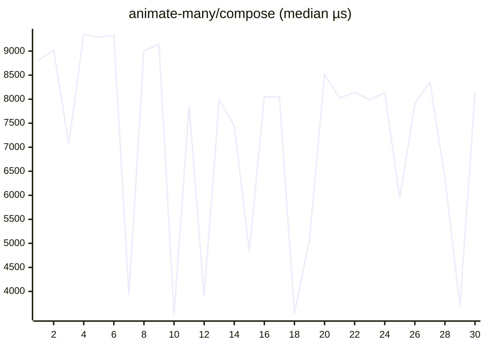
```mermaid
xychart-beta
    title "animate-many/compose (median µs)"
    x-axis 1 --> 30
    line [8812.6, 9018.9, 7078.2, 9350.0, 9290.5, 9323.4, 3931.6, 9007.0, 9145.8, 3511.4, 7871.3, 3905.5, 7991.3, 7448.7, 4830.1, 8052.7, 8051.7, 3544.0, 5080.3, 8517.9, 8024.1, 8142.0, 7989.4, 8130.4, 5949.5, 7899.9, 8352.9, 6351.3, 3705.7, 8123.9]
```

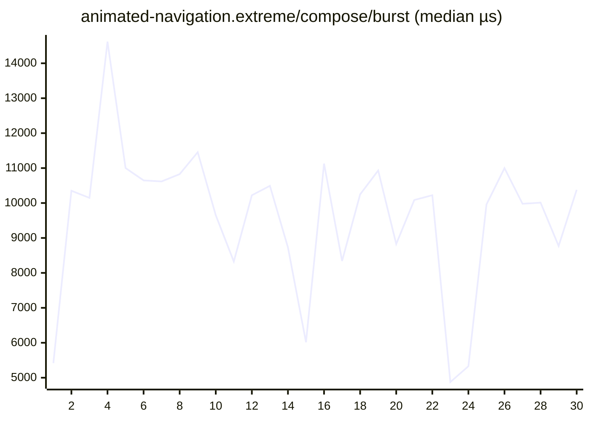
```mermaid
xychart-beta
    title "animated-navigation.extreme/compose/burst (median µs)"
    x-axis 1 --> 30
    line [5417.4, 10352.0, 10148.1, 14620.0, 11001.3, 10648.2, 10619.1, 10828.7, 11454.3, 9650.5, 8326.5, 10222.6, 10491.4, 8730.0, 6015.0, 11128.6, 8341.6, 10247.8, 10930.6, 8827.2, 10085.6, 10224.2, 4875.8, 5329.1, 9957.3, 10999.1, 9978.4, 10011.0, 8770.5, 10377.8]
```

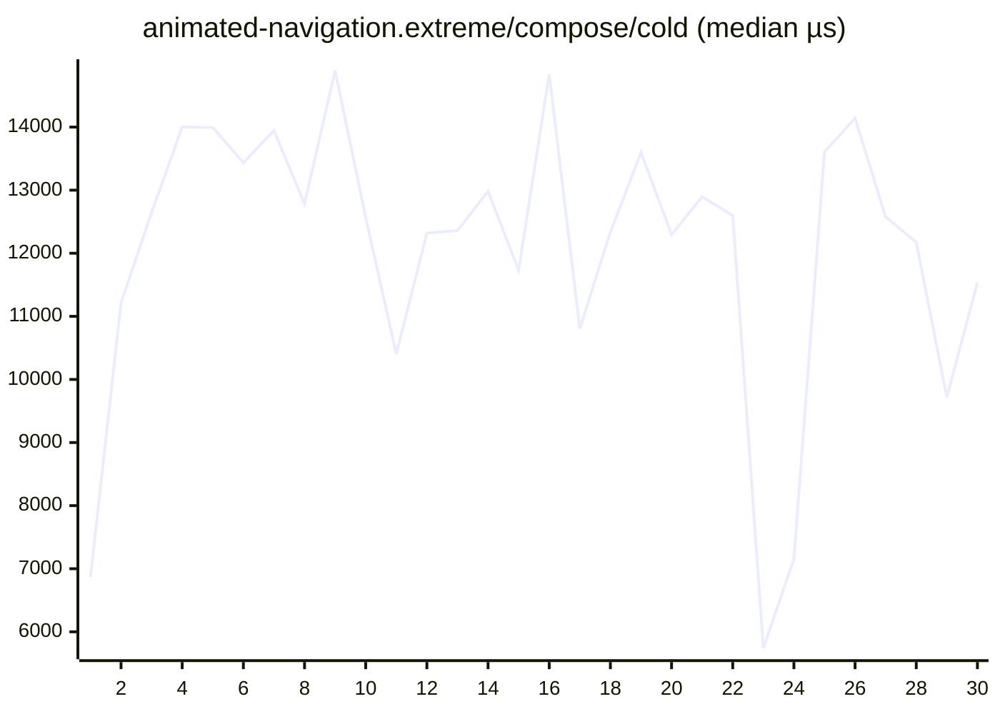
```mermaid
xychart-beta
    title "animated-navigation.extreme/compose/cold (median µs)"
    x-axis 1 --> 30
    line [6863.5, 11215.0, 12647.6, 14001.3, 13992.4, 13436.5, 13944.0, 12784.2, 14895.2, 12563.8, 10404.1, 12317.7, 12360.1, 12983.5, 11732.2, 14835.2, 10804.5, 12336.1, 13597.5, 12294.8, 12895.5, 12596.9, 5744.2, 7150.1, 13607.5, 14140.0, 12576.7, 12173.8, 9720.2, 11534.1]
```

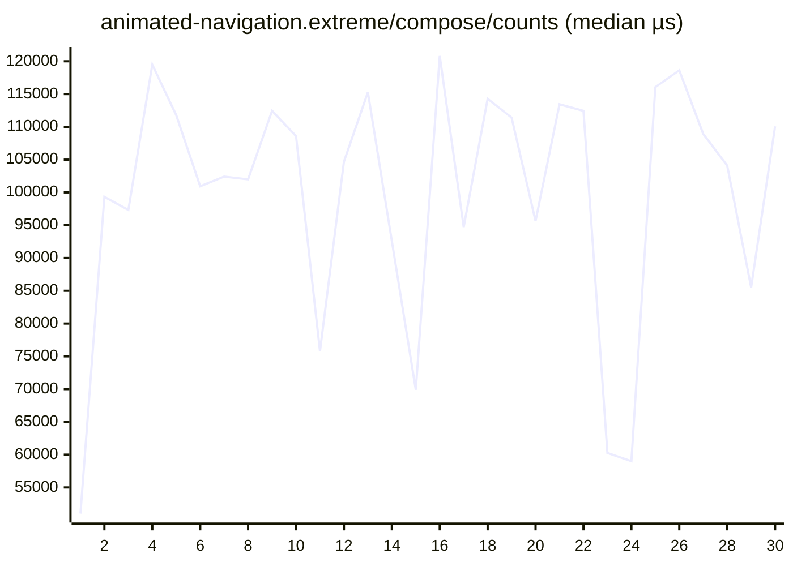
```mermaid
xychart-beta
    title "animated-navigation.extreme/compose/counts (median µs)"
    x-axis 1 --> 30
    line [51011.6, 99326.3, 97321.5, 119485.1, 111776.4, 100931.5, 102412.1, 101996.3, 112444.9, 108595.6, 75778.5, 104684.2, 115275.0, 92599.6, 69909.5, 120812.9, 94718.1, 114280.3, 111413.0, 95643.5, 113439.9, 112446.5, 60265.7, 59005.6, 116057.2, 118620.5, 108909.5, 104100.9, 85517.8, 110076.9]
```

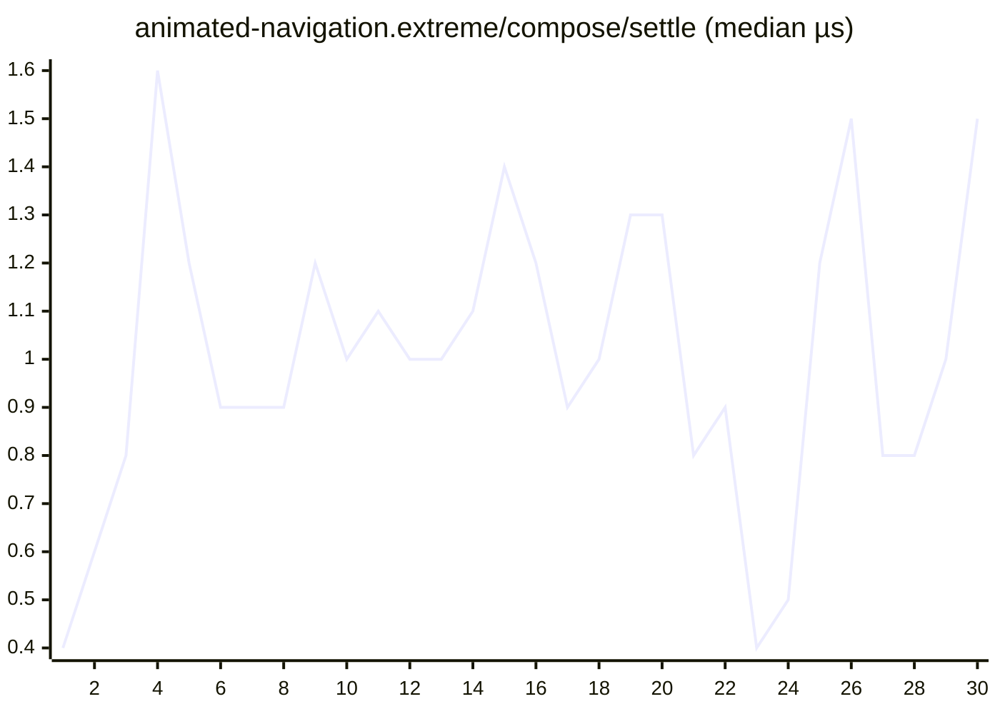
```mermaid
xychart-beta
    title "animated-navigation.extreme/compose/settle (median µs)"
    x-axis 1 --> 30
    line [0.4, 0.6, 0.8, 1.6, 1.2, 0.9, 0.9, 0.9, 1.2, 1.0, 1.1, 1.0, 1.0, 1.1, 1.4, 1.2, 0.9, 1.0, 1.3, 1.3, 0.8, 0.9, 0.4, 0.5, 1.2, 1.5, 0.8, 0.8, 1.0, 1.5]
```

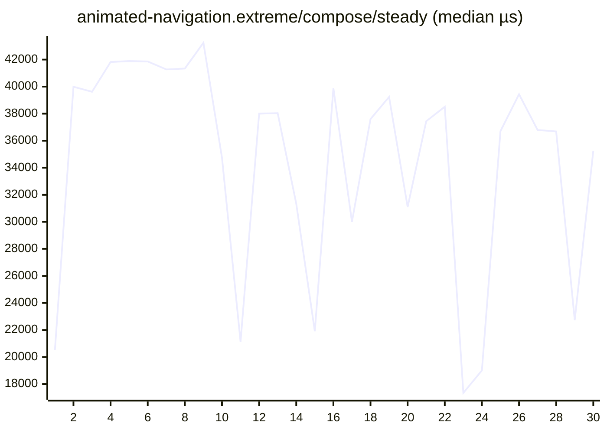
```mermaid
xychart-beta
    title "animated-navigation.extreme/compose/steady (median µs)"
    x-axis 1 --> 30
    line [20506.3, 39990.7, 39619.2, 41820.0, 41894.2, 41861.0, 41271.1, 41339.3, 43241.1, 34740.9, 21123.9, 38003.0, 38037.8, 31341.2, 21905.8, 39887.1, 30005.5, 37602.2, 39235.6, 31100.1, 37439.1, 38508.9, 17344.6, 19008.6, 36706.3, 39436.2, 36794.0, 36686.5, 22734.6, 35250.8]
```

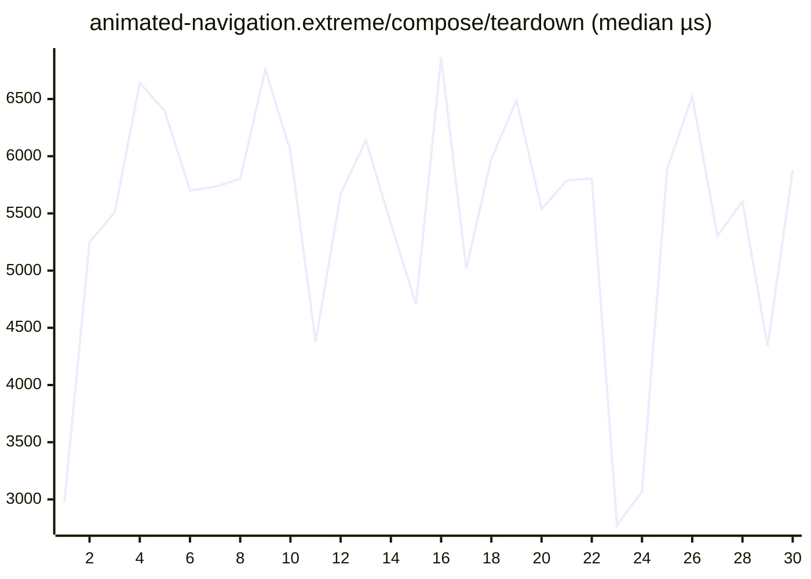
```mermaid
xychart-beta
    title "animated-navigation.extreme/compose/teardown (median µs)"
    x-axis 1 --> 30
    line [2977.0, 5249.1, 5507.8, 6640.7, 6392.4, 5701.8, 5732.5, 5802.2, 6756.8, 6043.1, 4376.4, 5670.1, 6138.4, 5409.4, 4705.5, 6865.1, 5015.4, 5977.5, 6485.2, 5538.6, 5787.0, 5805.5, 2772.4, 3070.6, 5888.1, 6524.7, 5304.0, 5602.6, 4338.7, 5880.5]
```

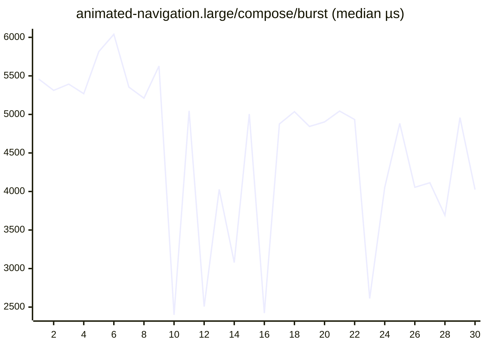
```mermaid
xychart-beta
    title "animated-navigation.large/compose/burst (median µs)"
    x-axis 1 --> 30
    line [5460.4, 5311.3, 5393.0, 5268.9, 5814.8, 6039.4, 5353.6, 5210.9, 5627.8, 2398.7, 5047.0, 2506.7, 4027.9, 3078.6, 5005.2, 2421.4, 4875.7, 5035.0, 4843.4, 4902.2, 5043.4, 4933.4, 2611.7, 4052.9, 4883.0, 4054.2, 4113.6, 3690.6, 4958.8, 4024.5]
```

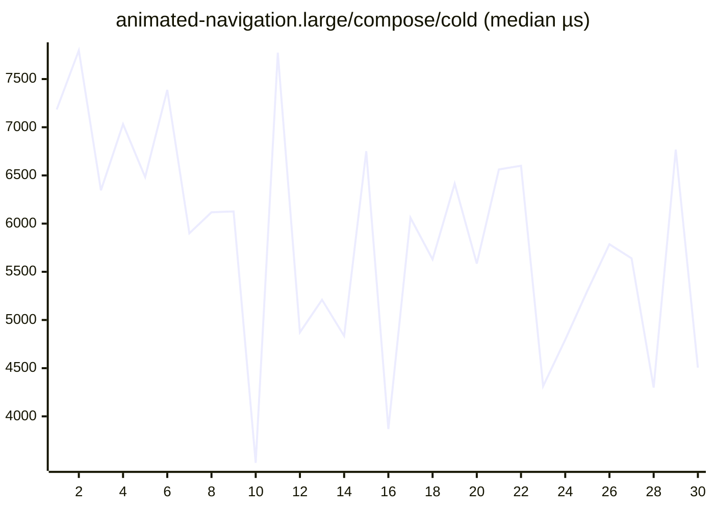
```mermaid
xychart-beta
    title "animated-navigation.large/compose/cold (median µs)"
    x-axis 1 --> 30
    line [7184.5, 7797.2, 6345.3, 7032.3, 6482.5, 7387.8, 5899.0, 6117.5, 6126.6, 3517.8, 7772.8, 4871.7, 5209.7, 4834.5, 6751.5, 3868.6, 6060.8, 5629.1, 6414.7, 5584.9, 6562.1, 6600.4, 4313.0, 4795.4, 5301.9, 5785.6, 5640.1, 4298.6, 6767.6, 4505.4]
```

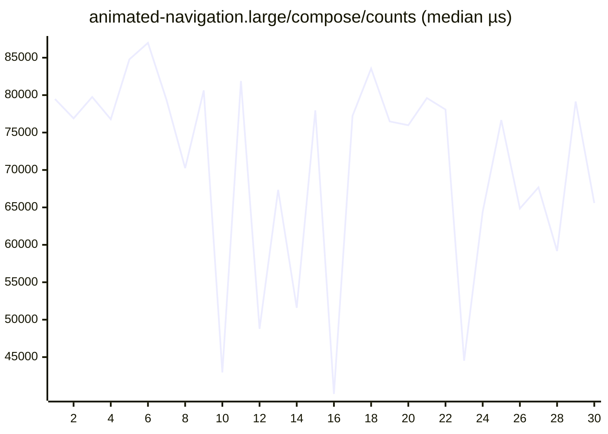
```mermaid
xychart-beta
    title "animated-navigation.large/compose/counts (median µs)"
    x-axis 1 --> 30
    line [79481.4, 76894.2, 79750.4, 76777.6, 84775.3, 86975.8, 79334.4, 70248.6, 80634.0, 42948.0, 81887.6, 48776.5, 67346.9, 51586.7, 77963.3, 40090.5, 77229.5, 83557.6, 76478.4, 75980.7, 79609.1, 78071.6, 44514.1, 64427.8, 76665.0, 64851.1, 67679.8, 59172.8, 79151.1, 65583.8]
```

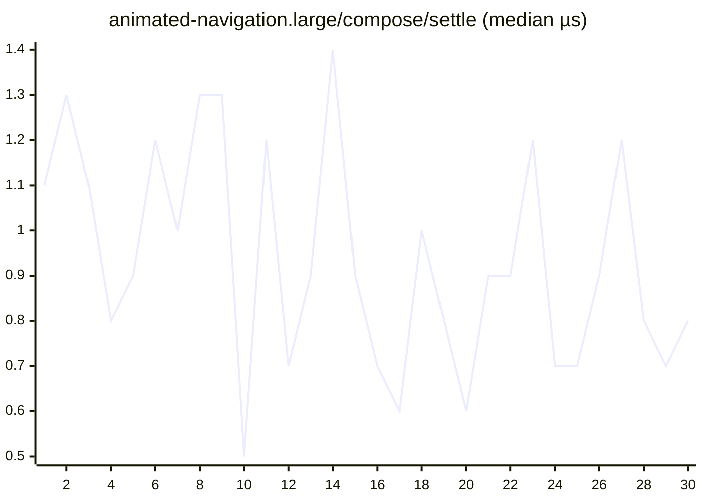
```mermaid
xychart-beta
    title "animated-navigation.large/compose/settle (median µs)"
    x-axis 1 --> 30
    line [1.1, 1.3, 1.1, 0.8, 0.9, 1.2, 1.0, 1.3, 1.3, 0.5, 1.2, 0.7, 0.9, 1.4, 0.9, 0.7, 0.6, 1.0, 0.8, 0.6, 0.9, 0.9, 1.2, 0.7, 0.7, 0.9, 1.2, 0.8, 0.7, 0.8]
```

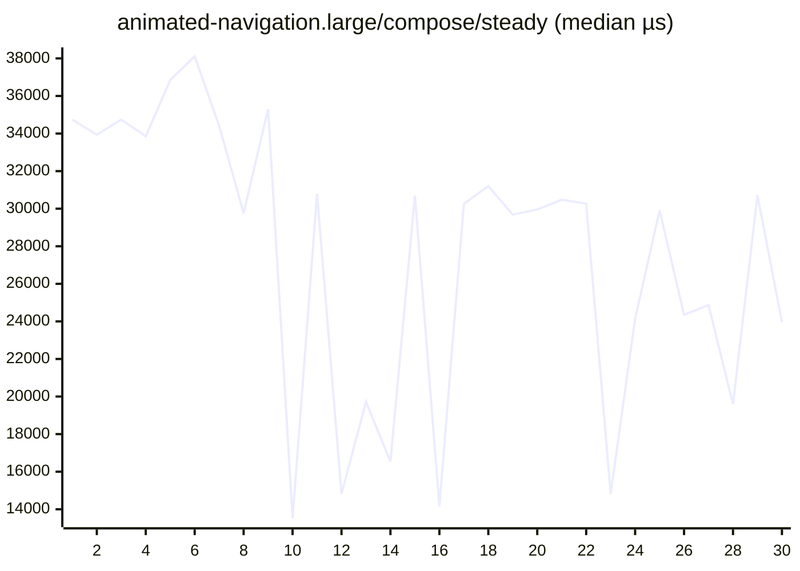
```mermaid
xychart-beta
    title "animated-navigation.large/compose/steady (median µs)"
    x-axis 1 --> 30
    line [34740.3, 33937.2, 34748.5, 33855.1, 36848.3, 38104.0, 34408.9, 29761.2, 35305.9, 13524.7, 30803.7, 14816.2, 19716.8, 16533.1, 30696.2, 14153.7, 30250.8, 31201.8, 29685.5, 29957.2, 30475.8, 30269.5, 14805.7, 24144.6, 29911.9, 24350.8, 24863.9, 19597.0, 30716.9, 23970.8]
```

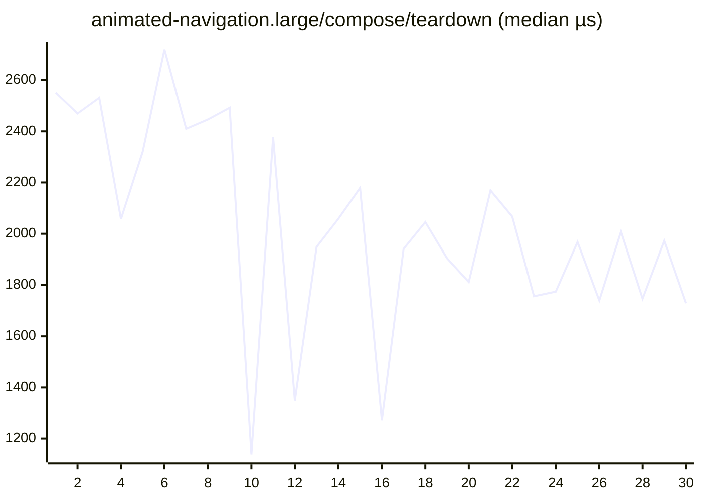
```mermaid
xychart-beta
    title "animated-navigation.large/compose/teardown (median µs)"
    x-axis 1 --> 30
    line [2550.9, 2469.9, 2531.3, 2057.3, 2320.4, 2719.6, 2410.2, 2446.6, 2492.4, 1137.6, 2377.9, 1348.5, 1948.9, 2058.2, 2178.6, 1271.3, 1941.3, 2045.7, 1904.4, 1811.7, 2169.1, 2067.0, 1756.4, 1774.4, 1968.1, 1739.8, 2009.7, 1746.8, 1973.0, 1729.3]
```

```mermaid
xychart-beta
    title "animated-navigation.medium/compose/burst (median µs)"
    x-axis 1 --> 30
    line [785.0, 1700.0, 1725.9, 1764.0, 1852.4, 1131.0, 1731.3, 1229.1, 1755.1, 1228.7, 816.2, 1692.5, 1306.3, 1734.2, 1687.1, 1746.4, 1732.7, 1299.1, 1691.4, 1546.9, 1676.1, 819.9, 1695.8, 793.0, 1305.0, 1690.8, 1669.4, 1686.3, 755.6, 1715.7]
```

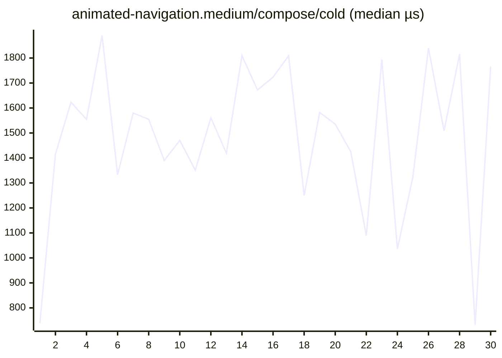
```mermaid
xychart-beta
    title "animated-navigation.medium/compose/cold (median µs)"
    x-axis 1 --> 30
    line [738.5, 1415.3, 1622.8, 1554.6, 1890.6, 1332.9, 1580.0, 1554.9, 1390.0, 1470.1, 1351.3, 1561.0, 1418.9, 1809.2, 1672.2, 1723.4, 1808.8, 1250.5, 1582.2, 1535.6, 1425.1, 1089.0, 1794.0, 1036.0, 1325.3, 1839.9, 1508.6, 1815.3, 732.0, 1766.8]
```

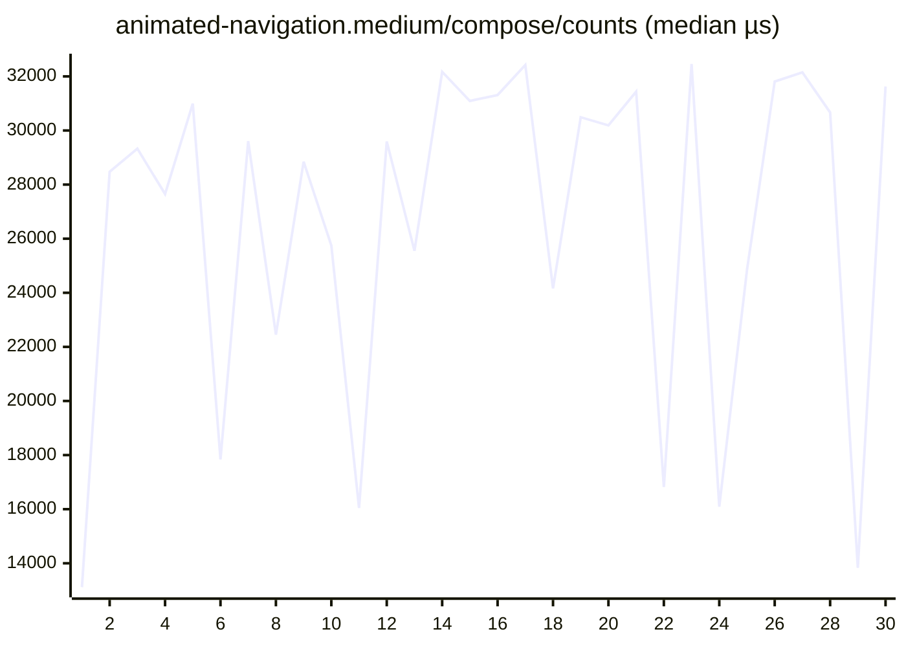
```mermaid
xychart-beta
    title "animated-navigation.medium/compose/counts (median µs)"
    x-axis 1 --> 30
    line [13117.0, 28472.2, 29329.2, 27651.1, 30993.3, 17839.5, 29606.1, 22453.4, 28845.5, 25750.2, 16043.3, 29594.8, 25552.2, 32169.2, 31092.9, 31310.6, 32421.7, 24162.8, 30491.0, 30188.0, 31435.5, 16820.4, 32459.7, 16093.7, 24842.8, 31808.4, 32146.2, 30668.2, 13834.1, 31629.1]
```

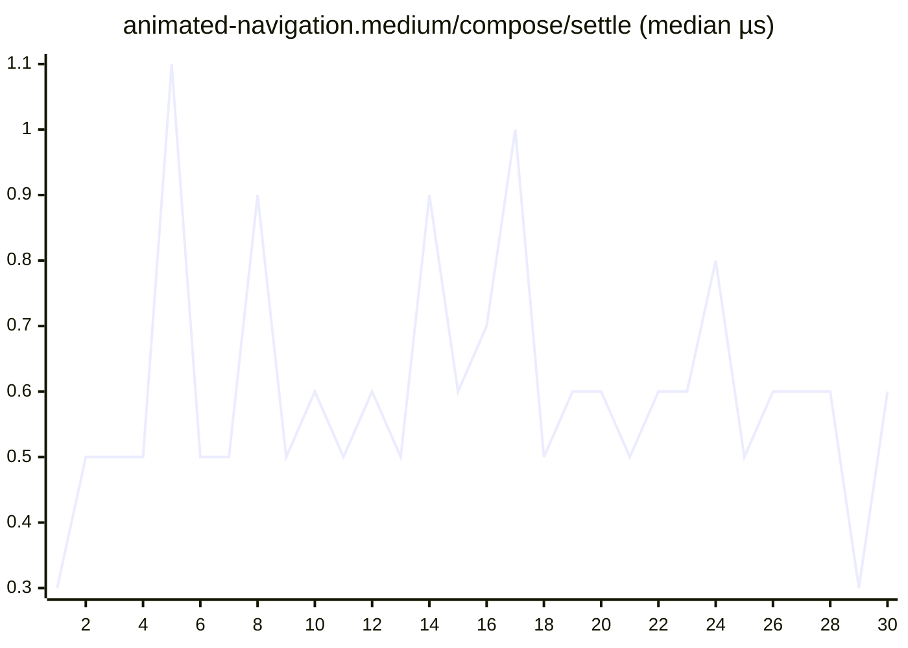
```mermaid
xychart-beta
    title "animated-navigation.medium/compose/settle (median µs)"
    x-axis 1 --> 30
    line [0.3, 0.5, 0.5, 0.5, 1.1, 0.5, 0.5, 0.9, 0.5, 0.6, 0.5, 0.6, 0.5, 0.9, 0.6, 0.7, 1.0, 0.5, 0.6, 0.6, 0.5, 0.6, 0.6, 0.8, 0.5, 0.6, 0.6, 0.6, 0.3, 0.6]
```

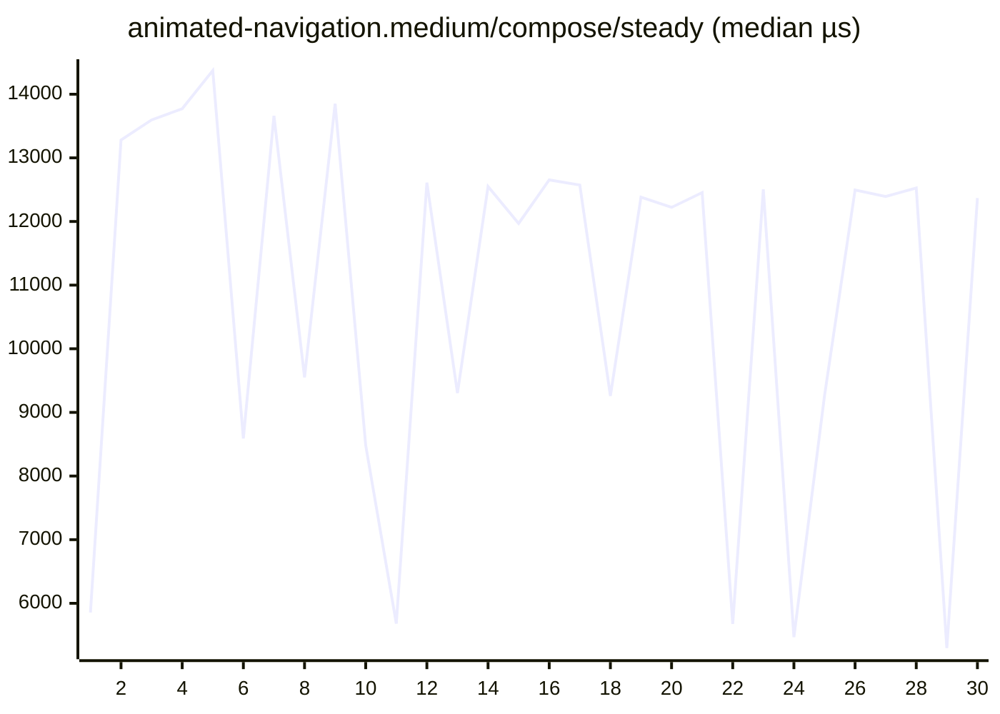
```mermaid
xychart-beta
    title "animated-navigation.medium/compose/steady (median µs)"
    x-axis 1 --> 30
    line [5854.3, 13280.4, 13596.6, 13771.9, 14371.4, 8590.2, 13660.6, 9551.5, 13852.3, 8480.8, 5681.7, 12610.6, 9304.5, 12550.6, 11968.6, 12653.6, 12572.6, 9260.6, 12383.3, 12221.9, 12453.1, 5674.7, 12506.1, 5468.2, 9258.8, 12495.8, 12392.6, 12526.1, 5298.2, 12367.4]
```

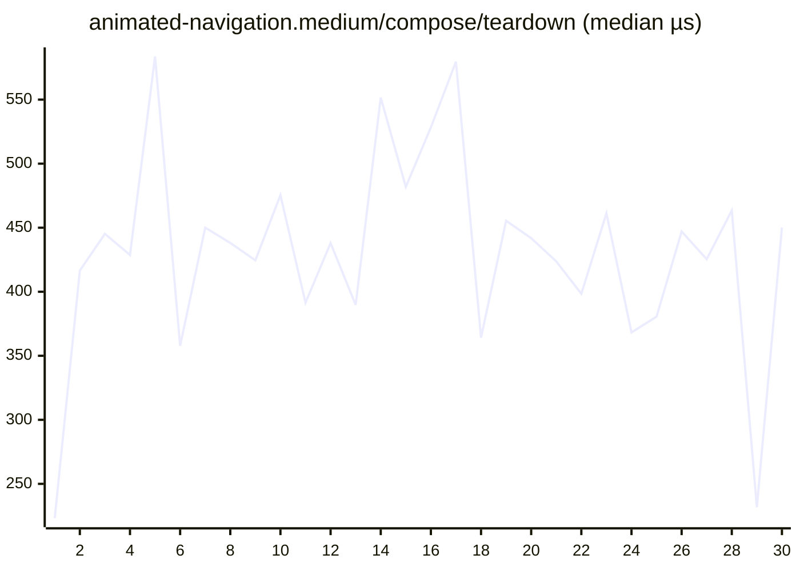
```mermaid
xychart-beta
    title "animated-navigation.medium/compose/teardown (median µs)"
    x-axis 1 --> 30
    line [223.2, 416.5, 445.2, 428.7, 583.7, 357.8, 450.1, 438.1, 424.5, 475.4, 391.4, 438.0, 389.7, 551.6, 481.9, 528.3, 579.6, 364.2, 455.4, 441.8, 423.7, 398.4, 461.2, 368.2, 380.6, 447.0, 425.4, 463.5, 231.7, 450.1]
```

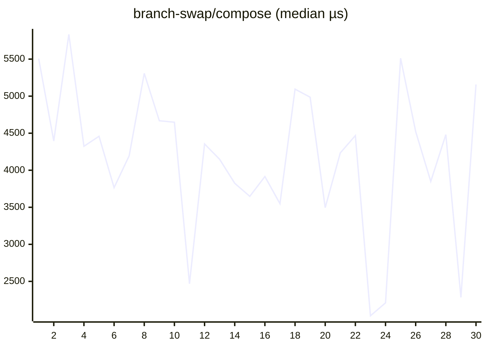
```mermaid
xychart-beta
    title "branch-swap/compose (median µs)"
    x-axis 1 --> 30
    line [5507.4, 4395.0, 5833.5, 4323.2, 4457.9, 3765.1, 4195.0, 5307.4, 4667.8, 4647.9, 2468.6, 4354.5, 4147.3, 3824.0, 3647.8, 3914.8, 3549.0, 5094.5, 4986.6, 3495.0, 4233.5, 4468.1, 2035.2, 2210.5, 5511.1, 4522.1, 3848.6, 4480.8, 2284.4, 5158.1]
```

```mermaid
xychart-beta
    title "cold-mount-100/compose (median µs)"
    x-axis 1 --> 30
    line [639.7, 531.3, 306.7, 960.8, 541.6, 519.0, 587.9, 546.0, 604.5, 525.6, 371.7, 536.9, 517.5, 408.5, 650.9, 546.0, 389.3, 892.7, 535.8, 460.7, 571.4, 724.1, 255.5, 319.1, 504.8, 578.6, 535.8, 922.7, 676.4, 840.9]
```

```mermaid
xychart-beta
    title "cold-mount-1000/compose (median µs)"
    x-axis 1 --> 30
    line [7804.5, 6104.5, 7423.7, 6271.5, 5851.5, 7013.2, 8536.0, 3596.5, 8471.5, 6259.1, 5919.6, 3302.6, 3617.9, 9809.3, 6560.8, 6510.1, 6336.3, 8381.9, 6448.6, 7934.9, 4846.2, 8892.6, 6255.4, 6313.0, 3334.3, 6509.5, 5299.2, 8292.2, 6014.2, 3409.1]
```

```mermaid
xychart-beta
    title "cold-mount-10000/compose (median µs)"
    x-axis 1 --> 30
    line [93383.3, 111347.0, 102155.1, 73856.0, 87952.6, 96468.1, 91553.4, 70451.2, 91283.7, 99690.5, 67702.7, 104388.2, 95890.4, 111967.6, 89707.9, 81881.6, 78395.2, 74829.6, 106286.7, 99070.3, 63175.3, 77193.9, 70830.8, 96805.3, 58104.7, 72413.0, 81450.9, 83272.9, 66156.2, 109137.6]
```

```mermaid
xychart-beta
    title "data-grid.extreme/compose/burst (median µs)"
    x-axis 1 --> 30
    line [754887.8, 772293.0, 595984.0, 798879.1, 857320.9, 761033.9, 838712.3, 860892.2, 769258.3, 663198.9, 676076.6, 793178.6, 636347.5, 826621.2, 822831.6, 814532.5, 952940.6, 665289.3, 783317.0, 778653.4, 794511.6, 757833.2, 863574.7, 583083.7, 628102.3, 844660.4, 803296.9, 795929.3, 455152.2, 832534.6]
```

```mermaid
xychart-beta
    title "data-grid.extreme/compose/cold (median µs)"
    x-axis 1 --> 30
    line [462469.9, 476090.6, 366860.8, 496112.4, 535826.3, 461725.7, 511909.0, 517708.6, 465520.4, 385891.3, 404071.9, 486286.3, 389062.7, 494954.6, 493782.7, 503763.7, 579274.3, 399551.6, 484415.9, 472865.5, 495737.4, 459865.5, 531118.0, 350100.7, 390888.4, 532403.1, 469857.7, 483692.6, 282308.3, 512296.0]
```

```mermaid
xychart-beta
    title "data-grid.extreme/compose/counts (median µs)"
    x-axis 1 --> 30
    line [1311694.3, 1340877.2, 1045036.9, 1370205.3, 1453792.0, 1312466.3, 1416656.0, 1434623.4, 1413699.5, 1164479.8, 1205615.5, 1378751.9, 1099291.7, 1442248.6, 1418710.6, 1426435.1, 1619647.7, 1149474.0, 1391557.5, 1316213.1, 1386580.9, 1282123.2, 1597390.8, 965842.1, 1210333.9, 1538190.9, 1436951.7, 1323030.8, 889133.1, 1374221.7]
```

```mermaid
xychart-beta
    title "data-grid.extreme/compose/settle (median µs)"
    x-axis 1 --> 30
    line [2.1, 2.1, 2.3, 1.8, 2.1, 3.3, 1.9, 2.7, 2.0, 2.3, 2.8, 2.2, 2.4, 2.1, 2.7, 2.1, 2.6, 1.7, 2.0, 2.1, 2.0, 3.1, 2.3, 2.5, 2.5, 2.5, 2.0, 1.8, 2.2, 2.1]
```

```mermaid
xychart-beta
    title "data-grid.extreme/compose/steady (median µs)"
    x-axis 1 --> 30
    line [23661.7, 23571.0, 16761.3, 23826.3, 24369.2, 19606.9, 24245.4, 20492.2, 24703.4, 18192.7, 15296.2, 24530.0, 18385.9, 24886.9, 24241.6, 24030.1, 24957.0, 18918.2, 24760.2, 23105.6, 23878.8, 15251.4, 24309.0, 14034.1, 19053.5, 25422.8, 24914.4, 23689.8, 11161.0, 22004.6]
```

```mermaid
xychart-beta
    title "data-grid.extreme/compose/teardown (median µs)"
    x-axis 1 --> 30
    line [1123.5, 1167.7, 1113.5, 1211.1, 1268.8, 1534.1, 1273.8, 1548.2, 1234.9, 1018.6, 1612.8, 1156.4, 985.3, 1144.1, 1336.2, 1126.0, 1372.7, 1080.1, 1117.6, 1105.4, 1140.9, 1443.0, 1266.7, 1006.2, 992.8, 1222.4, 1362.2, 1120.3, 849.4, 1145.5]
```

```mermaid
xychart-beta
    title "data-grid.large/compose/burst (median µs)"
    x-axis 1 --> 30
    line [151845.7, 135416.4, 82048.7, 132619.5, 137505.2, 141504.7, 142340.9, 125288.7, 139513.0, 76048.5, 139575.3, 82866.3, 117220.3, 93456.3, 138005.1, 91593.5, 133369.7, 145660.8, 132292.1, 131621.8, 134099.6, 133228.9, 86555.4, 105137.8, 129655.9, 104774.4, 110538.9, 111890.9, 136160.2, 109609.7]
```

```mermaid
xychart-beta
    title "data-grid.large/compose/cold (median µs)"
    x-axis 1 --> 30
    line [92098.4, 74633.1, 48182.4, 77927.1, 75020.1, 78384.8, 81778.9, 67892.8, 80042.2, 43867.1, 80097.4, 47326.0, 69754.2, 52751.2, 81053.5, 49503.5, 76821.3, 83285.7, 75512.6, 76930.5, 77890.2, 80461.5, 49687.4, 57803.8, 77416.5, 59643.1, 59827.9, 65637.4, 82374.5, 60637.0]
```

```mermaid
xychart-beta
    title "data-grid.large/compose/counts (median µs)"
    x-axis 1 --> 30
    line [282491.5, 248494.0, 152428.6, 243799.2, 245311.7, 262333.4, 259613.4, 228268.6, 255969.3, 136831.2, 252868.0, 153440.2, 219925.5, 166799.8, 255561.6, 156582.3, 246140.3, 264312.1, 239355.1, 259127.9, 247856.7, 258002.0, 154969.1, 193339.9, 246767.5, 198546.4, 202545.5, 213753.9, 248017.5, 191071.6]
```

```mermaid
xychart-beta
    title "data-grid.large/compose/settle (median µs)"
    x-axis 1 --> 30
    line [2.9, 2.0, 2.4, 1.7, 1.4, 2.3, 2.3, 2.2, 1.8, 1.5, 2.2, 2.1, 2.7, 2.2, 1.7, 2.4, 1.7, 2.7, 1.2, 1.3, 1.8, 1.9, 2.6, 1.8, 1.6, 1.8, 2.2, 2.0, 1.8, 2.3]
```

```mermaid
xychart-beta
    title "data-grid.large/compose/steady (median µs)"
    x-axis 1 --> 30
    line [18673.3, 17193.8, 10296.2, 16545.0, 15506.0, 19549.2, 17526.2, 15670.7, 17911.5, 8701.9, 18142.9, 9085.4, 14131.5, 11823.7, 16652.0, 9788.7, 17498.0, 19611.4, 16393.7, 16461.5, 16718.0, 18623.4, 10276.1, 13347.1, 18594.1, 15212.2, 15045.3, 13118.4, 14467.5, 12883.6]
```

```mermaid
xychart-beta
    title "data-grid.large/compose/teardown (median µs)"
    x-axis 1 --> 30
    line [641.7, 540.5, 369.9, 537.0, 551.3, 554.9, 577.3, 500.0, 577.4, 327.6, 517.1, 316.1, 576.9, 394.7, 514.5, 453.7, 526.9, 543.6, 504.2, 515.5, 519.2, 533.7, 396.3, 429.0, 516.2, 427.2, 426.4, 489.0, 530.3, 456.7]
```

```mermaid
xychart-beta
    title "data-grid.medium/compose/burst (median µs)"
    x-axis 1 --> 30
    line [34916.1, 61511.6, 63443.2, 67987.2, 63098.7, 62579.7, 61672.7, 63331.6, 68810.0, 63674.7, 40565.8, 62643.1, 64655.2, 50174.4, 38453.3, 64343.5, 47809.3, 63392.9, 64886.3, 51287.4, 64930.7, 61422.6, 33998.9, 38590.5, 63540.8, 65112.1, 60636.0, 61684.2, 38869.4, 59433.4]
```

```mermaid
xychart-beta
    title "data-grid.medium/compose/cold (median µs)"
    x-axis 1 --> 30
    line [19402.6, 36210.4, 35904.6, 36170.4, 36526.9, 36098.8, 36474.8, 38580.5, 37707.2, 36575.2, 22310.4, 35914.3, 36205.8, 28753.8, 21938.0, 35951.2, 27912.7, 36502.1, 35030.3, 27718.5, 36388.2, 36237.2, 19782.7, 22365.5, 37548.2, 37828.5, 35621.9, 36331.3, 23111.2, 33610.9]
```

```mermaid
xychart-beta
    title "data-grid.medium/compose/counts (median µs)"
    x-axis 1 --> 30
    line [70947.7, 144000.7, 133650.4, 133813.7, 135280.4, 134894.5, 139250.8, 133305.8, 150466.1, 141788.5, 86628.2, 134077.9, 138130.7, 106019.0, 82812.4, 135626.8, 103432.5, 144370.6, 135879.3, 111982.0, 135389.8, 130745.1, 68927.0, 84025.1, 134753.1, 140776.6, 132096.3, 134851.5, 88491.9, 126072.8]
```

```mermaid
xychart-beta
    title "data-grid.medium/compose/settle (median µs)"
    x-axis 1 --> 30
    line [0.7, 1.1, 1.4, 2.4, 2.0, 1.3, 1.7, 1.6, 2.1, 1.9, 1.4, 1.2, 2.0, 2.0, 2.2, 2.3, 1.6, 1.8, 1.8, 2.2, 1.7, 1.2, 0.7, 2.0, 2.2, 2.2, 1.0, 1.9, 1.2, 1.9]
```

```mermaid
xychart-beta
    title "data-grid.medium/compose/steady (median µs)"
    x-axis 1 --> 30
    line [6990.4, 14343.4, 14314.2, 13381.3, 14342.5, 15545.6, 14298.5, 14988.3, 15590.1, 15530.2, 10448.3, 16344.1, 15906.7, 10671.5, 8254.0, 15469.9, 10525.9, 16487.7, 13266.5, 11009.4, 14255.7, 14961.8, 7824.3, 8515.9, 14565.4, 17090.1, 14305.8, 14865.6, 9330.5, 11636.3]
```

```mermaid
xychart-beta
    title "data-grid.medium/compose/teardown (median µs)"
    x-axis 1 --> 30
    line [160.9, 289.9, 317.4, 326.9, 305.3, 354.2, 308.2, 429.4, 444.6, 288.7, 182.1, 309.9, 304.2, 260.1, 188.8, 311.0, 240.7, 310.4, 335.2, 259.8, 294.5, 281.2, 160.0, 203.1, 315.3, 325.2, 284.1, 308.2, 200.6, 287.6]
```

```mermaid
xychart-beta
    title "dense-dashboard.extreme/compose/burst (median µs)"
    x-axis 1 --> 30
    line [8047.5, 14601.3, 15551.0, 15731.4, 18780.6, 20702.4, 7290.4, 16351.7, 17741.2, 10335.5, 17239.5, 9913.9, 15039.1, 18051.2, 13176.8, 17727.6, 15282.4, 8785.6, 16160.2, 19850.9, 14976.8, 16218.1, 15982.2, 15742.3, 15591.1, 15470.8, 17455.7, 12618.6, 11205.0, 17425.6]
```

```mermaid
xychart-beta
    title "dense-dashboard.extreme/compose/cold (median µs)"
    x-axis 1 --> 30
    line [248.4, 461.3, 475.3, 486.0, 588.4, 588.4, 247.5, 509.0, 558.4, 326.2, 547.0, 300.3, 466.7, 547.2, 440.7, 566.5, 475.5, 279.2, 554.1, 583.9, 561.9, 562.5, 519.3, 522.2, 525.3, 483.2, 564.0, 415.9, 391.6, 584.4]
```

```mermaid
xychart-beta
    title "dense-dashboard.extreme/compose/counts (median µs)"
    x-axis 1 --> 30
    line [12089.7, 21520.1, 21049.7, 20208.7, 24624.7, 31135.2, 10473.3, 25634.2, 25483.0, 13763.3, 25831.5, 15243.1, 22473.9, 26871.6, 20232.5, 23972.3, 23530.6, 12883.1, 24367.3, 27198.9, 22582.9, 25659.1, 22605.5, 23930.6, 23610.2, 22523.6, 23929.4, 19348.0, 18257.5, 28135.3]
```

```mermaid
xychart-beta
    title "dense-dashboard.extreme/compose/settle (median µs)"
    x-axis 1 --> 30
    line [0.5, 0.8, 0.7, 1.0, 1.4, 2.1, 0.5, 1.2, 1.4, 0.7, 1.1, 0.6, 0.8, 1.0, 1.1, 1.4, 0.8, 0.7, 1.9, 1.7, 0.9, 1.2, 0.9, 0.8, 1.7, 0.9, 1.2, 0.9, 0.9, 1.4]
```

```mermaid
xychart-beta
    title "dense-dashboard.extreme/compose/steady (median µs)"
    x-axis 1 --> 30
    line [452.8, 842.4, 846.0, 912.4, 882.1, 894.1, 432.0, 867.2, 871.6, 462.2, 912.2, 460.0, 870.0, 885.7, 654.3, 896.8, 888.8, 479.3, 729.2, 913.6, 918.6, 903.9, 906.1, 896.7, 757.0, 887.0, 903.6, 736.2, 477.9, 928.8]
```

```mermaid
xychart-beta
    title "dense-dashboard.extreme/compose/teardown (median µs)"
    x-axis 1 --> 30
    line [290.0, 507.9, 518.9, 573.0, 610.4, 701.6, 273.7, 541.8, 603.5, 341.1, 584.4, 343.9, 500.6, 632.1, 446.2, 575.1, 523.6, 299.0, 595.2, 718.0, 558.8, 608.7, 528.6, 511.7, 554.4, 501.4, 559.2, 429.5, 450.3, 634.5]
```

```mermaid
xychart-beta
    title "dense-dashboard.large/compose/burst (median µs)"
    x-axis 1 --> 30
    line [8475.1, 8457.4, 3546.4, 7461.2, 7904.5, 8709.4, 9023.0, 7643.9, 10076.2, 3846.3, 9131.7, 4286.2, 6940.4, 6276.4, 8401.9, 5037.3, 7301.2, 8151.4, 7307.7, 7462.6, 8749.1, 7314.2, 5769.1, 6326.8, 7457.0, 5897.4, 7260.2, 7296.2, 8023.4, 5928.1]
```

```mermaid
xychart-beta
    title "dense-dashboard.large/compose/cold (median µs)"
    x-axis 1 --> 30
    line [349.5, 340.1, 145.5, 298.1, 305.9, 354.4, 322.9, 336.4, 336.0, 150.3, 385.4, 191.9, 304.7, 271.2, 415.9, 200.4, 322.4, 319.6, 311.9, 294.7, 399.4, 324.8, 251.9, 273.8, 298.8, 238.4, 296.9, 286.8, 329.2, 267.3]
```

```mermaid
xychart-beta
    title "dense-dashboard.large/compose/counts (median µs)"
    x-axis 1 --> 30
    line [16718.8, 16077.0, 6534.0, 16146.4, 15768.8, 16845.8, 15171.8, 14831.0, 17630.3, 8939.2, 16624.3, 10802.9, 14977.6, 11944.0, 17463.9, 10249.2, 17418.0, 18985.1, 17307.2, 15628.8, 17687.5, 16874.3, 11218.8, 12840.5, 16165.0, 13173.1, 15255.5, 14029.8, 17821.6, 11377.3]
```

```mermaid
xychart-beta
    title "dense-dashboard.large/compose/settle (median µs)"
    x-axis 1 --> 30
    line [0.9, 0.8, 0.5, 0.7, 0.8, 0.9, 0.9, 1.7, 1.0, 0.5, 1.0, 0.6, 1.3, 1.0, 0.8, 0.6, 0.8, 1.1, 0.8, 0.8, 0.8, 0.8, 1.7, 0.6, 0.8, 0.6, 1.0, 1.1, 0.8, 0.7]
```

```mermaid
xychart-beta
    title "dense-dashboard.large/compose/steady (median µs)"
    x-axis 1 --> 30
    line [826.7, 839.5, 411.6, 847.3, 909.1, 913.2, 862.2, 727.1, 864.9, 439.5, 871.3, 447.3, 662.6, 476.5, 896.1, 462.6, 892.7, 881.9, 878.8, 887.0, 913.4, 894.6, 485.1, 733.0, 886.6, 744.9, 733.6, 672.4, 886.0, 731.7]
```

```mermaid
xychart-beta
    title "dense-dashboard.large/compose/teardown (median µs)"
    x-axis 1 --> 30
    line [267.3, 284.2, 125.9, 244.2, 259.0, 303.9, 272.3, 308.2, 358.3, 129.4, 295.6, 145.7, 223.4, 230.7, 306.8, 158.5, 265.6, 273.8, 260.7, 257.3, 309.1, 263.2, 229.7, 208.4, 240.8, 211.0, 241.3, 227.2, 272.1, 217.4]
```

```mermaid
xychart-beta
    title "dense-dashboard.medium/compose/burst (median µs)"
    x-axis 1 --> 30
    line [2831.0, 2969.0, 2450.6, 3084.4, 3083.7, 2222.7, 3204.2, 3077.0, 2907.7, 2543.9, 1783.0, 2888.8, 2071.5, 3513.4, 2950.3, 2847.8, 4046.3, 2225.1, 2876.8, 2798.9, 2738.0, 1868.7, 3491.6, 1484.7, 2477.7, 3549.1, 2661.7, 2710.7, 1501.0, 2734.5]
```

```mermaid
xychart-beta
    title "dense-dashboard.medium/compose/cold (median µs)"
    x-axis 1 --> 30
    line [188.2, 202.7, 179.5, 191.2, 281.6, 197.3, 216.0, 234.2, 210.0, 252.3, 176.0, 190.9, 151.0, 234.9, 211.3, 198.0, 257.8, 168.0, 190.6, 223.6, 210.0, 162.5, 249.3, 108.6, 161.3, 229.4, 209.5, 240.8, 102.3, 217.5]
```

```mermaid
xychart-beta
    title "dense-dashboard.medium/compose/counts (median µs)"
    x-axis 1 --> 30
    line [5970.4, 6362.2, 4937.2, 5544.6, 5995.1, 4503.3, 6032.2, 5345.3, 5947.6, 5114.6, 3930.7, 6435.8, 4930.8, 6408.9, 6303.1, 6117.0, 6223.1, 4790.4, 6096.5, 6206.2, 6259.4, 3551.4, 5897.1, 3468.5, 4763.3, 6640.1, 5488.4, 6374.5, 3002.9, 5409.2]
```

```mermaid
xychart-beta
    title "dense-dashboard.medium/compose/settle (median µs)"
    x-axis 1 --> 30
    line [0.7, 0.7, 0.9, 0.7, 0.7, 0.9, 0.7, 1.0, 0.7, 0.6, 0.6, 0.8, 0.5, 0.7, 0.7, 0.7, 1.0, 0.6, 0.7, 0.7, 0.7, 0.7, 0.7, 0.5, 0.6, 0.8, 0.7, 0.7, 0.5, 0.7]
```

```mermaid
xychart-beta
    title "dense-dashboard.medium/compose/steady (median µs)"
    x-axis 1 --> 30
    line [821.6, 821.9, 540.5, 849.9, 838.5, 600.2, 860.4, 658.6, 856.2, 721.6, 461.2, 868.1, 714.5, 864.6, 918.3, 874.3, 903.5, 724.6, 878.4, 880.3, 883.4, 468.2, 892.3, 432.7, 725.0, 885.9, 879.8, 885.9, 449.8, 875.8]
```

```mermaid
xychart-beta
    title "dense-dashboard.medium/compose/teardown (median µs)"
    x-axis 1 --> 30
    line [117.6, 114.1, 88.4, 117.1, 116.7, 100.5, 117.7, 120.6, 113.1, 112.2, 77.4, 113.2, 97.3, 129.9, 126.1, 124.3, 155.5, 91.7, 115.4, 120.6, 121.5, 97.9, 121.4, 68.2, 95.5, 132.2, 114.3, 121.6, 58.5, 109.8]
```

```mermaid
xychart-beta
    title "entities-identity-churn-10.extreme/compose/burst (median µs)"
    x-axis 1 --> 30
    line [46793.7, 56109.6, 45462.7, 48510.6, 60681.5, 40638.1, 42592.1, 45165.1, 45720.1, 43775.4, 32150.9, 51127.2, 60586.9, 50132.0, 49541.7, 40427.4, 39763.7, 40783.6, 47183.0, 55435.6, 36105.3, 45276.4, 31367.3, 45120.1, 31452.4, 47767.3, 46146.9, 46013.3, 39603.1, 48098.9]
```

```mermaid
xychart-beta
    title "entities-identity-churn-10.extreme/compose/cold (median µs)"
    x-axis 1 --> 30
    line [28617.6, 31620.7, 25764.4, 35864.8, 38703.7, 28915.5, 24546.1, 33122.0, 29407.0, 21782.9, 19334.8, 32107.6, 30731.2, 39019.4, 27726.3, 27455.6, 21124.2, 25320.6, 27015.9, 28157.3, 34774.6, 22447.7, 21195.1, 35348.3, 21337.0, 36161.4, 32718.2, 36281.2, 23444.4, 34919.6]
```

```mermaid
xychart-beta
    title "entities-identity-churn-10.extreme/compose/counts (median µs)"
    x-axis 1 --> 30
    line [216711.2, 259686.7, 213299.9, 224665.4, 302732.5, 179471.3, 189128.9, 221616.6, 221561.2, 196803.3, 167043.3, 237946.3, 298276.6, 242426.5, 216761.6, 207187.4, 206898.9, 200993.6, 231785.6, 256034.4, 195132.8, 214370.8, 126172.6, 215700.5, 138480.1, 209166.0, 211703.1, 201153.3, 183264.1, 206843.9]
```

```mermaid
xychart-beta
    title "entities-identity-churn-10.extreme/compose/settle (median µs)"
    x-axis 1 --> 30
    line [1.9, 2.2, 1.9, 2.0, 2.5, 2.2, 1.7, 1.7, 1.7, 3.4, 1.7, 1.9, 2.6, 2.1, 1.7, 1.4, 2.3, 1.8, 2.4, 2.3, 1.7, 2.5, 1.9, 1.5, 1.6, 1.8, 1.9, 1.8, 1.7, 1.7]
```

```mermaid
xychart-beta
    title "entities-identity-churn-10.extreme/compose/steady (median µs)"
    x-axis 1 --> 30
    line [56176.7, 68552.2, 52823.7, 55052.8, 90368.7, 44610.1, 45299.1, 54817.1, 51535.9, 53779.1, 28343.1, 54519.4, 73367.0, 54710.5, 48975.4, 44612.2, 40604.2, 42422.1, 61835.0, 58932.2, 41341.0, 41744.2, 32536.4, 46619.9, 27886.1, 47967.4, 46887.8, 46809.2, 42423.3, 50052.7]
```

```mermaid
xychart-beta
    title "entities-identity-churn-10.extreme/compose/teardown (median µs)"
    x-axis 1 --> 30
    line [1126.7, 1342.7, 1059.4, 1220.4, 1582.7, 1013.6, 940.5, 1217.9, 1070.6, 1033.1, 721.0, 1412.4, 1735.7, 1242.4, 1092.7, 1026.8, 1075.6, 954.7, 1248.5, 1334.5, 992.4, 1201.8, 801.8, 1122.8, 756.6, 1155.0, 1161.8, 1176.0, 949.2, 1267.5]
```

```mermaid
xychart-beta
    title "entities-identity-churn-10.large/compose/burst (median µs)"
    x-axis 1 --> 30
    line [7762.6, 14936.6, 13638.4, 15674.1, 15123.4, 14927.7, 16280.9, 13627.1, 17888.6, 14151.7, 12700.0, 14875.4, 13752.4, 11977.2, 12643.0, 15253.7, 12001.0, 13807.8, 14941.6, 14855.6, 14757.4, 13186.5, 7905.0, 8259.5, 15511.2, 16357.2, 14428.5, 13172.2, 11911.6, 13107.7]
```

```mermaid
xychart-beta
    title "entities-identity-churn-10.large/compose/cold (median µs)"
    x-axis 1 --> 30
    line [5293.1, 10171.5, 9263.7, 12055.5, 12834.4, 12587.0, 11756.7, 11684.6, 12659.0, 10409.2, 6356.7, 11574.3, 10654.0, 9466.6, 8895.9, 13125.2, 8398.4, 12037.7, 12560.4, 9259.3, 13122.0, 10724.2, 5612.8, 7316.4, 12563.3, 10753.2, 10949.5, 11943.5, 8005.9, 10895.8]
```

```mermaid
xychart-beta
    title "entities-identity-churn-10.large/compose/counts (median µs)"
    x-axis 1 --> 30
    line [34587.1, 64209.3, 62317.2, 77151.0, 69078.7, 67272.4, 67174.9, 64785.7, 76626.5, 73672.7, 49015.7, 64191.1, 72562.2, 58025.0, 47214.6, 75775.6, 59707.9, 70659.8, 67199.4, 65923.3, 65705.8, 62211.2, 45356.5, 36273.7, 70882.3, 80538.6, 61040.1, 66409.7, 52346.6, 65262.9]
```

```mermaid
xychart-beta
    title "entities-identity-churn-10.large/compose/settle (median µs)"
    x-axis 1 --> 30
    line [0.9, 1.2, 1.1, 2.2, 1.7, 1.1, 1.3, 1.0, 2.2, 1.7, 1.2, 1.1, 1.5, 1.7, 2.1, 2.0, 1.3, 1.4, 1.2, 1.8, 1.2, 1.0, 0.7, 0.7, 1.7, 1.9, 1.1, 1.0, 1.2, 1.7]
```

```mermaid
xychart-beta
    title "entities-identity-churn-10.large/compose/steady (median µs)"
    x-axis 1 --> 30
    line [9889.0, 20346.5, 18359.3, 24364.8, 20036.1, 20527.3, 18747.9, 18386.6, 22755.4, 18369.0, 13436.4, 17268.6, 17919.0, 15044.9, 13777.4, 19064.6, 14045.1, 18710.3, 18360.0, 16061.5, 17183.2, 17537.8, 8961.6, 9464.2, 17828.1, 18527.4, 17527.8, 17662.3, 13389.5, 18746.2]
```

```mermaid
xychart-beta
    title "entities-identity-churn-10.large/compose/teardown (median µs)"
    x-axis 1 --> 30
    line [218.0, 428.1, 376.7, 429.0, 407.6, 452.5, 388.1, 388.0, 501.6, 411.9, 283.9, 379.7, 401.6, 337.3, 295.7, 436.1, 314.7, 403.8, 392.0, 373.5, 366.2, 378.5, 205.0, 228.1, 395.0, 453.3, 388.6, 382.7, 258.5, 377.3]
```

```mermaid
xychart-beta
    title "entities-identity-churn-10.medium/compose/burst (median µs)"
    x-axis 1 --> 30
    line [3321.2, 6166.6, 6254.2, 6606.1, 7360.8, 5141.7, 6554.2, 7714.6, 6002.4, 6882.8, 5723.3, 6313.3, 5210.8, 7111.4, 7245.9, 7403.7, 7944.4, 5693.0, 6580.6, 7027.4, 7330.9, 5744.6, 7569.9, 4397.8, 5963.1, 7111.0, 6826.6, 6194.8, 3321.5, 7264.9]
```

```mermaid
xychart-beta
    title "entities-identity-churn-10.medium/compose/cold (median µs)"
    x-axis 1 --> 30
    line [2899.8, 4857.5, 5366.1, 5519.6, 5915.8, 4144.5, 5800.3, 4982.7, 5165.6, 5816.9, 3993.4, 4663.1, 4969.8, 6793.9, 5545.3, 4981.3, 5864.8, 4176.8, 5104.2, 5587.8, 5640.7, 4461.2, 5555.1, 4032.6, 4233.6, 6396.4, 5757.4, 5271.7, 2849.9, 5892.4]
```

```mermaid
xychart-beta
    title "entities-identity-churn-10.medium/compose/counts (median µs)"
    x-axis 1 --> 30
    line [15802.5, 28064.2, 29739.0, 32860.6, 32962.2, 26114.4, 31149.4, 29879.1, 28856.6, 29939.0, 21368.4, 31895.4, 26225.7, 33690.6, 32378.1, 31317.8, 32212.1, 25782.1, 32251.2, 34642.7, 30235.5, 25424.8, 33969.8, 20615.3, 25604.8, 36894.1, 34411.1, 30855.9, 14661.0, 31867.3]
```

```mermaid
xychart-beta
    title "entities-identity-churn-10.medium/compose/settle (median µs)"
    x-axis 1 --> 30
    line [0.6, 0.7, 0.8, 0.8, 1.0, 1.0, 0.8, 1.6, 0.8, 1.5, 1.4, 0.8, 0.8, 1.1, 1.0, 1.0, 1.7, 0.8, 0.8, 0.9, 0.9, 1.7, 1.1, 0.6, 0.7, 1.3, 0.8, 0.9, 0.5, 1.0]
```

```mermaid
xychart-beta
    title "entities-identity-churn-10.medium/compose/steady (median µs)"
    x-axis 1 --> 30
    line [4425.2, 8417.7, 8997.0, 9319.4, 9685.6, 6718.7, 8764.7, 8580.0, 8590.5, 7089.3, 5139.0, 8195.1, 6342.3, 8712.5, 8088.3, 8502.4, 8912.6, 6343.9, 8310.0, 8628.6, 7870.5, 5973.3, 8360.5, 4421.0, 6428.8, 8846.1, 7921.6, 7554.4, 3697.6, 8814.3]
```

```mermaid
xychart-beta
    title "entities-identity-churn-10.medium/compose/teardown (median µs)"
    x-axis 1 --> 30
    line [100.8, 178.6, 182.5, 191.4, 204.6, 160.5, 196.6, 197.8, 177.7, 181.2, 155.6, 188.9, 158.0, 207.6, 194.3, 193.9, 230.9, 154.3, 178.1, 202.1, 179.9, 180.0, 202.0, 114.4, 153.7, 203.4, 202.7, 188.7, 97.6, 196.5]
```

```mermaid
xychart-beta
    title "entities-identity-churn-50.extreme/compose/burst (median µs)"
    x-axis 1 --> 30
    line [34847.7, 40630.9, 46331.6, 47016.9, 52779.3, 48343.0, 40663.7, 46695.4, 55224.6, 45735.2, 38710.8, 45081.9, 40309.1, 45302.8, 40665.7, 54357.2, 39551.6, 43875.0, 50324.7, 43173.2, 46973.0, 45912.7, 24648.7, 46727.8, 43568.4, 52648.9, 53831.4, 46048.3, 43126.0, 52172.5]
```

```mermaid
xychart-beta
    title "entities-identity-churn-50.extreme/compose/cold (median µs)"
    x-axis 1 --> 30
    line [16713.9, 28466.5, 33897.0, 23751.3, 37212.1, 25995.5, 28177.5, 37996.0, 40438.1, 34308.2, 28509.3, 35375.1, 30791.9, 38744.4, 18119.1, 39000.2, 27348.3, 32935.1, 33383.9, 24833.7, 36413.2, 26356.4, 17843.0, 20288.5, 26685.6, 33998.9, 27409.7, 28777.3, 30749.7, 22720.5]
```

```mermaid
xychart-beta
    title "entities-identity-churn-50.extreme/compose/counts (median µs)"
    x-axis 1 --> 30
    line [208716.7, 342102.9, 332878.6, 407661.0, 398095.5, 349062.1, 329027.2, 388229.7, 435124.6, 317064.8, 249090.4, 333873.0, 342988.1, 346635.5, 332879.3, 402413.3, 282775.2, 351393.7, 429431.9, 338830.0, 354989.3, 333000.2, 240650.9, 303769.5, 345429.1, 383710.9, 371968.7, 375688.1, 288526.5, 369213.8]
```

```mermaid
xychart-beta
    title "entities-identity-churn-50.extreme/compose/settle (median µs)"
    x-axis 1 --> 30
    line [1.7, 1.7, 1.9, 2.4, 2.0, 1.9, 1.8, 2.1, 2.4, 2.2, 2.1, 1.8, 2.1, 2.4, 2.8, 2.3, 2.2, 2.2, 2.3, 2.2, 2.2, 1.8, 1.8, 2.6, 2.0, 2.2, 2.2, 1.9, 2.5, 2.3]
```

```mermaid
xychart-beta
    title "entities-identity-churn-50.extreme/compose/steady (median µs)"
    x-axis 1 --> 30
    line [103826.3, 174887.4, 169534.9, 235194.8, 197421.4, 168197.3, 162109.0, 191539.3, 228162.2, 151891.6, 126564.7, 145631.6, 158778.9, 150630.6, 127601.0, 169169.9, 125017.3, 156335.7, 157512.8, 153504.7, 151967.4, 143438.6, 93468.4, 140527.8, 157948.2, 191872.8, 170815.9, 151101.8, 131036.6, 181153.4]
```

```mermaid
xychart-beta
    title "entities-identity-churn-50.extreme/compose/teardown (median µs)"
    x-axis 1 --> 30
    line [688.6, 1070.9, 1227.4, 1393.5, 1242.1, 1081.9, 1096.7, 1195.4, 1340.6, 1130.2, 958.8, 1379.9, 1112.8, 1119.2, 986.0, 1273.0, 933.7, 1235.0, 1248.3, 1090.4, 1156.9, 1105.7, 643.6, 1194.4, 1114.9, 1427.2, 1182.0, 1267.2, 1009.3, 1202.9]
```

```mermaid
xychart-beta
    title "entities-identity-churn-50.large/compose/burst (median µs)"
    x-axis 1 --> 30
    line [15047.3, 17972.9, 16405.5, 17654.5, 20213.8, 14879.7, 14688.1, 17973.9, 14374.6, 16966.5, 12195.5, 17367.6, 20841.4, 20221.6, 15323.7, 13669.2, 12342.7, 12310.9, 15883.7, 18243.1, 15290.4, 13618.2, 11675.3, 17807.6, 9991.6, 15817.0, 14153.7, 19476.8, 12201.4, 14112.4]
```

```mermaid
xychart-beta
    title "entities-identity-churn-50.large/compose/cold (median µs)"
    x-axis 1 --> 30
    line [10357.9, 14120.6, 8770.1, 9870.3, 15702.7, 7589.0, 8693.7, 10010.6, 10465.8, 8478.5, 7884.9, 10199.0, 10293.4, 11570.3, 12001.2, 10280.8, 7415.7, 10512.7, 12265.1, 13275.4, 9243.8, 7692.2, 6695.5, 9936.2, 6496.6, 9994.8, 10732.8, 10306.2, 11752.8, 11018.1]
```

```mermaid
xychart-beta
    title "entities-identity-churn-50.large/compose/counts (median µs)"
    x-axis 1 --> 30
    line [127616.1, 121588.6, 105054.6, 121362.2, 149344.4, 95575.1, 104795.9, 122831.5, 116411.5, 105521.6, 70086.9, 124064.8, 141146.8, 131328.8, 114678.6, 109376.4, 102854.2, 99089.5, 130905.6, 147035.1, 126097.8, 90749.5, 75370.6, 109601.4, 65174.8, 113699.9, 112863.2, 126387.2, 96606.7, 111499.4]
```

```mermaid
xychart-beta
    title "entities-identity-churn-50.large/compose/settle (median µs)"
    x-axis 1 --> 30
    line [1.8, 1.8, 1.6, 1.6, 2.3, 2.2, 1.3, 1.7, 1.1, 2.7, 2.3, 1.9, 1.9, 2.1, 1.8, 1.1, 2.4, 1.5, 2.2, 2.4, 1.4, 2.8, 1.9, 1.0, 1.4, 1.5, 1.4, 1.6, 1.7, 1.3]
```

```mermaid
xychart-beta
    title "entities-identity-churn-50.large/compose/steady (median µs)"
    x-axis 1 --> 30
    line [59019.4, 59722.3, 52854.7, 57187.4, 84023.7, 48357.9, 48136.7, 59480.0, 53466.7, 53156.8, 39355.5, 54926.1, 58559.3, 65083.3, 55072.3, 48730.8, 44260.0, 43209.8, 59714.0, 62823.4, 46800.6, 40261.4, 32005.3, 50958.3, 30111.7, 52395.4, 49204.4, 53978.0, 41959.7, 47904.9]
```

```mermaid
xychart-beta
    title "entities-identity-churn-50.large/compose/teardown (median µs)"
    x-axis 1 --> 30
    line [420.5, 437.2, 369.3, 412.1, 541.1, 362.8, 349.0, 415.7, 404.1, 387.9, 319.8, 414.7, 476.3, 539.0, 425.6, 377.6, 335.4, 326.6, 426.1, 499.1, 381.9, 356.4, 272.5, 396.4, 240.5, 393.4, 386.9, 451.1, 330.4, 375.7]
```

```mermaid
xychart-beta
    title "entities-identity-churn-50.medium/compose/burst (median µs)"
    x-axis 1 --> 30
    line [9875.1, 9792.0, 5976.1, 8952.0, 8308.8, 10853.6, 8885.7, 8787.3, 10369.9, 4949.4, 9704.3, 5460.3, 8569.8, 6564.5, 9104.0, 6330.7, 8166.6, 9540.4, 8121.1, 9168.9, 8774.3, 8482.2, 7512.8, 6389.9, 8777.1, 7639.2, 7524.8, 7336.3, 9898.6, 6614.9]
```

```mermaid
xychart-beta
    title "entities-identity-churn-50.medium/compose/cold (median µs)"
    x-axis 1 --> 30
    line [6250.1, 6554.5, 4121.3, 4813.1, 4971.9, 5350.2, 6494.6, 4765.7, 5452.3, 3496.8, 5145.7, 4086.2, 5244.6, 3861.3, 5108.4, 4629.3, 4979.0, 5792.8, 5006.7, 5246.2, 5837.8, 5079.6, 3625.5, 4684.1, 5121.1, 4452.0, 5588.0, 3813.9, 5386.0, 5549.7]
```

```mermaid
xychart-beta
    title "entities-identity-churn-50.medium/compose/counts (median µs)"
    x-axis 1 --> 30
    line [75846.0, 66959.5, 39943.5, 66068.4, 65593.5, 65901.2, 73235.0, 65517.2, 70208.8, 39329.1, 71870.1, 41572.7, 66083.3, 56412.6, 68597.6, 40932.1, 70252.0, 70533.7, 72728.6, 61853.1, 73864.7, 73032.0, 44109.8, 52572.4, 63971.5, 55201.4, 57782.5, 55823.8, 71041.9, 53512.7]
```

```mermaid
xychart-beta
    title "entities-identity-churn-50.medium/compose/settle (median µs)"
    x-axis 1 --> 30
    line [2.0, 1.5, 1.3, 1.3, 1.2, 1.8, 1.6, 2.1, 1.5, 0.8, 1.5, 1.2, 1.4, 2.2, 1.2, 1.8, 1.5, 1.8, 1.4, 1.0, 1.4, 1.5, 2.2, 1.0, 1.0, 1.4, 1.5, 1.2, 1.6, 1.1]
```

```mermaid
xychart-beta
    title "entities-identity-churn-50.medium/compose/steady (median µs)"
    x-axis 1 --> 30
    line [27108.6, 26155.3, 15300.2, 24844.7, 27093.9, 28143.9, 29806.3, 24803.3, 27041.1, 14733.6, 23516.0, 15729.9, 23316.5, 17916.7, 26519.2, 16052.1, 25056.5, 25676.1, 27776.5, 23907.4, 26377.3, 23338.9, 16987.0, 20143.0, 25677.6, 21340.6, 19278.6, 18827.6, 28268.9, 20157.5]
```

```mermaid
xychart-beta
    title "entities-identity-churn-50.medium/compose/teardown (median µs)"
    x-axis 1 --> 30
    line [294.0, 265.5, 176.2, 248.2, 241.7, 288.3, 270.0, 280.0, 262.1, 137.7, 262.1, 155.0, 233.0, 212.6, 243.0, 174.3, 240.0, 266.4, 238.2, 223.2, 252.9, 250.0, 213.6, 187.5, 234.5, 206.3, 217.7, 197.1, 285.7, 195.2]
```

```mermaid
xychart-beta
    title "entities-identity-churn.extreme/compose/burst (median µs)"
    x-axis 1 --> 30
    line [75767.4, 60116.7, 49183.4, 54722.3, 57677.0, 68986.4, 69956.7, 52707.2, 61975.0, 36372.1, 52545.0, 47512.5, 53106.2, 53347.7, 55778.5, 45768.9, 54556.3, 59961.0, 52210.9, 51082.6, 56428.2, 46828.7, 36821.4, 47570.3, 55995.4, 41613.0, 56958.6, 50430.0, 58051.5, 53836.5]
```

```mermaid
xychart-beta
    title "entities-identity-churn.extreme/compose/cold (median µs)"
    x-axis 1 --> 30
    line [30483.3, 26273.5, 22732.0, 34281.1, 25648.0, 27321.3, 27495.3, 29339.7, 31857.0, 22669.6, 25969.1, 24094.8, 34862.9, 27486.3, 26951.8, 18545.6, 30949.4, 33676.9, 26005.3, 35251.0, 31656.2, 28070.0, 22330.6, 21588.0, 25707.2, 26934.7, 29935.8, 21810.7, 29667.0, 26777.0]
```

```mermaid
xychart-beta
    title "entities-identity-churn.extreme/compose/counts (median µs)"
    x-axis 1 --> 30
    line [368209.6, 275776.0, 203865.0, 258842.9, 263897.3, 297924.9, 314311.6, 290965.8, 321966.6, 165838.8, 276623.6, 173443.9, 246006.2, 243906.4, 271009.3, 191476.6, 279869.7, 322124.5, 246130.9, 258571.7, 270293.1, 280585.3, 187863.3, 214377.3, 253648.6, 225551.8, 237918.1, 223674.7, 260063.5, 240221.4]
```

```mermaid
xychart-beta
    title "entities-identity-churn.extreme/compose/settle (median µs)"
    x-axis 1 --> 30
    line [2.7, 2.0, 2.1, 1.9, 1.8, 2.3, 2.3, 2.4, 2.1, 2.1, 2.2, 2.4, 2.2, 2.7, 1.9, 2.5, 1.9, 2.4, 1.8, 1.6, 2.2, 1.8, 2.0, 1.6, 1.8, 1.7, 2.2, 1.9, 1.8, 2.2]
```

```mermaid
xychart-beta
    title "entities-identity-churn.extreme/compose/steady (median µs)"
    x-axis 1 --> 30
    line [158029.0, 107217.8, 79651.5, 99931.8, 105695.3, 122758.8, 114683.2, 136359.6, 107363.8, 57895.0, 95560.9, 70814.1, 97127.2, 86353.8, 92009.6, 68023.2, 91366.0, 108381.6, 84313.3, 86165.8, 104409.0, 92285.5, 69966.2, 76480.7, 87916.4, 72383.5, 87331.1, 85236.0, 96240.8, 86914.3]
```

```mermaid
xychart-beta
    title "entities-identity-churn.extreme/compose/teardown (median µs)"
    x-axis 1 --> 30
    line [2092.0, 1368.2, 1072.8, 1236.0, 1343.9, 1588.1, 1536.1, 1470.0, 1404.3, 822.9, 1278.7, 1123.5, 1249.1, 1543.7, 1387.8, 1146.8, 1221.9, 1538.0, 1183.0, 1219.0, 1327.3, 1217.3, 915.5, 1100.1, 1206.0, 1085.3, 1188.3, 1194.6, 1600.8, 1266.0]
```

```mermaid
xychart-beta
    title "entities-identity-churn.large/compose/burst (median µs)"
    x-axis 1 --> 30
    line [14038.1, 13305.3, 9976.9, 14009.8, 16401.9, 13976.6, 16131.1, 13990.6, 13851.1, 12757.3, 12191.6, 13257.9, 11816.7, 15622.8, 13817.5, 13430.9, 16891.7, 10763.2, 12752.8, 13129.9, 13815.2, 13157.9, 16201.1, 8971.4, 10684.7, 15475.9, 14493.5, 13709.2, 7608.7, 13690.9]
```

```mermaid
xychart-beta
    title "entities-identity-churn.large/compose/cold (median µs)"
    x-axis 1 --> 30
    line [10849.6, 11399.1, 8129.7, 12545.4, 12285.5, 14108.9, 11444.1, 11632.2, 9761.4, 12034.2, 8815.7, 10653.7, 8798.5, 10465.1, 13616.0, 13311.6, 11453.3, 10441.8, 10503.0, 10120.9, 12765.9, 11500.9, 13911.2, 7602.5, 10903.1, 12612.7, 10273.6, 11374.0, 6813.0, 11808.2]
```

```mermaid
xychart-beta
    title "entities-identity-churn.large/compose/counts (median µs)"
    x-axis 1 --> 30
    line [92822.4, 98346.3, 79870.7, 99112.8, 110428.8, 106006.7, 104148.4, 100913.5, 93464.0, 91690.9, 78349.5, 98931.6, 85552.7, 106688.3, 106587.3, 105318.7, 113494.6, 86068.7, 99186.8, 101645.0, 97948.5, 90708.2, 107114.3, 69398.5, 86871.8, 102766.3, 94527.1, 94177.5, 54365.7, 102253.3]
```

```mermaid
xychart-beta
    title "entities-identity-churn.large/compose/settle (median µs)"
    x-axis 1 --> 30
    line [1.0, 1.1, 1.1, 1.2, 1.7, 1.5, 1.5, 2.3, 1.0, 1.9, 2.1, 1.3, 1.3, 1.6, 1.5, 1.4, 2.2, 1.2, 1.2, 1.2, 1.3, 2.4, 1.8, 1.2, 1.2, 1.6, 1.5, 1.1, 0.9, 1.6]
```

```mermaid
xychart-beta
    title "entities-identity-churn.large/compose/steady (median µs)"
    x-axis 1 --> 30
    line [30274.7, 30729.8, 25255.8, 30821.9, 39423.5, 33099.7, 33598.6, 35248.5, 31324.5, 27219.4, 22446.4, 29311.6, 24708.0, 31327.4, 30154.2, 30062.3, 33426.6, 24516.4, 28780.0, 30698.4, 29565.0, 27219.3, 31579.2, 17669.5, 24657.5, 31253.0, 29949.3, 29363.8, 17308.7, 30779.8]
```

```mermaid
xychart-beta
    title "entities-identity-churn.large/compose/teardown (median µs)"
    x-axis 1 --> 30
    line [360.5, 368.4, 264.7, 368.0, 453.7, 376.6, 424.0, 369.3, 353.9, 350.4, 302.7, 364.8, 311.6, 383.5, 385.6, 380.6, 457.4, 304.8, 354.2, 364.7, 366.7, 365.2, 465.5, 226.9, 281.2, 393.1, 373.6, 361.0, 209.7, 378.7]
```

```mermaid
xychart-beta
    title "entities-identity-churn.medium/compose/burst (median µs)"
    x-axis 1 --> 30
    line [9249.1, 8081.5, 4288.6, 8245.2, 8443.0, 7634.6, 9370.5, 8705.8, 8675.8, 7564.3, 4910.2, 7536.5, 8385.8, 6522.2, 6183.5, 7965.7, 6520.2, 7810.4, 8267.7, 6982.6, 8229.2, 7690.0, 4624.6, 5367.2, 9774.5, 10191.1, 7510.0, 8323.2, 6336.3, 8342.2]
```

```mermaid
xychart-beta
    title "entities-identity-churn.medium/compose/cold (median µs)"
    x-axis 1 --> 30
    line [5243.0, 4992.4, 2386.8, 5646.5, 5765.1, 5936.3, 6821.0, 5673.0, 5122.2, 5086.0, 2806.5, 4466.1, 6146.4, 5050.0, 3481.7, 5341.0, 3694.6, 4967.6, 5001.0, 4388.2, 5563.4, 5375.8, 3057.1, 2950.2, 5334.1, 5719.3, 4658.6, 5387.2, 4474.9, 4524.4]
```

```mermaid
xychart-beta
    title "entities-identity-churn.medium/compose/counts (median µs)"
    x-axis 1 --> 30
    line [48473.8, 45118.2, 21982.2, 48933.6, 45414.9, 46838.7, 43277.1, 42046.6, 41199.4, 45242.1, 28744.7, 41272.1, 43363.8, 41449.8, 34615.9, 45065.4, 35857.5, 43607.0, 43216.4, 42130.5, 45440.3, 44635.5, 22099.1, 23336.9, 49003.1, 53783.9, 40385.2, 46306.1, 32729.3, 46353.4]
```

```mermaid
xychart-beta
    title "entities-identity-churn.medium/compose/settle (median µs)"
    x-axis 1 --> 30
    line [1.9, 1.6, 0.5, 2.0, 1.7, 0.9, 1.2, 1.0, 1.2, 1.2, 1.1, 1.0, 1.2, 1.2, 1.9, 1.2, 0.9, 1.1, 1.1, 1.6, 1.2, 0.8, 1.0, 0.7, 1.2, 2.3, 0.9, 1.2, 1.2, 1.9]
```

```mermaid
xychart-beta
    title "entities-identity-churn.medium/compose/steady (median µs)"
    x-axis 1 --> 30
    line [16473.4, 16328.7, 7469.9, 17519.5, 17070.4, 15888.2, 18121.1, 15705.0, 15952.5, 14088.9, 9392.5, 13828.2, 14083.0, 12441.0, 9719.8, 15622.9, 10977.3, 14589.8, 14436.9, 12016.2, 16260.3, 13835.0, 8896.6, 8309.8, 15981.7, 16526.1, 13349.0, 13584.3, 12201.5, 15213.2]
```

```mermaid
xychart-beta
    title "entities-identity-churn.medium/compose/teardown (median µs)"
    x-axis 1 --> 30
    line [249.4, 237.9, 108.1, 249.1, 258.0, 228.0, 249.7, 240.3, 235.0, 213.7, 142.5, 200.1, 218.9, 184.1, 186.4, 230.7, 169.7, 237.7, 220.2, 205.8, 218.4, 200.3, 137.0, 120.3, 236.8, 292.3, 203.3, 216.5, 172.9, 237.9]
```

```mermaid
xychart-beta
    title "entities-integrated.extreme/compose/burst (median µs)"
    x-axis 1 --> 30
    line [29921.1, 20726.2, 21113.5, 18215.9, 17493.6, 18082.6, 20837.8, 9766.0, 21136.8, 16268.1, 21069.3, 9886.6, 10377.8, 21258.9, 15889.3, 16509.2, 17995.8, 18219.8, 16774.9, 27347.5, 16478.8, 28849.5, 19593.9, 18437.0, 10499.0, 18436.6, 18504.0, 33911.2, 18807.5, 10800.7]
```

```mermaid
xychart-beta
    title "entities-integrated.extreme/compose/cold (median µs)"
    x-axis 1 --> 30
    line [129985.6, 118427.9, 125082.3, 109348.2, 105666.0, 117136.8, 116650.0, 67122.1, 119207.0, 100064.9, 95993.8, 76115.4, 73426.2, 115287.3, 85157.3, 105491.6, 100728.0, 102676.4, 96360.7, 117860.9, 70808.2, 114763.8, 109635.0, 100415.2, 77144.9, 106084.3, 83857.7, 120873.6, 100957.9, 84307.3]
```

```mermaid
xychart-beta
    title "entities-integrated.extreme/compose/counts (median µs)"
    x-axis 1 --> 30
    line [392211.0, 425691.5, 394240.0, 375951.6, 315329.0, 313414.8, 324577.8, 211758.3, 348584.6, 319693.6, 347993.0, 233710.4, 224756.5, 331898.4, 319988.1, 343779.4, 343474.7, 348411.7, 321838.6, 364610.3, 206545.4, 372730.4, 338334.4, 356916.1, 232286.1, 367970.4, 264223.4, 474562.2, 326392.4, 234743.2]
```

```mermaid
xychart-beta
    title "entities-integrated.extreme/compose/settle (median µs)"
    x-axis 1 --> 30
    line [2.4, 1.9, 2.2, 1.7, 1.5, 1.4, 2.0, 1.4, 2.0, 1.5, 3.1, 1.5, 1.8, 2.0, 2.4, 2.0, 1.8, 1.8, 1.6, 2.3, 1.2, 2.2, 1.9, 2.0, 1.8, 1.8, 1.8, 2.4, 1.7, 1.9]
```

```mermaid
xychart-beta
    title "entities-integrated.extreme/compose/steady (median µs)"
    x-axis 1 --> 30
    line [115437.7, 112206.1, 116121.9, 90667.9, 83670.7, 85853.0, 95868.4, 51705.5, 97424.9, 80532.3, 95877.0, 52425.7, 56130.9, 110701.5, 93165.6, 86714.7, 83434.5, 94559.7, 80526.6, 119509.7, 58367.4, 117869.9, 98534.2, 94105.1, 66722.4, 98378.1, 76153.9, 130440.6, 97131.9, 62325.4]
```

```mermaid
xychart-beta
    title "entities-integrated.extreme/compose/teardown (median µs)"
    x-axis 1 --> 30
    line [43186.9, 41820.0, 40473.6, 34828.5, 30357.4, 29531.5, 35913.5, 25336.8, 40624.5, 31371.2, 40553.2, 26215.6, 29489.6, 40280.4, 42338.9, 38710.7, 32675.6, 31846.4, 28817.9, 40564.8, 16752.0, 39887.3, 36359.8, 35612.1, 33381.5, 37272.9, 27629.3, 45225.8, 33165.1, 31184.4]
```

```mermaid
xychart-beta
    title "entities-integrated.large/compose/burst (median µs)"
    x-axis 1 --> 30
    line [10950.7, 10074.1, 7080.7, 10288.2, 10515.8, 10880.9, 10674.1, 11204.1, 11148.9, 5704.0, 9926.7, 6454.5, 10639.7, 7203.4, 9890.2, 5991.2, 9728.0, 11486.3, 9948.1, 9919.5, 11348.8, 10667.5, 6574.9, 7983.8, 9877.6, 8645.8, 8701.6, 9670.7, 10076.1, 9285.5]
```

```mermaid
xychart-beta
    title "entities-integrated.large/compose/cold (median µs)"
    x-axis 1 --> 30
    line [55854.8, 41594.1, 31498.8, 40582.4, 38800.2, 43469.9, 42983.2, 38242.2, 40631.9, 26916.7, 41307.1, 32511.8, 34510.5, 28364.6, 41829.9, 30287.2, 38916.4, 44582.8, 38552.8, 40220.9, 46282.1, 41068.0, 32359.0, 32027.5, 40813.8, 33927.2, 34801.0, 34312.8, 38878.4, 33847.5]
```

```mermaid
xychart-beta
    title "entities-integrated.large/compose/counts (median µs)"
    x-axis 1 --> 30
    line [206909.7, 165636.4, 126992.6, 168122.4, 164367.5, 177272.8, 174369.2, 169543.6, 189707.9, 104457.8, 166876.7, 117198.4, 150475.9, 145326.1, 173911.2, 127054.8, 166987.7, 200653.5, 158131.6, 164260.2, 175612.8, 165998.3, 121290.8, 134265.3, 163734.6, 150392.1, 155413.4, 137251.4, 172423.4, 143759.7]
```

```mermaid
xychart-beta
    title "entities-integrated.large/compose/settle (median µs)"
    x-axis 1 --> 30
    line [2.0, 1.5, 1.8, 1.4, 1.4, 2.0, 1.8, 2.2, 1.5, 1.1, 1.5, 1.7, 2.2, 2.0, 1.7, 2.0, 1.3, 2.0, 1.2, 1.5, 1.9, 2.0, 2.2, 1.5, 1.3, 1.7, 1.8, 1.6, 1.6, 1.7]
```

```mermaid
xychart-beta
    title "entities-integrated.large/compose/steady (median µs)"
    x-axis 1 --> 30
    line [61420.6, 47278.2, 40698.9, 50589.5, 48330.8, 52253.8, 54312.0, 56404.3, 56185.0, 30983.2, 50283.2, 35337.8, 53877.5, 47023.1, 52257.5, 37521.7, 51749.1, 63026.1, 47373.7, 48926.0, 61197.2, 55670.2, 36844.9, 39991.7, 53174.9, 42152.7, 45431.6, 43997.8, 53162.6, 43057.2]
```

```mermaid
xychart-beta
    title "entities-integrated.large/compose/teardown (median µs)"
    x-axis 1 --> 30
    line [15879.4, 11744.8, 13776.3, 10893.1, 11459.8, 15028.5, 12963.2, 17135.8, 13405.8, 9043.5, 11191.9, 10278.8, 11941.2, 15504.2, 11025.2, 12062.3, 9908.4, 15176.2, 8599.8, 9794.0, 14234.0, 13489.1, 12807.0, 8650.3, 10211.9, 10955.8, 12373.0, 8477.5, 10828.2, 11206.7]
```

```mermaid
xychart-beta
    title "entities-integrated.medium/compose/burst (median µs)"
    x-axis 1 --> 30
    line [7282.8, 7542.0, 6363.0, 7630.9, 7851.0, 7065.0, 7645.5, 7276.4, 7404.1, 6098.4, 4629.3, 7478.1, 5845.2, 8679.5, 7762.4, 7626.8, 8824.4, 6058.9, 7231.3, 6915.1, 7317.9, 5997.6, 7450.2, 4475.6, 5906.8, 7947.9, 7432.2, 7278.2, 3779.8, 7671.4]
```

```mermaid
xychart-beta
    title "entities-integrated.medium/compose/cold (median µs)"
    x-axis 1 --> 30
    line [17316.7, 20321.0, 13472.1, 21108.7, 21675.6, 21030.5, 21550.3, 21814.4, 19263.5, 16846.1, 15576.9, 22008.4, 15675.4, 19968.2, 19962.9, 19805.0, 24882.4, 17584.2, 22199.1, 18265.2, 18675.0, 14610.2, 20239.8, 14125.4, 16600.9, 20095.1, 21789.7, 20417.4, 11679.5, 20213.0]
```

```mermaid
xychart-beta
    title "entities-integrated.medium/compose/counts (median µs)"
    x-axis 1 --> 30
    line [93323.9, 88140.7, 70381.1, 99875.1, 106219.8, 95284.4, 101217.5, 93525.5, 98746.4, 84403.7, 66774.2, 96255.5, 77165.2, 112289.4, 100074.4, 97938.0, 118253.9, 74491.7, 97046.6, 94950.3, 93263.4, 93326.7, 106188.4, 64854.4, 78313.8, 119777.2, 91602.7, 102757.9, 49575.7, 106737.8]
```

```mermaid
xychart-beta
    title "entities-integrated.medium/compose/settle (median µs)"
    x-axis 1 --> 30
    line [1.1, 1.2, 1.1, 1.7, 1.7, 1.7, 1.3, 2.4, 1.1, 1.6, 1.6, 1.2, 1.1, 1.5, 1.4, 1.2, 2.0, 1.2, 1.2, 1.1, 1.3, 2.7, 1.3, 1.7, 1.2, 1.7, 1.5, 1.1, 0.7, 1.3]
```

```mermaid
xychart-beta
    title "entities-integrated.medium/compose/steady (median µs)"
    x-axis 1 --> 30
    line [37851.3, 35657.2, 26987.1, 39813.5, 40230.1, 35291.1, 36780.2, 38865.7, 36722.6, 32281.3, 23997.8, 38131.0, 27677.5, 43274.8, 37873.2, 36621.0, 43922.8, 26666.4, 36493.5, 34163.5, 35341.3, 31820.6, 35755.9, 24963.1, 28135.5, 42994.6, 36615.0, 35823.8, 17852.5, 40234.9]
```

```mermaid
xychart-beta
    title "entities-integrated.medium/compose/teardown (median µs)"
    x-axis 1 --> 30
    line [4556.9, 4437.0, 3751.9, 6109.6, 6029.9, 5446.8, 5199.3, 6340.5, 4379.6, 5913.2, 5195.0, 4565.0, 4481.6, 6965.0, 5682.8, 4976.0, 6894.1, 4335.6, 4386.3, 4441.0, 4146.3, 8043.1, 5535.9, 5206.6, 4308.9, 6618.0, 4968.2, 4248.4, 2578.1, 5104.6]
```

```mermaid
xychart-beta
    title "entities-relevance-saturated.extreme/compose/burst (median µs)"
    x-axis 1 --> 30
    line [51963.6, 68553.5, 72416.4, 90188.4, 90049.3, 71269.2, 74688.8, 83703.2, 89297.3, 88501.4, 64527.2, 75029.6, 77636.4, 88324.9, 72381.0, 90821.6, 58940.3, 89505.2, 82128.2, 78991.7, 78930.6, 80230.7, 44675.4, 67507.0, 87834.2, 87765.4, 71205.1, 67669.8, 58269.0, 78134.9]
```

```mermaid
xychart-beta
    title "entities-relevance-saturated.extreme/compose/cold (median µs)"
    x-axis 1 --> 30
    line [20018.9, 28453.4, 34457.6, 26888.6, 29833.5, 34069.1, 28648.0, 30741.1, 30679.1, 30314.9, 25154.3, 33969.6, 31399.0, 26835.1, 20533.5, 36380.4, 23945.8, 30477.7, 29313.3, 31685.1, 34110.9, 29039.4, 19173.6, 25333.4, 32525.7, 34705.5, 31343.2, 33420.0, 25337.5, 30498.3]
```

```mermaid
xychart-beta
    title "entities-relevance-saturated.extreme/compose/counts (median µs)"
    x-axis 1 --> 30
    line [151855.9, 239108.2, 218174.7, 257018.1, 254150.2, 235903.8, 229292.9, 239907.1, 287812.5, 273551.7, 168906.7, 215914.5, 287193.5, 255092.1, 202879.4, 270832.2, 214173.1, 263393.3, 251481.7, 231695.6, 240475.7, 254866.5, 167436.9, 192892.4, 255559.0, 259863.1, 219192.2, 248492.0, 208308.5, 231223.1]
```

```mermaid
xychart-beta
    title "entities-relevance-saturated.extreme/compose/settle (median µs)"
    x-axis 1 --> 30
    line [2.2, 2.1, 1.9, 2.7, 2.4, 1.8, 2.0, 2.2, 2.3, 2.2, 1.7, 1.7, 2.3, 2.7, 2.8, 2.7, 2.1, 2.4, 2.2, 2.6, 1.9, 2.0, 2.0, 2.8, 2.1, 2.4, 1.9, 1.8, 2.3, 2.6]
```

```mermaid
xychart-beta
    title "entities-relevance-saturated.extreme/compose/steady (median µs)"
    x-axis 1 --> 30
    line [30822.3, 50537.1, 50530.7, 62359.6, 52759.6, 51176.8, 45041.0, 54652.2, 57276.7, 52335.7, 46722.0, 43582.9, 57805.6, 54074.7, 40770.5, 54675.4, 41680.2, 51971.4, 51418.2, 52302.1, 48790.5, 44414.6, 28026.1, 37393.1, 52202.2, 55432.9, 41572.0, 43392.5, 42489.1, 55019.7]
```

```mermaid
xychart-beta
    title "entities-relevance-saturated.extreme/compose/teardown (median µs)"
    x-axis 1 --> 30
    line [9839.9, 12809.7, 12316.8, 14197.2, 14513.9, 13026.7, 12861.6, 13658.5, 15435.3, 14747.5, 10424.6, 12585.5, 14157.0, 15453.3, 12459.9, 15989.1, 12269.1, 14780.5, 14652.0, 14736.7, 13023.9, 12798.3, 9113.3, 12586.0, 13720.8, 14624.5, 12240.5, 12834.2, 11384.6, 13240.2]
```

```mermaid
xychart-beta
    title "entities-relevance-saturated.large/compose/burst (median µs)"
    x-axis 1 --> 30
    line [15351.6, 24296.6, 24074.4, 35922.9, 27509.4, 26427.8, 25138.3, 27671.3, 31075.0, 25166.2, 23053.9, 26640.2, 26680.2, 23620.1, 20234.8, 26402.4, 22248.9, 26710.5, 28109.9, 26398.1, 28546.8, 25897.4, 13875.5, 20523.2, 28009.2, 30281.2, 29357.1, 26969.9, 22362.6, 24821.0]
```

```mermaid
xychart-beta
    title "entities-relevance-saturated.large/compose/cold (median µs)"
    x-axis 1 --> 30
    line [7045.4, 11419.2, 11852.8, 11451.9, 11369.4, 11165.4, 11281.4, 11664.7, 12705.0, 11477.0, 7634.6, 10963.7, 11420.3, 9787.7, 9595.6, 14177.5, 10355.3, 13843.0, 12739.9, 9889.0, 14265.1, 12893.0, 7184.2, 9770.9, 12760.5, 13434.8, 13645.3, 13480.7, 7463.1, 11697.5]
```

```mermaid
xychart-beta
    title "entities-relevance-saturated.large/compose/counts (median µs)"
    x-axis 1 --> 30
    line [58874.5, 95557.9, 94428.4, 104185.9, 98722.4, 99070.8, 93773.9, 97541.7, 111886.3, 94787.6, 64517.5, 91975.7, 91777.9, 90668.1, 74686.6, 112826.9, 84397.5, 97934.7, 99000.8, 87258.2, 105204.5, 96887.4, 56497.2, 72879.6, 100441.0, 102886.7, 99934.7, 98652.3, 71780.7, 89578.2]
```

```mermaid
xychart-beta
    title "entities-relevance-saturated.large/compose/settle (median µs)"
    x-axis 1 --> 30
    line [1.0, 1.2, 1.3, 2.5, 2.0, 1.5, 1.6, 1.8, 2.2, 1.7, 1.3, 1.3, 1.5, 1.6, 2.2, 2.2, 1.3, 1.8, 1.4, 2.0, 1.6, 1.3, 0.9, 2.3, 1.7, 2.1, 1.4, 1.9, 1.4, 2.2]
```

```mermaid
xychart-beta
    title "entities-relevance-saturated.large/compose/steady (median µs)"
    x-axis 1 --> 30
    line [9737.8, 16218.9, 17347.3, 20732.1, 18592.7, 17477.6, 19295.9, 18042.6, 20307.1, 18224.4, 12169.4, 16267.8, 17523.8, 14823.1, 13571.2, 16792.2, 12809.2, 18092.2, 17383.6, 16519.3, 18785.0, 15664.8, 8617.2, 13148.6, 17501.2, 19501.2, 17064.4, 16450.7, 11846.9, 16999.6]
```

```mermaid
xychart-beta
    title "entities-relevance-saturated.large/compose/teardown (median µs)"
    x-axis 1 --> 30
    line [2098.1, 3024.0, 3096.6, 3926.4, 3427.5, 3024.9, 3258.5, 3490.2, 4008.6, 3242.9, 2410.3, 2992.9, 3052.3, 3094.0, 3087.6, 3817.6, 2812.1, 3360.1, 3255.1, 3385.1, 3310.2, 2921.0, 2060.8, 2912.9, 3264.1, 3476.8, 3009.3, 3063.9, 2281.5, 2978.7]
```

```mermaid
xychart-beta
    title "entities-relevance-saturated.medium/compose/burst (median µs)"
    x-axis 1 --> 30
    line [15329.5, 12094.6, 8088.0, 11962.4, 15269.5, 9881.3, 9306.5, 11955.7, 11260.8, 10101.9, 7490.7, 12852.9, 14276.9, 12806.2, 11940.4, 12583.1, 9873.3, 9609.8, 13290.3, 14153.0, 11412.7, 9039.9, 7936.8, 10805.4, 6321.8, 11770.0, 12908.5, 12648.6, 9705.2, 11767.5]
```

```mermaid
xychart-beta
    title "entities-relevance-saturated.medium/compose/cold (median µs)"
    x-axis 1 --> 30
    line [7982.3, 6487.9, 4614.6, 6674.3, 6697.0, 3840.9, 5069.8, 5783.2, 5485.8, 3672.0, 3429.1, 5919.4, 6305.2, 5981.3, 6694.8, 5432.6, 3912.1, 4873.3, 5751.0, 6455.4, 5209.6, 4391.9, 3071.0, 6024.6, 3748.6, 6304.9, 5467.3, 5771.8, 5293.3, 5509.7]
```

```mermaid
xychart-beta
    title "entities-relevance-saturated.medium/compose/counts (median µs)"
    x-axis 1 --> 30
    line [47513.5, 41303.0, 24561.5, 38400.0, 48313.1, 24555.5, 31116.6, 40661.8, 37391.7, 30488.3, 20822.0, 42761.6, 44303.3, 45513.3, 40190.5, 36523.1, 27810.2, 31585.6, 41706.8, 46288.6, 35006.6, 28514.4, 24580.4, 36471.8, 21429.0, 38612.1, 39257.2, 39312.9, 33536.0, 38173.3]
```

```mermaid
xychart-beta
    title "entities-relevance-saturated.medium/compose/settle (median µs)"
    x-axis 1 --> 30
    line [2.1, 1.5, 1.1, 1.0, 2.1, 1.5, 1.0, 1.3, 0.8, 1.2, 0.7, 1.4, 2.1, 2.0, 0.9, 0.8, 2.5, 1.0, 2.1, 2.2, 0.8, 1.9, 0.9, 0.8, 0.6, 1.0, 1.0, 0.9, 1.3, 1.1]
```

```mermaid
xychart-beta
    title "entities-relevance-saturated.medium/compose/steady (median µs)"
    x-axis 1 --> 30
    line [10812.2, 8059.3, 6230.2, 8040.7, 9969.0, 6108.1, 6308.0, 8831.8, 8183.9, 5701.6, 5209.9, 9087.2, 9091.8, 9726.4, 8541.1, 8258.6, 6717.1, 6275.1, 7746.5, 9064.0, 7584.2, 6063.7, 4185.3, 8506.8, 4077.8, 8327.6, 8089.5, 7754.9, 7273.0, 7857.1]
```

```mermaid
xychart-beta
    title "entities-relevance-saturated.medium/compose/teardown (median µs)"
    x-axis 1 --> 30
    line [1665.0, 1343.6, 995.7, 1160.7, 1728.5, 1234.0, 1082.9, 1219.2, 1082.2, 905.9, 726.1, 1247.3, 1540.5, 1416.2, 1122.5, 1032.2, 1442.3, 947.4, 1175.1, 1502.6, 957.0, 1237.1, 782.1, 1057.6, 682.3, 1080.5, 1129.1, 1108.8, 1154.0, 1077.1]
```

```mermaid
xychart-beta
    title "entities-relevance-sweep.extreme/compose/burst (median µs)"
    x-axis 1 --> 30
    line [127698.0, 125428.1, 146026.8, 124465.4, 177090.4, 129353.3, 112321.6, 127230.0, 114831.7, 135855.3, 136352.9, 126721.3, 162778.5, 123656.8, 121400.2, 110806.4, 140463.0, 115763.4, 146485.7, 163811.0, 107003.7, 113460.5, 95911.2, 103595.4, 81348.5, 114509.4, 100350.6, 128102.3, 89588.6, 117236.2]
```

```mermaid
xychart-beta
    title "entities-relevance-sweep.extreme/compose/cold (median µs)"
    x-axis 1 --> 30
    line [29082.8, 36633.0, 27563.2, 34159.5, 36133.3, 21977.1, 29176.6, 28370.1, 29128.3, 37389.4, 22045.2, 29677.3, 36937.9, 36538.0, 33624.4, 39194.1, 21996.4, 26474.4, 26573.7, 30808.9, 27910.5, 26917.0, 19887.4, 41863.5, 27824.1, 39339.7, 33475.2, 29291.6, 30991.4, 32442.1]
```

```mermaid
xychart-beta
    title "entities-relevance-sweep.extreme/compose/counts (median µs)"
    x-axis 1 --> 30
    line [380643.5, 424352.0, 415985.7, 420591.8, 520324.5, 375709.2, 343553.3, 372883.0, 379513.6, 414215.0, 347884.4, 425752.5, 484027.1, 489208.2, 413476.6, 370891.4, 399303.8, 356579.3, 436754.8, 512076.2, 336769.7, 362485.1, 263277.4, 386791.0, 299600.2, 411225.2, 431910.0, 447258.8, 343617.4, 397943.2]
```

```mermaid
xychart-beta
    title "entities-relevance-sweep.extreme/compose/settle (median µs)"
    x-axis 1 --> 30
    line [1.8, 2.2, 2.5, 2.3, 2.8, 2.6, 2.3, 1.8, 1.7, 3.5, 2.7, 1.9, 2.7, 2.6, 2.0, 1.8, 3.1, 2.2, 2.6, 2.6, 1.7, 3.3, 2.5, 1.8, 2.1, 2.1, 2.0, 1.9, 2.3, 1.7]
```

```mermaid
xychart-beta
    title "entities-relevance-sweep.extreme/compose/steady (median µs)"
    x-axis 1 --> 30
    line [117589.3, 114291.4, 115251.2, 124101.1, 166050.3, 101787.4, 103825.8, 118044.5, 116372.1, 124678.9, 94438.2, 124862.2, 136532.1, 135688.1, 117766.7, 101262.5, 113108.0, 98942.2, 135198.8, 148069.8, 102917.5, 116078.9, 80053.1, 108023.8, 75419.3, 123701.9, 127728.2, 108098.7, 103653.1, 114611.2]
```

```mermaid
xychart-beta
    title "entities-relevance-sweep.extreme/compose/teardown (median µs)"
    x-axis 1 --> 30
    line [13199.5, 15866.9, 13763.7, 13724.7, 17088.2, 13964.5, 13146.5, 13332.5, 12901.7, 15386.5, 14255.7, 13934.7, 15875.1, 14229.0, 13157.4, 12726.3, 15082.7, 13117.4, 14512.8, 16379.3, 11593.4, 14150.1, 11510.5, 12876.2, 11362.2, 13321.7, 13848.9, 13090.5, 12368.8, 12633.1]
```

```mermaid
xychart-beta
    title "entities-relevance-sweep.large/compose/burst (median µs)"
    x-axis 1 --> 30
    line [26130.1, 50273.2, 39871.6, 55067.9, 43267.5, 41386.7, 43961.9, 36980.5, 50458.8, 42312.0, 35065.4, 43711.2, 44701.8, 44087.0, 34348.2, 43452.8, 36835.1, 47737.5, 41895.2, 33525.7, 38579.4, 41590.1, 21018.9, 30776.3, 47772.3, 44935.6, 42094.9, 43489.3, 37677.6, 45655.6]
```

```mermaid
xychart-beta
    title "entities-relevance-sweep.large/compose/cold (median µs)"
    x-axis 1 --> 30
    line [7126.6, 12541.1, 12951.4, 10882.7, 11562.3, 11299.3, 11622.2, 15225.2, 12462.7, 12347.4, 8486.3, 10846.1, 17002.7, 9714.1, 8053.2, 13140.2, 9659.4, 13076.2, 10448.0, 11578.2, 12745.9, 11963.2, 8183.8, 8387.4, 11998.0, 12151.8, 14535.7, 10903.0, 11723.3, 10599.2]
```

```mermaid
xychart-beta
    title "entities-relevance-sweep.large/compose/counts (median µs)"
    x-axis 1 --> 30
    line [71065.9, 148915.2, 125174.8, 166300.9, 151270.0, 137172.2, 137502.1, 141292.1, 144804.8, 138771.4, 93335.4, 143082.4, 145364.4, 127640.5, 106853.3, 147223.0, 113448.8, 145657.7, 129312.9, 134294.2, 136626.2, 138435.3, 92971.7, 104586.4, 148468.0, 161720.3, 129639.2, 130998.9, 113094.4, 140682.2]
```

```mermaid
xychart-beta
    title "entities-relevance-sweep.large/compose/settle (median µs)"
    x-axis 1 --> 30
    line [1.2, 2.0, 1.5, 2.4, 1.8, 1.5, 1.5, 1.6, 2.1, 1.7, 1.4, 1.4, 1.9, 2.4, 2.4, 2.1, 1.6, 2.0, 1.6, 2.0, 1.3, 1.5, 1.4, 2.2, 1.8, 2.0, 1.6, 1.7, 2.0, 1.9]
```

```mermaid
xychart-beta
    title "entities-relevance-sweep.large/compose/steady (median µs)"
    x-axis 1 --> 30
    line [24427.1, 51101.5, 41138.9, 50247.8, 47287.4, 43774.6, 44316.3, 48676.5, 45362.2, 39980.9, 29492.0, 43752.3, 46775.7, 39691.7, 30504.9, 46387.3, 35037.8, 46797.9, 40379.1, 45064.8, 46567.7, 42350.4, 23322.1, 31981.2, 48290.5, 49007.1, 42984.5, 42428.7, 38977.2, 45432.9]
```

```mermaid
xychart-beta
    title "entities-relevance-sweep.large/compose/teardown (median µs)"
    x-axis 1 --> 30
    line [2643.6, 3865.3, 3330.7, 3981.7, 3464.3, 3312.4, 3439.2, 3513.9, 3842.4, 3455.3, 2643.9, 3169.6, 3645.0, 3539.5, 3208.4, 3966.4, 3067.5, 3603.8, 3548.4, 3437.5, 3327.5, 3302.9, 2515.8, 3194.1, 3515.7, 3646.7, 3169.5, 3345.2, 3029.3, 3330.7]
```

```mermaid
xychart-beta
    title "entities-relevance-sweep.medium/compose/burst (median µs)"
    x-axis 1 --> 30
    line [24499.0, 21251.6, 21744.3, 16992.7, 18385.4, 17557.9, 19997.9, 10784.4, 18803.4, 17153.3, 19020.1, 11057.0, 10877.1, 19768.7, 17391.0, 16007.4, 19046.2, 21055.6, 19584.9, 23568.2, 13748.0, 18490.5, 17614.7, 19822.9, 12416.1, 20619.2, 15380.5, 25470.1, 20234.9, 11666.7]
```

```mermaid
xychart-beta
    title "entities-relevance-sweep.medium/compose/cold (median µs)"
    x-axis 1 --> 30
    line [6448.6, 6380.7, 6345.1, 7063.7, 5220.7, 5216.6, 5441.2, 3135.5, 5530.5, 5491.9, 4848.6, 3363.7, 3277.4, 7241.9, 4398.2, 5006.4, 5991.1, 5891.1, 7607.2, 6559.3, 4293.5, 8027.2, 7632.7, 5663.0, 3480.9, 5633.1, 4168.8, 6657.3, 5470.9, 4217.3]
```

```mermaid
xychart-beta
    title "entities-relevance-sweep.medium/compose/counts (median µs)"
    x-axis 1 --> 30
    line [91362.6, 76221.3, 82876.8, 76027.2, 67815.9, 65544.7, 78743.7, 38747.7, 73546.5, 72159.3, 67565.4, 40890.2, 45943.6, 84212.4, 68548.2, 68047.4, 80790.6, 80110.4, 74063.9, 97397.2, 54567.9, 91604.6, 82218.8, 77462.1, 45715.0, 77611.6, 61841.8, 99431.7, 72845.0, 46194.6]
```

```mermaid
xychart-beta
    title "entities-relevance-sweep.medium/compose/settle (median µs)"
    x-axis 1 --> 30
    line [2.3, 2.0, 1.6, 1.4, 0.9, 1.0, 1.9, 0.7, 1.5, 1.0, 1.9, 0.8, 0.9, 1.5, 2.4, 1.9, 1.5, 1.5, 1.1, 1.9, 1.2, 1.9, 1.5, 1.6, 1.5, 1.4, 1.1, 2.4, 1.0, 0.8]
```

```mermaid
xychart-beta
    title "entities-relevance-sweep.medium/compose/steady (median µs)"
    x-axis 1 --> 30
    line [23785.8, 20444.0, 23539.2, 20724.0, 19449.0, 18400.1, 20112.2, 9899.5, 18448.5, 18140.8, 17082.9, 10995.0, 10677.4, 21257.4, 16146.5, 16005.7, 17875.6, 21725.7, 18982.9, 23438.9, 14005.3, 21347.0, 19196.1, 20098.7, 11125.4, 19851.5, 15542.3, 25146.8, 19227.2, 12310.9]
```

```mermaid
xychart-beta
    title "entities-relevance-sweep.medium/compose/teardown (median µs)"
    x-axis 1 --> 30
    line [1674.0, 1426.6, 1448.8, 1305.2, 1099.5, 1109.5, 1277.9, 685.7, 1504.0, 1200.6, 1275.4, 808.6, 777.7, 1401.3, 1499.2, 1338.6, 1280.4, 1495.7, 1107.7, 1676.2, 916.8, 1458.9, 1314.7, 1361.4, 953.5, 1413.0, 1017.7, 1640.9, 1224.7, 788.1]
```

```mermaid
xychart-beta
    title "entity-labels-sparse.extreme/compose/burst (median µs)"
    x-axis 1 --> 30
    line [46681.1, 34832.1, 37216.0, 30480.6, 31850.4, 39244.6, 30346.9, 48158.7, 36624.4, 17264.9, 33211.6, 21436.6, 29727.7, 31503.7, 45496.3, 21141.6, 30600.5, 34568.6, 30088.4, 32264.8, 35486.2, 34391.8, 30081.2, 26186.5, 29533.7, 30548.6, 28521.1, 27388.5, 29460.0, 28635.5]
```

```mermaid
xychart-beta
    title "entity-labels-sparse.extreme/compose/cold (median µs)"
    x-axis 1 --> 30
    line [32812.1, 25592.0, 23268.8, 24428.9, 24184.9, 26852.7, 30279.5, 25690.2, 27015.4, 14897.4, 27824.8, 18438.7, 25071.7, 20212.8, 29443.6, 17867.4, 27980.9, 26771.1, 27380.9, 23556.8, 31080.4, 26120.3, 19844.7, 19435.2, 25392.6, 20366.7, 21498.8, 18434.6, 28434.3, 20931.9]
```

```mermaid
xychart-beta
    title "entity-labels-sparse.extreme/compose/counts (median µs)"
    x-axis 1 --> 30
    line [139242.9, 105737.3, 92766.8, 116886.8, 101803.5, 112930.3, 108076.0, 120201.2, 119965.8, 69665.8, 101181.9, 85441.2, 97792.7, 91658.2, 135132.8, 69963.5, 124571.9, 121891.0, 95780.2, 99357.5, 106545.4, 119251.4, 94449.2, 82955.5, 101755.9, 90643.7, 94660.9, 90692.7, 105207.8, 91553.6]
```

```mermaid
xychart-beta
    title "entity-labels-sparse.extreme/compose/settle (median µs)"
    x-axis 1 --> 30
    line [3.0, 1.8, 3.1, 1.6, 1.7, 2.2, 1.9, 2.7, 1.8, 1.5, 1.9, 2.2, 2.1, 2.9, 2.2, 1.7, 1.9, 2.2, 1.2, 1.4, 2.3, 2.1, 2.4, 1.3, 1.4, 2.3, 2.2, 1.4, 1.6, 1.6]
```

```mermaid
xychart-beta
    title "entity-labels-sparse.extreme/compose/steady (median µs)"
    x-axis 1 --> 30
    line [5594.6, 4261.5, 4707.5, 4102.0, 4418.7, 5273.8, 4757.7, 5061.9, 5504.0, 2240.2, 4597.9, 3260.7, 3934.2, 3932.3, 5018.0, 3003.9, 3883.7, 4245.4, 3775.6, 3744.1, 4134.6, 4813.7, 3747.0, 3263.6, 3663.8, 3747.8, 3903.8, 3213.4, 3800.9, 3458.5]
```

```mermaid
xychart-beta
    title "entity-labels-sparse.extreme/compose/teardown (median µs)"
    x-axis 1 --> 30
    line [15727.2, 12219.7, 13107.0, 11043.4, 12176.8, 14031.0, 12132.5, 14780.4, 12712.0, 7473.6, 12243.9, 9727.7, 11746.2, 12070.1, 13462.4, 9479.8, 11351.6, 12288.3, 10618.4, 10727.1, 13110.1, 11988.7, 11137.5, 9792.6, 10553.0, 11267.3, 11604.9, 10541.2, 10807.5, 10309.1]
```

```mermaid
xychart-beta
    title "entity-labels-sparse.large/compose/burst (median µs)"
    x-axis 1 --> 30
    line [20726.6, 13875.9, 10491.2, 13026.8, 13870.8, 15237.5, 16628.4, 15265.7, 16012.2, 8161.9, 14698.7, 8593.5, 13239.3, 10530.0, 15318.5, 10682.6, 14130.4, 16402.5, 15262.5, 14485.1, 15874.2, 13464.4, 11376.3, 11061.4, 14724.7, 11734.6, 12952.1, 12552.3, 13900.7, 12470.7]
```

```mermaid
xychart-beta
    title "entity-labels-sparse.large/compose/cold (median µs)"
    x-axis 1 --> 30
    line [15468.5, 11247.6, 9098.8, 11855.1, 10413.9, 12269.1, 12491.4, 13145.4, 12998.7, 7407.7, 13145.8, 7941.2, 11747.8, 8655.8, 12556.4, 8688.7, 10256.9, 12789.9, 11859.5, 11478.2, 16601.3, 13348.9, 7384.8, 7762.6, 9912.7, 10048.4, 10823.8, 9100.6, 12027.3, 9622.3]
```

```mermaid
xychart-beta
    title "entity-labels-sparse.large/compose/counts (median µs)"
    x-axis 1 --> 30
    line [58171.0, 46761.8, 31451.1, 43072.0, 45735.3, 52112.6, 48783.0, 54156.7, 49353.1, 27703.2, 56455.5, 27569.9, 41930.8, 37169.9, 48435.9, 31038.0, 47177.1, 55214.6, 42936.8, 45907.8, 53753.1, 51463.8, 44409.1, 38396.7, 44705.3, 38919.3, 43716.9, 39132.2, 46685.4, 41265.6]
```

```mermaid
xychart-beta
    title "entity-labels-sparse.large/compose/settle (median µs)"
    x-axis 1 --> 30
    line [2.4, 1.1, 1.7, 1.0, 1.1, 1.8, 1.9, 2.5, 2.0, 0.8, 1.8, 1.0, 1.4, 2.2, 1.5, 1.6, 1.2, 1.8, 0.9, 1.1, 2.3, 1.5, 2.3, 1.1, 0.9, 1.3, 2.2, 1.3, 1.0, 1.2]
```

```mermaid
xychart-beta
    title "entity-labels-sparse.large/compose/steady (median µs)"
    x-axis 1 --> 30
    line [2821.0, 2093.6, 1628.4, 2091.4, 2216.9, 2378.5, 2413.6, 2527.6, 2197.4, 1082.0, 2232.9, 1267.8, 1936.1, 1503.5, 2052.3, 1526.1, 1940.5, 2060.5, 1908.6, 2112.2, 2364.4, 1958.3, 1894.7, 1542.4, 1893.6, 1570.0, 1925.0, 1611.9, 1966.5, 1641.5]
```

```mermaid
xychart-beta
    title "entity-labels-sparse.large/compose/teardown (median µs)"
    x-axis 1 --> 30
    line [5601.4, 4117.3, 3427.1, 3694.7, 4288.4, 4889.1, 4795.6, 5098.3, 4170.6, 2719.5, 4293.5, 2618.9, 3978.1, 3573.3, 4319.4, 3290.2, 4256.7, 4157.2, 3507.5, 3771.6, 4541.3, 4075.5, 3669.8, 3354.2, 3619.7, 3337.9, 3996.6, 3557.5, 3602.0, 3477.8]
```

```mermaid
xychart-beta
    title "entity-labels-sparse.medium/compose/burst (median µs)"
    x-axis 1 --> 30
    line [5384.6, 5462.9, 4772.7, 5216.6, 6726.0, 6214.4, 2473.8, 6166.8, 6119.2, 3225.7, 6071.3, 2696.7, 5439.5, 5961.4, 4852.8, 6232.1, 5200.9, 2725.2, 5683.5, 5753.2, 6641.6, 5665.2, 5713.9, 5236.4, 5385.3, 5283.2, 6975.1, 4077.7, 3307.7, 6172.5]
```

```mermaid
xychart-beta
    title "entity-labels-sparse.medium/compose/cold (median µs)"
    x-axis 1 --> 30
    line [6032.3, 6704.8, 5478.9, 5234.9, 4478.7, 6037.3, 2463.8, 5385.5, 5774.8, 4126.8, 6252.5, 2617.2, 4991.3, 6271.3, 4159.5, 5014.0, 4529.4, 2865.2, 4394.4, 4723.3, 4633.7, 4922.0, 4715.7, 5151.5, 5063.9, 5437.7, 6677.7, 4404.7, 2598.5, 4604.1]
```

```mermaid
xychart-beta
    title "entity-labels-sparse.medium/compose/counts (median µs)"
    x-axis 1 --> 30
    line [25129.8, 24927.0, 19753.7, 23167.4, 23694.7, 25493.3, 11321.9, 24720.9, 23686.8, 16315.4, 26501.5, 12258.7, 22693.6, 25819.9, 21363.3, 23782.5, 22561.4, 12289.8, 22041.0, 23902.6, 24705.9, 23587.3, 24502.5, 23710.9, 21427.1, 24550.4, 25512.3, 19927.3, 15612.0, 24115.1]
```

```mermaid
xychart-beta
    title "entity-labels-sparse.medium/compose/settle (median µs)"
    x-axis 1 --> 30
    line [0.8, 1.3, 1.1, 0.8, 0.8, 1.6, 0.5, 0.8, 1.3, 0.9, 1.1, 0.5, 0.8, 1.0, 1.2, 1.1, 0.8, 0.5, 1.5, 1.0, 0.8, 1.0, 0.9, 0.8, 1.3, 0.8, 1.3, 0.7, 0.6, 0.9]
```

```mermaid
xychart-beta
    title "entity-labels-sparse.medium/compose/steady (median µs)"
    x-axis 1 --> 30
    line [984.2, 1056.7, 882.8, 1028.5, 1021.5, 1178.1, 507.7, 1045.8, 1101.9, 544.3, 941.4, 479.6, 905.8, 1055.5, 834.3, 962.3, 892.3, 494.5, 921.5, 930.2, 1082.2, 952.2, 940.6, 903.6, 896.5, 914.8, 1017.5, 729.1, 491.5, 935.4]
```

```mermaid
xychart-beta
    title "entity-labels-sparse.medium/compose/teardown (median µs)"
    x-axis 1 --> 30
    line [1213.1, 1394.4, 1274.5, 1292.7, 1294.0, 1593.4, 636.3, 1288.3, 1502.3, 835.3, 1252.9, 677.6, 1167.9, 1380.3, 1176.0, 1344.4, 1151.9, 670.9, 1272.7, 1211.5, 1325.9, 1221.3, 1212.4, 1128.1, 1189.3, 1147.4, 1342.5, 984.2, 745.2, 1229.7]
```

```mermaid
xychart-beta
    title "entity-labels.extreme/compose/burst (median µs)"
    x-axis 1 --> 30
    line [50278.1, 37618.4, 38829.4, 32644.2, 31839.3, 29195.6, 35058.9, 17292.8, 38875.9, 31251.5, 33515.3, 17765.3, 17989.3, 38014.4, 32620.1, 33480.2, 33190.7, 32711.9, 31766.8, 43337.9, 26312.5, 37273.7, 33919.3, 40690.7, 19915.6, 38023.7, 28305.6, 50988.7, 31847.0, 19178.3]
```

```mermaid
xychart-beta
    title "entity-labels.extreme/compose/cold (median µs)"
    x-axis 1 --> 30
    line [32579.3, 29418.6, 29310.2, 25929.9, 24768.3, 27958.9, 23921.4, 17467.1, 27854.4, 26828.4, 21196.2, 16198.1, 17509.5, 26467.0, 24074.5, 21948.1, 27428.6, 29979.8, 24329.6, 27676.6, 15609.6, 32318.0, 26236.5, 27104.8, 15356.1, 28374.9, 18951.5, 28073.1, 28557.3, 16689.9]
```

```mermaid
xychart-beta
    title "entity-labels.extreme/compose/counts (median µs)"
    x-axis 1 --> 30
    line [234837.2, 210092.3, 200443.1, 183821.8, 180184.2, 177080.9, 211743.9, 98169.3, 203374.3, 179091.1, 160270.9, 110220.5, 142923.3, 205818.4, 173422.3, 185549.1, 194997.2, 180668.6, 179605.0, 209059.7, 130437.7, 199407.3, 189440.1, 215245.5, 107713.0, 135069.4, 95580.4, 159016.6, 135924.9, 75804.3]
```

```mermaid
xychart-beta
    title "entity-labels.extreme/compose/settle (median µs)"
    x-axis 1 --> 30
    line [2.7, 2.1, 2.3, 1.7, 1.6, 1.3, 2.2, 1.3, 2.1, 1.8, 3.1, 1.3, 1.2, 1.8, 3.0, 2.3, 2.0, 1.5, 1.2, 2.1, 1.4, 2.3, 1.8, 2.0, 1.1, 2.3, 1.5, 2.6, 1.5, 1.4]
```

```mermaid
xychart-beta
    title "entity-labels.extreme/compose/steady (median µs)"
    x-axis 1 --> 30
    line [49676.2, 44591.8, 46599.3, 43218.1, 42812.7, 42308.2, 47031.6, 22251.5, 47906.5, 41101.7, 32267.2, 23581.1, 23212.9, 44981.8, 31059.2, 37809.7, 45558.7, 44034.6, 42444.9, 45250.9, 25878.2, 44921.3, 43859.0, 46241.8, 23067.2, 26227.2, 14976.8, 27590.3, 22074.3, 11882.3]
```

```mermaid
xychart-beta
    title "entity-labels.extreme/compose/teardown (median µs)"
    x-axis 1 --> 30
    line [15468.3, 12571.5, 13800.5, 11573.4, 11010.3, 10743.3, 11702.4, 7281.1, 13991.1, 10774.3, 11644.4, 7791.6, 7234.2, 12542.4, 13380.8, 12212.7, 12509.7, 11472.9, 10656.3, 13458.4, 9135.0, 13954.0, 11867.0, 13802.4, 7171.8, 13966.1, 10081.0, 15507.0, 11248.1, 8071.1]
```

```mermaid
xychart-beta
    title "entity-labels.large/compose/burst (median µs)"
    x-axis 1 --> 30
    line [18302.2, 15347.1, 14049.5, 15192.3, 15204.3, 17031.3, 17882.6, 18402.9, 17888.1, 8050.7, 15327.2, 11899.7, 14899.8, 12185.2, 15708.2, 9329.1, 15153.6, 15434.6, 13579.7, 14821.1, 15636.2, 15782.8, 11415.7, 12116.1, 14381.5, 12558.4, 14013.4, 12523.3, 14648.4, 12331.4]
```

```mermaid
xychart-beta
    title "entity-labels.large/compose/cold (median µs)"
    x-axis 1 --> 30
    line [18203.6, 13870.3, 10493.8, 15291.7, 14032.4, 15752.0, 16537.4, 13173.4, 16456.4, 7933.1, 13920.8, 9530.3, 13188.2, 10720.0, 14746.4, 10573.0, 13733.9, 14831.9, 12062.8, 12541.0, 16575.6, 13564.6, 10463.8, 10260.4, 13199.0, 11365.8, 11239.5, 10465.7, 14664.2, 10833.5]
```

```mermaid
xychart-beta
    title "entity-labels.large/compose/counts (median µs)"
    x-axis 1 --> 30
    line [105655.6, 94849.8, 73931.6, 87920.7, 91052.0, 98292.2, 97270.3, 94087.9, 105438.2, 51018.6, 93829.4, 74491.6, 77549.5, 67071.9, 94540.2, 70166.7, 89929.7, 97717.6, 85193.5, 89965.0, 107172.5, 99763.5, 64273.8, 74059.8, 91454.9, 57441.1, 63678.8, 58454.7, 67410.1, 55221.3]
```

```mermaid
xychart-beta
    title "entity-labels.large/compose/settle (median µs)"
    x-axis 1 --> 30
    line [2.4, 1.7, 2.4, 1.2, 1.3, 1.9, 2.3, 2.6, 1.8, 0.9, 2.0, 2.4, 1.9, 2.3, 1.6, 1.7, 1.3, 1.6, 0.9, 1.2, 1.8, 1.5, 2.7, 1.1, 1.3, 1.4, 1.9, 1.5, 1.3, 1.1]
```

```mermaid
xychart-beta
    title "entity-labels.large/compose/steady (median µs)"
    x-axis 1 --> 30
    line [25300.9, 21972.4, 12803.6, 22044.7, 21020.5, 22443.2, 24019.7, 19767.1, 23686.3, 10205.8, 23041.4, 12344.8, 14937.4, 13513.6, 22203.1, 11299.4, 21660.1, 22934.2, 21167.3, 21851.1, 22420.1, 22465.8, 12621.7, 16605.2, 21666.6, 8620.0, 8979.7, 8243.7, 11614.5, 8475.3]
```

```mermaid
xychart-beta
    title "entity-labels.large/compose/teardown (median µs)"
    x-axis 1 --> 30
    line [5277.9, 4687.6, 4121.1, 4499.3, 4562.6, 5208.6, 5307.0, 5125.3, 4819.4, 2559.8, 4552.1, 3846.9, 4472.2, 4210.6, 4382.6, 3407.6, 3985.8, 4358.7, 3613.3, 3839.8, 4608.9, 4234.9, 4268.6, 3407.7, 3829.0, 3661.6, 4211.7, 3913.0, 4075.3, 3456.8]
```

```mermaid
xychart-beta
    title "entity-labels.medium/compose/burst (median µs)"
    x-axis 1 --> 30
    line [5359.0, 5578.4, 4108.6, 5915.2, 5430.1, 5629.8, 6165.1, 2637.9, 6023.4, 5626.4, 4000.3, 2791.6, 2624.8, 6379.4, 4205.4, 4788.0, 5642.7, 6044.2, 5846.8, 6812.8, 3845.3, 7189.2, 5785.2, 5660.5, 3703.9, 6608.9, 3972.9, 6810.5, 5466.4, 3367.0]
```

```mermaid
xychart-beta
    title "entity-labels.medium/compose/cold (median µs)"
    x-axis 1 --> 30
    line [4333.7, 4356.5, 3186.2, 4813.4, 4524.8, 4494.6, 4376.8, 2327.1, 5316.2, 6298.7, 4154.2, 2769.9, 2440.6, 5208.3, 3534.2, 4337.6, 4898.6, 5901.7, 4419.7, 5777.5, 3502.2, 5453.8, 4927.4, 5597.2, 3458.2, 5876.8, 3427.1, 5812.8, 4986.0, 3238.5]
```

```mermaid
xychart-beta
    title "entity-labels.medium/compose/counts (median µs)"
    x-axis 1 --> 30
    line [34105.0, 35285.3, 24021.3, 37838.2, 34353.5, 35338.6, 35624.5, 16782.7, 39568.3, 35831.9, 29586.0, 18593.7, 17388.1, 39434.9, 28440.0, 30880.1, 35871.7, 37273.7, 34693.4, 42301.4, 25124.6, 44652.5, 37408.7, 37441.9, 21048.0, 27890.4, 20249.8, 30462.3, 24198.7, 16872.4]
```

```mermaid
xychart-beta
    title "entity-labels.medium/compose/settle (median µs)"
    x-axis 1 --> 30
    line [0.8, 0.9, 1.1, 1.0, 0.8, 0.8, 1.5, 0.5, 1.1, 0.9, 1.2, 0.6, 0.5, 1.1, 1.8, 1.1, 1.1, 1.1, 0.8, 1.6, 1.1, 1.8, 1.1, 1.0, 0.7, 1.3, 1.1, 1.7, 0.9, 0.8]
```

```mermaid
xychart-beta
    title "entity-labels.medium/compose/steady (median µs)"
    x-axis 1 --> 30
    line [9304.4, 9174.6, 5358.8, 9174.8, 9045.6, 8892.3, 7230.8, 3992.3, 8598.9, 9008.8, 5536.1, 4387.8, 4055.2, 9303.2, 5244.3, 6846.7, 8577.6, 9317.8, 9132.0, 10432.6, 5389.9, 10334.5, 9344.4, 9248.8, 4577.1, 5465.6, 3451.5, 5308.6, 4713.3, 2949.3]
```

```mermaid
xychart-beta
    title "entity-labels.medium/compose/teardown (median µs)"
    x-axis 1 --> 30
    line [1209.1, 1248.6, 987.8, 1420.9, 1240.7, 1219.0, 1367.3, 658.3, 1501.0, 1283.6, 1100.8, 722.1, 670.8, 1420.3, 1366.4, 1196.1, 1378.5, 1302.6, 1209.4, 1773.5, 971.5, 1669.3, 1245.5, 1256.3, 820.6, 1615.9, 1075.4, 1583.0, 1192.8, 892.8]
```

```mermaid
xychart-beta
    title "events/compose (median µs)"
    x-axis 1 --> 30
    line [13086.8, 13914.1, 6336.1, 13012.8, 15350.4, 12351.1, 12218.5, 14052.2, 13460.7, 12954.0, 8141.3, 12205.8, 12686.9, 12352.6, 11471.2, 15073.8, 11006.4, 15446.7, 11520.4, 10858.6, 13988.6, 11145.2, 8032.2, 7085.8, 12235.9, 14168.7, 10608.1, 12673.7, 8681.3, 13082.5]
```

```mermaid
xychart-beta
    title "inspector.extreme/compose/burst (median µs)"
    x-axis 1 --> 30
    line [4876.1, 9048.3, 9152.0, 9773.2, 9695.4, 9426.9, 9568.3, 9108.8, 9986.1, 8769.9, 5725.9, 8825.6, 9131.3, 7689.8, 5594.4, 9729.3, 7444.4, 9199.0, 9435.2, 8118.8, 8995.7, 10368.1, 4508.1, 5033.7, 9112.8, 9461.5, 9123.7, 9312.8, 6092.8, 8785.0]
```

```mermaid
xychart-beta
    title "inspector.extreme/compose/cold (median µs)"
    x-axis 1 --> 30
    line [15069.4, 24528.1, 25712.0, 26654.0, 22441.4, 24822.9, 24500.9, 25946.7, 27305.3, 24500.8, 15293.6, 25090.2, 25288.5, 23145.0, 20064.7, 29968.7, 22369.2, 27643.6, 27220.5, 25300.9, 27632.7, 27275.0, 16983.2, 17603.2, 25623.0, 24256.8, 27762.7, 27845.9, 16627.4, 23995.3]
```

```mermaid
xychart-beta
    title "inspector.extreme/compose/counts (median µs)"
    x-axis 1 --> 30
    line [25882.7, 42341.3, 41835.8, 52823.9, 45826.1, 46249.6, 43923.0, 44384.1, 49241.6, 47001.4, 27978.6, 44965.8, 46594.3, 41675.5, 36316.2, 49957.7, 40434.6, 47175.3, 45143.1, 41727.0, 50759.9, 43513.0, 24436.4, 27543.4, 45754.3, 50055.3, 47363.7, 49432.0, 30519.5, 42613.1]
```

```mermaid
xychart-beta
    title "inspector.extreme/compose/settle (median µs)"
    x-axis 1 --> 30
    line [0.7, 0.9, 0.9, 2.4, 1.3, 1.1, 1.1, 0.9, 1.9, 1.5, 1.1, 0.9, 1.1, 1.2, 2.2, 1.9, 1.3, 1.6, 1.3, 1.6, 1.3, 1.0, 0.7, 0.8, 1.8, 2.0, 1.2, 1.2, 1.3, 1.8]
```

```mermaid
xychart-beta
    title "inspector.extreme/compose/steady (median µs)"
    x-axis 1 --> 30
    line [161.7, 273.1, 253.1, 302.1, 285.0, 250.1, 255.7, 249.6, 311.7, 291.1, 157.1, 240.9, 256.4, 219.8, 230.7, 298.8, 223.5, 279.7, 266.1, 268.3, 254.3, 257.3, 151.1, 171.5, 261.1, 297.5, 251.5, 272.8, 160.2, 265.1]
```

```mermaid
xychart-beta
    title "inspector.extreme/compose/teardown (median µs)"
    x-axis 1 --> 30
    line [1248.4, 2121.1, 2294.7, 3184.4, 2645.1, 2384.6, 2556.3, 2130.0, 3204.4, 2810.2, 1678.2, 2350.7, 2442.3, 2219.6, 2482.1, 3240.5, 2319.8, 2755.4, 2638.3, 2900.0, 2571.9, 2410.0, 1454.5, 1653.6, 2900.5, 3225.8, 2483.2, 2709.2, 1894.0, 2591.8]
```

```mermaid
xychart-beta
    title "inspector.large/compose/burst (median µs)"
    x-axis 1 --> 30
    line [5092.5, 4654.6, 2370.5, 4579.3, 5307.2, 2332.6, 3671.4, 4600.5, 4414.6, 2285.1, 2278.7, 4405.2, 4545.7, 4530.6, 4410.4, 4168.0, 2641.6, 3430.9, 3934.7, 4590.3, 3722.1, 2888.4, 2166.1, 4124.4, 2156.3, 4171.0, 4389.7, 4178.4, 3453.3, 4137.4]
```

```mermaid
xychart-beta
    title "inspector.large/compose/cold (median µs)"
    x-axis 1 --> 30
    line [10271.7, 10036.1, 5679.5, 7837.4, 10021.9, 5907.7, 6309.0, 9883.8, 8362.2, 6455.8, 5877.1, 8802.2, 9851.4, 8496.1, 9147.6, 7472.0, 6873.6, 6392.8, 9365.0, 9190.5, 7368.3, 7716.7, 5774.3, 7677.9, 5008.3, 8406.9, 9717.5, 7687.8, 6311.8, 8054.3]
```

```mermaid
xychart-beta
    title "inspector.large/compose/counts (median µs)"
    x-axis 1 --> 30
    line [25309.4, 23418.3, 16996.5, 22544.8, 26835.9, 15879.1, 20254.9, 22684.7, 28592.6, 17310.3, 15149.2, 25300.6, 25238.9, 25028.7, 25188.0, 20806.6, 17106.6, 19778.5, 21690.5, 24933.5, 19416.0, 19884.8, 14463.8, 18606.5, 13496.1, 23796.7, 24583.4, 22681.1, 20123.2, 22651.0]
```

```mermaid
xychart-beta
    title "inspector.large/compose/settle (median µs)"
    x-axis 1 --> 30
    line [1.7, 0.9, 0.6, 0.9, 2.5, 0.5, 0.7, 0.8, 0.8, 1.1, 0.5, 1.1, 1.5, 1.3, 0.8, 0.7, 1.0, 0.6, 1.4, 1.5, 0.7, 1.8, 0.5, 0.7, 0.5, 0.8, 0.9, 0.8, 0.7, 0.7]
```

```mermaid
xychart-beta
    title "inspector.large/compose/steady (median µs)"
    x-axis 1 --> 30
    line [308.5, 258.8, 158.2, 243.4, 359.3, 144.4, 212.8, 246.8, 237.4, 160.3, 130.1, 233.3, 265.0, 269.3, 222.6, 216.1, 176.5, 184.3, 222.5, 256.6, 200.7, 216.3, 130.2, 219.6, 119.1, 225.3, 246.8, 210.8, 187.0, 207.1]
```

```mermaid
xychart-beta
    title "inspector.large/compose/teardown (median µs)"
    x-axis 1 --> 30
    line [1602.9, 1261.5, 745.6, 1221.3, 1791.0, 635.1, 920.8, 1179.6, 1092.9, 892.7, 665.9, 1193.3, 1281.3, 1371.4, 1105.6, 1045.4, 1020.0, 945.0, 1190.4, 1483.5, 902.2, 1200.6, 634.7, 1037.2, 571.5, 1079.1, 1241.4, 1094.9, 909.9, 995.5]
```

```mermaid
xychart-beta
    title "inspector.medium/compose/burst (median µs)"
    x-axis 1 --> 30
    line [1651.3, 1594.8, 1185.6, 1606.7, 1632.3, 1764.6, 791.6, 1604.1, 1651.1, 721.2, 1496.5, 733.9, 1483.5, 1503.7, 1055.2, 1525.7, 1533.9, 696.2, 1121.3, 1481.3, 1581.5, 1583.7, 1488.2, 1488.7, 1161.5, 1481.8, 1642.3, 1112.7, 723.4, 1570.3]
```

```mermaid
xychart-beta
    title "inspector.medium/compose/cold (median µs)"
    x-axis 1 --> 30
    line [2815.0, 2332.1, 1891.5, 2294.7, 2142.3, 3521.2, 1090.8, 2739.1, 2909.2, 1302.5, 2581.1, 1021.9, 2059.1, 1862.8, 1708.7, 2534.5, 1965.1, 1509.6, 1897.5, 2787.4, 2619.4, 2352.6, 1990.4, 1916.5, 1786.2, 2724.9, 3216.8, 1546.1, 1089.6, 2524.9]
```

```mermaid
xychart-beta
    title "inspector.medium/compose/counts (median µs)"
    x-axis 1 --> 30
    line [5716.2, 5656.1, 5043.5, 6064.3, 6587.5, 7617.1, 3061.9, 6384.8, 7558.6, 3499.0, 5956.4, 3286.9, 5414.6, 5842.7, 4504.3, 5822.8, 6254.8, 3155.1, 4922.5, 5788.5, 6701.8, 5306.7, 6085.4, 5762.8, 5406.7, 6004.4, 7512.5, 4109.4, 3383.7, 6692.1]
```

```mermaid
xychart-beta
    title "inspector.medium/compose/settle (median µs)"
    x-axis 1 --> 30
    line [0.7, 0.7, 0.5, 0.7, 0.6, 0.8, 0.3, 0.6, 0.7, 0.4, 0.6, 0.3, 0.6, 0.6, 0.7, 0.6, 0.6, 0.4, 0.8, 0.6, 0.6, 0.6, 0.6, 0.6, 0.7, 0.6, 0.9, 0.5, 0.4, 0.7]
```

```mermaid
xychart-beta
    title "inspector.medium/compose/steady (median µs)"
    x-axis 1 --> 30
    line [235.2, 260.8, 187.2, 246.5, 240.0, 274.3, 120.4, 224.6, 237.8, 124.5, 203.1, 104.8, 206.5, 203.7, 161.8, 206.3, 210.4, 108.8, 175.2, 203.5, 216.6, 232.9, 207.8, 197.5, 188.1, 218.5, 238.6, 169.1, 111.3, 215.4]
```

```mermaid
xychart-beta
    title "inspector.medium/compose/teardown (median µs)"
    x-axis 1 --> 30
    line [432.3, 449.6, 292.6, 398.9, 382.2, 480.9, 207.0, 382.9, 418.9, 248.3, 365.7, 211.7, 379.9, 371.0, 319.9, 372.5, 394.2, 195.0, 372.8, 386.4, 398.8, 461.3, 387.8, 368.3, 357.1, 389.8, 455.1, 293.5, 221.5, 397.1]
```

```mermaid
xychart-beta
    title "keyed-append/compose (median µs)"
    x-axis 1 --> 30
    line [2091.5, 1859.4, 1360.9, 1638.9, 1681.9, 1789.5, 1716.9, 1512.0, 1745.1, 830.9, 1777.8, 980.1, 1392.1, 1179.6, 1693.0, 975.6, 1669.9, 1708.9, 1699.6, 1643.7, 1664.6, 1784.8, 947.0, 1287.8, 1655.9, 1325.5, 1053.8, 1100.3, 1148.0, 855.2]
```

```mermaid
xychart-beta
    title "keyed-insert/compose (median µs)"
    x-axis 1 --> 30
    line [3582.4, 3594.0, 2351.9, 3487.4, 3539.7, 2645.1, 3502.7, 2803.4, 3484.1, 2615.1, 1830.8, 3038.9, 2490.6, 3226.2, 3269.1, 3175.7, 3340.1, 2445.3, 3111.9, 3113.8, 3297.1, 1932.0, 3172.1, 1505.3, 2475.6, 2894.4, 2875.5, 2843.4, 1291.3, 2905.1]
```

```mermaid
xychart-beta
    title "keyed-prepend/compose (median µs)"
    x-axis 1 --> 30
    line [5748.0, 6082.7, 5657.0, 5060.3, 5407.1, 5335.4, 5348.7, 5328.2, 5427.1, 4871.5, 2674.1, 4568.4, 4680.9, 3671.0, 2828.0, 4686.5, 3912.8, 4636.5, 4709.1, 3800.9, 4735.3, 4596.4, 2273.4, 2528.6, 4659.0, 4592.1, 4228.2, 4369.9, 2223.3, 4079.6]
```

```mermaid
xychart-beta
    title "keyed-remove/compose (median µs)"
    x-axis 1 --> 30
    line [3907.0, 3553.9, 1664.4, 3469.7, 3357.5, 1850.1, 2621.4, 3459.8, 3255.4, 1777.5, 1548.3, 3204.0, 3170.6, 3122.7, 2973.1, 2945.6, 1734.4, 2399.2, 2751.6, 3125.0, 2718.2, 1827.9, 1584.4, 2907.5, 1502.1, 2716.6, 2701.7, 2657.2, 1998.7, 2568.0]
```

```mermaid
xychart-beta
    title "keyed-replace/compose (median µs)"
    x-axis 1 --> 30
    line [75219.8, 63437.2, 46310.5, 62972.9, 64826.1, 71299.5, 65547.2, 62679.9, 64586.0, 38784.6, 61318.7, 44859.9, 60505.2, 52037.9, 60866.0, 45499.4, 60499.0, 67548.3, 59571.9, 58452.2, 66839.1, 66203.5, 50016.4, 49144.0, 61035.3, 56683.9, 56685.8, 48883.4, 63517.7, 53792.5]
```

```mermaid
xychart-beta
    title "keyed-reverse/compose (median µs)"
    x-axis 1 --> 30
    line [2005.6, 3842.4, 3948.2, 3987.2, 4209.0, 2664.4, 4050.7, 2871.6, 4061.4, 3031.1, 1752.5, 3334.0, 2677.4, 3451.1, 3531.6, 3415.3, 3467.0, 2752.2, 3379.3, 3415.9, 3418.6, 1825.4, 3400.9, 1711.1, 2754.1, 3346.1, 3328.9, 3314.9, 1557.4, 3566.2]
```

```mermaid
xychart-beta
    title "keyed-rotate/compose (median µs)"
    x-axis 1 --> 30
    line [4133.9, 3952.9, 1874.0, 4146.3, 4250.8, 4265.3, 4193.0, 3378.3, 4170.1, 1840.8, 3471.6, 1760.9, 2311.6, 2098.2, 3498.3, 1693.3, 3376.5, 3714.2, 3411.3, 3510.7, 3417.5, 3439.6, 1851.3, 2748.9, 3493.1, 2756.9, 2760.2, 2348.4, 3566.4, 2705.4]
```

```mermaid
xychart-beta
    title "keyed-shuffle/compose (median µs)"
    x-axis 1 --> 30
    line [4053.4, 4251.2, 3356.3, 4218.7, 4374.0, 4406.9, 1973.8, 4391.6, 5215.1, 2063.0, 3510.2, 1781.0, 3501.4, 3571.1, 2317.2, 3572.1, 3507.4, 1768.3, 2525.6, 3544.0, 3571.4, 3575.1, 3536.8, 3509.4, 3013.4, 3471.6, 3487.7, 2722.6, 1710.8, 3517.0]
```

```mermaid
xychart-beta
    title "mount-cycles/compose (median µs)"
    x-axis 1 --> 30
    line [27153.0, 32330.1, 22575.1, 26220.5, 26450.6, 26006.1, 34985.1, 25810.5, 28401.6, 16957.3, 27266.0, 19106.1, 22957.0, 20673.2, 28945.6, 17426.4, 26651.2, 26619.6, 28638.3, 23188.7, 21067.0, 22394.4, 18882.9, 18028.5, 22446.6, 15966.6, 21146.5, 16694.5, 23725.2, 17850.6]
```

```mermaid
xychart-beta
    title "mount-dispose/compose (median µs)"
    x-axis 1 --> 30
    line [11139.3, 9756.0, 5357.6, 9721.7, 11600.9, 6821.2, 8212.3, 9537.3, 9016.7, 6469.5, 5523.2, 9847.9, 9967.2, 10735.0, 9437.8, 8571.1, 6752.5, 7534.7, 9328.6, 8812.1, 8268.6, 6631.2, 6394.0, 8697.1, 4730.6, 8520.3, 8537.8, 9051.7, 7393.1, 8477.5]
```

```mermaid
xychart-beta
    title "ordered-window-scroll/compose (median µs)"
    x-axis 1 --> 30
    line [547.3, 557.2, 287.8, 537.8, 541.7, 316.2, 458.8, 555.9, 537.1, 345.2, 307.7, 540.0, 543.0, 531.1, 549.4, 536.6, 303.8, 453.8, 484.8, 533.1, 492.5, 300.2, 300.4, 541.0, 295.4, 421.3, 410.3, 413.9, 353.7, 423.7]
```

```mermaid
xychart-beta
    title "projection-keyed-append-500/compose (median µs)"
    x-axis 1 --> 30
    line [0, 0, 0, 28586.7, 30361.1, 31124.1, 12682.3, 29136.4, 31221.5, 14085.1, 29606.2, 14228.2, 29191.9, 29220.0, 19987.9, 29288.1, 29124.0, 13421.9, 20630.9, 29030.3, 30258.0, 30080.4, 28681.0, 29765.4, 21862.8, 11828.5, 12285.5, 9073.5, 6493.8, 12028.0]
```

```mermaid
xychart-beta
    title "projection-observe-100/compose (median µs)"
    x-axis 1 --> 30
    line [0, 0, 0, 2014.5, 2019.2, 1041.0, 2008.9, 1916.6, 1457.3, 870.6, 815.3, 1393.3, 1481.6, 1445.5, 1411.6, 1368.3, 1157.8, 1172.7, 1352.5, 1514.0, 1259.6, 983.9, 759.1, 1347.8, 806.2, 1401.6, 1412.3, 1468.9, 1170.3, 1449.3]
```

```mermaid
xychart-beta
    title "projection-selection-500/compose (median µs)"
    x-axis 1 --> 30
    line [0, 0, 0, 1259.1, 1231.4, 1225.3, 1141.1, 628.1, 1403.4, 1236.7, 863.8, 673.4, 649.2, 1388.7, 847.1, 1130.7, 1381.8, 1423.9, 1253.6, 1441.5, 843.9, 1372.1, 1291.1, 1353.6, 661.5, 1327.6, 911.3, 1457.0, 1311.1, 700.5]
```

```mermaid
xychart-beta
    title "scene-2d.extreme/compose/burst (median µs)"
    x-axis 1 --> 30
    line [26927.2, 29342.7, 29533.0, 29161.7, 28759.4, 25969.5, 24278.7, 15558.7, 30168.2, 23483.5, 27499.7, 17031.2, 17505.0, 25740.7, 24494.0, 21838.1, 28698.3, 29780.6, 28673.7, 35011.0, 19165.2, 30379.0, 30208.1, 27350.9, 16450.9, 28653.4, 24999.2, 33745.3, 25329.3, 18791.0]
```

```mermaid
xychart-beta
    title "scene-2d.extreme/compose/cold (median µs)"
    x-axis 1 --> 30
    line [18850.6, 17393.5, 19083.4, 19385.9, 17574.5, 17997.5, 17921.1, 9696.7, 18217.2, 16601.7, 12274.4, 12708.5, 9526.9, 16334.8, 11707.4, 13668.0, 18249.1, 16421.1, 15458.1, 17067.7, 12124.7, 17773.1, 17714.7, 17975.9, 11093.6, 16977.6, 12659.8, 19835.6, 17016.0, 12114.4]
```

```mermaid
xychart-beta
    title "scene-2d.extreme/compose/counts (median µs)"
    x-axis 1 --> 30
    line [238333.6, 238072.5, 236459.2, 230547.3, 225939.3, 218301.9, 233982.8, 122621.2, 239176.2, 222875.9, 193323.9, 127436.3, 129834.9, 231689.8, 161534.1, 201468.8, 242547.9, 235002.4, 224177.3, 243440.8, 166503.2, 241578.1, 237621.6, 257905.2, 133997.4, 227869.0, 186390.7, 246671.1, 222054.7, 129710.6]
```

```mermaid
xychart-beta
    title "scene-2d.extreme/compose/settle (median µs)"
    x-axis 1 --> 30
    line [2.3, 2.3, 2.1, 1.8, 1.4, 1.3, 2.4, 1.3, 1.8, 1.5, 2.5, 1.3, 1.4, 1.8, 3.3, 2.1, 1.9, 1.6, 1.2, 2.3, 1.3, 2.3, 2.0, 2.0, 1.4, 2.0, 1.5, 2.5, 1.6, 1.4]
```

```mermaid
xychart-beta
    title "scene-2d.extreme/compose/steady (median µs)"
    x-axis 1 --> 30
    line [96882.9, 94712.5, 99592.2, 94144.8, 93055.9, 89599.0, 97514.3, 49451.6, 94615.0, 87906.0, 65643.2, 50594.6, 49836.8, 91165.6, 57987.3, 73122.0, 91883.3, 91709.4, 89047.4, 96613.5, 60956.6, 92172.2, 93302.3, 89266.6, 50918.2, 92120.1, 67939.8, 95862.2, 88201.2, 50657.3]
```

```mermaid
xychart-beta
    title "scene-2d.extreme/compose/teardown (median µs)"
    x-axis 1 --> 30
    line [1301.2, 1305.3, 1326.9, 1201.1, 1170.9, 1048.7, 1125.1, 692.3, 1278.5, 1085.0, 1069.3, 729.0, 692.1, 1143.9, 1067.0, 1076.9, 1198.5, 1187.3, 1033.7, 1518.3, 771.8, 1286.4, 1333.5, 1211.0, 689.4, 1178.6, 859.8, 1492.3, 1124.7, 764.3]
```

```mermaid
xychart-beta
    title "scene-2d.large/compose/burst (median µs)"
    x-axis 1 --> 30
    line [24820.6, 29505.4, 27740.4, 30271.4, 32795.7, 19822.9, 24060.0, 26026.5, 24396.2, 27207.1, 15090.5, 26803.2, 29129.0, 36980.8, 29231.7, 23064.1, 18995.0, 23594.4, 31976.4, 34618.5, 27455.5, 20794.4, 18855.7, 27209.0, 16491.7, 27697.9, 28837.9, 29516.3, 22265.4, 30730.6]
```

```mermaid
xychart-beta
    title "scene-2d.large/compose/cold (median µs)"
    x-axis 1 --> 30
    line [6688.6, 6502.9, 6115.0, 6454.0, 7239.4, 5178.4, 5730.9, 7903.4, 6815.5, 5263.6, 5270.9, 8290.0, 7894.3, 7050.9, 6719.3, 5795.8, 5575.9, 5501.7, 6340.6, 7050.4, 5791.0, 6242.8, 3993.2, 6014.0, 4186.4, 7708.3, 7567.4, 7324.4, 6473.8, 6308.1]
```

```mermaid
xychart-beta
    title "scene-2d.large/compose/counts (median µs)"
    x-axis 1 --> 30
    line [217210.5, 209850.8, 171303.0, 213876.8, 233361.7, 144498.5, 168390.8, 214058.4, 201359.5, 175913.0, 125153.8, 211617.8, 215161.8, 246150.4, 205668.6, 186293.1, 144165.1, 167446.3, 224449.1, 226516.0, 188402.4, 143345.8, 116105.4, 196676.1, 106673.5, 216244.8, 203010.0, 204374.4, 168035.9, 203212.8]
```

```mermaid
xychart-beta
    title "scene-2d.large/compose/settle (median µs)"
    x-axis 1 --> 30
    line [1.1, 1.5, 1.6, 1.5, 2.2, 2.3, 1.4, 1.6, 1.3, 2.6, 0.9, 1.7, 2.0, 2.1, 1.5, 0.9, 2.3, 1.3, 2.3, 2.2, 1.0, 2.7, 1.4, 1.0, 1.1, 1.5, 1.6, 1.3, 1.5, 1.3]
```

```mermaid
xychart-beta
    title "scene-2d.large/compose/steady (median µs)"
    x-axis 1 --> 30
    line [91702.7, 94477.3, 76112.6, 93976.6, 97521.3, 57467.0, 74694.5, 94457.6, 92874.9, 61330.6, 52152.4, 91316.5, 93725.0, 93074.5, 90627.7, 86192.3, 57603.5, 73602.5, 94411.5, 94805.8, 82481.1, 59470.8, 49580.4, 89830.9, 47519.2, 89945.4, 90183.7, 89921.4, 72423.3, 88838.2]
```

```mermaid
xychart-beta
    title "scene-2d.large/compose/teardown (median µs)"
    x-axis 1 --> 30
    line [1068.6, 1171.2, 1123.6, 1165.8, 1402.4, 953.3, 967.4, 1110.2, 981.8, 1022.9, 610.8, 1153.6, 1287.9, 1354.9, 1098.0, 922.3, 996.0, 939.4, 1236.6, 1309.6, 910.9, 1042.8, 738.6, 988.8, 635.6, 1221.8, 1098.7, 1078.0, 1024.8, 1073.0]
```

```mermaid
xychart-beta
    title "scene-2d.medium/compose/burst (median µs)"
    x-axis 1 --> 30
    line [24367.0, 20312.7, 26046.3, 22048.8, 21009.6, 18142.1, 19813.7, 10082.8, 22325.3, 21113.1, 18936.2, 10594.7, 13005.1, 23670.4, 17898.7, 18856.1, 22786.0, 24978.7, 17642.8, 23137.7, 14429.5, 25245.6, 21224.0, 22889.8, 10732.1, 23837.2, 16803.3, 23257.4, 19791.2, 11586.8]
```

```mermaid
xychart-beta
    title "scene-2d.medium/compose/cold (median µs)"
    x-axis 1 --> 30
    line [5050.4, 5703.9, 4294.0, 3980.8, 3693.1, 4239.8, 4978.0, 2121.1, 4258.7, 4223.8, 3970.4, 2682.9, 2216.9, 4458.7, 3004.1, 3760.6, 3877.4, 4193.2, 4772.1, 4205.6, 2933.4, 4595.2, 4205.1, 4032.5, 2420.2, 4210.0, 3071.9, 5991.0, 3887.9, 3147.1]
```

```mermaid
xychart-beta
    title "scene-2d.medium/compose/counts (median µs)"
    x-axis 1 --> 30
    line [174542.1, 168363.1, 166106.8, 164464.9, 154050.1, 152480.4, 158376.0, 82328.9, 167561.8, 160737.3, 131915.8, 90908.0, 84863.1, 168199.4, 113332.1, 141253.5, 166300.7, 172581.2, 159311.8, 183744.6, 117274.9, 173099.0, 165900.8, 167093.5, 96491.2, 169322.2, 139242.4, 174070.3, 160090.8, 89020.2]
```

```mermaid
xychart-beta
    title "scene-2d.medium/compose/settle (median µs)"
    x-axis 1 --> 30
    line [2.4, 1.9, 1.9, 1.3, 0.9, 0.9, 2.1, 0.6, 1.8, 1.2, 2.5, 0.7, 0.9, 1.8, 2.5, 1.9, 1.2, 1.6, 0.9, 1.7, 1.2, 2.4, 1.3, 1.5, 0.7, 1.6, 1.4, 2.3, 1.2, 0.7]
```

```mermaid
xychart-beta
    title "scene-2d.medium/compose/steady (median µs)"
    x-axis 1 --> 30
    line [72629.8, 71350.4, 69843.3, 69602.4, 68392.3, 67582.4, 64623.2, 35829.4, 68379.6, 66975.5, 45440.7, 35592.8, 35015.4, 70010.3, 40637.3, 54880.3, 66217.1, 69204.9, 67319.5, 68788.3, 43815.2, 71624.8, 68155.0, 68347.7, 35692.9, 67621.0, 46136.2, 71106.9, 66586.6, 37506.7]
```

```mermaid
xychart-beta
    title "scene-2d.medium/compose/teardown (median µs)"
    x-axis 1 --> 30
    line [1154.2, 1073.2, 1109.6, 902.9, 784.6, 769.9, 925.0, 427.5, 1056.8, 857.9, 868.8, 465.1, 491.1, 1097.9, 966.4, 946.1, 938.0, 1113.9, 803.7, 1068.4, 606.4, 1302.2, 874.9, 976.2, 446.5, 1074.7, 675.7, 1136.2, 871.2, 527.6]
```

```mermaid
xychart-beta
    title "scene-3d/compose (median µs)"
    x-axis 1 --> 30
    line [7383.9, 7373.2, 5141.7, 8924.2, 7522.2, 7495.3, 7334.7, 3675.0, 8501.9, 8282.7, 5798.8, 4202.7, 4214.1, 8092.6, 6251.0, 6881.0, 8527.6, 9804.7, 7692.1, 9061.8, 5051.6, 10234.6, 8436.8, 8503.6, 3911.3, 8989.0, 5362.7, 10549.7, 7846.6, 4150.8]
```

```mermaid
xychart-beta
    title "session-cycle.extreme/compose/burst (median µs)"
    x-axis 1 --> 30
    line [161575.0, 155202.1, 181074.4, 114418.1, 120984.3, 110393.1, 116734.9, 61564.3, 141422.2, 137227.6, 150748.6, 98251.8, 79711.7, 122508.4, 103735.1, 148513.8, 161924.2, 149430.0, 121360.5, 131127.1, 97501.4, 137196.3, 126251.6, 130755.1, 111447.7, 132446.1, 108604.0, 152566.7, 131838.7, 122695.2]
```

```mermaid
xychart-beta
    title "session-cycle.extreme/compose/cold (median µs)"
    x-axis 1 --> 30
    line [5.7, 4.8, 4.3, 4.9, 4.3, 4.2, 4.3, 4.2, 4.9, 4.0, 3.8, 4.1, 3.8, 4.6, 4.6, 4.2, 4.7, 4.2, 3.8, 5.6, 3.5, 4.2, 4.1, 4.1, 4.0, 4.4, 4.5, 5.2, 4.1, 4.0]
```

```mermaid
xychart-beta
    title "session-cycle.extreme/compose/counts (median µs)"
    x-axis 1 --> 30
    line [360354.3, 388437.9, 425358.5, 377347.3, 356199.9, 336409.6, 363001.3, 248163.4, 357028.3, 361342.5, 355824.2, 267419.9, 251895.6, 381811.8, 264077.8, 331198.6, 380882.0, 376711.2, 328583.2, 394620.8, 260597.0, 408218.3, 367668.4, 324715.4, 246546.6, 361784.6, 310184.1, 427141.6, 350458.1, 261055.8]
```

```mermaid
xychart-beta
    title "session-cycle.extreme/compose/settle (median µs)"
    x-axis 1 --> 30
    line [2.3, 2.4, 2.4, 2.2, 2.1, 1.9, 2.2, 1.9, 2.2, 2.0, 2.3, 2.1, 2.2, 1.9, 2.8, 2.5, 2.2, 2.3, 2.0, 2.8, 1.9, 2.3, 2.0, 1.8, 2.3, 2.1, 2.1, 2.9, 2.1, 2.0]
```

```mermaid
xychart-beta
    title "session-cycle.extreme/compose/steady (median µs)"
    x-axis 1 --> 30
    line [228522.6, 217218.8, 197653.5, 213726.1, 214510.9, 199514.0, 216767.1, 150650.3, 220062.6, 178501.0, 187257.6, 141001.5, 135140.4, 216254.2, 166180.9, 177314.5, 195520.3, 198495.0, 198333.5, 242376.7, 159769.0, 226041.8, 189017.7, 191801.4, 136283.2, 206226.4, 181763.4, 231332.7, 196289.4, 119657.5]
```

```mermaid
xychart-beta
    title "session-cycle.extreme/compose/teardown (median µs)"
    x-axis 1 --> 30
    line [2.6, 2.7, 2.9, 2.3, 2.1, 1.9, 2.6, 2.1, 2.8, 2.3, 2.1, 2.4, 2.0, 2.3, 2.9, 2.7, 2.6, 2.3, 1.9, 2.7, 1.8, 2.5, 2.4, 2.2, 2.5, 2.4, 2.2, 2.9, 1.9, 2.5]
```

```mermaid
xychart-beta
    title "session-cycle.large/compose/burst (median µs)"
    x-axis 1 --> 30
    line [49438.4, 62665.7, 56544.1, 39870.2, 43962.6, 44888.8, 56001.8, 41307.2, 49476.5, 41789.4, 52878.6, 32497.8, 34135.8, 57778.4, 47455.6, 45360.9, 41835.1, 53724.2, 41532.3, 56075.5, 40088.3, 41267.2, 43997.8, 46797.1, 28407.7, 53663.6, 33858.9, 57055.4, 44312.3, 26932.7]
```

```mermaid
xychart-beta
    title "session-cycle.large/compose/cold (median µs)"
    x-axis 1 --> 30
    line [4.6, 4.9, 4.7, 4.0, 4.1, 3.6, 4.3, 3.5, 4.6, 3.9, 4.4, 4.1, 3.7, 4.4, 4.3, 4.1, 4.5, 4.0, 3.9, 4.6, 2.4, 4.8, 3.9, 4.1, 4.2, 4.3, 3.0, 5.4, 3.7, 4.4]
```

```mermaid
xychart-beta
    title "session-cycle.large/compose/counts (median µs)"
    x-axis 1 --> 30
    line [166617.5, 120016.9, 142676.5, 149147.3, 126132.2, 125088.7, 124611.0, 85492.9, 140867.0, 126602.1, 136035.8, 108238.0, 102801.7, 134010.8, 103445.5, 116273.1, 129453.7, 153386.8, 128405.2, 165469.9, 83631.7, 127169.2, 117587.1, 126806.6, 89077.8, 122923.8, 115015.4, 174634.5, 130733.4, 78263.6]
```

```mermaid
xychart-beta
    title "session-cycle.large/compose/settle (median µs)"
    x-axis 1 --> 30
    line [2.0, 2.2, 1.9, 1.9, 1.9, 1.6, 2.2, 1.8, 2.1, 1.6, 2.3, 1.6, 1.9, 1.8, 2.3, 2.2, 2.0, 1.8, 1.4, 2.1, 1.2, 2.1, 2.0, 2.1, 2.0, 2.0, 1.5, 2.5, 1.8, 1.8]
```

```mermaid
xychart-beta
    title "session-cycle.large/compose/steady (median µs)"
    x-axis 1 --> 30
    line [101627.1, 72853.8, 68471.9, 81378.0, 78499.8, 73026.9, 66506.6, 46634.3, 87137.6, 71296.5, 63506.0, 55922.2, 51201.3, 71884.8, 57456.6, 67489.2, 85923.6, 74902.0, 81183.3, 79513.4, 44904.4, 83435.1, 83936.5, 78305.6, 54384.7, 70333.5, 61569.5, 80614.7, 76137.0, 56754.9]
```

```mermaid
xychart-beta
    title "session-cycle.large/compose/teardown (median µs)"
    x-axis 1 --> 30
    line [2.6, 2.6, 1.8, 1.8, 1.9, 1.7, 2.2, 1.9, 2.4, 1.9, 2.5, 1.9, 1.9, 2.0, 2.5, 2.3, 2.0, 2.0, 1.8, 2.3, 1.1, 2.0, 1.7, 2.1, 2.3, 2.4, 1.4, 2.9, 1.7, 2.4]
```

```mermaid
xychart-beta
    title "session-cycle.medium/compose/burst (median µs)"
    x-axis 1 --> 30
    line [15401.3, 17431.1, 14375.2, 17238.8, 14885.5, 12329.5, 13058.9, 11754.7, 17310.3, 13013.7, 8505.5, 16572.6, 17040.7, 12977.3, 13127.8, 14841.2, 11216.4, 12196.3, 14954.8, 17439.4, 13705.7, 8457.7, 7228.8, 14855.1, 9285.6, 17180.2, 13772.1, 13116.2, 14831.5, 16611.0]
```

```mermaid
xychart-beta
    title "session-cycle.medium/compose/cold (median µs)"
    x-axis 1 --> 30
    line [3.2, 3.4, 3.1, 3.1, 4.3, 3.9, 3.4, 3.7, 2.8, 3.7, 2.9, 3.4, 3.5, 3.9, 3.4, 3.0, 4.2, 2.8, 4.3, 4.2, 2.7, 4.7, 4.0, 3.2, 3.1, 3.7, 3.4, 3.3, 2.9, 2.8]
```

```mermaid
xychart-beta
    title "session-cycle.medium/compose/counts (median µs)"
    x-axis 1 --> 30
    line [41189.5, 42722.1, 36952.5, 41869.9, 47082.7, 29805.6, 37777.6, 41779.4, 37464.1, 39386.1, 25446.8, 40969.8, 42434.1, 44159.1, 38117.6, 36244.9, 37784.4, 34117.4, 32923.6, 44678.6, 34868.0, 35087.3, 28782.3, 36769.0, 24471.5, 39404.1, 40197.3, 42691.3, 35879.6, 39223.7]
```

```mermaid
xychart-beta
    title "session-cycle.medium/compose/settle (median µs)"
    x-axis 1 --> 30
    line [1.5, 1.3, 1.5, 1.2, 1.9, 1.7, 1.2, 1.3, 1.3, 1.6, 1.0, 1.4, 1.7, 1.9, 1.3, 1.3, 2.1, 1.1, 2.0, 2.0, 1.0, 2.0, 1.6, 1.1, 1.2, 1.3, 1.1, 1.3, 1.2, 1.1]
```

```mermaid
xychart-beta
    title "session-cycle.medium/compose/steady (median µs)"
    x-axis 1 --> 30
    line [26349.3, 22071.2, 18411.0, 20716.2, 27316.9, 15040.2, 18148.1, 26561.0, 20928.9, 21745.1, 13184.3, 22033.1, 24366.3, 28260.0, 22728.9, 21301.3, 18290.9, 19578.1, 17790.3, 23576.8, 19565.4, 17952.3, 17326.0, 20458.0, 16484.4, 25714.0, 23135.1, 24300.1, 19493.7, 22320.3]
```

```mermaid
xychart-beta
    title "session-cycle.medium/compose/teardown (median µs)"
    x-axis 1 --> 30
    line [1.7, 1.6, 1.6, 1.1, 2.2, 1.8, 1.8, 1.4, 1.1, 1.8, 1.6, 1.6, 1.8, 2.0, 1.5, 1.2, 1.8, 1.3, 2.1, 1.7, 1.1, 1.9, 1.5, 1.4, 1.5, 1.5, 1.4, 1.1, 1.5, 1.3]
```

```mermaid
xychart-beta
    title "spatial-scene.extreme/compose/burst (median µs)"
    x-axis 1 --> 30
    line [180378.4, 150122.7, 116144.1, 137624.0, 141700.2, 154069.5, 152425.5, 148060.8, 154673.6, 93303.2, 143733.9, 110161.7, 142445.2, 123555.3, 146281.1, 107131.3, 138636.5, 146585.4, 122972.6, 125824.5, 139822.7, 130998.4, 103306.8, 111064.9, 134149.7, 112892.7, 130054.9, 109503.6, 134650.7, 124021.3]
```

```mermaid
xychart-beta
    title "spatial-scene.extreme/compose/cold (median µs)"
    x-axis 1 --> 30
    line [15515.7, 11911.2, 8001.4, 10910.7, 10950.9, 11643.1, 11969.8, 11308.1, 11501.2, 6919.4, 20144.3, 7794.5, 10292.5, 10675.9, 11726.3, 7695.5, 11777.8, 15273.4, 11035.6, 13678.9, 11372.5, 17141.7, 7270.4, 8944.4, 10718.3, 8821.9, 9911.7, 9759.8, 11319.9, 9311.4]
```

```mermaid
xychart-beta
    title "spatial-scene.extreme/compose/counts (median µs)"
    x-axis 1 --> 30
    line [350176.7, 302525.9, 207158.8, 285842.2, 288378.3, 302589.2, 311442.8, 283173.6, 302205.3, 184485.7, 316540.4, 205915.3, 277426.8, 248798.6, 292699.8, 193125.0, 294133.8, 301162.1, 276100.1, 275517.1, 325582.7, 288010.3, 191136.4, 235662.4, 300196.7, 213803.8, 232295.3, 236797.0, 276521.8, 230386.1]
```

```mermaid
xychart-beta
    title "spatial-scene.extreme/compose/settle (median µs)"
    x-axis 1 --> 30
    line [2.4, 2.0, 2.1, 1.5, 1.9, 2.5, 2.1, 2.4, 2.1, 1.9, 2.2, 2.1, 2.2, 2.6, 1.9, 2.5, 2.0, 1.9, 1.7, 1.7, 2.1, 1.7, 2.4, 1.6, 1.5, 1.7, 2.3, 1.4, 1.5, 2.4]
```

```mermaid
xychart-beta
    title "spatial-scene.extreme/compose/steady (median µs)"
    x-axis 1 --> 30
    line [73818.0, 64904.2, 40912.2, 60596.6, 60925.8, 64314.7, 64023.8, 51888.5, 63861.2, 34219.8, 66195.5, 37498.9, 51975.0, 42103.7, 61231.0, 37797.9, 62621.5, 66684.8, 61284.4, 60994.3, 61030.6, 61234.6, 37427.4, 48404.5, 60866.0, 38219.0, 40663.6, 40758.7, 51640.9, 39107.9]
```

```mermaid
xychart-beta
    title "spatial-scene.extreme/compose/teardown (median µs)"
    x-axis 1 --> 30
    line [5408.5, 4140.3, 3976.0, 3815.3, 3548.8, 4356.5, 4773.7, 4961.0, 4281.3, 2604.1, 4350.1, 3268.7, 3973.4, 4608.8, 4408.8, 3638.2, 4121.7, 3835.2, 2957.5, 3048.3, 3443.5, 3499.9, 2775.2, 2691.5, 3026.0, 3042.3, 3701.5, 3312.1, 3151.4, 3373.6]
```

```mermaid
xychart-beta
    title "spatial-scene.large/compose/burst (median µs)"
    x-axis 1 --> 30
    line [38633.6, 36378.3, 32888.0, 37571.6, 48058.7, 29989.1, 28863.1, 39362.4, 34012.2, 32262.3, 21400.4, 40776.5, 41903.5, 46585.4, 37561.3, 33147.8, 29275.8, 27702.6, 37175.4, 40764.8, 29052.1, 26133.1, 21390.0, 32473.3, 18815.4, 37577.7, 34832.5, 35546.4, 29881.3, 33712.7]
```

```mermaid
xychart-beta
    title "spatial-scene.large/compose/cold (median µs)"
    x-axis 1 --> 30
    line [3354.7, 4811.2, 3579.7, 5046.7, 5918.4, 2712.8, 3126.9, 5752.3, 3320.2, 2710.6, 3008.7, 4428.8, 5465.0, 4245.6, 4373.3, 3883.8, 3229.0, 3317.8, 3314.8, 5410.5, 3930.9, 2734.4, 2958.9, 4276.6, 2009.4, 3570.4, 3964.6, 4571.4, 3184.0, 4260.5]
```

```mermaid
xychart-beta
    title "spatial-scene.large/compose/counts (median µs)"
    x-axis 1 --> 30
    line [79215.9, 82553.0, 71604.9, 82777.8, 93365.7, 52566.1, 65322.3, 86933.9, 76712.9, 62865.7, 46041.0, 83378.3, 89345.8, 94279.2, 84127.3, 74904.1, 60780.8, 58699.9, 83947.3, 93470.2, 67308.8, 57963.5, 44425.5, 72207.0, 40612.4, 75384.3, 73184.4, 72129.7, 61867.9, 72897.9]
```

```mermaid
xychart-beta
    title "spatial-scene.large/compose/settle (median µs)"
    x-axis 1 --> 30
    line [1.2, 1.9, 2.1, 1.5, 2.3, 2.0, 1.2, 1.8, 0.9, 2.6, 0.9, 1.6, 2.0, 2.1, 1.2, 1.0, 2.5, 1.1, 2.7, 1.8, 1.0, 2.3, 1.4, 0.9, 0.7, 1.0, 1.2, 1.1, 1.7, 1.2]
```

```mermaid
xychart-beta
    title "spatial-scene.large/compose/steady (median µs)"
    x-axis 1 --> 30
    line [21507.1, 21553.7, 16906.9, 22924.6, 23969.4, 12030.7, 15929.4, 22900.8, 21109.6, 14358.6, 12341.5, 23473.7, 23452.0, 24176.8, 21996.4, 21991.1, 12859.0, 15999.7, 18514.4, 23902.7, 20237.5, 13185.8, 11794.3, 21203.5, 10963.9, 18314.2, 19120.4, 18909.7, 13643.3, 19163.9]
```

```mermaid
xychart-beta
    title "spatial-scene.large/compose/teardown (median µs)"
    x-axis 1 --> 30
    line [792.4, 874.0, 809.8, 928.2, 1416.9, 731.8, 692.1, 930.5, 761.4, 753.2, 507.2, 1052.2, 1171.1, 1290.9, 922.9, 786.2, 640.5, 688.3, 889.1, 960.1, 788.2, 638.2, 500.5, 794.1, 449.8, 884.6, 782.9, 796.1, 692.1, 797.9]
```

```mermaid
xychart-beta
    title "spatial-scene.medium/compose/burst (median µs)"
    x-axis 1 --> 30
    line [15404.0, 16077.9, 14740.7, 13351.4, 13515.9, 10753.7, 14068.4, 14022.7, 11419.7, 12734.0, 9194.9, 12971.7, 10071.9, 15438.1, 11927.4, 12362.1, 15054.2, 8847.2, 13391.9, 11544.9, 12027.7, 10267.8, 13069.4, 6908.3, 9346.5, 13475.4, 13768.5, 13353.7, 5896.5, 12641.6]
```

```mermaid
xychart-beta
    title "spatial-scene.medium/compose/cold (median µs)"
    x-axis 1 --> 30
    line [1462.8, 1768.3, 1497.3, 1363.1, 1403.1, 1028.4, 1291.8, 1254.7, 1198.0, 1084.6, 888.8, 1221.5, 940.3, 1383.0, 1227.7, 1196.9, 1464.5, 930.8, 1422.9, 1228.1, 1163.8, 1012.7, 1333.3, 744.4, 1019.4, 1326.4, 1309.6, 1276.8, 627.4, 1264.3]
```

```mermaid
xychart-beta
    title "spatial-scene.medium/compose/counts (median µs)"
    x-axis 1 --> 30
    line [42994.9, 42830.0, 40543.5, 38789.2, 39876.5, 33732.6, 38183.6, 34495.6, 34946.8, 29546.1, 23608.2, 38395.3, 29721.3, 40435.0, 36338.9, 39151.8, 41162.2, 28842.8, 36767.3, 37767.3, 38288.5, 27020.9, 40327.7, 20466.5, 29247.1, 37847.3, 36736.6, 33792.2, 14936.5, 35949.7]
```

```mermaid
xychart-beta
    title "spatial-scene.medium/compose/settle (median µs)"
    x-axis 1 --> 30
    line [2.0, 1.7, 1.6, 0.8, 1.4, 1.1, 0.9, 1.8, 0.9, 1.3, 1.2, 0.8, 0.8, 1.5, 0.9, 0.9, 1.8, 0.9, 1.0, 0.8, 0.8, 1.7, 1.0, 0.8, 0.7, 1.0, 1.0, 0.9, 0.6, 0.9]
```

```mermaid
xychart-beta
    title "spatial-scene.medium/compose/steady (median µs)"
    x-axis 1 --> 30
    line [11113.0, 11392.9, 11233.1, 10555.6, 10814.9, 7991.0, 10514.0, 8658.5, 10505.3, 7547.9, 5913.2, 10345.2, 7301.7, 10908.9, 9392.6, 10644.5, 11043.6, 7290.4, 10728.5, 10319.0, 10454.3, 6251.3, 10866.6, 5322.7, 7302.7, 10090.6, 9386.3, 9730.5, 4821.6, 9542.1]
```

```mermaid
xychart-beta
    title "spatial-scene.medium/compose/teardown (median µs)"
    x-axis 1 --> 30
    line [333.8, 459.6, 332.3, 283.3, 299.4, 213.9, 291.9, 283.1, 270.7, 253.2, 186.7, 266.8, 220.9, 328.8, 279.1, 298.0, 405.9, 214.9, 272.8, 256.1, 264.3, 279.8, 325.7, 169.2, 219.3, 279.7, 312.7, 262.0, 151.9, 274.8]
```

```mermaid
xychart-beta
    title "status-panel/compose (median µs)"
    x-axis 1 --> 30
    line [296.1, 579.2, 601.1, 613.1, 560.2, 593.0, 674.5, 478.4, 639.5, 314.5, 640.0, 336.1, 538.3, 379.7, 682.8, 337.3, 645.0, 685.0, 655.2, 640.2, 631.2, 655.1, 517.0, 441.6, 619.6, 436.3, 471.7, 472.0, 655.1, 439.1]
```

```mermaid
xychart-beta
    title "unwind/compose (median µs)"
    x-axis 1 --> 30
    line [3855.9, 4826.5, 4009.1, 4974.1, 4520.1, 3629.2, 4444.4, 2472.4, 4588.3, 4921.0, 4164.1, 2887.9, 2195.7, 5742.3, 4093.9, 3795.7, 5144.4, 4846.3, 4490.9, 4516.2, 4295.0, 5360.4, 4506.1, 4786.0, 3047.4, 4445.9, 3839.5, 6179.3, 3833.0, 2653.3]
```

```mermaid
xychart-beta
    title "update-batched/compose (median µs)"
    x-axis 1 --> 30
    line [3104.5, 2820.9, 2213.5, 3016.9, 3049.5, 2975.2, 2407.8, 1350.3, 3098.5, 2798.2, 1598.9, 1329.9, 1392.3, 2960.8, 1419.7, 2069.5, 2710.6, 2878.8, 2899.3, 2836.0, 1565.4, 2882.4, 2944.0, 2877.1, 1342.0, 2898.4, 1700.9, 2936.6, 2855.1, 1365.0]
```

```mermaid
xychart-beta
    title "update-fanout/compose (median µs)"
    x-axis 1 --> 30
    line [816.4, 1817.4, 2000.9, 1585.0, 1848.1, 1932.8, 768.5, 1809.9, 1855.5, 820.4, 1842.9, 827.6, 1842.9, 1863.8, 1211.1, 1782.1, 1839.4, 815.8, 1248.7, 1890.9, 1859.6, 1848.4, 1807.0, 1839.0, 1347.8, 1871.0, 1823.6, 1234.8, 797.9, 1810.9]
```

```mermaid
xychart-beta
    title "update-leaf/compose (median µs)"
    x-axis 1 --> 30
    line [45.9, 46.2, 24.0, 51.0, 42.5, 40.9, 53.3, 42.0, 47.0, 41.3, 28.0, 39.6, 38.7, 33.7, 21.6, 42.9, 32.5, 39.1, 43.4, 33.6, 38.8, 39.4, 20.0, 21.6, 40.0, 41.2, 39.9, 38.7, 27.7, 38.8]
```

```mermaid
xychart-beta
    title "update-repeated/compose (median µs)"
    x-axis 1 --> 30
    line [396.0, 386.4, 396.6, 385.1, 384.1, 386.2, 370.9, 199.6, 456.9, 390.2, 183.5, 144.8, 135.2, 259.9, 144.8, 226.3, 290.6, 263.4, 258.0, 258.7, 184.7, 256.5, 255.8, 260.1, 133.9, 264.0, 183.3, 264.1, 255.1, 142.1]
```

```mermaid
xychart-beta
    title "virtual-filtered-list.extreme/compose/burst (median µs)"
    x-axis 1 --> 30
    line [780633.3, 845216.6, 411503.0, 763226.1, 794297.1, 974181.1, 398923.1, 760056.5, 887659.2, 572768.6, 831788.1, 592038.3, 734239.2, 819144.7, 702595.4, 896881.8, 743762.0, 428141.3, 854201.4, 1092404.5, 851677.6, 793474.5, 773705.3, 789468.7, 787384.6, 775985.3, 938503.5, 604648.8, 518111.7, 833596.3]
```

```mermaid
xychart-beta
    title "virtual-filtered-list.extreme/compose/cold (median µs)"
    x-axis 1 --> 30
    line [485503.0, 519078.7, 265306.0, 474542.2, 496919.4, 597308.7, 256166.0, 483096.8, 559287.6, 363855.6, 523294.8, 367189.2, 464788.8, 511723.4, 444432.5, 572646.8, 472455.1, 270409.0, 525227.8, 642135.0, 523399.5, 512549.1, 479029.3, 508522.9, 501403.9, 483458.5, 576630.6, 381930.0, 332782.3, 533488.5]
```

```mermaid
xychart-beta
    title "virtual-filtered-list.extreme/compose/counts (median µs)"
    x-axis 1 --> 30
    line [1320607.2, 1369439.3, 714082.5, 1275108.6, 1332878.6, 1613406.6, 679122.0, 1339773.0, 1615730.7, 1000817.9, 1394367.2, 994285.6, 1243608.9, 1392555.4, 1210504.3, 1543170.7, 1325219.7, 746424.3, 1371204.1, 1718588.4, 1411463.4, 1341326.3, 1309529.0, 1299544.4, 1342099.4, 1312284.0, 1518226.6, 986873.7, 924850.1, 1397401.8]
```

```mermaid
xychart-beta
    title "virtual-filtered-list.extreme/compose/settle (median µs)"
    x-axis 1 --> 30
    line [2.2, 1.9, 2.2, 2.3, 2.1, 2.9, 2.1, 1.9, 2.3, 2.8, 2.2, 2.9, 2.0, 2.2, 2.9, 2.4, 1.9, 2.3, 2.9, 2.9, 2.3, 2.0, 2.1, 2.1, 2.3, 2.2, 2.8, 2.2, 2.8, 2.2]
```

```mermaid
xychart-beta
    title "virtual-filtered-list.extreme/compose/steady (median µs)"
    x-axis 1 --> 30
    line [17847.7, 18051.1, 8695.6, 15577.5, 17604.5, 22860.7, 8729.7, 16807.9, 18281.7, 10330.8, 17364.3, 10469.0, 16518.9, 17568.7, 13705.8, 17374.8, 17361.8, 8779.1, 14371.0, 19779.8, 19091.2, 16878.0, 16641.7, 16959.9, 14423.1, 16418.5, 18390.2, 12466.8, 8637.1, 16157.8]
```

```mermaid
xychart-beta
    title "virtual-filtered-list.extreme/compose/teardown (median µs)"
    x-axis 1 --> 30
    line [538.7, 556.3, 345.3, 562.1, 538.0, 647.3, 297.0, 500.2, 570.5, 442.9, 492.6, 447.1, 499.9, 542.3, 545.3, 541.0, 514.2, 337.8, 559.3, 837.1, 557.3, 486.3, 533.3, 520.1, 537.5, 513.9, 574.5, 445.8, 490.3, 526.8]
```

```mermaid
xychart-beta
    title "virtual-filtered-list.large/compose/burst (median µs)"
    x-axis 1 --> 30
    line [69069.8, 122392.8, 125539.4, 132114.5, 131485.5, 125391.1, 122735.8, 149985.6, 146079.0, 130179.1, 80047.4, 126827.0, 125428.2, 110761.9, 80873.5, 131018.6, 98996.3, 136291.5, 125543.7, 106131.8, 124314.0, 125497.0, 69576.4, 81868.9, 132006.8, 132900.7, 134159.3, 124598.0, 83699.9, 119303.9]
```

```mermaid
xychart-beta
    title "virtual-filtered-list.large/compose/cold (median µs)"
    x-axis 1 --> 30
    line [43482.7, 76517.2, 75963.3, 80187.3, 80456.5, 76841.8, 76397.4, 86100.1, 88142.1, 79044.8, 48362.5, 78632.9, 77068.9, 64461.1, 47765.5, 76159.2, 57423.0, 80158.6, 73846.5, 61714.9, 76960.8, 77470.8, 42426.4, 47398.8, 80538.9, 80275.1, 80476.8, 77434.1, 50209.7, 73491.0]
```

```mermaid
xychart-beta
    title "virtual-filtered-list.large/compose/counts (median µs)"
    x-axis 1 --> 30
    line [127418.4, 225178.9, 238074.3, 249428.2, 250343.9, 236278.0, 231447.8, 253666.7, 273086.5, 241389.7, 150714.3, 243010.1, 243722.6, 192019.7, 160808.8, 237578.5, 187107.1, 249567.2, 246190.1, 193236.8, 246595.6, 237035.2, 122384.0, 149911.5, 245969.5, 251217.1, 255168.9, 244334.9, 151511.8, 220573.2]
```

```mermaid
xychart-beta
    title "virtual-filtered-list.large/compose/settle (median µs)"
    x-axis 1 --> 30
    line [0.8, 1.2, 1.6, 2.1, 2.1, 1.9, 1.3, 1.9, 2.6, 2.1, 1.6, 1.5, 1.7, 2.5, 2.3, 2.4, 1.6, 2.0, 1.9, 2.2, 1.7, 1.8, 1.7, 2.4, 2.1, 2.2, 2.1, 2.0, 2.1, 2.3]
```

```mermaid
xychart-beta
    title "virtual-filtered-list.large/compose/steady (median µs)"
    x-axis 1 --> 30
    line [8132.3, 13574.9, 14271.0, 12884.1, 14337.1, 14655.8, 14643.0, 16146.9, 15057.3, 13885.3, 10316.8, 13800.5, 15677.4, 12554.0, 8810.0, 13454.9, 10467.9, 15059.5, 14478.1, 10788.8, 14437.5, 16311.4, 7896.9, 8853.0, 14562.0, 14476.8, 14999.7, 15240.6, 9238.1, 11175.8]
```

```mermaid
xychart-beta
    title "virtual-filtered-list.large/compose/teardown (median µs)"
    x-axis 1 --> 30
    line [173.7, 293.8, 311.8, 302.7, 326.2, 318.2, 300.8, 383.3, 350.3, 315.2, 196.2, 310.6, 289.0, 344.4, 236.0, 335.0, 252.1, 324.9, 315.8, 261.1, 297.1, 298.2, 193.7, 249.2, 307.9, 310.2, 334.5, 298.3, 233.6, 272.7]
```

```mermaid
xychart-beta
    title "virtual-filtered-list.medium/compose/burst (median µs)"
    x-axis 1 --> 30
    line [24439.6, 23830.6, 20904.6, 25792.2, 27973.3, 15981.7, 18912.5, 26353.5, 22957.7, 18306.5, 13842.1, 26036.6, 24940.5, 25169.5, 24578.8, 23269.9, 15379.3, 18518.2, 23337.4, 27373.1, 21830.2, 16867.7, 13440.5, 23500.7, 12969.3, 25449.3, 26592.3, 24603.6, 19578.0, 23389.6]
```

```mermaid
xychart-beta
    title "virtual-filtered-list.medium/compose/cold (median µs)"
    x-axis 1 --> 30
    line [12844.8, 12351.4, 9731.9, 12704.8, 13274.9, 7574.0, 9606.2, 13105.0, 12371.6, 9635.6, 7093.6, 13177.3, 13855.2, 13129.5, 12577.5, 12690.4, 8516.1, 9627.8, 11658.5, 14522.8, 11796.0, 7762.6, 7181.0, 12520.4, 7087.6, 12975.6, 13337.6, 13084.7, 9628.1, 12732.1]
```

```mermaid
xychart-beta
    title "virtual-filtered-list.medium/compose/counts (median µs)"
    x-axis 1 --> 30
    line [62513.6, 60942.0, 49460.6, 60212.2, 67795.4, 36221.7, 45738.7, 61403.5, 57565.7, 41931.1, 31893.1, 61427.4, 62958.4, 62470.7, 60098.1, 57975.4, 40001.2, 44442.1, 58355.1, 68242.6, 53838.5, 38351.7, 34866.0, 58210.6, 31471.6, 61351.8, 59980.7, 58898.5, 48300.0, 58362.1]
```

```mermaid
xychart-beta
    title "virtual-filtered-list.medium/compose/settle (median µs)"
    x-axis 1 --> 30
    line [1.1, 1.6, 1.7, 1.3, 2.6, 1.9, 1.0, 1.6, 0.8, 1.9, 0.6, 1.7, 2.0, 1.8, 1.0, 0.8, 2.2, 0.9, 2.2, 2.2, 0.9, 2.4, 0.8, 0.9, 0.6, 1.4, 1.0, 1.0, 1.2, 0.9]
```

```mermaid
xychart-beta
    title "virtual-filtered-list.medium/compose/steady (median µs)"
    x-axis 1 --> 30
    line [13970.0, 12561.0, 9305.2, 12176.5, 13659.8, 7580.8, 10700.3, 15151.6, 11221.2, 10505.9, 5522.4, 13035.2, 12822.8, 11895.3, 11754.9, 12117.9, 9053.6, 8358.6, 11800.4, 15349.7, 10760.6, 7258.0, 6571.2, 11031.9, 6006.9, 12200.1, 12679.1, 13219.2, 8373.5, 11843.9]
```

```mermaid
xychart-beta
    title "virtual-filtered-list.medium/compose/teardown (median µs)"
    x-axis 1 --> 30
    line [218.6, 194.4, 161.4, 192.2, 209.7, 120.9, 149.9, 246.7, 182.9, 152.2, 100.1, 237.7, 211.6, 188.1, 187.7, 179.5, 121.0, 154.0, 183.4, 286.9, 175.3, 125.2, 104.7, 180.7, 103.7, 221.5, 186.3, 201.2, 150.3, 194.1]
```
