# Compose performance

Latest: `7c8dc36235a3321b3bc85981e2b3489d957c4694` on 2026-11-06T194108Z, measured on the CI Ubuntu runner by the paired performance shards.
Each value is the median of the candidate arm's samples; p95 is shown beside it. Change compares the previous main commit.

| Benchmark | Median | p95 | Change |
| --- | --- | --- | --- |
| animate-many/compose | 5.29 ms | 5.52 ms | -23.3% |
| animate-many/memory/mounted | 2192 KiB | 2192 KiB | +0.4% |
| animate-many/memory/teardown | 0 KiB | 0 KiB | — |
| animate-many/plain | 1.26 ms | 1.29 ms | -21.3% |
| animated-navigation.extreme/compose/burst | 6.63 ms | 6.88 ms | +77.7% |
| animated-navigation.extreme/compose/cold | 10.83 ms | 15.99 ms | +110.6% |
| animated-navigation.extreme/compose/counts | 70.36 ms | 70.36 ms | +84.4% |
| animated-navigation.extreme/compose/settle | 1.3 µs | 1.7 µs | +192.8% |
| animated-navigation.extreme/compose/steady | 26.35 ms | 26.94 ms | +76.0% |
| animated-navigation.extreme/compose/teardown | 2.67 ms | 3.01 ms | +154.6% |
| animated-navigation.extreme/memory/mounted | 6807 KiB | 6807 KiB | -0.1% |
| animated-navigation.extreme/memory/teardown | 0 KiB | 0 KiB | -100.0% |
| animated-navigation.extreme/plain/burst | 1.08 ms | 1.24 ms | +59.9% |
| animated-navigation.extreme/plain/cold | 4.64 ms | 8.12 ms | +127.7% |
| animated-navigation.extreme/plain/settle | 1.1 µs | 1.7 µs | +184.0% |
| animated-navigation.extreme/plain/steady | 13.96 ms | 14.41 ms | +54.4% |
| animated-navigation.extreme/plain/teardown | 3.31 ms | 3.87 ms | +59.3% |
| animated-navigation.large/compose/burst | 3.13 ms | 3.25 ms | +72.2% |
| animated-navigation.large/compose/cold | 4.87 ms | 7.36 ms | +31.0% |
| animated-navigation.large/compose/counts | 47.45 ms | 47.45 ms | +66.0% |
| animated-navigation.large/compose/settle | 0.7 µs | 1.2 µs | +25.4% |
| animated-navigation.large/compose/steady | 20.67 ms | 21.18 ms | +73.1% |
| animated-navigation.large/compose/teardown | 1.11 ms | 1.70 ms | +54.8% |
| animated-navigation.large/memory/mounted | 3411 KiB | 3411 KiB | +0.0% |
| animated-navigation.large/memory/teardown | 1 KiB | 1 KiB | — |
| animated-navigation.large/plain/burst | 480.9 µs | 527.3 µs | +48.8% |
| animated-navigation.large/plain/cold | 1.99 ms | 3.87 ms | +92.2% |
| animated-navigation.large/plain/settle | 0.5 µs | 0.6 µs | +79.7% |
| animated-navigation.large/plain/steady | 6.32 ms | 6.41 ms | +44.8% |
| animated-navigation.large/plain/teardown | 901.6 µs | 1.03 ms | +43.1% |
| animated-navigation.medium/compose/burst | 1.38 ms | 1.46 ms | +2.5% |
| animated-navigation.medium/compose/cold | 1.74 ms | 3.97 ms | +14.0% |
| animated-navigation.medium/compose/counts | 24.03 ms | 24.03 ms | +3.8% |
| animated-navigation.medium/compose/settle | 1.1 µs | 2.8 µs | +100.0% |
| animated-navigation.medium/compose/steady | 10.51 ms | 11.05 ms | -0.4% |
| animated-navigation.medium/compose/teardown | 479.0 µs | 739.2 µs | +30.8% |
| animated-navigation.medium/memory/mounted | 1147 KiB | 1147 KiB | +0.0% |
| animated-navigation.medium/memory/teardown | 0 KiB | 0 KiB | — |
| animated-navigation.medium/plain/burst | 240.3 µs | 317.0 µs | +10.8% |
| animated-navigation.medium/plain/cold | 682.1 µs | 1.87 ms | +20.6% |
| animated-navigation.medium/plain/settle | 0.5 µs | 0.9 µs | +14.3% |
| animated-navigation.medium/plain/steady | 2.72 ms | 2.78 ms | +3.4% |
| animated-navigation.medium/plain/teardown | 210.3 µs | 414.2 µs | +9.2% |
| branch-swap/compose | 3.08 ms | 6.26 ms | +55.6% |
| branch-swap/memory/mounted | 24 KiB | 24 KiB | +4.3% |
| branch-swap/memory/teardown | 0 KiB | 0 KiB | -100.0% |
| branch-swap/plain | 2.88 ms | 3.93 ms | +102.3% |
| cold-mount-100/compose | 654.2 µs | 724.2 µs | +67.6% |
| cold-mount-100/memory/mounted | 2228 KiB | 2228 KiB | +0.4% |
| cold-mount-100/memory/teardown | 9 KiB | 9 KiB | — |
| cold-mount-100/plain | 545.9 µs | 934.8 µs | +44.6% |
| cold-mount-1000/compose | 8.02 ms | 12.41 ms | +60.2% |
| cold-mount-1000/memory/mounted | 21838 KiB | 21838 KiB | +0.0% |
| cold-mount-1000/memory/teardown | 0 KiB | 0 KiB | — |
| cold-mount-1000/plain | 6.85 ms | 8.05 ms | +49.8% |
| cold-mount-10000/compose | 96.32 ms | 116.54 ms | +5.3% |
| cold-mount-10000/memory/mounted | 218778 KiB | 218778 KiB | +0.0% |
| cold-mount-10000/memory/teardown | 9 KiB | 9 KiB | — |
| cold-mount-10000/plain | 79.59 ms | 80.52 ms | -8.8% |
| data-grid.extreme/compose/burst | 925.17 ms | 963.44 ms | +2.7% |
| data-grid.extreme/compose/cold | 557.90 ms | 597.16 ms | +3.7% |
| data-grid.extreme/compose/counts | 1611.36 ms | 1611.36 ms | +7.3% |
| data-grid.extreme/compose/settle | 2.4 µs | 2.9 µs | +10.8% |
| data-grid.extreme/compose/steady | 23.32 ms | 28.10 ms | -1.5% |
| data-grid.extreme/compose/teardown | 1.34 ms | 2.38 ms | +5.9% |
| data-grid.extreme/memory/mounted | 29220 KiB | 29220 KiB | -0.0% |
| data-grid.extreme/memory/teardown | 8 KiB | 8 KiB | -11.1% |
| data-grid.extreme/plain/burst | 800.23 ms | 839.63 ms | -1.6% |
| data-grid.extreme/plain/cold | 526.11 ms | 547.72 ms | +0.0% |
| data-grid.extreme/plain/settle | 2.8 µs | 3.4 µs | +0.7% |
| data-grid.extreme/plain/steady | 18.75 ms | 21.16 ms | -1.4% |
| data-grid.extreme/plain/teardown | 467.0 µs | 722.9 µs | -6.1% |
| data-grid.large/compose/burst | 109.16 ms | 119.69 ms | +45.0% |
| data-grid.large/compose/cold | 58.10 ms | 65.62 ms | +32.8% |
| data-grid.large/compose/counts | 188.47 ms | 188.47 ms | +43.1% |
| data-grid.large/compose/settle | 1.9 µs | 2.6 µs | -8.0% |
| data-grid.large/compose/steady | 11.62 ms | 17.99 ms | +45.2% |
| data-grid.large/compose/teardown | 426.4 µs | 890.6 µs | +28.1% |
| data-grid.large/memory/mounted | 6825 KiB | 6825 KiB | -0.1% |
| data-grid.large/memory/teardown | 0 KiB | 0 KiB | -100.0% |
| data-grid.large/plain/burst | 87.68 ms | 94.53 ms | +41.6% |
| data-grid.large/plain/cold | 55.32 ms | 59.48 ms | +42.4% |
| data-grid.large/plain/settle | 2.1 µs | 2.7 µs | +113.9% |
| data-grid.large/plain/steady | 8.08 ms | 11.96 ms | +47.0% |
| data-grid.large/plain/teardown | 162.2 µs | 212.6 µs | +41.5% |
| data-grid.medium/compose/burst | 50.13 ms | 54.98 ms | +56.0% |
| data-grid.medium/compose/cold | 26.92 ms | 31.32 ms | +46.8% |
| data-grid.medium/compose/counts | 100.20 ms | 100.20 ms | +61.5% |
| data-grid.medium/compose/settle | 1.9 µs | 2.3 µs | +195.3% |
| data-grid.medium/compose/steady | 10.77 ms | 15.22 ms | +66.8% |
| data-grid.medium/compose/teardown | 280.3 µs | 321.2 µs | +92.3% |
| data-grid.medium/memory/mounted | 3561 KiB | 3561 KiB | +0.0% |
| data-grid.medium/memory/teardown | 0 KiB | 0 KiB | -100.0% |
| data-grid.medium/plain/burst | 41.78 ms | 44.01 ms | +48.4% |
| data-grid.medium/plain/cold | 25.24 ms | 27.30 ms | +45.2% |
| data-grid.medium/plain/settle | 2.1 µs | 10.1 µs | +285.3% |
| data-grid.medium/plain/steady | 5.65 ms | 9.49 ms | +38.7% |
| data-grid.medium/plain/teardown | 93.8 µs | 187.3 µs | +68.4% |
| dense-dashboard.extreme/compose/burst | 11.71 ms | 15.43 ms | -25.0% |
| dense-dashboard.extreme/compose/cold | 393.3 µs | 662.9 µs | -25.0% |
| dense-dashboard.extreme/compose/counts | 18.32 ms | 18.32 ms | -16.3% |
| dense-dashboard.extreme/compose/settle | 0.8 µs | 1.5 µs | -16.0% |
| dense-dashboard.extreme/compose/steady | 685.9 µs | 1.03 ms | -21.0% |
| dense-dashboard.extreme/compose/teardown | 420.3 µs | 599.2 µs | -25.4% |
| dense-dashboard.extreme/memory/mounted | 1270 KiB | 1270 KiB | +0.6% |
| dense-dashboard.extreme/memory/teardown | 8 KiB | 8 KiB | — |
| dense-dashboard.extreme/plain/burst | 5.62 ms | 10.17 ms | -15.6% |
| dense-dashboard.extreme/plain/cold | 186.8 µs | 457.7 µs | -16.7% |
| dense-dashboard.extreme/plain/settle | 0.8 µs | 1.2 µs | +4.2% |
| dense-dashboard.extreme/plain/steady | 109.7 µs | 118.5 µs | -16.3% |
| dense-dashboard.extreme/plain/teardown | 171.3 µs | 281.1 µs | -20.0% |
| dense-dashboard.large/compose/burst | 4.87 ms | 9.30 ms | +32.8% |
| dense-dashboard.large/compose/cold | 252.5 µs | 549.8 µs | +46.3% |
| dense-dashboard.large/compose/counts | 13.09 ms | 13.09 ms | +45.4% |
| dense-dashboard.large/compose/settle | 0.6 µs | 1.1 µs | +13.1% |
| dense-dashboard.large/compose/steady | 673.3 µs | 704.2 µs | +56.6% |
| dense-dashboard.large/compose/teardown | 202.4 µs | 285.7 µs | +57.1% |
| dense-dashboard.large/memory/mounted | 672 KiB | 672 KiB | +1.1% |
| dense-dashboard.large/memory/teardown | 0 KiB | 0 KiB | -100.0% |
| dense-dashboard.large/plain/burst | 2.41 ms | 3.52 ms | +37.6% |
| dense-dashboard.large/plain/cold | 163.3 µs | 342.8 µs | +117.1% |
| dense-dashboard.large/plain/settle | 0.5 µs | 0.8 µs | +23.5% |
| dense-dashboard.large/plain/steady | 109.1 µs | 122.2 µs | +55.4% |
| dense-dashboard.large/plain/teardown | 87.4 µs | 132.8 µs | +53.1% |
| dense-dashboard.medium/compose/burst | 3.21 ms | 5.62 ms | +4.4% |
| dense-dashboard.medium/compose/cold | 241.3 µs | 545.6 µs | +19.8% |
| dense-dashboard.medium/compose/counts | 5.30 ms | 5.30 ms | -15.4% |
| dense-dashboard.medium/compose/settle | 0.7 µs | 1.0 µs | +10.4% |
| dense-dashboard.medium/compose/steady | 863.8 µs | 1.26 ms | +4.0% |
| dense-dashboard.medium/compose/teardown | 129.0 µs | 222.0 µs | +15.7% |
| dense-dashboard.medium/memory/mounted | 321 KiB | 321 KiB | +2.6% |
| dense-dashboard.medium/memory/teardown | 0 KiB | 0 KiB | -100.0% |
| dense-dashboard.medium/plain/burst | 1.29 ms | 2.77 ms | +4.2% |
| dense-dashboard.medium/plain/cold | 94.9 µs | 285.2 µs | +3.4% |
| dense-dashboard.medium/plain/settle | 0.6 µs | 0.7 µs | -0.2% |
| dense-dashboard.medium/plain/steady | 131.5 µs | 143.1 µs | +1.7% |
| dense-dashboard.medium/plain/teardown | 49.2 µs | 68.2 µs | +8.3% |
| entities-identity-churn-10.extreme/compose/burst | 29.54 ms | 35.95 ms | -34.3% |
| entities-identity-churn-10.extreme/compose/cold | 19.15 ms | 33.32 ms | -52.8% |
| entities-identity-churn-10.extreme/compose/counts | 128.21 ms | 128.21 ms | -43.5% |
| entities-identity-churn-10.extreme/compose/settle | 2.0 µs | 2.4 µs | -20.6% |
| entities-identity-churn-10.extreme/compose/steady | 29.11 ms | 39.76 ms | -52.9% |
| entities-identity-churn-10.extreme/compose/teardown | 740.3 µs | 818.1 µs | -40.5% |
| entities-identity-churn-10.extreme/memory/mounted | 4231 KiB | 4231 KiB | +0.0% |
| entities-identity-churn-10.extreme/memory/teardown | 1 KiB | 1 KiB | — |
| entities-identity-churn-10.extreme/plain/burst | 12.58 ms | 18.73 ms | -31.7% |
| entities-identity-churn-10.extreme/plain/cold | 6.21 ms | 12.37 ms | -24.4% |
| entities-identity-churn-10.extreme/plain/settle | 1.2 µs | 2.4 µs | -54.4% |
| entities-identity-churn-10.extreme/plain/steady | 17.32 ms | 19.81 ms | -48.7% |
| entities-identity-churn-10.extreme/plain/teardown | 242.4 µs | 335.7 µs | -43.6% |
| entities-identity-churn-10.large/compose/burst | 14.76 ms | 21.11 ms | +140.3% |
| entities-identity-churn-10.large/compose/cold | 10.73 ms | 16.32 ms | +54.8% |
| entities-identity-churn-10.large/compose/counts | 57.84 ms | 57.84 ms | +103.4% |
| entities-identity-churn-10.large/compose/settle | 1.8 µs | 2.7 µs | +161.3% |
| entities-identity-churn-10.large/compose/steady | 16.45 ms | 22.73 ms | +102.6% |
| entities-identity-churn-10.large/compose/teardown | 354.6 µs | 439.7 µs | +94.8% |
| entities-identity-churn-10.large/memory/mounted | 1673 KiB | 1673 KiB | -0.5% |
| entities-identity-churn-10.large/memory/teardown | 0 KiB | 0 KiB | -100.0% |
| entities-identity-churn-10.large/plain/burst | 4.90 ms | 6.81 ms | +84.9% |
| entities-identity-churn-10.large/plain/cold | 2.64 ms | 6.15 ms | +73.3% |
| entities-identity-churn-10.large/plain/settle | 1.3 µs | 1.7 µs | +118.6% |
| entities-identity-churn-10.large/plain/steady | 8.62 ms | 11.69 ms | +50.1% |
| entities-identity-churn-10.large/plain/teardown | 117.2 µs | 141.3 µs | +86.6% |
| entities-identity-churn-10.medium/compose/burst | 6.65 ms | 12.00 ms | -3.3% |
| entities-identity-churn-10.medium/compose/cold | 5.15 ms | 6.99 ms | +5.3% |
| entities-identity-churn-10.medium/compose/counts | 31.44 ms | 31.44 ms | -7.6% |
| entities-identity-churn-10.medium/compose/settle | 1.1 µs | 1.9 µs | -4.3% |
| entities-identity-churn-10.medium/compose/steady | 8.24 ms | 11.97 ms | +1.2% |
| entities-identity-churn-10.medium/compose/teardown | 209.6 µs | 345.9 µs | +0.5% |
| entities-identity-churn-10.medium/memory/mounted | 868 KiB | 868 KiB | -1.0% |
| entities-identity-churn-10.medium/memory/teardown | 0 KiB | 0 KiB | -100.0% |
| entities-identity-churn-10.medium/plain/burst | 2.35 ms | 5.72 ms | +0.6% |
| entities-identity-churn-10.medium/plain/cold | 1.71 ms | 3.91 ms | -28.1% |
| entities-identity-churn-10.medium/plain/settle | 0.8 µs | 1.2 µs | -24.0% |
| entities-identity-churn-10.medium/plain/steady | 5.33 ms | 5.80 ms | -1.8% |
| entities-identity-churn-10.medium/plain/teardown | 79.2 µs | 99.8 µs | +30.3% |
| entities-identity-churn-50.extreme/compose/burst | 41.30 ms | 59.61 ms | +47.4% |
| entities-identity-churn-50.extreme/compose/cold | 22.77 ms | 50.12 ms | +36.5% |
| entities-identity-churn-50.extreme/compose/counts | 360.07 ms | 360.07 ms | +110.9% |
| entities-identity-churn-50.extreme/compose/settle | 2.0 µs | 3.5 µs | -2.9% |
| entities-identity-churn-50.extreme/compose/steady | 135.87 ms | 160.46 ms | +64.2% |
| entities-identity-churn-50.extreme/compose/teardown | 966.8 µs | 1.60 ms | +52.0% |
| entities-identity-churn-50.extreme/memory/mounted | 4171 KiB | 4171 KiB | +0.2% |
| entities-identity-churn-50.extreme/memory/teardown | 1 KiB | 1 KiB | +0.0% |
| entities-identity-churn-50.extreme/plain/burst | 14.49 ms | 20.18 ms | +45.5% |
| entities-identity-churn-50.extreme/plain/cold | 7.18 ms | 14.94 ms | +58.5% |
| entities-identity-churn-50.extreme/plain/settle | 2.1 µs | 2.5 µs | +46.6% |
| entities-identity-churn-50.extreme/plain/steady | 57.41 ms | 82.14 ms | +61.1% |
| entities-identity-churn-50.extreme/plain/teardown | 325.8 µs | 463.3 µs | +51.1% |
| entities-identity-churn-50.large/compose/burst | 12.26 ms | 21.54 ms | -29.4% |
| entities-identity-churn-50.large/compose/cold | 7.96 ms | 23.30 ms | -25.0% |
| entities-identity-churn-50.large/compose/counts | 73.93 ms | 73.93 ms | -42.8% |
| entities-identity-churn-50.large/compose/settle | 1.8 µs | 2.3 µs | -6.4% |
| entities-identity-churn-50.large/compose/steady | 34.67 ms | 68.18 ms | -45.0% |
| entities-identity-churn-50.large/compose/teardown | 278.4 µs | 751.5 µs | -40.7% |
| entities-identity-churn-50.large/memory/mounted | 1718 KiB | 1718 KiB | +1.7% |
| entities-identity-churn-50.large/memory/teardown | 0 KiB | 0 KiB | — |
| entities-identity-churn-50.large/plain/burst | 4.04 ms | 6.66 ms | -44.4% |
| entities-identity-churn-50.large/plain/cold | 1.84 ms | 3.86 ms | -50.0% |
| entities-identity-churn-50.large/plain/settle | 1.4 µs | 1.8 µs | -38.0% |
| entities-identity-churn-50.large/plain/steady | 13.47 ms | 18.00 ms | -36.2% |
| entities-identity-churn-50.large/plain/teardown | 84.6 µs | 124.9 µs | -50.4% |
| entities-identity-churn-50.medium/compose/burst | 6.87 ms | 10.63 ms | +75.5% |
| entities-identity-churn-50.medium/compose/cold | 4.64 ms | 10.05 ms | +58.0% |
| entities-identity-churn-50.medium/compose/counts | 53.10 ms | 53.10 ms | +62.0% |
| entities-identity-churn-50.medium/compose/settle | 1.6 µs | 2.3 µs | +130.5% |
| entities-identity-churn-50.medium/compose/steady | 20.24 ms | 26.93 ms | +71.0% |
| entities-identity-churn-50.medium/compose/teardown | 204.8 µs | 261.3 µs | +74.7% |
| entities-identity-churn-50.medium/memory/mounted | 953 KiB | 953 KiB | +0.0% |
| entities-identity-churn-50.medium/memory/teardown | 0 KiB | 0 KiB | -100.0% |
| entities-identity-churn-50.medium/plain/burst | 2.19 ms | 3.18 ms | +40.0% |
| entities-identity-churn-50.medium/plain/cold | 1.08 ms | 6.14 ms | +46.1% |
| entities-identity-churn-50.medium/plain/settle | 0.8 µs | 1.2 µs | +66.2% |
| entities-identity-churn-50.medium/plain/steady | 7.82 ms | 10.80 ms | +36.1% |
| entities-identity-churn-50.medium/plain/teardown | 59.4 µs | 73.3 µs | +45.1% |
| entities-identity-churn.extreme/compose/burst | 36.82 ms | 46.05 ms | +10.4% |
| entities-identity-churn.extreme/compose/cold | 25.51 ms | 34.70 ms | +62.0% |
| entities-identity-churn.extreme/compose/counts | 202.14 ms | 202.14 ms | +60.4% |
| entities-identity-churn.extreme/compose/settle | 2.3 µs | 3.4 µs | +39.5% |
| entities-identity-churn.extreme/compose/steady | 86.89 ms | 93.21 ms | +75.3% |
| entities-identity-churn.extreme/compose/teardown | 1.03 ms | 1.26 ms | +47.1% |
| entities-identity-churn.extreme/memory/mounted | 4613 KiB | 4613 KiB | +0.0% |
| entities-identity-churn.extreme/memory/teardown | 89 KiB | 89 KiB | -15.2% |
| entities-identity-churn.extreme/plain/burst | 16.36 ms | 23.08 ms | +35.0% |
| entities-identity-churn.extreme/plain/cold | 8.05 ms | 21.24 ms | -7.5% |
| entities-identity-churn.extreme/plain/settle | 1.8 µs | 2.5 µs | +53.3% |
| entities-identity-churn.extreme/plain/steady | 40.47 ms | 55.54 ms | +62.6% |
| entities-identity-churn.extreme/plain/teardown | 380.9 µs | 503.2 µs | +27.9% |
| entities-identity-churn.large/compose/burst | 15.09 ms | 22.27 ms | +12.2% |
| entities-identity-churn.large/compose/cold | 12.73 ms | 17.02 ms | -3.3% |
| entities-identity-churn.large/compose/counts | 98.53 ms | 98.53 ms | +0.5% |
| entities-identity-churn.large/compose/settle | 1.7 µs | 2.3 µs | -14.7% |
| entities-identity-churn.large/compose/steady | 33.02 ms | 43.11 ms | +12.1% |
| entities-identity-churn.large/compose/teardown | 384.2 µs | 556.2 µs | -0.7% |
| entities-identity-churn.large/memory/mounted | 1637 KiB | 1637 KiB | -0.4% |
| entities-identity-churn.large/memory/teardown | 1 KiB | 1 KiB | — |
| entities-identity-churn.large/plain/burst | 5.03 ms | 7.01 ms | +7.8% |
| entities-identity-churn.large/plain/cold | 3.70 ms | 8.77 ms | +6.9% |
| entities-identity-churn.large/plain/settle | 1.4 µs | 1.9 µs | +31.4% |
| entities-identity-churn.large/plain/steady | 15.42 ms | 17.55 ms | +8.2% |
| entities-identity-churn.large/plain/teardown | 116.2 µs | 183.1 µs | -14.3% |
| entities-identity-churn.medium/compose/burst | 6.04 ms | 11.23 ms | +74.7% |
| entities-identity-churn.medium/compose/cold | 4.28 ms | 6.14 ms | +41.2% |
| entities-identity-churn.medium/compose/counts | 34.05 ms | 34.05 ms | +99.9% |
| entities-identity-churn.medium/compose/settle | 1.6 µs | 4.8 µs | +194.6% |
| entities-identity-churn.medium/compose/steady | 11.35 ms | 16.76 ms | +60.8% |
| entities-identity-churn.medium/compose/teardown | 185.4 µs | 249.9 µs | +74.8% |
| entities-identity-churn.medium/memory/mounted | 917 KiB | 917 KiB | +0.0% |
| entities-identity-churn.medium/memory/teardown | 1 KiB | 1 KiB | — |
| entities-identity-churn.medium/plain/burst | 2.05 ms | 4.02 ms | +47.2% |
| entities-identity-churn.medium/plain/cold | 1.68 ms | 5.15 ms | +77.1% |
| entities-identity-churn.medium/plain/settle | 0.9 µs | 1.4 µs | +84.6% |
| entities-identity-churn.medium/plain/steady | 5.33 ms | 8.13 ms | +53.6% |
| entities-identity-churn.medium/plain/teardown | 48.6 µs | 78.4 µs | +50.0% |
| entities-integrated.extreme/compose/burst | 20.57 ms | 27.83 ms | +17.5% |
| entities-integrated.extreme/compose/cold | 111.03 ms | 143.32 ms | +29.0% |
| entities-integrated.extreme/compose/counts | 321.96 ms | 321.96 ms | +11.8% |
| entities-integrated.extreme/compose/settle | 1.9 µs | 2.4 µs | +10.0% |
| entities-integrated.extreme/compose/steady | 97.01 ms | 118.16 ms | +31.1% |
| entities-integrated.extreme/compose/teardown | 51.96 ms | 56.69 ms | +28.3% |
| entities-integrated.extreme/memory/mounted | 40018 KiB | 40018 KiB | -0.0% |
| entities-integrated.extreme/memory/teardown | 9 KiB | 9 KiB | -43.8% |
| entities-integrated.extreme/plain/burst | 5.87 ms | 9.15 ms | -2.0% |
| entities-integrated.extreme/plain/cold | 31.38 ms | 61.79 ms | +58.1% |
| entities-integrated.extreme/plain/settle | 1.5 µs | 1.6 µs | +3.6% |
| entities-integrated.extreme/plain/steady | 22.41 ms | 42.87 ms | +3.5% |
| entities-integrated.extreme/plain/teardown | 23.78 ms | 24.43 ms | +15.2% |
| entities-integrated.large/compose/burst | 7.91 ms | 10.29 ms | +58.2% |
| entities-integrated.large/compose/cold | 34.45 ms | 62.44 ms | +48.0% |
| entities-integrated.large/compose/counts | 116.21 ms | 116.21 ms | +53.5% |
| entities-integrated.large/compose/settle | 1.6 µs | 3.0 µs | +35.1% |
| entities-integrated.large/compose/steady | 39.13 ms | 53.78 ms | +52.7% |
| entities-integrated.large/compose/teardown | 14.23 ms | 16.42 ms | +64.4% |
| entities-integrated.large/memory/mounted | 16510 KiB | 16510 KiB | -0.1% |
| entities-integrated.large/memory/teardown | 1 KiB | 1 KiB | -87.5% |
| entities-integrated.large/plain/burst | 2.39 ms | 3.15 ms | +53.1% |
| entities-integrated.large/plain/cold | 12.27 ms | 21.45 ms | +89.5% |
| entities-integrated.large/plain/settle | 1.2 µs | 1.5 µs | +103.2% |
| entities-integrated.large/plain/steady | 11.24 ms | 17.68 ms | +46.2% |
| entities-integrated.large/plain/teardown | 5.26 ms | 6.18 ms | +39.0% |
| entities-integrated.medium/compose/burst | 7.24 ms | 9.58 ms | +2.1% |
| entities-integrated.medium/compose/cold | 22.77 ms | 33.23 ms | +12.4% |
| entities-integrated.medium/compose/counts | 109.98 ms | 109.98 ms | +16.0% |
| entities-integrated.medium/compose/settle | 1.7 µs | 2.3 µs | +17.7% |
| entities-integrated.medium/compose/steady | 41.20 ms | 50.11 ms | +14.6% |
| entities-integrated.medium/compose/teardown | 7.63 ms | 9.30 ms | +10.6% |
| entities-integrated.medium/memory/mounted | 8958 KiB | 8958 KiB | +0.0% |
| entities-integrated.medium/memory/teardown | 0 KiB | 0 KiB | -100.0% |
| entities-integrated.medium/plain/burst | 2.36 ms | 3.19 ms | -6.2% |
| entities-integrated.medium/plain/cold | 4.79 ms | 14.19 ms | -31.4% |
| entities-integrated.medium/plain/settle | 1.2 µs | 1.6 µs | -5.6% |
| entities-integrated.medium/plain/steady | 11.78 ms | 16.40 ms | +17.0% |
| entities-integrated.medium/plain/teardown | 2.70 ms | 3.02 ms | +6.6% |
| entities-relevance-saturated.extreme/compose/burst | 75.20 ms | 108.93 ms | +75.6% |
| entities-relevance-saturated.extreme/compose/cold | 25.54 ms | 33.97 ms | +57.6% |
| entities-relevance-saturated.extreme/compose/counts | 218.72 ms | 218.72 ms | +69.5% |
| entities-relevance-saturated.extreme/compose/settle | 2.5 µs | 3.2 µs | +33.9% |
| entities-relevance-saturated.extreme/compose/steady | 49.90 ms | 86.56 ms | +91.4% |
| entities-relevance-saturated.extreme/compose/teardown | 13.25 ms | 15.73 ms | +48.7% |
| entities-relevance-saturated.extreme/memory/mounted | 11990 KiB | 11990 KiB | -0.2% |
| entities-relevance-saturated.extreme/memory/teardown | 0 KiB | 0 KiB | — |
| entities-relevance-saturated.extreme/plain/burst | 19.34 ms | 32.31 ms | +52.6% |
| entities-relevance-saturated.extreme/plain/cold | 9.13 ms | 18.67 ms | +71.5% |
| entities-relevance-saturated.extreme/plain/settle | 2.7 µs | 3.3 µs | +64.1% |
| entities-relevance-saturated.extreme/plain/steady | 76.78 ms | 97.56 ms | +55.5% |
| entities-relevance-saturated.extreme/plain/teardown | 3.75 ms | 4.16 ms | +27.2% |
| entities-relevance-saturated.large/compose/burst | 24.21 ms | 30.80 ms | +70.0% |
| entities-relevance-saturated.large/compose/cold | 9.34 ms | 20.99 ms | +52.1% |
| entities-relevance-saturated.large/compose/counts | 69.25 ms | 69.25 ms | +75.7% |
| entities-relevance-saturated.large/compose/settle | 2.0 µs | 2.4 µs | +89.5% |
| entities-relevance-saturated.large/compose/steady | 15.43 ms | 27.44 ms | +37.3% |
| entities-relevance-saturated.large/compose/teardown | 3.36 ms | 3.76 ms | +75.5% |
| entities-relevance-saturated.large/memory/mounted | 4824 KiB | 4824 KiB | +0.3% |
| entities-relevance-saturated.large/memory/teardown | 0 KiB | 0 KiB | — |
| entities-relevance-saturated.large/plain/burst | 5.50 ms | 7.88 ms | +26.2% |
| entities-relevance-saturated.large/plain/cold | 3.06 ms | 5.70 ms | +35.4% |
| entities-relevance-saturated.large/plain/settle | 1.3 µs | 2.0 µs | +75.7% |
| entities-relevance-saturated.large/plain/steady | 27.76 ms | 40.22 ms | +57.2% |
| entities-relevance-saturated.large/plain/teardown | 1.17 ms | 1.33 ms | +86.9% |
| entities-relevance-saturated.medium/compose/burst | 8.45 ms | 13.35 ms | -37.8% |
| entities-relevance-saturated.medium/compose/cold | 3.64 ms | 7.93 ms | -34.9% |
| entities-relevance-saturated.medium/compose/counts | 20.77 ms | 20.77 ms | -51.8% |
| entities-relevance-saturated.medium/compose/settle | 1.7 µs | 2.8 µs | -12.2% |
| entities-relevance-saturated.medium/compose/steady | 5.66 ms | 9.92 ms | -31.6% |
| entities-relevance-saturated.medium/compose/teardown | 998.3 µs | 1.21 ms | -29.9% |
| entities-relevance-saturated.medium/memory/mounted | 2411 KiB | 2411 KiB | +0.0% |
| entities-relevance-saturated.medium/memory/teardown | 1 KiB | 1 KiB | — |
| entities-relevance-saturated.medium/plain/burst | 1.91 ms | 3.86 ms | -39.2% |
| entities-relevance-saturated.medium/plain/cold | 1.58 ms | 3.17 ms | -40.5% |
| entities-relevance-saturated.medium/plain/settle | 0.9 µs | 1.6 µs | -48.5% |
| entities-relevance-saturated.medium/plain/steady | 9.63 ms | 12.77 ms | -43.8% |
| entities-relevance-saturated.medium/plain/teardown | 503.3 µs | 623.5 µs | -21.9% |
| entities-relevance-sweep.extreme/compose/burst | 128.81 ms | 152.93 ms | -18.4% |
| entities-relevance-sweep.extreme/compose/cold | 20.00 ms | 51.28 ms | -40.7% |
| entities-relevance-sweep.extreme/compose/counts | 287.66 ms | 287.66 ms | -40.2% |
| entities-relevance-sweep.extreme/compose/settle | 2.8 µs | 3.3 µs | +1.1% |
| entities-relevance-sweep.extreme/compose/steady | 97.62 ms | 125.28 ms | -39.8% |
| entities-relevance-sweep.extreme/compose/teardown | 13.72 ms | 16.84 ms | -16.5% |
| entities-relevance-sweep.extreme/memory/mounted | 12026 KiB | 12026 KiB | -0.1% |
| entities-relevance-sweep.extreme/memory/teardown | 1 KiB | 1 KiB | -93.8% |
| entities-relevance-sweep.extreme/plain/burst | 27.84 ms | 78.76 ms | -24.2% |
| entities-relevance-sweep.extreme/plain/cold | 7.11 ms | 47.30 ms | -43.1% |
| entities-relevance-sweep.extreme/plain/settle | 2.7 µs | 3.3 µs | -8.4% |
| entities-relevance-sweep.extreme/plain/steady | 22.78 ms | 61.84 ms | -41.8% |
| entities-relevance-sweep.extreme/plain/teardown | 4.31 ms | 5.58 ms | +0.9% |
| entities-relevance-sweep.large/compose/burst | 38.92 ms | 57.12 ms | +90.4% |
| entities-relevance-sweep.large/compose/cold | 9.40 ms | 14.47 ms | +19.0% |
| entities-relevance-sweep.large/compose/counts | 123.89 ms | 123.89 ms | +73.4% |
| entities-relevance-sweep.large/compose/settle | 2.1 µs | 2.4 µs | +80.1% |
| entities-relevance-sweep.large/compose/steady | 38.12 ms | 52.17 ms | +56.7% |
| entities-relevance-sweep.large/compose/teardown | 3.35 ms | 4.49 ms | +51.3% |
| entities-relevance-sweep.large/memory/mounted | 4832 KiB | 4832 KiB | +0.1% |
| entities-relevance-sweep.large/memory/teardown | 0 KiB | 0 KiB | — |
| entities-relevance-sweep.large/plain/burst | 8.31 ms | 19.00 ms | +0.3% |
| entities-relevance-sweep.large/plain/cold | 3.60 ms | 13.19 ms | +56.1% |
| entities-relevance-sweep.large/plain/settle | 2.4 µs | 4.1 µs | +173.3% |
| entities-relevance-sweep.large/plain/steady | 9.46 ms | 18.61 ms | +66.7% |
| entities-relevance-sweep.large/plain/teardown | 1.41 ms | 1.71 ms | +95.5% |
| entities-relevance-sweep.medium/compose/burst | 19.14 ms | 25.94 ms | +11.6% |
| entities-relevance-sweep.medium/compose/cold | 5.42 ms | 8.13 ms | +17.0% |
| entities-relevance-sweep.medium/compose/counts | 65.04 ms | 65.04 ms | +4.3% |
| entities-relevance-sweep.medium/compose/settle | 1.5 µs | 1.9 µs | -4.8% |
| entities-relevance-sweep.medium/compose/steady | 19.92 ms | 29.42 ms | +11.0% |
| entities-relevance-sweep.medium/compose/teardown | 1.28 ms | 1.48 ms | +13.1% |
| entities-relevance-sweep.medium/memory/mounted | 2412 KiB | 2412 KiB | +0.0% |
| entities-relevance-sweep.medium/memory/teardown | 1 KiB | 1 KiB | — |
| entities-relevance-sweep.medium/plain/burst | 4.79 ms | 8.43 ms | -0.3% |
| entities-relevance-sweep.medium/plain/cold | 1.67 ms | 9.20 ms | +2.7% |
| entities-relevance-sweep.medium/plain/settle | 1.0 µs | 1.3 µs | +12.9% |
| entities-relevance-sweep.medium/plain/steady | 5.29 ms | 8.33 ms | -0.0% |
| entities-relevance-sweep.medium/plain/teardown | 344.4 µs | 587.0 µs | -21.5% |
| entity-labels-sparse.extreme/compose/burst | 24.94 ms | 31.16 ms | +53.4% |
| entity-labels-sparse.extreme/compose/cold | 20.66 ms | 28.64 ms | +41.0% |
| entity-labels-sparse.extreme/compose/counts | 81.60 ms | 81.60 ms | +71.6% |
| entity-labels-sparse.extreme/compose/settle | 1.8 µs | 2.6 µs | +49.2% |
| entity-labels-sparse.extreme/compose/steady | 3.31 ms | 5.13 ms | +54.0% |
| entity-labels-sparse.extreme/compose/teardown | 10.99 ms | 12.18 ms | +43.5% |
| entity-labels-sparse.extreme/memory/mounted | 12210 KiB | 12210 KiB | -0.1% |
| entity-labels-sparse.extreme/memory/teardown | 0 KiB | 0 KiB | -100.0% |
| entity-labels-sparse.extreme/plain/burst | 8.02 ms | 12.62 ms | +58.8% |
| entity-labels-sparse.extreme/plain/cold | 7.51 ms | 17.17 ms | +38.3% |
| entity-labels-sparse.extreme/plain/settle | 1.2 µs | 1.8 µs | +70.0% |
| entity-labels-sparse.extreme/plain/steady | 660.1 µs | 936.3 µs | +34.2% |
| entity-labels-sparse.extreme/plain/teardown | 5.23 ms | 7.08 ms | +44.6% |
| entity-labels-sparse.large/compose/burst | 11.26 ms | 15.70 ms | +45.9% |
| entity-labels-sparse.large/compose/cold | 9.09 ms | 14.82 ms | +23.9% |
| entity-labels-sparse.large/compose/counts | 37.82 ms | 37.82 ms | +85.4% |
| entity-labels-sparse.large/compose/settle | 1.4 µs | 2.3 µs | +34.2% |
| entity-labels-sparse.large/compose/steady | 1.60 ms | 1.90 ms | +41.6% |
| entity-labels-sparse.large/compose/teardown | 3.66 ms | 5.31 ms | +32.7% |
| entity-labels-sparse.large/memory/mounted | 6341 KiB | 6341 KiB | -0.1% |
| entity-labels-sparse.large/memory/teardown | 1 KiB | 1 KiB | — |
| entity-labels-sparse.large/plain/burst | 3.30 ms | 6.60 ms | +35.5% |
| entity-labels-sparse.large/plain/cold | 3.96 ms | 6.05 ms | +61.5% |
| entity-labels-sparse.large/plain/settle | 0.9 µs | 1.5 µs | +97.7% |
| entity-labels-sparse.large/plain/steady | 345.4 µs | 410.7 µs | +47.7% |
| entity-labels-sparse.large/plain/teardown | 1.81 ms | 2.75 ms | +56.7% |
| entity-labels-sparse.medium/compose/burst | 4.03 ms | 5.22 ms | -19.9% |
| entity-labels-sparse.medium/compose/cold | 4.44 ms | 8.00 ms | -14.3% |
| entity-labels-sparse.medium/compose/counts | 16.99 ms | 16.99 ms | -17.4% |
| entity-labels-sparse.medium/compose/settle | 0.7 µs | 1.0 µs | -17.6% |
| entity-labels-sparse.medium/compose/steady | 730.7 µs | 833.5 µs | -17.3% |
| entity-labels-sparse.medium/compose/teardown | 1.12 ms | 1.43 ms | -8.3% |
| entity-labels-sparse.medium/memory/mounted | 2823 KiB | 2823 KiB | +0.0% |
| entity-labels-sparse.medium/memory/teardown | 0 KiB | 0 KiB | — |
| entity-labels-sparse.medium/plain/burst | 1.07 ms | 1.56 ms | -22.8% |
| entity-labels-sparse.medium/plain/cold | 1.59 ms | 2.23 ms | -6.1% |
| entity-labels-sparse.medium/plain/settle | 0.7 µs | 4.3 µs | +21.6% |
| entity-labels-sparse.medium/plain/steady | 155.3 µs | 176.7 µs | -26.8% |
| entity-labels-sparse.medium/plain/teardown | 417.8 µs | 539.5 µs | -16.9% |
| entity-labels.extreme/compose/burst | 33.30 ms | 39.55 ms | +14.8% |
| entity-labels.extreme/compose/cold | 27.68 ms | 38.41 ms | +24.6% |
| entity-labels.extreme/compose/counts | 136.02 ms | 136.02 ms | +18.0% |
| entity-labels.extreme/compose/settle | 1.9 µs | 2.4 µs | -0.6% |
| entity-labels.extreme/compose/steady | 34.70 ms | 36.97 ms | +30.5% |
| entity-labels.extreme/compose/teardown | 12.87 ms | 13.64 ms | +12.7% |
| entity-labels.extreme/memory/mounted | 12688 KiB | 12688 KiB | -0.0% |
| entity-labels.extreme/memory/teardown | 1 KiB | 1 KiB | +0.0% |
| entity-labels.extreme/plain/burst | 10.65 ms | 12.11 ms | +19.8% |
| entity-labels.extreme/plain/cold | 8.74 ms | 13.71 ms | -2.9% |
| entity-labels.extreme/plain/settle | 1.2 µs | 1.8 µs | +0.6% |
| entity-labels.extreme/plain/steady | 898.9 µs | 1.09 ms | +5.6% |
| entity-labels.extreme/plain/teardown | 5.75 ms | 7.22 ms | -4.9% |
| entity-labels.large/compose/burst | 11.74 ms | 14.66 ms | +69.6% |
| entity-labels.large/compose/cold | 13.93 ms | 16.68 ms | +69.8% |
| entity-labels.large/compose/counts | 53.17 ms | 53.17 ms | +79.7% |
| entity-labels.large/compose/settle | 1.7 µs | 2.7 µs | +102.4% |
| entity-labels.large/compose/steady | 10.87 ms | 12.06 ms | +89.8% |
| entity-labels.large/compose/teardown | 4.13 ms | 5.00 ms | +66.0% |
| entity-labels.large/memory/mounted | 6609 KiB | 6609 KiB | -0.0% |
| entity-labels.large/memory/teardown | 9 KiB | 9 KiB | +800.0% |
| entity-labels.large/plain/burst | 3.79 ms | 4.91 ms | +61.8% |
| entity-labels.large/plain/cold | 4.74 ms | 6.82 ms | +104.0% |
| entity-labels.large/plain/settle | 0.7 µs | 1.1 µs | +54.1% |
| entity-labels.large/plain/steady | 350.2 µs | 416.3 µs | +47.2% |
| entity-labels.large/plain/teardown | 1.73 ms | 2.02 ms | +48.0% |
| entity-labels.medium/compose/burst | 5.60 ms | 9.19 ms | +19.1% |
| entity-labels.medium/compose/cold | 5.13 ms | 8.39 ms | +18.8% |
| entity-labels.medium/compose/counts | 25.67 ms | 25.67 ms | +35.7% |
| entity-labels.medium/compose/settle | 1.0 µs | 1.9 µs | +4.6% |
| entity-labels.medium/compose/steady | 6.82 ms | 7.51 ms | +56.0% |
| entity-labels.medium/compose/teardown | 1.50 ms | 1.90 ms | +31.8% |
| entity-labels.medium/memory/mounted | 2935 KiB | 2935 KiB | -0.3% |
| entity-labels.medium/memory/teardown | 1 KiB | 1 KiB | -88.9% |
| entity-labels.medium/plain/burst | 1.53 ms | 2.18 ms | +17.9% |
| entity-labels.medium/plain/cold | 1.94 ms | 5.07 ms | +11.9% |
| entity-labels.medium/plain/settle | 0.7 µs | 0.9 µs | -13.0% |
| entity-labels.medium/plain/steady | 211.1 µs | 279.8 µs | +18.9% |
| entity-labels.medium/plain/teardown | 537.1 µs | 726.8 µs | +6.9% |
| events/compose | 13.79 ms | 14.95 ms | +112.9% |
| events/memory/mounted | 0 KiB | 0 KiB | — |
| events/memory/teardown | 0 KiB | 0 KiB | — |
| events/plain | 10.87 ms | 12.59 ms | +103.0% |
| inspector.extreme/compose/burst | 7.77 ms | 8.43 ms | +90.4% |
| inspector.extreme/compose/cold | 18.76 ms | 24.01 ms | +60.9% |
| inspector.extreme/compose/counts | 30.51 ms | 30.51 ms | +66.3% |
| inspector.extreme/compose/settle | 1.4 µs | 2.3 µs | +93.3% |
| inspector.extreme/compose/steady | 267.8 µs | 324.0 µs | +104.2% |
| inspector.extreme/compose/teardown | 3.04 ms | 3.41 ms | +123.1% |
| inspector.extreme/memory/mounted | 17367 KiB | 17367 KiB | +0.0% |
| inspector.extreme/memory/teardown | 1 KiB | 1 KiB | — |
| inspector.extreme/plain/burst | 1.36 ms | 1.50 ms | +53.3% |
| inspector.extreme/plain/cold | 6.25 ms | 9.65 ms | +42.7% |
| inspector.extreme/plain/settle | 0.6 µs | 2.1 µs | +50.2% |
| inspector.extreme/plain/steady | 56.0 µs | 69.5 µs | +52.3% |
| inspector.extreme/plain/teardown | 4.81 ms | 5.04 ms | +37.8% |
| inspector.large/compose/burst | 2.20 ms | 2.80 ms | -51.7% |
| inspector.large/compose/cold | 4.56 ms | 9.09 ms | -44.6% |
| inspector.large/compose/counts | 12.98 ms | 12.98 ms | -38.6% |
| inspector.large/compose/settle | 0.6 µs | 1.1 µs | -66.9% |
| inspector.large/compose/steady | 145.9 µs | 214.5 µs | -50.4% |
| inspector.large/compose/teardown | 839.3 µs | 1.44 ms | -46.2% |
| inspector.large/memory/mounted | 6189 KiB | 6189 KiB | -0.1% |
| inspector.large/memory/teardown | 1 KiB | 1 KiB | — |
| inspector.large/plain/burst | 373.1 µs | 489.1 µs | -57.4% |
| inspector.large/plain/cold | 1.72 ms | 4.04 ms | -48.4% |
| inspector.large/plain/settle | 0.4 µs | 0.7 µs | -53.3% |
| inspector.large/plain/steady | 37.3 µs | 46.9 µs | -51.2% |
| inspector.large/plain/teardown | 1.07 ms | 1.26 ms | -40.0% |
| inspector.medium/compose/burst | 1.12 ms | 1.28 ms | -21.9% |
| inspector.medium/compose/cold | 1.73 ms | 3.00 ms | +2.3% |
| inspector.medium/compose/counts | 3.72 ms | 3.72 ms | -19.0% |
| inspector.medium/compose/settle | 0.5 µs | 0.7 µs | -19.6% |
| inspector.medium/compose/steady | 172.3 µs | 204.6 µs | -14.2% |
| inspector.medium/compose/teardown | 301.9 µs | 384.1 µs | -17.1% |
| inspector.medium/memory/mounted | 1791 KiB | 1791 KiB | +0.0% |
| inspector.medium/memory/teardown | 1 KiB | 1 KiB | — |
| inspector.medium/plain/burst | 191.7 µs | 212.5 µs | -25.3% |
| inspector.medium/plain/cold | 1.03 ms | 2.25 ms | -21.0% |
| inspector.medium/plain/settle | 0.3 µs | 0.4 µs | -35.4% |
| inspector.medium/plain/steady | 46.7 µs | 49.6 µs | -21.4% |
| inspector.medium/plain/teardown | 285.1 µs | 372.9 µs | -22.0% |
| keyed-append/compose | 830.1 µs | 1.47 ms | +52.5% |
| keyed-append/memory/mounted | 2261 KiB | 2261 KiB | +0.0% |
| keyed-append/memory/teardown | 1 KiB | 1 KiB | — |
| keyed-append/plain | 968.2 µs | 1.40 ms | +44.3% |
| keyed-insert/compose | 2.69 ms | 3.86 ms | +0.1% |
| keyed-insert/memory/mounted | 2258 KiB | 2258 KiB | +0.0% |
| keyed-insert/memory/teardown | 1 KiB | 1 KiB | — |
| keyed-insert/plain | 1.54 ms | 2.02 ms | -5.9% |
| keyed-prepend/compose | 3.31 ms | 3.75 ms | +70.7% |
| keyed-prepend/memory/mounted | 2261 KiB | 2261 KiB | -0.4% |
| keyed-prepend/memory/teardown | 0 KiB | 0 KiB | -100.0% |
| keyed-prepend/plain | 1.44 ms | 1.72 ms | +70.8% |
| keyed-remove/compose | 1.29 ms | 1.61 ms | -52.0% |
| keyed-remove/memory/mounted | 2261 KiB | 2261 KiB | +0.4% |
| keyed-remove/memory/teardown | 1 KiB | 1 KiB | — |
| keyed-remove/plain | 744.6 µs | 953.8 µs | -51.3% |
| keyed-replace/compose | 45.29 ms | 53.07 ms | +58.2% |
| keyed-replace/memory/mounted | 2272 KiB | 2272 KiB | -0.4% |
| keyed-replace/memory/teardown | 0 KiB | 0 KiB | -100.0% |
| keyed-replace/plain | 26.75 ms | 32.55 ms | +44.5% |
| keyed-reverse/compose | 2.99 ms | 3.18 ms | -0.9% |
| keyed-reverse/memory/mounted | 2265 KiB | 2265 KiB | +0.0% |
| keyed-reverse/memory/teardown | 0 KiB | 0 KiB | — |
| keyed-reverse/plain | 1.23 ms | 1.35 ms | +3.0% |
| keyed-rotate/compose | 2.30 ms | 2.42 ms | +76.8% |
| keyed-rotate/memory/mounted | 2265 KiB | 2265 KiB | -0.3% |
| keyed-rotate/memory/teardown | 1 KiB | 1 KiB | -87.5% |
| keyed-rotate/plain | 876.8 µs | 1.01 ms | +48.0% |
| keyed-shuffle/compose | 2.32 ms | 2.42 ms | -25.1% |
| keyed-shuffle/memory/mounted | 2265 KiB | 2265 KiB | +0.0% |
| keyed-shuffle/memory/teardown | 1 KiB | 1 KiB | — |
| keyed-shuffle/plain | 957.0 µs | 1.00 ms | -25.6% |
| mount-cycles/compose | 23.32 ms | 24.54 ms | +34.5% |
| mount-cycles/memory/mounted | 1 KiB | 1 KiB | -50.0% |
| mount-cycles/memory/teardown | 0 KiB | 0 KiB | -100.0% |
| mount-cycles/plain | 13.32 ms | 19.03 ms | +26.7% |
| mount-dispose/compose | 5.70 ms | 10.43 ms | -44.7% |
| mount-dispose/memory/mounted | 0 KiB | 0 KiB | -100.0% |
| mount-dispose/memory/teardown | 0 KiB | 0 KiB | — |
| mount-dispose/plain | 5.26 ms | 5.98 ms | -42.8% |
| ordered-window-scroll/compose | 279.8 µs | 287.0 µs | -44.0% |
| ordered-window-scroll/memory/mounted | 1121 KiB | 1121 KiB | +0.0% |
| ordered-window-scroll/memory/teardown | 0 KiB | 0 KiB | — |
| projection-keyed-append-500/compose | 8.03 ms | 9.39 ms | -39.8% |
| projection-keyed-append-500/memory/mounted | 3185 KiB | 3185 KiB | -0.2% |
| projection-keyed-append-500/memory/teardown | 1 KiB | 1 KiB | — |
| projection-keyed-append-500/plain | 1.91 ms | 2.92 ms | -22.1% |
| projection-observe-100/compose | 968.3 µs | 1.16 ms | -31.6% |
| projection-observe-100/memory/mounted | 74 KiB | 74 KiB | +0.0% |
| projection-observe-100/memory/teardown | 0 KiB | 0 KiB | -100.0% |
| projection-selection-500/compose | 1.26 ms | 1.34 ms | +18.2% |
| projection-selection-500/memory/mounted | 4068 KiB | 4068 KiB | -0.2% |
| projection-selection-500/memory/teardown | 0 KiB | 0 KiB | -100.0% |
| projection-selection-500/plain | 186.2 µs | 195.3 µs | +15.7% |
| scene-2d.extreme/compose/burst | 24.29 ms | 30.07 ms | +12.8% |
| scene-2d.extreme/compose/cold | 9.54 ms | 18.23 ms | -3.3% |
| scene-2d.extreme/compose/counts | 191.64 ms | 191.64 ms | +3.9% |
| scene-2d.extreme/compose/settle | 1.8 µs | 2.6 µs | +2.0% |
| scene-2d.extreme/compose/steady | 82.86 ms | 98.94 ms | +3.3% |
| scene-2d.extreme/compose/teardown | 1.10 ms | 1.36 ms | +15.0% |
| scene-2d.extreme/memory/mounted | 9655 KiB | 9655 KiB | -0.2% |
| scene-2d.extreme/memory/teardown | 0 KiB | 0 KiB | — |
| scene-2d.extreme/plain/burst | 8.65 ms | 14.37 ms | +7.8% |
| scene-2d.extreme/plain/cold | 1.50 ms | 2.56 ms | +10.6% |
| scene-2d.extreme/plain/settle | 1.3 µs | 2.1 µs | -6.3% |
| scene-2d.extreme/plain/steady | 47.59 ms | 56.51 ms | +15.4% |
| scene-2d.extreme/plain/teardown | 526.3 µs | 604.8 µs | +13.3% |
| scene-2d.large/compose/burst | 16.49 ms | 21.43 ms | -42.2% |
| scene-2d.large/compose/cold | 3.64 ms | 5.78 ms | -40.6% |
| scene-2d.large/compose/counts | 99.48 ms | 99.48 ms | -50.0% |
| scene-2d.large/compose/settle | 1.7 µs | 2.6 µs | -34.5% |
| scene-2d.large/compose/steady | 48.12 ms | 68.06 ms | -47.6% |
| scene-2d.large/compose/teardown | 748.7 µs | 1.29 ms | -41.5% |
| scene-2d.large/memory/mounted | 4047 KiB | 4047 KiB | +0.0% |
| scene-2d.large/memory/teardown | 1 KiB | 1 KiB | — |
| scene-2d.large/plain/burst | 5.73 ms | 11.55 ms | -46.5% |
| scene-2d.large/plain/cold | 1.74 ms | 6.34 ms | +1.3% |
| scene-2d.large/plain/settle | 1.1 µs | 1.8 µs | -48.6% |
| scene-2d.large/plain/steady | 28.54 ms | 53.19 ms | -43.2% |
| scene-2d.large/plain/teardown | 427.7 µs | 1.07 ms | -30.4% |
| scene-2d.medium/compose/burst | 19.71 ms | 23.81 ms | +12.0% |
| scene-2d.medium/compose/cold | 5.24 ms | 5.78 ms | +64.2% |
| scene-2d.medium/compose/counts | 146.27 ms | 146.27 ms | +18.2% |
| scene-2d.medium/compose/settle | 1.6 µs | 2.6 µs | +30.9% |
| scene-2d.medium/compose/steady | 67.39 ms | 72.56 ms | +18.2% |
| scene-2d.medium/compose/teardown | 1.04 ms | 1.37 ms | +49.3% |
| scene-2d.medium/memory/mounted | 2265 KiB | 2265 KiB | +0.3% |
| scene-2d.medium/memory/teardown | 0 KiB | 0 KiB | -100.0% |
| scene-2d.medium/plain/burst | 7.35 ms | 9.35 ms | +39.8% |
| scene-2d.medium/plain/cold | 1.32 ms | 2.56 ms | +8.9% |
| scene-2d.medium/plain/settle | 1.2 µs | 2.4 µs | +1.0% |
| scene-2d.medium/plain/steady | 36.94 ms | 40.35 ms | +19.7% |
| scene-2d.medium/plain/teardown | 416.1 µs | 651.7 µs | +4.1% |
| scene-3d/compose | 8.88 ms | 12.06 ms | +35.2% |
| scene-3d/memory/mounted | 1278 KiB | 1278 KiB | -0.6% |
| scene-3d/memory/teardown | 0 KiB | 0 KiB | — |
| scene-3d/plain | 5.49 ms | 6.99 ms | +74.2% |
| session-cycle.extreme/compose/burst | 130.56 ms | 191.46 ms | -3.1% |
| session-cycle.extreme/compose/cold | 3.6 µs | 6.0 µs | -17.6% |
| session-cycle.extreme/compose/counts | 342.30 ms | 342.30 ms | +3.8% |
| session-cycle.extreme/compose/settle | 1.8 µs | 2.4 µs | -6.5% |
| session-cycle.extreme/compose/steady | 182.08 ms | 257.05 ms | +20.9% |
| session-cycle.extreme/compose/teardown | 2.0 µs | 2.4 µs | +1.0% |
| session-cycle.extreme/memory/mounted | 10 KiB | 10 KiB | +400.0% |
| session-cycle.extreme/memory/teardown | 8 KiB | 8 KiB | +700.0% |
| session-cycle.extreme/plain/burst | 99.57 ms | 165.18 ms | -19.4% |
| session-cycle.extreme/plain/cold | 4.1 µs | 6.0 µs | +13.4% |
| session-cycle.extreme/plain/settle | 2.4 µs | 4.7 µs | +4.4% |
| session-cycle.extreme/plain/steady | 216.17 ms | 246.24 ms | +28.6% |
| session-cycle.extreme/plain/teardown | 2.1 µs | 2.8 µs | +9.0% |
| session-cycle.large/compose/burst | 40.16 ms | 82.74 ms | -8.7% |
| session-cycle.large/compose/cold | 4.1 µs | 10.4 µs | +15.1% |
| session-cycle.large/compose/counts | 135.97 ms | 135.97 ms | +18.7% |
| session-cycle.large/compose/settle | 1.8 µs | 2.5 µs | +13.9% |
| session-cycle.large/compose/steady | 72.69 ms | 98.54 ms | +10.1% |
| session-cycle.large/compose/teardown | 2.2 µs | 2.5 µs | +39.7% |
| session-cycle.large/memory/mounted | 0 KiB | 0 KiB | -100.0% |
| session-cycle.large/memory/teardown | 1 KiB | 1 KiB | — |
| session-cycle.large/plain/burst | 35.99 ms | 58.80 ms | +3.7% |
| session-cycle.large/plain/cold | 4.3 µs | 13.9 µs | +21.2% |
| session-cycle.large/plain/settle | 1.9 µs | 2.3 µs | +13.2% |
| session-cycle.large/plain/steady | 67.62 ms | 94.35 ms | +9.5% |
| session-cycle.large/plain/teardown | 1.4 µs | 2.2 µs | -15.1% |
| session-cycle.medium/compose/burst | 10.93 ms | 15.52 ms | -27.1% |
| session-cycle.medium/compose/cold | 3.9 µs | 6.4 µs | -3.2% |
| session-cycle.medium/compose/counts | 32.60 ms | 32.60 ms | -27.7% |
| session-cycle.medium/compose/settle | 1.9 µs | 3.8 µs | +8.1% |
| session-cycle.medium/compose/steady | 14.21 ms | 24.19 ms | -42.0% |
| session-cycle.medium/compose/teardown | 2.0 µs | 2.3 µs | +0.5% |
| session-cycle.medium/memory/mounted | 2 KiB | 2 KiB | — |
| session-cycle.medium/memory/teardown | 0 KiB | 0 KiB | -100.0% |
| session-cycle.medium/plain/burst | 8.54 ms | 14.57 ms | -39.7% |
| session-cycle.medium/plain/cold | 3.6 µs | 9.7 µs | -15.1% |
| session-cycle.medium/plain/settle | 1.7 µs | 2.1 µs | -27.3% |
| session-cycle.medium/plain/steady | 12.29 ms | 18.03 ms | -31.0% |
| session-cycle.medium/plain/teardown | 1.7 µs | 2.2 µs | -13.2% |
| spatial-scene.extreme/compose/burst | 114.34 ms | 120.49 ms | +41.3% |
| spatial-scene.extreme/compose/cold | 8.52 ms | 15.16 ms | +34.1% |
| spatial-scene.extreme/compose/counts | 201.77 ms | 201.77 ms | +38.0% |
| spatial-scene.extreme/compose/settle | 1.9 µs | 2.6 µs | -12.5% |
| spatial-scene.extreme/compose/steady | 37.96 ms | 44.27 ms | +32.8% |
| spatial-scene.extreme/compose/teardown | 3.15 ms | 3.80 ms | +47.4% |
| spatial-scene.extreme/memory/mounted | 4764 KiB | 4764 KiB | -0.2% |
| spatial-scene.extreme/memory/teardown | 0 KiB | 0 KiB | — |
| spatial-scene.extreme/plain/burst | 44.73 ms | 56.07 ms | +22.0% |
| spatial-scene.extreme/plain/cold | 3.47 ms | 6.82 ms | +67.6% |
| spatial-scene.extreme/plain/settle | 2.4 µs | 3.6 µs | +24.6% |
| spatial-scene.extreme/plain/steady | 59.48 ms | 68.94 ms | +39.6% |
| spatial-scene.extreme/plain/teardown | 1.16 ms | 1.81 ms | +18.6% |
| spatial-scene.large/compose/burst | 21.76 ms | 27.44 ms | -51.1% |
| spatial-scene.large/compose/cold | 2.57 ms | 3.58 ms | -31.6% |
| spatial-scene.large/compose/counts | 41.17 ms | 41.17 ms | -48.9% |
| spatial-scene.large/compose/settle | 1.5 µs | 2.1 µs | -36.2% |
| spatial-scene.large/compose/steady | 10.12 ms | 10.78 ms | -49.3% |
| spatial-scene.large/compose/teardown | 511.6 µs | 585.3 µs | -63.4% |
| spatial-scene.large/memory/mounted | 1759 KiB | 1759 KiB | +0.1% |
| spatial-scene.large/memory/teardown | 1 KiB | 1 KiB | — |
| spatial-scene.large/plain/burst | 8.64 ms | 10.28 ms | -51.8% |
| spatial-scene.large/plain/cold | 735.3 µs | 1.30 ms | -36.6% |
| spatial-scene.large/plain/settle | 1.0 µs | 1.6 µs | -55.4% |
| spatial-scene.large/plain/steady | 12.99 ms | 13.31 ms | -45.3% |
| spatial-scene.large/plain/teardown | 179.3 µs | 242.7 µs | -56.4% |
| spatial-scene.medium/compose/burst | 13.90 ms | 18.09 ms | +8.9% |
| spatial-scene.medium/compose/cold | 1.37 ms | 2.43 ms | +2.0% |
| spatial-scene.medium/compose/counts | 34.93 ms | 34.93 ms | +0.8% |
| spatial-scene.medium/compose/settle | 1.3 µs | 2.3 µs | +16.5% |
| spatial-scene.medium/compose/steady | 9.66 ms | 11.32 ms | +3.5% |
| spatial-scene.medium/compose/teardown | 373.1 µs | 449.2 µs | +24.7% |
| spatial-scene.medium/memory/mounted | 690 KiB | 690 KiB | +0.0% |
| spatial-scene.medium/memory/teardown | 0 KiB | 0 KiB | -100.0% |
| spatial-scene.medium/plain/burst | 5.01 ms | 6.91 ms | +34.3% |
| spatial-scene.medium/plain/cold | 451.9 µs | 832.5 µs | +2.9% |
| spatial-scene.medium/plain/settle | 0.9 µs | 1.1 µs | -5.3% |
| spatial-scene.medium/plain/steady | 8.34 ms | 8.98 ms | +0.1% |
| spatial-scene.medium/plain/teardown | 106.2 µs | 148.3 µs | -1.2% |
| status-panel/compose | 394.2 µs | 443.8 µs | +48.8% |
| status-panel/memory/mounted | 35 KiB | 35 KiB | -32.7% |
| status-panel/memory/teardown | 0 KiB | 0 KiB | — |
| status-panel/plain | 74.1 µs | 127.9 µs | +56.2% |
| unwind/compose | 4.76 ms | 6.78 ms | +16.5% |
| unwind/memory/mounted | 0 KiB | 0 KiB | -100.0% |
| unwind/memory/teardown | 0 KiB | 0 KiB | -100.0% |
| unwind/plain | 4.16 ms | 5.41 ms | +35.5% |
| update-batched/compose | 3.11 ms | 3.44 ms | +41.9% |
| update-batched/memory/mounted | 1868 KiB | 1868 KiB | +0.0% |
| update-batched/memory/teardown | 0 KiB | 0 KiB | — |
| update-batched/plain | 1.03 ms | 1.28 ms | +37.2% |
| update-fanout/compose | 1.11 ms | 1.13 ms | -31.6% |
| update-fanout/memory/mounted | 1812 KiB | 1812 KiB | -0.4% |
| update-fanout/memory/teardown | 0 KiB | 0 KiB | — |
| update-fanout/plain | 682.8 µs | 697.6 µs | -34.3% |
| update-leaf/compose | 36.0 µs | 47.2 µs | +83.4% |
| update-leaf/memory/mounted | 2763 KiB | 2763 KiB | +0.3% |
| update-leaf/memory/teardown | 1 KiB | 1 KiB | -87.5% |
| update-leaf/plain | 14.7 µs | 16.8 µs | +59.0% |
| update-repeated/compose | 286.9 µs | 313.0 µs | +8.4% |
| update-repeated/memory/mounted | 17 KiB | 17 KiB | +70.0% |
| update-repeated/memory/teardown | 0 KiB | 0 KiB | -100.0% |
| update-repeated/plain | 37.8 µs | 51.5 µs | +1.0% |
| virtual-filtered-list.extreme/compose/burst | 614.93 ms | 668.59 ms | -25.2% |
| virtual-filtered-list.extreme/compose/cold | 382.56 ms | 396.44 ms | -26.9% |
| virtual-filtered-list.extreme/compose/counts | 1024.09 ms | 1024.09 ms | -21.2% |
| virtual-filtered-list.extreme/compose/settle | 2.6 µs | 3.1 µs | +14.3% |
| virtual-filtered-list.extreme/compose/steady | 11.70 ms | 14.32 ms | -22.4% |
| virtual-filtered-list.extreme/compose/teardown | 460.0 µs | 629.1 µs | -14.8% |
| virtual-filtered-list.extreme/memory/mounted | 27926 KiB | 27926 KiB | +0.0% |
| virtual-filtered-list.extreme/memory/teardown | 8 KiB | 8 KiB | +0.0% |
| virtual-filtered-list.extreme/plain/burst | 563.84 ms | 582.79 ms | -26.8% |
| virtual-filtered-list.extreme/plain/cold | 357.72 ms | 374.97 ms | -27.3% |
| virtual-filtered-list.extreme/plain/settle | 2.7 µs | 3.3 µs | +20.5% |
| virtual-filtered-list.extreme/plain/steady | 7.97 ms | 13.49 ms | -23.7% |
| virtual-filtered-list.extreme/plain/teardown | 161.9 µs | 185.2 µs | -22.6% |
| virtual-filtered-list.large/compose/burst | 104.02 ms | 116.66 ms | +57.9% |
| virtual-filtered-list.large/compose/cold | 64.32 ms | 71.28 ms | +59.3% |
| virtual-filtered-list.large/compose/counts | 195.52 ms | 195.52 ms | +64.9% |
| virtual-filtered-list.large/compose/settle | 2.1 µs | 2.8 µs | +151.3% |
| virtual-filtered-list.large/compose/steady | 11.14 ms | 14.70 ms | +85.8% |
| virtual-filtered-list.large/compose/teardown | 262.8 µs | 459.1 µs | +69.0% |
| virtual-filtered-list.large/memory/mounted | 6304 KiB | 6304 KiB | +0.1% |
| virtual-filtered-list.large/memory/teardown | 0 KiB | 0 KiB | — |
| virtual-filtered-list.large/plain/burst | 90.67 ms | 93.85 ms | +50.8% |
| virtual-filtered-list.large/plain/cold | 57.37 ms | 60.80 ms | +51.8% |
| virtual-filtered-list.large/plain/settle | 2.3 µs | 3.0 µs | +294.7% |
| virtual-filtered-list.large/plain/steady | 5.82 ms | 8.45 ms | +47.0% |
| virtual-filtered-list.large/plain/teardown | 104.5 µs | 234.6 µs | +74.1% |
| virtual-filtered-list.medium/compose/burst | 14.30 ms | 24.53 ms | -42.8% |
| virtual-filtered-list.medium/compose/cold | 7.93 ms | 10.77 ms | -39.1% |
| virtual-filtered-list.medium/compose/counts | 35.22 ms | 35.22 ms | -44.6% |
| virtual-filtered-list.medium/compose/settle | 1.4 µs | 2.2 µs | -28.1% |
| virtual-filtered-list.medium/compose/steady | 7.52 ms | 13.50 ms | -48.6% |
| virtual-filtered-list.medium/compose/teardown | 122.2 µs | 363.8 µs | -38.7% |
| virtual-filtered-list.medium/memory/mounted | 1609 KiB | 1609 KiB | -0.1% |
| virtual-filtered-list.medium/memory/teardown | 0 KiB | 0 KiB | -100.0% |
| virtual-filtered-list.medium/plain/burst | 11.06 ms | 14.02 ms | -42.4% |
| virtual-filtered-list.medium/plain/cold | 6.53 ms | 7.43 ms | -45.7% |
| virtual-filtered-list.medium/plain/settle | 1.3 µs | 2.6 µs | -43.2% |
| virtual-filtered-list.medium/plain/steady | 3.65 ms | 5.59 ms | -42.8% |
| virtual-filtered-list.medium/plain/teardown | 44.0 µs | 64.3 µs | -34.9% |

## Trends over the last 6 main commits

```mermaid
xychart-beta
    title "animate-many/compose (median µs)"
    x-axis 1 --> 6
    line [3066.4, 6952.0, 6809.4, 7022.5, 6900.7, 5293.0]
```

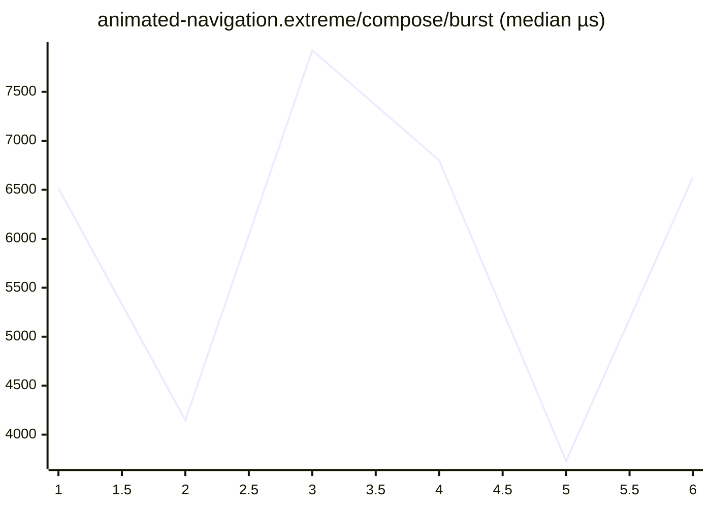
```mermaid
xychart-beta
    title "animated-navigation.extreme/compose/burst (median µs)"
    x-axis 1 --> 6
    line [6516.1, 4147.1, 7924.7, 6800.6, 3730.7, 6629.9]
```

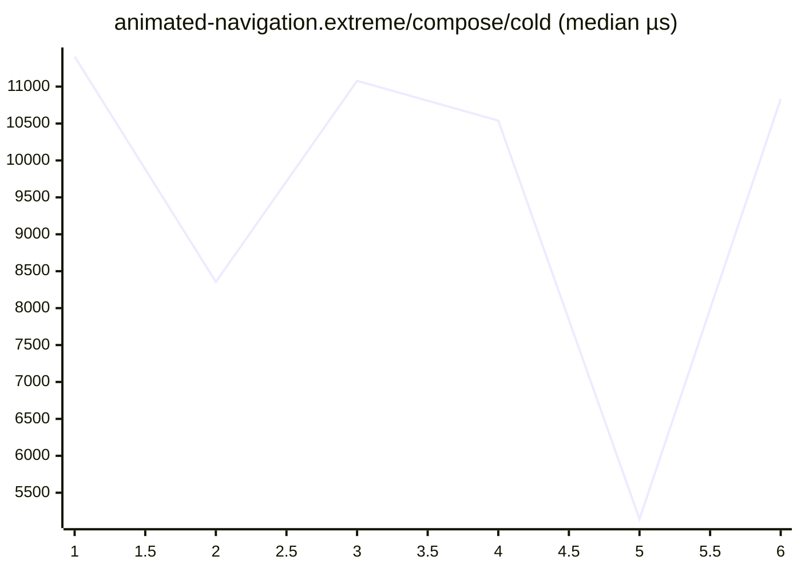
```mermaid
xychart-beta
    title "animated-navigation.extreme/compose/cold (median µs)"
    x-axis 1 --> 6
    line [11407.1, 8355.0, 11077.8, 10540.2, 5143.0, 10831.6]
```

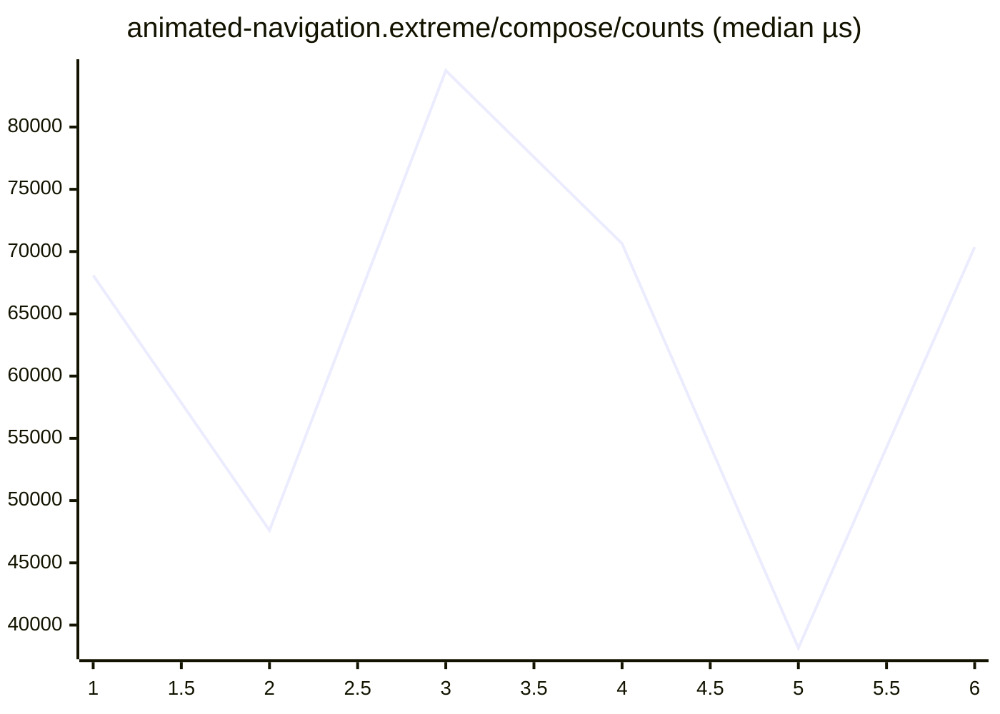
```mermaid
xychart-beta
    title "animated-navigation.extreme/compose/counts (median µs)"
    x-axis 1 --> 6
    line [68091.2, 47605.1, 84532.8, 70635.7, 38164.3, 70361.3]
```

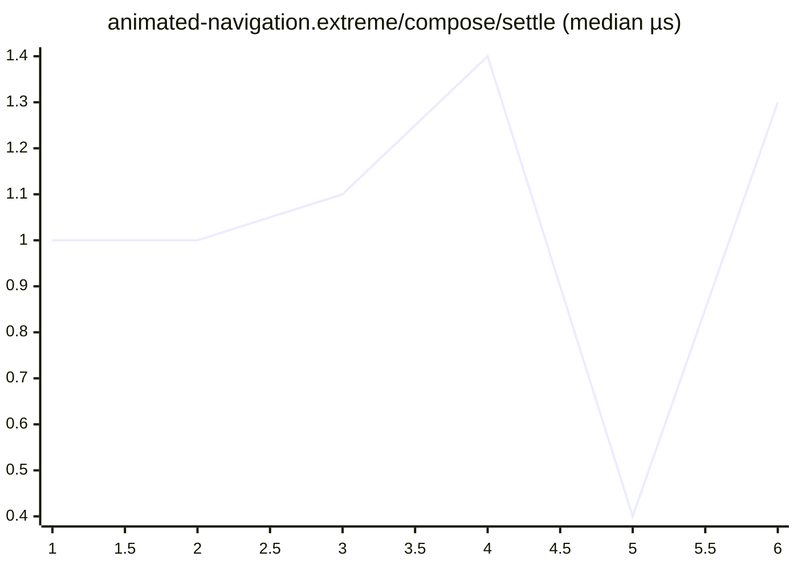
```mermaid
xychart-beta
    title "animated-navigation.extreme/compose/settle (median µs)"
    x-axis 1 --> 6
    line [1.0, 1.0, 1.1, 1.4, 0.4, 1.3]
```

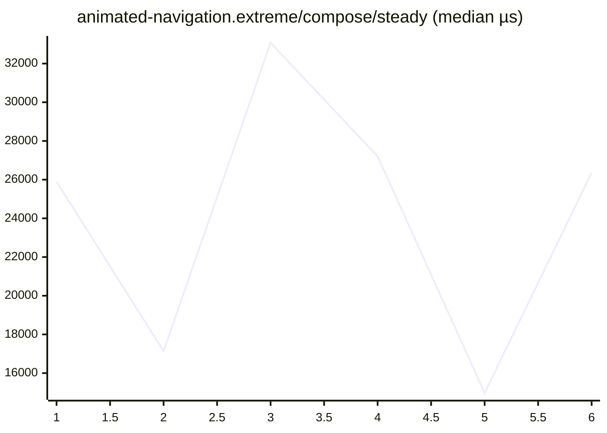
```mermaid
xychart-beta
    title "animated-navigation.extreme/compose/steady (median µs)"
    x-axis 1 --> 6
    line [25890.3, 17137.2, 33073.2, 27209.7, 14974.2, 26354.8]
```

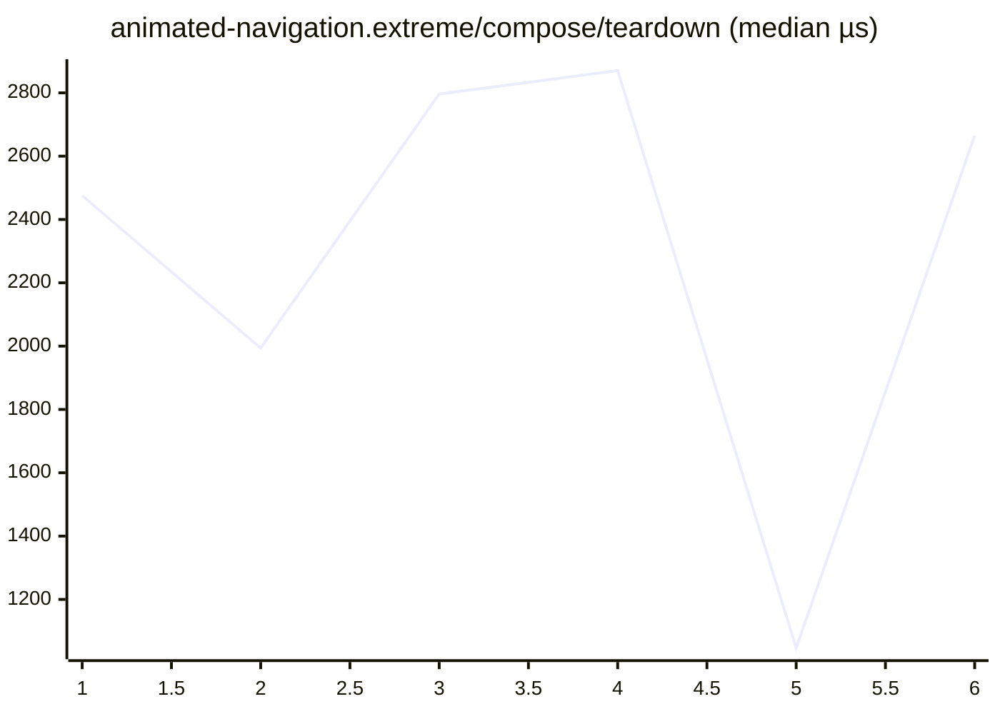
```mermaid
xychart-beta
    title "animated-navigation.extreme/compose/teardown (median µs)"
    x-axis 1 --> 6
    line [2475.2, 1994.0, 2796.3, 2870.3, 1046.7, 2665.2]
```

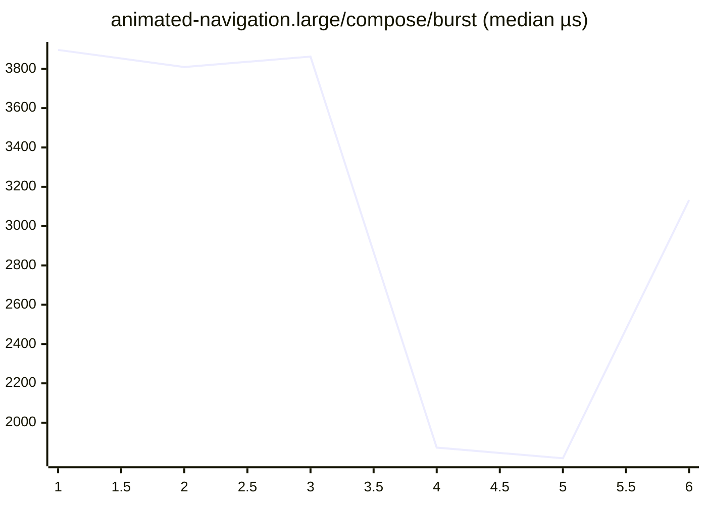
```mermaid
xychart-beta
    title "animated-navigation.large/compose/burst (median µs)"
    x-axis 1 --> 6
    line [3896.2, 3809.1, 3862.2, 1873.3, 1818.8, 3132.6]
```

```mermaid
xychart-beta
    title "animated-navigation.large/compose/cold (median µs)"
    x-axis 1 --> 6
    line [5692.2, 5515.9, 5845.7, 3938.9, 3716.9, 4867.6]
```

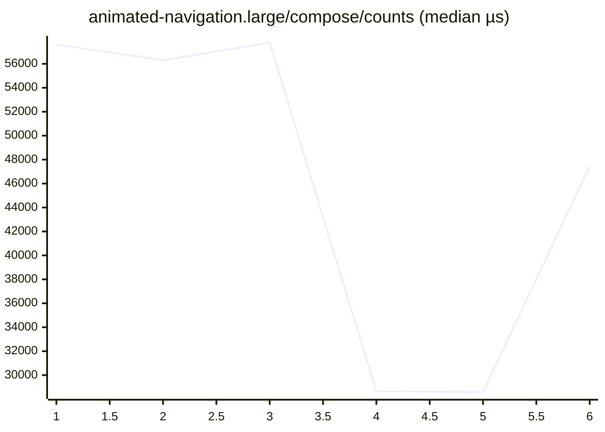
```mermaid
xychart-beta
    title "animated-navigation.large/compose/counts (median µs)"
    x-axis 1 --> 6
    line [57607.9, 56296.6, 57762.9, 28652.9, 28589.4, 47453.0]
```

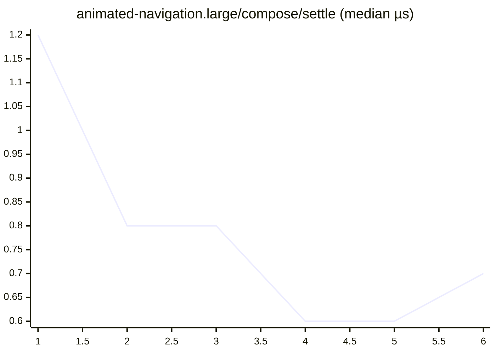
```mermaid
xychart-beta
    title "animated-navigation.large/compose/settle (median µs)"
    x-axis 1 --> 6
    line [1.2, 0.8, 0.8, 0.6, 0.6, 0.7]
```

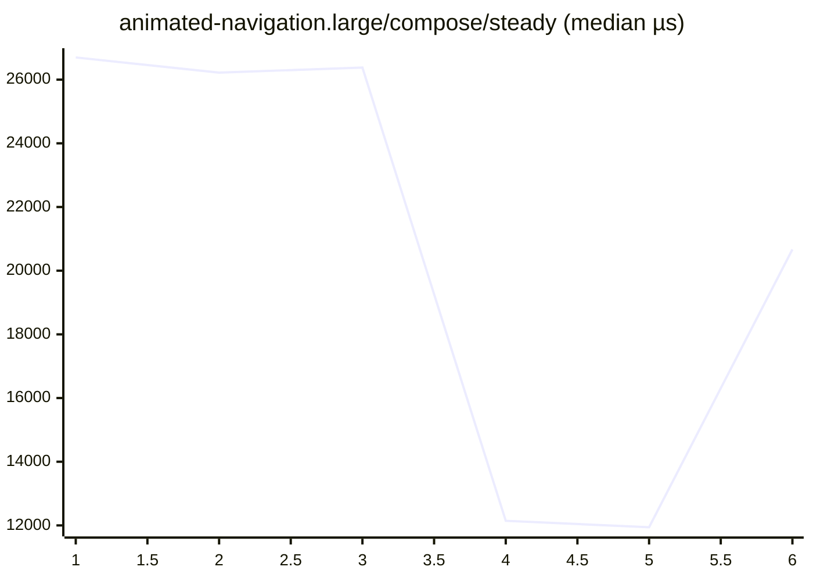
```mermaid
xychart-beta
    title "animated-navigation.large/compose/steady (median µs)"
    x-axis 1 --> 6
    line [26697.4, 26221.7, 26378.1, 12144.9, 11941.8, 20669.0]
```

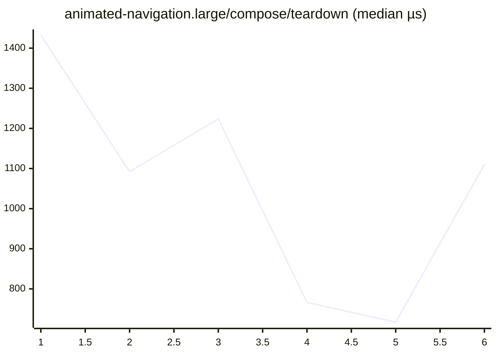
```mermaid
xychart-beta
    title "animated-navigation.large/compose/teardown (median µs)"
    x-axis 1 --> 6
    line [1432.5, 1092.3, 1223.6, 766.2, 717.1, 1110.1]
```

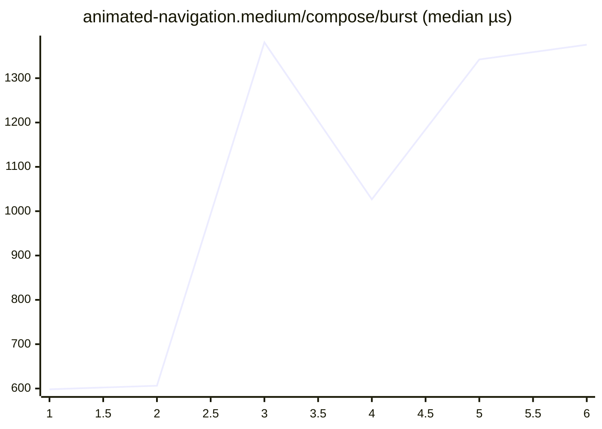
```mermaid
xychart-beta
    title "animated-navigation.medium/compose/burst (median µs)"
    x-axis 1 --> 6
    line [598.2, 606.3, 1380.7, 1026.7, 1342.2, 1375.4]
```

```mermaid
xychart-beta
    title "animated-navigation.medium/compose/cold (median µs)"
    x-axis 1 --> 6
    line [1178.6, 1128.0, 1758.0, 1216.6, 1529.7, 1743.3]
```

```mermaid
xychart-beta
    title "animated-navigation.medium/compose/counts (median µs)"
    x-axis 1 --> 6
    line [10635.9, 10387.5, 24309.0, 17291.5, 23136.2, 24026.4]
```

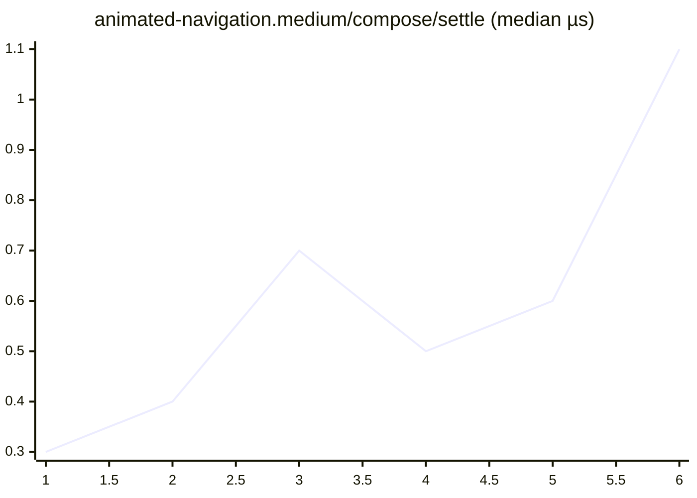
```mermaid
xychart-beta
    title "animated-navigation.medium/compose/settle (median µs)"
    x-axis 1 --> 6
    line [0.3, 0.4, 0.7, 0.5, 0.6, 1.1]
```

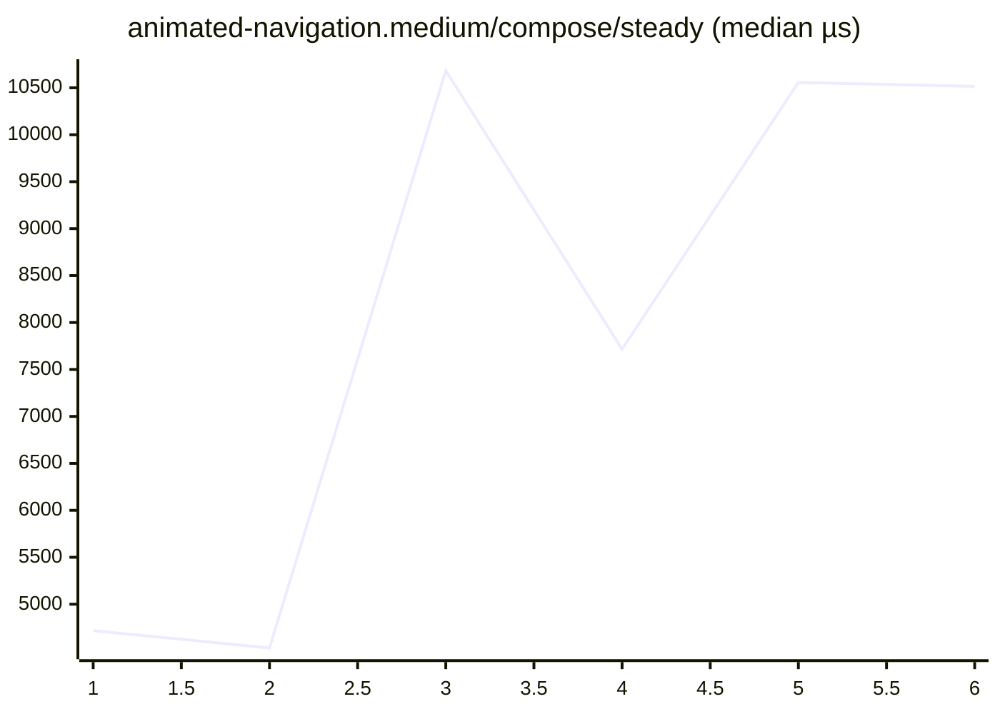
```mermaid
xychart-beta
    title "animated-navigation.medium/compose/steady (median µs)"
    x-axis 1 --> 6
    line [4717.9, 4534.1, 10683.3, 7716.1, 10557.1, 10514.6]
```

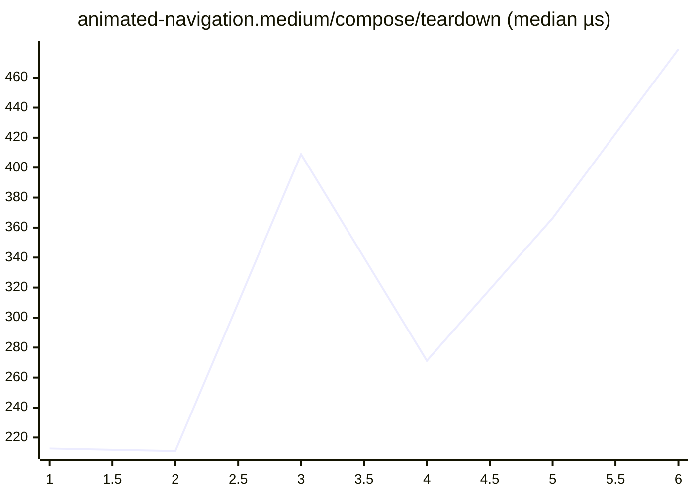
```mermaid
xychart-beta
    title "animated-navigation.medium/compose/teardown (median µs)"
    x-axis 1 --> 6
    line [212.7, 211.0, 408.9, 271.2, 366.3, 479.0]
```

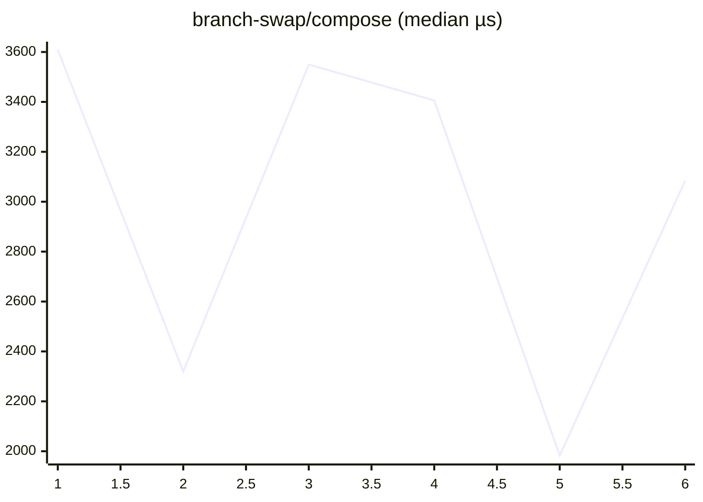
```mermaid
xychart-beta
    title "branch-swap/compose (median µs)"
    x-axis 1 --> 6
    line [3609.5, 2319.6, 3549.8, 3405.8, 1982.7, 3084.6]
```

```mermaid
xychart-beta
    title "cold-mount-100/compose (median µs)"
    x-axis 1 --> 6
    line [592.6, 519.9, 885.4, 445.1, 390.3, 654.2]
```

```mermaid
xychart-beta
    title "cold-mount-1000/compose (median µs)"
    x-axis 1 --> 6
    line [8085.8, 5389.9, 8549.6, 6933.2, 5008.1, 8021.9]
```

```mermaid
xychart-beta
    title "cold-mount-10000/compose (median µs)"
    x-axis 1 --> 6
    line [73945.7, 98256.1, 94238.7, 59096.4, 91513.5, 96319.1]
```

```mermaid
xychart-beta
    title "data-grid.extreme/compose/burst (median µs)"
    x-axis 1 --> 6
    line [572777.3, 535083.2, 832744.6, 637093.8, 901025.5, 925169.9]
```

```mermaid
xychart-beta
    title "data-grid.extreme/compose/cold (median µs)"
    x-axis 1 --> 6
    line [350893.5, 328646.9, 515839.7, 377498.6, 538166.5, 557904.7]
```

```mermaid
xychart-beta
    title "data-grid.extreme/compose/counts (median µs)"
    x-axis 1 --> 6
    line [961903.0, 895177.9, 1510853.2, 1085251.1, 1502399.1, 1611360.1]
```

```mermaid
xychart-beta
    title "data-grid.extreme/compose/settle (median µs)"
    x-axis 1 --> 6
    line [2.8, 2.4, 2.2, 2.6, 2.1, 2.4]
```

```mermaid
xychart-beta
    title "data-grid.extreme/compose/steady (median µs)"
    x-axis 1 --> 6
    line [12594.0, 11681.8, 22844.9, 17958.7, 23673.8, 23322.2]
```

```mermaid
xychart-beta
    title "data-grid.extreme/compose/teardown (median µs)"
    x-axis 1 --> 6
    line [1086.6, 1137.9, 1208.9, 1019.3, 1268.8, 1343.4]
```

```mermaid
xychart-beta
    title "data-grid.large/compose/burst (median µs)"
    x-axis 1 --> 6
    line [140083.3, 135962.2, 137048.1, 79047.3, 75260.8, 109163.6]
```

```mermaid
xychart-beta
    title "data-grid.large/compose/cold (median µs)"
    x-axis 1 --> 6
    line [80791.9, 79866.7, 78358.1, 46545.2, 43756.7, 58099.4]
```

```mermaid
xychart-beta
    title "data-grid.large/compose/counts (median µs)"
    x-axis 1 --> 6
    line [269572.2, 259528.8, 247425.1, 134287.8, 131710.6, 188468.8]
```

```mermaid
xychart-beta
    title "data-grid.large/compose/settle (median µs)"
    x-axis 1 --> 6
    line [2.0, 2.0, 1.8, 1.2, 2.0, 1.9]
```

```mermaid
xychart-beta
    title "data-grid.large/compose/steady (median µs)"
    x-axis 1 --> 6
    line [17382.0, 15842.8, 15303.1, 9007.1, 8005.9, 11625.0]
```

```mermaid
xychart-beta
    title "data-grid.large/compose/teardown (median µs)"
    x-axis 1 --> 6
    line [517.4, 507.1, 530.1, 308.6, 332.9, 426.4]
```

```mermaid
xychart-beta
    title "data-grid.medium/compose/burst (median µs)"
    x-axis 1 --> 6
    line [49689.5, 40264.0, 63124.3, 54341.9, 32137.1, 50132.9]
```

```mermaid
xychart-beta
    title "data-grid.medium/compose/cold (median µs)"
    x-axis 1 --> 6
    line [28216.2, 22726.8, 35966.3, 30152.5, 18330.7, 26916.9]
```

```mermaid
xychart-beta
    title "data-grid.medium/compose/counts (median µs)"
    x-axis 1 --> 6
    line [101676.4, 85010.8, 128707.0, 106187.2, 62031.4, 100197.9]
```

```mermaid
xychart-beta
    title "data-grid.medium/compose/settle (median µs)"
    x-axis 1 --> 6
    line [2.2, 2.3, 1.8, 2.4, 0.6, 1.9]
```

```mermaid
xychart-beta
    title "data-grid.medium/compose/steady (median µs)"
    x-axis 1 --> 6
    line [12139.2, 8725.2, 12812.2, 11984.4, 6457.6, 10768.7]
```

```mermaid
xychart-beta
    title "data-grid.medium/compose/teardown (median µs)"
    x-axis 1 --> 6
    line [242.3, 222.0, 291.3, 267.8, 145.7, 280.3]
```

```mermaid
xychart-beta
    title "dense-dashboard.extreme/compose/burst (median µs)"
    x-axis 1 --> 6
    line [8748.3, 13808.9, 14242.7, 14836.6, 15612.8, 11708.1]
```

```mermaid
xychart-beta
    title "dense-dashboard.extreme/compose/cold (median µs)"
    x-axis 1 --> 6
    line [306.9, 503.4, 495.3, 587.1, 524.3, 393.3]
```

```mermaid
xychart-beta
    title "dense-dashboard.extreme/compose/counts (median µs)"
    x-axis 1 --> 6
    line [12107.6, 25337.6, 22769.2, 21520.0, 21897.1, 18320.5]
```

```mermaid
xychart-beta
    title "dense-dashboard.extreme/compose/settle (median µs)"
    x-axis 1 --> 6
    line [0.6, 1.1, 1.0, 0.8, 0.9, 0.8]
```

```mermaid
xychart-beta
    title "dense-dashboard.extreme/compose/steady (median µs)"
    x-axis 1 --> 6
    line [461.4, 853.9, 896.4, 863.9, 868.1, 685.9]
```

```mermaid
xychart-beta
    title "dense-dashboard.extreme/compose/teardown (median µs)"
    x-axis 1 --> 6
    line [300.0, 528.8, 524.0, 500.2, 563.4, 420.3]
```

```mermaid
xychart-beta
    title "dense-dashboard.large/compose/burst (median µs)"
    x-axis 1 --> 6
    line [7315.2, 6455.4, 7861.5, 5932.0, 3664.7, 4865.3]
```

```mermaid
xychart-beta
    title "dense-dashboard.large/compose/cold (median µs)"
    x-axis 1 --> 6
    line [321.9, 311.0, 312.5, 196.1, 172.6, 252.5]
```

```mermaid
xychart-beta
    title "dense-dashboard.large/compose/counts (median µs)"
    x-axis 1 --> 6
    line [15457.3, 15616.4, 15030.0, 9619.3, 9006.3, 13093.5]
```

```mermaid
xychart-beta
    title "dense-dashboard.large/compose/settle (median µs)"
    x-axis 1 --> 6
    line [0.9, 0.8, 0.8, 0.7, 0.5, 0.6]
```

```mermaid
xychart-beta
    title "dense-dashboard.large/compose/steady (median µs)"
    x-axis 1 --> 6
    line [871.8, 849.7, 860.9, 434.1, 430.1, 673.3]
```

```mermaid
xychart-beta
    title "dense-dashboard.large/compose/teardown (median µs)"
    x-axis 1 --> 6
    line [255.7, 242.4, 250.0, 139.2, 128.8, 202.4]
```

```mermaid
xychart-beta
    title "dense-dashboard.medium/compose/burst (median µs)"
    x-axis 1 --> 6
    line [1884.9, 1716.2, 3396.7, 2022.7, 3071.6, 3206.4]
```

```mermaid
xychart-beta
    title "dense-dashboard.medium/compose/cold (median µs)"
    x-axis 1 --> 6
    line [150.8, 125.0, 199.3, 164.2, 201.4, 241.3]
```

```mermaid
xychart-beta
    title "dense-dashboard.medium/compose/counts (median µs)"
    x-axis 1 --> 6
    line [4488.4, 3035.8, 6218.8, 3927.1, 6262.4, 5300.8]
```

```mermaid
xychart-beta
    title "dense-dashboard.medium/compose/settle (median µs)"
    x-axis 1 --> 6
    line [0.6, 0.4, 0.7, 0.5, 0.7, 0.7]
```

```mermaid
xychart-beta
    title "dense-dashboard.medium/compose/steady (median µs)"
    x-axis 1 --> 6
    line [451.5, 440.8, 842.9, 675.3, 830.4, 863.8]
```

```mermaid
xychart-beta
    title "dense-dashboard.medium/compose/teardown (median µs)"
    x-axis 1 --> 6
    line [71.1, 68.2, 109.1, 88.9, 111.5, 129.0]
```

```mermaid
xychart-beta
    title "entities-identity-churn-10.extreme/compose/burst (median µs)"
    x-axis 1 --> 6
    line [36450.3, 44418.2, 46637.6, 27103.8, 44981.1, 29543.4]
```

```mermaid
xychart-beta
    title "entities-identity-churn-10.extreme/compose/cold (median µs)"
    x-axis 1 --> 6
    line [22317.0, 30608.9, 30755.4, 23786.9, 40570.4, 19153.7]
```

```mermaid
xychart-beta
    title "entities-identity-churn-10.extreme/compose/counts (median µs)"
    x-axis 1 --> 6
    line [157183.8, 226408.0, 207640.3, 143081.0, 226763.2, 128206.5]
```

```mermaid
xychart-beta
    title "entities-identity-churn-10.extreme/compose/settle (median µs)"
    x-axis 1 --> 6
    line [1.5, 2.2, 2.0, 1.5, 2.5, 2.0]
```

```mermaid
xychart-beta
    title "entities-identity-churn-10.extreme/compose/steady (median µs)"
    x-axis 1 --> 6
    line [38679.7, 58936.7, 52064.1, 26669.0, 61811.9, 29113.4]
```

```mermaid
xychart-beta
    title "entities-identity-churn-10.extreme/compose/teardown (median µs)"
    x-axis 1 --> 6
    line [870.1, 1178.4, 1115.4, 774.0, 1244.2, 740.3]
```

```mermaid
xychart-beta
    title "entities-identity-churn-10.large/compose/burst (median µs)"
    x-axis 1 --> 6
    line [13822.3, 12671.8, 13643.0, 12953.8, 6143.0, 14759.8]
```

```mermaid
xychart-beta
    title "entities-identity-churn-10.large/compose/cold (median µs)"
    x-axis 1 --> 6
    line [8768.9, 8903.6, 12727.0, 12419.1, 6935.5, 10733.2]
```

```mermaid
xychart-beta
    title "entities-identity-churn-10.large/compose/counts (median µs)"
    x-axis 1 --> 6
    line [56991.3, 49197.8, 64112.9, 60677.1, 28433.4, 57838.2]
```

```mermaid
xychart-beta
    title "entities-identity-churn-10.large/compose/settle (median µs)"
    x-axis 1 --> 6
    line [2.0, 2.2, 1.6, 1.9, 0.7, 1.8]
```

```mermaid
xychart-beta
    title "entities-identity-churn-10.large/compose/steady (median µs)"
    x-axis 1 --> 6
    line [16083.5, 12191.6, 17784.2, 14312.6, 8120.2, 16453.6]
```

```mermaid
xychart-beta
    title "entities-identity-churn-10.large/compose/teardown (median µs)"
    x-axis 1 --> 6
    line [346.1, 297.1, 375.4, 338.9, 182.0, 354.6]
```

```mermaid
xychart-beta
    title "entities-identity-churn-10.medium/compose/burst (median µs)"
    x-axis 1 --> 6
    line [4810.6, 5385.1, 7593.1, 5112.8, 6878.8, 6650.5]
```

```mermaid
xychart-beta
    title "entities-identity-churn-10.medium/compose/cold (median µs)"
    x-axis 1 --> 6
    line [3510.0, 3688.3, 5372.0, 3383.4, 4891.2, 5151.2]
```

```mermaid
xychart-beta
    title "entities-identity-churn-10.medium/compose/counts (median µs)"
    x-axis 1 --> 6
    line [22176.2, 21779.2, 33203.4, 22936.2, 34013.7, 31437.1]
```

```mermaid
xychart-beta
    title "entities-identity-churn-10.medium/compose/settle (median µs)"
    x-axis 1 --> 6
    line [0.9, 1.3, 1.1, 0.9, 1.2, 1.1]
```

```mermaid
xychart-beta
    title "entities-identity-churn-10.medium/compose/steady (median µs)"
    x-axis 1 --> 6
    line [5091.1, 4800.2, 8300.0, 5909.2, 8141.7, 8237.8]
```

```mermaid
xychart-beta
    title "entities-identity-churn-10.medium/compose/teardown (median µs)"
    x-axis 1 --> 6
    line [138.2, 141.4, 189.4, 143.6, 208.6, 209.6]
```

```mermaid
xychart-beta
    title "entities-identity-churn-50.extreme/compose/burst (median µs)"
    x-axis 1 --> 6
    line [37375.3, 42100.8, 41076.4, 43172.5, 28018.8, 41299.1]
```

```mermaid
xychart-beta
    title "entities-identity-churn-50.extreme/compose/cold (median µs)"
    x-axis 1 --> 6
    line [28909.8, 26506.8, 29632.4, 23700.6, 16677.6, 22767.7]
```

```mermaid
xychart-beta
    title "entities-identity-churn-50.extreme/compose/counts (median µs)"
    x-axis 1 --> 6
    line [312089.2, 264728.7, 287119.4, 313931.9, 170730.7, 360065.4]
```

```mermaid
xychart-beta
    title "entities-identity-churn-50.extreme/compose/settle (median µs)"
    x-axis 1 --> 6
    line [2.6, 2.4, 1.9, 2.3, 2.1, 2.0]
```

```mermaid
xychart-beta
    title "entities-identity-churn-50.extreme/compose/steady (median µs)"
    x-axis 1 --> 6
    line [144362.2, 138910.8, 151388.1, 146004.0, 82765.7, 135865.1]
```

```mermaid
xychart-beta
    title "entities-identity-churn-50.extreme/compose/teardown (median µs)"
    x-axis 1 --> 6
    line [1011.3, 1046.8, 1153.3, 1158.5, 635.9, 966.8]
```

```mermaid
xychart-beta
    title "entities-identity-churn-50.large/compose/burst (median µs)"
    x-axis 1 --> 6
    line [11392.1, 16006.5, 14237.9, 8830.8, 17379.2, 12261.9]
```

```mermaid
xychart-beta
    title "entities-identity-churn-50.large/compose/cold (median µs)"
    x-axis 1 --> 6
    line [10645.8, 12312.2, 10388.0, 8077.7, 10611.2, 7955.1]
```

```mermaid
xychart-beta
    title "entities-identity-churn-50.large/compose/counts (median µs)"
    x-axis 1 --> 6
    line [86389.6, 118638.8, 108507.3, 60853.6, 129304.7, 73934.5]
```

```mermaid
xychart-beta
    title "entities-identity-churn-50.large/compose/settle (median µs)"
    x-axis 1 --> 6
    line [1.5, 2.3, 1.6, 1.2, 1.9, 1.8]
```

```mermaid
xychart-beta
    title "entities-identity-churn-50.large/compose/steady (median µs)"
    x-axis 1 --> 6
    line [40309.4, 56606.6, 50910.5, 29130.8, 63002.5, 34672.3]
```

```mermaid
xychart-beta
    title "entities-identity-churn-50.large/compose/teardown (median µs)"
    x-axis 1 --> 6
    line [312.8, 448.9, 398.2, 225.9, 469.2, 278.4]
```

```mermaid
xychart-beta
    title "entities-identity-churn-50.medium/compose/burst (median µs)"
    x-axis 1 --> 6
    line [8485.7, 8733.8, 7811.5, 5053.3, 3913.2, 6868.0]
```

```mermaid
xychart-beta
    title "entities-identity-churn-50.medium/compose/cold (median µs)"
    x-axis 1 --> 6
    line [5123.1, 5090.8, 6479.6, 3545.3, 2939.0, 4644.6]
```

```mermaid
xychart-beta
    title "entities-identity-churn-50.medium/compose/counts (median µs)"
    x-axis 1 --> 6
    line [60621.5, 66177.5, 62123.7, 40694.0, 32773.8, 53100.7]
```

```mermaid
xychart-beta
    title "entities-identity-churn-50.medium/compose/settle (median µs)"
    x-axis 1 --> 6
    line [1.3, 1.6, 1.6, 1.3, 0.7, 1.6]
```

```mermaid
xychart-beta
    title "entities-identity-churn-50.medium/compose/steady (median µs)"
    x-axis 1 --> 6
    line [22448.9, 25049.9, 23583.9, 14477.3, 11837.6, 20245.0]
```

```mermaid
xychart-beta
    title "entities-identity-churn-50.medium/compose/teardown (median µs)"
    x-axis 1 --> 6
    line [239.6, 252.1, 242.6, 155.2, 117.2, 204.8]
```

```mermaid
xychart-beta
    title "entities-identity-churn.extreme/compose/burst (median µs)"
    x-axis 1 --> 6
    line [51119.4, 42743.7, 45181.7, 38370.3, 33338.8, 36817.5]
```

```mermaid
xychart-beta
    title "entities-identity-churn.extreme/compose/cold (median µs)"
    x-axis 1 --> 6
    line [31173.0, 29216.5, 29632.0, 19346.5, 15753.8, 25514.4]
```

```mermaid
xychart-beta
    title "entities-identity-churn.extreme/compose/counts (median µs)"
    x-axis 1 --> 6
    line [276895.4, 231546.3, 239558.4, 151482.1, 126042.6, 202144.3]
```

```mermaid
xychart-beta
    title "entities-identity-churn.extreme/compose/settle (median µs)"
    x-axis 1 --> 6
    line [2.3, 2.0, 2.1, 2.3, 1.7, 2.3]
```

```mermaid
xychart-beta
    title "entities-identity-churn.extreme/compose/steady (median µs)"
    x-axis 1 --> 6
    line [103496.4, 98719.9, 87903.0, 60700.8, 49561.0, 86888.2]
```

```mermaid
xychart-beta
    title "entities-identity-churn.extreme/compose/teardown (median µs)"
    x-axis 1 --> 6
    line [1459.8, 1163.1, 1253.7, 814.1, 700.5, 1030.1]
```

```mermaid
xychart-beta
    title "entities-identity-churn.large/compose/burst (median µs)"
    x-axis 1 --> 6
    line [9662.4, 8486.1, 12526.7, 11002.8, 13446.7, 15085.5]
```

```mermaid
xychart-beta
    title "entities-identity-churn.large/compose/cold (median µs)"
    x-axis 1 --> 6
    line [7331.9, 8413.6, 11406.1, 12037.1, 13160.2, 12731.3]
```

```mermaid
xychart-beta
    title "entities-identity-churn.large/compose/counts (median µs)"
    x-axis 1 --> 6
    line [62489.1, 65083.5, 93016.9, 76013.1, 98085.9, 98527.4]
```

```mermaid
xychart-beta
    title "entities-identity-churn.large/compose/settle (median µs)"
    x-axis 1 --> 6
    line [1.6, 1.6, 1.7, 1.3, 2.0, 1.7]
```

```mermaid
xychart-beta
    title "entities-identity-churn.large/compose/steady (median µs)"
    x-axis 1 --> 6
    line [17762.3, 18587.4, 28783.0, 23340.3, 29455.6, 33017.1]
```

```mermaid
xychart-beta
    title "entities-identity-churn.large/compose/teardown (median µs)"
    x-axis 1 --> 6
    line [221.0, 244.4, 350.0, 314.6, 386.7, 384.2]
```

```mermaid
xychart-beta
    title "entities-identity-churn.medium/compose/burst (median µs)"
    x-axis 1 --> 6
    line [5597.4, 5043.1, 7507.7, 7112.6, 3457.9, 6040.7]
```

```mermaid
xychart-beta
    title "entities-identity-churn.medium/compose/cold (median µs)"
    x-axis 1 --> 6
    line [4098.3, 3677.5, 4917.8, 4309.4, 3034.9, 4284.9]
```

```mermaid
xychart-beta
    title "entities-identity-churn.medium/compose/counts (median µs)"
    x-axis 1 --> 6
    line [31911.5, 26270.5, 38265.0, 35758.5, 17029.0, 34046.6]
```

```mermaid
xychart-beta
    title "entities-identity-churn.medium/compose/settle (median µs)"
    x-axis 1 --> 6
    line [1.0, 1.7, 1.0, 1.9, 0.6, 1.6]
```

```mermaid
xychart-beta
    title "entities-identity-churn.medium/compose/steady (median µs)"
    x-axis 1 --> 6
    line [10781.6, 9751.3, 14145.6, 11476.1, 7059.7, 11350.6]
```

```mermaid
xychart-beta
    title "entities-identity-churn.medium/compose/teardown (median µs)"
    x-axis 1 --> 6
    line [163.7, 158.3, 209.3, 186.8, 106.1, 185.4]
```

```mermaid
xychart-beta
    title "entities-integrated.extreme/compose/burst (median µs)"
    x-axis 1 --> 6
    line [18098.0, 16855.7, 18205.9, 16320.2, 17509.3, 20570.2]
```

```mermaid
xychart-beta
    title "entities-integrated.extreme/compose/cold (median µs)"
    x-axis 1 --> 6
    line [102015.1, 100238.6, 110792.2, 98791.5, 86043.8, 111031.3]
```

```mermaid
xychart-beta
    title "entities-integrated.extreme/compose/counts (median µs)"
    x-axis 1 --> 6
    line [358907.4, 324615.1, 382570.8, 305419.8, 287951.5, 321960.0]
```

```mermaid
xychart-beta
    title "entities-integrated.extreme/compose/settle (median µs)"
    x-axis 1 --> 6
    line [1.8, 1.9, 2.1, 1.7, 1.7, 1.9]
```

```mermaid
xychart-beta
    title "entities-integrated.extreme/compose/steady (median µs)"
    x-axis 1 --> 6
    line [90630.1, 81412.5, 95946.8, 80410.1, 73987.2, 97008.8]
```

```mermaid
xychart-beta
    title "entities-integrated.extreme/compose/teardown (median µs)"
    x-axis 1 --> 6
    line [52871.1, 45496.4, 55490.6, 46463.3, 40502.6, 51955.2]
```

```mermaid
xychart-beta
    title "entities-integrated.large/compose/burst (median µs)"
    x-axis 1 --> 6
    line [9879.6, 9266.1, 9580.3, 5350.4, 5000.3, 7911.5]
```

```mermaid
xychart-beta
    title "entities-integrated.large/compose/cold (median µs)"
    x-axis 1 --> 6
    line [42924.1, 40697.9, 38453.5, 27622.0, 23282.1, 34452.0]
```

```mermaid
xychart-beta
    title "entities-integrated.large/compose/counts (median µs)"
    x-axis 1 --> 6
    line [159260.0, 136585.0, 136418.7, 92540.6, 75726.6, 116205.8]
```

```mermaid
xychart-beta
    title "entities-integrated.large/compose/settle (median µs)"
    x-axis 1 --> 6
    line [2.1, 1.5, 1.6, 1.6, 1.2, 1.6]
```

```mermaid
xychart-beta
    title "entities-integrated.large/compose/steady (median µs)"
    x-axis 1 --> 6
    line [56879.3, 47700.5, 50360.1, 29499.8, 25632.1, 39134.3]
```

```mermaid
xychart-beta
    title "entities-integrated.large/compose/teardown (median µs)"
    x-axis 1 --> 6
    line [16802.1, 13908.2, 14198.2, 10974.4, 8656.6, 14230.7]
```

```mermaid
xychart-beta
    title "entities-integrated.medium/compose/burst (median µs)"
    x-axis 1 --> 6
    line [4273.0, 4064.7, 6941.6, 5470.1, 7091.9, 7241.2]
```

```mermaid
xychart-beta
    title "entities-integrated.medium/compose/cold (median µs)"
    x-axis 1 --> 6
    line [14214.0, 12986.0, 18998.1, 20759.9, 20252.4, 22768.0]
```

```mermaid
xychart-beta
    title "entities-integrated.medium/compose/counts (median µs)"
    x-axis 1 --> 6
    line [60159.0, 56773.8, 91261.8, 68607.4, 94840.7, 109979.7]
```

```mermaid
xychart-beta
    title "entities-integrated.medium/compose/settle (median µs)"
    x-axis 1 --> 6
    line [1.9, 1.7, 1.6, 1.2, 1.4, 1.7]
```

```mermaid
xychart-beta
    title "entities-integrated.medium/compose/steady (median µs)"
    x-axis 1 --> 6
    line [20781.1, 19484.3, 34314.8, 25155.4, 35931.8, 41195.2]
```

```mermaid
xychart-beta
    title "entities-integrated.medium/compose/teardown (median µs)"
    x-axis 1 --> 6
    line [5912.5, 5137.9, 6370.7, 5086.2, 6899.6, 7628.9]
```

```mermaid
xychart-beta
    title "entities-relevance-saturated.extreme/compose/burst (median µs)"
    x-axis 1 --> 6
    line [82088.2, 67803.4, 81772.9, 78539.9, 42827.9, 75203.6]
```

```mermaid
xychart-beta
    title "entities-relevance-saturated.extreme/compose/cold (median µs)"
    x-axis 1 --> 6
    line [23851.0, 19385.3, 27237.7, 29579.2, 16205.6, 25539.7]
```

```mermaid
xychart-beta
    title "entities-relevance-saturated.extreme/compose/counts (median µs)"
    x-axis 1 --> 6
    line [215972.6, 170155.4, 218067.6, 205395.8, 129067.0, 218719.0]
```

```mermaid
xychart-beta
    title "entities-relevance-saturated.extreme/compose/settle (median µs)"
    x-axis 1 --> 6
    line [2.5, 2.9, 2.1, 2.6, 1.9, 2.5]
```

```mermaid
xychart-beta
    title "entities-relevance-saturated.extreme/compose/steady (median µs)"
    x-axis 1 --> 6
    line [46499.2, 63403.0, 50693.5, 50493.5, 26077.2, 49900.4]
```

```mermaid
xychart-beta
    title "entities-relevance-saturated.extreme/compose/teardown (median µs)"
    x-axis 1 --> 6
    line [13254.3, 13259.6, 13403.6, 14674.6, 8911.1, 13251.9]
```

```mermaid
xychart-beta
    title "entities-relevance-saturated.large/compose/burst (median µs)"
    x-axis 1 --> 6
    line [23829.2, 21410.5, 26910.9, 27013.4, 14236.6, 24208.8]
```

```mermaid
xychart-beta
    title "entities-relevance-saturated.large/compose/cold (median µs)"
    x-axis 1 --> 6
    line [9046.6, 8698.0, 11112.7, 11237.4, 6143.2, 9343.6]
```

```mermaid
xychart-beta
    title "entities-relevance-saturated.large/compose/counts (median µs)"
    x-axis 1 --> 6
    line [66263.4, 60081.6, 78201.5, 74218.9, 39404.5, 69251.9]
```

```mermaid
xychart-beta
    title "entities-relevance-saturated.large/compose/settle (median µs)"
    x-axis 1 --> 6
    line [2.2, 2.3, 1.7, 2.3, 1.1, 2.0]
```

```mermaid
xychart-beta
    title "entities-relevance-saturated.large/compose/steady (median µs)"
    x-axis 1 --> 6
    line [15970.8, 12947.8, 17610.3, 17826.6, 11242.1, 15433.1]
```

```mermaid
xychart-beta
    title "entities-relevance-saturated.large/compose/teardown (median µs)"
    x-axis 1 --> 6
    line [3313.5, 2966.7, 2967.8, 3445.2, 1914.9, 3360.7]
```

```mermaid
xychart-beta
    title "entities-relevance-saturated.medium/compose/burst (median µs)"
    x-axis 1 --> 6
    line [10053.5, 13258.0, 10542.4, 6875.4, 13588.9, 8448.7]
```

```mermaid
xychart-beta
    title "entities-relevance-saturated.medium/compose/cold (median µs)"
    x-axis 1 --> 6
    line [4425.1, 5999.0, 4925.5, 3251.8, 5590.3, 3641.1]
```

```mermaid
xychart-beta
    title "entities-relevance-saturated.medium/compose/counts (median µs)"
    x-axis 1 --> 6
    line [26589.7, 40004.4, 35054.4, 23518.5, 43107.2, 20771.7]
```

```mermaid
xychart-beta
    title "entities-relevance-saturated.medium/compose/settle (median µs)"
    x-axis 1 --> 6
    line [1.0, 1.5, 1.0, 0.9, 2.0, 1.7]
```

```mermaid
xychart-beta
    title "entities-relevance-saturated.medium/compose/steady (median µs)"
    x-axis 1 --> 6
    line [6593.9, 10265.5, 7799.1, 4375.5, 8267.5, 5658.1]
```

```mermaid
xychart-beta
    title "entities-relevance-saturated.medium/compose/teardown (median µs)"
    x-axis 1 --> 6
    line [909.1, 1375.7, 1014.9, 866.7, 1424.9, 998.3]
```

```mermaid
xychart-beta
    title "entities-relevance-sweep.extreme/compose/burst (median µs)"
    x-axis 1 --> 6
    line [83025.5, 131890.1, 139155.5, 102900.1, 157933.2, 128808.8]
```

```mermaid
xychart-beta
    title "entities-relevance-sweep.extreme/compose/cold (median µs)"
    x-axis 1 --> 6
    line [27112.7, 32898.9, 35114.3, 19901.5, 33750.6, 20001.5]
```

```mermaid
xychart-beta
    title "entities-relevance-sweep.extreme/compose/counts (median µs)"
    x-axis 1 --> 6
    line [297306.3, 392730.6, 375325.7, 279449.1, 480733.4, 287660.1]
```

```mermaid
xychart-beta
    title "entities-relevance-sweep.extreme/compose/settle (median µs)"
    x-axis 1 --> 6
    line [1.9, 2.5, 2.5, 2.5, 2.8, 2.8]
```

```mermaid
xychart-beta
    title "entities-relevance-sweep.extreme/compose/steady (median µs)"
    x-axis 1 --> 6
    line [104435.7, 129482.8, 118556.7, 87490.4, 162273.4, 97620.2]
```

```mermaid
xychart-beta
    title "entities-relevance-sweep.extreme/compose/teardown (median µs)"
    x-axis 1 --> 6
    line [11409.1, 14374.0, 14539.1, 12187.9, 16437.6, 13724.4]
```

```mermaid
xychart-beta
    title "entities-relevance-sweep.large/compose/burst (median µs)"
    x-axis 1 --> 6
    line [37687.9, 36619.3, 41760.4, 43897.0, 20442.0, 38915.7]
```

```mermaid
xychart-beta
    title "entities-relevance-sweep.large/compose/cold (median µs)"
    x-axis 1 --> 6
    line [9427.2, 7416.6, 10731.1, 9936.2, 7900.6, 9398.3]
```

```mermaid
xychart-beta
    title "entities-relevance-sweep.large/compose/counts (median µs)"
    x-axis 1 --> 6
    line [118464.0, 105642.9, 132017.4, 113098.8, 71443.8, 123886.3]
```

```mermaid
xychart-beta
    title "entities-relevance-sweep.large/compose/settle (median µs)"
    x-axis 1 --> 6
    line [2.0, 2.4, 1.7, 2.1, 1.2, 2.1]
```

```mermaid
xychart-beta
    title "entities-relevance-sweep.large/compose/steady (median µs)"
    x-axis 1 --> 6
    line [36383.7, 29649.6, 42899.0, 36038.5, 24323.9, 38124.3]
```

```mermaid
xychart-beta
    title "entities-relevance-sweep.large/compose/teardown (median µs)"
    x-axis 1 --> 6
    line [3319.5, 3173.8, 3204.1, 3765.1, 2211.6, 3346.3]
```

```mermaid
xychart-beta
    title "entities-relevance-sweep.medium/compose/burst (median µs)"
    x-axis 1 --> 6
    line [21304.8, 17609.9, 19632.8, 19428.5, 17153.1, 19140.6]
```

```mermaid
xychart-beta
    title "entities-relevance-sweep.medium/compose/cold (median µs)"
    x-axis 1 --> 6
    line [5522.9, 4875.0, 6616.8, 5391.1, 4632.0, 5418.8]
```

```mermaid
xychart-beta
    title "entities-relevance-sweep.medium/compose/counts (median µs)"
    x-axis 1 --> 6
    line [73432.0, 63426.8, 72731.7, 66518.2, 62374.3, 65043.1]
```

```mermaid
xychart-beta
    title "entities-relevance-sweep.medium/compose/settle (median µs)"
    x-axis 1 --> 6
    line [1.9, 1.0, 1.3, 1.3, 1.6, 1.5]
```

```mermaid
xychart-beta
    title "entities-relevance-sweep.medium/compose/steady (median µs)"
    x-axis 1 --> 6
    line [21627.0, 18049.0, 19673.0, 19997.6, 17951.3, 19922.5]
```

```mermaid
xychart-beta
    title "entities-relevance-sweep.medium/compose/teardown (median µs)"
    x-axis 1 --> 6
    line [1421.5, 998.7, 1251.6, 1111.8, 1133.0, 1281.3]
```

```mermaid
xychart-beta
    title "entity-labels-sparse.extreme/compose/burst (median µs)"
    x-axis 1 --> 6
    line [28431.3, 29661.9, 27082.8, 16711.4, 16256.2, 24942.1]
```

```mermaid
xychart-beta
    title "entity-labels-sparse.extreme/compose/cold (median µs)"
    x-axis 1 --> 6
    line [25491.4, 23933.9, 25087.3, 17441.6, 14649.4, 20662.4]
```

```mermaid
xychart-beta
    title "entity-labels-sparse.extreme/compose/counts (median µs)"
    x-axis 1 --> 6
    line [103374.1, 95880.0, 93198.2, 60028.1, 47563.7, 81598.1]
```

```mermaid
xychart-beta
    title "entity-labels-sparse.extreme/compose/settle (median µs)"
    x-axis 1 --> 6
    line [1.8, 1.9, 1.6, 1.8, 1.2, 1.8]
```

```mermaid
xychart-beta
    title "entity-labels-sparse.extreme/compose/steady (median µs)"
    x-axis 1 --> 6
    line [4152.6, 3939.8, 3787.2, 2841.3, 2146.5, 3306.4]
```

```mermaid
xychart-beta
    title "entity-labels-sparse.extreme/compose/teardown (median µs)"
    x-axis 1 --> 6
    line [12752.1, 12268.9, 12210.0, 9099.8, 7657.4, 10987.1]
```

```mermaid
xychart-beta
    title "entity-labels-sparse.large/compose/burst (median µs)"
    x-axis 1 --> 6
    line [12559.3, 12285.7, 12193.2, 7053.5, 7719.0, 11258.9]
```

```mermaid
xychart-beta
    title "entity-labels-sparse.large/compose/cold (median µs)"
    x-axis 1 --> 6
    line [10065.7, 12236.3, 12145.6, 7446.2, 7340.1, 9091.0]
```

```mermaid
xychart-beta
    title "entity-labels-sparse.large/compose/counts (median µs)"
    x-axis 1 --> 6
    line [47228.6, 41552.7, 49545.9, 25620.0, 20398.0, 37816.7]
```

```mermaid
xychart-beta
    title "entity-labels-sparse.large/compose/settle (median µs)"
    x-axis 1 --> 6
    line [1.2, 1.3, 1.2, 1.2, 1.0, 1.4]
```

```mermaid
xychart-beta
    title "entity-labels-sparse.large/compose/steady (median µs)"
    x-axis 1 --> 6
    line [1880.4, 1925.6, 1869.1, 1138.5, 1131.8, 1602.8]
```

```mermaid
xychart-beta
    title "entity-labels-sparse.large/compose/teardown (median µs)"
    x-axis 1 --> 6
    line [3848.1, 4042.8, 3927.2, 2747.9, 2759.1, 3661.9]
```

```mermaid
xychart-beta
    title "entity-labels-sparse.medium/compose/burst (median µs)"
    x-axis 1 --> 6
    line [2692.8, 4883.0, 4638.9, 4912.8, 5026.0, 4027.1]
```

```mermaid
xychart-beta
    title "entity-labels-sparse.medium/compose/cold (median µs)"
    x-axis 1 --> 6
    line [3511.6, 5344.2, 4334.1, 5274.7, 5181.4, 4438.3]
```

```mermaid
xychart-beta
    title "entity-labels-sparse.medium/compose/counts (median µs)"
    x-axis 1 --> 6
    line [11899.6, 20010.0, 21389.0, 22972.4, 20570.5, 16988.5]
```

```mermaid
xychart-beta
    title "entity-labels-sparse.medium/compose/settle (median µs)"
    x-axis 1 --> 6
    line [0.8, 0.8, 0.9, 0.8, 0.9, 0.7]
```

```mermaid
xychart-beta
    title "entity-labels-sparse.medium/compose/steady (median µs)"
    x-axis 1 --> 6
    line [546.9, 864.1, 884.8, 935.5, 884.1, 730.7]
```

```mermaid
xychart-beta
    title "entity-labels-sparse.medium/compose/teardown (median µs)"
    x-axis 1 --> 6
    line [793.8, 1245.8, 1305.4, 1265.7, 1223.0, 1121.5]
```

```mermaid
xychart-beta
    title "entity-labels.extreme/compose/burst (median µs)"
    x-axis 1 --> 6
    line [38306.7, 27292.5, 30271.6, 28243.8, 29005.1, 33304.8]
```

```mermaid
xychart-beta
    title "entity-labels.extreme/compose/cold (median µs)"
    x-axis 1 --> 6
    line [26392.1, 25728.0, 24789.0, 25091.7, 22204.5, 27675.8]
```

```mermaid
xychart-beta
    title "entity-labels.extreme/compose/counts (median µs)"
    x-axis 1 --> 6
    line [146562.2, 118482.8, 130233.0, 121188.5, 115298.7, 136017.8]
```

```mermaid
xychart-beta
    title "entity-labels.extreme/compose/settle (median µs)"
    x-axis 1 --> 6
    line [2.1, 1.2, 1.5, 1.9, 1.9, 1.9]
```

```mermaid
xychart-beta
    title "entity-labels.extreme/compose/steady (median µs)"
    x-axis 1 --> 6
    line [35077.9, 31134.3, 31374.2, 30446.4, 26594.6, 34700.1]
```

```mermaid
xychart-beta
    title "entity-labels.extreme/compose/teardown (median µs)"
    x-axis 1 --> 6
    line [14166.4, 14892.9, 12081.1, 11856.0, 11411.3, 12865.8]
```

```mermaid
xychart-beta
    title "entity-labels.large/compose/burst (median µs)"
    x-axis 1 --> 6
    line [16371.6, 13675.4, 14796.5, 8143.5, 6921.8, 11737.9]
```

```mermaid
xychart-beta
    title "entity-labels.large/compose/cold (median µs)"
    x-axis 1 --> 6
    line [13125.5, 12164.0, 12241.7, 8754.9, 8206.7, 13934.9]
```

```mermaid
xychart-beta
    title "entity-labels.large/compose/counts (median µs)"
    x-axis 1 --> 6
    line [71347.2, 67401.3, 63961.0, 38511.1, 29591.2, 53168.0]
```

```mermaid
xychart-beta
    title "entity-labels.large/compose/settle (median µs)"
    x-axis 1 --> 6
    line [1.8, 1.6, 1.8, 1.2, 0.8, 1.7]
```

```mermaid
xychart-beta
    title "entity-labels.large/compose/steady (median µs)"
    x-axis 1 --> 6
    line [17130.8, 15636.5, 15592.5, 6886.2, 5727.0, 10867.3]
```

```mermaid
xychart-beta
    title "entity-labels.large/compose/teardown (median µs)"
    x-axis 1 --> 6
    line [4985.7, 4474.5, 4408.6, 3132.6, 2490.9, 4133.6]
```

```mermaid
xychart-beta
    title "entity-labels.medium/compose/burst (median µs)"
    x-axis 1 --> 6
    line [5454.2, 5016.4, 5182.8, 4977.7, 4705.2, 5603.2]
```

```mermaid
xychart-beta
    title "entity-labels.medium/compose/cold (median µs)"
    x-axis 1 --> 6
    line [6039.1, 4145.2, 5211.5, 4920.9, 4320.8, 5134.9]
```

```mermaid
xychart-beta
    title "entity-labels.medium/compose/counts (median µs)"
    x-axis 1 --> 6
    line [27680.1, 23447.7, 25731.3, 23381.3, 18913.6, 25673.9]
```

```mermaid
xychart-beta
    title "entity-labels.medium/compose/settle (median µs)"
    x-axis 1 --> 6
    line [1.2, 0.8, 1.1, 0.8, 1.0, 1.0]
```

```mermaid
xychart-beta
    title "entity-labels.medium/compose/steady (median µs)"
    x-axis 1 --> 6
    line [6474.9, 6388.6, 6421.2, 6421.9, 4371.6, 6821.4]
```

```mermaid
xychart-beta
    title "entity-labels.medium/compose/teardown (median µs)"
    x-axis 1 --> 6
    line [1477.1, 1273.6, 1329.9, 1262.9, 1139.0, 1501.8]
```

```mermaid
xychart-beta
    title "events/compose (median µs)"
    x-axis 1 --> 6
    line [10464.1, 9121.0, 11019.8, 9922.2, 6474.8, 13785.7]
```

```mermaid
xychart-beta
    title "inspector.extreme/compose/burst (median µs)"
    x-axis 1 --> 6
    line [7448.2, 5545.2, 8042.0, 7887.1, 4081.4, 7770.0]
```

```mermaid
xychart-beta
    title "inspector.extreme/compose/cold (median µs)"
    x-axis 1 --> 6
    line [18874.4, 15878.8, 20409.9, 18550.5, 11659.9, 18757.1]
```

```mermaid
xychart-beta
    title "inspector.extreme/compose/counts (median µs)"
    x-axis 1 --> 6
    line [34335.8, 23488.3, 37816.7, 33632.2, 18349.1, 30508.1]
```

```mermaid
xychart-beta
    title "inspector.extreme/compose/settle (median µs)"
    x-axis 1 --> 6
    line [1.6, 1.4, 1.2, 2.0, 0.7, 1.4]
```

```mermaid
xychart-beta
    title "inspector.extreme/compose/steady (median µs)"
    x-axis 1 --> 6
    line [245.7, 207.7, 236.8, 270.8, 131.2, 267.8]
```

```mermaid
xychart-beta
    title "inspector.extreme/compose/teardown (median µs)"
    x-axis 1 --> 6
    line [2590.5, 2153.7, 2312.0, 3007.8, 1361.7, 3037.5]
```

```mermaid
xychart-beta
    title "inspector.large/compose/burst (median µs)"
    x-axis 1 --> 6
    line [3270.5, 4234.2, 4065.4, 2059.0, 4547.1, 2198.1]
```

```mermaid
xychart-beta
    title "inspector.large/compose/cold (median µs)"
    x-axis 1 --> 6
    line [6003.2, 9644.5, 6469.4, 5148.0, 8219.5, 4556.1]
```

```mermaid
xychart-beta
    title "inspector.large/compose/counts (median µs)"
    x-axis 1 --> 6
    line [15848.8, 18252.6, 18863.7, 13882.7, 21141.3, 12984.7]
```

```mermaid
xychart-beta
    title "inspector.large/compose/settle (median µs)"
    x-axis 1 --> 6
    line [0.8, 1.2, 0.8, 0.7, 1.8, 0.6]
```

```mermaid
xychart-beta
    title "inspector.large/compose/steady (median µs)"
    x-axis 1 --> 6
    line [184.9, 255.0, 227.5, 142.8, 294.1, 145.9]
```

```mermaid
xychart-beta
    title "inspector.large/compose/teardown (median µs)"
    x-axis 1 --> 6
    line [939.1, 1289.4, 1054.6, 747.2, 1560.4, 839.3]
```

```mermaid
xychart-beta
    title "inspector.medium/compose/burst (median µs)"
    x-axis 1 --> 6
    line [652.7, 1463.0, 1421.7, 1608.0, 1429.8, 1117.0]
```

```mermaid
xychart-beta
    title "inspector.medium/compose/cold (median µs)"
    x-axis 1 --> 6
    line [1084.4, 2117.8, 1731.0, 2819.9, 1695.4, 1733.6]
```

```mermaid
xychart-beta
    title "inspector.medium/compose/counts (median µs)"
    x-axis 1 --> 6
    line [2345.3, 5474.4, 4793.9, 6353.6, 4594.8, 3720.8]
```

```mermaid
xychart-beta
    title "inspector.medium/compose/settle (median µs)"
    x-axis 1 --> 6
    line [0.4, 0.6, 0.6, 0.7, 0.6, 0.5]
```

```mermaid
xychart-beta
    title "inspector.medium/compose/steady (median µs)"
    x-axis 1 --> 6
    line [101.1, 207.3, 210.4, 235.5, 200.8, 172.3]
```

```mermaid
xychart-beta
    title "inspector.medium/compose/teardown (median µs)"
    x-axis 1 --> 6
    line [183.0, 391.0, 377.6, 430.5, 364.3, 301.9]
```

```mermaid
xychart-beta
    title "keyed-append/compose (median µs)"
    x-axis 1 --> 6
    line [1217.7, 1121.3, 1123.5, 616.2, 544.3, 830.1]
```

```mermaid
xychart-beta
    title "keyed-insert/compose (median µs)"
    x-axis 1 --> 6
    line [1418.3, 1388.8, 2985.6, 1957.4, 2688.9, 2692.3]
```

```mermaid
xychart-beta
    title "keyed-prepend/compose (median µs)"
    x-axis 1 --> 6
    line [3339.2, 2323.0, 4385.8, 3245.3, 1938.3, 3308.6]
```

```mermaid
xychart-beta
    title "keyed-remove/compose (median µs)"
    x-axis 1 --> 6
    line [1834.7, 2550.5, 2731.1, 1302.2, 2681.1, 1287.8]
```

```mermaid
xychart-beta
    title "keyed-replace/compose (median µs)"
    x-axis 1 --> 6
    line [56638.2, 52082.4, 51437.5, 31895.5, 28628.9, 45286.9]
```

```mermaid
xychart-beta
    title "keyed-reverse/compose (median µs)"
    x-axis 1 --> 6
    line [1366.2, 1329.2, 2904.2, 2262.2, 3010.7, 2985.1]
```

```mermaid
xychart-beta
    title "keyed-rotate/compose (median µs)"
    x-axis 1 --> 6
    line [2837.0, 2918.3, 3001.8, 1448.0, 1299.3, 2297.1]
```

```mermaid
xychart-beta
    title "keyed-shuffle/compose (median µs)"
    x-axis 1 --> 6
    line [1337.6, 3134.0, 3010.8, 3078.2, 3095.3, 2318.3]
```

```mermaid
xychart-beta
    title "mount-cycles/compose (median µs)"
    x-axis 1 --> 6
    line [24941.5, 23043.1, 23398.1, 16185.9, 17338.0, 23324.6]
```

```mermaid
xychart-beta
    title "mount-dispose/compose (median µs)"
    x-axis 1 --> 6
    line [7076.9, 9579.0, 7445.0, 4609.4, 10316.6, 5700.8]
```

```mermaid
xychart-beta
    title "ordered-window-scroll/compose (median µs)"
    x-axis 1 --> 6
    line [412.1, 498.2, 504.6, 260.5, 499.9, 279.8]
```

```mermaid
xychart-beta
    title "projection-keyed-append-500/compose (median µs)"
    x-axis 1 --> 6
    line [5754.2, 14069.9, 10109.7, 13717.9, 13328.0, 8025.1]
```

```mermaid
xychart-beta
    title "projection-observe-100/compose (median µs)"
    x-axis 1 --> 6
    line [1160.9, 1688.5, 1375.7, 934.9, 1415.9, 968.3]
```

```mermaid
xychart-beta
    title "projection-selection-500/compose (median µs)"
    x-axis 1 --> 6
    line [1347.5, 1257.8, 1305.3, 1261.8, 1068.3, 1262.7]
```

```mermaid
xychart-beta
    title "scene-2d.extreme/compose/burst (median µs)"
    x-axis 1 --> 6
    line [31592.1, 26430.2, 30086.2, 22463.2, 21523.7, 24285.9]
```

```mermaid
xychart-beta
    title "scene-2d.extreme/compose/cold (median µs)"
    x-axis 1 --> 6
    line [11079.4, 9876.1, 11841.3, 12194.2, 9875.0, 9544.3]
```

```mermaid
xychart-beta
    title "scene-2d.extreme/compose/counts (median µs)"
    x-axis 1 --> 6
    line [216069.1, 186166.0, 209496.7, 210635.3, 184504.6, 191644.0]
```

```mermaid
xychart-beta
    title "scene-2d.extreme/compose/settle (median µs)"
    x-axis 1 --> 6
    line [2.2, 1.2, 1.5, 1.2, 1.8, 1.8]
```

```mermaid
xychart-beta
    title "scene-2d.extreme/compose/steady (median µs)"
    x-axis 1 --> 6
    line [90044.4, 84419.8, 84931.4, 87195.8, 80201.7, 82861.3]
```

```mermaid
xychart-beta
    title "scene-2d.extreme/compose/teardown (median µs)"
    x-axis 1 --> 6
    line [1242.8, 991.8, 1179.9, 1042.6, 955.6, 1098.7]
```

```mermaid
xychart-beta
    title "scene-2d.large/compose/burst (median µs)"
    x-axis 1 --> 6
    line [23109.8, 30942.5, 25739.8, 16117.3, 28514.7, 16486.9]
```

```mermaid
xychart-beta
    title "scene-2d.large/compose/cold (median µs)"
    x-axis 1 --> 6
    line [4352.7, 6212.1, 6516.0, 3797.0, 6126.6, 3638.2]
```

```mermaid
xychart-beta
    title "scene-2d.large/compose/counts (median µs)"
    x-axis 1 --> 6
    line [150813.2, 189240.1, 180380.0, 102688.1, 198929.2, 99484.8]
```

```mermaid
xychart-beta
    title "scene-2d.large/compose/settle (median µs)"
    x-axis 1 --> 6
    line [1.3, 1.9, 1.8, 1.0, 2.6, 1.7]
```

```mermaid
xychart-beta
    title "scene-2d.large/compose/steady (median µs)"
    x-axis 1 --> 6
    line [67819.6, 92259.3, 88664.7, 47707.5, 91878.3, 48122.8]
```

```mermaid
xychart-beta
    title "scene-2d.large/compose/teardown (median µs)"
    x-axis 1 --> 6
    line [835.3, 1495.8, 1118.6, 692.5, 1280.0, 748.7]
```

```mermaid
xychart-beta
    title "scene-2d.medium/compose/burst (median µs)"
    x-axis 1 --> 6
    line [20349.9, 15428.8, 24654.7, 18400.6, 17606.8, 19713.7]
```

```mermaid
xychart-beta
    title "scene-2d.medium/compose/cold (median µs)"
    x-axis 1 --> 6
    line [4709.8, 4295.8, 3803.5, 4326.4, 3189.5, 5236.1]
```

```mermaid
xychart-beta
    title "scene-2d.medium/compose/counts (median µs)"
    x-axis 1 --> 6
    line [147623.1, 136904.9, 148677.3, 143451.4, 123739.5, 146270.1]
```

```mermaid
xychart-beta
    title "scene-2d.medium/compose/settle (median µs)"
    x-axis 1 --> 6
    line [2.2, 0.8, 1.4, 1.1, 1.2, 1.6]
```

```mermaid
xychart-beta
    title "scene-2d.medium/compose/steady (median µs)"
    x-axis 1 --> 6
    line [69181.6, 65753.4, 65422.7, 66617.4, 56988.1, 67387.5]
```

```mermaid
xychart-beta
    title "scene-2d.medium/compose/teardown (median µs)"
    x-axis 1 --> 6
    line [1053.9, 734.4, 1016.7, 799.9, 697.2, 1040.7]
```

```mermaid
xychart-beta
    title "scene-3d/compose (median µs)"
    x-axis 1 --> 6
    line [10050.2, 7649.9, 9011.1, 8309.7, 6569.6, 8881.9]
```

```mermaid
xychart-beta
    title "session-cycle.extreme/compose/burst (median µs)"
    x-axis 1 --> 6
    line [111388.5, 145081.3, 133361.3, 117151.1, 134745.1, 130563.4]
```

```mermaid
xychart-beta
    title "session-cycle.extreme/compose/cold (median µs)"
    x-axis 1 --> 6
    line [4.4, 4.2, 4.6, 3.8, 4.3, 3.6]
```

```mermaid
xychart-beta
    title "session-cycle.extreme/compose/counts (median µs)"
    x-axis 1 --> 6
    line [347844.7, 331552.2, 361578.0, 315896.8, 329766.9, 342300.6]
```

```mermaid
xychart-beta
    title "session-cycle.extreme/compose/settle (median µs)"
    x-axis 1 --> 6
    line [2.2, 2.2, 2.4, 2.0, 2.0, 1.8]
```

```mermaid
xychart-beta
    title "session-cycle.extreme/compose/steady (median µs)"
    x-axis 1 --> 6
    line [189371.2, 170051.3, 208681.3, 177283.5, 150659.9, 182076.0]
```

```mermaid
xychart-beta
    title "session-cycle.extreme/compose/teardown (median µs)"
    x-axis 1 --> 6
    line [2.3, 1.9, 2.4, 2.0, 1.9, 2.0]
```

```mermaid
xychart-beta
    title "session-cycle.large/compose/burst (median µs)"
    x-axis 1 --> 6
    line [55471.8, 41682.9, 47858.1, 38268.2, 43969.3, 40155.1]
```

```mermaid
xychart-beta
    title "session-cycle.large/compose/cold (median µs)"
    x-axis 1 --> 6
    line [4.1, 3.4, 4.0, 3.9, 3.5, 4.1]
```

```mermaid
xychart-beta
    title "session-cycle.large/compose/counts (median µs)"
    x-axis 1 --> 6
    line [152922.2, 127280.8, 125332.5, 126145.5, 114593.6, 135971.7]
```

```mermaid
xychart-beta
    title "session-cycle.large/compose/settle (median µs)"
    x-axis 1 --> 6
    line [1.9, 1.9, 2.0, 1.9, 1.6, 1.8]
```

```mermaid
xychart-beta
    title "session-cycle.large/compose/steady (median µs)"
    x-axis 1 --> 6
    line [70217.2, 67586.5, 71040.2, 71631.7, 65993.8, 72685.1]
```

```mermaid
xychart-beta
    title "session-cycle.large/compose/teardown (median µs)"
    x-axis 1 --> 6
    line [1.9, 1.7, 2.1, 1.7, 1.5, 2.2]
```

```mermaid
xychart-beta
    title "session-cycle.medium/compose/burst (median µs)"
    x-axis 1 --> 6
    line [9419.6, 16119.8, 14877.2, 8687.9, 14987.9, 10928.0]
```

```mermaid
xychart-beta
    title "session-cycle.medium/compose/cold (median µs)"
    x-axis 1 --> 6
    line [2.9, 4.7, 3.3, 3.8, 4.1, 3.9]
```

```mermaid
xychart-beta
    title "session-cycle.medium/compose/counts (median µs)"
    x-axis 1 --> 6
    line [32366.0, 44739.0, 39841.4, 32409.8, 45078.7, 32597.1]
```

```mermaid
xychart-beta
    title "session-cycle.medium/compose/settle (median µs)"
    x-axis 1 --> 6
    line [1.2, 1.5, 1.5, 1.5, 1.7, 1.9]
```

```mermaid
xychart-beta
    title "session-cycle.medium/compose/steady (median µs)"
    x-axis 1 --> 6
    line [16834.7, 22422.0, 19376.8, 14924.2, 24496.6, 14205.7]
```

```mermaid
xychart-beta
    title "session-cycle.medium/compose/teardown (median µs)"
    x-axis 1 --> 6
    line [1.2, 1.7, 1.6, 1.9, 2.0, 2.0]
```

```mermaid
xychart-beta
    title "spatial-scene.extreme/compose/burst (median µs)"
    x-axis 1 --> 6
    line [131626.4, 122408.9, 135923.1, 79047.5, 80922.8, 114343.7]
```

```mermaid
xychart-beta
    title "spatial-scene.extreme/compose/cold (median µs)"
    x-axis 1 --> 6
    line [11274.4, 10752.6, 11344.1, 6370.1, 6350.3, 8515.9]
```

```mermaid
xychart-beta
    title "spatial-scene.extreme/compose/counts (median µs)"
    x-axis 1 --> 6
    line [280294.2, 255499.9, 266526.7, 181289.9, 146193.2, 201768.3]
```

```mermaid
xychart-beta
    title "spatial-scene.extreme/compose/settle (median µs)"
    x-axis 1 --> 6
    line [1.7, 1.7, 2.0, 1.9, 2.2, 1.9]
```

```mermaid
xychart-beta
    title "spatial-scene.extreme/compose/steady (median µs)"
    x-axis 1 --> 6
    line [54938.1, 53195.1, 53842.8, 26463.3, 28588.3, 37962.4]
```

```mermaid
xychart-beta
    title "spatial-scene.extreme/compose/teardown (median µs)"
    x-axis 1 --> 6
    line [4193.8, 3229.5, 4161.6, 1998.5, 2138.0, 3152.1]
```

```mermaid
xychart-beta
    title "spatial-scene.large/compose/burst (median µs)"
    x-axis 1 --> 6
    line [24854.0, 36908.9, 37836.4, 24036.9, 44486.3, 21756.2]
```

```mermaid
xychart-beta
    title "spatial-scene.large/compose/cold (median µs)"
    x-axis 1 --> 6
    line [3382.2, 4654.1, 3405.2, 2395.1, 3754.2, 2566.4]
```

```mermaid
xychart-beta
    title "spatial-scene.large/compose/counts (median µs)"
    x-axis 1 --> 6
    line [50109.8, 74015.2, 77275.2, 40372.0, 80626.4, 41172.5]
```

```mermaid
xychart-beta
    title "spatial-scene.large/compose/settle (median µs)"
    x-axis 1 --> 6
    line [1.2, 1.9, 1.6, 1.6, 2.3, 1.5]
```

```mermaid
xychart-beta
    title "spatial-scene.large/compose/steady (median µs)"
    x-axis 1 --> 6
    line [12804.6, 19446.0, 19168.6, 10456.3, 19958.5, 10121.6]
```

```mermaid
xychart-beta
    title "spatial-scene.large/compose/teardown (median µs)"
    x-axis 1 --> 6
    line [635.6, 862.7, 813.6, 579.0, 1398.1, 511.6]
```

```mermaid
xychart-beta
    title "spatial-scene.medium/compose/burst (median µs)"
    x-axis 1 --> 6
    line [7485.6, 7465.0, 13238.7, 8798.9, 12763.6, 13901.7]
```

```mermaid
xychart-beta
    title "spatial-scene.medium/compose/cold (median µs)"
    x-axis 1 --> 6
    line [732.5, 682.2, 1256.5, 880.4, 1341.3, 1368.0]
```

```mermaid
xychart-beta
    title "spatial-scene.medium/compose/counts (median µs)"
    x-axis 1 --> 6
    line [16776.7, 16094.7, 35495.1, 20724.3, 34643.5, 34933.7]
```

```mermaid
xychart-beta
    title "spatial-scene.medium/compose/settle (median µs)"
    x-axis 1 --> 6
    line [0.9, 0.7, 1.0, 0.8, 1.1, 1.3]
```

```mermaid
xychart-beta
    title "spatial-scene.medium/compose/steady (median µs)"
    x-axis 1 --> 6
    line [4566.2, 4426.4, 9311.4, 6005.6, 9340.5, 9664.8]
```

```mermaid
xychart-beta
    title "spatial-scene.medium/compose/teardown (median µs)"
    x-axis 1 --> 6
    line [160.7, 145.7, 287.7, 205.3, 299.3, 373.1]
```

```mermaid
xychart-beta
    title "status-panel/compose (median µs)"
    x-axis 1 --> 6
    line [594.8, 546.6, 567.0, 319.8, 265.0, 394.2]
```

```mermaid
xychart-beta
    title "unwind/compose (median µs)"
    x-axis 1 --> 6
    line [4404.4, 3896.7, 3558.7, 3983.7, 4089.5, 4763.5]
```

```mermaid
xychart-beta
    title "update-batched/compose (median µs)"
    x-axis 1 --> 6
    line [3025.0, 2927.0, 2916.4, 3054.1, 2189.1, 3105.9]
```

```mermaid
xychart-beta
    title "update-fanout/compose (median µs)"
    x-axis 1 --> 6
    line [777.2, 1629.0, 1423.8, 1627.8, 1621.0, 1109.3]
```

```mermaid
xychart-beta
    title "update-leaf/compose (median µs)"
    x-axis 1 --> 6
    line [33.7, 23.3, 40.6, 34.7, 19.6, 36.0]
```

```mermaid
xychart-beta
    title "update-repeated/compose (median µs)"
    x-axis 1 --> 6
    line [291.8, 288.2, 351.9, 292.5, 264.7, 286.9]
```

```mermaid
xychart-beta
    title "virtual-filtered-list.extreme/compose/burst (median µs)"
    x-axis 1 --> 6
    line [468218.5, 855118.6, 780270.5, 834379.1, 822280.8, 614925.3]
```

```mermaid
xychart-beta
    title "virtual-filtered-list.extreme/compose/cold (median µs)"
    x-axis 1 --> 6
    line [303705.7, 494927.2, 485557.0, 513263.7, 523189.8, 382561.4]
```

```mermaid
xychart-beta
    title "virtual-filtered-list.extreme/compose/counts (median µs)"
    x-axis 1 --> 6
    line [758775.9, 1513830.2, 1273975.2, 1375818.0, 1299789.2, 1024087.0]
```

```mermaid
xychart-beta
    title "virtual-filtered-list.extreme/compose/settle (median µs)"
    x-axis 1 --> 6
    line [2.5, 2.4, 2.6, 2.4, 2.2, 2.6]
```

```mermaid
xychart-beta
    title "virtual-filtered-list.extreme/compose/steady (median µs)"
    x-axis 1 --> 6
    line [8156.9, 15826.4, 14142.7, 17395.9, 15076.2, 11696.2]
```

```mermaid
xychart-beta
    title "virtual-filtered-list.extreme/compose/teardown (median µs)"
    x-axis 1 --> 6
    line [337.4, 510.6, 522.8, 521.1, 540.1, 460.0]
```

```mermaid
xychart-beta
    title "virtual-filtered-list.large/compose/burst (median µs)"
    x-axis 1 --> 6
    line [103439.2, 85508.3, 125691.5, 107855.0, 65857.2, 104018.9]
```

```mermaid
xychart-beta
    title "virtual-filtered-list.large/compose/cold (median µs)"
    x-axis 1 --> 6
    line [59355.8, 50136.7, 78271.4, 62224.0, 40375.8, 64316.5]
```

```mermaid
xychart-beta
    title "virtual-filtered-list.large/compose/counts (median µs)"
    x-axis 1 --> 6
    line [189934.0, 152506.8, 237753.9, 190827.8, 118574.4, 195517.4]
```

```mermaid
xychart-beta
    title "virtual-filtered-list.large/compose/settle (median µs)"
    x-axis 1 --> 6
    line [2.3, 2.6, 2.0, 2.3, 0.8, 2.1]
```

```mermaid
xychart-beta
    title "virtual-filtered-list.large/compose/steady (median µs)"
    x-axis 1 --> 6
    line [12089.3, 9916.3, 14136.9, 10607.7, 5998.1, 11145.0]
```

```mermaid
xychart-beta
    title "virtual-filtered-list.large/compose/teardown (median µs)"
    x-axis 1 --> 6
    line [262.7, 240.8, 290.6, 268.4, 155.5, 262.8]
```

```mermaid
xychart-beta
    title "virtual-filtered-list.medium/compose/burst (median µs)"
    x-axis 1 --> 6
    line [17844.8, 25511.5, 24629.5, 12779.6, 25017.7, 14298.0]
```

```mermaid
xychart-beta
    title "virtual-filtered-list.medium/compose/cold (median µs)"
    x-axis 1 --> 6
    line [9422.5, 13481.1, 12703.5, 6786.8, 13017.4, 7925.2]
```

```mermaid
xychart-beta
    title "virtual-filtered-list.medium/compose/counts (median µs)"
    x-axis 1 --> 6
    line [44077.6, 61203.3, 59533.4, 31373.7, 63554.6, 35221.9]
```

```mermaid
xychart-beta
    title "virtual-filtered-list.medium/compose/settle (median µs)"
    x-axis 1 --> 6
    line [1.0, 1.7, 1.3, 0.8, 2.0, 1.4]
```

```mermaid
xychart-beta
    title "virtual-filtered-list.medium/compose/steady (median µs)"
    x-axis 1 --> 6
    line [9077.3, 12332.6, 11738.6, 6268.6, 14641.4, 7523.1]
```

```mermaid
xychart-beta
    title "virtual-filtered-list.medium/compose/teardown (median µs)"
    x-axis 1 --> 6
    line [139.6, 199.8, 194.4, 101.4, 199.4, 122.2]
```
