# Compose performance

Latest: `18d67c231b2a1fb696d615fd094f03269be1f624` on 2026-11-07T044252Z, measured on the CI Ubuntu runner by the paired performance shards.
Each value is the median of the candidate arm's samples; p95 is shown beside it. Change compares the previous main commit.

| Benchmark | Median | p95 | Change |
| --- | --- | --- | --- |
| animate-many/compose | 5.43 ms | 5.52 ms | -20.8% |
| animate-many/memory/mounted | 2200 KiB | 2200 KiB | -0.4% |
| animate-many/memory/teardown | 0 KiB | 0 KiB | -100.0% |
| animate-many/plain | 1.25 ms | 1.27 ms | -25.9% |
| animated-navigation.extreme/compose/burst | 6.48 ms | 6.55 ms | +0.5% |
| animated-navigation.extreme/compose/cold | 9.02 ms | 11.21 ms | -1.2% |
| animated-navigation.extreme/compose/counts | 64.95 ms | 64.95 ms | -1.7% |
| animated-navigation.extreme/compose/settle | 0.9 µs | 1.3 µs | +13.3% |
| animated-navigation.extreme/compose/steady | 25.88 ms | 26.46 ms | -0.1% |
| animated-navigation.extreme/compose/teardown | 2.05 ms | 2.27 ms | -7.9% |
| animated-navigation.extreme/memory/mounted | 6879 KiB | 6879 KiB | +0.1% |
| animated-navigation.extreme/memory/teardown | 0 KiB | 0 KiB | -100.0% |
| animated-navigation.extreme/plain/burst | 1.04 ms | 1.11 ms | -0.4% |
| animated-navigation.extreme/plain/cold | 3.36 ms | 5.16 ms | -15.8% |
| animated-navigation.extreme/plain/settle | 0.6 µs | 1.0 µs | -11.9% |
| animated-navigation.extreme/plain/steady | 13.50 ms | 13.63 ms | -0.9% |
| animated-navigation.extreme/plain/teardown | 2.95 ms | 3.64 ms | -1.8% |
| animated-navigation.large/compose/burst | 2.10 ms | 2.14 ms | -46.9% |
| animated-navigation.large/compose/cold | 4.03 ms | 6.34 ms | -26.8% |
| animated-navigation.large/compose/counts | 31.66 ms | 31.66 ms | -49.7% |
| animated-navigation.large/compose/settle | 1.0 µs | 1.9 µs | +31.3% |
| animated-navigation.large/compose/steady | 13.52 ms | 13.99 ms | -50.3% |
| animated-navigation.large/compose/teardown | 911.1 µs | 1.21 ms | -27.6% |
| animated-navigation.large/memory/mounted | 3451 KiB | 3451 KiB | +0.0% |
| animated-navigation.large/memory/teardown | 9 KiB | 9 KiB | — |
| animated-navigation.large/plain/burst | 345.7 µs | 396.5 µs | -50.8% |
| animated-navigation.large/plain/cold | 1.32 ms | 2.52 ms | -41.5% |
| animated-navigation.large/plain/settle | 0.4 µs | 0.7 µs | -20.9% |
| animated-navigation.large/plain/steady | 4.55 ms | 4.63 ms | -50.3% |
| animated-navigation.large/plain/teardown | 854.7 µs | 1.05 ms | -20.0% |
| animated-navigation.medium/compose/burst | 1.04 ms | 1.07 ms | +4.1% |
| animated-navigation.medium/compose/cold | 1.43 ms | 3.33 ms | +8.9% |
| animated-navigation.medium/compose/counts | 19.30 ms | 19.30 ms | +4.2% |
| animated-navigation.medium/compose/settle | 0.7 µs | 0.9 µs | +31.3% |
| animated-navigation.medium/compose/steady | 7.91 ms | 8.04 ms | +4.3% |
| animated-navigation.medium/compose/teardown | 368.3 µs | 414.3 µs | +29.0% |
| animated-navigation.medium/memory/mounted | 1159 KiB | 1159 KiB | +0.0% |
| animated-navigation.medium/memory/teardown | 0 KiB | 0 KiB | -100.0% |
| animated-navigation.medium/plain/burst | 175.0 µs | 236.1 µs | +0.2% |
| animated-navigation.medium/plain/cold | 807.3 µs | 1.25 ms | +63.4% |
| animated-navigation.medium/plain/settle | 0.4 µs | 0.7 µs | +21.8% |
| animated-navigation.medium/plain/steady | 2.15 ms | 2.25 ms | +0.6% |
| animated-navigation.medium/plain/teardown | 167.3 µs | 325.2 µs | +0.1% |
| branch-swap/compose | 3.33 ms | 5.23 ms | +9.9% |
| branch-swap/memory/mounted | 24 KiB | 24 KiB | -25.0% |
| branch-swap/memory/teardown | 1 KiB | 1 KiB | -88.9% |
| branch-swap/plain | 2.54 ms | 3.24 ms | -7.8% |
| cold-mount-100/compose | 377.0 µs | 893.2 µs | -36.4% |
| cold-mount-100/memory/mounted | 2252 KiB | 2252 KiB | +0.0% |
| cold-mount-100/memory/teardown | 1 KiB | 1 KiB | — |
| cold-mount-100/plain | 713.4 µs | 945.6 µs | +28.9% |
| cold-mount-1000/compose | 4.37 ms | 6.31 ms | -40.5% |
| cold-mount-1000/memory/mounted | 22087 KiB | 22087 KiB | -0.0% |
| cold-mount-1000/memory/teardown | 1 KiB | 1 KiB | -87.5% |
| cold-mount-1000/plain | 2.91 ms | 4.13 ms | -39.9% |
| cold-mount-10000/compose | 69.42 ms | 79.72 ms | -23.0% |
| cold-mount-10000/memory/mounted | 222956 KiB | 222956 KiB | +0.0% |
| cold-mount-10000/memory/teardown | 0 KiB | 0 KiB | -100.0% |
| cold-mount-10000/plain | 61.17 ms | 72.57 ms | +18.4% |
| data-grid.extreme/compose/burst | 745.95 ms | 830.06 ms | +15.4% |
| data-grid.extreme/compose/cold | 451.69 ms | 484.17 ms | +16.1% |
| data-grid.extreme/compose/counts | 1308.80 ms | 1308.80 ms | +20.7% |
| data-grid.extreme/compose/settle | 2.9 µs | 3.5 µs | +29.1% |
| data-grid.extreme/compose/steady | 18.24 ms | 27.95 ms | +9.1% |
| data-grid.extreme/compose/teardown | 1.15 ms | 2.15 ms | +15.3% |
| data-grid.extreme/memory/mounted | 29236 KiB | 29236 KiB | +0.0% |
| data-grid.extreme/memory/teardown | 1 KiB | 1 KiB | -87.5% |
| data-grid.extreme/plain/burst | 701.23 ms | 741.91 ms | +20.3% |
| data-grid.extreme/plain/cold | 450.11 ms | 471.37 ms | +23.0% |
| data-grid.extreme/plain/settle | 3.0 µs | 3.3 µs | +17.3% |
| data-grid.extreme/plain/steady | 15.35 ms | 20.25 ms | +10.3% |
| data-grid.extreme/plain/teardown | 485.4 µs | 1.18 ms | +22.1% |
| data-grid.large/compose/burst | 86.69 ms | 93.97 ms | -36.5% |
| data-grid.large/compose/cold | 49.55 ms | 55.96 ms | -36.8% |
| data-grid.large/compose/counts | 154.99 ms | 154.99 ms | -36.5% |
| data-grid.large/compose/settle | 1.9 µs | 2.6 µs | +27.6% |
| data-grid.large/compose/steady | 8.86 ms | 15.10 ms | -42.2% |
| data-grid.large/compose/teardown | 353.0 µs | 391.8 µs | -30.0% |
| data-grid.large/memory/mounted | 6836 KiB | 6836 KiB | +0.0% |
| data-grid.large/memory/teardown | 0 KiB | 0 KiB | — |
| data-grid.large/plain/burst | 70.67 ms | 74.04 ms | -39.7% |
| data-grid.large/plain/cold | 44.98 ms | 54.58 ms | -39.4% |
| data-grid.large/plain/settle | 2.0 µs | 3.3 µs | -0.0% |
| data-grid.large/plain/steady | 5.98 ms | 8.61 ms | -42.6% |
| data-grid.large/plain/teardown | 141.4 µs | 186.1 µs | -22.9% |
| data-grid.medium/compose/burst | 47.26 ms | 51.49 ms | -1.6% |
| data-grid.medium/compose/cold | 27.65 ms | 31.67 ms | +2.9% |
| data-grid.medium/compose/counts | 97.34 ms | 97.34 ms | -3.7% |
| data-grid.medium/compose/settle | 1.4 µs | 2.8 µs | -11.9% |
| data-grid.medium/compose/steady | 11.37 ms | 14.38 ms | -1.6% |
| data-grid.medium/compose/teardown | 243.1 µs | 260.5 µs | +1.5% |
| data-grid.medium/memory/mounted | 3563 KiB | 3563 KiB | +0.2% |
| data-grid.medium/memory/teardown | 1 KiB | 1 KiB | — |
| data-grid.medium/plain/burst | 39.77 ms | 41.54 ms | -3.0% |
| data-grid.medium/plain/cold | 24.98 ms | 28.13 ms | -0.9% |
| data-grid.medium/plain/settle | 1.4 µs | 2.2 µs | +2.9% |
| data-grid.medium/plain/steady | 5.48 ms | 8.79 ms | -12.2% |
| data-grid.medium/plain/teardown | 87.9 µs | 198.5 µs | +9.6% |
| dense-dashboard.extreme/compose/burst | 11.47 ms | 16.69 ms | -31.9% |
| dense-dashboard.extreme/compose/cold | 396.9 µs | 625.9 µs | -22.8% |
| dense-dashboard.extreme/compose/counts | 18.24 ms | 18.24 ms | -19.0% |
| dense-dashboard.extreme/compose/settle | 0.9 µs | 1.2 µs | +6.0% |
| dense-dashboard.extreme/compose/steady | 718.9 µs | 1.11 ms | -16.5% |
| dense-dashboard.extreme/compose/teardown | 455.9 µs | 674.6 µs | -12.5% |
| dense-dashboard.extreme/memory/mounted | 1286 KiB | 1286 KiB | +0.6% |
| dense-dashboard.extreme/memory/teardown | 0 KiB | 0 KiB | — |
| dense-dashboard.extreme/plain/burst | 4.38 ms | 6.27 ms | -34.0% |
| dense-dashboard.extreme/plain/cold | 166.0 µs | 357.4 µs | -30.6% |
| dense-dashboard.extreme/plain/settle | 0.7 µs | 0.9 µs | -7.1% |
| dense-dashboard.extreme/plain/steady | 106.7 µs | 116.9 µs | -24.5% |
| dense-dashboard.extreme/plain/teardown | 165.9 µs | 196.7 µs | -20.5% |
| dense-dashboard.large/compose/burst | 5.62 ms | 14.23 ms | -20.4% |
| dense-dashboard.large/compose/cold | 229.7 µs | 949.3 µs | -19.2% |
| dense-dashboard.large/compose/counts | 20.08 ms | 20.08 ms | +21.2% |
| dense-dashboard.large/compose/settle | 0.8 µs | 1.2 µs | +2.7% |
| dense-dashboard.large/compose/steady | 501.4 µs | 800.5 µs | -42.5% |
| dense-dashboard.large/compose/teardown | 177.2 µs | 276.8 µs | -25.9% |
| dense-dashboard.large/memory/mounted | 668 KiB | 668 KiB | -2.3% |
| dense-dashboard.large/memory/teardown | 0 KiB | 0 KiB | — |
| dense-dashboard.large/plain/burst | 2.22 ms | 3.71 ms | -11.7% |
| dense-dashboard.large/plain/cold | 177.9 µs | 475.9 µs | +47.0% |
| dense-dashboard.large/plain/settle | 0.5 µs | 0.6 µs | -30.3% |
| dense-dashboard.large/plain/steady | 77.6 µs | 89.1 µs | -40.5% |
| dense-dashboard.large/plain/teardown | 63.1 µs | 180.7 µs | -44.1% |
| dense-dashboard.medium/compose/burst | 2.47 ms | 4.74 ms | +12.6% |
| dense-dashboard.medium/compose/cold | 225.3 µs | 788.8 µs | +53.3% |
| dense-dashboard.medium/compose/counts | 6.91 ms | 6.91 ms | +76.3% |
| dense-dashboard.medium/compose/settle | 0.9 µs | 1.2 µs | +75.3% |
| dense-dashboard.medium/compose/steady | 742.6 µs | 775.5 µs | +9.8% |
| dense-dashboard.medium/compose/teardown | 110.2 µs | 224.0 µs | +26.9% |
| dense-dashboard.medium/memory/mounted | 323 KiB | 323 KiB | -2.4% |
| dense-dashboard.medium/memory/teardown | 0 KiB | 0 KiB | -100.0% |
| dense-dashboard.medium/plain/burst | 1.20 ms | 2.02 ms | +47.9% |
| dense-dashboard.medium/plain/cold | 83.4 µs | 448.9 µs | +11.7% |
| dense-dashboard.medium/plain/settle | 0.4 µs | 0.7 µs | -10.0% |
| dense-dashboard.medium/plain/steady | 107.0 µs | 111.0 µs | +0.6% |
| dense-dashboard.medium/plain/teardown | 42.9 µs | 78.8 µs | +19.2% |
| entities-identity-churn-10.extreme/compose/burst | 28.62 ms | 34.41 ms | -35.3% |
| entities-identity-churn-10.extreme/compose/cold | 21.26 ms | 30.31 ms | -22.7% |
| entities-identity-churn-10.extreme/compose/counts | 109.29 ms | 109.29 ms | -39.7% |
| entities-identity-churn-10.extreme/compose/settle | 1.9 µs | 2.1 µs | +1.1% |
| entities-identity-churn-10.extreme/compose/steady | 27.42 ms | 35.06 ms | -43.0% |
| entities-identity-churn-10.extreme/compose/teardown | 671.8 µs | 1.20 ms | -39.8% |
| entities-identity-churn-10.extreme/memory/mounted | 4238 KiB | 4238 KiB | -0.0% |
| entities-identity-churn-10.extreme/memory/teardown | 1 KiB | 1 KiB | +0.0% |
| entities-identity-churn-10.extreme/plain/burst | 11.18 ms | 16.87 ms | -23.0% |
| entities-identity-churn-10.extreme/plain/cold | 7.58 ms | 15.45 ms | -28.2% |
| entities-identity-churn-10.extreme/plain/settle | 1.0 µs | 2.1 µs | -41.3% |
| entities-identity-churn-10.extreme/plain/steady | 19.06 ms | 20.79 ms | -36.4% |
| entities-identity-churn-10.extreme/plain/teardown | 239.4 µs | 332.7 µs | -35.1% |
| entities-identity-churn-10.large/compose/burst | 10.31 ms | 18.13 ms | +2.1% |
| entities-identity-churn-10.large/compose/cold | 10.25 ms | 15.94 ms | +17.4% |
| entities-identity-churn-10.large/compose/counts | 47.06 ms | 47.06 ms | +1.7% |
| entities-identity-churn-10.large/compose/settle | 1.1 µs | 1.5 µs | -4.6% |
| entities-identity-churn-10.large/compose/steady | 13.90 ms | 18.31 ms | +5.2% |
| entities-identity-churn-10.large/compose/teardown | 309.7 µs | 339.3 µs | +2.8% |
| entities-identity-churn-10.large/memory/mounted | 1685 KiB | 1685 KiB | +0.0% |
| entities-identity-churn-10.large/memory/teardown | 0 KiB | 0 KiB | — |
| entities-identity-churn-10.large/plain/burst | 3.53 ms | 7.05 ms | -1.3% |
| entities-identity-churn-10.large/plain/cold | 2.04 ms | 3.53 ms | -23.8% |
| entities-identity-churn-10.large/plain/settle | 0.8 µs | 1.1 µs | +6.7% |
| entities-identity-churn-10.large/plain/steady | 8.44 ms | 10.21 ms | +5.7% |
| entities-identity-churn-10.large/plain/teardown | 96.9 µs | 116.0 µs | +9.7% |
| entities-identity-churn-10.medium/compose/burst | 6.48 ms | 10.56 ms | +8.9% |
| entities-identity-churn-10.medium/compose/cold | 4.62 ms | 8.43 ms | +11.6% |
| entities-identity-churn-10.medium/compose/counts | 28.60 ms | 28.60 ms | +9.0% |
| entities-identity-churn-10.medium/compose/settle | 1.6 µs | 2.2 µs | +110.8% |
| entities-identity-churn-10.medium/compose/steady | 6.62 ms | 8.01 ms | +6.7% |
| entities-identity-churn-10.medium/compose/teardown | 180.3 µs | 208.5 µs | +13.9% |
| entities-identity-churn-10.medium/memory/mounted | 878 KiB | 878 KiB | +0.9% |
| entities-identity-churn-10.medium/memory/teardown | 0 KiB | 0 KiB | — |
| entities-identity-churn-10.medium/plain/burst | 2.08 ms | 5.47 ms | +31.1% |
| entities-identity-churn-10.medium/plain/cold | 1.23 ms | 3.99 ms | -6.2% |
| entities-identity-churn-10.medium/plain/settle | 1.1 µs | 2.6 µs | +88.0% |
| entities-identity-churn-10.medium/plain/steady | 3.94 ms | 4.59 ms | +3.3% |
| entities-identity-churn-10.medium/plain/teardown | 59.5 µs | 162.0 µs | +40.8% |
| entities-identity-churn-50.extreme/compose/burst | 33.26 ms | 52.40 ms | +3.2% |
| entities-identity-churn-50.extreme/compose/cold | 21.56 ms | 48.92 ms | -13.6% |
| entities-identity-churn-50.extreme/compose/counts | 240.55 ms | 240.55 ms | -9.6% |
| entities-identity-churn-50.extreme/compose/settle | 1.7 µs | 2.4 µs | -22.3% |
| entities-identity-churn-50.extreme/compose/steady | 117.32 ms | 151.41 ms | -6.1% |
| entities-identity-churn-50.extreme/compose/teardown | 903.9 µs | 986.2 µs | -0.1% |
| entities-identity-churn-50.extreme/memory/mounted | 4171 KiB | 4171 KiB | -0.2% |
| entities-identity-churn-50.extreme/memory/teardown | 1 KiB | 1 KiB | — |
| entities-identity-churn-50.extreme/plain/burst | 12.53 ms | 18.19 ms | -5.4% |
| entities-identity-churn-50.extreme/plain/cold | 9.59 ms | 16.14 ms | +50.5% |
| entities-identity-churn-50.extreme/plain/settle | 1.5 µs | 2.0 µs | -19.2% |
| entities-identity-churn-50.extreme/plain/steady | 54.67 ms | 63.12 ms | -0.2% |
| entities-identity-churn-50.extreme/plain/teardown | 299.7 µs | 399.4 µs | +1.8% |
| entities-identity-churn-50.large/compose/burst | 8.97 ms | 13.71 ms | -40.5% |
| entities-identity-churn-50.large/compose/cold | 9.07 ms | 16.18 ms | -35.6% |
| entities-identity-churn-50.large/compose/counts | 65.01 ms | 65.01 ms | -41.1% |
| entities-identity-churn-50.large/compose/settle | 1.3 µs | 2.1 µs | -31.6% |
| entities-identity-churn-50.large/compose/steady | 32.23 ms | 38.99 ms | -35.0% |
| entities-identity-churn-50.large/compose/teardown | 263.5 µs | 441.0 µs | -35.7% |
| entities-identity-churn-50.large/memory/mounted | 1730 KiB | 1730 KiB | +0.0% |
| entities-identity-churn-50.large/memory/teardown | 0 KiB | 0 KiB | -100.0% |
| entities-identity-churn-50.large/plain/burst | 3.15 ms | 5.10 ms | -37.1% |
| entities-identity-churn-50.large/plain/cold | 1.82 ms | 3.65 ms | -35.3% |
| entities-identity-churn-50.large/plain/settle | 0.8 µs | 1.2 µs | -25.0% |
| entities-identity-churn-50.large/plain/steady | 13.64 ms | 16.57 ms | -33.6% |
| entities-identity-churn-50.large/plain/teardown | 84.2 µs | 143.6 µs | -42.2% |
| entities-identity-churn-50.medium/compose/burst | 5.42 ms | 11.07 ms | -27.6% |
| entities-identity-churn-50.medium/compose/cold | 3.36 ms | 6.77 ms | -41.1% |
| entities-identity-churn-50.medium/compose/counts | 42.72 ms | 42.72 ms | -31.7% |
| entities-identity-churn-50.medium/compose/settle | 1.7 µs | 2.6 µs | +18.8% |
| entities-identity-churn-50.medium/compose/steady | 15.19 ms | 20.47 ms | -37.1% |
| entities-identity-churn-50.medium/compose/teardown | 185.9 µs | 262.4 µs | -17.7% |
| entities-identity-churn-50.medium/memory/mounted | 953 KiB | 953 KiB | +0.0% |
| entities-identity-churn-50.medium/memory/teardown | 0 KiB | 0 KiB | — |
| entities-identity-churn-50.medium/plain/burst | 2.54 ms | 3.26 ms | -4.5% |
| entities-identity-churn-50.medium/plain/cold | 1.05 ms | 2.92 ms | -38.0% |
| entities-identity-churn-50.medium/plain/settle | 0.8 µs | 1.2 µs | +2.5% |
| entities-identity-churn-50.medium/plain/steady | 6.76 ms | 8.59 ms | -38.3% |
| entities-identity-churn-50.medium/plain/teardown | 60.1 µs | 84.9 µs | -9.7% |
| entities-identity-churn.extreme/compose/burst | 43.61 ms | 56.37 ms | -3.5% |
| entities-identity-churn.extreme/compose/cold | 23.55 ms | 37.49 ms | -21.9% |
| entities-identity-churn.extreme/compose/counts | 181.85 ms | 181.85 ms | -26.6% |
| entities-identity-churn.extreme/compose/settle | 2.3 µs | 2.9 µs | +9.9% |
| entities-identity-churn.extreme/compose/steady | 73.42 ms | 81.76 ms | -17.8% |
| entities-identity-churn.extreme/compose/teardown | 1.32 ms | 1.99 ms | +10.1% |
| entities-identity-churn.extreme/memory/mounted | 4532 KiB | 4532 KiB | -0.0% |
| entities-identity-churn.extreme/memory/teardown | 0 KiB | 0 KiB | — |
| entities-identity-churn.extreme/plain/burst | 15.26 ms | 23.05 ms | -13.9% |
| entities-identity-churn.extreme/plain/cold | 5.60 ms | 13.23 ms | -32.4% |
| entities-identity-churn.extreme/plain/settle | 2.3 µs | 2.6 µs | +26.1% |
| entities-identity-churn.extreme/plain/steady | 32.50 ms | 42.24 ms | -27.4% |
| entities-identity-churn.extreme/plain/teardown | 341.2 µs | 655.2 µs | -23.8% |
| entities-identity-churn.large/compose/burst | 12.44 ms | 21.31 ms | +0.7% |
| entities-identity-churn.large/compose/cold | 9.55 ms | 18.44 ms | +2.8% |
| entities-identity-churn.large/compose/counts | 86.47 ms | 86.47 ms | +14.6% |
| entities-identity-churn.large/compose/settle | 1.7 µs | 2.2 µs | +16.9% |
| entities-identity-churn.large/compose/steady | 26.21 ms | 35.01 ms | +7.8% |
| entities-identity-churn.large/compose/teardown | 328.3 µs | 363.9 µs | +12.3% |
| entities-identity-churn.large/memory/mounted | 1648 KiB | 1648 KiB | +0.0% |
| entities-identity-churn.large/memory/teardown | 1 KiB | 1 KiB | +0.0% |
| entities-identity-churn.large/plain/burst | 4.47 ms | 10.93 ms | +19.3% |
| entities-identity-churn.large/plain/cold | 3.09 ms | 6.69 ms | +40.1% |
| entities-identity-churn.large/plain/settle | 1.8 µs | 2.3 µs | +137.7% |
| entities-identity-churn.large/plain/steady | 11.97 ms | 17.52 ms | -4.7% |
| entities-identity-churn.large/plain/teardown | 115.3 µs | 155.8 µs | +30.8% |
| entities-identity-churn.medium/compose/burst | 5.43 ms | 9.75 ms | -1.3% |
| entities-identity-churn.medium/compose/cold | 3.93 ms | 6.62 ms | +4.2% |
| entities-identity-churn.medium/compose/counts | 27.64 ms | 27.64 ms | -10.5% |
| entities-identity-churn.medium/compose/settle | 0.8 µs | 1.1 µs | -21.9% |
| entities-identity-churn.medium/compose/steady | 10.10 ms | 14.51 ms | -10.6% |
| entities-identity-churn.medium/compose/teardown | 165.1 µs | 265.8 µs | +1.3% |
| entities-identity-churn.medium/memory/mounted | 917 KiB | 917 KiB | +0.0% |
| entities-identity-churn.medium/memory/teardown | 0 KiB | 0 KiB | -100.0% |
| entities-identity-churn.medium/plain/burst | 1.91 ms | 2.99 ms | -18.4% |
| entities-identity-churn.medium/plain/cold | 1.04 ms | 2.38 ms | -4.5% |
| entities-identity-churn.medium/plain/settle | 0.8 µs | 16.4 µs | +11.7% |
| entities-identity-churn.medium/plain/steady | 5.83 ms | 8.04 ms | +9.4% |
| entities-identity-churn.medium/plain/teardown | 47.0 µs | 67.0 µs | -8.8% |
| entities-integrated.extreme/compose/burst | 10.61 ms | 20.67 ms | -26.9% |
| entities-integrated.extreme/compose/cold | 75.51 ms | 93.49 ms | -21.4% |
| entities-integrated.extreme/compose/counts | 224.50 ms | 224.50 ms | -27.5% |
| entities-integrated.extreme/compose/settle | 2.1 µs | 2.7 µs | +3.4% |
| entities-integrated.extreme/compose/steady | 70.37 ms | 82.55 ms | -7.0% |
| entities-integrated.extreme/compose/teardown | 48.61 ms | 50.99 ms | -5.8% |
| entities-integrated.extreme/memory/mounted | 40538 KiB | 40538 KiB | +0.0% |
| entities-integrated.extreme/memory/teardown | 0 KiB | 0 KiB | — |
| entities-integrated.extreme/plain/burst | 3.59 ms | 8.04 ms | -23.8% |
| entities-integrated.extreme/plain/cold | 20.88 ms | 42.05 ms | -39.7% |
| entities-integrated.extreme/plain/settle | 1.8 µs | 3.0 µs | -8.7% |
| entities-integrated.extreme/plain/steady | 21.81 ms | 33.57 ms | +5.1% |
| entities-integrated.extreme/plain/teardown | 21.54 ms | 22.83 ms | -7.3% |
| entities-integrated.large/compose/burst | 5.85 ms | 6.46 ms | -36.6% |
| entities-integrated.large/compose/cold | 28.88 ms | 40.89 ms | -33.0% |
| entities-integrated.large/compose/counts | 108.14 ms | 108.14 ms | -23.3% |
| entities-integrated.large/compose/settle | 1.9 µs | 2.2 µs | +23.1% |
| entities-integrated.large/compose/steady | 32.32 ms | 54.06 ms | -32.6% |
| entities-integrated.large/compose/teardown | 13.17 ms | 14.62 ms | -3.5% |
| entities-integrated.large/memory/mounted | 16654 KiB | 16654 KiB | +0.0% |
| entities-integrated.large/memory/teardown | 9 KiB | 9 KiB | — |
| entities-integrated.large/plain/burst | 1.92 ms | 2.80 ms | -33.9% |
| entities-integrated.large/plain/cold | 8.03 ms | 15.88 ms | -34.6% |
| entities-integrated.large/plain/settle | 1.8 µs | 2.1 µs | +53.4% |
| entities-integrated.large/plain/steady | 9.49 ms | 16.87 ms | -30.3% |
| entities-integrated.large/plain/teardown | 5.42 ms | 7.05 ms | -0.9% |
| entities-integrated.medium/compose/burst | 5.89 ms | 11.98 ms | +6.7% |
| entities-integrated.medium/compose/cold | 17.56 ms | 28.08 ms | +28.7% |
| entities-integrated.medium/compose/counts | 80.49 ms | 80.49 ms | +24.0% |
| entities-integrated.medium/compose/settle | 1.9 µs | 2.3 µs | +71.9% |
| entities-integrated.medium/compose/steady | 28.07 ms | 42.68 ms | +12.8% |
| entities-integrated.medium/compose/teardown | 6.83 ms | 7.67 ms | +31.6% |
| entities-integrated.medium/memory/mounted | 9029 KiB | 9029 KiB | +0.1% |
| entities-integrated.medium/memory/teardown | 0 KiB | 0 KiB | — |
| entities-integrated.medium/plain/burst | 1.91 ms | 5.11 ms | +21.2% |
| entities-integrated.medium/plain/cold | 4.59 ms | 9.86 ms | -14.5% |
| entities-integrated.medium/plain/settle | 1.7 µs | 2.5 µs | +107.1% |
| entities-integrated.medium/plain/steady | 8.52 ms | 13.95 ms | +15.7% |
| entities-integrated.medium/plain/teardown | 3.06 ms | 4.18 ms | +89.0% |
| entities-relevance-saturated.extreme/compose/burst | 54.49 ms | 80.66 ms | -18.0% |
| entities-relevance-saturated.extreme/compose/cold | 25.16 ms | 52.88 ms | +9.4% |
| entities-relevance-saturated.extreme/compose/counts | 177.97 ms | 177.97 ms | -15.6% |
| entities-relevance-saturated.extreme/compose/settle | 1.8 µs | 2.1 µs | -18.6% |
| entities-relevance-saturated.extreme/compose/steady | 39.32 ms | 61.94 ms | +5.2% |
| entities-relevance-saturated.extreme/compose/teardown | 11.67 ms | 14.36 ms | +1.6% |
| entities-relevance-saturated.extreme/memory/mounted | 12150 KiB | 12150 KiB | -0.1% |
| entities-relevance-saturated.extreme/memory/teardown | 0 KiB | 0 KiB | -100.0% |
| entities-relevance-saturated.extreme/plain/burst | 15.45 ms | 28.94 ms | -13.5% |
| entities-relevance-saturated.extreme/plain/cold | 7.90 ms | 17.95 ms | -9.1% |
| entities-relevance-saturated.extreme/plain/settle | 1.6 µs | 2.3 µs | -25.4% |
| entities-relevance-saturated.extreme/plain/steady | 73.04 ms | 90.05 ms | -5.8% |
| entities-relevance-saturated.extreme/plain/teardown | 3.02 ms | 4.33 ms | -9.9% |
| entities-relevance-saturated.large/compose/burst | 21.64 ms | 28.07 ms | -1.2% |
| entities-relevance-saturated.large/compose/cold | 10.10 ms | 23.28 ms | +1.4% |
| entities-relevance-saturated.large/compose/counts | 58.96 ms | 58.96 ms | -3.0% |
| entities-relevance-saturated.large/compose/settle | 1.2 µs | 1.9 µs | -27.7% |
| entities-relevance-saturated.large/compose/steady | 14.87 ms | 20.77 ms | -4.9% |
| entities-relevance-saturated.large/compose/teardown | 2.65 ms | 2.84 ms | -6.5% |
| entities-relevance-saturated.large/memory/mounted | 4896 KiB | 4896 KiB | +0.0% |
| entities-relevance-saturated.large/memory/teardown | 9 KiB | 9 KiB | — |
| entities-relevance-saturated.large/plain/burst | 5.49 ms | 11.59 ms | +2.1% |
| entities-relevance-saturated.large/plain/cold | 3.07 ms | 8.85 ms | -33.1% |
| entities-relevance-saturated.large/plain/settle | 1.1 µs | 1.4 µs | -18.6% |
| entities-relevance-saturated.large/plain/steady | 25.69 ms | 33.76 ms | -5.5% |
| entities-relevance-saturated.large/plain/teardown | 770.2 µs | 1.15 ms | -28.6% |
| entities-relevance-saturated.medium/compose/burst | 8.10 ms | 10.65 ms | -35.7% |
| entities-relevance-saturated.medium/compose/cold | 3.25 ms | 4.52 ms | -36.7% |
| entities-relevance-saturated.medium/compose/counts | 18.66 ms | 18.66 ms | -49.8% |
| entities-relevance-saturated.medium/compose/settle | 0.7 µs | 1.2 µs | -47.8% |
| entities-relevance-saturated.medium/compose/steady | 4.59 ms | 6.88 ms | -40.2% |
| entities-relevance-saturated.medium/compose/teardown | 692.1 µs | 1.05 ms | -35.4% |
| entities-relevance-saturated.medium/memory/mounted | 2443 KiB | 2443 KiB | +0.3% |
| entities-relevance-saturated.medium/memory/teardown | 0 KiB | 0 KiB | — |
| entities-relevance-saturated.medium/plain/burst | 1.82 ms | 4.45 ms | -42.5% |
| entities-relevance-saturated.medium/plain/cold | 1.16 ms | 2.94 ms | -54.1% |
| entities-relevance-saturated.medium/plain/settle | 0.6 µs | 2.0 µs | -50.9% |
| entities-relevance-saturated.medium/plain/steady | 10.56 ms | 12.35 ms | -37.4% |
| entities-relevance-saturated.medium/plain/teardown | 245.1 µs | 508.9 µs | -52.6% |
| entities-relevance-sweep.extreme/compose/burst | 77.78 ms | 103.39 ms | -31.9% |
| entities-relevance-sweep.extreme/compose/cold | 19.40 ms | 26.87 ms | -39.5% |
| entities-relevance-sweep.extreme/compose/counts | 259.68 ms | 259.68 ms | -26.5% |
| entities-relevance-sweep.extreme/compose/settle | 2.1 µs | 2.7 µs | -4.6% |
| entities-relevance-sweep.extreme/compose/steady | 74.57 ms | 92.77 ms | -38.7% |
| entities-relevance-sweep.extreme/compose/teardown | 10.03 ms | 12.03 ms | -21.8% |
| entities-relevance-sweep.extreme/memory/mounted | 12163 KiB | 12163 KiB | -0.1% |
| entities-relevance-sweep.extreme/memory/teardown | 17 KiB | 17 KiB | +112.5% |
| entities-relevance-sweep.extreme/plain/burst | 22.15 ms | 47.76 ms | -29.0% |
| entities-relevance-sweep.extreme/plain/cold | 7.48 ms | 22.69 ms | -19.8% |
| entities-relevance-sweep.extreme/plain/settle | 2.0 µs | 3.1 µs | +4.6% |
| entities-relevance-sweep.extreme/plain/steady | 18.53 ms | 35.21 ms | -31.6% |
| entities-relevance-sweep.extreme/plain/teardown | 3.73 ms | 4.81 ms | +7.3% |
| entities-relevance-sweep.large/compose/burst | 28.91 ms | 40.17 ms | -17.4% |
| entities-relevance-sweep.large/compose/cold | 11.13 ms | 24.33 ms | +24.1% |
| entities-relevance-sweep.large/compose/counts | 100.61 ms | 100.61 ms | -1.4% |
| entities-relevance-sweep.large/compose/settle | 1.7 µs | 2.3 µs | -10.8% |
| entities-relevance-sweep.large/compose/steady | 35.69 ms | 42.34 ms | +11.1% |
| entities-relevance-sweep.large/compose/teardown | 2.89 ms | 3.39 ms | -7.1% |
| entities-relevance-sweep.large/memory/mounted | 4897 KiB | 4897 KiB | +0.0% |
| entities-relevance-sweep.large/memory/teardown | 9 KiB | 9 KiB | — |
| entities-relevance-sweep.large/plain/burst | 8.40 ms | 20.47 ms | -14.9% |
| entities-relevance-sweep.large/plain/cold | 5.14 ms | 9.10 ms | +3.5% |
| entities-relevance-sweep.large/plain/settle | 1.3 µs | 1.9 µs | +5.9% |
| entities-relevance-sweep.large/plain/steady | 8.01 ms | 15.96 ms | -5.8% |
| entities-relevance-sweep.large/plain/teardown | 978.4 µs | 1.46 ms | -21.7% |
| entities-relevance-sweep.medium/compose/burst | 11.87 ms | 16.36 ms | -27.5% |
| entities-relevance-sweep.medium/compose/cold | 3.68 ms | 5.80 ms | -41.4% |
| entities-relevance-sweep.medium/compose/counts | 39.21 ms | 39.21 ms | -28.6% |
| entities-relevance-sweep.medium/compose/settle | 1.1 µs | 1.6 µs | -34.9% |
| entities-relevance-sweep.medium/compose/steady | 10.86 ms | 14.87 ms | -27.2% |
| entities-relevance-sweep.medium/compose/teardown | 805.3 µs | 1.21 ms | -39.7% |
| entities-relevance-sweep.medium/memory/mounted | 2452 KiB | 2452 KiB | +0.3% |
| entities-relevance-sweep.medium/memory/teardown | 0 KiB | 0 KiB | -100.0% |
| entities-relevance-sweep.medium/plain/burst | 3.09 ms | 4.22 ms | -33.7% |
| entities-relevance-sweep.medium/plain/cold | 1.01 ms | 5.78 ms | -42.5% |
| entities-relevance-sweep.medium/plain/settle | 0.5 µs | 0.9 µs | -67.4% |
| entities-relevance-sweep.medium/plain/steady | 2.62 ms | 5.79 ms | -38.8% |
| entities-relevance-sweep.medium/plain/teardown | 221.6 µs | 367.0 µs | -70.1% |
| entity-labels-sparse.extreme/compose/burst | 23.89 ms | 31.36 ms | -18.5% |
| entity-labels-sparse.extreme/compose/cold | 17.46 ms | 25.63 ms | -28.5% |
| entity-labels-sparse.extreme/compose/counts | 70.69 ms | 70.69 ms | -35.4% |
| entity-labels-sparse.extreme/compose/settle | 2.0 µs | 2.5 µs | +25.9% |
| entity-labels-sparse.extreme/compose/steady | 3.25 ms | 4.13 ms | -15.7% |
| entity-labels-sparse.extreme/compose/teardown | 10.51 ms | 11.36 ms | -12.9% |
| entity-labels-sparse.extreme/memory/mounted | 12347 KiB | 12347 KiB | +0.1% |
| entity-labels-sparse.extreme/memory/teardown | 1 KiB | 1 KiB | +0.0% |
| entity-labels-sparse.extreme/plain/burst | 6.73 ms | 8.94 ms | -19.0% |
| entity-labels-sparse.extreme/plain/cold | 7.14 ms | 12.33 ms | -23.6% |
| entity-labels-sparse.extreme/plain/settle | 1.2 µs | 1.9 µs | +7.5% |
| entity-labels-sparse.extreme/plain/steady | 588.9 µs | 938.6 µs | -35.6% |
| entity-labels-sparse.extreme/plain/teardown | 5.23 ms | 6.25 ms | -9.1% |
| entity-labels-sparse.large/compose/burst | 8.84 ms | 9.96 ms | -28.3% |
| entity-labels-sparse.large/compose/cold | 6.55 ms | 13.06 ms | -41.8% |
| entity-labels-sparse.large/compose/counts | 26.88 ms | 26.88 ms | -31.3% |
| entity-labels-sparse.large/compose/settle | 1.0 µs | 1.8 µs | -4.6% |
| entity-labels-sparse.large/compose/steady | 1.37 ms | 2.48 ms | -25.2% |
| entity-labels-sparse.large/compose/teardown | 3.13 ms | 3.65 ms | -19.1% |
| entity-labels-sparse.large/memory/mounted | 6413 KiB | 6413 KiB | +0.1% |
| entity-labels-sparse.large/memory/teardown | 0 KiB | 0 KiB | — |
| entity-labels-sparse.large/plain/burst | 3.19 ms | 4.05 ms | -10.5% |
| entity-labels-sparse.large/plain/cold | 3.25 ms | 5.33 ms | -15.2% |
| entity-labels-sparse.large/plain/settle | 0.6 µs | 0.8 µs | -15.3% |
| entity-labels-sparse.large/plain/steady | 272.6 µs | 308.2 µs | -39.2% |
| entity-labels-sparse.large/plain/teardown | 1.29 ms | 1.45 ms | -24.0% |
| entity-labels-sparse.medium/compose/burst | 3.65 ms | 5.49 ms | -32.5% |
| entity-labels-sparse.medium/compose/cold | 3.81 ms | 6.06 ms | -41.3% |
| entity-labels-sparse.medium/compose/counts | 16.88 ms | 16.88 ms | -20.2% |
| entity-labels-sparse.medium/compose/settle | 0.6 µs | 1.1 µs | -39.4% |
| entity-labels-sparse.medium/compose/steady | 683.4 µs | 778.6 µs | -31.7% |
| entity-labels-sparse.medium/compose/teardown | 1.04 ms | 1.17 ms | -26.8% |
| entity-labels-sparse.medium/memory/mounted | 2847 KiB | 2847 KiB | +0.6% |
| entity-labels-sparse.medium/memory/teardown | 8 KiB | 8 KiB | — |
| entity-labels-sparse.medium/plain/burst | 1.50 ms | 1.72 ms | -2.1% |
| entity-labels-sparse.medium/plain/cold | 1.17 ms | 1.95 ms | -40.3% |
| entity-labels-sparse.medium/plain/settle | 0.6 µs | 0.8 µs | -6.8% |
| entity-labels-sparse.medium/plain/steady | 154.7 µs | 162.2 µs | -26.2% |
| entity-labels-sparse.medium/plain/teardown | 444.1 µs | 604.2 µs | -22.5% |
| entity-labels.extreme/compose/burst | 17.60 ms | 26.73 ms | -38.3% |
| entity-labels.extreme/compose/cold | 19.15 ms | 25.28 ms | -8.3% |
| entity-labels.extreme/compose/counts | 77.96 ms | 77.96 ms | -30.3% |
| entity-labels.extreme/compose/settle | 1.6 µs | 2.8 µs | -13.5% |
| entity-labels.extreme/compose/steady | 15.06 ms | 18.46 ms | -36.8% |
| entity-labels.extreme/compose/teardown | 9.30 ms | 13.65 ms | -21.5% |
| entity-labels.extreme/memory/mounted | 12824 KiB | 12824 KiB | +0.1% |
| entity-labels.extreme/memory/teardown | 0 KiB | 0 KiB | — |
| entity-labels.extreme/plain/burst | 6.40 ms | 8.97 ms | -18.1% |
| entity-labels.extreme/plain/cold | 7.06 ms | 10.74 ms | -21.6% |
| entity-labels.extreme/plain/settle | 0.9 µs | 1.4 µs | -9.6% |
| entity-labels.extreme/plain/steady | 595.5 µs | 728.4 µs | -11.8% |
| entity-labels.extreme/plain/teardown | 4.50 ms | 4.94 ms | -19.6% |
| entity-labels.large/compose/burst | 9.69 ms | 11.81 ms | -27.9% |
| entity-labels.large/compose/cold | 11.47 ms | 14.07 ms | -9.4% |
| entity-labels.large/compose/counts | 46.70 ms | 46.70 ms | -29.0% |
| entity-labels.large/compose/settle | 1.9 µs | 3.2 µs | +52.3% |
| entity-labels.large/compose/steady | 7.97 ms | 9.82 ms | -47.8% |
| entity-labels.large/compose/teardown | 3.86 ms | 4.31 ms | -12.0% |
| entity-labels.large/memory/mounted | 6657 KiB | 6657 KiB | -0.1% |
| entity-labels.large/memory/teardown | 0 KiB | 0 KiB | -100.0% |
| entity-labels.large/plain/burst | 2.86 ms | 4.50 ms | -27.3% |
| entity-labels.large/plain/cold | 3.87 ms | 6.78 ms | -7.3% |
| entity-labels.large/plain/settle | 0.8 µs | 1.5 µs | +12.3% |
| entity-labels.large/plain/steady | 360.6 µs | 413.5 µs | -19.3% |
| entity-labels.large/plain/teardown | 1.54 ms | 1.79 ms | -14.5% |
| entity-labels.medium/compose/burst | 2.64 ms | 3.67 ms | -37.1% |
| entity-labels.medium/compose/cold | 2.32 ms | 3.75 ms | -51.0% |
| entity-labels.medium/compose/counts | 11.13 ms | 11.13 ms | -34.4% |
| entity-labels.medium/compose/settle | 0.5 µs | 8.9 µs | -30.6% |
| entity-labels.medium/compose/steady | 2.51 ms | 3.28 ms | -39.5% |
| entity-labels.medium/compose/teardown | 743.5 µs | 910.5 µs | -35.6% |
| entity-labels.medium/memory/mounted | 2951 KiB | 2951 KiB | +0.0% |
| entity-labels.medium/memory/teardown | 0 KiB | 0 KiB | — |
| entity-labels.medium/plain/burst | 833.6 µs | 2.09 ms | -34.8% |
| entity-labels.medium/plain/cold | 1.07 ms | 1.93 ms | -13.4% |
| entity-labels.medium/plain/settle | 0.4 µs | 0.7 µs | -34.4% |
| entity-labels.medium/plain/steady | 117.7 µs | 123.8 µs | -24.6% |
| entity-labels.medium/plain/teardown | 290.5 µs | 388.3 µs | -32.4% |
| events/compose | 10.45 ms | 11.71 ms | -0.2% |
| events/memory/mounted | 2 KiB | 2 KiB | +100.0% |
| events/memory/teardown | 1 KiB | 1 KiB | — |
| events/plain | 8.51 ms | 11.98 ms | -8.8% |
| inspector.extreme/compose/burst | 6.91 ms | 7.78 ms | -4.9% |
| inspector.extreme/compose/cold | 16.06 ms | 20.32 ms | -7.3% |
| inspector.extreme/compose/counts | 30.05 ms | 30.05 ms | -2.4% |
| inspector.extreme/compose/settle | 0.9 µs | 1.3 µs | -17.4% |
| inspector.extreme/compose/steady | 205.0 µs | 243.6 µs | -7.2% |
| inspector.extreme/compose/teardown | 1.88 ms | 2.32 ms | -15.3% |
| inspector.extreme/memory/mounted | 17431 KiB | 17431 KiB | +0.0% |
| inspector.extreme/memory/teardown | 0 KiB | 0 KiB | -100.0% |
| inspector.extreme/plain/burst | 1.33 ms | 1.45 ms | -3.7% |
| inspector.extreme/plain/cold | 6.03 ms | 7.88 ms | -0.5% |
| inspector.extreme/plain/settle | 0.6 µs | 0.8 µs | -6.5% |
| inspector.extreme/plain/steady | 55.0 µs | 69.9 µs | -1.0% |
| inspector.extreme/plain/teardown | 4.64 ms | 5.40 ms | -3.7% |
| inspector.large/compose/burst | 2.25 ms | 2.97 ms | -51.5% |
| inspector.large/compose/cold | 4.13 ms | 7.01 ms | -51.2% |
| inspector.large/compose/counts | 8.38 ms | 8.38 ms | -61.3% |
| inspector.large/compose/settle | 0.5 µs | 0.6 µs | -61.2% |
| inspector.large/compose/steady | 131.4 µs | 164.5 µs | -55.8% |
| inspector.large/compose/teardown | 636.2 µs | 944.8 µs | -53.2% |
| inspector.large/memory/mounted | 6228 KiB | 6228 KiB | +0.1% |
| inspector.large/memory/teardown | 0 KiB | 0 KiB | -100.0% |
| inspector.large/plain/burst | 444.0 µs | 475.8 µs | -48.9% |
| inspector.large/plain/cold | 2.10 ms | 2.66 ms | -39.7% |
| inspector.large/plain/settle | 0.4 µs | 0.6 µs | -45.9% |
| inspector.large/plain/steady | 38.8 µs | 47.2 µs | -45.5% |
| inspector.large/plain/teardown | 1.14 ms | 1.33 ms | -31.7% |
| inspector.medium/compose/burst | 1.09 ms | 1.28 ms | -25.9% |
| inspector.medium/compose/cold | 1.60 ms | 2.96 ms | -17.2% |
| inspector.medium/compose/counts | 3.79 ms | 3.79 ms | -42.4% |
| inspector.medium/compose/settle | 0.5 µs | 0.7 µs | -23.8% |
| inspector.medium/compose/steady | 164.6 µs | 200.1 µs | -26.1% |
| inspector.medium/compose/teardown | 303.9 µs | 463.3 µs | -30.9% |
| inspector.medium/memory/mounted | 1815 KiB | 1815 KiB | +0.4% |
| inspector.medium/memory/teardown | 0 KiB | 0 KiB | — |
| inspector.medium/plain/burst | 191.7 µs | 215.6 µs | -28.8% |
| inspector.medium/plain/cold | 782.6 µs | 2.12 ms | -37.6% |
| inspector.medium/plain/settle | 0.3 µs | 0.4 µs | -47.7% |
| inspector.medium/plain/steady | 45.4 µs | 53.4 µs | -41.1% |
| inspector.medium/plain/teardown | 282.8 µs | 373.4 µs | -38.6% |
| keyed-append/compose | 598.6 µs | 872.4 µs | -49.3% |
| keyed-append/memory/mounted | 2293 KiB | 2293 KiB | +0.0% |
| keyed-append/memory/teardown | 1 KiB | 1 KiB | +0.0% |
| keyed-append/plain | 702.0 µs | 870.8 µs | -50.3% |
| keyed-insert/compose | 2.17 ms | 2.67 ms | +9.3% |
| keyed-insert/memory/mounted | 2289 KiB | 2289 KiB | +0.0% |
| keyed-insert/memory/teardown | 0 KiB | 0 KiB | -100.0% |
| keyed-insert/plain | 1.20 ms | 2.01 ms | +7.3% |
| keyed-prepend/compose | 3.28 ms | 3.99 ms | +1.3% |
| keyed-prepend/memory/mounted | 2293 KiB | 2293 KiB | +0.0% |
| keyed-prepend/memory/teardown | 0 KiB | 0 KiB | -100.0% |
| keyed-prepend/plain | 1.29 ms | 1.56 ms | +1.3% |
| keyed-remove/compose | 1.38 ms | 2.08 ms | -47.5% |
| keyed-remove/memory/mounted | 2285 KiB | 2285 KiB | +0.0% |
| keyed-remove/memory/teardown | 0 KiB | 0 KiB | -100.0% |
| keyed-remove/plain | 910.5 µs | 1.05 ms | -43.7% |
| keyed-replace/compose | 39.15 ms | 44.99 ms | -21.1% |
| keyed-replace/memory/mounted | 2321 KiB | 2321 KiB | +0.3% |
| keyed-replace/memory/teardown | 9 KiB | 9 KiB | +0.0% |
| keyed-replace/plain | 22.92 ms | 24.49 ms | -16.3% |
| keyed-reverse/compose | 2.31 ms | 2.54 ms | +3.9% |
| keyed-reverse/memory/mounted | 2289 KiB | 2289 KiB | -0.7% |
| keyed-reverse/memory/teardown | 0 KiB | 0 KiB | -100.0% |
| keyed-reverse/plain | 975.2 µs | 1.09 ms | +4.1% |
| keyed-rotate/compose | 1.52 ms | 1.65 ms | -48.5% |
| keyed-rotate/memory/mounted | 2297 KiB | 2297 KiB | +0.0% |
| keyed-rotate/memory/teardown | 8 KiB | 8 KiB | +700.0% |
| keyed-rotate/plain | 635.2 µs | 713.6 µs | -49.0% |
| keyed-shuffle/compose | 2.35 ms | 2.42 ms | -23.9% |
| keyed-shuffle/memory/mounted | 2297 KiB | 2297 KiB | +0.0% |
| keyed-shuffle/memory/teardown | 1 KiB | 1 KiB | — |
| keyed-shuffle/plain | 984.6 µs | 1.01 ms | -27.9% |
| mount-cycles/compose | 15.16 ms | 23.99 ms | -39.1% |
| mount-cycles/memory/mounted | 0 KiB | 0 KiB | — |
| mount-cycles/memory/teardown | 0 KiB | 0 KiB | — |
| mount-cycles/plain | 14.64 ms | 19.06 ms | -14.0% |
| mount-dispose/compose | 5.38 ms | 8.13 ms | -50.3% |
| mount-dispose/memory/mounted | 2 KiB | 2 KiB | — |
| mount-dispose/memory/teardown | 9 KiB | 9 KiB | — |
| mount-dispose/plain | 4.98 ms | 5.41 ms | -43.4% |
| ordered-window-scroll/compose | 299.0 µs | 310.8 µs | -39.9% |
| ordered-window-scroll/memory/mounted | 1123 KiB | 1123 KiB | +0.0% |
| ordered-window-scroll/memory/teardown | 9 KiB | 9 KiB | +800.0% |
| projection-keyed-append-500/compose | 8.14 ms | 9.14 ms | -39.4% |
| projection-keyed-append-500/memory/mounted | 3225 KiB | 3225 KiB | +0.2% |
| projection-keyed-append-500/memory/teardown | 0 KiB | 0 KiB | -100.0% |
| projection-keyed-append-500/plain | 1.96 ms | 2.27 ms | -32.9% |
| projection-observe-100/compose | 823.8 µs | 1.03 ms | -47.4% |
| projection-observe-100/memory/mounted | 74 KiB | 74 KiB | +0.0% |
| projection-observe-100/memory/teardown | 0 KiB | 0 KiB | -100.0% |
| projection-selection-500/compose | 718.8 µs | 729.0 µs | -33.4% |
| projection-selection-500/memory/mounted | 4108 KiB | 4108 KiB | -0.2% |
| projection-selection-500/memory/teardown | 0 KiB | 0 KiB | -100.0% |
| projection-selection-500/plain | 110.6 µs | 136.8 µs | -24.2% |
| scene-2d.extreme/compose/burst | 16.39 ms | 26.52 ms | -33.5% |
| scene-2d.extreme/compose/cold | 7.06 ms | 14.42 ms | -17.0% |
| scene-2d.extreme/compose/counts | 100.73 ms | 100.73 ms | -39.4% |
| scene-2d.extreme/compose/settle | 1.8 µs | 2.8 µs | +4.0% |
| scene-2d.extreme/compose/steady | 45.32 ms | 50.28 ms | -29.7% |
| scene-2d.extreme/compose/teardown | 765.5 µs | 1.55 ms | -27.0% |
| scene-2d.extreme/memory/mounted | 9696 KiB | 9696 KiB | +0.0% |
| scene-2d.extreme/memory/teardown | 8 KiB | 8 KiB | — |
| scene-2d.extreme/plain/burst | 7.25 ms | 9.62 ms | +0.6% |
| scene-2d.extreme/plain/cold | 1.07 ms | 2.58 ms | -17.9% |
| scene-2d.extreme/plain/settle | 1.5 µs | 2.0 µs | -2.0% |
| scene-2d.extreme/plain/steady | 28.89 ms | 31.44 ms | -23.8% |
| scene-2d.extreme/plain/teardown | 522.0 µs | 654.0 µs | +10.8% |
| scene-2d.large/compose/burst | 17.43 ms | 22.67 ms | -37.5% |
| scene-2d.large/compose/cold | 3.33 ms | 5.47 ms | -39.8% |
| scene-2d.large/compose/counts | 99.03 ms | 99.03 ms | -46.6% |
| scene-2d.large/compose/settle | 1.3 µs | 1.8 µs | -32.6% |
| scene-2d.large/compose/steady | 46.61 ms | 50.30 ms | -48.1% |
| scene-2d.large/compose/teardown | 645.0 µs | 839.3 µs | -50.1% |
| scene-2d.large/memory/mounted | 4079 KiB | 4079 KiB | +0.0% |
| scene-2d.large/memory/teardown | 0 KiB | 0 KiB | -100.0% |
| scene-2d.large/plain/burst | 4.66 ms | 8.49 ms | -49.4% |
| scene-2d.large/plain/cold | 1.44 ms | 3.67 ms | -38.8% |
| scene-2d.large/plain/settle | 0.7 µs | 1.7 µs | -51.0% |
| scene-2d.large/plain/steady | 27.57 ms | 30.04 ms | -44.8% |
| scene-2d.large/plain/teardown | 319.6 µs | 391.7 µs | -46.1% |
| scene-2d.medium/compose/burst | 11.41 ms | 12.56 ms | -34.7% |
| scene-2d.medium/compose/cold | 2.86 ms | 3.66 ms | -22.6% |
| scene-2d.medium/compose/counts | 77.24 ms | 77.24 ms | -31.5% |
| scene-2d.medium/compose/settle | 1.3 µs | 2.2 µs | -17.9% |
| scene-2d.medium/compose/steady | 34.88 ms | 36.59 ms | -31.4% |
| scene-2d.medium/compose/teardown | 570.7 µs | 692.6 µs | -32.3% |
| scene-2d.medium/memory/mounted | 2281 KiB | 2281 KiB | -0.0% |
| scene-2d.medium/memory/teardown | 0 KiB | 0 KiB | — |
| scene-2d.medium/plain/burst | 3.48 ms | 3.76 ms | -43.1% |
| scene-2d.medium/plain/cold | 1.79 ms | 1.91 ms | -2.1% |
| scene-2d.medium/plain/settle | 1.2 µs | 2.6 µs | -21.4% |
| scene-2d.medium/plain/steady | 21.14 ms | 21.60 ms | -24.5% |
| scene-2d.medium/plain/teardown | 357.7 µs | 435.3 µs | -31.1% |
| scene-3d/compose | 3.86 ms | 5.39 ms | -35.9% |
| scene-3d/memory/mounted | 1302 KiB | 1302 KiB | +0.0% |
| scene-3d/memory/teardown | 9 KiB | 9 KiB | — |
| scene-3d/plain | 2.03 ms | 3.82 ms | -28.4% |
| session-cycle.extreme/compose/burst | 119.62 ms | 160.79 ms | -20.7% |
| session-cycle.extreme/compose/cold | 4.2 µs | 7.1 µs | +0.7% |
| session-cycle.extreme/compose/counts | 234.36 ms | 234.36 ms | -31.0% |
| session-cycle.extreme/compose/settle | 2.4 µs | 9.1 µs | +12.2% |
| session-cycle.extreme/compose/steady | 147.94 ms | 231.92 ms | -3.0% |
| session-cycle.extreme/compose/teardown | 2.7 µs | 3.4 µs | +18.4% |
| session-cycle.extreme/memory/mounted | 9 KiB | 9 KiB | -10.0% |
| session-cycle.extreme/memory/teardown | 8 KiB | 8 KiB | +0.0% |
| session-cycle.extreme/plain/burst | 112.14 ms | 171.11 ms | -16.5% |
| session-cycle.extreme/plain/cold | 4.7 µs | 7.0 µs | -0.2% |
| session-cycle.extreme/plain/settle | 2.8 µs | 3.4 µs | -1.8% |
| session-cycle.extreme/plain/steady | 140.66 ms | 218.20 ms | -22.1% |
| session-cycle.extreme/plain/teardown | 2.7 µs | 3.3 µs | +5.1% |
| session-cycle.large/compose/burst | 25.03 ms | 61.17 ms | -36.8% |
| session-cycle.large/compose/cold | 4.3 µs | 14.4 µs | -0.5% |
| session-cycle.large/compose/counts | 91.77 ms | 91.77 ms | -14.9% |
| session-cycle.large/compose/settle | 2.1 µs | 2.5 µs | +10.3% |
| session-cycle.large/compose/steady | 53.85 ms | 78.67 ms | -19.9% |
| session-cycle.large/compose/teardown | 2.3 µs | 6.8 µs | +7.4% |
| session-cycle.large/memory/mounted | 2 KiB | 2 KiB | +0.0% |
| session-cycle.large/memory/teardown | 0 KiB | 0 KiB | -100.0% |
| session-cycle.large/plain/burst | 41.89 ms | 60.04 ms | -8.8% |
| session-cycle.large/plain/cold | 4.1 µs | 5.4 µs | -11.2% |
| session-cycle.large/plain/settle | 2.2 µs | 3.1 µs | -3.9% |
| session-cycle.large/plain/steady | 45.43 ms | 76.98 ms | -31.1% |
| session-cycle.large/plain/teardown | 2.0 µs | 2.9 µs | -4.3% |
| session-cycle.medium/compose/burst | 10.98 ms | 16.67 ms | -24.1% |
| session-cycle.medium/compose/cold | 2.8 µs | 4.2 µs | -16.9% |
| session-cycle.medium/compose/counts | 26.42 ms | 26.42 ms | -34.3% |
| session-cycle.medium/compose/settle | 1.1 µs | 1.9 µs | -19.1% |
| session-cycle.medium/compose/steady | 12.38 ms | 20.64 ms | -36.5% |
| session-cycle.medium/compose/teardown | 1.3 µs | 2.4 µs | -2.2% |
| session-cycle.medium/memory/mounted | 0 KiB | 0 KiB | -100.0% |
| session-cycle.medium/memory/teardown | 0 KiB | 0 KiB | — |
| session-cycle.medium/plain/burst | 8.81 ms | 15.17 ms | -31.3% |
| session-cycle.medium/plain/cold | 3.1 µs | 4.7 µs | -4.6% |
| session-cycle.medium/plain/settle | 1.0 µs | 1.2 µs | -21.5% |
| session-cycle.medium/plain/steady | 8.87 ms | 20.44 ms | -45.1% |
| session-cycle.medium/plain/teardown | 1.0 µs | 1.4 µs | -24.7% |
| spatial-scene.extreme/compose/burst | 101.85 ms | 113.63 ms | -18.1% |
| spatial-scene.extreme/compose/cold | 7.57 ms | 13.51 ms | -26.5% |
| spatial-scene.extreme/compose/counts | 190.68 ms | 190.68 ms | -26.7% |
| spatial-scene.extreme/compose/settle | 2.3 µs | 2.7 µs | +28.7% |
| spatial-scene.extreme/compose/steady | 30.63 ms | 38.64 ms | -42.7% |
| spatial-scene.extreme/compose/teardown | 3.60 ms | 4.51 ms | +11.6% |
| spatial-scene.extreme/memory/mounted | 5341 KiB | 5341 KiB | -0.1% |
| spatial-scene.extreme/memory/teardown | 8 KiB | 8 KiB | +700.0% |
| spatial-scene.extreme/plain/burst | 39.79 ms | 52.44 ms | -25.6% |
| spatial-scene.extreme/plain/cold | 3.18 ms | 7.49 ms | -15.0% |
| spatial-scene.extreme/plain/settle | 2.6 µs | 3.4 µs | +29.0% |
| spatial-scene.extreme/plain/steady | 45.16 ms | 57.77 ms | -40.3% |
| spatial-scene.extreme/plain/teardown | 1.22 ms | 4.19 ms | -21.4% |
| spatial-scene.large/compose/burst | 20.11 ms | 24.44 ms | -45.7% |
| spatial-scene.large/compose/cold | 2.27 ms | 4.86 ms | -31.1% |
| spatial-scene.large/compose/counts | 36.63 ms | 36.63 ms | -50.7% |
| spatial-scene.large/compose/settle | 1.0 µs | 1.6 µs | -14.5% |
| spatial-scene.large/compose/steady | 9.30 ms | 11.16 ms | -48.7% |
| spatial-scene.large/compose/teardown | 478.4 µs | 608.0 µs | -48.4% |
| spatial-scene.large/memory/mounted | 1774 KiB | 1774 KiB | +0.4% |
| spatial-scene.large/memory/teardown | 0 KiB | 0 KiB | -100.0% |
| spatial-scene.large/plain/burst | 7.53 ms | 10.10 ms | -42.5% |
| spatial-scene.large/plain/cold | 729.6 µs | 1.93 ms | -32.1% |
| spatial-scene.large/plain/settle | 0.7 µs | 1.1 µs | -27.9% |
| spatial-scene.large/plain/steady | 12.75 ms | 15.51 ms | -42.0% |
| spatial-scene.large/plain/teardown | 204.3 µs | 292.4 µs | -34.7% |
| spatial-scene.medium/compose/burst | 10.36 ms | 14.13 ms | +11.4% |
| spatial-scene.medium/compose/cold | 1.05 ms | 2.83 ms | +22.3% |
| spatial-scene.medium/compose/counts | 23.10 ms | 23.10 ms | +1.5% |
| spatial-scene.medium/compose/settle | 1.4 µs | 2.5 µs | +58.5% |
| spatial-scene.medium/compose/steady | 6.27 ms | 7.19 ms | +2.1% |
| spatial-scene.medium/compose/teardown | 254.9 µs | 382.0 µs | +19.6% |
| spatial-scene.medium/memory/mounted | 702 KiB | 702 KiB | +1.2% |
| spatial-scene.medium/memory/teardown | 0 KiB | 0 KiB | — |
| spatial-scene.medium/plain/burst | 4.95 ms | 5.92 ms | +78.9% |
| spatial-scene.medium/plain/cold | 412.6 µs | 741.7 µs | +21.3% |
| spatial-scene.medium/plain/settle | 1.1 µs | 1.7 µs | +65.6% |
| spatial-scene.medium/plain/steady | 6.00 ms | 7.89 ms | +1.9% |
| spatial-scene.medium/plain/teardown | 93.6 µs | 126.2 µs | +11.0% |
| status-panel/compose | 315.7 µs | 343.0 µs | -46.1% |
| status-panel/memory/mounted | 35 KiB | 35 KiB | -18.6% |
| status-panel/memory/teardown | 0 KiB | 0 KiB | — |
| status-panel/plain | 58.1 µs | 92.2 µs | -48.1% |
| unwind/compose | 2.13 ms | 2.96 ms | -42.3% |
| unwind/memory/mounted | 9 KiB | 9 KiB | — |
| unwind/memory/teardown | 8 KiB | 8 KiB | — |
| unwind/plain | 1.66 ms | 2.02 ms | -50.7% |
| update-batched/compose | 1.27 ms | 1.31 ms | -38.8% |
| update-batched/memory/mounted | 1901 KiB | 1901 KiB | +0.1% |
| update-batched/memory/teardown | 1 KiB | 1 KiB | — |
| update-batched/plain | 461.4 µs | 469.0 µs | -31.9% |
| update-fanout/compose | 1.11 ms | 1.13 ms | -31.4% |
| update-fanout/memory/mounted | 1845 KiB | 1845 KiB | +0.5% |
| update-fanout/memory/teardown | 9 KiB | 9 KiB | — |
| update-fanout/plain | 675.8 µs | 688.4 µs | -34.1% |
| update-leaf/compose | 32.5 µs | 34.0 µs | -3.9% |
| update-leaf/memory/mounted | 2787 KiB | 2787 KiB | -0.0% |
| update-leaf/memory/teardown | 1 KiB | 1 KiB | +0.0% |
| update-leaf/plain | 14.1 µs | 16.7 µs | +7.6% |
| update-repeated/compose | 135.3 µs | 144.9 µs | -47.1% |
| update-repeated/memory/mounted | 17 KiB | 17 KiB | +0.0% |
| update-repeated/memory/teardown | 8 KiB | 8 KiB | +0.0% |
| update-repeated/plain | 20.4 µs | 23.2 µs | -34.2% |
| virtual-filtered-list.extreme/compose/burst | 607.29 ms | 622.71 ms | -25.5% |
| virtual-filtered-list.extreme/compose/cold | 365.68 ms | 403.93 ms | -28.1% |
| virtual-filtered-list.extreme/compose/counts | 972.40 ms | 972.40 ms | -28.0% |
| virtual-filtered-list.extreme/compose/settle | 2.6 µs | 3.1 µs | +26.4% |
| virtual-filtered-list.extreme/compose/steady | 11.17 ms | 18.90 ms | -28.1% |
| virtual-filtered-list.extreme/compose/teardown | 421.4 µs | 467.7 µs | -18.1% |
| virtual-filtered-list.extreme/memory/mounted | 27930 KiB | 27930 KiB | +0.0% |
| virtual-filtered-list.extreme/memory/teardown | 8 KiB | 8 KiB | +0.0% |
| virtual-filtered-list.extreme/plain/burst | 576.02 ms | 655.37 ms | -30.5% |
| virtual-filtered-list.extreme/plain/cold | 362.60 ms | 397.59 ms | -29.4% |
| virtual-filtered-list.extreme/plain/settle | 2.6 µs | 3.1 µs | +6.9% |
| virtual-filtered-list.extreme/plain/steady | 8.22 ms | 9.37 ms | -26.6% |
| virtual-filtered-list.extreme/plain/teardown | 151.5 µs | 220.1 µs | -13.6% |
| virtual-filtered-list.large/compose/burst | 94.39 ms | 100.48 ms | -0.8% |
| virtual-filtered-list.large/compose/cold | 58.18 ms | 62.63 ms | +1.2% |
| virtual-filtered-list.large/compose/counts | 185.36 ms | 185.36 ms | +3.9% |
| virtual-filtered-list.large/compose/settle | 1.7 µs | 2.3 µs | +0.0% |
| virtual-filtered-list.large/compose/steady | 10.08 ms | 13.28 ms | -14.5% |
| virtual-filtered-list.large/compose/teardown | 236.0 µs | 396.7 µs | -2.9% |
| virtual-filtered-list.large/memory/mounted | 6306 KiB | 6306 KiB | +0.0% |
| virtual-filtered-list.large/memory/teardown | 0 KiB | 0 KiB | -100.0% |
| virtual-filtered-list.large/plain/burst | 84.51 ms | 87.65 ms | +0.2% |
| virtual-filtered-list.large/plain/cold | 53.81 ms | 56.26 ms | -0.9% |
| virtual-filtered-list.large/plain/settle | 1.5 µs | 2.1 µs | -24.2% |
| virtual-filtered-list.large/plain/steady | 5.42 ms | 6.65 ms | -16.6% |
| virtual-filtered-list.large/plain/teardown | 82.0 µs | 109.8 µs | -0.9% |
| virtual-filtered-list.medium/compose/burst | 14.14 ms | 15.99 ms | -41.7% |
| virtual-filtered-list.medium/compose/cold | 7.59 ms | 8.68 ms | -38.4% |
| virtual-filtered-list.medium/compose/counts | 32.15 ms | 32.15 ms | -44.2% |
| virtual-filtered-list.medium/compose/settle | 0.8 µs | 1.2 µs | -16.6% |
| virtual-filtered-list.medium/compose/steady | 5.58 ms | 7.93 ms | -52.8% |
| virtual-filtered-list.medium/compose/teardown | 108.9 µs | 130.4 µs | -42.0% |
| virtual-filtered-list.medium/memory/mounted | 1611 KiB | 1611 KiB | +0.0% |
| virtual-filtered-list.medium/memory/teardown | 0 KiB | 0 KiB | -100.0% |
| virtual-filtered-list.medium/plain/burst | 11.25 ms | 12.06 ms | -41.1% |
| virtual-filtered-list.medium/plain/cold | 6.86 ms | 7.85 ms | -41.7% |
| virtual-filtered-list.medium/plain/settle | 0.6 µs | 0.9 µs | -28.0% |
| virtual-filtered-list.medium/plain/steady | 3.37 ms | 4.29 ms | -42.4% |
| virtual-filtered-list.medium/plain/teardown | 36.7 µs | 46.3 µs | -42.3% |

## Trends over the last 10 main commits

```mermaid
xychart-beta
    title "animate-many/compose (median µs)"
    x-axis 1 --> 10
    line [3066.4, 6952.0, 6809.4, 7022.5, 6900.7, 5293.0, 3872.0, 6854.6, 6855.4, 5429.4]
```

```mermaid
xychart-beta
    title "animated-navigation.extreme/compose/burst (median µs)"
    x-axis 1 --> 10
    line [6516.1, 4147.1, 7924.7, 6800.6, 3730.7, 6629.9, 7069.6, 8045.7, 6446.7, 6478.2]
```

```mermaid
xychart-beta
    title "animated-navigation.extreme/compose/cold (median µs)"
    x-axis 1 --> 10
    line [11407.1, 8355.0, 11077.8, 10540.2, 5143.0, 10831.6, 10532.7, 11609.3, 9123.7, 9016.0]
```

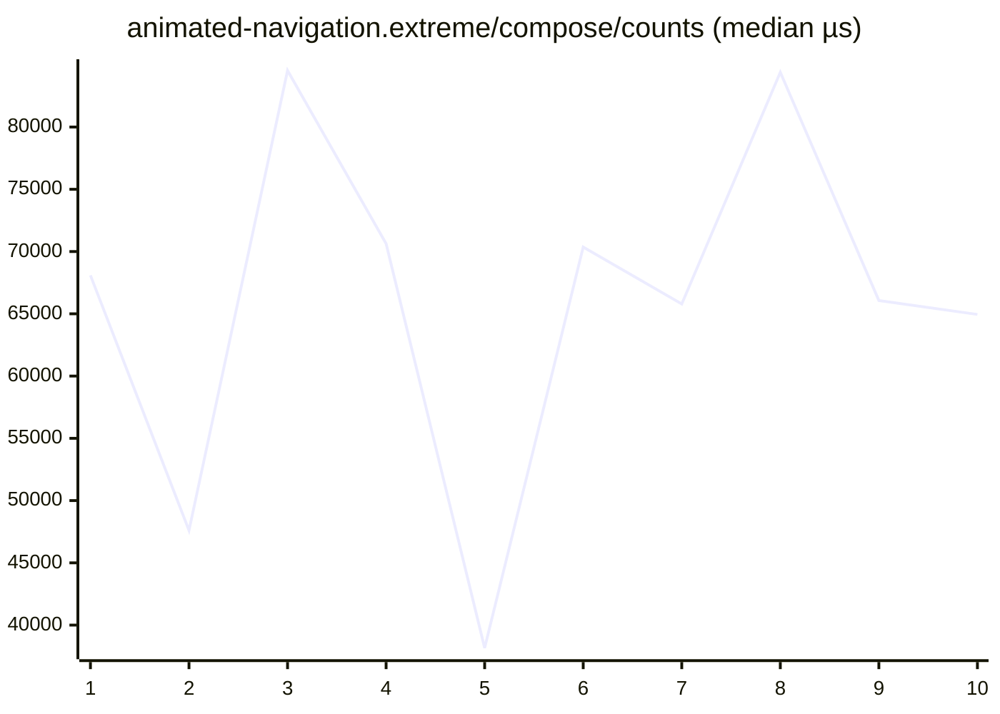
```mermaid
xychart-beta
    title "animated-navigation.extreme/compose/counts (median µs)"
    x-axis 1 --> 10
    line [68091.2, 47605.1, 84532.8, 70635.7, 38164.3, 70361.3, 65787.2, 84392.1, 66069.4, 64947.7]
```

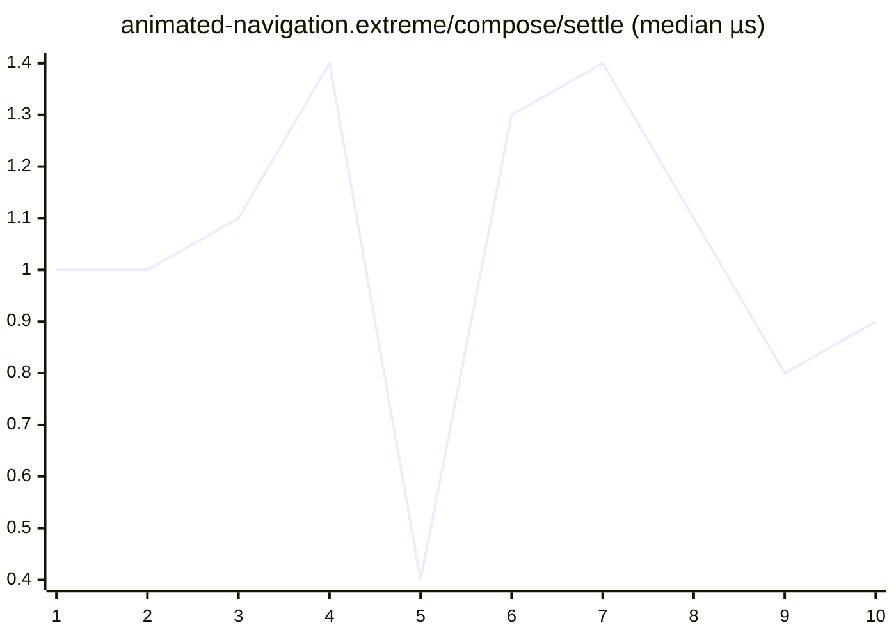
```mermaid
xychart-beta
    title "animated-navigation.extreme/compose/settle (median µs)"
    x-axis 1 --> 10
    line [1.0, 1.0, 1.1, 1.4, 0.4, 1.3, 1.4, 1.1, 0.8, 0.9]
```

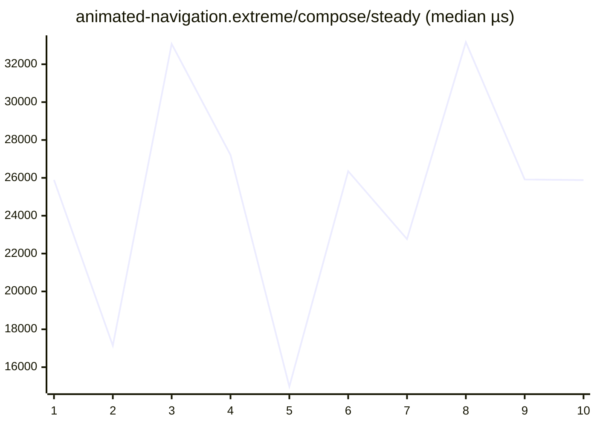
```mermaid
xychart-beta
    title "animated-navigation.extreme/compose/steady (median µs)"
    x-axis 1 --> 10
    line [25890.3, 17137.2, 33073.2, 27209.7, 14974.2, 26354.8, 22766.0, 33169.8, 25913.2, 25881.1]
```

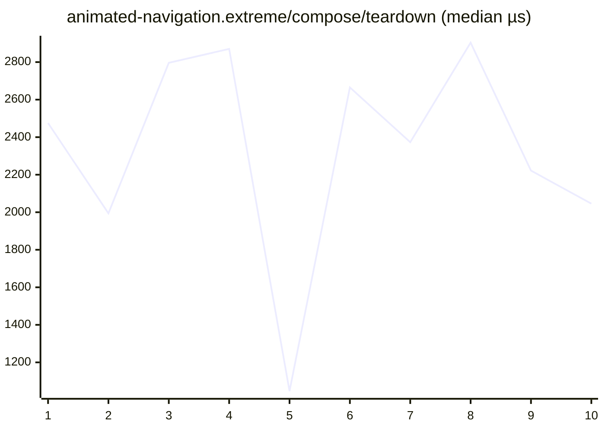
```mermaid
xychart-beta
    title "animated-navigation.extreme/compose/teardown (median µs)"
    x-axis 1 --> 10
    line [2475.2, 1994.0, 2796.3, 2870.3, 1046.7, 2665.2, 2373.1, 2903.9, 2221.8, 2045.9]
```

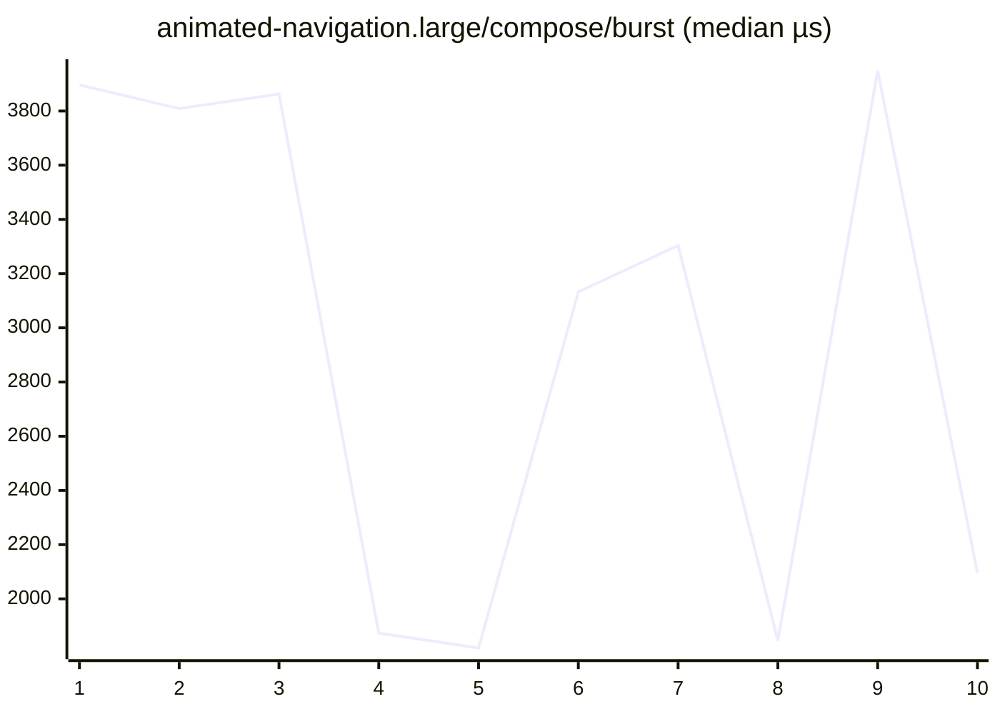
```mermaid
xychart-beta
    title "animated-navigation.large/compose/burst (median µs)"
    x-axis 1 --> 10
    line [3896.2, 3809.1, 3862.2, 1873.3, 1818.8, 3132.6, 3304.0, 1845.5, 3949.1, 2096.6]
```

```mermaid
xychart-beta
    title "animated-navigation.large/compose/cold (median µs)"
    x-axis 1 --> 10
    line [5692.2, 5515.9, 5845.7, 3938.9, 3716.9, 4867.6, 5782.8, 4150.4, 5496.4, 4026.0]
```

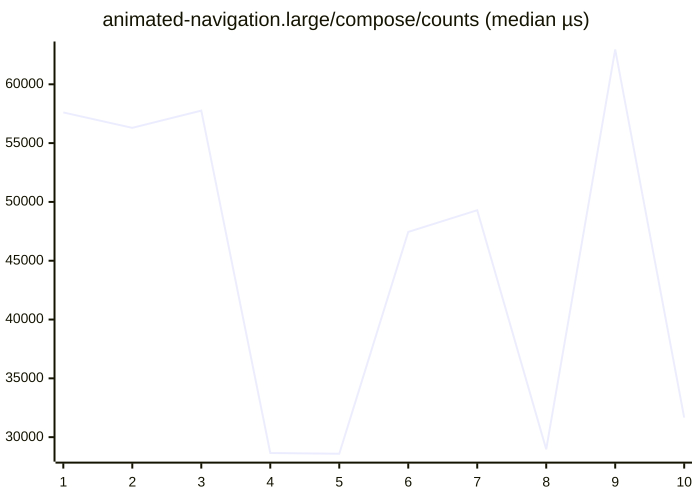
```mermaid
xychart-beta
    title "animated-navigation.large/compose/counts (median µs)"
    x-axis 1 --> 10
    line [57607.9, 56296.6, 57762.9, 28652.9, 28589.4, 47453.0, 49293.5, 28964.9, 62964.9, 31661.0]
```

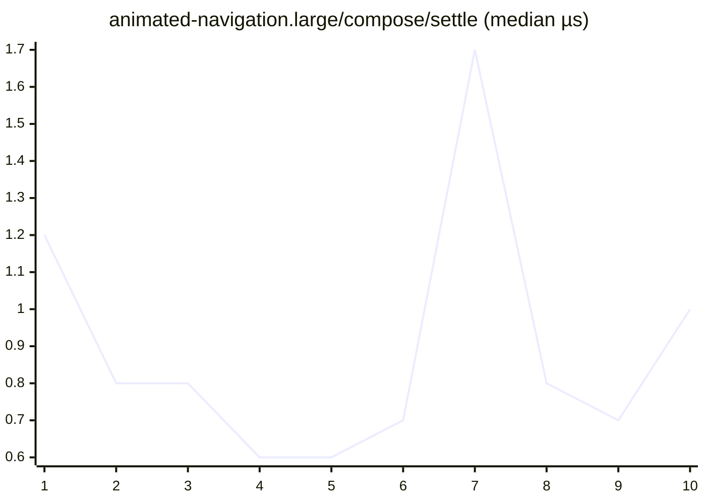
```mermaid
xychart-beta
    title "animated-navigation.large/compose/settle (median µs)"
    x-axis 1 --> 10
    line [1.2, 0.8, 0.8, 0.6, 0.6, 0.7, 1.7, 0.8, 0.7, 1.0]
```

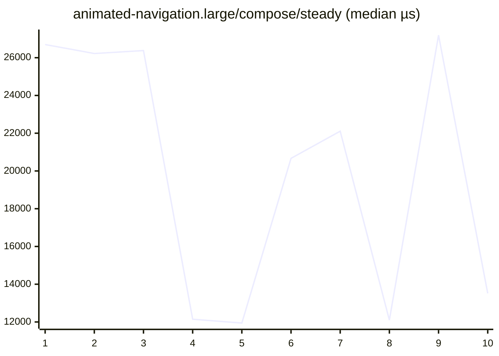
```mermaid
xychart-beta
    title "animated-navigation.large/compose/steady (median µs)"
    x-axis 1 --> 10
    line [26697.4, 26221.7, 26378.1, 12144.9, 11941.8, 20669.0, 22107.0, 12098.4, 27192.9, 13516.2]
```

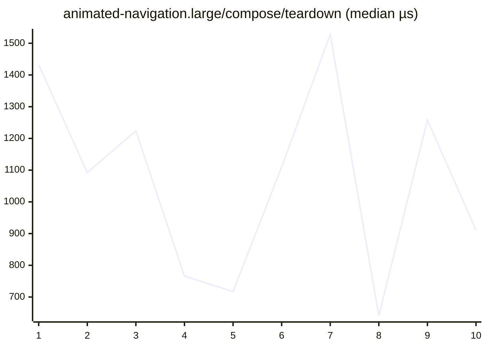
```mermaid
xychart-beta
    title "animated-navigation.large/compose/teardown (median µs)"
    x-axis 1 --> 10
    line [1432.5, 1092.3, 1223.6, 766.2, 717.1, 1110.1, 1527.9, 640.8, 1258.0, 911.1]
```

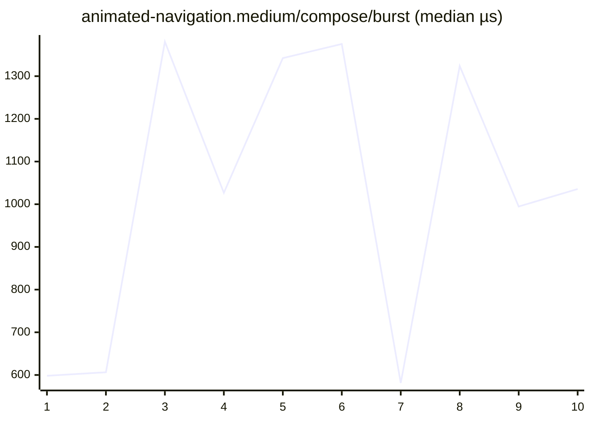
```mermaid
xychart-beta
    title "animated-navigation.medium/compose/burst (median µs)"
    x-axis 1 --> 10
    line [598.2, 606.3, 1380.7, 1026.7, 1342.2, 1375.4, 581.3, 1323.8, 994.6, 1035.7]
```

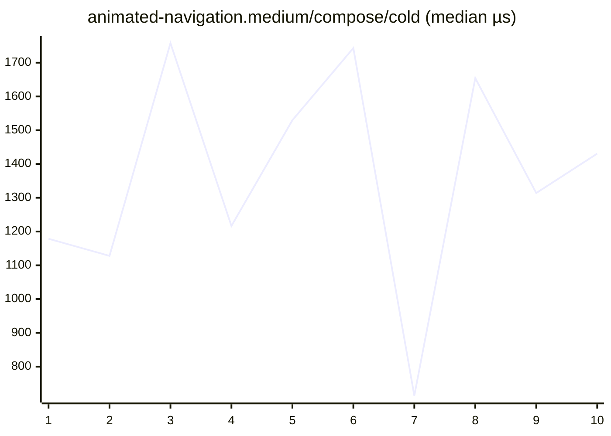
```mermaid
xychart-beta
    title "animated-navigation.medium/compose/cold (median µs)"
    x-axis 1 --> 10
    line [1178.6, 1128.0, 1758.0, 1216.6, 1529.7, 1743.3, 714.0, 1654.2, 1314.0, 1430.7]
```

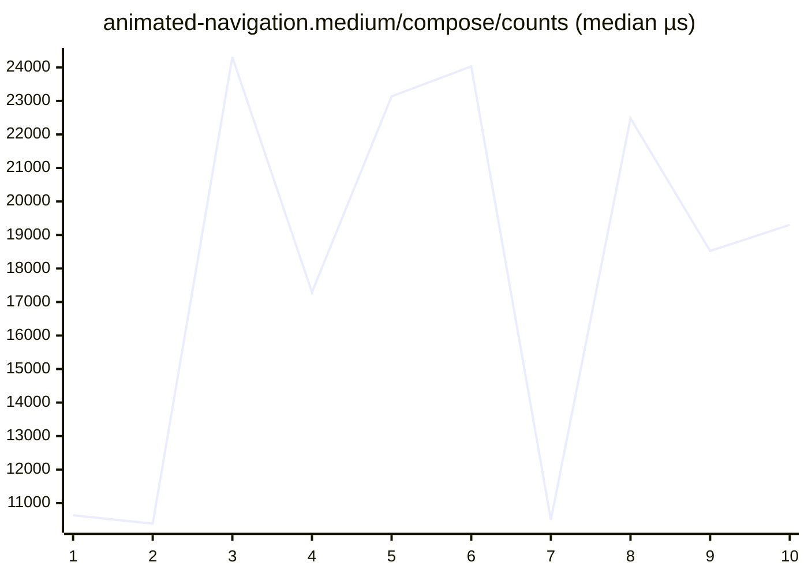
```mermaid
xychart-beta
    title "animated-navigation.medium/compose/counts (median µs)"
    x-axis 1 --> 10
    line [10635.9, 10387.5, 24309.0, 17291.5, 23136.2, 24026.4, 10503.0, 22483.8, 18522.5, 19302.5]
```

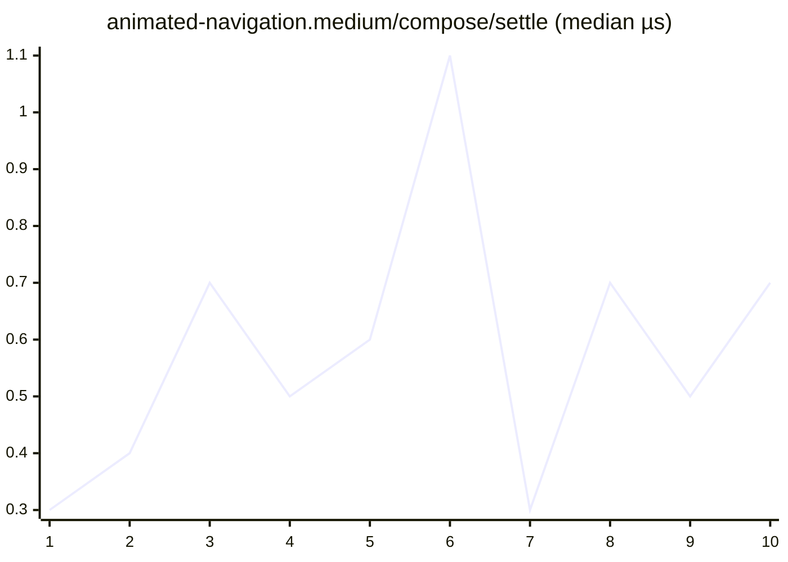
```mermaid
xychart-beta
    title "animated-navigation.medium/compose/settle (median µs)"
    x-axis 1 --> 10
    line [0.3, 0.4, 0.7, 0.5, 0.6, 1.1, 0.3, 0.7, 0.5, 0.7]
```

```mermaid
xychart-beta
    title "animated-navigation.medium/compose/steady (median µs)"
    x-axis 1 --> 10
    line [4717.9, 4534.1, 10683.3, 7716.1, 10557.1, 10514.6, 4601.4, 10453.8, 7583.5, 7905.9]
```

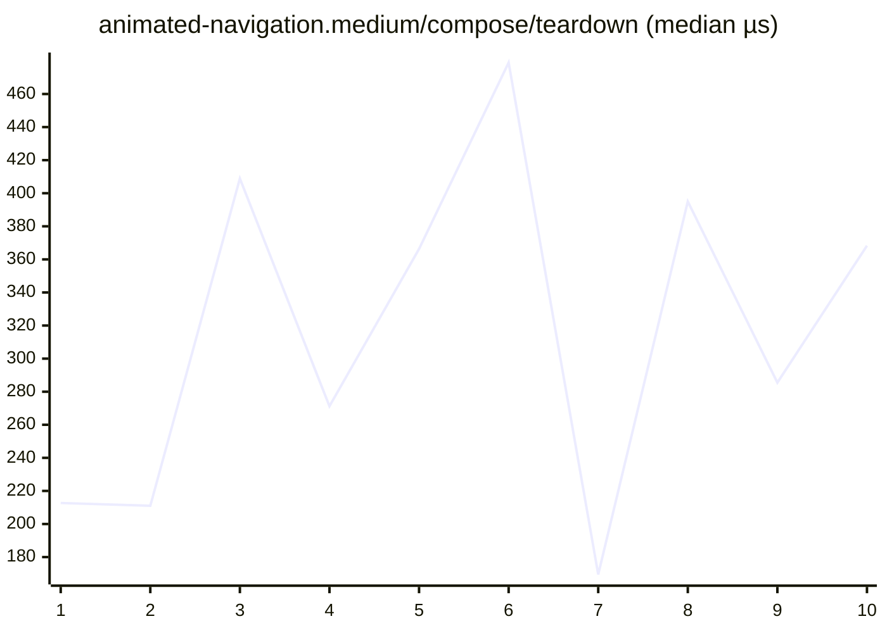
```mermaid
xychart-beta
    title "animated-navigation.medium/compose/teardown (median µs)"
    x-axis 1 --> 10
    line [212.7, 211.0, 408.9, 271.2, 366.3, 479.0, 169.5, 395.0, 285.5, 368.3]
```

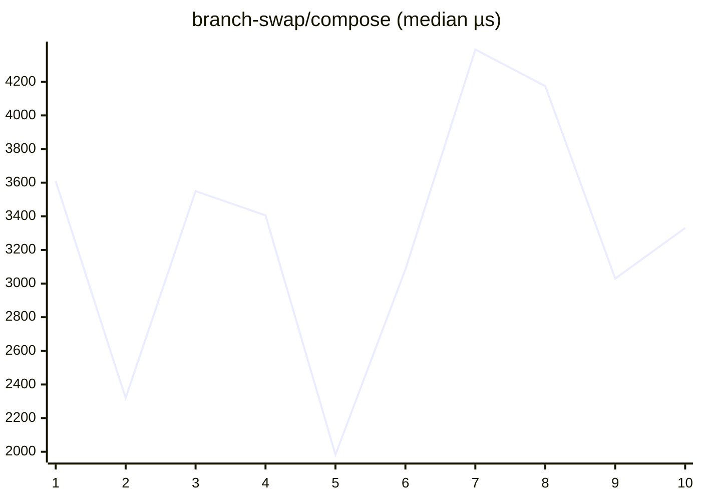
```mermaid
xychart-beta
    title "branch-swap/compose (median µs)"
    x-axis 1 --> 10
    line [3609.5, 2319.6, 3549.8, 3405.8, 1982.7, 3084.6, 4391.8, 4174.1, 3029.6, 3330.8]
```

```mermaid
xychart-beta
    title "cold-mount-100/compose (median µs)"
    x-axis 1 --> 10
    line [592.6, 519.9, 885.4, 445.1, 390.3, 654.2, 754.1, 718.7, 593.0, 377.0]
```

```mermaid
xychart-beta
    title "cold-mount-1000/compose (median µs)"
    x-axis 1 --> 10
    line [8085.8, 5389.9, 8549.6, 6933.2, 5008.1, 8021.9, 4561.7, 3463.8, 7354.0, 4374.9]
```

```mermaid
xychart-beta
    title "cold-mount-10000/compose (median µs)"
    x-axis 1 --> 10
    line [73945.7, 98256.1, 94238.7, 59096.4, 91513.5, 96319.1, 82259.3, 63209.5, 90166.9, 69416.3]
```

```mermaid
xychart-beta
    title "data-grid.extreme/compose/burst (median µs)"
    x-axis 1 --> 10
    line [572777.3, 535083.2, 832744.6, 637093.8, 901025.5, 925169.9, 449606.0, 895257.3, 646273.1, 745950.2]
```

```mermaid
xychart-beta
    title "data-grid.extreme/compose/cold (median µs)"
    x-axis 1 --> 10
    line [350893.5, 328646.9, 515839.7, 377498.6, 538166.5, 557904.7, 284386.4, 531496.5, 388897.8, 451692.7]
```

```mermaid
xychart-beta
    title "data-grid.extreme/compose/counts (median µs)"
    x-axis 1 --> 10
    line [961903.0, 895177.9, 1510853.2, 1085251.1, 1502399.1, 1611360.1, 785389.3, 1377677.2, 1083973.3, 1308798.8]
```

```mermaid
xychart-beta
    title "data-grid.extreme/compose/settle (median µs)"
    x-axis 1 --> 10
    line [2.8, 2.4, 2.2, 2.6, 2.1, 2.4, 2.2, 2.2, 2.2, 2.9]
```

```mermaid
xychart-beta
    title "data-grid.extreme/compose/steady (median µs)"
    x-axis 1 --> 10
    line [12594.0, 11681.8, 22844.9, 17958.7, 23673.8, 23322.2, 11155.7, 22361.8, 16709.6, 18235.9]
```

```mermaid
xychart-beta
    title "data-grid.extreme/compose/teardown (median µs)"
    x-axis 1 --> 10
    line [1086.6, 1137.9, 1208.9, 1019.3, 1268.8, 1343.4, 835.2, 1224.3, 999.5, 1152.3]
```

```mermaid
xychart-beta
    title "data-grid.large/compose/burst (median µs)"
    x-axis 1 --> 10
    line [140083.3, 135962.2, 137048.1, 79047.3, 75260.8, 109163.6, 121880.1, 81408.7, 136478.5, 86694.2]
```

```mermaid
xychart-beta
    title "data-grid.large/compose/cold (median µs)"
    x-axis 1 --> 10
    line [80791.9, 79866.7, 78358.1, 46545.2, 43756.7, 58099.4, 68778.5, 44967.9, 78451.2, 49554.7]
```

```mermaid
xychart-beta
    title "data-grid.large/compose/counts (median µs)"
    x-axis 1 --> 10
    line [269572.2, 259528.8, 247425.1, 134287.8, 131710.6, 188468.8, 214177.9, 150547.4, 244022.4, 154990.2]
```

```mermaid
xychart-beta
    title "data-grid.large/compose/settle (median µs)"
    x-axis 1 --> 10
    line [2.0, 2.0, 1.8, 1.2, 2.0, 1.9, 2.7, 1.9, 1.5, 1.9]
```

```mermaid
xychart-beta
    title "data-grid.large/compose/steady (median µs)"
    x-axis 1 --> 10
    line [17382.0, 15842.8, 15303.1, 9007.1, 8005.9, 11625.0, 12919.6, 8353.8, 15332.2, 8860.1]
```

```mermaid
xychart-beta
    title "data-grid.large/compose/teardown (median µs)"
    x-axis 1 --> 10
    line [517.4, 507.1, 530.1, 308.6, 332.9, 426.4, 518.6, 361.1, 504.0, 353.0]
```

```mermaid
xychart-beta
    title "data-grid.medium/compose/burst (median µs)"
    x-axis 1 --> 10
    line [49689.5, 40264.0, 63124.3, 54341.9, 32137.1, 50132.9, 54919.9, 65755.5, 48028.9, 47256.5]
```

```mermaid
xychart-beta
    title "data-grid.medium/compose/cold (median µs)"
    x-axis 1 --> 10
    line [28216.2, 22726.8, 35966.3, 30152.5, 18330.7, 26916.9, 30108.2, 37334.5, 26866.3, 27653.0]
```

```mermaid
xychart-beta
    title "data-grid.medium/compose/counts (median µs)"
    x-axis 1 --> 10
    line [101676.4, 85010.8, 128707.0, 106187.2, 62031.4, 100197.9, 110205.4, 130840.7, 101043.6, 97338.7]
```

```mermaid
xychart-beta
    title "data-grid.medium/compose/settle (median µs)"
    x-axis 1 --> 10
    line [2.2, 2.3, 1.8, 2.4, 0.6, 1.9, 2.1, 1.9, 1.6, 1.4]
```

```mermaid
xychart-beta
    title "data-grid.medium/compose/steady (median µs)"
    x-axis 1 --> 10
    line [12139.2, 8725.2, 12812.2, 11984.4, 6457.6, 10768.7, 11263.0, 14779.4, 11549.9, 11368.0]
```

```mermaid
xychart-beta
    title "data-grid.medium/compose/teardown (median µs)"
    x-axis 1 --> 10
    line [242.3, 222.0, 291.3, 267.8, 145.7, 280.3, 272.6, 313.2, 239.6, 243.1]
```

```mermaid
xychart-beta
    title "dense-dashboard.extreme/compose/burst (median µs)"
    x-axis 1 --> 10
    line [8748.3, 13808.9, 14242.7, 14836.6, 15612.8, 11708.1, 9145.2, 14405.4, 16835.5, 11470.0]
```

```mermaid
xychart-beta
    title "dense-dashboard.extreme/compose/cold (median µs)"
    x-axis 1 --> 10
    line [306.9, 503.4, 495.3, 587.1, 524.3, 393.3, 329.8, 528.9, 514.1, 396.9]
```

```mermaid
xychart-beta
    title "dense-dashboard.extreme/compose/counts (median µs)"
    x-axis 1 --> 10
    line [12107.6, 25337.6, 22769.2, 21520.0, 21897.1, 18320.5, 13760.6, 40266.5, 22521.9, 18237.1]
```

```mermaid
xychart-beta
    title "dense-dashboard.extreme/compose/settle (median µs)"
    x-axis 1 --> 10
    line [0.6, 1.1, 1.0, 0.8, 0.9, 0.8, 1.1, 1.0, 0.8, 0.9]
```

```mermaid
xychart-beta
    title "dense-dashboard.extreme/compose/steady (median µs)"
    x-axis 1 --> 10
    line [461.4, 853.9, 896.4, 863.9, 868.1, 685.9, 487.3, 868.8, 860.5, 718.9]
```

```mermaid
xychart-beta
    title "dense-dashboard.extreme/compose/teardown (median µs)"
    x-axis 1 --> 10
    line [300.0, 528.8, 524.0, 500.2, 563.4, 420.3, 338.6, 537.9, 520.8, 455.9]
```

```mermaid
xychart-beta
    title "dense-dashboard.large/compose/burst (median µs)"
    x-axis 1 --> 10
    line [7315.2, 6455.4, 7861.5, 5932.0, 3664.7, 4865.3, 7559.3, 4721.2, 7058.8, 5621.0]
```

```mermaid
xychart-beta
    title "dense-dashboard.large/compose/cold (median µs)"
    x-axis 1 --> 10
    line [321.9, 311.0, 312.5, 196.1, 172.6, 252.5, 330.9, 182.8, 284.4, 229.7]
```

```mermaid
xychart-beta
    title "dense-dashboard.large/compose/counts (median µs)"
    x-axis 1 --> 10
    line [15457.3, 15616.4, 15030.0, 9619.3, 9006.3, 13093.5, 13144.9, 8826.0, 16562.2, 20081.3]
```

```mermaid
xychart-beta
    title "dense-dashboard.large/compose/settle (median µs)"
    x-axis 1 --> 10
    line [0.9, 0.8, 0.8, 0.7, 0.5, 0.6, 1.5, 0.6, 0.8, 0.8]
```

```mermaid
xychart-beta
    title "dense-dashboard.large/compose/steady (median µs)"
    x-axis 1 --> 10
    line [871.8, 849.7, 860.9, 434.1, 430.1, 673.3, 710.2, 432.8, 871.4, 501.4]
```

```mermaid
xychart-beta
    title "dense-dashboard.large/compose/teardown (median µs)"
    x-axis 1 --> 10
    line [255.7, 242.4, 250.0, 139.2, 128.8, 202.4, 271.9, 146.7, 239.1, 177.2]
```

```mermaid
xychart-beta
    title "dense-dashboard.medium/compose/burst (median µs)"
    x-axis 1 --> 10
    line [1884.9, 1716.2, 3396.7, 2022.7, 3071.6, 3206.4, 1423.0, 2945.6, 2193.3, 2470.1]
```

```mermaid
xychart-beta
    title "dense-dashboard.medium/compose/cold (median µs)"
    x-axis 1 --> 10
    line [150.8, 125.0, 199.3, 164.2, 201.4, 241.3, 96.5, 215.2, 146.9, 225.3]
```

```mermaid
xychart-beta
    title "dense-dashboard.medium/compose/counts (median µs)"
    x-axis 1 --> 10
    line [4488.4, 3035.8, 6218.8, 3927.1, 6262.4, 5300.8, 2445.0, 6213.6, 3921.4, 6912.1]
```

```mermaid
xychart-beta
    title "dense-dashboard.medium/compose/settle (median µs)"
    x-axis 1 --> 10
    line [0.6, 0.4, 0.7, 0.5, 0.7, 0.7, 0.4, 0.7, 0.5, 0.9]
```

```mermaid
xychart-beta
    title "dense-dashboard.medium/compose/steady (median µs)"
    x-axis 1 --> 10
    line [451.5, 440.8, 842.9, 675.3, 830.4, 863.8, 440.0, 847.9, 676.6, 742.6]
```

```mermaid
xychart-beta
    title "dense-dashboard.medium/compose/teardown (median µs)"
    x-axis 1 --> 10
    line [71.1, 68.2, 109.1, 88.9, 111.5, 129.0, 60.7, 120.6, 86.9, 110.2]
```

```mermaid
xychart-beta
    title "entities-identity-churn-10.extreme/compose/burst (median µs)"
    x-axis 1 --> 10
    line [36450.3, 44418.2, 46637.6, 27103.8, 44981.1, 29543.4, 40066.6, 42717.5, 44228.2, 28621.2]
```

```mermaid
xychart-beta
    title "entities-identity-churn-10.extreme/compose/cold (median µs)"
    x-axis 1 --> 10
    line [22317.0, 30608.9, 30755.4, 23786.9, 40570.4, 19153.7, 28343.7, 27744.4, 27490.8, 21260.7]
```

```mermaid
xychart-beta
    title "entities-identity-churn-10.extreme/compose/counts (median µs)"
    x-axis 1 --> 10
    line [157183.8, 226408.0, 207640.3, 143081.0, 226763.2, 128206.5, 171885.4, 169973.5, 181184.8, 109290.4]
```

```mermaid
xychart-beta
    title "entities-identity-churn-10.extreme/compose/settle (median µs)"
    x-axis 1 --> 10
    line [1.5, 2.2, 2.0, 1.5, 2.5, 2.0, 1.5, 2.8, 1.8, 1.9]
```

```mermaid
xychart-beta
    title "entities-identity-churn-10.extreme/compose/steady (median µs)"
    x-axis 1 --> 10
    line [38679.7, 58936.7, 52064.1, 26669.0, 61811.9, 29113.4, 45991.2, 49404.1, 48062.6, 27418.6]
```

```mermaid
xychart-beta
    title "entities-identity-churn-10.extreme/compose/teardown (median µs)"
    x-axis 1 --> 10
    line [870.1, 1178.4, 1115.4, 774.0, 1244.2, 740.3, 1065.2, 1427.6, 1116.9, 671.8]
```

```mermaid
xychart-beta
    title "entities-identity-churn-10.large/compose/burst (median µs)"
    x-axis 1 --> 10
    line [13822.3, 12671.8, 13643.0, 12953.8, 6143.0, 14759.8, 12995.7, 14364.3, 10095.8, 10310.8]
```

```mermaid
xychart-beta
    title "entities-identity-churn-10.large/compose/cold (median µs)"
    x-axis 1 --> 10
    line [8768.9, 8903.6, 12727.0, 12419.1, 6935.5, 10733.2, 8614.4, 12686.5, 8728.5, 10245.2]
```

```mermaid
xychart-beta
    title "entities-identity-churn-10.large/compose/counts (median µs)"
    x-axis 1 --> 10
    line [56991.3, 49197.8, 64112.9, 60677.1, 28433.4, 57838.2, 57671.1, 70144.7, 46269.3, 47057.6]
```

```mermaid
xychart-beta
    title "entities-identity-churn-10.large/compose/settle (median µs)"
    x-axis 1 --> 10
    line [2.0, 2.2, 1.6, 1.9, 0.7, 1.8, 2.0, 2.1, 1.1, 1.1]
```

```mermaid
xychart-beta
    title "entities-identity-churn-10.large/compose/steady (median µs)"
    x-axis 1 --> 10
    line [16083.5, 12191.6, 17784.2, 14312.6, 8120.2, 16453.6, 16282.2, 19046.9, 13218.8, 13903.4]
```

```mermaid
xychart-beta
    title "entities-identity-churn-10.large/compose/teardown (median µs)"
    x-axis 1 --> 10
    line [346.1, 297.1, 375.4, 338.9, 182.0, 354.6, 362.7, 426.3, 301.2, 309.7]
```

```mermaid
xychart-beta
    title "entities-identity-churn-10.medium/compose/burst (median µs)"
    x-axis 1 --> 10
    line [4810.6, 5385.1, 7593.1, 5112.8, 6878.8, 6650.5, 3288.9, 8470.5, 5951.0, 6482.4]
```

```mermaid
xychart-beta
    title "entities-identity-churn-10.medium/compose/cold (median µs)"
    x-axis 1 --> 10
    line [3510.0, 3688.3, 5372.0, 3383.4, 4891.2, 5151.2, 2409.5, 5430.8, 4134.9, 4615.1]
```

```mermaid
xychart-beta
    title "entities-identity-churn-10.medium/compose/counts (median µs)"
    x-axis 1 --> 10
    line [22176.2, 21779.2, 33203.4, 22936.2, 34013.7, 31437.1, 16138.3, 33707.6, 26238.4, 28597.5]
```

```mermaid
xychart-beta
    title "entities-identity-churn-10.medium/compose/settle (median µs)"
    x-axis 1 --> 10
    line [0.9, 1.3, 1.1, 0.9, 1.2, 1.1, 0.5, 1.2, 0.7, 1.6]
```

```mermaid
xychart-beta
    title "entities-identity-churn-10.medium/compose/steady (median µs)"
    x-axis 1 --> 10
    line [5091.1, 4800.2, 8300.0, 5909.2, 8141.7, 8237.8, 3705.4, 8586.3, 6200.6, 6616.3]
```

```mermaid
xychart-beta
    title "entities-identity-churn-10.medium/compose/teardown (median µs)"
    x-axis 1 --> 10
    line [138.2, 141.4, 189.4, 143.6, 208.6, 209.6, 100.5, 229.5, 158.3, 180.3]
```

```mermaid
xychart-beta
    title "entities-identity-churn-50.extreme/compose/burst (median µs)"
    x-axis 1 --> 10
    line [37375.3, 42100.8, 41076.4, 43172.5, 28018.8, 41299.1, 37898.2, 49926.6, 32228.2, 33255.5]
```

```mermaid
xychart-beta
    title "entities-identity-churn-50.extreme/compose/cold (median µs)"
    x-axis 1 --> 10
    line [28909.8, 26506.8, 29632.4, 23700.6, 16677.6, 22767.7, 28551.6, 34974.5, 24971.5, 21564.1]
```

```mermaid
xychart-beta
    title "entities-identity-churn-50.extreme/compose/counts (median µs)"
    x-axis 1 --> 10
    line [312089.2, 264728.7, 287119.4, 313931.9, 170730.7, 360065.4, 295547.6, 321512.6, 266009.8, 240545.9]
```

```mermaid
xychart-beta
    title "entities-identity-churn-50.extreme/compose/settle (median µs)"
    x-axis 1 --> 10
    line [2.6, 2.4, 1.9, 2.3, 2.1, 2.0, 2.6, 2.3, 2.2, 1.7]
```

```mermaid
xychart-beta
    title "entities-identity-churn-50.extreme/compose/steady (median µs)"
    x-axis 1 --> 10
    line [144362.2, 138910.8, 151388.1, 146004.0, 82765.7, 135865.1, 159344.1, 153493.1, 124879.9, 117316.9]
```

```mermaid
xychart-beta
    title "entities-identity-churn-50.extreme/compose/teardown (median µs)"
    x-axis 1 --> 10
    line [1011.3, 1046.8, 1153.3, 1158.5, 635.9, 966.8, 1114.4, 1149.1, 904.6, 903.9]
```

```mermaid
xychart-beta
    title "entities-identity-churn-50.large/compose/burst (median µs)"
    x-axis 1 --> 10
    line [11392.1, 16006.5, 14237.9, 8830.8, 17379.2, 12261.9, 15344.8, 11689.2, 15070.0, 8966.1]
```

```mermaid
xychart-beta
    title "entities-identity-churn-50.large/compose/cold (median µs)"
    x-axis 1 --> 10
    line [10645.8, 12312.2, 10388.0, 8077.7, 10611.2, 7955.1, 10922.4, 8068.7, 14082.2, 9074.6]
```

```mermaid
xychart-beta
    title "entities-identity-churn-50.large/compose/counts (median µs)"
    x-axis 1 --> 10
    line [86389.6, 118638.8, 108507.3, 60853.6, 129304.7, 73934.5, 103471.9, 90339.3, 110422.3, 65006.6]
```

```mermaid
xychart-beta
    title "entities-identity-churn-50.large/compose/settle (median µs)"
    x-axis 1 --> 10
    line [1.5, 2.3, 1.6, 1.2, 1.9, 1.8, 1.4, 2.4, 1.9, 1.3]
```

```mermaid
xychart-beta
    title "entities-identity-churn-50.large/compose/steady (median µs)"
    x-axis 1 --> 10
    line [40309.4, 56606.6, 50910.5, 29130.8, 63002.5, 34672.3, 46041.0, 42900.9, 49581.9, 32226.5]
```

```mermaid
xychart-beta
    title "entities-identity-churn-50.large/compose/teardown (median µs)"
    x-axis 1 --> 10
    line [312.8, 448.9, 398.2, 225.9, 469.2, 278.4, 371.5, 321.9, 410.0, 263.5]
```

```mermaid
xychart-beta
    title "entities-identity-churn-50.medium/compose/burst (median µs)"
    x-axis 1 --> 10
    line [8485.7, 8733.8, 7811.5, 5053.3, 3913.2, 6868.0, 7233.3, 5340.6, 7477.5, 5415.3]
```

```mermaid
xychart-beta
    title "entities-identity-churn-50.medium/compose/cold (median µs)"
    x-axis 1 --> 10
    line [5123.1, 5090.8, 6479.6, 3545.3, 2939.0, 4644.6, 4523.8, 3418.2, 5696.9, 3356.2]
```

```mermaid
xychart-beta
    title "entities-identity-churn-50.medium/compose/counts (median µs)"
    x-axis 1 --> 10
    line [60621.5, 66177.5, 62123.7, 40694.0, 32773.8, 53100.7, 61894.0, 40328.5, 62517.4, 42722.0]
```

```mermaid
xychart-beta
    title "entities-identity-churn-50.medium/compose/settle (median µs)"
    x-axis 1 --> 10
    line [1.3, 1.6, 1.6, 1.3, 0.7, 1.6, 2.2, 1.6, 1.4, 1.7]
```

```mermaid
xychart-beta
    title "entities-identity-churn-50.medium/compose/steady (median µs)"
    x-axis 1 --> 10
    line [22448.9, 25049.9, 23583.9, 14477.3, 11837.6, 20245.0, 21639.9, 16174.8, 24137.9, 15185.2]
```

```mermaid
xychart-beta
    title "entities-identity-churn-50.medium/compose/teardown (median µs)"
    x-axis 1 --> 10
    line [239.6, 252.1, 242.6, 155.2, 117.2, 204.8, 234.3, 165.7, 225.9, 185.9]
```

```mermaid
xychart-beta
    title "entities-identity-churn.extreme/compose/burst (median µs)"
    x-axis 1 --> 10
    line [51119.4, 42743.7, 45181.7, 38370.3, 33338.8, 36817.5, 52885.4, 40171.8, 45201.7, 43605.9]
```

```mermaid
xychart-beta
    title "entities-identity-churn.extreme/compose/cold (median µs)"
    x-axis 1 --> 10
    line [31173.0, 29216.5, 29632.0, 19346.5, 15753.8, 25514.4, 27023.7, 28801.0, 30156.0, 23547.2]
```

```mermaid
xychart-beta
    title "entities-identity-churn.extreme/compose/counts (median µs)"
    x-axis 1 --> 10
    line [276895.4, 231546.3, 239558.4, 151482.1, 126042.6, 202144.3, 260291.3, 188217.0, 247726.9, 181846.4]
```

```mermaid
xychart-beta
    title "entities-identity-churn.extreme/compose/settle (median µs)"
    x-axis 1 --> 10
    line [2.3, 2.0, 2.1, 2.3, 1.7, 2.3, 2.5, 2.4, 2.1, 2.3]
```

```mermaid
xychart-beta
    title "entities-identity-churn.extreme/compose/steady (median µs)"
    x-axis 1 --> 10
    line [103496.4, 98719.9, 87903.0, 60700.8, 49561.0, 86888.2, 112427.9, 73292.0, 89321.4, 73423.5]
```

```mermaid
xychart-beta
    title "entities-identity-churn.extreme/compose/teardown (median µs)"
    x-axis 1 --> 10
    line [1459.8, 1163.1, 1253.7, 814.1, 700.5, 1030.1, 1378.4, 1097.2, 1200.1, 1321.4]
```

```mermaid
xychart-beta
    title "entities-identity-churn.large/compose/burst (median µs)"
    x-axis 1 --> 10
    line [9662.4, 8486.1, 12526.7, 11002.8, 13446.7, 15085.5, 8379.8, 14725.8, 12360.0, 12441.3]
```

```mermaid
xychart-beta
    title "entities-identity-churn.large/compose/cold (median µs)"
    x-axis 1 --> 10
    line [7331.9, 8413.6, 11406.1, 12037.1, 13160.2, 12731.3, 5986.0, 12621.4, 9295.7, 9552.4]
```

```mermaid
xychart-beta
    title "entities-identity-churn.large/compose/counts (median µs)"
    x-axis 1 --> 10
    line [62489.1, 65083.5, 93016.9, 76013.1, 98085.9, 98527.4, 51915.0, 93148.1, 75454.3, 86470.1]
```

```mermaid
xychart-beta
    title "entities-identity-churn.large/compose/settle (median µs)"
    x-axis 1 --> 10
    line [1.6, 1.6, 1.7, 1.3, 2.0, 1.7, 1.1, 1.5, 1.4, 1.7]
```

```mermaid
xychart-beta
    title "entities-identity-churn.large/compose/steady (median µs)"
    x-axis 1 --> 10
    line [17762.3, 18587.4, 28783.0, 23340.3, 29455.6, 33017.1, 15327.8, 30626.8, 24307.5, 26214.3]
```

```mermaid
xychart-beta
    title "entities-identity-churn.large/compose/teardown (median µs)"
    x-axis 1 --> 10
    line [221.0, 244.4, 350.0, 314.6, 386.7, 384.2, 198.7, 367.8, 292.3, 328.3]
```

```mermaid
xychart-beta
    title "entities-identity-churn.medium/compose/burst (median µs)"
    x-axis 1 --> 10
    line [5597.4, 5043.1, 7507.7, 7112.6, 3457.9, 6040.7, 6526.1, 8643.7, 5508.7, 5434.9]
```

```mermaid
xychart-beta
    title "entities-identity-churn.medium/compose/cold (median µs)"
    x-axis 1 --> 10
    line [4098.3, 3677.5, 4917.8, 4309.4, 3034.9, 4284.9, 4653.8, 4991.2, 3768.5, 3928.0]
```

```mermaid
xychart-beta
    title "entities-identity-churn.medium/compose/counts (median µs)"
    x-axis 1 --> 10
    line [31911.5, 26270.5, 38265.0, 35758.5, 17029.0, 34046.6, 35379.4, 40732.1, 30879.3, 27637.7]
```

```mermaid
xychart-beta
    title "entities-identity-churn.medium/compose/settle (median µs)"
    x-axis 1 --> 10
    line [1.0, 1.7, 1.0, 1.9, 0.6, 1.6, 1.4, 1.1, 1.0, 0.8]
```

```mermaid
xychart-beta
    title "entities-identity-churn.medium/compose/steady (median µs)"
    x-axis 1 --> 10
    line [10781.6, 9751.3, 14145.6, 11476.1, 7059.7, 11350.6, 12871.8, 13831.7, 11296.4, 10100.3]
```

```mermaid
xychart-beta
    title "entities-identity-churn.medium/compose/teardown (median µs)"
    x-axis 1 --> 10
    line [163.7, 158.3, 209.3, 186.8, 106.1, 185.4, 191.4, 206.3, 162.9, 165.1]
```

```mermaid
xychart-beta
    title "entities-integrated.extreme/compose/burst (median µs)"
    x-axis 1 --> 10
    line [18098.0, 16855.7, 18205.9, 16320.2, 17509.3, 20570.2, 12111.1, 9626.9, 14530.4, 10614.7]
```

```mermaid
xychart-beta
    title "entities-integrated.extreme/compose/cold (median µs)"
    x-axis 1 --> 10
    line [102015.1, 100238.6, 110792.2, 98791.5, 86043.8, 111031.3, 76896.5, 67500.7, 96114.6, 75512.5]
```

```mermaid
xychart-beta
    title "entities-integrated.extreme/compose/counts (median µs)"
    x-axis 1 --> 10
    line [358907.4, 324615.1, 382570.8, 305419.8, 287951.5, 321960.0, 269473.8, 204158.1, 309577.5, 224504.5]
```

```mermaid
xychart-beta
    title "entities-integrated.extreme/compose/settle (median µs)"
    x-axis 1 --> 10
    line [1.8, 1.9, 2.1, 1.7, 1.7, 1.9, 2.0, 1.6, 2.0, 2.1]
```

```mermaid
xychart-beta
    title "entities-integrated.extreme/compose/steady (median µs)"
    x-axis 1 --> 10
    line [90630.1, 81412.5, 95946.8, 80410.1, 73987.2, 97008.8, 73582.9, 55127.3, 75657.9, 70368.8]
```

```mermaid
xychart-beta
    title "entities-integrated.extreme/compose/teardown (median µs)"
    x-axis 1 --> 10
    line [52871.1, 45496.4, 55490.6, 46463.3, 40502.6, 51955.2, 48082.4, 36583.8, 51571.9, 48606.0]
```

```mermaid
xychart-beta
    title "entities-integrated.large/compose/burst (median µs)"
    x-axis 1 --> 10
    line [9879.6, 9266.1, 9580.3, 5350.4, 5000.3, 7911.5, 9138.6, 5431.2, 9235.0, 5853.5]
```

```mermaid
xychart-beta
    title "entities-integrated.large/compose/cold (median µs)"
    x-axis 1 --> 10
    line [42924.1, 40697.9, 38453.5, 27622.0, 23282.1, 34452.0, 37474.1, 28353.5, 43086.1, 28882.8]
```

```mermaid
xychart-beta
    title "entities-integrated.large/compose/counts (median µs)"
    x-axis 1 --> 10
    line [159260.0, 136585.0, 136418.7, 92540.6, 75726.6, 116205.8, 145691.2, 92771.0, 140925.6, 108143.8]
```

```mermaid
xychart-beta
    title "entities-integrated.large/compose/settle (median µs)"
    x-axis 1 --> 10
    line [2.1, 1.5, 1.6, 1.6, 1.2, 1.6, 2.2, 2.0, 1.5, 1.9]
```

```mermaid
xychart-beta
    title "entities-integrated.large/compose/steady (median µs)"
    x-axis 1 --> 10
    line [56879.3, 47700.5, 50360.1, 29499.8, 25632.1, 39134.3, 49897.4, 34021.1, 47956.3, 32324.3]
```

```mermaid
xychart-beta
    title "entities-integrated.large/compose/teardown (median µs)"
    x-axis 1 --> 10
    line [16802.1, 13908.2, 14198.2, 10974.4, 8656.6, 14230.7, 18168.2, 12469.9, 13648.1, 13174.6]
```

```mermaid
xychart-beta
    title "entities-integrated.medium/compose/burst (median µs)"
    x-axis 1 --> 10
    line [4273.0, 4064.7, 6941.6, 5470.1, 7091.9, 7241.2, 3606.4, 7034.6, 5526.8, 5894.6]
```

```mermaid
xychart-beta
    title "entities-integrated.medium/compose/cold (median µs)"
    x-axis 1 --> 10
    line [14214.0, 12986.0, 18998.1, 20759.9, 20252.4, 22768.0, 13202.3, 21049.2, 13647.3, 17563.3]
```

```mermaid
xychart-beta
    title "entities-integrated.medium/compose/counts (median µs)"
    x-axis 1 --> 10
    line [60159.0, 56773.8, 91261.8, 68607.4, 94840.7, 109979.7, 46066.0, 91208.7, 64907.3, 80485.4]
```

```mermaid
xychart-beta
    title "entities-integrated.medium/compose/settle (median µs)"
    x-axis 1 --> 10
    line [1.9, 1.7, 1.6, 1.2, 1.4, 1.7, 1.0, 1.6, 1.1, 1.9]
```

```mermaid
xychart-beta
    title "entities-integrated.medium/compose/steady (median µs)"
    x-axis 1 --> 10
    line [20781.1, 19484.3, 34314.8, 25155.4, 35931.8, 41195.2, 16863.5, 34416.2, 24878.1, 28066.7]
```

```mermaid
xychart-beta
    title "entities-integrated.medium/compose/teardown (median µs)"
    x-axis 1 --> 10
    line [5912.5, 5137.9, 6370.7, 5086.2, 6899.6, 7628.9, 3519.9, 6540.0, 5189.6, 6828.3]
```

```mermaid
xychart-beta
    title "entities-relevance-saturated.extreme/compose/burst (median µs)"
    x-axis 1 --> 10
    line [82088.2, 67803.4, 81772.9, 78539.9, 42827.9, 75203.6, 74827.0, 82527.1, 66483.1, 54486.0]
```

```mermaid
xychart-beta
    title "entities-relevance-saturated.extreme/compose/cold (median µs)"
    x-axis 1 --> 10
    line [23851.0, 19385.3, 27237.7, 29579.2, 16205.6, 25539.7, 24187.8, 26855.5, 23002.8, 25162.3]
```

```mermaid
xychart-beta
    title "entities-relevance-saturated.extreme/compose/counts (median µs)"
    x-axis 1 --> 10
    line [215972.6, 170155.4, 218067.6, 205395.8, 129067.0, 218719.0, 211515.3, 231455.2, 210915.3, 177968.2]
```

```mermaid
xychart-beta
    title "entities-relevance-saturated.extreme/compose/settle (median µs)"
    x-axis 1 --> 10
    line [2.5, 2.9, 2.1, 2.6, 1.9, 2.5, 2.5, 2.2, 2.2, 1.8]
```

```mermaid
xychart-beta
    title "entities-relevance-saturated.extreme/compose/steady (median µs)"
    x-axis 1 --> 10
    line [46499.2, 63403.0, 50693.5, 50493.5, 26077.2, 49900.4, 50230.3, 46598.9, 37383.9, 39323.0]
```

```mermaid
xychart-beta
    title "entities-relevance-saturated.extreme/compose/teardown (median µs)"
    x-axis 1 --> 10
    line [13254.3, 13259.6, 13403.6, 14674.6, 8911.1, 13251.9, 13962.6, 12345.3, 11488.0, 11671.8]
```

```mermaid
xychart-beta
    title "entities-relevance-saturated.large/compose/burst (median µs)"
    x-axis 1 --> 10
    line [23829.2, 21410.5, 26910.9, 27013.4, 14236.6, 24208.8, 23728.7, 26738.0, 21901.0, 21644.6]
```

```mermaid
xychart-beta
    title "entities-relevance-saturated.large/compose/cold (median µs)"
    x-axis 1 --> 10
    line [9046.6, 8698.0, 11112.7, 11237.4, 6143.2, 9343.6, 10313.4, 10994.3, 9966.1, 10101.0]
```

```mermaid
xychart-beta
    title "entities-relevance-saturated.large/compose/counts (median µs)"
    x-axis 1 --> 10
    line [66263.4, 60081.6, 78201.5, 74218.9, 39404.5, 69251.9, 67363.7, 81625.4, 60775.6, 58956.4]
```

```mermaid
xychart-beta
    title "entities-relevance-saturated.large/compose/settle (median µs)"
    x-axis 1 --> 10
    line [2.2, 2.3, 1.7, 2.3, 1.1, 2.0, 1.9, 1.9, 1.6, 1.2]
```

```mermaid
xychart-beta
    title "entities-relevance-saturated.large/compose/steady (median µs)"
    x-axis 1 --> 10
    line [15970.8, 12947.8, 17610.3, 17826.6, 11242.1, 15433.1, 16862.1, 19331.5, 15639.6, 14872.6]
```

```mermaid
xychart-beta
    title "entities-relevance-saturated.large/compose/teardown (median µs)"
    x-axis 1 --> 10
    line [3313.5, 2966.7, 2967.8, 3445.2, 1914.9, 3360.7, 3073.0, 3235.1, 2831.6, 2648.1]
```

```mermaid
xychart-beta
    title "entities-relevance-saturated.medium/compose/burst (median µs)"
    x-axis 1 --> 10
    line [10053.5, 13258.0, 10542.4, 6875.4, 13588.9, 8448.7, 11354.4, 7488.6, 12592.2, 8099.5]
```

```mermaid
xychart-beta
    title "entities-relevance-saturated.medium/compose/cold (median µs)"
    x-axis 1 --> 10
    line [4425.1, 5999.0, 4925.5, 3251.8, 5590.3, 3641.1, 6085.1, 3730.8, 5133.8, 3247.3]
```

```mermaid
xychart-beta
    title "entities-relevance-saturated.medium/compose/counts (median µs)"
    x-axis 1 --> 10
    line [26589.7, 40004.4, 35054.4, 23518.5, 43107.2, 20771.7, 35914.6, 21858.7, 37161.7, 18663.8]
```

```mermaid
xychart-beta
    title "entities-relevance-saturated.medium/compose/settle (median µs)"
    x-axis 1 --> 10
    line [1.0, 1.5, 1.0, 0.9, 2.0, 1.7, 0.9, 1.4, 1.3, 0.7]
```

```mermaid
xychart-beta
    title "entities-relevance-saturated.medium/compose/steady (median µs)"
    x-axis 1 --> 10
    line [6593.9, 10265.5, 7799.1, 4375.5, 8267.5, 5658.1, 7360.6, 5130.7, 7683.1, 4592.8]
```

```mermaid
xychart-beta
    title "entities-relevance-saturated.medium/compose/teardown (median µs)"
    x-axis 1 --> 10
    line [909.1, 1375.7, 1014.9, 866.7, 1424.9, 998.3, 1033.6, 908.9, 1071.7, 692.1]
```

```mermaid
xychart-beta
    title "entities-relevance-sweep.extreme/compose/burst (median µs)"
    x-axis 1 --> 10
    line [83025.5, 131890.1, 139155.5, 102900.1, 157933.2, 128808.8, 112296.6, 116395.3, 114298.7, 77782.6]
```

```mermaid
xychart-beta
    title "entities-relevance-sweep.extreme/compose/cold (median µs)"
    x-axis 1 --> 10
    line [27112.7, 32898.9, 35114.3, 19901.5, 33750.6, 20001.5, 26640.6, 28100.9, 32036.3, 19396.7]
```

```mermaid
xychart-beta
    title "entities-relevance-sweep.extreme/compose/counts (median µs)"
    x-axis 1 --> 10
    line [297306.3, 392730.6, 375325.7, 279449.1, 480733.4, 287660.1, 322358.3, 325178.3, 353539.8, 259684.4]
```

```mermaid
xychart-beta
    title "entities-relevance-sweep.extreme/compose/settle (median µs)"
    x-axis 1 --> 10
    line [1.9, 2.5, 2.5, 2.5, 2.8, 2.8, 1.9, 3.2, 2.2, 2.1]
```

```mermaid
xychart-beta
    title "entities-relevance-sweep.extreme/compose/steady (median µs)"
    x-axis 1 --> 10
    line [104435.7, 129482.8, 118556.7, 87490.4, 162273.4, 97620.2, 109193.4, 117043.1, 121722.7, 74566.9]
```

```mermaid
xychart-beta
    title "entities-relevance-sweep.extreme/compose/teardown (median µs)"
    x-axis 1 --> 10
    line [11409.1, 14374.0, 14539.1, 12187.9, 16437.6, 13724.4, 12383.5, 14144.5, 12818.0, 10029.5]
```

```mermaid
xychart-beta
    title "entities-relevance-sweep.large/compose/burst (median µs)"
    x-axis 1 --> 10
    line [37687.9, 36619.3, 41760.4, 43897.0, 20442.0, 38915.7, 45255.8, 44982.1, 35007.1, 28910.5]
```

```mermaid
xychart-beta
    title "entities-relevance-sweep.large/compose/cold (median µs)"
    x-axis 1 --> 10
    line [9427.2, 7416.6, 10731.1, 9936.2, 7900.6, 9398.3, 9938.4, 11517.2, 8967.2, 11128.5]
```

```mermaid
xychart-beta
    title "entities-relevance-sweep.large/compose/counts (median µs)"
    x-axis 1 --> 10
    line [118464.0, 105642.9, 132017.4, 113098.8, 71443.8, 123886.3, 120574.8, 132620.0, 102062.1, 100614.4]
```

```mermaid
xychart-beta
    title "entities-relevance-sweep.large/compose/settle (median µs)"
    x-axis 1 --> 10
    line [2.0, 2.4, 1.7, 2.1, 1.2, 2.1, 2.6, 1.8, 1.9, 1.7]
```

```mermaid
xychart-beta
    title "entities-relevance-sweep.large/compose/steady (median µs)"
    x-axis 1 --> 10
    line [36383.7, 29649.6, 42899.0, 36038.5, 24323.9, 38124.3, 41637.8, 39291.2, 32139.9, 35692.6]
```

```mermaid
xychart-beta
    title "entities-relevance-sweep.large/compose/teardown (median µs)"
    x-axis 1 --> 10
    line [3319.5, 3173.8, 3204.1, 3765.1, 2211.6, 3346.3, 3590.8, 3373.3, 3109.6, 2887.6]
```

```mermaid
xychart-beta
    title "entities-relevance-sweep.medium/compose/burst (median µs)"
    x-axis 1 --> 10
    line [21304.8, 17609.9, 19632.8, 19428.5, 17153.1, 19140.6, 13680.9, 10539.8, 16358.8, 11865.2]
```

```mermaid
xychart-beta
    title "entities-relevance-sweep.medium/compose/cold (median µs)"
    x-axis 1 --> 10
    line [5522.9, 4875.0, 6616.8, 5391.1, 4632.0, 5418.8, 3748.9, 4334.6, 6279.5, 3677.9]
```

```mermaid
xychart-beta
    title "entities-relevance-sweep.medium/compose/counts (median µs)"
    x-axis 1 --> 10
    line [73432.0, 63426.8, 72731.7, 66518.2, 62374.3, 65043.1, 44806.4, 37229.6, 54883.7, 39212.4]
```

```mermaid
xychart-beta
    title "entities-relevance-sweep.medium/compose/settle (median µs)"
    x-axis 1 --> 10
    line [1.9, 1.0, 1.3, 1.3, 1.6, 1.5, 1.7, 0.8, 1.7, 1.1]
```

```mermaid
xychart-beta
    title "entities-relevance-sweep.medium/compose/steady (median µs)"
    x-axis 1 --> 10
    line [21627.0, 18049.0, 19673.0, 19997.6, 17951.3, 19922.5, 12042.0, 9569.3, 14921.4, 10859.4]
```

```mermaid
xychart-beta
    title "entities-relevance-sweep.medium/compose/teardown (median µs)"
    x-axis 1 --> 10
    line [1421.5, 998.7, 1251.6, 1111.8, 1133.0, 1281.3, 1123.1, 703.5, 1334.7, 805.3]
```

```mermaid
xychart-beta
    title "entity-labels-sparse.extreme/compose/burst (median µs)"
    x-axis 1 --> 10
    line [28431.3, 29661.9, 27082.8, 16711.4, 16256.2, 24942.1, 43425.5, 19047.2, 29329.5, 23888.9]
```

```mermaid
xychart-beta
    title "entity-labels-sparse.extreme/compose/cold (median µs)"
    x-axis 1 --> 10
    line [25491.4, 23933.9, 25087.3, 17441.6, 14649.4, 20662.4, 25099.0, 15188.8, 24417.5, 17460.1]
```

```mermaid
xychart-beta
    title "entity-labels-sparse.extreme/compose/counts (median µs)"
    x-axis 1 --> 10
    line [103374.1, 95880.0, 93198.2, 60028.1, 47563.7, 81598.1, 107155.7, 73201.1, 109348.2, 70689.4]
```

```mermaid
xychart-beta
    title "entity-labels-sparse.extreme/compose/settle (median µs)"
    x-axis 1 --> 10
    line [1.8, 1.9, 1.6, 1.8, 1.2, 1.8, 2.9, 1.7, 1.6, 2.0]
```

```mermaid
xychart-beta
    title "entity-labels-sparse.extreme/compose/steady (median µs)"
    x-axis 1 --> 10
    line [4152.6, 3939.8, 3787.2, 2841.3, 2146.5, 3306.4, 4976.5, 2718.0, 3853.1, 3247.2]
```

```mermaid
xychart-beta
    title "entity-labels-sparse.extreme/compose/teardown (median µs)"
    x-axis 1 --> 10
    line [12752.1, 12268.9, 12210.0, 9099.8, 7657.4, 10987.1, 15200.5, 8955.6, 12069.7, 10513.1]
```

```mermaid
xychart-beta
    title "entity-labels-sparse.large/compose/burst (median µs)"
    x-axis 1 --> 10
    line [12559.3, 12285.7, 12193.2, 7053.5, 7719.0, 11258.9, 13191.0, 7344.2, 12331.2, 8836.0]
```

```mermaid
xychart-beta
    title "entity-labels-sparse.large/compose/cold (median µs)"
    x-axis 1 --> 10
    line [10065.7, 12236.3, 12145.6, 7446.2, 7340.1, 9091.0, 13532.7, 6013.0, 11254.0, 6551.3]
```

```mermaid
xychart-beta
    title "entity-labels-sparse.large/compose/counts (median µs)"
    x-axis 1 --> 10
    line [47228.6, 41552.7, 49545.9, 25620.0, 20398.0, 37816.7, 43649.2, 22653.6, 39155.5, 26880.9]
```

```mermaid
xychart-beta
    title "entity-labels-sparse.large/compose/settle (median µs)"
    x-axis 1 --> 10
    line [1.2, 1.3, 1.2, 1.2, 1.0, 1.4, 2.3, 1.0, 1.1, 1.0]
```

```mermaid
xychart-beta
    title "entity-labels-sparse.large/compose/steady (median µs)"
    x-axis 1 --> 10
    line [1880.4, 1925.6, 1869.1, 1138.5, 1131.8, 1602.8, 2237.8, 1167.6, 1834.0, 1371.2]
```

```mermaid
xychart-beta
    title "entity-labels-sparse.large/compose/teardown (median µs)"
    x-axis 1 --> 10
    line [3848.1, 4042.8, 3927.2, 2747.9, 2759.1, 3661.9, 4768.6, 2555.1, 3867.2, 3129.4]
```

```mermaid
xychart-beta
    title "entity-labels-sparse.medium/compose/burst (median µs)"
    x-axis 1 --> 10
    line [2692.8, 4883.0, 4638.9, 4912.8, 5026.0, 4027.1, 3463.0, 5225.9, 5403.1, 3648.1]
```

```mermaid
xychart-beta
    title "entity-labels-sparse.medium/compose/cold (median µs)"
    x-axis 1 --> 10
    line [3511.6, 5344.2, 4334.1, 5274.7, 5181.4, 4438.3, 3135.4, 3961.6, 6491.8, 3808.1]
```

```mermaid
xychart-beta
    title "entity-labels-sparse.medium/compose/counts (median µs)"
    x-axis 1 --> 10
    line [11899.6, 20010.0, 21389.0, 22972.4, 20570.5, 16988.5, 13171.6, 20709.0, 21150.4, 16877.2]
```

```mermaid
xychart-beta
    title "entity-labels-sparse.medium/compose/settle (median µs)"
    x-axis 1 --> 10
    line [0.8, 0.8, 0.9, 0.8, 0.9, 0.7, 1.0, 0.9, 1.0, 0.6]
```

```mermaid
xychart-beta
    title "entity-labels-sparse.medium/compose/steady (median µs)"
    x-axis 1 --> 10
    line [546.9, 864.1, 884.8, 935.5, 884.1, 730.7, 550.6, 847.0, 1000.2, 683.4]
```

```mermaid
xychart-beta
    title "entity-labels-sparse.medium/compose/teardown (median µs)"
    x-axis 1 --> 10
    line [793.8, 1245.8, 1305.4, 1265.7, 1223.0, 1121.5, 872.8, 1219.1, 1413.7, 1035.2]
```

```mermaid
xychart-beta
    title "entity-labels.extreme/compose/burst (median µs)"
    x-axis 1 --> 10
    line [38306.7, 27292.5, 30271.6, 28243.8, 29005.1, 33304.8, 17732.8, 18157.2, 28538.7, 17595.4]
```

```mermaid
xychart-beta
    title "entity-labels.extreme/compose/cold (median µs)"
    x-axis 1 --> 10
    line [26392.1, 25728.0, 24789.0, 25091.7, 22204.5, 27675.8, 16504.3, 15582.8, 20883.5, 19145.7]
```

```mermaid
xychart-beta
    title "entity-labels.extreme/compose/counts (median µs)"
    x-axis 1 --> 10
    line [146562.2, 118482.8, 130233.0, 121188.5, 115298.7, 136017.8, 81709.5, 71988.5, 111855.8, 77960.9]
```

```mermaid
xychart-beta
    title "entity-labels.extreme/compose/settle (median µs)"
    x-axis 1 --> 10
    line [2.1, 1.2, 1.5, 1.9, 1.9, 1.9, 2.1, 1.3, 1.9, 1.6]
```

```mermaid
xychart-beta
    title "entity-labels.extreme/compose/steady (median µs)"
    x-axis 1 --> 10
    line [35077.9, 31134.3, 31374.2, 30446.4, 26594.6, 34700.1, 15230.3, 13680.6, 23826.6, 15055.4]
```

```mermaid
xychart-beta
    title "entity-labels.extreme/compose/teardown (median µs)"
    x-axis 1 --> 10
    line [14166.4, 14892.9, 12081.1, 11856.0, 11411.3, 12865.8, 9445.8, 8055.2, 11851.0, 9298.0]
```

```mermaid
xychart-beta
    title "entity-labels.large/compose/burst (median µs)"
    x-axis 1 --> 10
    line [16371.6, 13675.4, 14796.5, 8143.5, 6921.8, 11737.9, 14799.3, 7533.0, 13435.0, 9691.8]
```

```mermaid
xychart-beta
    title "entity-labels.large/compose/cold (median µs)"
    x-axis 1 --> 10
    line [13125.5, 12164.0, 12241.7, 8754.9, 8206.7, 13934.9, 13016.5, 8828.1, 12657.0, 11472.1]
```

```mermaid
xychart-beta
    title "entity-labels.large/compose/counts (median µs)"
    x-axis 1 --> 10
    line [71347.2, 67401.3, 63961.0, 38511.1, 29591.2, 53168.0, 63281.7, 37574.1, 65780.9, 46696.1]
```

```mermaid
xychart-beta
    title "entity-labels.large/compose/settle (median µs)"
    x-axis 1 --> 10
    line [1.8, 1.6, 1.8, 1.2, 0.8, 1.7, 2.4, 1.1, 1.2, 1.9]
```

```mermaid
xychart-beta
    title "entity-labels.large/compose/steady (median µs)"
    x-axis 1 --> 10
    line [17130.8, 15636.5, 15592.5, 6886.2, 5727.0, 10867.3, 12969.4, 6304.5, 15282.4, 7970.8]
```

```mermaid
xychart-beta
    title "entity-labels.large/compose/teardown (median µs)"
    x-axis 1 --> 10
    line [4985.7, 4474.5, 4408.6, 3132.6, 2490.9, 4133.6, 4825.8, 2950.0, 4383.6, 3855.4]
```

```mermaid
xychart-beta
    title "entity-labels.medium/compose/burst (median µs)"
    x-axis 1 --> 10
    line [5454.2, 5016.4, 5182.8, 4977.7, 4705.2, 5603.2, 3075.2, 2510.4, 4189.9, 2636.6]
```

```mermaid
xychart-beta
    title "entity-labels.medium/compose/cold (median µs)"
    x-axis 1 --> 10
    line [6039.1, 4145.2, 5211.5, 4920.9, 4320.8, 5134.9, 2887.4, 2303.4, 4736.5, 2321.4]
```

```mermaid
xychart-beta
    title "entity-labels.medium/compose/counts (median µs)"
    x-axis 1 --> 10
    line [27680.1, 23447.7, 25731.3, 23381.3, 18913.6, 25673.9, 12663.2, 11587.3, 16963.5, 11133.1]
```

```mermaid
xychart-beta
    title "entity-labels.medium/compose/settle (median µs)"
    x-axis 1 --> 10
    line [1.2, 0.8, 1.1, 0.8, 1.0, 1.0, 0.9, 0.5, 0.8, 0.5]
```

```mermaid
xychart-beta
    title "entity-labels.medium/compose/steady (median µs)"
    x-axis 1 --> 10
    line [6474.9, 6388.6, 6421.2, 6421.9, 4371.6, 6821.4, 2934.7, 2369.4, 4152.8, 2514.1]
```

```mermaid
xychart-beta
    title "entity-labels.medium/compose/teardown (median µs)"
    x-axis 1 --> 10
    line [1477.1, 1273.6, 1329.9, 1262.9, 1139.0, 1501.8, 949.3, 700.5, 1154.9, 743.5]
```

```mermaid
xychart-beta
    title "events/compose (median µs)"
    x-axis 1 --> 10
    line [10464.1, 9121.0, 11019.8, 9922.2, 6474.8, 13785.7, 12735.9, 13242.7, 10469.1, 10448.1]
```

```mermaid
xychart-beta
    title "inspector.extreme/compose/burst (median µs)"
    x-axis 1 --> 10
    line [7448.2, 5545.2, 8042.0, 7887.1, 4081.4, 7770.0, 7596.4, 9007.9, 7263.5, 6905.3]
```

```mermaid
xychart-beta
    title "inspector.extreme/compose/cold (median µs)"
    x-axis 1 --> 10
    line [18874.4, 15878.8, 20409.9, 18550.5, 11659.9, 18757.1, 18454.7, 22287.5, 17322.6, 16059.9]
```

```mermaid
xychart-beta
    title "inspector.extreme/compose/counts (median µs)"
    x-axis 1 --> 10
    line [34335.8, 23488.3, 37816.7, 33632.2, 18349.1, 30508.1, 33686.5, 36844.1, 30794.3, 30050.3]
```

```mermaid
xychart-beta
    title "inspector.extreme/compose/settle (median µs)"
    x-axis 1 --> 10
    line [1.6, 1.4, 1.2, 2.0, 0.7, 1.4, 1.7, 1.8, 1.1, 0.9]
```

```mermaid
xychart-beta
    title "inspector.extreme/compose/steady (median µs)"
    x-axis 1 --> 10
    line [245.7, 207.7, 236.8, 270.8, 131.2, 267.8, 236.9, 307.4, 220.9, 205.0]
```

```mermaid
xychart-beta
    title "inspector.extreme/compose/teardown (median µs)"
    x-axis 1 --> 10
    line [2590.5, 2153.7, 2312.0, 3007.8, 1361.7, 3037.5, 2600.4, 3046.3, 2216.3, 1877.9]
```

```mermaid
xychart-beta
    title "inspector.large/compose/burst (median µs)"
    x-axis 1 --> 10
    line [3270.5, 4234.2, 4065.4, 2059.0, 4547.1, 2198.1, 4192.0, 2232.7, 4637.6, 2248.5]
```

```mermaid
xychart-beta
    title "inspector.large/compose/cold (median µs)"
    x-axis 1 --> 10
    line [6003.2, 9644.5, 6469.4, 5148.0, 8219.5, 4556.1, 6687.1, 5165.1, 8453.0, 4128.1]
```

```mermaid
xychart-beta
    title "inspector.large/compose/counts (median µs)"
    x-axis 1 --> 10
    line [15848.8, 18252.6, 18863.7, 13882.7, 21141.3, 12984.7, 17583.5, 13489.3, 21616.7, 8375.5]
```

```mermaid
xychart-beta
    title "inspector.large/compose/settle (median µs)"
    x-axis 1 --> 10
    line [0.8, 1.2, 0.8, 0.7, 1.8, 0.6, 0.8, 0.5, 1.3, 0.5]
```

```mermaid
xychart-beta
    title "inspector.large/compose/steady (median µs)"
    x-axis 1 --> 10
    line [184.9, 255.0, 227.5, 142.8, 294.1, 145.9, 234.4, 141.4, 297.1, 131.4]
```

```mermaid
xychart-beta
    title "inspector.large/compose/teardown (median µs)"
    x-axis 1 --> 10
    line [939.1, 1289.4, 1054.6, 747.2, 1560.4, 839.3, 1087.1, 752.4, 1359.5, 636.2]
```

```mermaid
xychart-beta
    title "inspector.medium/compose/burst (median µs)"
    x-axis 1 --> 10
    line [652.7, 1463.0, 1421.7, 1608.0, 1429.8, 1117.0, 914.2, 1501.6, 1471.1, 1090.2]
```

```mermaid
xychart-beta
    title "inspector.medium/compose/cold (median µs)"
    x-axis 1 --> 10
    line [1084.4, 2117.8, 1731.0, 2819.9, 1695.4, 1733.6, 1427.9, 2126.8, 1933.7, 1601.5]
```

```mermaid
xychart-beta
    title "inspector.medium/compose/counts (median µs)"
    x-axis 1 --> 10
    line [2345.3, 5474.4, 4793.9, 6353.6, 4594.8, 3720.8, 3175.4, 4664.1, 6578.4, 3787.3]
```

```mermaid
xychart-beta
    title "inspector.medium/compose/settle (median µs)"
    x-axis 1 --> 10
    line [0.4, 0.6, 0.6, 0.7, 0.6, 0.5, 0.7, 0.6, 0.7, 0.5]
```

```mermaid
xychart-beta
    title "inspector.medium/compose/steady (median µs)"
    x-axis 1 --> 10
    line [101.1, 207.3, 210.4, 235.5, 200.8, 172.3, 158.6, 210.0, 222.8, 164.6]
```

```mermaid
xychart-beta
    title "inspector.medium/compose/teardown (median µs)"
    x-axis 1 --> 10
    line [183.0, 391.0, 377.6, 430.5, 364.3, 301.9, 329.8, 385.2, 439.6, 303.9]
```

```mermaid
xychart-beta
    title "keyed-append/compose (median µs)"
    x-axis 1 --> 10
    line [1217.7, 1121.3, 1123.5, 616.2, 544.3, 830.1, 912.0, 582.5, 1181.1, 598.6]
```

```mermaid
xychart-beta
    title "keyed-insert/compose (median µs)"
    x-axis 1 --> 10
    line [1418.3, 1388.8, 2985.6, 1957.4, 2688.9, 2692.3, 1280.3, 2815.6, 1985.6, 2170.5]
```

```mermaid
xychart-beta
    title "keyed-prepend/compose (median µs)"
    x-axis 1 --> 10
    line [3339.2, 2323.0, 4385.8, 3245.3, 1938.3, 3308.6, 2890.6, 4215.3, 3235.5, 3278.5]
```

```mermaid
xychart-beta
    title "keyed-remove/compose (median µs)"
    x-axis 1 --> 10
    line [1834.7, 2550.5, 2731.1, 1302.2, 2681.1, 1287.8, 2556.8, 1286.6, 2631.5, 1380.4]
```

```mermaid
xychart-beta
    title "keyed-replace/compose (median µs)"
    x-axis 1 --> 10
    line [56638.2, 52082.4, 51437.5, 31895.5, 28628.9, 45286.9, 50297.1, 36995.3, 49638.2, 39153.1]
```

```mermaid
xychart-beta
    title "keyed-reverse/compose (median µs)"
    x-axis 1 --> 10
    line [1366.2, 1329.2, 2904.2, 2262.2, 3010.7, 2985.1, 1281.3, 2955.9, 2227.3, 2313.1]
```

```mermaid
xychart-beta
    title "keyed-rotate/compose (median µs)"
    x-axis 1 --> 10
    line [2837.0, 2918.3, 3001.8, 1448.0, 1299.3, 2297.1, 2375.3, 1351.1, 2946.5, 1518.5]
```

```mermaid
xychart-beta
    title "keyed-shuffle/compose (median µs)"
    x-axis 1 --> 10
    line [1337.6, 3134.0, 3010.8, 3078.2, 3095.3, 2318.3, 1502.6, 3006.3, 3079.7, 2345.2]
```

```mermaid
xychart-beta
    title "mount-cycles/compose (median µs)"
    x-axis 1 --> 10
    line [24941.5, 23043.1, 23398.1, 16185.9, 17338.0, 23324.6, 25604.5, 17252.1, 24893.2, 15159.7]
```

```mermaid
xychart-beta
    title "mount-dispose/compose (median µs)"
    x-axis 1 --> 10
    line [7076.9, 9579.0, 7445.0, 4609.4, 10316.6, 5700.8, 7319.8, 6423.1, 10826.5, 5377.9]
```

```mermaid
xychart-beta
    title "ordered-window-scroll/compose (median µs)"
    x-axis 1 --> 10
    line [412.1, 498.2, 504.6, 260.5, 499.9, 279.8, 497.2, 283.6, 497.2, 299.0]
```

```mermaid
xychart-beta
    title "projection-keyed-append-500/compose (median µs)"
    x-axis 1 --> 10
    line [5754.2, 14069.9, 10109.7, 13717.9, 13328.0, 8025.1, 6147.2, 13427.8, 13434.0, 8139.5]
```

```mermaid
xychart-beta
    title "projection-observe-100/compose (median µs)"
    x-axis 1 --> 10
    line [1160.9, 1688.5, 1375.7, 934.9, 1415.9, 968.3, 1530.8, 1005.7, 1566.5, 823.8]
```

```mermaid
xychart-beta
    title "projection-selection-500/compose (median µs)"
    x-axis 1 --> 10
    line [1347.5, 1257.8, 1305.3, 1261.8, 1068.3, 1262.7, 719.6, 676.6, 1079.6, 718.8]
```

```mermaid
xychart-beta
    title "scene-2d.extreme/compose/burst (median µs)"
    x-axis 1 --> 10
    line [31592.1, 26430.2, 30086.2, 22463.2, 21523.7, 24285.9, 20744.8, 16546.0, 24652.7, 16389.6]
```

```mermaid
xychart-beta
    title "scene-2d.extreme/compose/cold (median µs)"
    x-axis 1 --> 10
    line [11079.4, 9876.1, 11841.3, 12194.2, 9875.0, 9544.3, 6930.8, 6222.6, 8504.1, 7059.1]
```

```mermaid
xychart-beta
    title "scene-2d.extreme/compose/counts (median µs)"
    x-axis 1 --> 10
    line [216069.1, 186166.0, 209496.7, 210635.3, 184504.6, 191644.0, 125173.0, 98138.8, 166182.6, 100732.3]
```

```mermaid
xychart-beta
    title "scene-2d.extreme/compose/settle (median µs)"
    x-axis 1 --> 10
    line [2.2, 1.2, 1.5, 1.2, 1.8, 1.8, 2.0, 1.3, 1.8, 1.8]
```

```mermaid
xychart-beta
    title "scene-2d.extreme/compose/steady (median µs)"
    x-axis 1 --> 10
    line [90044.4, 84419.8, 84931.4, 87195.8, 80201.7, 82861.3, 47222.8, 45168.3, 64460.1, 45320.8]
```

```mermaid
xychart-beta
    title "scene-2d.extreme/compose/teardown (median µs)"
    x-axis 1 --> 10
    line [1242.8, 991.8, 1179.9, 1042.6, 955.6, 1098.7, 856.5, 664.8, 1049.1, 765.5]
```

```mermaid
xychart-beta
    title "scene-2d.large/compose/burst (median µs)"
    x-axis 1 --> 10
    line [23109.8, 30942.5, 25739.8, 16117.3, 28514.7, 16486.9, 22867.7, 19154.9, 27915.9, 17434.0]
```

```mermaid
xychart-beta
    title "scene-2d.large/compose/cold (median µs)"
    x-axis 1 --> 10
    line [4352.7, 6212.1, 6516.0, 3797.0, 6126.6, 3638.2, 6242.7, 3964.5, 5529.0, 3330.5]
```

```mermaid
xychart-beta
    title "scene-2d.large/compose/counts (median µs)"
    x-axis 1 --> 10
    line [150813.2, 189240.1, 180380.0, 102688.1, 198929.2, 99484.8, 182090.2, 118447.5, 185417.9, 99025.7]
```

```mermaid
xychart-beta
    title "scene-2d.large/compose/settle (median µs)"
    x-axis 1 --> 10
    line [1.3, 1.9, 1.8, 1.0, 2.6, 1.7, 1.1, 2.1, 1.9, 1.3]
```

```mermaid
xychart-beta
    title "scene-2d.large/compose/steady (median µs)"
    x-axis 1 --> 10
    line [67819.6, 92259.3, 88664.7, 47707.5, 91878.3, 48122.8, 87585.4, 50539.3, 89850.7, 46605.4]
```

```mermaid
xychart-beta
    title "scene-2d.large/compose/teardown (median µs)"
    x-axis 1 --> 10
    line [835.3, 1495.8, 1118.6, 692.5, 1280.0, 748.7, 974.1, 1020.3, 1291.8, 645.0]
```

```mermaid
xychart-beta
    title "scene-2d.medium/compose/burst (median µs)"
    x-axis 1 --> 10
    line [20349.9, 15428.8, 24654.7, 18400.6, 17606.8, 19713.7, 13415.7, 12028.0, 17466.5, 11407.2]
```

```mermaid
xychart-beta
    title "scene-2d.medium/compose/cold (median µs)"
    x-axis 1 --> 10
    line [4709.8, 4295.8, 3803.5, 4326.4, 3189.5, 5236.1, 3027.0, 1949.6, 3688.0, 2856.2]
```

```mermaid
xychart-beta
    title "scene-2d.medium/compose/counts (median µs)"
    x-axis 1 --> 10
    line [147623.1, 136904.9, 148677.3, 143451.4, 123739.5, 146270.1, 80785.3, 71179.9, 112733.2, 77244.1]
```

```mermaid
xychart-beta
    title "scene-2d.medium/compose/settle (median µs)"
    x-axis 1 --> 10
    line [2.2, 0.8, 1.4, 1.1, 1.2, 1.6, 1.9, 0.8, 1.6, 1.3]
```

```mermaid
xychart-beta
    title "scene-2d.medium/compose/steady (median µs)"
    x-axis 1 --> 10
    line [69181.6, 65753.4, 65422.7, 66617.4, 56988.1, 67387.5, 36236.5, 32601.2, 50828.0, 34882.8]
```

```mermaid
xychart-beta
    title "scene-2d.medium/compose/teardown (median µs)"
    x-axis 1 --> 10
    line [1053.9, 734.4, 1016.7, 799.9, 697.2, 1040.7, 717.3, 442.3, 842.5, 570.7]
```

```mermaid
xychart-beta
    title "scene-3d/compose (median µs)"
    x-axis 1 --> 10
    line [10050.2, 7649.9, 9011.1, 8309.7, 6569.6, 8881.9, 4148.2, 3349.5, 6014.4, 3855.0]
```

```mermaid
xychart-beta
    title "session-cycle.extreme/compose/burst (median µs)"
    x-axis 1 --> 10
    line [111388.5, 145081.3, 133361.3, 117151.1, 134745.1, 130563.4, 100054.0, 97734.6, 150799.8, 119618.3]
```

```mermaid
xychart-beta
    title "session-cycle.extreme/compose/cold (median µs)"
    x-axis 1 --> 10
    line [4.4, 4.2, 4.6, 3.8, 4.3, 3.6, 4.3, 4.1, 4.2, 4.2]
```

```mermaid
xychart-beta
    title "session-cycle.extreme/compose/counts (median µs)"
    x-axis 1 --> 10
    line [347844.7, 331552.2, 361578.0, 315896.8, 329766.9, 342300.6, 247069.9, 246438.3, 339456.9, 234355.1]
```

```mermaid
xychart-beta
    title "session-cycle.extreme/compose/settle (median µs)"
    x-axis 1 --> 10
    line [2.2, 2.2, 2.4, 2.0, 2.0, 1.8, 2.5, 2.3, 2.1, 2.4]
```

```mermaid
xychart-beta
    title "session-cycle.extreme/compose/steady (median µs)"
    x-axis 1 --> 10
    line [189371.2, 170051.3, 208681.3, 177283.5, 150659.9, 182076.0, 153677.9, 126781.8, 152483.2, 147937.2]
```

```mermaid
xychart-beta
    title "session-cycle.extreme/compose/teardown (median µs)"
    x-axis 1 --> 10
    line [2.3, 1.9, 2.4, 2.0, 1.9, 2.0, 3.2, 2.2, 2.3, 2.7]
```

```mermaid
xychart-beta
    title "session-cycle.large/compose/burst (median µs)"
    x-axis 1 --> 10
    line [55471.8, 41682.9, 47858.1, 38268.2, 43969.3, 40155.1, 44128.3, 33941.7, 39588.5, 25034.8]
```

```mermaid
xychart-beta
    title "session-cycle.large/compose/cold (median µs)"
    x-axis 1 --> 10
    line [4.1, 3.4, 4.0, 3.9, 3.5, 4.1, 3.8, 3.8, 4.3, 4.3]
```

```mermaid
xychart-beta
    title "session-cycle.large/compose/counts (median µs)"
    x-axis 1 --> 10
    line [152922.2, 127280.8, 125332.5, 126145.5, 114593.6, 135971.7, 76286.2, 84978.1, 107871.8, 91774.6]
```

```mermaid
xychart-beta
    title "session-cycle.large/compose/settle (median µs)"
    x-axis 1 --> 10
    line [1.9, 1.9, 2.0, 1.9, 1.6, 1.8, 2.1, 1.8, 1.9, 2.1]
```

```mermaid
xychart-beta
    title "session-cycle.large/compose/steady (median µs)"
    x-axis 1 --> 10
    line [70217.2, 67586.5, 71040.2, 71631.7, 65993.8, 72685.1, 47925.9, 48387.7, 67198.3, 53851.6]
```

```mermaid
xychart-beta
    title "session-cycle.large/compose/teardown (median µs)"
    x-axis 1 --> 10
    line [1.9, 1.7, 2.1, 1.7, 1.5, 2.2, 2.3, 1.9, 2.2, 2.3]
```

```mermaid
xychart-beta
    title "session-cycle.medium/compose/burst (median µs)"
    x-axis 1 --> 10
    line [9419.6, 16119.8, 14877.2, 8687.9, 14987.9, 10928.0, 10870.2, 10819.3, 14465.4, 10983.6]
```

```mermaid
xychart-beta
    title "session-cycle.medium/compose/cold (median µs)"
    x-axis 1 --> 10
    line [2.9, 4.7, 3.3, 3.8, 4.1, 3.9, 2.9, 4.0, 3.4, 2.8]
```

```mermaid
xychart-beta
    title "session-cycle.medium/compose/counts (median µs)"
    x-axis 1 --> 10
    line [32366.0, 44739.0, 39841.4, 32409.8, 45078.7, 32597.1, 35938.6, 36686.8, 40200.6, 26421.3]
```

```mermaid
xychart-beta
    title "session-cycle.medium/compose/settle (median µs)"
    x-axis 1 --> 10
    line [1.2, 1.5, 1.5, 1.5, 1.7, 1.9, 1.0, 1.8, 1.3, 1.1]
```

```mermaid
xychart-beta
    title "session-cycle.medium/compose/steady (median µs)"
    x-axis 1 --> 10
    line [16834.7, 22422.0, 19376.8, 14924.2, 24496.6, 14205.7, 21114.2, 18033.5, 19508.8, 12378.9]
```

```mermaid
xychart-beta
    title "session-cycle.medium/compose/teardown (median µs)"
    x-axis 1 --> 10
    line [1.2, 1.7, 1.6, 1.9, 2.0, 2.0, 0.9, 2.0, 1.4, 1.3]
```

```mermaid
xychart-beta
    title "spatial-scene.extreme/compose/burst (median µs)"
    x-axis 1 --> 10
    line [131626.4, 122408.9, 135923.1, 79047.5, 80922.8, 114343.7, 133949.1, 90807.2, 124292.5, 101853.4]
```

```mermaid
xychart-beta
    title "spatial-scene.extreme/compose/cold (median µs)"
    x-axis 1 --> 10
    line [11274.4, 10752.6, 11344.1, 6370.1, 6350.3, 8515.9, 10293.5, 7967.4, 10297.6, 7573.6]
```

```mermaid
xychart-beta
    title "spatial-scene.extreme/compose/counts (median µs)"
    x-axis 1 --> 10
    line [280294.2, 255499.9, 266526.7, 181289.9, 146193.2, 201768.3, 242178.1, 168507.4, 260099.7, 190677.3]
```

```mermaid
xychart-beta
    title "spatial-scene.extreme/compose/settle (median µs)"
    x-axis 1 --> 10
    line [1.7, 1.7, 2.0, 1.9, 2.2, 1.9, 2.3, 2.1, 1.8, 2.3]
```

```mermaid
xychart-beta
    title "spatial-scene.extreme/compose/steady (median µs)"
    x-axis 1 --> 10
    line [54938.1, 53195.1, 53842.8, 26463.3, 28588.3, 37962.4, 40035.6, 33240.0, 53446.2, 30631.5]
```

```mermaid
xychart-beta
    title "spatial-scene.extreme/compose/teardown (median µs)"
    x-axis 1 --> 10
    line [4193.8, 3229.5, 4161.6, 1998.5, 2138.0, 3152.1, 4304.1, 3025.3, 3224.2, 3596.8]
```

```mermaid
xychart-beta
    title "spatial-scene.large/compose/burst (median µs)"
    x-axis 1 --> 10
    line [24854.0, 36908.9, 37836.4, 24036.9, 44486.3, 21756.2, 31049.8, 27386.1, 37067.9, 20111.1]
```

```mermaid
xychart-beta
    title "spatial-scene.large/compose/cold (median µs)"
    x-axis 1 --> 10
    line [3382.2, 4654.1, 3405.2, 2395.1, 3754.2, 2566.4, 3158.1, 3069.9, 3298.8, 2274.4]
```

```mermaid
xychart-beta
    title "spatial-scene.large/compose/counts (median µs)"
    x-axis 1 --> 10
    line [50109.8, 74015.2, 77275.2, 40372.0, 80626.4, 41172.5, 66448.4, 47004.9, 74256.6, 36632.8]
```

```mermaid
xychart-beta
    title "spatial-scene.large/compose/settle (median µs)"
    x-axis 1 --> 10
    line [1.2, 1.9, 1.6, 1.6, 2.3, 1.5, 1.0, 2.5, 1.2, 1.0]
```

```mermaid
xychart-beta
    title "spatial-scene.large/compose/steady (median µs)"
    x-axis 1 --> 10
    line [12804.6, 19446.0, 19168.6, 10456.3, 19958.5, 10121.6, 18226.0, 11259.8, 18123.0, 9295.1]
```

```mermaid
xychart-beta
    title "spatial-scene.large/compose/teardown (median µs)"
    x-axis 1 --> 10
    line [635.6, 862.7, 813.6, 579.0, 1398.1, 511.6, 763.5, 704.6, 926.9, 478.4]
```

```mermaid
xychart-beta
    title "spatial-scene.medium/compose/burst (median µs)"
    x-axis 1 --> 10
    line [7485.6, 7465.0, 13238.7, 8798.9, 12763.6, 13901.7, 5485.9, 13225.4, 9296.4, 10360.0]
```

```mermaid
xychart-beta
    title "spatial-scene.medium/compose/cold (median µs)"
    x-axis 1 --> 10
    line [732.5, 682.2, 1256.5, 880.4, 1341.3, 1368.0, 535.5, 1401.6, 862.6, 1054.9]
```

```mermaid
xychart-beta
    title "spatial-scene.medium/compose/counts (median µs)"
    x-axis 1 --> 10
    line [16776.7, 16094.7, 35495.1, 20724.3, 34643.5, 34933.7, 12514.3, 32054.8, 22767.8, 23104.3]
```

```mermaid
xychart-beta
    title "spatial-scene.medium/compose/settle (median µs)"
    x-axis 1 --> 10
    line [0.9, 0.7, 1.0, 0.8, 1.1, 1.3, 0.5, 1.1, 0.9, 1.4]
```

```mermaid
xychart-beta
    title "spatial-scene.medium/compose/steady (median µs)"
    x-axis 1 --> 10
    line [4566.2, 4426.4, 9311.4, 6005.6, 9340.5, 9664.8, 4187.2, 9258.5, 6136.5, 6266.9]
```

```mermaid
xychart-beta
    title "spatial-scene.medium/compose/teardown (median µs)"
    x-axis 1 --> 10
    line [160.7, 145.7, 287.7, 205.3, 299.3, 373.1, 133.7, 328.6, 213.2, 254.9]
```

```mermaid
xychart-beta
    title "status-panel/compose (median µs)"
    x-axis 1 --> 10
    line [594.8, 546.6, 567.0, 319.8, 265.0, 394.2, 439.7, 289.9, 585.4, 315.7]
```

```mermaid
xychart-beta
    title "unwind/compose (median µs)"
    x-axis 1 --> 10
    line [4404.4, 3896.7, 3558.7, 3983.7, 4089.5, 4763.5, 2435.5, 3601.8, 3696.0, 2131.6]
```

```mermaid
xychart-beta
    title "update-batched/compose (median µs)"
    x-axis 1 --> 10
    line [3025.0, 2927.0, 2916.4, 3054.1, 2189.1, 3105.9, 1319.8, 1255.6, 2077.4, 1272.1]
```

```mermaid
xychart-beta
    title "update-fanout/compose (median µs)"
    x-axis 1 --> 10
    line [777.2, 1629.0, 1423.8, 1627.8, 1621.0, 1109.3, 831.7, 1618.1, 1611.5, 1105.1]
```

```mermaid
xychart-beta
    title "update-leaf/compose (median µs)"
    x-axis 1 --> 10
    line [33.7, 23.3, 40.6, 34.7, 19.6, 36.0, 36.8, 41.1, 33.8, 32.5]
```

```mermaid
xychart-beta
    title "update-repeated/compose (median µs)"
    x-axis 1 --> 10
    line [291.8, 288.2, 351.9, 292.5, 264.7, 286.9, 148.3, 152.2, 256.0, 135.3]
```

```mermaid
xychart-beta
    title "virtual-filtered-list.extreme/compose/burst (median µs)"
    x-axis 1 --> 10
    line [468218.5, 855118.6, 780270.5, 834379.1, 822280.8, 614925.3, 502437.3, 770366.5, 814734.6, 607293.2]
```

```mermaid
xychart-beta
    title "virtual-filtered-list.extreme/compose/cold (median µs)"
    x-axis 1 --> 10
    line [303705.7, 494927.2, 485557.0, 513263.7, 523189.8, 382561.4, 315618.4, 479243.4, 508549.5, 365676.7]
```

```mermaid
xychart-beta
    title "virtual-filtered-list.extreme/compose/counts (median µs)"
    x-axis 1 --> 10
    line [758775.9, 1513830.2, 1273975.2, 1375818.0, 1299789.2, 1024087.0, 821108.4, 1285355.1, 1349767.7, 972401.0]
```

```mermaid
xychart-beta
    title "virtual-filtered-list.extreme/compose/settle (median µs)"
    x-axis 1 --> 10
    line [2.5, 2.4, 2.6, 2.4, 2.2, 2.6, 2.5, 2.1, 2.0, 2.6]
```

```mermaid
xychart-beta
    title "virtual-filtered-list.extreme/compose/steady (median µs)"
    x-axis 1 --> 10
    line [8156.9, 15826.4, 14142.7, 17395.9, 15076.2, 11696.2, 9624.9, 16265.5, 15530.1, 11167.4]
```

```mermaid
xychart-beta
    title "virtual-filtered-list.extreme/compose/teardown (median µs)"
    x-axis 1 --> 10
    line [337.4, 510.6, 522.8, 521.1, 540.1, 460.0, 501.9, 512.5, 514.4, 421.4]
```

```mermaid
xychart-beta
    title "virtual-filtered-list.large/compose/burst (median µs)"
    x-axis 1 --> 10
    line [103439.2, 85508.3, 125691.5, 107855.0, 65857.2, 104018.9, 111490.5, 127745.8, 95131.8, 94392.2]
```

```mermaid
xychart-beta
    title "virtual-filtered-list.large/compose/cold (median µs)"
    x-axis 1 --> 10
    line [59355.8, 50136.7, 78271.4, 62224.0, 40375.8, 64316.5, 67638.8, 79525.8, 57494.6, 58181.1]
```

```mermaid
xychart-beta
    title "virtual-filtered-list.large/compose/counts (median µs)"
    x-axis 1 --> 10
    line [189934.0, 152506.8, 237753.9, 190827.8, 118574.4, 195517.4, 197619.7, 232156.8, 178342.3, 185358.3]
```

```mermaid
xychart-beta
    title "virtual-filtered-list.large/compose/settle (median µs)"
    x-axis 1 --> 10
    line [2.3, 2.6, 2.0, 2.3, 0.8, 2.1, 2.6, 2.2, 1.7, 1.7]
```

```mermaid
xychart-beta
    title "virtual-filtered-list.large/compose/steady (median µs)"
    x-axis 1 --> 10
    line [12089.3, 9916.3, 14136.9, 10607.7, 5998.1, 11145.0, 12021.9, 13983.7, 11785.5, 10078.4]
```

```mermaid
xychart-beta
    title "virtual-filtered-list.large/compose/teardown (median µs)"
    x-axis 1 --> 10
    line [262.7, 240.8, 290.6, 268.4, 155.5, 262.8, 273.1, 323.6, 243.0, 236.0]
```

```mermaid
xychart-beta
    title "virtual-filtered-list.medium/compose/burst (median µs)"
    x-axis 1 --> 10
    line [17844.8, 25511.5, 24629.5, 12779.6, 25017.7, 14298.0, 23142.1, 16545.8, 24260.5, 14144.4]
```

```mermaid
xychart-beta
    title "virtual-filtered-list.medium/compose/cold (median µs)"
    x-axis 1 --> 10
    line [9422.5, 13481.1, 12703.5, 6786.8, 13017.4, 7925.2, 12287.7, 8563.9, 12334.4, 7593.4]
```

```mermaid
xychart-beta
    title "virtual-filtered-list.medium/compose/counts (median µs)"
    x-axis 1 --> 10
    line [44077.6, 61203.3, 59533.4, 31373.7, 63554.6, 35221.9, 54334.2, 41356.2, 57669.1, 32154.1]
```

```mermaid
xychart-beta
    title "virtual-filtered-list.medium/compose/settle (median µs)"
    x-axis 1 --> 10
    line [1.0, 1.7, 1.3, 0.8, 2.0, 1.4, 0.9, 2.5, 0.9, 0.8]
```

```mermaid
xychart-beta
    title "virtual-filtered-list.medium/compose/steady (median µs)"
    x-axis 1 --> 10
    line [9077.3, 12332.6, 11738.6, 6268.6, 14641.4, 7523.1, 11206.2, 8643.8, 11835.7, 5582.4]
```

```mermaid
xychart-beta
    title "virtual-filtered-list.medium/compose/teardown (median µs)"
    x-axis 1 --> 10
    line [139.6, 199.8, 194.4, 101.4, 199.4, 122.2, 180.2, 135.6, 187.7, 108.9]
```
